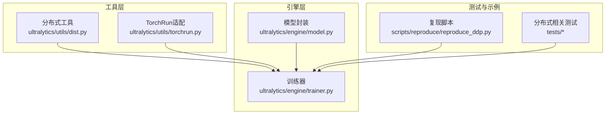
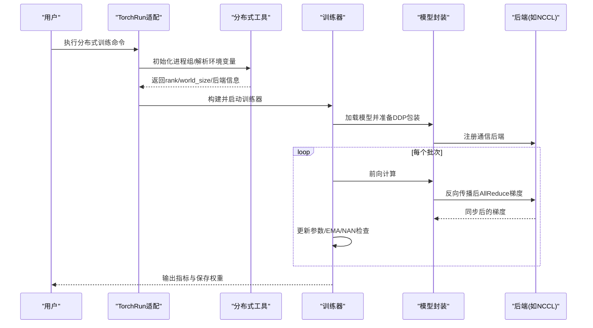
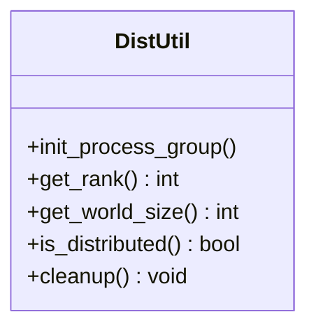
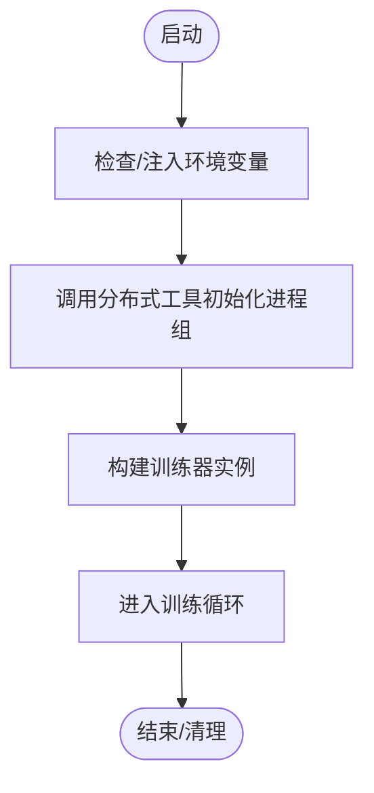
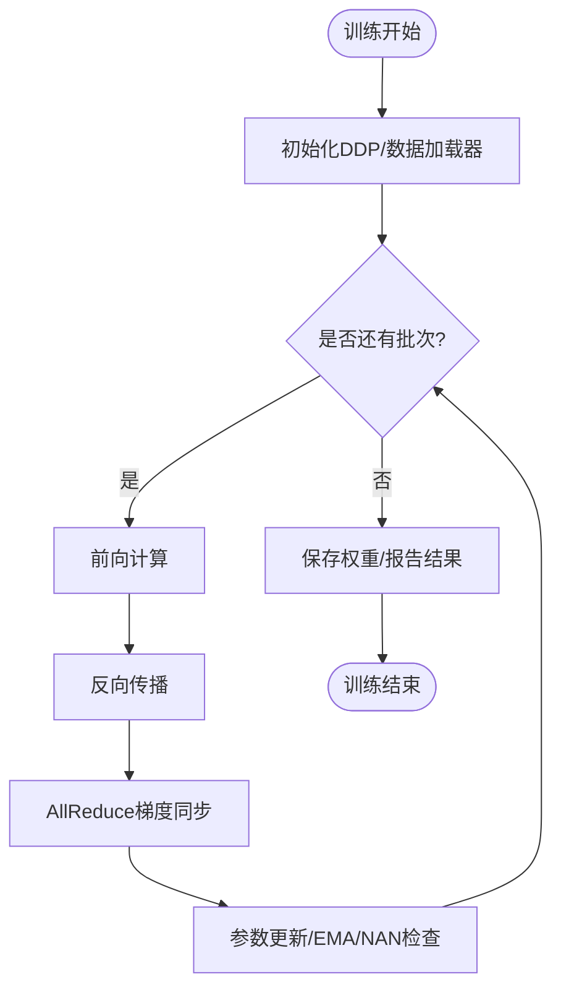
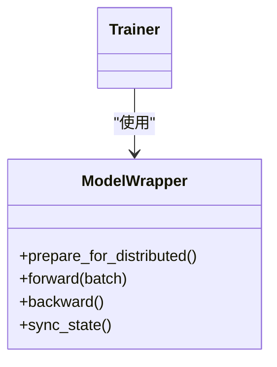
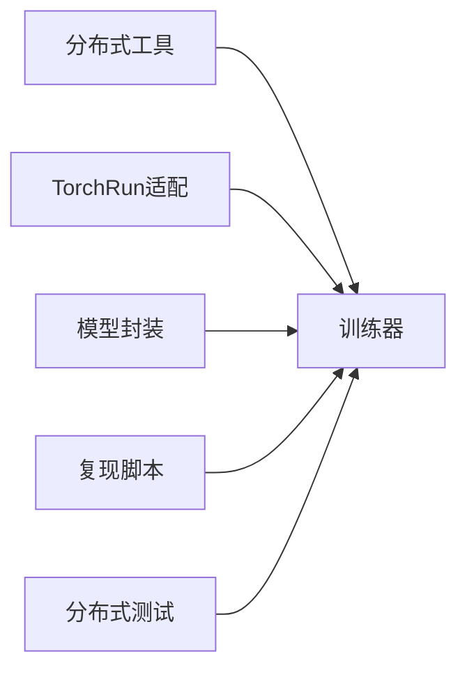

# 分布式训练

<cite>
**本文引用的文件**
- [ultralytics/utils/dist.py](file://ultralytics/utils/dist.py)
- [ultralytics/utils/torchrun.py](file://ultralytics/utils/torchrun.py)
- [ultralytics/engine/trainer.py](file://ultralytics/engine/trainer.py)
- [ultralytics/engine/model.py](file://ultralytics/engine/model.py)
- [scripts/reproduce/reproduce_ddp.py](file://scripts/reproduce/reproduce_ddp.py)
- [tests/test_ddp_device_hardening.py](file://tests/test_ddp_device_hardening.py)
- [tests/test_ddp_error_propagation_e2e.py](file://tests/test_ddp_error_propagation_e2e.py)
- [tests/test_ddp_lifecycle_ema_nan.py](file://tests/test_ddp_lifecycle_ema_nan.py)
- [tests/test_ddp_root_cause_reporting.py](file://tests/test_ddp_root_cause_reporting.py)
- [tests/ddp_moa_mot_smoke.py](file://tests/ddp_moa_mot_smoke.py)
- [tests/ddp_moe_smoke.py](file://tests/ddp_moe_smoke.py)
- [tests/ddp_moe_validation_smoke.py](file://tests/ddp_moe_validation_smoke.py)
- [tests/test_moe_ddp_fixes.py](file://tests/test_moe_ddp_fixes.py)
- [tests/test_moe_validation_collectives.py](file://tests/test_moe_validation_collectives.py)
- [tests/test_autograd_allreduce.py](file://tests/test_autograd_allreduce.py)
- [tests/test_windows_torchrun.py](file://tests/test_windows_torchrun.py)
</cite>

## 目录
1. [简介](#简介)
2. [项目结构](#项目结构)
3. [核心组件](#核心组件)
4. [架构总览](#架构总览)
5. [详细组件分析](#详细组件分析)
6. [依赖关系分析](#依赖关系分析)
7. [性能考虑](#性能考虑)
8. [故障排查指南](#故障排查指南)
9. [结论](#结论)
10. [附录](#附录)

## 简介
本文件面向YOLO-Master的分布式训练，聚焦多GPU与多机多卡场景下的配置方法、通信机制与优化实践。内容涵盖：
- DDP（Distributed Data Parallel）初始化与参数设置
- 梯度同步与负载均衡策略
- 容错与错误传播机制
- 不同硬件环境（单机多卡/多机多卡）的最佳实践
- 性能监控与调试方法

## 项目结构
本项目在分布式训练方面采用“工具层 + 引擎层 + 测试验证”的分层组织：
- 工具层：提供分布式初始化、进程组管理、torchrun适配等能力
- 引擎层：训练器负责DDP生命周期管理与数据并行调度
- 测试层：覆盖设备硬加固、错误传播、EMA/NAN处理、MoE/MoA集成等关键路径

**图示来源**
- [ultralytics/utils/dist.py](file://ultralytics/utils/dist.py)
- [ultralytics/utils/torchrun.py](file://ultralytics/utils/torchrun.py)
- [ultralytics/engine/trainer.py](file://ultralytics/engine/trainer.py)
- [ultralytics/engine/model.py](file://ultralytics/engine/model.py)
- [scripts/reproduce/reproduce_ddp.py](file://scripts/reproduce/reproduce_ddp.py)

**章节来源**
- [ultralytics/utils/dist.py](file://ultralytics/utils/dist.py)
- [ultralytics/utils/torchrun.py](file://ultralytics/utils/torchrun.py)
- [ultralytics/engine/trainer.py](file://ultralytics/engine/trainer.py)
- [ultralytics/engine/model.py](file://ultralytics/engine/model.py)
- [scripts/reproduce/reproduce_ddp.py](file://scripts/reproduce/reproduce_ddp.py)

## 核心组件
- 分布式工具模块：封装进程组创建、后端选择、环境变量解析、rank/world_size获取等基础能力
- TorchRun适配：统一通过torchrun启动，屏蔽平台差异（含Windows兼容）
- 训练器：负责DDP上下文、数据加载分片、梯度同步触发点、EMA/NAN防护、日志与回调
- 模型封装：在分布式环境下进行必要的模型包装与状态一致性保障
- 复现脚本与测试：提供端到端可运行的分布式训练入口与回归用例

**章节来源**
- [ultralytics/utils/dist.py](file://ultralytics/utils/dist.py)
- [ultralytics/utils/torchrun.py](file://ultralytics/utils/torchrun.py)
- [ultralytics/engine/trainer.py](file://ultralytics/engine/trainer.py)
- [ultralytics/engine/model.py](file://ultralytics/engine/model.py)
- [scripts/reproduce/reproduce_ddp.py](file://scripts/reproduce/reproduce_ddp.py)

## 架构总览
下图展示了从启动到训练循环的关键流程，包括进程初始化、DDP封装、数据并行与梯度同步。

**图示来源**
- [ultralytics/utils/torchrun.py](file://ultralytics/utils/torchrun.py)
- [ultralytics/utils/dist.py](file://ultralytics/utils/dist.py)
- [ultralytics/engine/trainer.py](file://ultralytics/engine/trainer.py)
- [ultralytics/engine/model.py](file://ultralytics/engine/model.py)

## 详细组件分析

### 分布式工具（dist）
- 职责
  - 解析分布式环境变量（如端口、地址、世界大小、进程ID）
  - 选择并初始化通信后端（例如NCCL）
  - 提供rank/world_size/local_rank等常用属性
  - 封装进程组生命周期（初始化/销毁）
- 关键点
  - 对异常进行捕获与上报，便于上层统一处理
  - 为不同平台提供兼容性逻辑（如Windows）

**图示来源**
- [ultralytics/utils/dist.py](file://ultralytics/utils/dist.py)

**章节来源**
- [ultralytics/utils/dist.py](file://ultralytics/utils/dist.py)

### TorchRun适配（torchrun）
- 职责
  - 统一通过torchrun启动训练任务
  - 自动注入或校验必要的环境变量
  - 屏蔽平台差异，提升跨平台可用性
- 关键点
  - Windows下特殊处理（见相关测试）
  - 与分布式工具协作完成进程组初始化

**图示来源**
- [ultralytics/utils/torchrun.py](file://ultralytics/utils/torchrun.py)

**章节来源**
- [ultralytics/utils/torchrun.py](file://ultralytics/utils/torchrun.py)
- [tests/test_windows_torchrun.py](file://tests/test_windows_torchrun.py)

### 训练器（trainer）
- 职责
  - 管理DDP生命周期：包装模型、分发数据、触发梯度同步
  - 控制批内/批间行为：数据分片、采样、缓存
  - 集成EMA、NAN检测与恢复、日志记录与回调
- 关键点
  - 在反向传播后确保所有进程同步梯度
  - 对MoE/MoA等特殊模块进行兼容性处理（见相关测试）

**图示来源**
- [ultralytics/engine/trainer.py](file://ultralytics/engine/trainer.py)

**章节来源**
- [ultralytics/engine/trainer.py](file://ultralytics/engine/trainer.py)
- [tests/test_ddp_lifecycle_ema_nan.py](file://tests/test_ddp_lifecycle_ema_nan.py)

### 模型封装（model）
- 职责
  - 在分布式环境中对模型进行必要的包装与状态一致性维护
  - 与训练器协同，确保DDP通信正确触发
- 关键点
  - 针对MoE/MoA等复杂结构的兼容性处理（见相关测试）

**图示来源**
- [ultralytics/engine/model.py](file://ultralytics/engine/model.py)

**章节来源**
- [ultralytics/engine/model.py](file://ultralytics/engine/model.py)
- [tests/ddp_moa_mot_smoke.py](file://tests/ddp_moa_mot_smoke.py)
- [tests/ddp_moe_smoke.py](file://tests/ddp_moe_smoke.py)
- [tests/ddp_moe_validation_smoke.py](file://tests/ddp_moe_validation_smoke.py)
- [tests/test_moe_ddp_fixes.py](file://tests/test_moe_ddp_fixes.py)
- [tests/test_moe_validation_collectives.py](file://tests/test_moe_validation_collectives.py)

### 复现脚本（reproduce_ddp）
- 职责
  - 提供端到端的分布式训练入口，便于快速验证与基准对比
- 关键点
  - 通过torchrun驱动，复用分布式工具与训练器能力

**章节来源**
- [scripts/reproduce/reproduce_ddp.py](file://scripts/reproduce/reproduce_ddp.py)

## 依赖关系分析
- 低耦合高内聚
  - 分布式工具独立于训练器，仅暴露必要接口
  - 训练器依赖工具层完成进程组与通信后端管理
  - 模型封装与训练器解耦，便于扩展新模块类型
- 外部依赖
  - 底层通信后端（如NCCL）由工具层选择与初始化
  - torchrun作为统一启动入口，屏蔽平台差异

**图示来源**
- [ultralytics/utils/dist.py](file://ultralytics/utils/dist.py)
- [ultralytics/utils/torchrun.py](file://ultralytics/utils/torchrun.py)
- [ultralytics/engine/trainer.py](file://ultralytics/engine/trainer.py)
- [ultralytics/engine/model.py](file://ultralytics/engine/model.py)
- [scripts/reproduce/reproduce_ddp.py](file://scripts/reproduce/reproduce_ddp.py)

**章节来源**
- [ultralytics/utils/dist.py](file://ultralytics/utils/dist.py)
- [ultralytics/utils/torchrun.py](file://ultralytics/utils/torchrun.py)
- [ultralytics/engine/trainer.py](file://ultralytics/engine/trainer.py)
- [ultralytics/engine/model.py](file://ultralytics/engine/model.py)
- [scripts/reproduce/reproduce_ddp.py](file://scripts/reproduce/reproduce_ddp.py)

## 性能考虑
- 通信与带宽
  - 合理设置world_size与batch size，避免通信成为瓶颈
  - 优先使用高性能后端（如NCCL），并确保网络拓扑最优
- 数据加载与I/O
  - 启用数据预取与并行加载，减少GPU空闲时间
  - 对大图像数据集进行分块与缓存策略优化
- 数值稳定性
  - 开启混合精度时注意梯度缩放与NAN检测
  - EMA平滑有助于稳定收敛，但需权衡更新频率
- 负载均衡
  - 确保各进程数据分布均匀，避免长尾样本导致拖尾
  - 对于MoE/MoA，关注专家路由均衡与负载统计

[本节为通用指导，不直接分析具体文件]

## 故障排查指南
- 常见错误与定位
  - 进程组初始化失败：检查环境变量、端口占用、后端可用性
  - 梯度不同步：确认反向传播后是否触发AllReduce，检查自定义模块的钩子
  - NAN/NaN损失：启用EMA/NAN检测，定位不稳定算子或学习率过大
  - 平台差异（Windows）：使用torchrun适配与对应测试用例验证
- 诊断与监控
  - 利用测试用例中的错误传播与根因上报逻辑，快速定位问题
  - 结合日志与回调，监控各进程的进度与资源使用
- 典型测试用例参考
  - 设备硬加固与错误传播
  - 生命周期与EMA/NAN处理
  - MoE/MoA在DDP下的通信与验证

**章节来源**
- [tests/test_ddp_device_hardening.py](file://tests/test_ddp_device_hardening.py)
- [tests/test_ddp_error_propagation_e2e.py](file://tests/test_ddp_error_propagation_e2e.py)
- [tests/test_ddp_lifecycle_ema_nan.py](file://tests/test_ddp_lifecycle_ema_nan.py)
- [tests/test_ddp_root_cause_reporting.py](file://tests/test_ddp_root_cause_reporting.py)
- [tests/test_autograd_allreduce.py](file://tests/test_autograd_allreduce.py)
- [tests/test_windows_torchrun.py](file://tests/test_windows_torchrun.py)

## 结论
YOLO-Master的分布式训练以工具层为核心，配合训练器与模型封装，形成清晰的分层架构。通过torchrun统一启动、完善的错误传播与诊断能力，以及针对MoE/MoA的兼容性处理，能够在单机多卡与多机多卡场景下实现高效稳定的训练。建议在生产环境中结合性能监控与调优策略，持续优化通信与I/O路径，确保大规模训练的可靠性与效率。

[本节为总结性内容，不直接分析具体文件]

## 附录
- 快速上手
  - 使用torchrun启动分布式训练，参考复现脚本与文档说明
  - 根据硬件环境选择合适的后端与参数
- 最佳实践清单
  - 明确rank/world_size与环境变量
  - 合理设置batch size与数据加载并行度
  - 启用EMA与NAN检测，定期保存检查点
  - 对MoE/MoA进行路由均衡与负载监控
- 参考用例
  - 分布式Smoke测试与MoE/MoA集成测试
  - 设备硬加固与错误传播测试

[本节为补充信息，不直接分析具体文件]