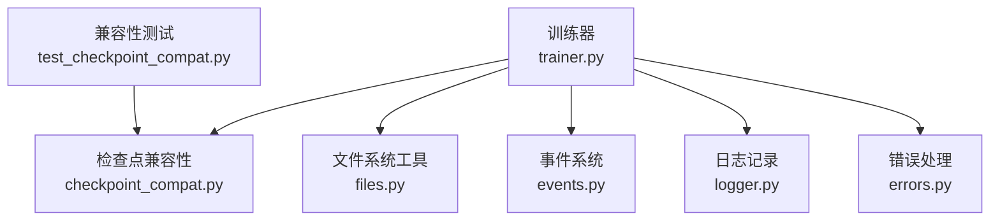
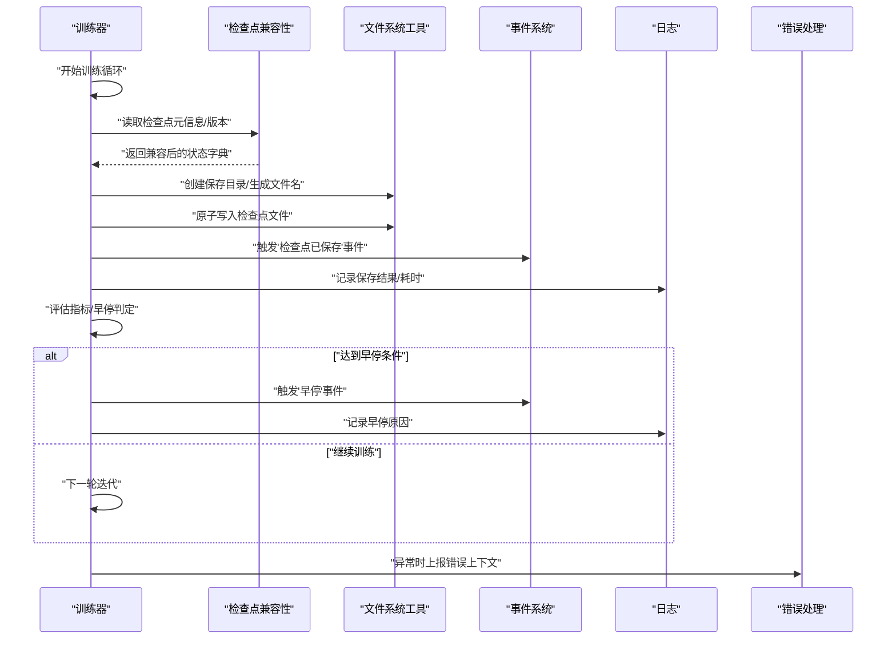
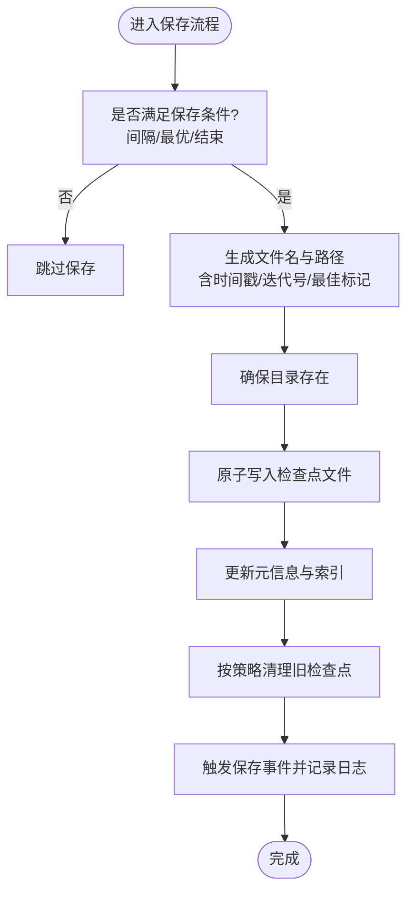
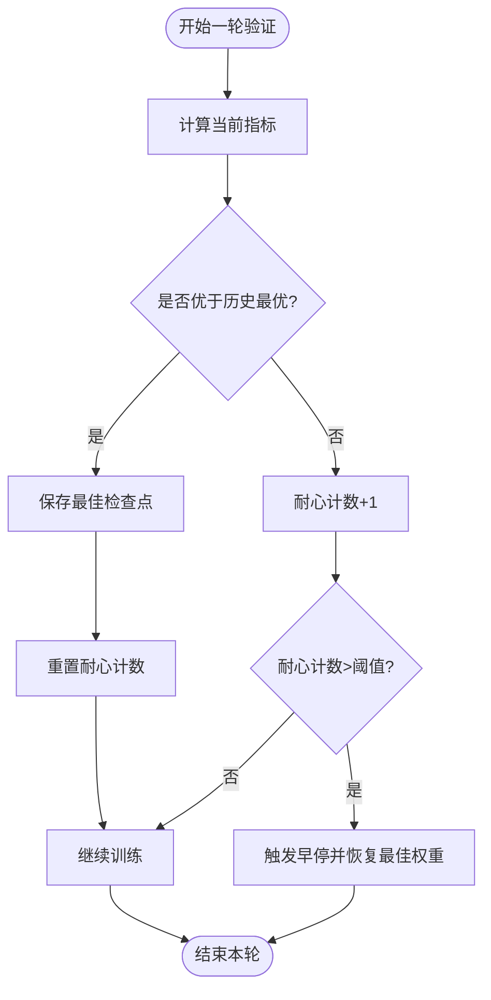
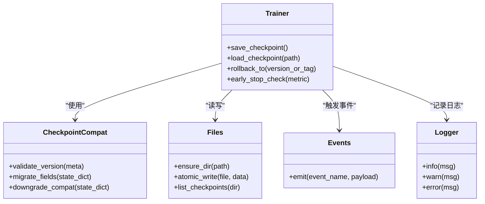
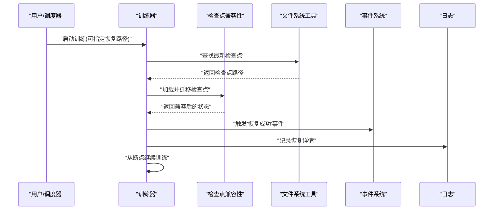
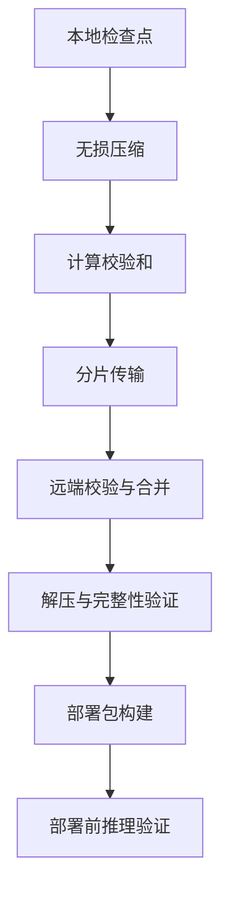
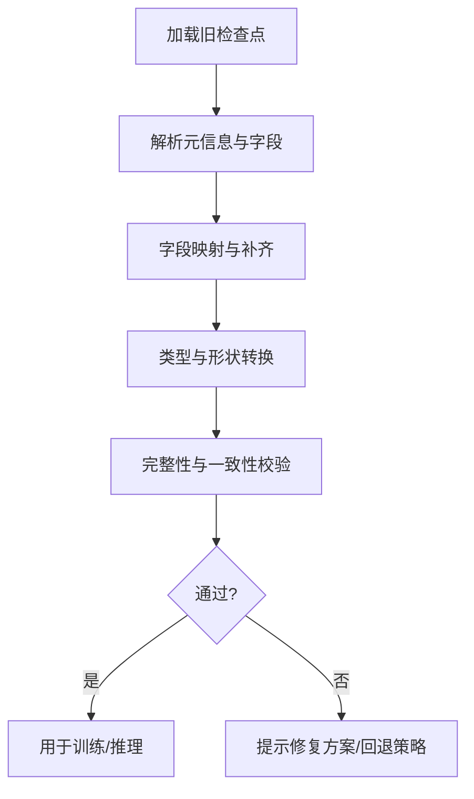
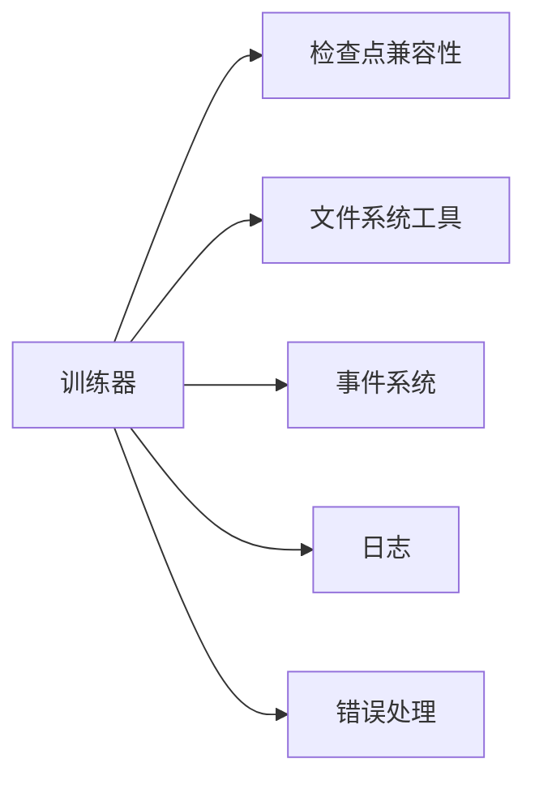

# 检查点管理

<cite>
**本文引用的文件**
- [trainer.py](file://ultralytics/engine/trainer.py)
- [checkpoint_compat.py](file://ultralytics/utils/checkpoint_compat.py)
- [files.py](file://ultralytics/utils/files.py)
- [events.py](file://ultralytics/utils/events.py)
- [logger.py](file://ultralytics/utils/logger.py)
- [errors.py](file://ultralytics/utils/errors.py)
- [test_checkpoint_compat.py](file://tests/test_checkpoint_compat.py)
</cite>

## 目录
1. [简介](#简介)
2. [项目结构](#项目结构)
3. [核心组件](#核心组件)
4. [架构总览](#架构总览)
5. [详细组件分析](#详细组件分析)
6. [依赖关系分析](#依赖关系分析)
7. [性能考量](#性能考量)
8. [故障排查指南](#故障排查指南)
9. [结论](#结论)
10. [附录](#附录)

## 简介
本文件聚焦于 YOLO-Master 的检查点（Checkpoint）管理能力，围绕以下目标展开：
- 检查点的保存策略与命名规则
- 早停机制的配置与实现原理
- 模型版本管理与回滚方法
- 训练中断恢复机制与数据持久化策略
- 检查点压缩、传输与部署最佳实践
- 检查点兼容性与迁移处理方法

文档面向不同技术背景的读者，既提供高层概览，也给出代码级分析与图示。

## 项目结构
与检查点管理直接相关的核心位置如下：
- 训练器与检查点生命周期：ultralytics/engine/trainer.py
- 检查点兼容性处理：ultralytics/utils/checkpoint_compat.py
- 文件系统工具（路径/目录/文件操作）：ultralytics/utils/files.py
- 事件回调与日志：ultralytics/utils/events.py, ultralytics/utils/logger.py
- 错误定义与传播：ultralytics/utils/errors.py
- 兼容性测试用例：tests/test_checkpoint_compat.py

图表来源
- [trainer.py](file://ultralytics/engine/trainer.py)
- [checkpoint_compat.py](file://ultralytics/utils/checkpoint_compat.py)
- [files.py](file://ultralytics/utils/files.py)
- [events.py](file://ultralytics/utils/events.py)
- [logger.py](file://ultralytics/utils/logger.py)
- [errors.py](file://ultralytics/utils/errors.py)
- [test_checkpoint_compat.py](file://tests/test_checkpoint_compat.py)

章节来源
- [trainer.py](file://ultralytics/engine/trainer.py)
- [checkpoint_compat.py](file://ultralytics/utils/checkpoint_compat.py)
- [files.py](file://ultralytics/utils/files.py)
- [events.py](file://ultralytics/utils/events.py)
- [logger.py](file://ultralytics/utils/logger.py)
- [errors.py](file://ultralytics/utils/errors.py)
- [test_checkpoint_compat.py](file://tests/test_checkpoint_compat.py)

## 核心组件
- 训练器（Trainer）
  - 负责训练循环、验证、检查点保存与加载、早停判定、断点恢复等关键流程。
- 检查点兼容性模块（Checkpoint Compatibility）
  - 负责旧版与新版检查点之间的字段映射、缺失字段补齐、类型转换与校验。
- 文件系统工具（Files）
  - 提供统一的目录创建、路径拼接、文件存在性判断、原子写入等能力。
- 事件与日志（Events & Logger）
  - 在关键节点触发事件（如保存、加载、早停），并输出结构化日志。
- 错误处理（Errors）
  - 定义检查点相关异常类型与错误码，便于上层捕获与提示。
- 兼容性测试（Test Checkpoint Compat）
  - 覆盖多版本检查点加载、字段对齐、降级/升级路径的回归测试。

章节来源
- [trainer.py](file://ultralytics/engine/trainer.py)
- [checkpoint_compat.py](file://ultralytics/utils/checkpoint_compat.py)
- [files.py](file://ultralytics/utils/files.py)
- [events.py](file://ultralytics/utils/events.py)
- [logger.py](file://ultralytics/utils/logger.py)
- [errors.py](file://ultralytics/utils/errors.py)
- [test_checkpoint_compat.py](file://tests/test_checkpoint_compat.py)

## 架构总览
下图展示了检查点在训练过程中的关键交互：训练器在合适时机调用保存/加载逻辑，必要时进行兼容性处理；通过事件系统通知外部监听者；使用文件系统工具完成持久化；遇到异常时统一上报。

图表来源
- [trainer.py](file://ultralytics/engine/trainer.py)
- [checkpoint_compat.py](file://ultralytics/utils/checkpoint_compat.py)
- [files.py](file://ultralytics/utils/files.py)
- [events.py](file://ultralytics/utils/events.py)
- [logger.py](file://ultralytics/utils/logger.py)
- [errors.py](file://ultralytics/utils/errors.py)

## 详细组件分析

### 检查点保存策略与命名规则
- 保存时机
  - 按固定步数/轮次间隔保存
  - 当验证指标优于历史最优时保存“最佳”检查点
  - 训练结束或发生早停时保存最终检查点
- 命名约定
  - 包含时间戳或迭代号，确保唯一性与可追溯性
  - “最佳”检查点采用专用后缀或别名，便于快速定位
  - 临时文件采用原子写入策略，避免部分写入导致损坏
- 保留策略
  - 仅保留最近 N 个检查点与历史最佳
  - 支持按大小阈值清理旧检查点，释放磁盘空间

图表来源
- [trainer.py](file://ultralytics/engine/trainer.py)
- [files.py](file://ultralytics/utils/files.py)
- [events.py](file://ultralytics/utils/events.py)
- [logger.py](file://ultralytics/utils/logger.py)

章节来源
- [trainer.py](file://ultralytics/engine/trainer.py)
- [files.py](file://ultralytics/utils/files.py)
- [events.py](file://ultralytics/utils/events.py)
- [logger.py](file://ultralytics/utils/logger.py)

### 早停机制的配置与实现原理
- 配置项
  - 早停耐心值（Patience）：允许验证指标不提升的最大连续轮数
  - 监控指标：如 mAP、Loss 等
  - 最小提升阈值：防止微小波动触发早停
- 实现要点
  - 每轮验证后比较当前指标与历史最优
  - 若未提升则增加耐心计数；超过阈值则触发早停
  - 早停时可自动恢复至历史最佳权重
- 事件与日志
  - 触发“早停”事件，记录原因与最后指标
  - 输出建议：调整学习率、增大耐心值或更换监控指标

图表来源
- [trainer.py](file://ultralytics/engine/trainer.py)
- [events.py](file://ultralytics/utils/events.py)
- [logger.py](file://ultralytics/utils/logger.py)

章节来源
- [trainer.py](file://ultralytics/engine/trainer.py)
- [events.py](file://ultralytics/utils/events.py)
- [logger.py](file://ultralytics/utils/logger.py)

### 模型版本管理与回滚方法
- 版本标识
  - 检查点中记录模型版本、框架版本、关键配置摘要
  - 为每次重要变更生成增量标签或快照名
- 回滚策略
  - 基于“最佳”检查点一键回滚
  - 支持指定版本号或时间戳进行精确回滚
  - 回滚前进行兼容性校验，失败则提示修复方案
- 审计与追踪
  - 将回滚动作与原因记录到日志与事件流
  - 提供回滚前后指标对比报告

图表来源
- [trainer.py](file://ultralytics/engine/trainer.py)
- [checkpoint_compat.py](file://ultralytics/utils/checkpoint_compat.py)
- [files.py](file://ultralytics/utils/files.py)
- [events.py](file://ultralytics/utils/events.py)
- [logger.py](file://ultralytics/utils/logger.py)

章节来源
- [trainer.py](file://ultralytics/engine/trainer.py)
- [checkpoint_compat.py](file://ultralytics/utils/checkpoint_compat.py)
- [files.py](file://ultralytics/utils/files.py)
- [events.py](file://ultralytics/utils/events.py)
- [logger.py](file://ultralytics/utils/logger.py)

### 训练中断恢复机制与数据持久化策略
- 断点内容
  - 模型权重、优化器状态、调度器状态、随机种子、训练进度
  - 验证集缓存、指标历史、早停计数器
- 恢复流程
  - 启动时检测是否存在最新检查点
  - 加载并执行兼容性迁移，确保字段完整与类型正确
  - 从断点处继续训练，恢复事件与日志上下文
- 持久化策略
  - 使用原子写入避免部分写入导致的损坏
  - 定期同步到远程存储（可选）以增强容灾
  - 对大张量进行分块写入与校验和校验

图表来源
- [trainer.py](file://ultralytics/engine/trainer.py)
- [checkpoint_compat.py](file://ultralytics/utils/checkpoint_compat.py)
- [files.py](file://ultralytics/utils/files.py)
- [events.py](file://ultralytics/utils/events.py)
- [logger.py](file://ultralytics/utils/logger.py)

章节来源
- [trainer.py](file://ultralytics/engine/trainer.py)
- [checkpoint_compat.py](file://ultralytics/utils/checkpoint_compat.py)
- [files.py](file://ultralytics/utils/files.py)
- [events.py](file://ultralytics/utils/events.py)
- [logger.py](file://ultralytics/utils/logger.py)

### 检查点压缩、传输与部署最佳实践
- 压缩
  - 对检查点文件进行无损压缩，减少体积与网络传输成本
  - 压缩前后进行完整性校验（如哈希）
- 传输
  - 使用断点续传与并发分片传输，提高稳定性与速度
  - 传输过程中记录校验和与元数据
- 部署
  - 部署包包含模型权重、配置文件与兼容性元数据
  - 部署前进行轻量推理验证，确保一致性
  - 为生产环境提供只读访问与版本锁定

[本节为通用实践说明，无需源码引用]

### 检查点兼容性与迁移处理方法
- 兼容性维度
  - 模型结构变化：新增/删除层、参数名变更
  - 数据类型变化：精度、布局、设备映射
  - 元数据变化：版本、配置、训练超参
- 迁移策略
  - 字段映射表：将旧字段名映射到新字段名
  - 缺失字段补齐：默认值或从其他源推断
  - 类型转换：如 dtype、device、形状对齐
  - 降级兼容：在新代码中加载旧格式检查点
- 测试保障
  - 覆盖多版本检查点加载与迁移的自动化测试
  - 对迁移前后数值一致性进行回归验证

图表来源
- [checkpoint_compat.py](file://ultralytics/utils/checkpoint_compat.py)
- [test_checkpoint_compat.py](file://tests/test_checkpoint_compat.py)

章节来源
- [checkpoint_compat.py](file://ultralytics/utils/checkpoint_compat.py)
- [test_checkpoint_compat.py](file://tests/test_checkpoint_compat.py)

## 依赖关系分析
- 内部依赖
  - 训练器依赖检查点兼容性模块进行版本与字段处理
  - 训练器依赖文件系统工具完成持久化与原子写入
  - 训练器通过事件系统与日志模块进行状态广播与记录
  - 错误处理模块贯穿各层，提供一致的异常语义
- 外部依赖
  - 分布式训练框架（如适用）的状态同步与检查点聚合
  - 对象存储或共享文件系统（可选）用于跨节点持久化

图表来源
- [trainer.py](file://ultralytics/engine/trainer.py)
- [checkpoint_compat.py](file://ultralytics/utils/checkpoint_compat.py)
- [files.py](file://ultralytics/utils/files.py)
- [events.py](file://ultralytics/utils/events.py)
- [logger.py](file://ultralytics/utils/logger.py)
- [errors.py](file://ultralytics/utils/errors.py)

章节来源
- [trainer.py](file://ultralytics/engine/trainer.py)
- [checkpoint_compat.py](file://ultralytics/utils/checkpoint_compat.py)
- [files.py](file://ultralytics/utils/files.py)
- [events.py](file://ultralytics/utils/events.py)
- [logger.py](file://ultralytics/utils/logger.py)
- [errors.py](file://ultralytics/utils/errors.py)

## 性能考量
- I/O 优化
  - 使用异步或后台线程进行保存，降低训练主循环阻塞
  - 批量写入与合并小文件，减少元数据开销
- 内存与带宽
  - 对大张量进行分块序列化，控制峰值内存
  - 启用压缩与去重，降低网络与磁盘占用
- 可靠性
  - 原子写入与校验和，避免损坏
  - 重试与断点续传，提高鲁棒性

[本节为通用指导，无需源码引用]

## 故障排查指南
- 常见问题
  - 检查点加载失败：字段缺失、类型不匹配、版本不一致
  - 早停误触发：耐心值过小、监控指标噪声大
  - 磁盘空间不足：未及时清理旧检查点
- 诊断步骤
  - 查看事件与日志中的保存/加载/早停记录
  - 使用兼容性模块的校验接口定位字段差异
  - 检查文件系统权限与可用空间
- 恢复建议
  - 回滚至最近稳定版本或最佳检查点
  - 调整早停耐心值与监控指标
  - 开启更详细的日志级别以便复现问题

章节来源
- [events.py](file://ultralytics/utils/events.py)
- [logger.py](file://ultralytics/utils/logger.py)
- [errors.py](file://ultralytics/utils/errors.py)
- [checkpoint_compat.py](file://ultralytics/utils/checkpoint_compat.py)

## 结论
YOLO-Master 的检查点管理围绕训练器为核心，结合兼容性处理、文件系统工具、事件与日志以及错误处理，形成完整的保存、恢复、回滚与迁移体系。通过合理的保存策略、早停机制与版本管理，配合压缩、传输与部署的最佳实践，可在保证可靠性的同时提升效率与可维护性。

[本节为总结性内容，无需源码引用]

## 附录
- 术语
  - 检查点：包含模型权重与训练状态的持久化快照
  - 早停：当验证指标长时间不提升时提前终止训练
  - 原子写入：确保文件要么完全写入，要么完全不写入
- 参考
  - 兼容性测试用例可作为行为契约与回归基线

[本节为补充信息，无需源码引用]