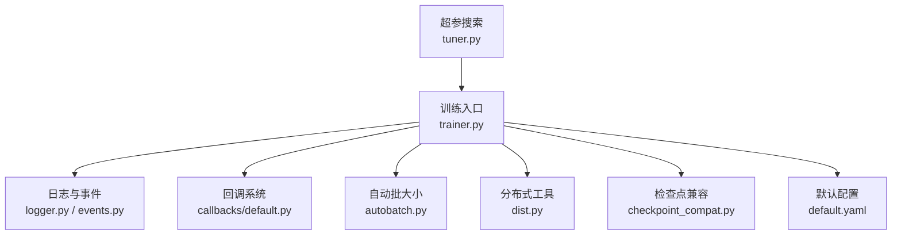
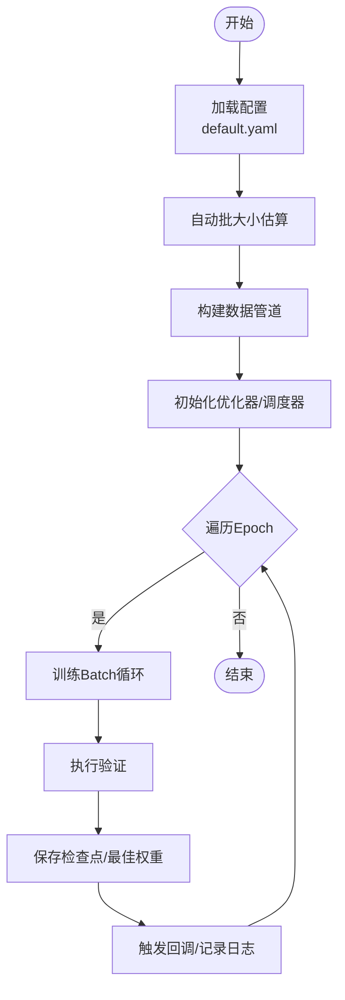
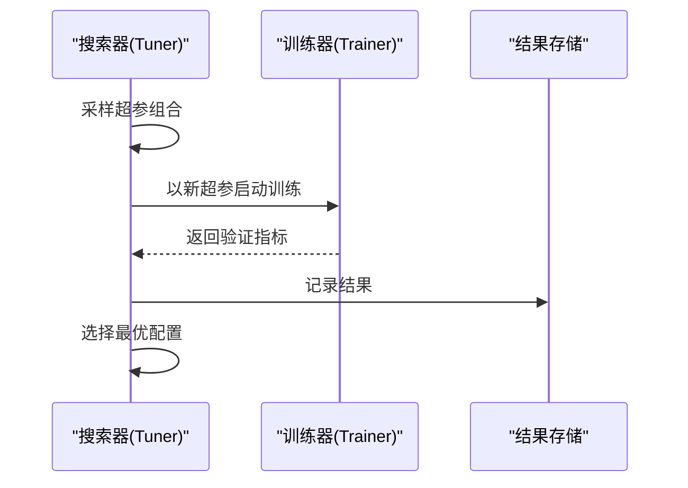
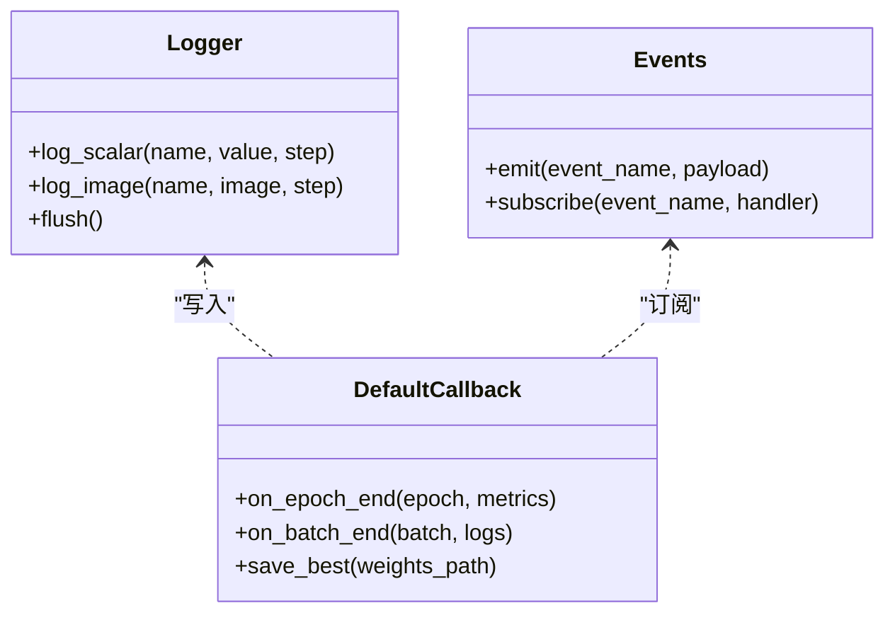
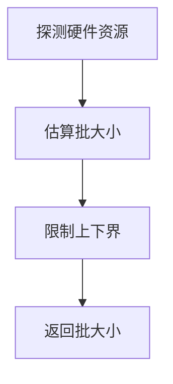
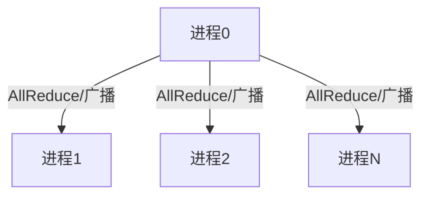
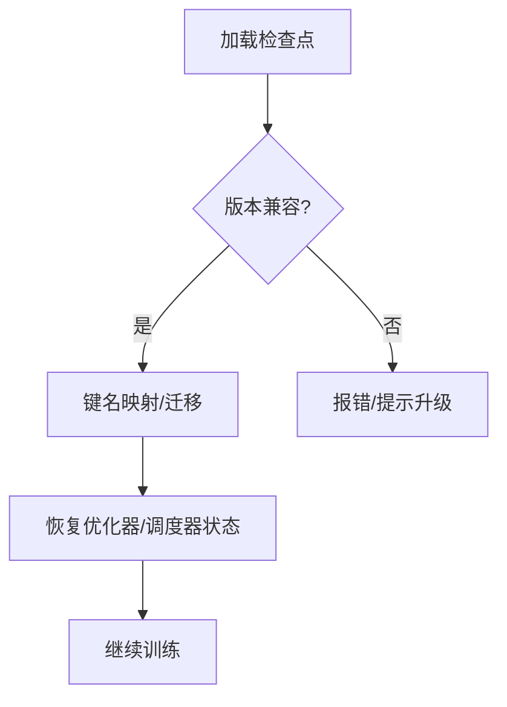
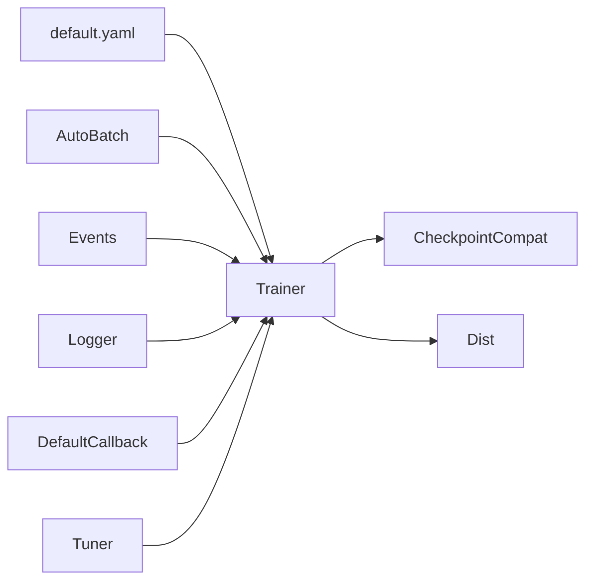

# 模型训练指南

<cite>
**本文引用的文件**
- [ultralytics/engine/trainer.py](file://ultralytics/engine/trainer.py)
- [ultralytics/engine/tuner.py](file://ultralytics/engine/tuner.py)
- [ultralytics/utils/logger.py](file://ultralytics/utils/logger.py)
- [ultralytics/utils/events.py](file://ultralytics/utils/events.py)
- [ultralytics/utils/callbacks/default.py](file://ultralytics/utils/callbacks/default.py)
- [ultralytics/utils/autobatch.py](file://ultralytics/utils/autobatch.py)
- [ultralytics/utils/dist.py](file://ultralytics/utils/dist.py)
- [ultralytics/utils/checkpoint_compat.py](file://ultralytics/utils/checkpoint_compat.py)
- [ultralytics/cfg/default.yaml](file://ultralytics/cfg/default.yaml)
- [examples/YOLOv8-LibTorch-CPP-Inference/main.cc](file://examples/YOLOv8-LibTorch-CPP-Inference/main.cc)
</cite>

## 目录
1. [简介](#简介)
2. [项目结构](#项目结构)
3. [核心组件](#核心组件)
4. [架构总览](#架构总览)
5. [详细组件分析](#详细组件分析)
6. [依赖关系分析](#依赖关系分析)
7. [性能考虑](#性能考虑)
8. [故障排查指南](#故障排查指南)
9. [结论](#结论)
10. [附录](#附录)

## 简介
本指南面向希望系统掌握 YOLO-Master 模型训练全流程的工程师与研究者，覆盖训练配置、超参数调优策略、分布式与多GPU最佳实践、监控与日志（含TensorBoard集成）、早停与检查点管理、中断恢复、消融实验设计与结果分析，以及训练过程的问题诊断与性能调优技巧。文档以代码仓库中的实际实现为依据，提供可追溯的来源定位，帮助读者快速落地并高效迭代。

## 项目结构
围绕训练相关能力，本项目在以下模块中提供了关键实现：
- 训练引擎与流程控制：位于 ultralytics/engine/trainer.py
- 自动超参搜索：位于 ultralytics/engine/tuner.py
- 日志与事件记录：位于 ultralytics/utils/logger.py、ultralytics/utils/events.py
- 回调机制（含默认回调）：位于 ultralytics/utils/callbacks/default.py
- 自动批大小选择：位于 ultralytics/utils/autobatch.py
- 分布式通信工具：位于 ultrynamics/utils/dist.py
- 检查点兼容与迁移：位于 ultralytics/utils/checkpoint_compat.py
- 默认训练配置：位于 ultralytics/cfg/default.yaml
- 示例推理入口（辅助理解导出/部署链路）：examples/YOLOv8-LibTorch-CPP-Inference/main.cc



图表来源
- [ultralytics/engine/trainer.py](file://ultralytics/engine/trainer.py)
- [ultralytics/utils/logger.py](file://ultralytics/utils/logger.py)
- [ultralytics/utils/events.py](file://ultralytics/utils/events.py)
- [ultralytics/utils/callbacks/default.py](file://ultralytics/utils/callbacks/default.py)
- [ultralytics/utils/autobatch.py](file://ultralytics/utils/autobatch.py)
- [ultralytics/utils/dist.py](file://ultralytics/utils/dist.py)
- [ultralytics/utils/checkpoint_compat.py](file://ultralytics/utils/checkpoint_compat.py)
- [ultralytics/cfg/default.yaml](file://ultralytics/cfg/default.yaml)
- [ultralytics/engine/tuner.py](file://ultralytics/engine/tuner.py)

章节来源
- [ultralytics/engine/trainer.py](file://ultralytics/engine/trainer.py)
- [ultralytics/engine/tuner.py](file://ultralytics/engine/tuner.py)
- [ultralytics/utils/logger.py](file://ultralytics/utils/logger.py)
- [ultralytics/utils/events.py](file://ultralytics/utils/events.py)
- [ultralytics/utils/callbacks/default.py](file://ultralytics/utils/callbacks/default.py)
- [ultralytics/utils/autobatch.py](file://ultralytics/utils/autobatch.py)
- [ultralytics/utils/dist.py](file://ultralytics/utils/dist.py)
- [ultralytics/utils/checkpoint_compat.py](file://ultralytics/utils/checkpoint_compat.py)
- [ultralytics/cfg/default.yaml](file://ultralytics/cfg/default.yaml)

## 核心组件
- 训练器（Trainer）
  - 负责加载配置、构建数据管道、初始化优化器与学习率调度器、执行训练循环、验证、保存检查点、触发回调与记录事件。
  - 典型职责包括：解析 default.yaml 或任务特定配置；根据设备与显存自适应批大小；管理分布式环境；处理异常与恢复。
- 超参搜索器（Tuner）
  - 基于 Trainer 封装自动化搜索流程，支持网格/随机/贝叶斯等策略（具体由实现决定），输出最优配置与对应指标。
- 日志与事件系统
  - Logger 统一写入控制台、文件与第三方可视化后端（如 TensorBoard）。
  - Events 定义训练生命周期事件（epoch/batch 开始/结束、验证、保存等），供回调订阅。
- 回调系统
  - Default Callback 提供默认行为：打印进度、保存最佳权重、记录曲线、生成报告等。
- 自动批大小（AutoBatch）
  - 依据硬件资源估算最大可用 batch size，避免 OOM 并提升吞吐。
- 分布式工具（Dist）
  - 封装进程间通信、同步、广播、归约等操作，支撑多卡/多机训练。
- 检查点兼容（Checkpoint Compat）
  - 提供旧版本权重格式到新版本的兼容映射与迁移逻辑，保障断点续训与跨版本复用。
- 默认配置（Default YAML）
  - 集中定义数据集路径、模型结构、训练超参、增强策略、优化器与调度器等。

章节来源
- [ultralytics/engine/trainer.py](file://ultralytics/engine/trainer.py)
- [ultralytics/engine/tuner.py](file://ultralytics/engine/tuner.py)
- [ultralytics/utils/logger.py](file://ultralytics/utils/logger.py)
- [ultralytics/utils/events.py](file://ultralytics/utils/events.py)
- [ultralytics/utils/callbacks/default.py](file://ultralytics/utils/callbacks/default.py)
- [ultralytics/utils/autobatch.py](file://ultralytics/utils/autobatch.py)
- [ultralytics/utils/dist.py](file://ultralytics/utils/dist.py)
- [ultralytics/utils/checkpoint_compat.py](file://ultralytics/utils/checkpoint_compat.py)
- [ultralytics/cfg/default.yaml](file://ultralytics/cfg/default.yaml)

## 架构总览
下图展示了训练主流程的关键交互：从配置加载到训练循环、验证、检查点保存与日志记录，以及分布式与自动批大小的参与。

```mermaid
sequenceDiagram
participant U as "用户脚本"
participant T as "训练器(Trainer)"
participant CFG as "配置(default.yaml)"
participant AB as "自动批大小(AutoBatch)"
participant DS as "数据管道"
participant OPT as "优化器/调度器"
participant VAL as "验证器"
participant CKPT as "检查点/兼容层"
participant LOG as "日志/事件"
participant CB as "回调(Default)"
participant DIST as "分布式(Dist)"
U->>T : 启动训练
T->>CFG : 读取训练配置
T->>AB : 估算批大小
AB-->>T : 返回批大小
T->>DS : 构建数据集/加载器
T->>OPT : 初始化优化器与调度器
loop 每个Epoch
T->>DIST : 同步/广播必要状态
T->>LOG : 触发 epoch_start 事件
loop 每个Batch
T->>LOG : 触发 batch_start 事件
T->>DS : 获取批次数据
T->>OPT : 前向/反向/更新
T->>LOG : 触发 batch_end 事件
end
T->>VAL : 执行验证
VAL-->>T : 返回指标
T->>CKPT : 保存检查点/最佳权重
T->>CB : 调用 on_epoch_end 回调
T->>LOG : 触发 epoch_end 事件
end
T->>LOG : 触发 train_end 事件
```

图表来源
- [ultralytics/engine/trainer.py](file://ultralytics/engine/trainer.py)
- [ultralytics/utils/autobatch.py](file://ultralytics/utils/autobatch.py)
- [ultralytics/utils/events.py](file://ultralytics/utils/events.py)
- [ultralytics/utils/logger.py](file://ultralytics/utils/logger.py)
- [ultralytics/utils/callbacks/default.py](file://ultralytics/utils/callbacks/default.py)
- [ultralytics/utils/dist.py](file://ultralytics/utils/dist.py)
- [ultralytics/utils/checkpoint_compat.py](file://ultralytics/utils/checkpoint_compat.py)
- [ultralytics/cfg/default.yaml](file://ultralytics/cfg/default.yaml)

## 详细组件分析

### 训练器（Trainer）与训练流程
- 配置解析与合并
  - 从 default.yaml 或任务配置文件加载参数，合并运行时覆盖项。
- 数据与批大小
  - 通过 AutoBatch 估算最大批大小，结合数据加载器进行并行与缓存。
- 优化器与学习率调度
  - 根据配置创建优化器与调度器，支持余弦退火、线性预热等常见策略。
- 训练循环与验证
  - 按 Epoch/Batch 推进，周期性执行验证并记录指标。
- 检查点与恢复
  - 定期保存检查点，支持断点续训与跨版本兼容。
- 分布式训练
  - 使用 Dist 进行进程间同步、梯度归约与广播。
- 回调与日志
  - 通过事件驱动回调，默认回调负责保存最佳权重、绘制曲线、生成报告等。



图表来源
- [ultralytics/engine/trainer.py](file://ultralytics/engine/trainer.py)
- [ultralytics/utils/autobatch.py](file://ultralytics/utils/autobatch.py)
- [ultralytics/cfg/default.yaml](file://ultralytics/cfg/default.yaml)

章节来源
- [ultralytics/engine/trainer.py](file://ultralytics/engine/trainer.py)
- [ultralytics/utils/autobatch.py](file://ultralytics/utils/autobatch.py)
- [ultralytics/cfg/default.yaml](file://ultralytics/cfg/default.yaml)

### 超参搜索器（Tuner）
- 目标
  - 在给定搜索空间内自动评估不同超参组合，输出最优配置与指标。
- 工作流
  - 读取基础配置 -> 采样超参 -> 调用 Trainer 执行训练 -> 收集指标 -> 选择最优。
- 适用场景
  - 学习率、批量大小、优化器参数、正则化强度、数据增强强度等。



图表来源
- [ultralytics/engine/tuner.py](file://ultralytics/engine/tuner.py)
- [ultralytics/engine/trainer.py](file://ultralytics/engine/trainer.py)

章节来源
- [ultralytics/engine/tuner.py](file://ultralytics/engine/tuner.py)
- [ultralytics/engine/trainer.py](file://ultralytics/engine/trainer.py)

### 日志与事件系统（Logger + Events）
- 事件类型
  - 训练阶段事件：epoch_start、batch_start、batch_end、epoch_end、train_end 等。
  - 验证事件：val_start、val_end、metrics 等。
- 日志输出
  - 控制台、本地文件、第三方后端（如 TensorBoard）。
- 回调订阅
  - 默认回调订阅关键事件，完成保存、绘图、统计等。



图表来源
- [ultralytics/utils/logger.py](file://ultralytics/utils/logger.py)
- [ultralytics/utils/events.py](file://ultralytics/utils/events.py)
- [ultralytics/utils/callbacks/default.py](file://ultralytics/utils/callbacks/default.py)

章节来源
- [ultralytics/utils/logger.py](file://ultralytics/utils/logger.py)
- [ultralytics/utils/events.py](file://ultralytics/utils/events.py)
- [ultralytics/utils/callbacks/default.py](file://ultralytics/utils/callbacks/default.py)

### 自动批大小（AutoBatch）
- 原理
  - 探测设备显存/内存，估算最大可容纳批大小，避免 OOM。
- 使用方式
  - 训练器在初始化阶段调用，返回适合当前硬件的批大小。
- 注意事项
  - 若自定义数据增强较重，建议保守设置上限或手动指定批大小。



图表来源
- [ultralytics/utils/autobatch.py](file://ultralytics/utils/autobatch.py)

章节来源
- [ultralytics/utils/autobatch.py](file://ultralytics/utils/autobatch.py)

### 分布式训练（Dist）
- 功能
  - 进程间通信、梯度同步、广播、归约、屏障等待等。
- 使用要点
  - 确保各进程正确初始化；合理设置全局批大小与每卡批大小；注意数据划分与洗牌。
- 常见问题
  - 进程死锁、NCCL 错误、显存不均衡等。



图表来源
- [ultralytics/utils/dist.py](file://ultralytics/utils/dist.py)

章节来源
- [ultralytics/utils/dist.py](file://ultralytics/utils/dist.py)

### 检查点兼容与恢复（Checkpoint Compat）
- 兼容性
  - 提供新旧权重格式映射，支持跨版本加载。
- 恢复训练
  - 从最近检查点或指定步数恢复，继续优化器状态与训练进度。
- 最佳权重
  - 根据验证指标保存最佳权重，便于后续推理或迁移。



图表来源
- [ultralytics/utils/checkpoint_compat.py](file://ultralytics/utils/checkpoint_compat.py)

章节来源
- [ultralytics/utils/checkpoint_compat.py](file://ultralytics/utils/checkpoint_compat.py)

### 默认配置（Default YAML）
- 内容范围
  - 数据集路径、类别信息、输入尺寸、模型结构、训练超参（学习率、批量大小、优化器、调度器）、数据增强、验证频率、保存策略等。
- 使用建议
  - 以 default.yaml 为基线，针对任务微调；将任务特定参数放入独立配置文件并通过命令行覆盖。

章节来源
- [ultralytics/cfg/default.yaml](file://ultralytics/cfg/default.yaml)

### 示例推理入口（辅助理解导出/部署链路）
- 作用
  - 展示如何加载导出后的模型并进行推理，有助于理解训练后模型的部署路径。
- 关联
  - 训练产出的权重/导出模型可用于该入口进行验证。

章节来源
- [examples/YOLOv8-LibTorch-CPP-Inference/main.cc](file://examples/YOLOv8-LibTorch-CPP-Inference/main.cc)

## 依赖关系分析
- 耦合关系
  - Trainer 强依赖配置、事件、日志、回调、自动批大小与分布式工具。
  - Tuner 依赖 Trainer 作为黑盒执行单元。
  - Logger/Events 被 Trainer 与回调广泛使用。
- 外部集成
  - 可通过 Logger 接入 TensorBoard 等第三方可视化工具。
  - 分布式依赖底层通信库（如 NCCL）。



图表来源
- [ultralytics/engine/trainer.py](file://ultralytics/engine/trainer.py)
- [ultralytics/engine/tuner.py](file://ultralytics/engine/tuner.py)
- [ultralytics/utils/autobatch.py](file://ultralytics/utils/autobatch.py)
- [ultralytics/utils/events.py](file://ultralytics/utils/events.py)
- [ultralytics/utils/logger.py](file://ultralytics/utils/logger.py)
- [ultralytics/utils/callbacks/default.py](file://ultralytics/utils/callbacks/default.py)
- [ultralytics/utils/checkpoint_compat.py](file://ultralytics/utils/checkpoint_compat.py)
- [ultralytics/utils/dist.py](file://ultralytics/utils/dist.py)
- [ultralytics/cfg/default.yaml](file://ultralytics/cfg/default.yaml)

章节来源
- [ultralytics/engine/trainer.py](file://ultralytics/engine/trainer.py)
- [ultralytics/engine/tuner.py](file://ultralytics/engine/tuner.py)
- [ultralytics/utils/autobatch.py](file://ultralytics/utils/autobatch.py)
- [ultralytics/utils/events.py](file://ultralytics/utils/events.py)
- [ultralytics/utils/logger.py](file://ultralytics/utils/logger.py)
- [ultralytics/utils/callbacks/default.py](file://ultralytics/utils/callbacks/default.py)
- [ultralytics/utils/checkpoint_compat.py](file://ultralytics/utils/checkpoint_compat.py)
- [ultralytics/utils/dist.py](file://ultralytics/utils/dist.py)
- [ultralytics/cfg/default.yaml](file://ultralytics/cfg/default.yaml)

## 性能考虑
- 批大小与吞吐
  - 优先使用 AutoBatch 估算，再根据 GPU 利用率与显存占用微调。
- 数据管道
  - 启用预取与多线程加载，减少 I/O 瓶颈；对大图像采用分块或缩放策略。
- 混合精度
  - 开启半精度训练以提升吞吐与降低显存占用（需关注数值稳定性）。
- 分布式
  - 合理设置全局批大小与每卡批大小；确保网络带宽与通信开销可控。
- 验证频率
  - 平衡验证成本与监控粒度，避免频繁验证拖慢训练。
- 检查点策略
  - 仅保存最佳权重与必要间隔的检查点，节省磁盘与IO压力。

[本节为通用指导，无需源码引用]

## 故障排查指南
- 训练崩溃与异常
  - 查看日志与事件记录，定位失败阶段（数据加载、前向、反向、验证、保存）。
  - 检查分布式通信错误（如 NCCL 问题）与进程状态。
- 显存不足（OOM）
  - 降低批大小、关闭不必要的增强、启用混合精度、减小输入分辨率。
- 收敛缓慢或不稳定
  - 调整学习率与调度器；检查数据质量与标签一致性；适当增加预热步数。
- 检查点无法恢复
  - 确认检查点版本兼容性，必要时使用兼容层进行迁移。
- 指标异常
  - 核对验证集划分与指标计算逻辑；检查回调是否正确保存最佳权重。

章节来源
- [ultralytics/utils/logger.py](file://ultralytics/utils/logger.py)
- [ultralytics/utils/events.py](file://ultralytics/utils/events.py)
- [ultralytics/utils/callbacks/default.py](file://ultralytics/utils/callbacks/default.py)
- [ultralytics/utils/dist.py](file://ultralytics/utils/dist.py)
- [ultralytics/utils/checkpoint_compat.py](file://ultralytics/utils/checkpoint_compat.py)

## 结论
YOLO-Master 的训练体系以 Trainer 为核心，配合事件驱动的日志与回调、自动批大小与分布式工具，形成可扩展、可观测、易恢复的训练平台。通过默认配置与超参搜索器，用户可以快速上手并系统化地进行超参调优。建议在真实任务中结合监控与消融实验，持续迭代以获得更稳健的性能。

[本节为总结性内容，无需源码引用]

## 附录

### 训练配置文件结构与参数含义（基于 default.yaml）
- 数据集与任务
  - 数据集根路径、类别列表、训练/验证集划分、输入尺寸等。
- 模型与结构
  - 模型名称/路径、骨干与头结构、通道数、深度/宽度系数等。
- 训练超参
  - 学习率、批量大小、优化器类型与参数、学习率调度器、权重衰减、动量等。
- 数据增强
  - 几何变换、色彩抖动、MixUp/Copy-Paste、Mosaic 等开关与强度。
- 验证与保存
  - 验证频率、保存间隔、最佳权重保存策略、检查点保留数量。
- 日志与可视化
  - 日志级别、是否启用 TensorBoard、输出目录等。
- 分布式与环境
  - 进程数、设备选择、通信后端、NCCL 相关参数等。

章节来源
- [ultralytics/cfg/default.yaml](file://ultralytics/cfg/default.yaml)

### 超参数调优策略与方法
- 学习率调度
  - 常用策略：线性预热+余弦退火；根据任务规模与数据量调整预热步数与最小学习率。
- 批量大小
  - 先由 AutoBatch 估算，再根据验证指标与显存占用微调；分布式时注意全局批大小与每卡批大小的比例。
- 优化器配置
  - AdamW/SGD 的选择与权重衰减、动量参数的搭配；小数据集倾向 AdamW，大数据集 SGD 常表现更稳。
- 数据增强强度
  - 过强增强可能导致标签噪声放大，需结合任务特性与数据质量调节。
- 自动搜索
  - 使用 Tuner 在合理搜索空间内进行批量评估，筛选最优配置。

章节来源
- [ultralytics/engine/tuner.py](file://ultralytics/engine/tuner.py)
- [ultralytics/utils/autobatch.py](file://ultralytics/utils/autobatch.py)
- [ultralytics/cfg/default.yaml](file://ultralytics/cfg/default.yaml)

### 分布式训练与多GPU最佳实践
- 进程初始化
  - 确保所有进程正确初始化分布式环境，设置正确的 rank/world_size。
- 数据划分
  - 使用分布式数据加载器，保证每个进程的数据子集无重叠且均匀分布。
- 通信与同步
  - 合理设置 AllReduce 频率，避免过多同步导致通信瓶颈。
- 显存与负载均衡
  - 监控各卡显存使用，必要时调整批大小或梯度累积。
- 容错与恢复
  - 定期检查点保存，支持进程失败后从最近检查点恢复。

章节来源
- [ultralytics/utils/dist.py](file://ultralytics/utils/dist.py)
- [ultralytics/utils/checkpoint_compat.py](file://ultralytics/utils/checkpoint_compat.py)

### 监控与日志记录（含 TensorBoard 集成）
- 事件订阅
  - 在关键阶段（epoch/batch/验证）记录标量与图像，便于可视化。
- TensorBoard 集成
  - 通过 Logger 将指标写入 TensorBoard，观察损失、指标随步数变化趋势。
- 报告生成
  - 默认回调可在训练结束后生成汇总报告，便于对比与归档。

章节来源
- [ultralytics/utils/logger.py](file://ultralytics/utils/logger.py)
- [ultralytics/utils/events.py](file://ultralytics/utils/events.py)
- [ultralytics/utils/callbacks/default.py](file://ultralytics/utils/callbacks/default.py)

### 早停机制、检查点管理与中断恢复
- 早停
  - 基于验证指标（如 mAP）设定耐心值，当指标长时间不提升则停止训练。
- 检查点管理
  - 保存最佳权重与最近 N 个检查点，避免磁盘膨胀。
- 中断恢复
  - 从最近检查点恢复训练状态（优化器/调度器/随机种子），继续训练直至收敛。

章节来源
- [ultralytics/utils/callbacks/default.py](file://ultralytics/utils/callbacks/default.py)
- [ultralytics/utils/checkpoint_compat.py](file://ultralytics/utils/checkpoint_compat.py)

### 消融实验设计与结果分析方法
- 设计原则
  - 每次仅改变一个变量（如学习率、增强强度、MoE 路由策略），保持其他条件一致。
- 指标选择
  - 主要指标（mAP、召回率、精确率）与效率指标（吞吐、延迟、显存占用）。
- 结果呈现
  - 使用表格与曲线图对比不同配置下的表现，标注显著差异。
- 复现与归档
  - 记录完整配置与随机种子，确保结果可复现。

[本节为方法论指导，无需源码引用]

### 训练过程问题诊断与性能调优技巧
- 诊断步骤
  - 查看日志与事件，定位失败阶段；检查数据加载与预处理；验证分布式通信。
- 性能调优
  - 调整批大小与数据并行度；启用混合精度；优化 I/O 与缓存；减少不必要的日志与可视化。
- 稳定性提升
  - 梯度裁剪、数值稳定化、学习率预热与回退策略。

章节来源
- [ultralytics/utils/logger.py](file://ultralytics/utils/logger.py)
- [ultralytics/utils/events.py](file://ultralytics/utils/events.py)
- [ultralytics/utils/autobatch.py](file://ultralytics/utils/autobatch.py)
- [ultralytics/utils/dist.py](file://ultralytics/utils/dist.py)