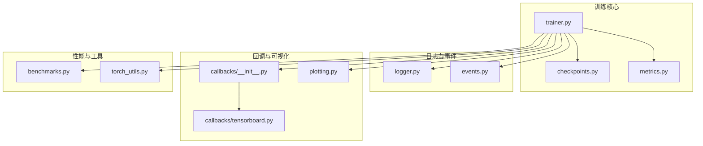
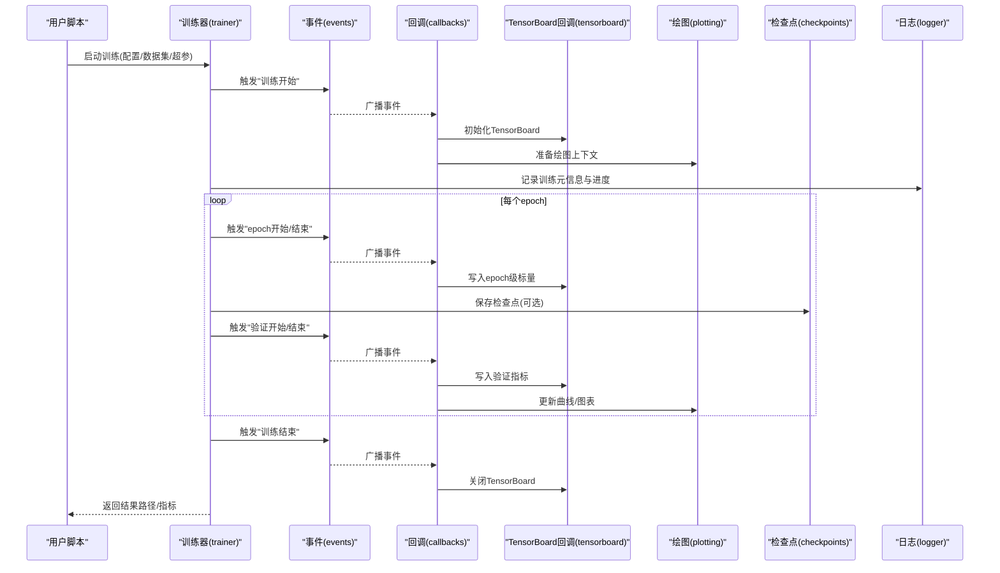
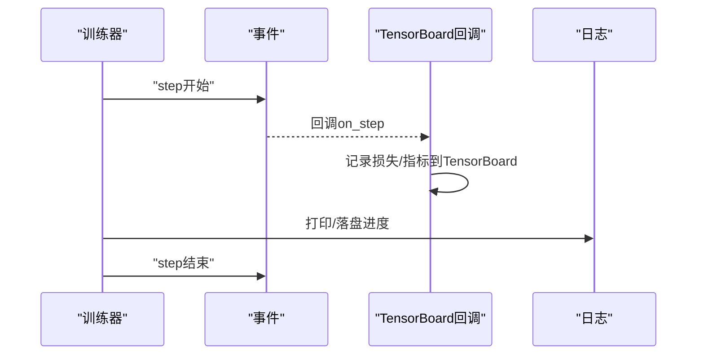
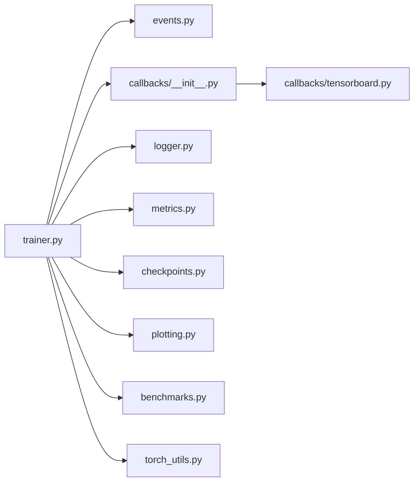

# 监控与日志

<cite>
**本文引用的文件**
- [ultralytics/utils/logger.py](file://ultralytics/utils/logger.py)
- [ultralytics/utils/events.py](file://ultralytics/utils/events.py)
- [ultralytics/engine/trainer.py](file://ultralytics/engine/trainer.py)
- [ultralytics/utils/callbacks/__init__.py](file://ultralytics/utils/callbacks/__init__.py)
- [ultralytics/utils/callbacks/tensorboard.py](file://ultralytics/utils/callbacks/tensorboard.py)
- [ultralytics/utils/plotting.py](file://ultralytics/utils/plotting.py)
- [ultralytics/utils/benchmarks.py](file://ultralytics/utils/benchmarks.py)
- [ultralytics/utils/checkpoints.py](file://ultralytics/utils/checkpoints.py)
- [ultralytics/utils/metrics.py](file://ultralytics/utils/metrics.py)
- [ultralytics/utils/torch_utils.py](file://ultralytics/utils/torch_utils.py)
- [examples/YOLOv8-ONNXRuntime-Python/main.py](file://examples/YOLOv8-ONNXRuntime-Python/main.py)
</cite>

## 目录
1. [简介](#简介)
2. [项目结构](#项目结构)
3. [核心组件](#核心组件)
4. [架构总览](#架构总览)
5. [详细组件分析](#详细组件分析)
6. [依赖关系分析](#依赖关系分析)
7. [性能考虑](#性能考虑)
8. [故障排查指南](#故障排查指南)
9. [结论](#结论)
10. [附录](#附录)

## 简介
本指南聚焦于YOLO-Master的训练监控与日志记录，覆盖以下主题：
- TensorBoard集成与可视化方法
- 训练曲线分析与解读（损失函数变化、指标趋势）
- 性能监控工具与方法（GPU利用率、内存使用、训练速度）
- 自定义回调函数的开发与训练过程干预
- 日志格式规范与调试信息提取方法

目标是帮助读者在训练过程中高效观测模型收敛、定位问题并优化性能。

## 项目结构
与“监控与日志”相关的代码主要分布在以下模块：
- 日志与事件系统：logger、events
- 训练主循环：trainer
- 回调机制：callbacks（含TensorBoard回调）
- 绘图与可视化：plotting
- 基准测试与性能统计：benchmarks
- 检查点与指标：checkpoints、metrics
- 设备与张量工具：torch_utils

图表来源
- [ultralytics/engine/trainer.py](file://ultralytics/engine/trainer.py)
- [ultralytics/utils/logger.py](file://ultralytics/utils/logger.py)
- [ultralytics/utils/events.py](file://ultralytics/utils/events.py)
- [ultralytics/utils/callbacks/__init__.py](file://ultralytics/utils/callbacks/__init__.py)
- [ultralytics/utils/callbacks/tensorboard.py](file://ultralytics/utils/callbacks/tensorboard.py)
- [ultralytics/utils/plotting.py](file://ultralytics/utils/plotting.py)
- [ultralytics/utils/benchmarks.py](file://ultralytics/utils/benchmarks.py)
- [ultralytics/utils/checkpoints.py](file://ultralytics/utils/checkpoints.py)
- [ultralytics/utils/metrics.py](file://ultralytics/utils/metrics.py)
- [ultralytics/utils/torch_utils.py](file://ultralytics/utils/torch_utils.py)

章节来源
- [ultralytics/engine/trainer.py](file://ultralytics/engine/trainer.py)
- [ultralytics/utils/logger.py](file://ultralytics/utils/logger.py)
- [ultralytics/utils/events.py](file://ultralytics/utils/events.py)
- [ultralytics/utils/callbacks/__init__.py](file://ultralytics/utils/callbacks/__init__.py)
- [ultralytics/utils/callbacks/tensorboard.py](file://ultralytics/utils/callbacks/tensorboard.py)
- [ultralytics/utils/plotting.py](file://ultralytics/utils/plotting.py)
- [ultralytics/utils/benchmarks.py](file://ultralytics/utils/benchmarks.py)
- [ultralytics/utils/checkpoints.py](file://ultralytics/utils/checkpoints.py)
- [ultralytics/utils/metrics.py](file://ultralytics/utils/metrics.py)
- [ultralytics/utils/torch_utils.py](file://ultralytics/utils/torch_utils.py)

## 核心组件
- 日志器（logger）：统一输出控制台与文件日志，提供结构化字段（如阶段、步数、时间戳等），便于检索与分析。
- 事件系统（events）：定义训练生命周期事件（开始、结束、每步、每轮验证等），供回调订阅。
- 训练器（trainer）：驱动训练主循环，按阶段触发事件、记录指标、保存检查点、调用回调。
- 回调框架（callbacks）：解耦训练流程与横切关注点（如TensorBoard写入、进度条、早停等）。
- TensorBoard回调（tensorboard）：将标量、图像、直方图、参数分布等写入TensorBoard。
- 绘图（plotting）：生成训练曲线、混淆矩阵、PR曲线等静态图或交互式图。
- 基准测试（benchmarks）：评估推理速度与资源占用，辅助性能调优。
- 检查点（checkpoints）：保存/恢复权重与元数据，支持断点续训与最佳模型选择。
- 指标（metrics）：计算mAP、精度、召回率、F1等任务相关指标。
- 设备工具（torch_utils）：封装GPU/CPU设备查询、显存统计、AMP等工具。

章节来源
- [ultralytics/utils/logger.py](file://ultralytics/utils/logger.py)
- [ultralytics/utils/events.py](file://ultralytics/utils/events.py)
- [ultralytics/engine/trainer.py](file://ultralytics/engine/trainer.py)
- [ultralytics/utils/callbacks/__init__.py](file://ultralytics/utils/callbacks/__init__.py)
- [ultralytics/utils/callbacks/tensorboard.py](file://ultralytics/utils/callbacks/tensorboard.py)
- [ultralytics/utils/plotting.py](file://ultralytics/utils/plotting.py)
- [ultralytics/utils/benchmarks.py](file://ultralytics/utils/benchmarks.py)
- [ultralytics/utils/checkpoints.py](file://ultralytics/utils/checkpoints.py)
- [ultralytics/utils/metrics.py](file://ultralytics/utils/metrics.py)
- [ultralytics/utils/torch_utils.py](file://ultralytics/utils/torch_utils.py)

## 架构总览
下图展示了训练过程中的关键交互：训练器通过事件系统分发信号，回调订阅事件并执行具体动作（如写入TensorBoard、绘制曲线、保存检查点等）。

图表来源
- [ultralytics/engine/trainer.py](file://ultralytics/engine/trainer.py)
- [ultralytics/utils/events.py](file://ultralytics/utils/events.py)
- [ultralytics/utils/callbacks/__init__.py](file://ultralytics/utils/callbacks/__init__.py)
- [ultralytics/utils/callbacks/tensorboard.py](file://ultralytics/utils/callbacks/tensorboard.py)
- [ultralytics/utils/plotting.py](file://ultralytics/utils/plotting.py)
- [ultralytics/utils/checkpoints.py](file://ultralytics/utils/checkpoints.py)
- [ultralytics/utils/logger.py](file://ultralytics/utils/logger.py)

## 详细组件分析

### 日志系统与事件总线
- 日志器负责统一格式化输出，包含时间戳、级别、来源、上下文键值对；建议为每条关键日志携带可检索的键（如实验名、数据集、批次大小、学习率等）。
- 事件总线定义训练生命周期钩子，避免在训练器中硬编码副作用逻辑，提升可扩展性。

章节来源
- [ultralytics/utils/logger.py](file://ultralytics/utils/logger.py)
- [ultralytics/utils/events.py](file://ultralytics/utils/events.py)

### 训练器与回调框架
- 训练器组织数据加载、前向/反向传播、优化器步进、验证与保存等步骤，并在关键节点触发事件。
- 回调框架以插件方式接入，典型回调包括：TensorBoard写入、进度显示、模型保存、早停、学习率调度等。

章节来源
- [ultralytics/engine/trainer.py](file://ultralytics/engine/trainer.py)
- [ultralytics/utils/callbacks/__init__.py](file://ultralytics/utils/callbacks/__init__.py)

### TensorBoard集成与可视化
- TensorBoard回调在训练开始时初始化Writer，在每步/每轮验证时写入标量（损失、指标）、图像（预测框、热力图等）、直方图（权重/梯度分布）等。
- 建议在回调中合理控制写入频率，避免I/O瓶颈；同时确保不同运行使用独立日志目录，防止冲突。

章节来源
- [ultralytics/utils/callbacks/tensorboard.py](file://ultralytics/utils/callbacks/tensorboard.py)

#### 训练期写入时序（示例）

图表来源
- [ultralytics/engine/trainer.py](file://ultralytics/engine/trainer.py)
- [ultralytics/utils/events.py](file://ultralytics/utils/events.py)
- [ultralytics/utils/callbacks/tensorboard.py](file://ultralytics/utils/callbacks/tensorboard.py)
- [ultralytics/utils/logger.py](file://ultralytics/utils/logger.py)

### 训练曲线分析与解读
- 损失曲线：观察整体下降趋势与震荡幅度，结合学习率策略判断是否过拟合或欠拟合。
- 指标趋势：如mAP@0.5、mAP@0.5:0.95、Precision、Recall、F1等，关注验证集指标是否稳定上升或出现拐点。
- 对比多组实验：在同一TensorBoard面板叠加多条曲线，比较不同超参/数据增强/模型变体的效果。

章节来源
- [ultralytics/utils/plotting.py](file://ultralytics/utils/plotting.py)
- [ultralytics/utils/metrics.py](file://ultralytics/utils/metrics.py)

### 性能监控工具与方法
- GPU利用率与显存：通过设备工具获取当前设备、显存占用、峰值显存等信息，可在回调中周期性采样并记录。
- 训练速度：统计每步/每轮耗时，结合批大小、数据加载效率分析瓶颈。
- 基准测试：使用基准模块进行推理延迟与吞吐评估，辅助导出与部署前的性能基线建立。

章节来源
- [ultralytics/utils/torch_utils.py](file://ultralytics/utils/torch_utils.py)
- [ultralytics/utils/benchmarks.py](file://ultralytics/utils/benchmarks.py)

### 自定义回调与训练干预
- 开发自定义回调需遵循回调接口约定，订阅相应事件（如epoch开始/结束、验证后、保存前等），实现所需逻辑（如动态调整超参、条件早停、额外指标记录）。
- 建议在回调中避免阻塞性操作，必要时异步或降低写入频率，保证训练稳定性。

章节来源
- [ultralytics/utils/callbacks/__init__.py](file://ultralytics/utils/callbacks/__init__.py)
- [ultralytics/engine/trainer.py](file://ultralytics/engine/trainer.py)

### 日志格式规范与调试信息提取
- 推荐字段：时间戳、级别、来源模块、实验标识、数据集名称、批次大小、学习率、步数/轮数、耗时、关键指标。
- 结构化输出：优先使用键值对形式，便于后续解析与聚合；避免纯文本长串难以抽取的信息。
- 调试信息：在异常分支或关键路径插入高粒度日志，附带必要上下文（输入形状、设备、dtype、随机种子等）。

章节来源
- [ultralytics/utils/logger.py](file://ultralytics/utils/logger.py)

## 依赖关系分析
- trainer强依赖events与callbacks，间接依赖logger、metrics、checkpoints、plotting、benchmarks、torch_utils。
- tensorboard回调依赖events与logger，并通过writer与TensorBoard后端交互。
- plotting与metrics用于离线分析与报告生成。

图表来源
- [ultralytics/engine/trainer.py](file://ultralytics/engine/trainer.py)
- [ultralytics/utils/events.py](file://ultralytics/utils/events.py)
- [ultralytics/utils/callbacks/__init__.py](file://ultralytics/utils/callbacks/__init__.py)
- [ultralytics/utils/callbacks/tensorboard.py](file://ultralytics/utils/callbacks/tensorboard.py)
- [ultralytics/utils/logger.py](file://ultralytics/utils/logger.py)
- [ultralytics/utils/metrics.py](file://ultralytics/utils/metrics.py)
- [ultralytics/utils/checkpoints.py](file://ultralytics/utils/checkpoints.py)
- [ultralytics/utils/plotting.py](file://ultralytics/utils/plotting.py)
- [ultralytics/utils/benchmarks.py](file://ultralytics/utils/benchmarks.py)
- [ultralytics/utils/torch_utils.py](file://ultralytics/utils/torch_utils.py)

## 性能考虑
- I/O节流：TensorBoard写入与绘图应控制频率，避免频繁磁盘访问影响训练速度。
- 批大小与数据加载：增大批大小可能提高吞吐但增加显存压力；优化数据管道可减少CPU瓶颈。
- AMP与混合精度：合理使用自动混合精度可降低显存占用并加速训练，注意数值稳定性。
- 分布式训练：在多卡环境下，确保事件与日志写入具备进程安全，避免重复或竞争。

[本节为通用指导，不直接分析具体文件]

## 故障排查指南
- 训练中断或崩溃：查看日志中的异常堆栈与最近一次成功保存的检查点位置，确认是否因OOM、NaN损失或数据损坏导致。
- 指标不降反升：检查学习率策略、正则化强度、数据增强强度与标签质量；对比训练/验证曲线差异。
- TensorBoard无数据：确认日志目录正确且未被覆盖；检查回调是否被注册；确认写入频率与事件触发是否正常。
- 性能退化：采集GPU利用率、显存峰值、每步耗时，定位是计算密集还是I/O瓶颈；尝试调整批大小、数据并行策略或启用AMP。

章节来源
- [ultralytics/utils/logger.py](file://ultralytics/utils/logger.py)
- [ultralytics/utils/callbacks/tensorboard.py](file://ultralytics/utils/callbacks/tensorboard.py)
- [ultralytics/utils/benchmarks.py](file://ultralytics/utils/benchmarks.py)
- [ultralytics/utils/torch_utils.py](file://ultralytics/utils/torch_utils.py)

## 结论
通过统一的日志与事件系统、灵活的回调机制以及TensorBoard集成，YOLO-Master提供了完善的训练监控与可视化能力。结合合理的日志规范与性能监控手段，用户可以快速定位问题、优化超参与数据管道，并获得稳定的训练效果与高效的资源利用。

[本节为总结性内容，不直接分析具体文件]

## 附录
- 参考示例：可参考示例脚本了解如何启动训练与查看结果路径，以便定位TensorBoard日志与检查点。
- 常用命令：在终端启动TensorBoard并指向对应日志目录，即可在线查看训练曲线与可视化结果。

章节来源
- [examples/YOLOv8-ONNXRuntime-Python/main.py](file://examples/YOLOv8-ONNXRuntime-Python/main.py)