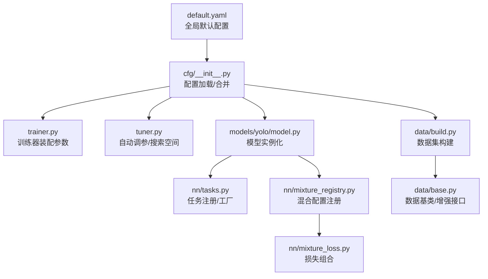
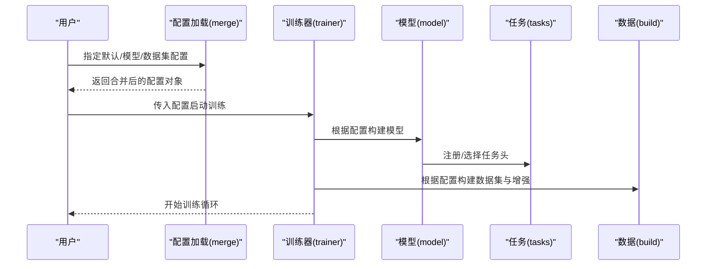
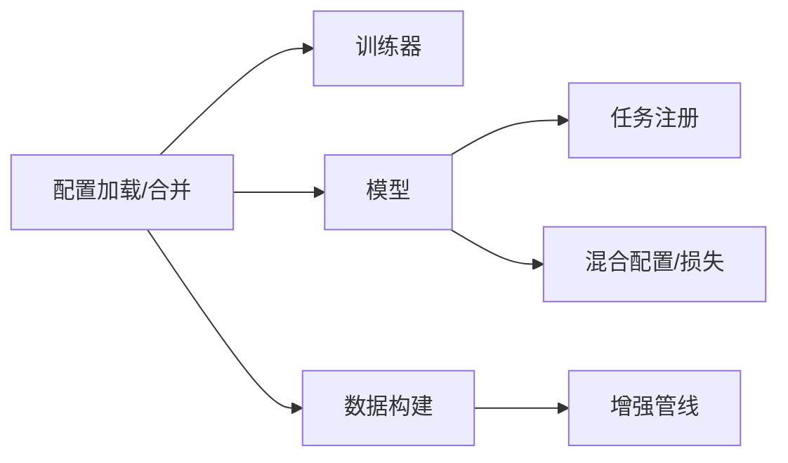

# 训练配置管理

<cite>
**本文引用的文件**
- [default.yaml](file://ultralytics/cfg/default.yaml)
- [__init__.py](file://ultralytics/cfg/__init__.py)
- [train.py](file://ultralytics/engine/trainer.py)
- [tuner.py](file://ultralytics/engine/tuner.py)
- [model.py](file://ultralytics/engine/model.py)
- [build.py](file://ultralytics/data/build.py)
- [base.py](file://ultralytics/data/base.py)
- [yolo.py](file://ultralytics/models/yolo/model.py)
- [tasks.py](file://ultralytics/nn/tasks.py)
- [mixture_registry.py](file://ultralytics/nn/mixture_registry.py)
- [mixture_loss.py](file://ultralytics/nn/mixture_loss.py)
- [test_default_config_integrity.py](file://tests/test_default_config_integrity.py)
- [test_mixture_config_resolution.py](file://tests/test_mixture_config_resolution.py)
- [test_master_model_configs.py](file://tests/test_master_model_configs.py)
</cite>

## 目录
1. [简介](#简介)
2. [项目结构](#项目结构)
3. [核心组件](#核心组件)
4. [架构总览](#架构总览)
5. [详细组件分析](#详细组件分析)
6. [依赖关系分析](#依赖关系分析)
7. [性能考量](#性能考量)
8. [故障排查指南](#故障排查指南)
9. [结论](#结论)
10. [附录](#附录)

## 简介
本文件面向YOLO-Master的训练配置管理，系统性说明配置文件的结构与层次关系、默认配置与模型/数据集配置的继承机制、关键参数的含义与作用域（网络架构、训练超参、数据增强等），并提供最佳实践与自定义配置开发指南。同时梳理配置解析与验证流程、错误处理策略，帮助读者在保持可复现性的前提下高效定制训练流程。

## 项目结构
训练相关配置主要位于以下位置：
- 默认全局配置：ultralytics/cfg/default.yaml
- 模型配置：ultralytics/cfg/models/*（按任务/系列组织）
- 数据集配置：ultralytics/cfg/datasets/*（按任务/数据集组织）
- 配置加载与合并逻辑：ultralytics/cfg/__init__.py
- 训练入口与参数装配：ultralytics/engine/trainer.py
- 自动调参与配置搜索：ultralytics/engine/tuner.py
- 模型构建与任务注册：ultralytics/models/yolo/model.py、ultralytics/nn/tasks.py
- 混合专家/多任务配置与损失：ultralytics/nn/mixture_registry.py、ultralytics/nn/mixture_loss.py
- 数据构建与增强：ultralytics/data/build.py、ultralytics/data/base.py
- 配置完整性与解析测试：tests/test_default_config_integrity.py、tests/test_mixture_config_resolution.py、tests/test_master_model_configs.py

图示来源
- [default.yaml](file://ultralytics/cfg/default.yaml)
- [__init__.py](file://ultralytics/cfg/__init__.py)
- [train.py](file://ultralytics/engine/trainer.py)
- [tuner.py](file://ultralytics/engine/tuner.py)
- [build.py](file://ultralytics/data/build.py)
- [base.py](file://ultralytics/data/base.py)
- [yolo.py](file://ultralytics/models/yolo/model.py)
- [tasks.py](file://ultralytics/nn/tasks.py)
- [mixture_registry.py](file://ultralytics/nn/mixture_registry.py)
- [mixture_loss.py](file://ultralytics/nn/mixture_loss.py)

章节来源
- [default.yaml](file://ultralytics/cfg/default.yaml)
- [__init__.py](file://ultralytics/cfg/__init__.py)
- [train.py](file://ultralytics/engine/trainer.py)
- [tuner.py](file://ultralytics/engine/tuner.py)
- [build.py](file://ultralytics/data/build.py)
- [base.py](file://ultralytics/data/base.py)
- [yolo.py](file://ultralytics/models/yolo/model.py)
- [tasks.py](file://ultralytics/nn/tasks.py)
- [mixture_registry.py](file://ultralytics/nn/mixture_registry.py)
- [mixture_loss.py](file://ultralytics/nn/mixture_loss.py)

## 核心组件
- 默认配置中心：提供全局默认值，作为所有任务/模型的基准。
- 配置加载与合并：支持从YAML加载、字典覆盖、层级合并与引用解析。
- 训练器装配：将最终配置注入到训练器、优化器、调度器、日志与导出模块。
- 自动调参：基于配置空间进行超参搜索，输出最优配置并回写。
- 模型与任务注册：根据配置选择具体模型实现与任务头，必要时启用混合专家/多任务能力。
- 数据构建：依据数据集配置构建DataLoader与增强管线。

章节来源
- [default.yaml](file://ultralytics/cfg/default.yaml)
- [__init__.py](file://ultralytics/cfg/__init__.py)
- [train.py](file://ultralytics/engine/trainer.py)
- [tuner.py](file://ultralytics/engine/tuner.py)
- [yolo.py](file://ultralytics/models/yolo/model.py)
- [tasks.py](file://ultralytics/nn/tasks.py)
- [build.py](file://ultralytics/data/build.py)

## 架构总览
下图展示从“配置文件”到“训练执行”的关键路径，包括默认配置、模型/数据集配置、合并策略以及训练器装配过程。

图示来源
- [__init__.py](file://ultralytics/cfg/__init__.py)
- [train.py](file://ultralytics/engine/trainer.py)
- [yolo.py](file://ultralytics/models/yolo/model.py)
- [tasks.py](file://ultralytics/nn/tasks.py)
- [build.py](file://ultralytics/data/build.py)

## 详细组件分析

### 配置加载与合并机制
- 职责
  - 读取默认配置与用户提供的模型/数据集配置。
  - 执行深度合并（用户覆盖默认）、解析相对/绝对路径、展开引用。
  - 生成不可变或受保护的配置视图，避免运行时被意外修改。
- 关键点
  - 合并优先级：命令行 > 用户配置 > 模型配置 > 数据集配置 > 默认配置。
  - 类型校验与缺省补齐：对关键字段进行存在性与范围检查，缺失时回填默认值。
  - 路径规范化：统一为绝对路径，便于跨平台与分布式环境使用。
- 建议
  - 尽量通过“最小差异”的覆盖方式定义新配置，减少重复字段。
  - 对敏感路径与外部资源使用环境变量注入，避免硬编码。

章节来源
- [__init__.py](file://ultralytics/cfg/__init__.py)
- [default.yaml](file://ultralytics/cfg/default.yaml)

### 训练器装配与参数作用域
- 职责
  - 接收合并后的配置，初始化训练器、优化器、学习率调度器、日志记录器、回调与导出选项。
  - 将配置分派到不同子系统（模型、数据、评估、保存、可视化）。
- 参数作用域
  - 全局：设备、精度、随机种子、日志、保存策略等。
  - 模型：网络结构、预训练权重、冻结层、MoE/LoRA开关等。
  - 数据：输入尺寸、批大小、增强策略、缓存与并行。
  - 优化：学习率、权重衰减、动量、梯度裁剪、早停等。
  - 任务：损失权重、类别数、NMS阈值、后处理选项等。
- 建议
  - 明确区分“可覆盖”和“固定”参数，避免在子配置中无意覆盖全局设置。
  - 对影响稳定性的参数（如lr、warmup、ema）提供合理默认值与边界。

章节来源
- [train.py](file://ultralytics/engine/trainer.py)

### 自动调参与配置搜索
- 职责
  - 基于配置空间定义搜索范围，运行多次实验并评估指标，输出最优配置。
- 关键点
  - 搜索空间：连续/离散/分类变量；约束条件（如batch_size与显存的关系）。
  - 评估协议：固定随机种子、交叉验证、早停策略。
  - 结果持久化：将最优配置落盘，便于复现实验。
- 建议
  - 先在小规模数据上快速扫描，再在完整数据集上精调。
  - 记录每次运行的完整配置与环境信息，确保可追溯。

章节来源
- [tuner.py](file://ultralytics/engine/tuner.py)

### 模型构建与任务注册
- 职责
  - 根据配置选择具体模型实现，注册任务头，必要时启用混合专家或多任务能力。
- 关键点
  - 任务注册表：以任务名映射到具体实现，支持扩展。
  - 混合配置：通过注册表动态组装损失与路由策略。
- 建议
  - 新增任务或模型变体时，同步更新注册表与文档。
  - 对不兼容的配置组合进行前置校验，尽早失败。

章节来源
- [yolo.py](file://ultralytics/models/yolo/model.py)
- [tasks.py](file://ultralytics/nn/tasks.py)
- [mixture_registry.py](file://ultralytics/nn/mixture_registry.py)

### 混合专家/多任务配置与损失
- 职责
  - 管理混合专家/多任务的配置项，动态组合损失函数，协调路由与专家权重。
- 关键点
  - 配置项：专家数量、路由策略、负载均衡系数、激活阈值等。
  - 损失组合：主任务损失与辅助损失的权重与计算顺序。
- 建议
  - 逐步开启复杂特性（先单任务，再多任务，最后MoE），便于定位问题。
  - 监控路由分布与专家利用率，避免“塌缩”。

章节来源
- [mixture_registry.py](file://ultralytics/nn/mixture_registry.py)
- [mixture_loss.py](file://ultralytics/nn/mixture_loss.py)

### 数据构建与增强管线
- 职责
  - 根据数据集配置构建DataLoader、预处理与增强流水线，支持缓存与多进程。
- 关键点
  - 增强选项：几何变换、色彩抖动、MixUp/CutMix、Mosaic等。
  - 输入尺寸：固定或随机尺度，影响收敛速度与泛化。
  - 缓存：磁盘/内存缓存加速I/O密集场景。
- 建议
  - 针对小样本/长尾类别调整增强强度与采样策略。
  - 在验证集禁用破坏性增强，保证评估一致性。

章节来源
- [build.py](file://ultralytics/data/build.py)
- [base.py](file://ultralytics/data/base.py)

### 配置验证与错误处理
- 验证阶段
  - 结构校验：必填字段、类型、取值范围、互斥/依赖关系。
  - 资源校验：路径存在性、权限、可用显存/内存估算。
  - 兼容性校验：模型/任务/损失之间的组合是否合法。
- 错误处理
  - 结构化错误消息：包含字段名、期望类型、上下文与建议修复。
  - 快速失败：在训练前尽可能捕获并提示问题，避免中途崩溃。
  - 降级策略：当部分功能不可用时，给出安全降级配置。
- 测试保障
  - 默认配置完整性测试：确保默认配置可被正确加载与合并。
  - 混合配置解析测试：验证注册表与组合逻辑的正确性。
  - 模型配置回归测试：防止上游变更导致配置失效。

章节来源
- [test_default_config_integrity.py](file://tests/test_default_config_integrity.py)
- [test_mixture_config_resolution.py](file://tests/test_mixture_config_resolution.py)
- [test_master_model_configs.py](file://tests/test_master_model_configs.py)

## 依赖关系分析
- 组件耦合
  - 配置加载与合并是训练器、模型、数据构建的共同依赖。
  - 模型与任务注册强耦合于任务头与损失组合。
  - 数据构建与增强管线独立性强，但受输入尺寸与批大小影响。
- 外部依赖
  - YAML解析、路径操作、分布式通信、GPU/内存管理等。
- 潜在风险
  - 循环依赖：应避免在配置加载时触发模型/数据构建。
  - 隐式状态：配置对象应尽量避免可变共享状态。

图示来源
- [__init__.py](file://ultralytics/cfg/__init__.py)
- [train.py](file://ultralytics/engine/trainer.py)
- [yolo.py](file://ultralytics/models/yolo/model.py)
- [tasks.py](file://ultralytics/nn/tasks.py)
- [mixture_registry.py](file://ultralytics/nn/mixture_registry.py)
- [mixture_loss.py](file://ultralytics/nn/mixture_loss.py)
- [build.py](file://ultralytics/data/build.py)

## 性能考量
- 批大小与输入尺寸：增大批大小提升吞吐，但需关注显存；输入尺寸影响算力与精度权衡。
- 数据I/O：启用缓存与多进程读取，减少瓶颈；注意磁盘空间与缓存清理。
- 精度与稳定性：混合精度可提速，但需配合数值稳定策略（如EMA、梯度裁剪）。
- 分布式：合理设置节点/进程数与通信后端，避免通信成为瓶颈。
- 自动调参：采用分层搜索（粗扫+精调），结合早停与占位评估降低时间成本。

## 故障排查指南
- 常见错误
  - 配置缺失或类型错误：检查必填字段与类型，参考默认配置补齐。
  - 路径不存在或无权限：确认数据集/权重路径，使用绝对路径或环境变量。
  - 显存不足：减小输入尺寸/批大小，关闭不必要的增强或缓存。
  - 任务/模型不兼容：核对任务注册表与模型实现，避免非法组合。
- 诊断步骤
  - 打印最终合并后的配置，逐项比对预期。
  - 在最小数据集上复现，隔离数据问题。
  - 逐步关闭高级特性（如MoE、多任务、混合精度），定位不稳定因素。
- 工具与测试
  - 运行配置完整性与解析测试，确保环境一致。
  - 查看训练日志与中间指标，定位异常阶段。

章节来源
- [test_default_config_integrity.py](file://tests/test_default_config_integrity.py)
- [test_mixture_config_resolution.py](file://tests/test_mixture_config_resolution.py)
- [test_master_model_configs.py](file://tests/test_master_model_configs.py)

## 结论
通过统一的默认配置中心与严格的合并/验证流程，YOLO-Master实现了灵活且稳健的训练配置管理。遵循最小覆盖原则、明确参数作用域、善用自动调参与测试保障，可在保证可复现性的前提下高效完成模型定制与优化。

## 附录
- 最佳实践清单
  - 优先复用默认配置，仅覆盖必要字段。
  - 将路径与敏感信息外置为环境变量。
  - 为每个重要实验固化最终配置与环境快照。
  - 在验证集禁用破坏性增强，保持一致评估。
  - 对复杂特性（多任务/MoE）采用渐进式启用与监控。
- 自定义配置开发指南
  - 新建数据集配置：参照现有数据集模板，补充路径、类别与划分。
  - 新建模型配置：在模型目录下添加配置，确保与任务注册表一致。
  - 新增增强：在数据构建中注册新的增强算子，并在配置中暴露开关与参数。
  - 新增任务/损失：更新任务注册表与损失组合逻辑，完善配置校验。