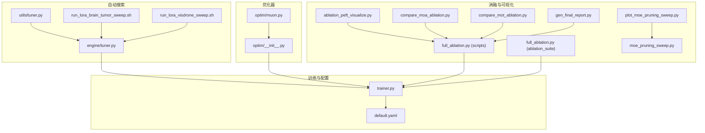
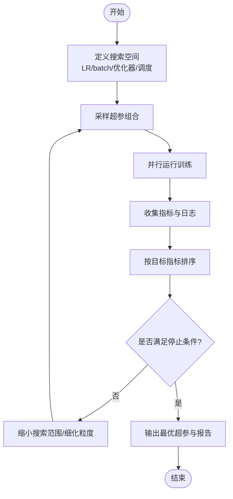
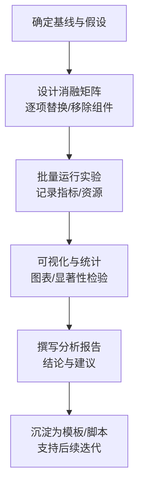
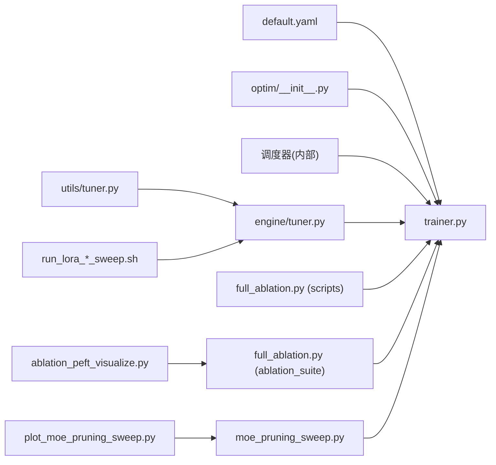

# 超参数调优

<cite>
**本文引用的文件**
- [ultralytics/engine/trainer.py](file://ultralytics/engine/trainer.py)
- [ultralytics/engine/tuner.py](file://ultralytics/engine/tuner.py)
- [ultralytics/utils/tuner.py](file://ultralytics/utils/tuner.py)
- [ultralytics/optim/__init__.py](file://ultralytics/optim/__init__.py)
- [ultralytics/optim/muon.py](file://ultralytics/optim/muon.py)
- [ultralytics/cfg/default.yaml](file://ultralytics/cfg/default.yaml)
- [examples/lora_examples/run_lora_brain_tumor_sweep.sh](file://examples/lora_examples/run_lora_brain_tumor_sweep.sh)
- [examples/lora_examples/run_lora_visdrone_sweep.sh](file://examples/lora_examples/run_lora_visdrone_sweep.sh)
- [scripts/full_ablation.py](file://scripts/full_ablation.py)
- [scripts/ablation_suite/full_ablation.py](file://scripts/ablation_suite/full_ablation.py)
- [scripts/ablation_suite/ablation_peft_visualize.py](file://scripts/ablation_suite/ablation_peft_visualize.py)
- [scripts/plot_moe_pruning_sweep.py](file://scripts/plot_moe_pruning_sweep.py)
- [scripts/moe_pruning_sweep.py](file://scripts/moe_pruning_sweep.py)
- [scripts/compare_moa_ablation.py](file://scripts/compare_moa_ablation.py)
- [scripts/compare_mot_ablation.py](file://scripts/compare_mot_ablation.py)
- [scripts/gen_final_report.py](file://scripts/gen_final_report.py)
</cite>

## 目录
1. [简介](#简介)
2. [项目结构](#项目结构)
3. [核心组件](#核心组件)
4. [架构总览](#架构总览)
5. [详细组件分析](#详细组件分析)
6. [依赖关系分析](#依赖关系分析)
7. [性能考量](#性能考量)
8. [故障排查指南](#故障排查指南)
9. [结论](#结论)
10. [附录](#附录)

## 简介
本指南面向使用 YOLO-Master 进行目标检测与相关任务训练的工程师与研究者，聚焦“超参数调优”的完整实践路径。内容覆盖：
- 学习率调度策略（余弦退火、线性衰减、多阶段学习率）
- 批量大小选择原则及其对训练效果的影响
- 优化器配置最佳实践（AdamW、SGD 等）
- 自动超参数搜索方法与工具使用
- 消融实验设计与结果分析方法

目标是帮助读者在有限算力下高效定位最优超参数组合，并建立可复现、可对比的实验体系。

## 项目结构
围绕超参数调优，仓库中与训练、优化器、自动搜索和消融实验相关的核心位置如下：
- 训练主循环与默认配置：ultralytics/engine/trainer.py、ultralytics/cfg/default.yaml
- 自动超参搜索：ultralytics/engine/tuner.py、ultralytics/utils/tuner.py
- 优化器实现与注册：ultralytics/optim/__init__.py、ultralytics/optim/muon.py
- 自动化搜索脚本示例：examples/lora_examples/*.sh
- 消融实验与可视化：scripts/*_ablation*.py、scripts/ablation_suite/*、scripts/plot_*sweep*.py



图表来源
- [ultralytics/engine/trainer.py](file://ultralytics/engine/trainer.py)
- [ultralytics/cfg/default.yaml](file://ultralytics/cfg/default.yaml)
- [ultralytics/engine/tuner.py](file://ultralytics/engine/tuner.py)
- [ultralytics/utils/tuner.py](file://ultralytics/utils/tuner.py)
- [ultralytics/optim/__init__.py](file://ultralytics/optim/__init__.py)
- [ultralytics/optim/muon.py](file://ultralytics/optim/muon.py)
- [examples/lora_examples/run_lora_brain_tumor_sweep.sh](file://examples/lora_examples/run_lora_brain_tumor_sweep.sh)
- [examples/lora_examples/run_lora_visdrone_sweep.sh](file://examples/lora_examples/run_lora_visdrone_sweep.sh)
- [scripts/full_ablation.py](file://scripts/full_ablation.py)
- [scripts/ablation_suite/full_ablation.py](file://scripts/ablation_suite/full_ablation.py)
- [scripts/ablation_suite/ablation_peft_visualize.py](file://scripts/ablation_suite/ablation_peft_visualize.py)
- [scripts/plot_moe_pruning_sweep.py](file://scripts/plot_moe_pruning_sweep.py)
- [scripts/moe_pruning_sweep.py](file://scripts/moe_pruning_sweep.py)
- [scripts/compare_moa_ablation.py](file://scripts/compare_moa_ablation.py)
- [scripts/compare_mot_ablation.py](file://scripts/compare_mot_ablation.py)
- [scripts/gen_final_report.py](file://scripts/gen_final_report.py)

章节来源
- [ultralytics/engine/trainer.py](file://ultralytics/engine/trainer.py)
- [ultralytics/cfg/default.yaml](file://ultralytics/cfg/default.yaml)
- [ultralytics/engine/tuner.py](file://ultralytics/engine/tuner.py)
- [ultralytics/utils/tuner.py](file://ultralytics/utils/tuner.py)
- [ultralytics/optim/__init__.py](file://ultralytics/optim/__init__.py)
- [ultralytics/optim/muon.py](file://ultralytics/optim/muon.py)
- [examples/lora_examples/run_lora_brain_tumor_sweep.sh](file://examples/lora_examples/run_lora_brain_tumor_sweep.sh)
- [examples/lora_examples/run_lora_visdrone_sweep.sh](file://examples/lora_examples/run_lora_visdrone_sweep.sh)
- [scripts/full_ablation.py](file://scripts/full_ablation.py)
- [scripts/ablation_suite/full_ablation.py](file://scripts/ablation_suite/full_ablation.py)
- [scripts/ablation_suite/ablation_peft_visualize.py](file://scripts/ablation_suite/ablation_peft_visualize.py)
- [scripts/plot_moe_pruning_sweep.py](file://scripts/plot_moe_pruning_sweep.py)
- [scripts/moe_pruning_sweep.py](file://scripts/moe_pruning_sweep.py)
- [scripts/compare_moa_ablation.py](file://scripts/compare_moa_ablation.py)
- [scripts/compare_mot_ablation.py](file://scripts/compare_mot_ablation.py)
- [scripts/gen_final_report.py](file://scripts/gen_final_report.py)

## 核心组件
- 训练器与默认配置
  - trainer.py 负责加载模型、数据、优化器、调度器与训练循环；default.yaml 提供默认超参与任务级配置入口。
- 自动超参搜索
  - engine/tuner.py 与 utils/tuner.py 封装了搜索空间定义、采样策略、并行执行与结果聚合。
- 优化器
  - optim/__init__.py 暴露统一接口；muon.py 提供特定优化器实现。
- 自动化搜索脚本
  - examples/lora_examples/*.sh 演示如何以命令行方式驱动 sweep。
- 消融与可视化
  - scripts/*_ablation*.py 与 ablation_suite/* 提供系统化消融流程与结果汇总、绘图能力。

章节来源
- [ultralytics/engine/trainer.py](file://ultralytics/engine/trainer.py)
- [ultralytics/cfg/default.yaml](file://ultralytics/cfg/default.yaml)
- [ultralytics/engine/tuner.py](file://ultralytics/engine/tuner.py)
- [ultralytics/utils/tuner.py](file://ultralytics/utils/tuner.py)
- [ultralytics/optim/__init__.py](file://ultralytics/optim/__init__.py)
- [ultralytics/optim/muon.py](file://ultralytics/optim/muon.py)
- [examples/lora_examples/run_lora_brain_tumor_sweep.sh](file://examples/lora_examples/run_lora_brain_tumor_sweep.sh)
- [examples/lora_examples/run_lora_visdrone_sweep.sh](file://examples/lora_examples/run_lora_visdrone_sweep.sh)
- [scripts/full_ablation.py](file://scripts/full_ablation.py)
- [scripts/ablation_suite/full_ablation.py](file://scripts/ablation_suite/full_ablation.py)
- [scripts/ablation_suite/ablation_peft_visualize.py](file://scripts/ablation_suite/ablation_peft_visualize.py)

## 架构总览
下图展示了从“用户命令/脚本”到“训练器执行”的关键调用链，以及自动搜索与消融实验如何复用同一训练内核。

```mermaid
sequenceDiagram
participant U as "用户/脚本"
participant S as "Sweep脚本(Shell)"
participant Tuner as "tuner(engine/utils)"
participant Trainer as "trainer.py"
participant Opt as "optim/__init__.py"
participant Sch as "调度器(由trainer内部构建)"
participant Eval as "验证/指标"
U->>S : 指定数据集/模型/搜索空间
S->>Tuner : 启动一次或多次搜索任务
Tuner->>Trainer : 传入超参组合并触发训练
Trainer->>Opt : 实例化优化器(如AdamW/SGD/Muon)
Trainer->>Sch : 构建学习率调度(余弦/线性/多阶段)
loop 每个epoch
Trainer->>Trainer : 前向/损失/反向
Trainer->>Sch : 更新学习率
Trainer->>Eval : 周期评估与记录
end
Tuner-->>U : 输出最优超参与结果报告
```

图表来源
- [ultralytics/engine/tuner.py](file://ultralytics/engine/tuner.py)
- [ultralytics/utils/tuner.py](file://ultralytics/utils/tuner.py)
- [ultralytics/engine/trainer.py](file://ultralytics/engine/trainer.py)
- [ultralytics/optim/__init__.py](file://ultralytics/optim/__init__.py)

## 详细组件分析

### 学习率调度策略
- 常见策略
  - 余弦退火：适合稳定收敛与后期精细微调，常配合 warmup 使用。
  - 线性衰减：简单直接，适合小数据集或快速基线。
  - 多阶段学习率：按 epoch 或步数分段设置不同 LR，便于控制探索-利用平衡。
- 在 YOLO-Master 中的集成点
  - trainer.py 中根据配置构建优化器与调度器，并在训练循环内按步更新。
  - default.yaml 提供默认调度相关字段，可在任务 YAML 中覆盖。
- 建议
  - 先以线性或余弦作为基线，再针对具体任务引入多阶段策略。
  - 结合 warmup 提升初期稳定性，尤其在大批量或复杂数据增强场景。

章节来源
- [ultralytics/engine/trainer.py](file://ultralytics/engine/trainer.py)
- [ultralytics/cfg/default.yaml](file://ultralytics/cfg/default.yaml)

### 批量大小选择原则
- 影响维度
  - 内存占用与吞吐：更大 batch 提高吞吐但增加显存压力。
  - 泛化与噪声：较小 batch 引入梯度噪声，可能有助于跳出局部极小。
  - 批归一化行为：BN 统计量在小 batch 上不稳定，需权衡。
- 实践建议
  - 以设备显存为上限，尽量增大 batch 直至接近饱和。
  - 若出现 BN 不稳定，考虑减小 batch 或使用替代归一化策略。
  - 配合学习率缩放规则（如线性缩放）保持训练动态一致。

章节来源
- [ultralytics/engine/trainer.py](file://ultralytics/engine/trainer.py)
- [ultralytics/cfg/default.yaml](file://ultralytics/cfg/default.yaml)

### 优化器配置最佳实践
- AdamW
  - 适用面广，对稀疏特征与大规模数据表现稳健；注意权重衰减与初始 LR 的协同。
- SGD
  - 在部分视觉任务中可获得更好泛化，但需要更谨慎的 LR 与动量设置。
- Muon（如有）
  - 作为可选优化器，适用于特定场景或研究性实验，需单独验证稳定性与收益。
- 配置要点
  - 通过 optim/__init__.py 的统一接口创建优化器实例。
  - 在 trainer.py 中将优化器与调度器绑定，确保 LR 更新路径正确。

章节来源
- [ultralytics/optim/__init__.py](file://ultralytics/optim/__init__.py)
- [ultralytics/optim/muon.py](file://ultralytics/optim/muon.py)
- [ultralytics/engine/trainer.py](file://ultralytics/engine/trainer.py)

### 自动超参数搜索方法与工具
- 搜索空间设计
  - 将关键超参（如 LR、batch size、优化器类型、warmup 比例、调度策略）纳入空间。
  - 采用离散/连续混合空间，合理限定范围避免无效区域。
- 执行与聚合
  - tuner(engine/utils) 负责采样、并发执行、日志收集与结果排序。
  - Shell 脚本（examples/lora_examples/*.sh）可作为外部编排入口，驱动多次 sweep。
- 推荐流程
  - 粗搜（大范围）→ 精搜（缩小范围）→ 固定其他变量做单因子验证。
  - 使用统一指标（如 mAP@0.5:0.95）作为优化目标，保证可比性。



章节来源
- [ultralytics/engine/tuner.py](file://ultralytics/engine/tuner.py)
- [ultralytics/utils/tuner.py](file://ultralytics/utils/tuner.py)
- [examples/lora_examples/run_lora_brain_tumor_sweep.sh](file://examples/lora_examples/run_lora_brain_tumor_sweep.sh)
- [examples/lora_examples/run_lora_visdrone_sweep.sh](file://examples/lora_examples/run_lora_visdrone_sweep.sh)

### 消融实验设计与结果分析
- 设计原则
  - 单一变量控制：每次仅改变一个因素，确保因果清晰。
  - 基线先行：先建立稳定基线，再进行增量式改动。
  - 指标对齐：所有实验使用相同验证集与评估协议。
- 常用脚本
  - full_ablation.py（scripts 与 ablation_suite）用于批量运行不同变体。
  - ablation_peft_visualize.py 用于生成可视化对比图。
  - moe_pruning_sweep.py 与 plot_moe_pruning_sweep.py 用于 MoE 相关消融与绘图。
  - compare_moa_ablation.py、compare_mot_ablation.py 用于特定模块对比。
  - gen_final_report.py 汇总结果并生成最终报告。
- 分析方法
  - 表格+曲线双通道呈现：表格展示数值，曲线展示趋势。
  - 显著性与稳定性：重复实验取均值与方差，关注波动区间。
  - 资源消耗：记录训练时长与显存峰值，兼顾效率与效果。



章节来源
- [scripts/full_ablation.py](file://scripts/full_ablation.py)
- [scripts/ablation_suite/full_ablation.py](file://scripts/ablation_suite/full_ablation.py)
- [scripts/ablation_suite/ablation_peft_visualize.py](file://scripts/ablation_suite/ablation_peft_visualize.py)
- [scripts/moe_pruning_sweep.py](file://scripts/moe_pruning_sweep.py)
- [scripts/plot_moe_pruning_sweep.py](file://scripts/plot_moe_pruning_sweep.py)
- [scripts/compare_moa_ablation.py](file://scripts/compare_moa_ablation.py)
- [scripts/compare_mot_ablation.py](file://scripts/compare_mot_ablation.py)
- [scripts/gen_final_report.py](file://scripts/gen_final_report.py)

## 依赖关系分析
- 训练器依赖
  - trainer.py 依赖 default.yaml 提供的默认超参，并通过 optim/__init__.py 获取优化器。
  - 调度器在 trainer.py 内部构建，随训练循环更新。
- 自动搜索依赖
  - engine/tuner.py 与 utils/tuner.py 共同完成搜索逻辑，外部脚本通过 shell 驱动。
- 消融与可视化依赖
  - 各 *_ablation*.py 与 *_sweep*.py 复用训练器与指标计算，形成统一的实验流水线。



图表来源
- [ultralytics/cfg/default.yaml](file://ultralytics/cfg/default.yaml)
- [ultralytics/engine/trainer.py](file://ultralytics/engine/trainer.py)
- [ultralytics/optim/__init__.py](file://ultralytics/optim/__init__.py)
- [ultralytics/engine/tuner.py](file://ultralytics/engine/tuner.py)
- [ultralytics/utils/tuner.py](file://ultralytics/utils/tuner.py)
- [examples/lora_examples/run_lora_brain_tumor_sweep.sh](file://examples/lora_examples/run_lora_brain_tumor_sweep.sh)
- [examples/lora_examples/run_lora_visdrone_sweep.sh](file://examples/lora_examples/run_lora_visdrone_sweep.sh)
- [scripts/full_ablation.py](file://scripts/full_ablation.py)
- [scripts/ablation_suite/full_ablation.py](file://scripts/ablation_suite/full_ablation.py)
- [scripts/ablation_suite/ablation_peft_visualize.py](file://scripts/ablation_suite/ablation_peft_visualize.py)
- [scripts/moe_pruning_sweep.py](file://scripts/moe_pruning_sweep.py)
- [scripts/plot_moe_pruning_sweep.py](file://scripts/plot_moe_pruning_sweep.py)

## 性能考量
- 吞吐与显存
  - 增大 batch 提升吞吐，但需监控显存与 OOM 风险；必要时启用梯度累积或混合精度。
- 分布式与并行
  - 在多卡环境下，确保数据加载与通信开销可控，避免成为瓶颈。
- 存储与 I/O
  - 频繁读写日志与中间结果会影响整体效率，建议集中落盘与异步写入。
- 可复现性
  - 固定随机种子、锁定依赖版本，确保不同机器与时间点的结果一致。

[本节为通用指导，不直接分析具体文件]

## 故障排查指南
- 训练不收敛或震荡
  - 检查学习率是否过大、warmup 是否缺失、调度策略是否与任务匹配。
  - 确认 batch size 与归一化层行为是否稳定。
- 显存不足
  - 降低 batch size、减少图像分辨率或关闭不必要的增强。
  - 使用梯度累积或混合精度。
- 自动搜索失败
  - 检查搜索空间边界是否合理，避免极端值导致崩溃。
  - 查看 tuner 日志，定位失败的超参组合。
- 消融结果不可比
  - 确保所有实验使用相同的验证集、评估协议与随机种子。
  - 核对脚本参数传递是否正确，避免遗漏关键配置。

章节来源
- [ultralytics/engine/trainer.py](file://ultralytics/engine/trainer.py)
- [ultralytics/engine/tuner.py](file://ultralytics/engine/tuner.py)
- [ultralytics/utils/tuner.py](file://ultralytics/utils/tuner.py)
- [scripts/full_ablation.py](file://scripts/full_ablation.py)
- [scripts/ablation_suite/full_ablation.py](file://scripts/ablation_suite/full_ablation.py)

## 结论
- 学习率调度应结合任务特性与数据规模选择，优先以余弦或线性为基线，再按需引入多阶段策略。
- 批量大小需在显存约束下尽可能大，同时关注 BN 稳定性与泛化表现。
- 优化器选择以 AdamW 为主流，SGD 在特定任务中仍有优势；Muon 可用于探索性实验。
- 自动搜索应以“粗搜→精搜→单因子验证”的流程推进，并以统一指标衡量优劣。
- 消融实验要遵循单一变量与可复现原则，配套完善的可视化与报告机制。

[本节为总结性内容，不直接分析具体文件]

## 附录
- 快速上手清单
  - 明确任务与指标 → 设定基线超参 → 启动自动搜索 → 分析结果 → 开展消融 → 产出报告。
- 参考脚本
  - 使用 examples/lora_examples/*.sh 作为外部编排入口，结合 tuner 进行批量实验。
  - 使用 scripts/*_ablation*.py 与 ablation_suite/* 组织系统化消融与可视化。

[本节为补充说明，不直接分析具体文件]