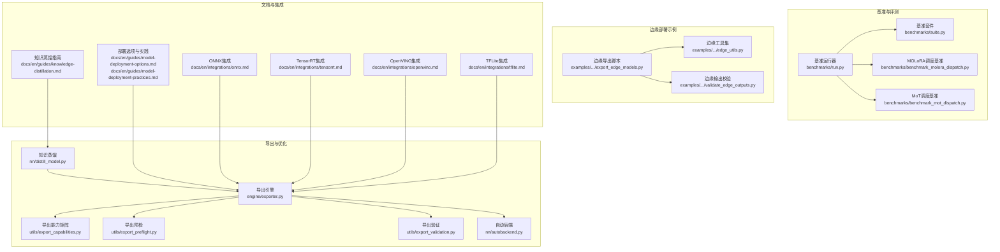
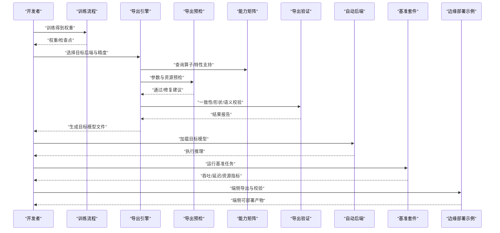
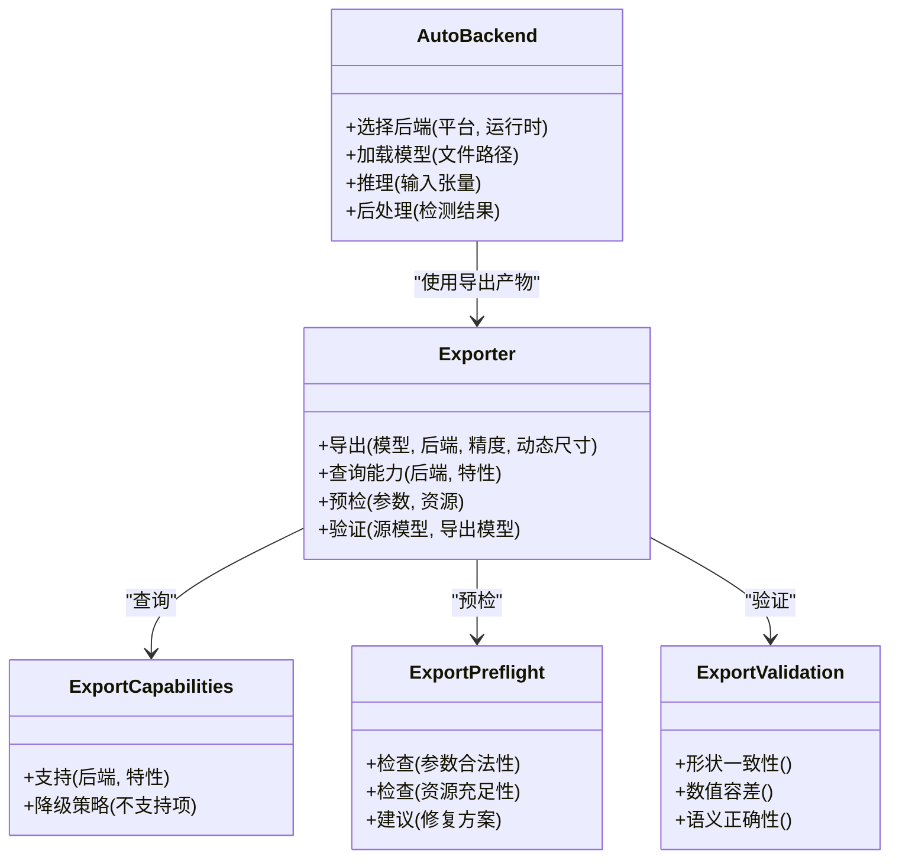
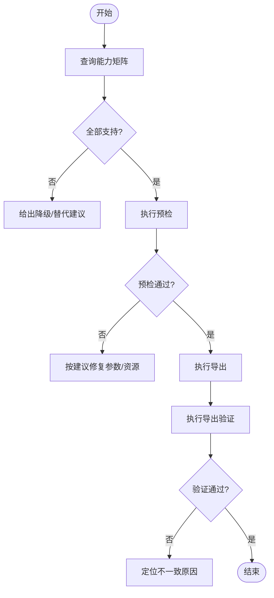
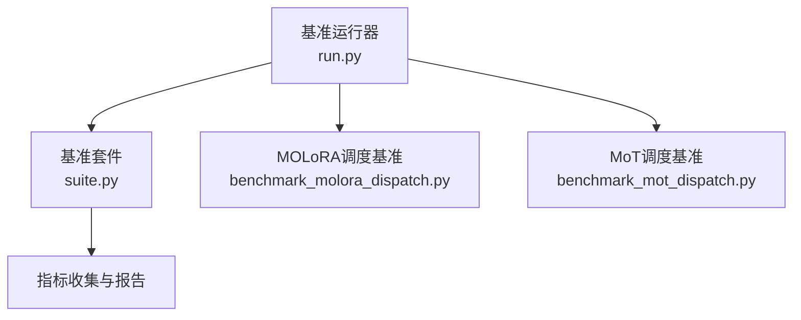
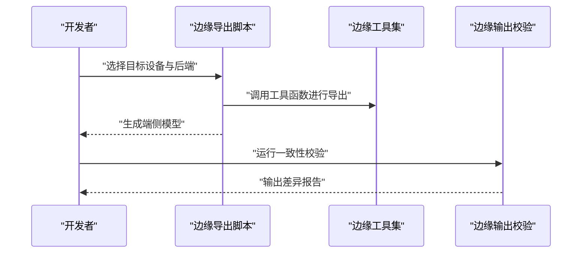
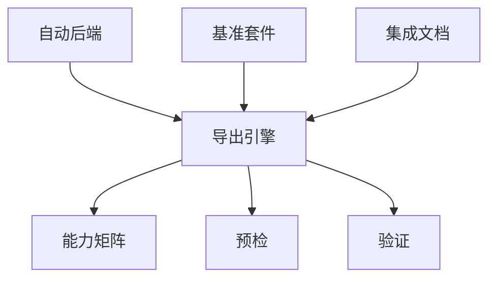

# 性能优化与部署准备

<cite>
**本文引用的文件**
- [exporter.py](file://ultralytics/engine/exporter.py)
- [autobackend.py](file://ultralytics/nn/autobackend.py)
- [distill_model.py](file://ultralytics/nn/distill_model.py)
- [export_capabilities.py](file://ultralytics/utils/export_capabilities.py)
- [export_preflight.py](file://ultralytics/utils/export_preflight.py)
- [export_validation.py](file://ultralytics/utils/export_validation.py)
- [benchmark_molora_dispatch.py](file://benchmarks/benchmark_molora_dispatch.py)
- [benchmark_mot_dispatch.py](file://benchmarks/benchmark_mot_dispatch.py)
- [run.py](file://benchmarks/run.py)
- [suite.py](file://benchmarks/suite.py)
- [yolo_master_edge_deployment_export.py](file://examples/YOLO-Master-Edge-Deployment/export_edge_models.py)
- [edge_utils.py](file://examples/YOLO-Master-Edge-Deployment/edge_utils.py)
- [validate_edge_outputs.py](file://examples/YOLO-Master-Edge-Deployment/validate_edge_outputs.py)
- [knowledge_distillation.md](file://docs/en/guides/knowledge-distillation.md)
- [model-deployment-options.md](file://docs/en/guides/model-deployment-options.md)
- [model-deployment-practices.md](file://docs/en/guides/model-deployment-practices.md)
- [tensorrt.md](file://docs/en/integrations/tensorrt.md)
- [openvino.md](file://docs/en/integrations/openvino.md)
- [tflite.md](file://docs/en/integrations/tflite.md)
- [onnx.md](file://docs/en/integrations/onnx.md)
</cite>

## 目录
1. [简介](#简介)
2. [项目结构](#项目结构)
3. [核心组件](#核心组件)
4. [架构总览](#架构总览)
5. [详细组件分析](#详细组件分析)
6. [依赖关系分析](#依赖关系分析)
7. [性能考量](#性能考量)
8. [故障排查指南](#故障排查指南)
9. [结论](#结论)
10. [附录](#附录)

## 简介
本指南面向目标检测模型的性能优化与生产部署，围绕量化（INT8、FP16）、剪枝、知识蒸馏等优化技术，以及多格式导出（ONNX、TensorRT、OpenVINO、TFLite）的配置与使用。同时覆盖边缘设备部署策略（内存管理、推理速度优化）和生产环境最佳实践（服务化封装、监控告警、版本管理）。文档结合仓库中的导出引擎、自动后端选择、导出能力矩阵、预检与验证工具、基准测试套件以及官方指南进行系统化梳理，帮助读者从训练后优化到端侧/云端部署形成闭环。

## 项目结构
本项目在“导出与部署”相关的关键路径包括：
- 导出引擎与能力矩阵：engine/exporter.py、utils/export_capabilities.py、utils/export_preflight.py、utils/export_validation.py
- 自动后端加载：nn/autobackend.py
- 知识蒸馏：nn/distill_model.py
- 基准与性能评测：benchmarks/*.py
- 边缘部署示例：examples/YOLO-Master-Edge-Deployment/*
- 官方指南与集成文档：docs/en/guides/*、docs/en/integrations/*



图表来源
- [exporter.py](file://ultralytics/engine/exporter.py)
- [export_capabilities.py](file://ultralytics/utils/export_capabilities.py)
- [export_preflight.py](file://ultralytics/utils/export_preflight.py)
- [export_validation.py](file://ultralytics/utils/export_validation.py)
- [autobackend.py](file://ultralytics/nn/autobackend.py)
- [distill_model.py](file://ultralytics/nn/distill_model.py)
- [run.py](file://benchmarks/run.py)
- [suite.py](file://benchmarks/suite.py)
- [benchmark_molora_dispatch.py](file://benchmarks/benchmark_molora_dispatch.py)
- [benchmark_mot_dispatch.py](file://benchmarks/benchmark_mot_dispatch.py)
- [yolo_master_edge_deployment_export.py](file://examples/YOLO-Master-Edge-Deployment/export_edge_models.py)
- [edge_utils.py](file://examples/YOLO-Master-Edge-Deployment/edge_utils.py)
- [validate_edge_outputs.py](file://examples/YOLO-Master-Edge-Deployment/validate_edge_outputs.py)
- [knowledge_distillation.md](file://docs/en/guides/knowledge-distillation.md)
- [model-deployment-options.md](file://docs/en/guides/model-deployment-options.md)
- [model-deployment-practices.md](file://docs/en/guides/model-deployment-practices.md)
- [onnx.md](file://docs/en/integrations/onnx.md)
- [tensorrt.md](file://docs/en/integrations/tensorrt.md)
- [openvino.md](file://docs/en/integrations/openvino.md)
- [tflite.md](file://docs/en/integrations/tflite.md)

章节来源
- [exporter.py](file://ultralytics/engine/exporter.py)
- [export_capabilities.py](file://ultralytics/utils/export_capabilities.py)
- [export_preflight.py](file://ultralytics/utils/export_preflight.py)
- [export_validation.py](file://ultralytics/utils/export_validation.py)
- [autobackend.py](file://ultralytics/nn/autobackend.py)
- [distill_model.py](file://ultralytics/nn/distill_model.py)
- [run.py](file://benchmarks/run.py)
- [suite.py](file://benchmarks/suite.py)
- [benchmark_molora_dispatch.py](file://benchmarks/benchmark_molora_dispatch.py)
- [benchmark_mot_dispatch.py](file://benchmarks/benchmark_mot_dispatch.py)
- [yolo_master_edge_deployment_export.py](file://examples/YOLO-Master-Edge-Deployment/export_edge_models.py)
- [edge_utils.py](file://examples/YOLO-Master-Edge-Deployment/edge_utils.py)
- [validate_edge_outputs.py](file://examples/YOLO-Master-Edge-Deployment/validate_edge_outputs.py)
- [knowledge_distillation.md](file://docs/en/guides/knowledge-distillation.md)
- [model-deployment-options.md](file://docs/en/guides/model-deployment-options.md)
- [model-deployment-practices.md](file://docs/en/guides/model-deployment-practices.md)
- [onnx.md](file://docs/en/integrations/onnx.md)
- [tensorrt.md](file://docs/en/integrations/tensorrt.md)
- [openvino.md](file://docs/en/integrations/openvino.md)
- [tflite.md](file://docs/en/integrations/tflite.md)

## 核心组件
- 导出引擎（Exporter）：统一封装多种后端导出流程，协调图转换、算子支持检查、精度配置与权重序列化。
- 自动后端（AutoBackend）：根据目标平台与可用运行时动态选择最优执行后端，并处理输入输出形状、数据类型与NMS等后处理适配。
- 导出能力矩阵（ExportCapabilities）：维护各后端对模型特性（如动态尺寸、特定算子、精度模式）的支持情况，用于预检与降级策略。
- 导出预检（ExportPreflight）：在正式导出前进行兼容性、资源与参数校验，避免失败或低质量导出。
- 导出验证（ExportValidation）：对比源模型与导出模型的数值一致性、形状与语义正确性，保障导出可靠性。
- 知识蒸馏（DistillModel）：提供教师-学生框架与损失组合，便于在训练阶段压缩模型容量或提升小模型性能。
- 基准套件（Benchmarks）：提供跨后端、跨任务的吞吐/延迟评估入口，辅助定位瓶颈与回归。
- 边缘部署示例：提供面向端侧的导出脚本、工具函数与输出校验流程，便于快速落地。

章节来源
- [exporter.py](file://ultralytics/engine/exporter.py)
- [autobackend.py](file://ultralytics/nn/autobackend.py)
- [export_capabilities.py](file://ultralytics/utils/export_capabilities.py)
- [export_preflight.py](file://ultralytics/utils/export_preflight.py)
- [export_validation.py](file://ultralytics/utils/export_validation.py)
- [distill_model.py](file://ultralytics/nn/distill_model.py)
- [run.py](file://benchmarks/run.py)
- [suite.py](file://benchmarks/suite.py)
- [benchmark_molora_dispatch.py](file://benchmarks/benchmark_molora_dispatch.py)
- [benchmark_mot_dispatch.py](file://benchmarks/benchmark_mot_dispatch.py)
- [yolo_master_edge_deployment_export.py](file://examples/YOLO-Master-Edge-Deployment/export_edge_models.py)
- [edge_utils.py](file://examples/YOLO-Master-Edge-Deployment/edge_utils.py)
- [validate_edge_outputs.py](file://examples/YOLO-Master-Edge-Deployment/validate_edge_outputs.py)

## 架构总览
下图展示从训练完成到多后端部署的整体流程：训练后的权重经导出引擎转换为中间或目标格式，随后由自动后端在不同平台上加载与执行；导出前后通过能力矩阵、预检与验证确保一致性与可用性；基准套件贯穿优化与部署过程，持续度量性能变化。



图表来源
- [exporter.py](file://ultralytics/engine/exporter.py)
- [export_capabilities.py](file://ultralytics/utils/export_capabilities.py)
- [export_preflight.py](file://ultralytics/utils/export_preflight.py)
- [export_validation.py](file://ultralytics/utils/export_validation.py)
- [autobackend.py](file://ultralytics/nn/autobackend.py)
- [run.py](file://benchmarks/run.py)
- [suite.py](file://benchmarks/suite.py)
- [yolo_master_edge_deployment_export.py](file://examples/YOLO-Master-Edge-Deployment/export_edge_models.py)

## 详细组件分析

### 导出引擎与自动后端
- 职责分工
  - 导出引擎负责将PyTorch模型转换为指定后端格式，协调精度设置、动态维度、NMS与后处理模块的嵌入。
  - 自动后端负责在运行时选择最合适的执行环境，并对输入预处理、输出解析进行适配。
- 关键交互
  - 导出前调用能力矩阵与预检，确认目标后端是否支持当前模型结构与参数。
  - 导出后进行一致性验证，确保数值与形状符合预期。
  - 运行时由自动后端加载模型，屏蔽不同后端差异，提供统一接口。



图表来源
- [exporter.py](file://ultralytics/engine/exporter.py)
- [autobackend.py](file://ultralytics/nn/autobackend.py)
- [export_capabilities.py](file://ultralytics/utils/export_capabilities.py)
- [export_preflight.py](file://ultralytics/utils/export_preflight.py)
- [export_validation.py](file://ultralytics/utils/export_validation.py)

章节来源
- [exporter.py](file://ultralytics/engine/exporter.py)
- [autobackend.py](file://ultralytics/nn/autobackend.py)
- [export_capabilities.py](file://ultralytics/utils/export_capabilities.py)
- [export_preflight.py](file://ultralytics/utils/export_preflight.py)
- [export_validation.py](file://ultralytics/utils/export_validation.py)

### 导出能力矩阵与预检/验证
- 能力矩阵
  - 维护各后端对动态尺寸、混合精度、特定算子（如自定义NMS）的支持状态。
  - 为导出决策提供依据，必要时触发降级或替换策略。
- 预检
  - 校验导出参数（如输入尺寸、精度、NMS阈值）与系统资源（显存/CPU内存）。
  - 给出修复建议，减少无效导出尝试。
- 验证
  - 对比源模型与导出模型的输出分布、边界框与类别置信度，确保端到端一致性。



图表来源
- [export_capabilities.py](file://ultralytics/utils/export_capabilities.py)
- [export_preflight.py](file://ultralytics/utils/export_preflight.py)
- [export_validation.py](file://ultralytics/utils/export_validation.py)

章节来源
- [export_capabilities.py](file://ultralytics/utils/export_capabilities.py)
- [export_preflight.py](file://ultralytics/utils/export_preflight.py)
- [export_validation.py](file://ultralytics/utils/export_validation.py)

### 知识蒸馏
- 目标
  - 通过教师模型指导小模型学习，提升小模型精度或稳定性，间接降低部署成本。
- 实现要点
  - 定义教师与学生模型、损失组合（分类/回归/特征对齐），并在训练循环中联合优化。
  - 与导出流程衔接：蒸馏后可直接导出轻量化模型至目标后端。
- 参考文档
  - 指南文档提供蒸馏思路、配置与实验方法，便于快速上手。

```mermaid
sequenceDiagram
participant T as "教师模型"
participant S as "学生模型"
participant L as "蒸馏损失"
participant Opt as "优化器"
participant Exp as "导出引擎"
T->>S : "提供软标签/特征"
S->>L : "计算蒸馏损失"
L->>Opt : "梯度更新学生模型"
Opt-->>S : "更新权重"
S-->>Exp : "训练完成后导出"
```

图表来源
- [distill_model.py](file://ultralytics/nn/distill_model.py)
- [knowledge_distillation.md](file://docs/en/guides/knowledge-distillation.md)

章节来源
- [distill_model.py](file://ultralytics/nn/distill_model.py)
- [knowledge_distillation.md](file://docs/en/guides/knowledge-distillation.md)

### 基准与性能评测
- 基准运行器与套件
  - 提供统一的基准入口与任务编排，支持跨后端、跨数据集的吞吐/延迟测量。
  - 针对复杂场景（如MOLoRA调度、多目标跟踪）提供专用基准脚本，便于定位热点路径。
- 使用建议
  - 在优化前后分别运行基准，记录关键指标（FPS、P95/P99延迟、内存占用）。
  - 结合导出验证结果，确保性能提升不牺牲精度。



图表来源
- [run.py](file://benchmarks/run.py)
- [suite.py](file://benchmarks/suite.py)
- [benchmark_molora_dispatch.py](file://benchmarks/benchmark_molora_dispatch.py)
- [benchmark_mot_dispatch.py](file://benchmarks/benchmark_mot_dispatch.py)

章节来源
- [run.py](file://benchmarks/run.py)
- [suite.py](file://benchmarks/suite.py)
- [benchmark_molora_dispatch.py](file://benchmarks/benchmark_molora_dispatch.py)
- [benchmark_mot_dispatch.py](file://benchmarks/benchmark_mot_dispatch.py)

### 边缘部署示例
- 边缘导出脚本
  - 面向端侧设备的批量导出与参数调优，涵盖常见后端与精度配置。
- 边缘工具集
  - 提供数据预处理、模型加载、推理封装与可视化辅助函数。
- 边缘输出校验
  - 对比云端与端侧输出，确保一致性，便于问题定位。



图表来源
- [yolo_master_edge_deployment_export.py](file://examples/YOLO-Master-Edge-Deployment/export_edge_models.py)
- [edge_utils.py](file://examples/YOLO-Master-Edge-Deployment/edge_utils.py)
- [validate_edge_outputs.py](file://examples/YOLO-Master-Edge-Deployment/validate_edge_outputs.py)

章节来源
- [yolo_master_edge_deployment_export.py](file://examples/YOLO-Master-Edge-Deployment/export_edge_models.py)
- [edge_utils.py](file://examples/YOLO-Master-Edge-Deployment/edge_utils.py)
- [validate_edge_outputs.py](file://examples/YOLO-Master-Edge-Deployment/validate_edge_outputs.py)

## 依赖关系分析
- 导出链路依赖
  - 导出引擎依赖能力矩阵与预检/验证工具，确保导出的可行性与正确性。
  - 自动后端依赖导出产物，屏蔽后端差异，提供统一推理接口。
- 基准与优化联动
  - 基准套件贯穿优化全流程，驱动导出参数与后端选择的迭代调整。
- 文档与集成
  - 官方指南与集成文档为具体后端（ONNX、TensorRT、OpenVINO、TFLite）提供配置与使用指引。



图表来源
- [exporter.py](file://ultralytics/engine/exporter.py)
- [export_capabilities.py](file://ultralytics/utils/export_capabilities.py)
- [export_preflight.py](file://ultralytics/utils/export_preflight.py)
- [export_validation.py](file://ultralytics/utils/export_validation.py)
- [autobackend.py](file://ultralytics/nn/autobackend.py)
- [run.py](file://benchmarks/run.py)
- [suite.py](file://benchmarks/suite.py)
- [onnx.md](file://docs/en/integrations/onnx.md)
- [tensorrt.md](file://docs/en/integrations/tensorrt.md)
- [openvino.md](file://docs/en/integrations/openvino.md)
- [tflite.md](file://docs/en/integrations/tflite.md)

章节来源
- [exporter.py](file://ultralytics/engine/exporter.py)
- [export_capabilities.py](file://ultralytics/utils/export_capabilities.py)
- [export_preflight.py](file://ultralytics/utils/export_preflight.py)
- [export_validation.py](file://ultralytics/utils/export_validation.py)
- [autobackend.py](file://ultralytics/nn/autobackend.py)
- [run.py](file://benchmarks/run.py)
- [suite.py](file://benchmarks/suite.py)
- [onnx.md](file://docs/en/integrations/onnx.md)
- [tensorrt.md](file://docs/en/integrations/tensorrt.md)
- [openvino.md](file://docs/en/integrations/openvino.md)
- [tflite.md](file://docs/en/integrations/tflite.md)

## 性能考量
- 量化（INT8、FP16）
  - INT8：显著降低内存带宽与存储体积，适合CPU/嵌入式设备；需关注校准数据代表性与NMS精度影响。
  - FP16：在GPU/部分加速器上获得更高吞吐，注意数值稳定性与回退策略。
- 剪枝
  - 结构化剪枝更易被后端加速，非结构化剪枝需配合稀疏算子或重排策略。
  - 剪枝后需重新微调以恢复精度，再进入导出与验证流程。
- 知识蒸馏
  - 作为训练期压缩手段，可与量化/剪枝组合，进一步提升小模型性能。
- 导出与后端选择
  - 优先使用能力矩阵与预检规避不支持特性；必要时采用降级策略（如关闭动态尺寸、替换算子）。
  - 自动后端在运行时选择最优执行路径，减少手动适配成本。
- 基准与回归
  - 建立固定基准任务与数据集，定期运行以捕获性能回归。
  - 记录关键指标并纳入CI，确保优化收益稳定。

[本节为通用性能讨论，无需列出具体文件来源]

## 故障排查指南
- 导出失败
  - 检查能力矩阵是否支持目标特性；查看预检报告中的修复建议。
  - 若出现算子不支持，考虑替换或禁用相关功能，再进行导出。
- 一致性异常
  - 使用导出验证工具对比源模型与导出模型输出，定位差异范围（形状、数值、语义）。
  - 逐步缩小范围，检查NMS阈值、输入归一化、动态尺寸处理。
- 性能不达预期
  - 运行基准套件，识别热点路径；对比不同后端与精度的表现。
  - 检查内存占用与缓存命中，必要时调整批大小与输入分辨率。
- 边缘部署问题
  - 使用边缘输出校验工具对比云端与端侧结果，定位差异来源。
  - 检查端侧运行时版本与依赖，确保与导出时一致。

章节来源
- [export_capabilities.py](file://ultralytics/utils/export_capabilities.py)
- [export_preflight.py](file://ultralytics/utils/export_preflight.py)
- [export_validation.py](file://ultralytics/utils/export_validation.py)
- [run.py](file://benchmarks/run.py)
- [suite.py](file://benchmarks/suite.py)
- [validate_edge_outputs.py](file://examples/YOLO-Master-Edge-Deployment/validate_edge_outputs.py)

## 结论
通过将导出引擎、能力矩阵、预检与验证、自动后端与基准套件有机结合，本项目为YOLO系列目标检测模型提供了从训练后优化到多后端部署的完整闭环。结合知识蒸馏、量化与剪枝等技术，可在保证精度的前提下显著提升部署效率。边缘部署示例与官方集成文档进一步降低了落地门槛，使生产环境的性能与稳定性可控、可测、可复现。

[本节为总结性内容，无需列出具体文件来源]

## 附录
- 多格式导出与集成参考
  - ONNX：适用于跨平台推理，便于后续转换为其他后端。
  - TensorRT：GPU高吞吐场景首选，需关注算子支持与精度配置。
  - OpenVINO：Intel CPU/NPU优化良好，适合服务器与边缘CPU设备。
  - TFLite：移动端与嵌入式设备友好，需注意动态尺寸与NMS支持。
- 部署实践
  - 服务化封装：统一API接口、请求队列与超时控制。
  - 监控告警：采集吞吐、延迟、错误率与资源使用，设置阈值告警。
  - 版本管理：模型与运行时版本绑定，灰度发布与回滚策略。

章节来源
- [onnx.md](file://docs/en/integrations/onnx.md)
- [tensorrt.md](file://docs/en/integrations/tensorrt.md)
- [openvino.md](file://docs/en/integrations/openvino.md)
- [tflite.md](file://docs/en/integrations/tflite.md)
- [model-deployment-options.md](file://docs/en/guides/model-deployment-options.md)
- [model-deployment-practices.md](file://docs/en/guides/model-deployment-practices.md)