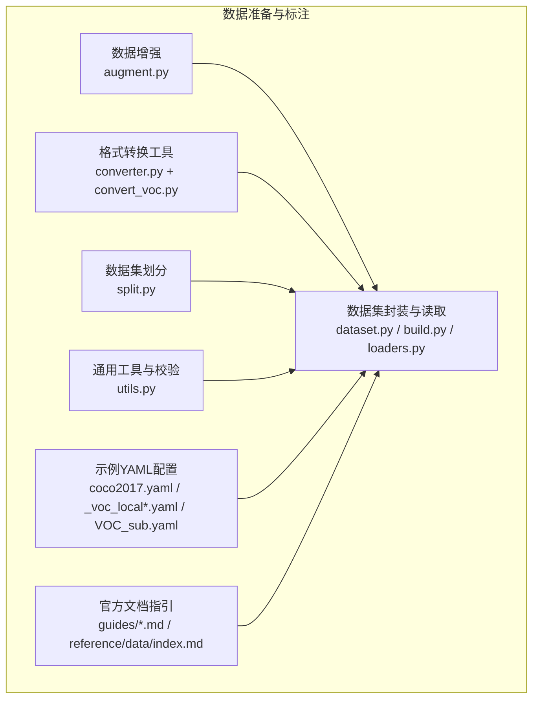
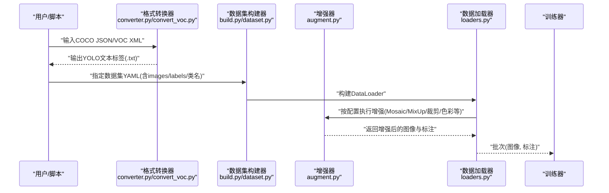
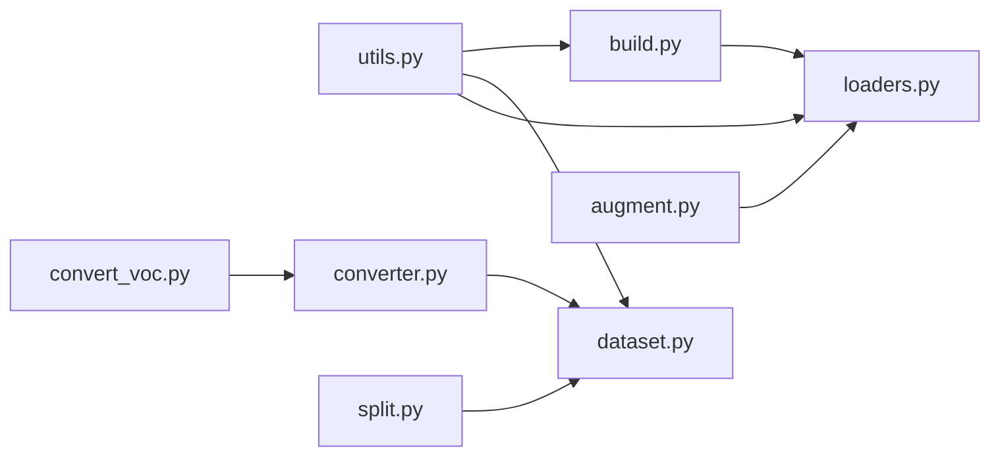

# 数据准备与标注

<cite>
**本文引用的文件**
- [ultralytics/data/augment.py](file://ultralytics/data/augment.py)
- [ultralytics/data/dataset.py](file://ultralytics/data/dataset.py)
- [ultralytics/data/build.py](file://ultralytics/data/build.py)
- [ultralytics/data/loaders.py](file://ultralytics/data/loaders.py)
- [ultralytics/data/converter.py](file://ultralytics/data/converter.py)
- [ultralytics/data/split.py](file://ultralytics/data/split.py)
- [ultralytics/data/utils.py](file://ultralytics/data/utils.py)
- [scripts/convert_voc.py](file://scripts/convert_voc.py)
- [scripts/VOC_sub.yaml](file://scripts/VOC_sub.yaml)
- [scripts/_voc_local.yaml](file://scripts/_voc_local.yaml)
- [scripts/_voc_local_v0_13_15.yaml](file://scripts/_voc_local_v0_13_15.yaml)
- [scripts/coco2017.yaml](file://scripts/coco2017.yaml)
- [scripts/coco2017_quick.yaml](file://scripts/coco2017_quick.yaml)
- [docs/en/guides/yolo-data-augmentation.md](file://docs/en/guides/yolo-data-augmentation.md)
- [docs/en/guides/preprocessing_annotated_data.md](file://docs/en/guides/preprocessing_annotated_data.md)
- [docs/en/guides/preprocessing-annotated-data.md](file://docs/en/guides/preprocessing-annotated-data.md)
- [docs/en/guides/coco-to-yolo.md](file://docs/en/guides/coco-to-yolo.md)
- [docs/en/guides/coco-json-training.md](file://docs/en/guides/coco-json-training.md)
- [docs/en/guides/data-collection-and-annotation.md](file://docs/en/guides/data-collection-and-annotation.md)
- [docs/en/reference/data/index.md](file://docs/en/reference/data/index.md)
</cite>

## 目录
1. [简介](#简介)
2. [项目结构](#项目结构)
3. [核心组件](#核心组件)
4. [架构总览](#架构总览)
5. [详细组件分析](#详细组件分析)
6. [依赖关系分析](#依赖关系分析)
7. [性能考虑](#性能考虑)
8. [故障排查指南](#故障排查指南)
9. [结论](#结论)
10. [附录](#附录)

## 简介
本指南聚焦于目标检测的数据准备与标注，覆盖标准数据集格式（COCO、PASCAL VOC）的要求与转换方法（JSON/XML到YOLO文本），自定义数据的标注工具使用建议，数据验证与质量检查流程，数据增强策略配置（Mosaic、MixUp、随机裁剪、颜色抖动等）及调优建议，以及训练集/验证集/测试集的划分最佳实践。文档同时结合仓库中的数据处理模块与示例脚本，提供可落地的操作路径与参考位置。

## 项目结构
围绕数据准备与标注，仓库中与数据加载、增强、转换、划分相关的核心代码集中在 ultralytics/data 目录下；示例脚本位于 scripts 目录；文档说明位于 docs/en/guides 与 docs/en/reference 目录。下图给出与本主题相关的关键文件与职责概览：

图表来源
- [ultralytics/data/augment.py](file://ultralytics/data/augment.py)
- [ultralytics/data/dataset.py](file://ultralytics/data/dataset.py)
- [ultralytics/data/build.py](file://ultralytics/data/build.py)
- [ultralytics/data/loaders.py](file://ultralytics/data/loaders.py)
- [ultralytics/data/converter.py](file://ultralytics/data/converter.py)
- [ultralytics/data/split.py](file://ultralytics/data/split.py)
- [ultralytics/data/utils.py](file://ultralytics/data/utils.py)
- [scripts/convert_voc.py](file://scripts/convert_voc.py)
- [scripts/coco2017.yaml](file://scripts/coco2017.yaml)
- [scripts/_voc_local.yaml](file://scripts/_voc_local.yaml)
- [scripts/_voc_local_v0_13_15.yaml](file://scripts/_voc_local_v0_13_15.yaml)
- [scripts/VOC_sub.yaml](file://scripts/VOC_sub.yaml)
- [docs/en/guides/yolo-data-augmentation.md](file://docs/en/guides/yolo-data-augmentation.md)
- [docs/en/guides/preprocessing_annotated_data.md](file://docs/en/guides/preprocessing_annotated_data.md)
- [docs/en/guides/preprocessing-annotated-data.md](file://docs/en/guides/preprocessing-annotated-data.md)
- [docs/en/guides/coco-to-yolo.md](file://docs/en/guides/coco-to-yolo.md)
- [docs/en/guides/coco-json-training.md](file://docs/en/guides/coco-json-training.md)
- [docs/en/guides/data-collection-and-annotation.md](file://docs/en/guides/data-collection-and-annotation.md)
- [docs/en/reference/data/index.md](file://docs/en/reference/data/index.md)

章节来源
- [ultralytics/data/augment.py](file://ultralytics/data/augment.py)
- [ultralytics/data/dataset.py](file://ultralytics/data/dataset.py)
- [ultralytics/data/build.py](file://ultralytics/data/build.py)
- [ultralytics/data/loaders.py](file://ultralytics/data/loaders.py)
- [ultralytics/data/converter.py](file://ultralytics/data/converter.py)
- [ultralytics/data/split.py](file://ultralytics/data/split.py)
- [ultralytics/data/utils.py](file://ultralytics/data/utils.py)
- [scripts/convert_voc.py](file://scripts/convert_voc.py)
- [scripts/coco2017.yaml](file://scripts/coco2017.yaml)
- [scripts/_voc_local.yaml](file://scripts/_voc_local.yaml)
- [scripts/_voc_local_v0_13_15.yaml](file://scripts/_voc_local_v0_13_15.yaml)
- [scripts/VOC_sub.yaml](file://scripts/VOC_sub.yaml)
- [docs/en/guides/yolo-data-augmentation.md](file://docs/en/guides/yolo-data-augmentation.md)
- [docs/en/guides/preprocessing_annotated_data.md](file://docs/en/guides/preprocessing_annotated_data.md)
- [docs/en/guides/preprocessing-annotated-data.md](file://docs/en/guides/preprocessing-annotated-data.md)
- [docs/en/guides/coco-to-yolo.md](file://docs/en/guides/coco-to-yolo.md)
- [docs/en/guides/coco-json-training.md](file://docs/en/guides/coco-json-training.md)
- [docs/en/guides/data-collection-and-annotation.md](file://docs/en/guides/data-collection-and-annotation.md)
- [docs/en/reference/data/index.md](file://docs/en/reference/data/index.md)

## 核心组件
- 数据增强管线：负责在训练时动态对图像和标注进行几何与色彩变换、拼接与混合等，提升模型泛化能力。
- 数据集构建与加载：解析YOLO格式或外部格式（如COCO JSON、VOC XML），统一为内部张量批次供训练器消费。
- 格式转换：将COCO JSON、VOC XML转换为YOLO文本标签，便于高效读取与训练。
- 数据集划分：按策略生成train/val/test子集索引或目录结构。
- 数据预处理与校验：清洗异常样本、过滤无效标注、统计类别分布等。

章节来源
- [ultralytics/data/augment.py](file://ultralytics/data/augment.py)
- [ultralytics/data/dataset.py](file://ultralytics/data/dataset.py)
- [ultralytics/data/build.py](file://ultralytics/data/build.py)
- [ultralytics/data/loaders.py](file://ultralytics/data/loaders.py)
- [ultralytics/data/converter.py](file://ultralytics/data/converter.py)
- [ultralytics/data/split.py](file://ultralytics/data/split.py)
- [ultralytics/data/utils.py](file://ultralytics/data/utils.py)

## 架构总览
下图展示从原始数据到训练批次的端到端流程，包括标注格式转换、数据集构建、增强与加载：

图表来源
- [ultralytics/data/converter.py](file://ultralytics/data/converter.py)
- [scripts/convert_voc.py](file://scripts/convert_voc.py)
- [ultralytics/data/build.py](file://ultralytics/data/build.py)
- [ultralytics/data/dataset.py](file://ultralytics/data/dataset.py)
- [ultralytics/data/augment.py](file://ultralytics/data/augment.py)
- [ultralytics/data/loaders.py](file://ultralytics/data/loaders.py)

## 详细组件分析

### 标准数据集格式要求与转换
- COCO JSON
  - 字段通常包含 images、annotations、categories 等，用于描述图像元信息、边界框/分割标注与类别映射。
  - 训练入口可直接消费COCO JSON或通过转换脚本导出YOLO文本。
- PASCAL VOC XML
  - 每个图像对应一个XML，包含对象边界框、类别、尺寸等信息。
  - 可通过专用脚本批量转换为YOLO文本格式。
- YOLO文本格式
  - 每行一个目标：class_id x_center y_center width height（归一化至[0,1]）。
  - 与图像同名同目录，便于快速索引。

转换方法与参考
- COCO JSON → YOLO文本：参考转换文档与实现。
- VOC XML → YOLO文本：参考专用转换脚本与示例YAML。

章节来源
- [docs/en/guides/coco-to-yolo.md](file://docs/en/guides/coco-to-yolo.md)
- [docs/en/guides/coco-json-training.md](file://docs/en/guides/coco-json-training.md)
- [ultralytics/data/converter.py](file://ultralytics/data/converter.py)
- [scripts/convert_voc.py](file://scripts/convert_voc.py)
- [scripts/_voc_local.yaml](file://scripts/_voc_local.yaml)
- [scripts/_voc_local_v0_13_15.yaml](file://scripts/_voc_local_v0_13_15.yaml)
- [scripts/VOC_sub.yaml](file://scripts/VOC_sub.yaml)

### 自定义数据标注工具使用
- LabelImg：轻量级桌面标注工具，适合小规模项目，支持导出YOLO/COCO/Pascal VOC等格式。
- CVAT：在线协作标注平台，适合团队协作与大样本场景，支持多种导出格式。
- Roboflow：一站式数据管理与版本化工具，内置标注、增强、导出与训练工作流。

实践建议
- 明确类别字典并保持一致性，避免后续训练出现类别缺失或重复。
- 导出后统一转换为YOLO文本格式，确保坐标归一化与类别ID正确。
- 建立标注规范（最小面积、遮挡处理、模糊处理等），减少噪声。

章节来源
- [docs/en/guides/data-collection-and-annotation.md](file://docs/en/guides/data-collection-and-annotation.md)

### 数据验证与质量检查流程
- 基础校验
  - 图像存在性与可读性、分辨率范围、通道数。
  - 标注文件完整性：类别ID是否在字典范围内、坐标是否越界、宽高是否为正。
- 统计与可视化
  - 类别分布直方图、目标大小分布、纵横比分布。
  - 抽样可视化检查边界框贴合度与漏标/误标情况。
- 清洗策略
  - 过滤过小目标、严重遮挡、无意义背景。
  - 去重与重复图像检测。
  - 修复损坏的标注或图像。

章节来源
- [ultralytics/data/utils.py](file://ultralytics/data/utils.py)
- [docs/en/guides/preprocessing_annotated_data.md](file://docs/en/guides/preprocessing_annotated_data.md)
- [docs/en/guides/preprocessing-annotated-data.md](file://docs/en/guides/preprocessing-annotated-data.md)

### 数据增强策略配置与调优
- 常用增强技术
  - Mosaic：四图拼接，提升小目标与上下文感知。
  - MixUp：线性插值融合图像与标注，平滑决策边界。
  - 随机裁剪/缩放：模拟多尺度与局部视角变化。
  - 颜色抖动/灰度/对比度/饱和度：提升光照与色彩鲁棒性。
- 配置要点
  - 根据任务特性调整概率与强度，例如小目标密集场景提高Mosaic权重。
  - 控制过强增强的副作用（如过度裁剪导致目标丢失）。
  - 在验证阶段关闭或减弱增强以保证评估稳定性。
- 参考文档与实现
  - 增强参数宏与说明文档。
  - 增强实现与调用链路。

章节来源
- [docs/en/guides/yolo-data-augmentation.md](file://docs/en/guides/yolo-data-augmentation.md)
- [ultralytics/data/augment.py](file://ultralytics/data/augment.py)

### 数据划分策略（训练集、验证集、测试集）
- 常见比例
  - 训练:验证:测试 = 7:2:1 或 8:1:1，视数据规模与任务复杂度而定。
- 分层与平衡
  - 按类别分层抽样，保证各子集类别分布一致。
  - 针对长尾分布采用重采样或加权损失。
- 空间/时间一致性
  - 同一视频/序列的帧应整体划分到同一集合，避免数据泄露。
- 实现参考
  - 使用内置划分工具或脚本生成索引/目录结构。

章节来源
- [ultralytics/data/split.py](file://ultralytics/data/split.py)

## 依赖关系分析
数据准备模块之间的依赖关系如下：

图表来源
- [ultralytics/data/utils.py](file://ultralytics/data/utils.py)
- [ultralytics/data/build.py](file://ultralytics/data/build.py)
- [ultralytics/data/dataset.py](file://ultralytics/data/dataset.py)
- [ultralytics/data/loaders.py](file://ultralytics/data/loaders.py)
- [ultralytics/data/converter.py](file://ultralytics/data/converter.py)
- [ultralytics/data/split.py](file://ultralytics/data/split.py)
- [scripts/convert_voc.py](file://scripts/convert_voc.py)

章节来源
- [ultralytics/data/utils.py](file://ultralytics/data/utils.py)
- [ultralytics/data/build.py](file://ultralytics/data/build.py)
- [ultralytics/data/dataset.py](file://ultralytics/data/dataset.py)
- [ultralytics/data/loaders.py](file://ultralytics/data/loaders.py)
- [ultralytics/data/converter.py](file://ultralytics/data/converter.py)
- [ultralytics/data/split.py](file://ultralytics/data/split.py)
- [scripts/convert_voc.py](file://scripts/convert_voc.py)

## 性能考虑
- I/O优化
  - 使用并行数据加载与缓存机制，减少磁盘瓶颈。
  - 预取与异步I/O可降低GPU等待时间。
- 内存与显存
  - 合理设置批次大小与图像尺寸，避免OOM。
  - 对超大图像进行分块或降采样预处理。
- 增强开销
  - 将CPU密集型增强（如Mosaic）与GPU计算解耦，利用多进程加速。
  - 按需启用增强，验证阶段禁用或降低强度。

## 故障排查指南
- 标注坐标越界或负值
  - 检查归一化逻辑与图像尺寸一致性。
  - 使用校验工具过滤异常样本。
- 类别ID不匹配
  - 核对类别字典与标注文件中的ID映射。
  - 统一导出格式后再进入训练。
- 数据泄漏
  - 确认同一视频/序列未跨集合拆分。
  - 检查随机种子与打乱顺序。
- 增强导致目标丢失
  - 降低裁剪/缩放强度或概率。
  - 增加最小目标阈值与边界保护。

章节来源
- [ultralytics/data/utils.py](file://ultralytics/data/utils.py)
- [docs/en/guides/preprocessing_annotated_data.md](file://docs/en/guides/preprocessing_annotated_data.md)
- [docs/en/guides/preprocessing-annotated-data.md](file://docs/en/guides/preprocessing-annotated-data.md)

## 结论
通过标准化的数据格式、可靠的转换与校验流程、合理的增强策略与科学的划分方案，可以显著提升目标检测模型的训练效率与最终性能。建议在实际项目中建立数据版本管理与质量门禁，持续监控类别分布与标注质量，并结合业务场景微调增强参数与划分策略。

## 附录
- 示例YAML配置（COCO/VOC）
  - 参考仓库内提供的示例配置文件，了解目录结构与字段定义。
- 参考文档
  - 数据增强、预处理、格式转换与数据收集标注的官方指南。

章节来源
- [scripts/coco2017.yaml](file://scripts/coco2017.yaml)
- [scripts/coco2017_quick.yaml](file://scripts/coco2017_quick.yaml)
- [scripts/_voc_local.yaml](file://scripts/_voc_local.yaml)
- [scripts/_voc_local_v0_13_15.yaml](file://scripts/_voc_local_v0_13_15.yaml)
- [scripts/VOC_sub.yaml](file://scripts/VOC_sub.yaml)
- [docs/en/guides/yolo-data-augmentation.md](file://docs/en/guides/yolo-data-augmentation.md)
- [docs/en/guides/preprocessing_annotated_data.md](file://docs/en/guides/preprocessing_annotated_data.md)
- [docs/en/guides/preprocessing-annotated-data.md](file://docs/en/guides/preprocessing-annotated-data.md)
- [docs/en/guides/coco-to-yolo.md](file://docs/en/guides/coco-to-yolo.md)
- [docs/en/guides/coco-json-training.md](file://docs/en/guides/coco-json-training.md)
- [docs/en/guides/data-collection-and-annotation.md](file://docs/en/guides/data-collection-and-annotation.md)
- [docs/en/reference/data/index.md](file://docs/en/reference/data/index.md)