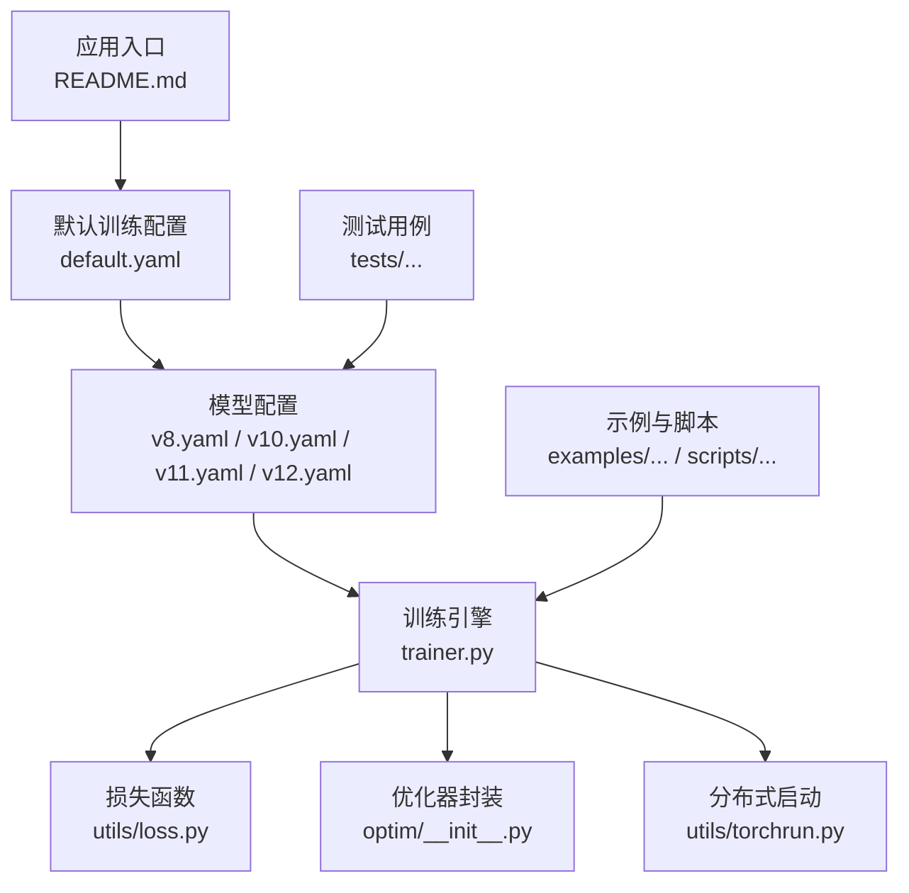
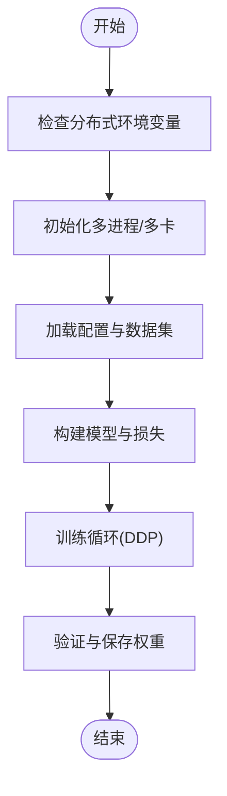
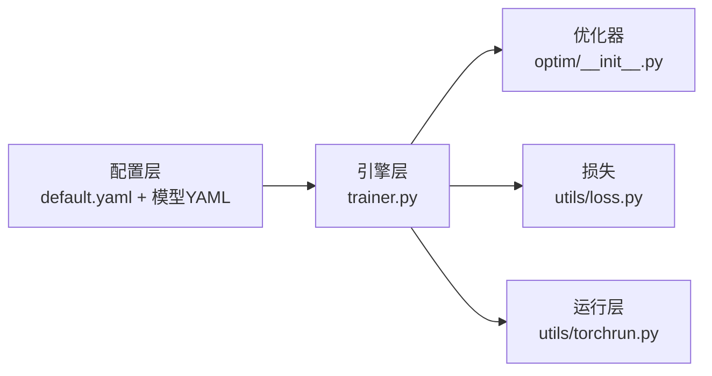

# 模型选择与训练配置

<cite>
**本文引用的文件**
- [README.md](file://README.md)
- [ultralytics/cfg/default.yaml](file://ultralytics/cfg/default.yaml)
- [ultralytics/cfg/models/yolo/v8.yaml](file://ultralytics/cfg/models/yolo/v8.yaml)
- [ultralytics/cfg/models/yolo/v10.yaml](file://ultralytics/cfg/models/yolo/v10.yaml)
- [ultralytics/cfg/models/yolo/v11.yaml](file://ultralytics/cfg/models/yolo/v11.yaml)
- [ultralytics/cfg/models/yolo/v12.yaml](file://ultralytics/cfg/models/yolo/v12.yaml)
- [ultralytics/engine/trainer.py](file://ultralytics/engine/trainer.py)
- [ultralytics/utils/loss.py](file://ultralytics/utils/loss.py)
- [ultralytics/optim/__init__.py](file://ultralytics/optim/__init__.py)
- [ultralytics/utils/torchrun.py](file://ultralytics/utils/torchrun.py)
- [examples/YOLOv10-Master-MoA/README.md](file://examples/YOLOv10-Master-MoA/README.md)
- [scripts/smoke_test_coco2017.py](file://scripts/smoke_test_coco2017.py)
- [tests/test_master_model_configs.py](file://tests/test_master_model_configs.py)
</cite>

## 目录
1. [简介](#简介)
2. [项目结构](#项目结构)
3. [核心组件](#核心组件)
4. [架构总览](#架构总览)
5. [详细组件分析](#详细组件分析)
6. [依赖关系分析](#依赖关系分析)
7. [性能考量](#性能考量)
8. [故障排查指南](#故障排查指南)
9. [结论](#结论)
10. [附录](#附录)

## 简介
本教程面向希望在YOLO-Master中选择并训练不同YOLO系列模型的工程师与研究者，系统讲解：
- 模型选择：YOLOv8（平衡性能）、YOLOv10（高效推理）、YOLOv11（精度提升）、YOLOv12（最新架构）的特点与适用场景
- 训练配置：网络结构参数、优化器（SGD、AdamW）、学习率调度（CosineAnnealing、StepLR）
- 损失函数：CIoU Loss、DFL Loss的配置要点
- 超参数调优方法：学习率、权重衰减、数据增强、批次大小等
- 分布式训练与多GPU设置：torchrun启动、DDP环境、常见坑位与验证方式

## 项目结构
YOLO-Master采用模块化设计，模型定义集中于配置与模块目录，训练引擎位于engine层，损失与优化器在utils与optim中提供，示例与脚本覆盖从快速验证到完整训练的多种路径。



图表来源
- [README.md:1-120](file://README.md#L1-L120)
- [ultralytics/cfg/default.yaml:1-200](file://ultralytics/cfg/default.yaml#L1-L200)
- [ultralytics/cfg/models/yolo/v8.yaml:1-200](file://ultralytics/cfg/models/yolo/v8.yaml#L1-L200)
- [ultralytics/cfg/models/yolo/v10.yaml:1-200](file://ultralytics/cfg/models/yolo/v10.yaml#L1-L200)
- [ultralytics/cfg/models/yolo/v11.yaml:1-200](file://ultralytics/cfg/models/yolo/v11.yaml#L1-L200)
- [ultralytics/cfg/models/yolo/v12.yaml:1-200](file://ultralytics/cfg/models/yolo/v12.yaml#L1-L200)
- [ultralytics/engine/trainer.py:1-200](file://ultralytics/engine/trainer.py#L1-L200)
- [ultralytics/utils/loss.py:1-200](file://ultralytics/utils/loss.py#L1-L200)
- [ultralytics/optim/__init__.py:1-200](file://ultralytics/optim/__init__.py#L1-L200)
- [ultralytics/utils/torchrun.py:1-200](file://ultralytics/utils/torchrun.py#L1-L200)

章节来源
- [README.md:1-120](file://README.md#L1-L120)
- [ultralytics/cfg/default.yaml:1-200](file://ultralytics/cfg/default.yaml#L1-L200)

## 核心组件
- 模型配置体系：通过YAML描述网络结构与任务头，支持v8/v10/v11/v12等多版本
- 训练引擎：统一加载配置、构建模型、初始化优化器与调度器、执行训练循环与验证
- 损失函数：包含分类、回归、分布焦点损失（DFL）等，支持CIoU类IoU变体
- 优化器与调度：封装常用优化器与学习率策略，便于在配置中切换
- 分布式训练：基于torchrun的DDP启动与设备管理

章节来源
- [ultralytics/cfg/models/yolo/v8.yaml:1-200](file://ultralytics/cfg/models/yolo/v8.yaml#L1-L200)
- [ultralytics/cfg/models/yolo/v10.yaml:1-200](file://ultralytics/cfg/models/yolo/v10.yaml#L1-L200)
- [ultralytics/cfg/models/yolo/v11.yaml:1-200](file://ultralytics/cfg/models/yolo/v11.yaml#L1-L200)
- [ultralytics/cfg/models/yolo/v12.yaml:1-200](file://ultralytics/cfg/models/yolo/v12.yaml#L1-L200)
- [ultralytics/engine/trainer.py:1-200](file://ultralytics/engine/trainer.py#L1-L200)
- [ultralytics/utils/loss.py:1-200](file://ultralytics/utils/loss.py#L1-L200)
- [ultralytics/optim/__init__.py:1-200](file://ultralytics/optim/__init__.py#L1-L200)
- [ultralytics/utils/torchrun.py:1-200](file://ultralytics/utils/torchrun.py#L1-L200)

## 架构总览
下图展示从配置到训练的关键流程：解析YAML配置→构建模型→初始化优化器与调度器→训练循环→评估与保存。

```mermaid
sequenceDiagram
participant U as "用户"
participant CFG as "配置解析<br/>default.yaml + 模型YAML"
participant TR as "训练引擎<br/>trainer.py"
participant OPT as "优化器<br/>optim/__init__.py"
participant LOS as "损失函数<br/>utils/loss.py"
participant DIST as "分布式启动<br/>utils/torchrun.py"
U->>CFG : 指定数据集与模型版本
CFG-->>TR : 返回结构化配置
TR->>DIST : 初始化多进程/多卡
TR->>OPT : 创建优化器(如SGD/AdamW)
TR->>LOS : 构建损失(CIoU/DFL等)
loop 每个Epoch
TR->>TR : 前向传播
TR->>LOS : 计算损失
TR->>OPT : 反向传播与参数更新
TR->>TR : 记录指标与日志
end
TR-->>U : 输出权重与评估结果
```

图表来源
- [ultralytics/cfg/default.yaml:1-200](file://ultralytics/cfg/default.yaml#L1-L200)
- [ultralytics/engine/trainer.py:1-200](file://ultralytics/engine/trainer.py#L1-L200)
- [ultralytics/optim/__init__.py:1-200](file://ultralytics/optim/__init__.py#L1-L200)
- [ultralytics/utils/loss.py:1-200](file://ultralytics/utils/loss.py#L1-L200)
- [ultralytics/utils/torchrun.py:1-200](file://ultralytics/utils/torchrun.py#L1-L200)

## 详细组件分析

### 模型选择与特点对比
- YOLOv8：在速度与精度之间取得良好平衡，适合通用目标检测任务与中等算力环境
- YOLOv10：强调高效推理，减少后处理开销，适合部署与实时场景
- YOLOv11：在特征表达与检测头方面进行改进，带来精度提升
- YOLOv12：引入最新架构思想，进一步提升性能上限

建议依据任务需求与部署约束选择：
- 资源受限或需要低延迟：优先v10
- 追求更高mAP且算力充足：优先v11或v12
- 通用基准与稳定性：v8作为基线

章节来源
- [ultralytics/cfg/models/yolo/v8.yaml:1-200](file://ultralytics/cfg/models/yolo/v8.yaml#L1-L200)
- [ultralytics/cfg/models/yolo/v10.yaml:1-200](file://ultralytics/cfg/models/yolo/v10.yaml#L1-L200)
- [ultralytics/cfg/models/yolo/v11.yaml:1-200](file://ultralytics/cfg/models/yolo/v11.yaml#L1-L200)
- [ultralytics/cfg/models/yolo/v12.yaml:1-200](file://ultralytics/cfg/models/yolo/v12.yaml#L1-L200)

### 训练配置要点（网络结构、优化器、学习率调度）
- 网络结构参数：在对应版本的模型YAML中定义骨干、颈部、检测头等关键模块与通道数
- 优化器设置：
  - SGD：适合稳定收敛与经典训练范式
  - AdamW：对稀疏梯度与小样本更友好，常配合权重衰减
- 学习率调度策略：
  - CosineAnnealing：平滑下降，利于后期精细调整
  - StepLR：按固定步长衰减，简单直观

配置组织建议：
- 使用default.yaml统一管理通用训练参数（批次大小、图像尺寸、数据路径等）
- 针对具体模型版本选择对应的YAML以覆盖网络结构差异

章节来源
- [ultralytics/cfg/default.yaml:1-200](file://ultralytics/cfg/default.yaml#L1-L200)
- [ultralytics/cfg/models/yolo/v8.yaml:1-200](file://ultralytics/cfg/models/yolo/v8.yaml#L1-L200)
- [ultralytics/cfg/models/yolo/v10.yaml:1-200](file://ultralytics/cfg/models/yolo/v10.yaml#L1-L200)
- [ultralytics/cfg/models/yolo/v11.yaml:1-200](file://ultralytics/cfg/models/yolo/v11.yaml#L1-L200)
- [ultralytics/cfg/models/yolo/v12.yaml:1-200](file://ultralytics/cfg/models/yolo/v12.yaml#L1-L200)
- [ultralytics/optim/__init__.py:1-200](file://ultralytics/optim/__init__.py#L1-L200)

### 损失函数配置（CIoU Loss、DFL Loss）
- CIoU Loss：在IoU基础上加入中心点距离与长宽比惩罚，有助于边界框回归稳定性
- DFL Loss（Distribution Focal Loss）：将边界框预测建模为分布，提高定位精度

配置要点：
- 在训练引擎中根据任务类型选择相应损失组合
- 调节各损失项权重以平衡分类、定位与分布建模

章节来源
- [ultralytics/utils/loss.py:1-200](file://ultralytics/utils/loss.py#L1-L200)
- [ultralytics/engine/trainer.py:1-200](file://ultralytics/engine/trainer.py#L1-L200)

### 超参数调优方法
- 学习率：结合调度策略进行网格搜索或贝叶斯优化
- 权重衰减：防止过拟合，尤其在小数据集上
- 批次大小：受显存限制，可配合梯度累积
- 数据增强：Mosaic、MixUp、随机仿射等，提升泛化能力
- 早停与验证频率：避免过拟合，缩短实验周期

章节来源
- [ultralytics/cfg/default.yaml:1-200](file://ultralytics/cfg/default.yaml#L1-L200)
- [ultralytics/engine/trainer.py:1-200](file://ultralytics/engine/trainer.py#L1-L200)

### 分布式训练与多GPU设置
- 使用torchrun启动多进程训练，自动分配设备与同步梯度
- 关键环境变量：进程数、本地端口、节点信息等
- 注意事项：确保数据加载并行度与内存占用匹配硬件；合理设置每卡批次大小



图表来源
- [ultralytics/utils/torchrun.py:1-200](file://ultralytics/utils/torchrun.py#L1-L200)
- [ultralytics/engine/trainer.py:1-200](file://ultralytics/engine/trainer.py#L1-L200)

章节来源
- [ultralytics/utils/torchrun.py:1-200](file://ultralytics/utils/torchrun.py#L1-L200)
- [ultralytics/engine/trainer.py:1-200](file://ultralytics/engine/trainer.py#L1-L200)

### 端到端训练流程（代码级序列图）
```mermaid
sequenceDiagram
participant CLI as "命令行/脚本"
participant TR as "训练引擎<br/>trainer.py"
participant CFG as "配置<br/>default.yaml + 模型YAML"
participant OPT as "优化器<br/>optim/__init__.py"
participant LOS as "损失<br/>utils/loss.py"
participant DIST as "分布式<br/>utils/torchrun.py"
CLI->>TR : 传入数据集与模型版本
TR->>CFG : 解析配置
TR->>DIST : 初始化DDP
TR->>OPT : 创建优化器
TR->>LOS : 构建损失
loop Epochs
TR->>TR : 前向+损失计算
TR->>OPT : 反向传播与更新
TR->>TR : 记录指标
end
TR-->>CLI : 输出权重与报告
```

图表来源
- [ultralytics/engine/trainer.py:1-200](file://ultralytics/engine/trainer.py#L1-L200)
- [ultralytics/cfg/default.yaml:1-200](file://ultralytics/cfg/default.yaml#L1-L200)
- [ultralytics/optim/__init__.py:1-200](file://ultralytics/optim/__init__.py#L1-L200)
- [ultralytics/utils/loss.py:1-200](file://ultralytics/utils/loss.py#L1-L200)
- [ultralytics/utils/torchrun.py:1-200](file://ultralytics/utils/torchrun.py#L1-L200)

## 依赖关系分析
- 配置层：default.yaml与各模型YAML共同决定网络结构与训练行为
- 引擎层：trainer.py协调数据、模型、优化器、损失与分布式
- 工具层：loss.py与optim/__init__.py提供核心算法实现
- 运行层：torchrun.py负责多进程与设备管理



图表来源
- [ultralytics/cfg/default.yaml:1-200](file://ultralytics/cfg/default.yaml#L1-L200)
- [ultralytics/cfg/models/yolo/v8.yaml:1-200](file://ultralytics/cfg/models/yolo/v8.yaml#L1-L200)
- [ultralytics/cfg/models/yolo/v10.yaml:1-200](file://ultralytics/cfg/models/yolo/v10.yaml#L1-L200)
- [ultralytics/cfg/models/yolo/v11.yaml:1-200](file://ultralytics/cfg/models/yolo/v11.yaml#L1-L200)
- [ultralytics/cfg/models/yolo/v12.yaml:1-200](file://ultralytics/cfg/models/yolo/v12.yaml#L1-L200)
- [ultralytics/engine/trainer.py:1-200](file://ultralytics/engine/trainer.py#L1-L200)
- [ultralytics/optim/__init__.py:1-200](file://ultralytics/optim/__init__.py#L1-L200)
- [ultralytics/utils/loss.py:1-200](file://ultralytics/utils/loss.py#L1-L200)
- [ultralytics/utils/torchrun.py:1-200](file://ultralytics/utils/torchrun.py#L1-L200)

章节来源
- [ultralytics/cfg/default.yaml:1-200](file://ultralytics/cfg/default.yaml#L1-L200)
- [ultralytics/engine/trainer.py:1-200](file://ultralytics/engine/trainer.py#L1-L200)

## 性能考量
- 推理效率：v10在后处理与算子层面做了优化，适合边缘部署
- 精度上限：v11与v12在特征融合与检测头上有改进，适合高精度需求
- 训练吞吐：增大批次与数据并行度可提升吞吐，但需关注显存与通信开销
- 混合精度与编译：结合框架特性（如AMP、TorchCompile）进一步加速

[本节为通用指导，不直接分析具体文件]

## 故障排查指南
- 分布式启动失败：检查torchrun环境变量与端口占用；确认进程数与GPU数量一致
- 训练不稳定：降低学习率或更换调度策略；检查损失权重是否合理
- 显存不足：减小批次大小或图像分辨率；启用梯度累积
- 验证异常：核对数据集路径与标签格式；参考示例与脚本进行最小复现

章节来源
- [ultralytics/utils/torchrun.py:1-200](file://ultralytics/utils/torchrun.py#L1-L200)
- [scripts/smoke_test_coco2017.py:1-200](file://scripts/smoke_test_coco2017.py#L1-L200)
- [tests/test_master_model_configs.py:1-200](file://tests/test_master_model_configs.py#L1-L200)

## 结论
通过合理的模型选择与训练配置，可在不同算力与部署条件下获得稳定的检测性能。建议以v8为基线，逐步迁移至v10/v11/v12，并结合优化器与调度策略进行系统化调参。分布式训练能显著提升训练效率，但需注意环境与资源配置。

[本节为总结性内容，不直接分析具体文件]

## 附录
- 示例与参考：
  - 快速验证脚本：smoke_test_coco2017.py
  - 相关示例说明：examples/YOLOv10-Master-MoA/README.md
  - 模型配置一致性测试：tests/test_master_model_configs.py

章节来源
- [scripts/smoke_test_coco2017.py:1-200](file://scripts/smoke_test_coco2017.py#L1-L200)
- [examples/YOLOv10-Master-MoA/README.md:1-200](file://examples/YOLOv10-Master-MoA/README.md#L1-L200)
- [tests/test_master_model_configs.py:1-200](file://tests/test_master_model_configs.py#L1-L200)