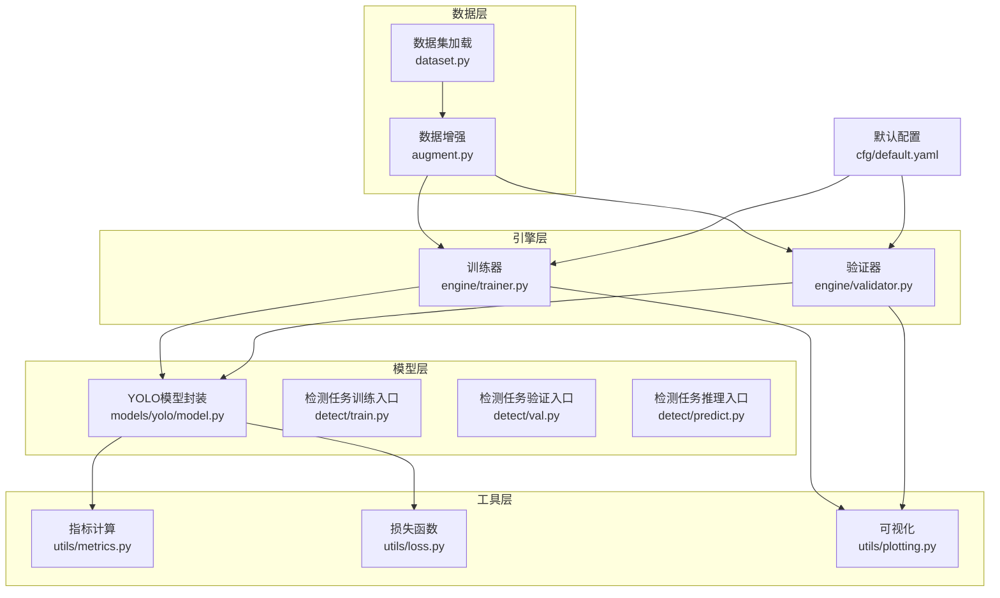
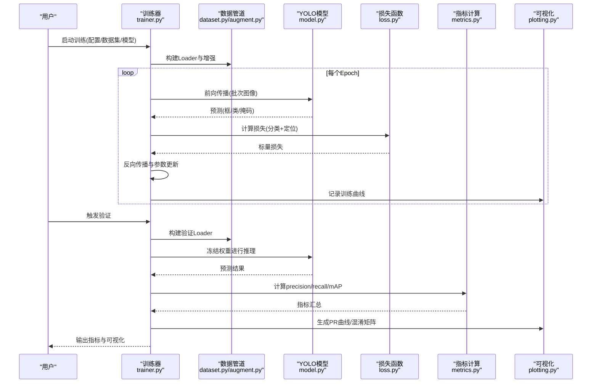
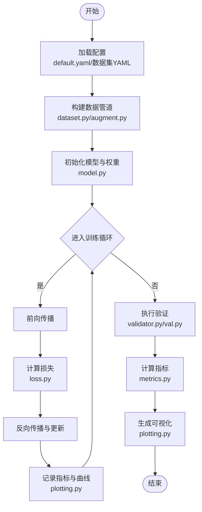
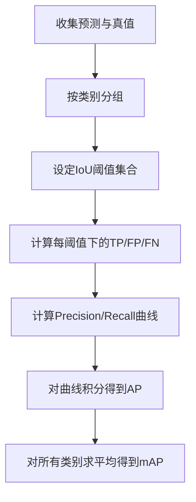
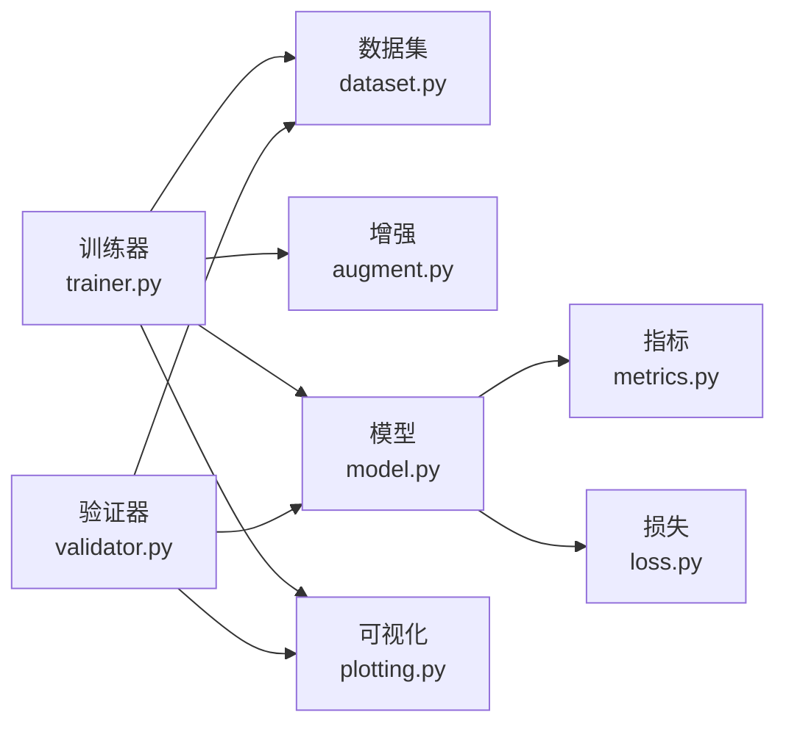

# 目标检测教程

<cite>
**本文引用的文件**
- [README.md](file://README.md)
- [ultralytics/cfg/default.yaml](file://ultralytics/cfg/default.yaml)
- [ultralytics/data/dataset.py](file://ultralytics/data/dataset.py)
- [ultralytics/data/augment.py](file://ultralytics/data/augment.py)
- [ultralytics/engine/trainer.py](file://ultralytics/engine/trainer.py)
- [ultralytics/engine/validator.py](file://ultralytics/engine/validator.py)
- [ultralytics/utils/metrics.py](file://ultralytics/utils/metrics.py)
- [ultralytics/utils/loss.py](file://ultralytics/utils/loss.py)
- [ultralytics/models/yolo/model.py](file://ultralytics/models/yolo/model.py)
- [ultralytics/models/yolo/detect/train.py](file://ultralytics/models/yolo/detect/train.py)
- [ultralytics/models/yolo/detect/val.py](file://ultralytics/models/yolo/detect/val.py)
- [ultralytics/models/yolo/detect/predict.py](file://ultralytics/models/yolo/detect/predict.py)
- [ultralytics/utils/plotting.py](file://ultralytics/utils/plotting.py)
- [examples/YOLOv8-ONNXRuntime-Python/main.py](file://examples/YOLOv8-ONNXRuntime-Python/main.py)
- [scripts/smoke_test_coco2017.py](file://scripts/smoke_test_coco2017.py)
- [docs/en/guides/yolo-data-augmentation.md](file://docs/en/guides/yolo-data-augmentation.md)
- [docs/en/guides/yolo-performance-metrics.md](file://docs/en/guides/yolo-performance-metrics.md)
- [docs/en/guides/model-training-tips.md](file://docs/en/guides/model-training-tips.md)
- [docs/en/guides/hyperparameter-tuning.md](file://docs/en/guides/hyperparameter-tuning.md)
- [docs/en/guides/export-non-yolo-models.md](file://docs/en/guides/export-non-yolo-models.md)
- [docs/en/guides/model-deployment-options.md](file://docs/en/guides/model-deployment-options.md)
</cite>

## 目录
1. [简介](#简介)
2. [项目结构](#项目结构)
3. [核心组件](#核心组件)
4. [架构总览](#架构总览)
5. [详细组件分析](#详细组件分析)
6. [依赖关系分析](#依赖关系分析)
7. [性能考虑](#性能考虑)
8. [故障排查指南](#故障排查指南)
9. [结论](#结论)
10. [附录](#附录)

## 简介
本教程面向希望系统掌握YOLO-Master在目标检测任务上从数据准备、模型选择、训练配置、评估指标到可视化调试与部署的读者。内容覆盖：
- 标准数据集格式（COCO、PASCAL VOC）与自定义数据标注、转换流程
- YOLO系列模型（YOLOv8、YOLOv10、YOLOv11、YOLOv12）特点与选型策略
- 完整训练配置示例（学习率调度、数据增强、损失函数等）
- 评估指标（mAP、precision、recall）含义与计算方法
- 结果可视化、混淆矩阵分析与错误案例分析
- 性能优化建议与部署前准备

## 项目结构
仓库采用模块化组织，核心代码位于 ultralytics 包下，文档与示例分别位于 docs 与 examples 目录，脚本与基准测试位于 scripts 与 benchmarks 目录。关键路径说明：
- 数据与增强：ultralytics/data/*
- 训练/验证/预测引擎：ultralytics/engine/*
- 模型定义与任务实现：ultralytics/models/yolo/*
- 指标与损失：ultralytics/utils/metrics.py, ultralytics/utils/loss.py
- 可视化：ultralytics/utils/plotting.py
- 默认配置：ultralytics/cfg/default.yaml
- 文档与指南：docs/en/guides/*
- 示例与部署：examples/*

图表来源
- [ultralytics/data/dataset.py](file://ultralytics/data/dataset.py)
- [ultralytics/data/augment.py](file://ultralytics/data/augment.py)
- [ultralytics/models/yolo/model.py](file://ultralytics/models/yolo/model.py)
- [ultralytics/models/yolo/detect/train.py](file://ultralytics/models/yolo/detect/train.py)
- [ultralytics/models/yolo/detect/val.py](file://ultralytics/models/yolo/detect/val.py)
- [ultralytics/models/yolo/detect/predict.py](file://ultralytics/models/yolo/detect/predict.py)
- [ultralytics/engine/trainer.py](file://ultralytics/engine/trainer.py)
- [ultralytics/engine/validator.py](file://ultralytics/engine/validator.py)
- [ultralytics/utils/metrics.py](file://ultralytics/utils/metrics.py)
- [ultralytics/utils/loss.py](file://ultralytics/utils/loss.py)
- [ultralytics/utils/plotting.py](file://ultralytics/utils/plotting.py)
- [ultralytics/cfg/default.yaml](file://ultralytics/cfg/default.yaml)

章节来源
- [README.md](file://README.md)

## 核心组件
- 数据管道
  - 数据集加载与解析：支持COCO JSON、YOLO TXT等多种格式；提供统一接口供训练/验证使用。
  - 数据增强：几何变换、色彩扰动、MixUp/Mosaic等，提升泛化能力。
- 模型与任务
  - YOLO模型封装：统一模型注册与权重管理，适配不同版本（v8/v10/v11/v12）。
  - 检测任务：训练、验证、推理三入口清晰分离，便于扩展与集成。
- 训练与验证引擎
  - 训练器：负责优化器、学习率调度、EMA、日志记录、断点恢复等。
  - 验证器：负责指标统计、曲线绘制、混淆矩阵生成与导出。
- 指标与损失
  - 指标：precision、recall、mAP@0.5:0.95等，支持多类别与多阈值。
  - 损失：分类损失、定位损失、正则项组合，支持动态权重与任务特定调整。
- 可视化
  - 训练曲线、PR曲线、混淆矩阵、检测结果图导出，便于诊断与报告。

章节来源
- [ultralytics/data/dataset.py](file://ultralytics/data/dataset.py)
- [ultralytics/data/augment.py](file://ultralytics/data/augment.py)
- [ultralytics/models/yolo/model.py](file://ultralytics/models/yolo/model.py)
- [ultralytics/models/yolo/detect/train.py](file://ultralytics/models/yolo/detect/train.py)
- [ultralytics/models/yolo/detect/val.py](file://ultralytics/models/yolo/detect/val.py)
- [ultralytics/models/yolo/detect/predict.py](file://ultralytics/models/yolo/detect/predict.py)
- [ultralytics/engine/trainer.py](file://ultralytics/engine/trainer.py)
- [ultralytics/engine/validator.py](file://ultralytics/engine/validator.py)
- [ultralytics/utils/metrics.py](file://ultralytics/utils/metrics.py)
- [ultralytics/utils/loss.py](file://ultralytics/utils/loss.py)
- [ultralytics/utils/plotting.py](file://ultralytics/utils/plotting.py)

## 架构总览
下图展示一次端到端训练与验证的关键调用链：训练器驱动数据管道与模型，计算损失并更新参数；验证器在固定权重下统计指标并输出可视化。

图表来源
- [ultralytics/engine/trainer.py](file://ultralytics/engine/trainer.py)
- [ultralytics/data/dataset.py](file://ultralytics/data/dataset.py)
- [ultralytics/data/augment.py](file://ultralytics/data/augment.py)
- [ultralytics/models/yolo/model.py](file://ultralytics/models/yolo/model.py)
- [ultralytics/utils/loss.py](file://ultralytics/utils/loss.py)
- [ultralytics/utils/metrics.py](file://ultralytics/utils/metrics.py)
- [ultralytics/utils/plotting.py](file://ultralytics/utils/plotting.py)

## 详细组件分析

### 数据准备与标注转换
- 标准数据集格式
  - COCO：JSON标注，包含图像信息、类别映射、边界框坐标与可见性标记；适合大规模通用场景。
  - PASCAL VOC：XML标注，结构简单，适合中小规模任务与教学演示。
- 自定义数据标注与转换
  - 标注工具：建议使用支持COCO或YOLO格式的标注工具，确保类别ID一致、坐标归一化正确。
  - 转换流程：将原始标注转换为COCO JSON或YOLO TXT；校验类别数与名称映射；划分train/val/test集。
  - 配置文件：通过数据集YAML指定路径、类别数、类别名与数据源，便于训练/验证复用。
- 数据增强策略
  - 几何增强：随机裁剪、翻转、旋转、缩放、仿射变换。
  - 色彩增强：亮度、对比度、饱和度、色调抖动。
  - 混合增强：Mosaic、MixUp，提升小目标与遮挡鲁棒性。
  - 参考指南：[yolo-data-augmentation.md](file://docs/en/guides/yolo-data-augmentation.md)

章节来源
- [ultralytics/data/dataset.py](file://ultralytics/data/dataset.py)
- [ultralytics/data/augment.py](file://ultralytics/data/augment.py)
- [docs/en/guides/yolo-data-augmentation.md](file://docs/en/guides/yolo-data-augmentation.md)

### 模型选择与特性对比（YOLOv8 / v10 / v11 / v12）
- 选择策略
  - 精度优先：YOLOv11/v12通常具备更强表征能力，适合复杂场景与长尾分布。
  - 速度优先：YOLOv8/v10在边缘设备与低延迟场景更具优势。
  - 资源约束：根据GPU显存、算力与部署平台权衡模型大小与复杂度。
- 实践建议
  - 基线实验：在同一数据集与配置下对比各版本，关注mAP与推理时延。
  - 迁移学习：优先使用预训练权重微调，缩短收敛时间并提升稳定性。
  - 参考文档：各版本模型页面与性能表，结合业务需求选择合适尺寸（n/s/m/l/x）。

章节来源
- [ultralytics/models/yolo/model.py](file://ultralytics/models/yolo/model.py)
- [docs/en/guides/yolo-performance-metrics.md](file://docs/en/guides/yolo-performance-metrics.md)

### 训练配置与流程
- 学习率调度
  - 常用策略：余弦退火、阶梯下降、Warmup+Cosine；配合早停与EMA提升稳定性。
  - 参考指南：[hyperparameter-tuning.md](file://docs/en/guides/hyperparameter-tuning.md)
- 数据增强
  - 根据数据规模与场景选择增强强度；小样本数据建议强增强与大batch。
- 损失函数
  - 分类损失与定位损失加权；可引入Focal Loss缓解类别不平衡。
  - 参考实现：[loss.py](file://ultralytics/utils/loss.py)
- 训练入口与流程
  - 训练器负责优化器初始化、LR调度、EMA、日志与保存；验证器负责指标统计与可视化。
  - 参考入口：[detect/train.py](file://ultralytics/models/yolo/detect/train.py), [engine/trainer.py](file://ultralytics/engine/trainer.py)

图表来源
- [ultralytics/cfg/default.yaml](file://ultralytics/cfg/default.yaml)
- [ultralytics/data/dataset.py](file://ultralytics/data/dataset.py)
- [ultralytics/data/augment.py](file://ultralytics/data/augment.py)
- [ultralytics/models/yolo/model.py](file://ultralytics/models/yolo/model.py)
- [ultralytics/utils/loss.py](file://ultralytics/utils/loss.py)
- [ultralytics/engine/trainer.py](file://ultralytics/engine/trainer.py)
- [ultralytics/engine/validator.py](file://ultralytics/engine/validator.py)
- [ultralytics/utils/plotting.py](file://ultralytics/utils/plotting.py)

章节来源
- [ultralytics/cfg/default.yaml](file://ultralytics/cfg/default.yaml)
- [ultralytics/models/yolo/detect/train.py](file://ultralytics/models/yolo/detect/train.py)
- [ultralytics/engine/trainer.py](file://ultralytics/engine/trainer.py)
- [docs/en/guides/hyperparameter-tuning.md](file://docs/en/guides/hyperparameter-tuning.md)

### 评估指标与计算方法
- 指标含义
  - Precision：预测为正样本中真实正样本的比例。
  - Recall：真实正样本中被正确预测的比例。
  - mAP：在不同IoU阈值下的平均精度，综合衡量检测质量。
- 计算方法
  - 基于置信度阈值与IoU阈值生成TP/FP/FN，逐类计算Precision/Recall，再积分得到AP，最终求平均得mAP。
  - 参考实现与说明：[metrics.py](file://ultralytics/utils/metrics.py), [yolo-performance-metrics.md](file://docs/en/guides/yolo-performance-metrics.md)

图表来源
- [ultralytics/utils/metrics.py](file://ultralytics/utils/metrics.py)
- [docs/en/guides/yolo-performance-metrics.md](file://docs/en/guides/yolo-performance-metrics.md)

章节来源
- [ultralytics/utils/metrics.py](file://ultralytics/utils/metrics.py)
- [docs/en/guides/yolo-performance-metrics.md](file://docs/en/guides/yolo-performance-metrics.md)

### 结果可视化与调试技巧
- 可视化内容
  - 训练曲线：损失、指标随迭代变化趋势。
  - PR曲线：不同阈值下的Precision-Recall表现。
  - 混淆矩阵：类别间误判热点，辅助定位困难类别。
  - 检测结果图：框、类别、置信度叠加，直观检查漏检/误检。
- 调试步骤
  - 查看训练曲线是否稳定收敛；若震荡，降低学习率或增大batch。
  - 分析混淆矩阵，针对高频误判类别增加数据或调整增强。
  - 抽样错误案例，检查标注质量与数据一致性。
- 参考入口
  - 可视化模块：[plotting.py](file://ultralytics/utils/plotting.py)
  - 验证入口：[detect/val.py](file://ultralytics/models/yolo/detect/val.py)

章节来源
- [ultralytics/utils/plotting.py](file://ultralytics/utils/plotting.py)
- [ultralytics/models/yolo/detect/val.py](file://ultralytics/models/yolo/detect/val.py)

### 推理与部署准备
- 推理入口
  - 检测推理：[detect/predict.py](file://ultralytics/models/yolo/detect/predict.py)
  - 示例：ONNXRuntime Python推理示例，便于快速集成与跨平台部署。
- 导出与部署
  - 导出非YOLO模型与多种后端（ONNX/TensorRT/OpenVINO等），参考指南：
    - [export-non-yolo-models.md](file://docs/en/guides/export-non-yolo-models.md)
    - [model-deployment-options.md](file://docs/en/guides/model-deployment-options.md)
- 示例路径
  - ONNXRuntime示例：[examples/YOLOv8-ONNXRuntime-Python/main.py](file://examples/YOLOv8-ONNXRuntime-Python/main.py)

章节来源
- [ultralytics/models/yolo/detect/predict.py](file://ultralytics/models/yolo/detect/predict.py)
- [examples/YOLOv8-ONNXRuntime-Python/main.py](file://examples/YOLOv8-ONNXRuntime-Python/main.py)
- [docs/en/guides/export-non-yolo-models.md](file://docs/en/guides/export-non-yolo-models.md)
- [docs/en/guides/model-deployment-options.md](file://docs/en/guides/model-deployment-options.md)

## 依赖关系分析
- 组件耦合
  - 训练器与验证器均依赖数据管道与模型封装；指标与可视化作为工具层被上层调用。
  - 损失函数与指标紧密关联，共同构成评估闭环。
- 外部依赖
  - 深度学习框架（PyTorch）、可视化工具（Matplotlib/Seaborn）、导出后端（ONNX/TensorRT/OpenVINO）。
- 潜在风险
  - 数据格式不一致导致解析失败；类别映射错误影响指标计算；增强过度导致过拟合。

图表来源
- [ultralytics/engine/trainer.py](file://ultralytics/engine/trainer.py)
- [ultralytics/engine/validator.py](file://ultralytics/engine/validator.py)
- [ultralytics/data/dataset.py](file://ultralytics/data/dataset.py)
- [ultralytics/data/augment.py](file://ultralytics/data/augment.py)
- [ultralytics/models/yolo/model.py](file://ultralytics/models/yolo/model.py)
- [ultralytics/utils/metrics.py](file://ultralytics/utils/metrics.py)
- [ultralytics/utils/loss.py](file://ultralytics/utils/loss.py)
- [ultralytics/utils/plotting.py](file://ultralytics/utils/plotting.py)

章节来源
- [ultralytics/engine/trainer.py](file://ultralytics/engine/trainer.py)
- [ultralytics/engine/validator.py](file://ultralytics/engine/validator.py)
- [ultralytics/data/dataset.py](file://ultralytics/data/dataset.py)
- [ultralytics/data/augment.py](file://ultralytics/data/augment.py)
- [ultralytics/models/yolo/model.py](file://ultralytics/models/yolo/model.py)
- [ultralytics/utils/metrics.py](file://ultralytics/utils/metrics.py)
- [ultralytics/utils/loss.py](file://ultralytics/utils/loss.py)
- [ultralytics/utils/plotting.py](file://ultralytics/utils/plotting.py)

## 性能考虑
- 训练阶段
  - 合理设置batch size与学习率，避免梯度爆炸或欠拟合。
  - 使用EMA平滑权重，提升验证期稳定性。
  - 数据增强强度与数据规模匹配，防止过拟合或欠拟合。
- 推理阶段
  - 选择合适的模型尺寸与输入分辨率，平衡精度与时延。
  - 利用导出后端（TensorRT/OpenVINO）加速推理。
- 监控与调优
  - 关注训练曲线与指标拐点，及时调整超参。
  - 参考指南：[model-training-tips.md](file://docs/en/guides/model-training-tips.md)

章节来源
- [docs/en/guides/model-training-tips.md](file://docs/en/guides/model-training-tips.md)

## 故障排查指南
- 常见问题
  - 数据路径错误或类别映射不一致：检查数据集YAML与标注文件。
  - 训练不收敛：降低学习率、增大batch、检查数据增强强度。
  - 指标异常：确认IoU阈值与置信度阈值设置，核对类别数量。
- 快速验证
  - 使用轻量脚本进行端到端冒烟测试，确保环境、数据与模型正常。
  - 参考脚本：[smoke_test_coco2017.py](file://scripts/smoke_test_coco2017.py)

章节来源
- [scripts/smoke_test_coco2017.py](file://scripts/smoke_test_coco2017.py)

## 结论
本教程从数据准备、模型选择、训练配置、评估指标到可视化调试与部署，提供了YOLO-Master目标检测任务的系统化实践路径。建议在真实项目中以小规模实验快速验证假设，逐步扩大规模并优化性能，同时重视数据质量与标注一致性，以获得稳定可靠的检测效果。

## 附录
- 快速上手
  - 阅读仓库主文档与英文指南，了解安装与环境配置。
  - 参考示例与脚本，完成首次训练与推理。
- 进一步阅读
  - 数据增强与超参调优指南
  - 性能指标与部署选项文档