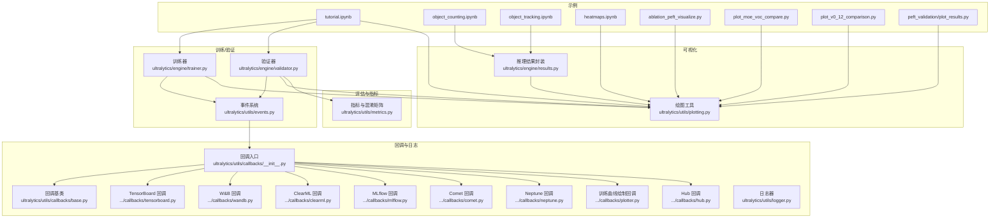
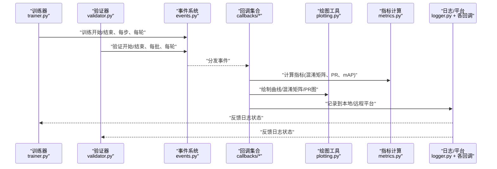
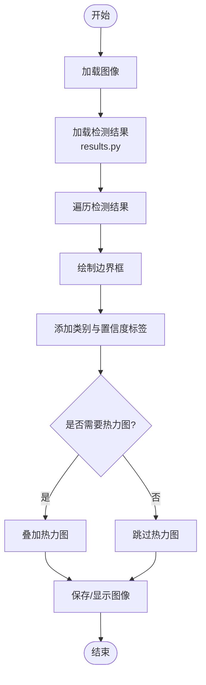
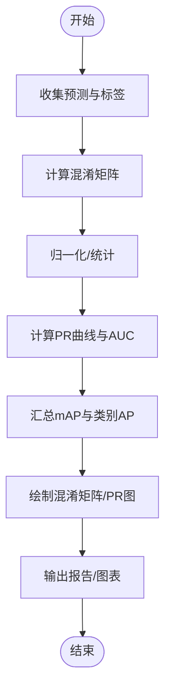
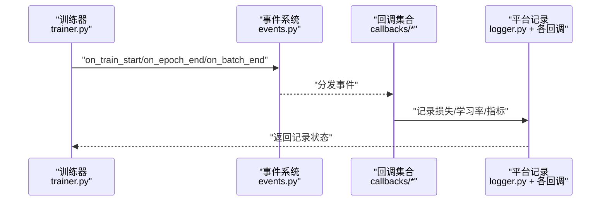
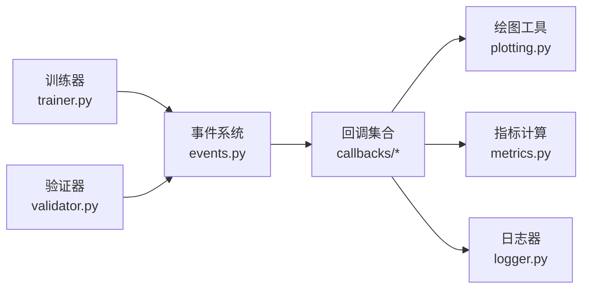

# 结果可视化与调试

<cite>
**本文引用的文件**
- [ultralytics/utils/plotting.py](file://ultralytics/utils/plotting.py)
- [ultralytics/utils/metrics.py](file://ultralytics/utils/metrics.py)
- [ultralytics/engine/trainer.py](file://ultralytics/engine/trainer.py)
- [ultralytics/engine/validator.py](file://ultralytics/engine/validator.py)
- [ultralytics/engine/results.py](file://ultralytics/engine/results.py)
- [ultralytics/utils/callbacks/__init__.py](file://ultralytics/utils/callbacks/__init__.py)
- [ultralytics/utils/callbacks/base.py](file://ultralytics/utils/callbacks/base.py)
- [ultralytics/utils/callbacks/tensorboard.py](file://ultralytics/utils/callbacks/tensorboard.py)
- [ultralytics/utils/callbacks/clearml.py](file://ultralytics/utils/callbacks/clearml.py)
- [ultralytics/utils/callbacks/wandb.py](file://ultralytics/utils/callbacks/wandb.py)
- [ultralytics/utils/callbacks/mlflow.py](file://ultralytics/utils/callbacks/mlflow.py)
- [ultralytics/utils/callbacks/comet.py](file://ultralytics/utils/callbacks/comet.py)
- [ultralytics/utils/callbacks/neptune.py](file://ultralytics/utils/callbacks/neptune.py)
- [ultralytics/utils/callbacks/plotter.py](file://ultralytics/utils/callbacks/plotter.py)
- [ultralytics/utils/callbacks/hub.py](file://ultralytics/utils/callbacks/hub.py)
- [ultralytics/utils/events.py](file://ultralytics/utils/events.py)
- [ultralytics/utils/logger.py](file://ultralytics/utils/logger.py)
- [examples/tutorial.ipynb](file://examples/tutorial.ipynb)
- [examples/object_counting.ipynb](file://examples/object_counting.ipynb)
- [examples/object_tracking.ipynb](file://examples/object_tracking.ipynb)
- [examples/heatmaps.ipynb](file://examples/heatmaps.ipynb)
- [scripts/ablation_suite/ablation_peft_visualize.py](file://scripts/ablation_suite/ablation_peft_visualize.py)
- [scripts/plot_moe_voc_compare.py](file://scripts/plot_moe_voc_compare.py)
- [scripts/plot_v0_12_comparison.py](file://scripts/plot_v0_12_comparison.py)
- [scripts/peft_validation/plot_results.py](file://scripts/peft_validation/plot_results.py)
</cite>

## 目录
1. [简介](#简介)
2. [项目结构](#项目结构)
3. [核心组件](#核心组件)
4. [架构总览](#架构总览)
5. [详细组件分析](#详细组件分析)
6. [依赖关系分析](#依赖关系分析)
7. [性能考量](#性能考量)
8. [故障排查指南](#故障排查指南)
9. [结论](#结论)
10. [附录](#附录)

## 简介
本指南聚焦于目标检测结果可视化与调试的实用方法，覆盖检测框绘制、置信度阈值调整、类别标签显示、混淆矩阵生成与解读、训练过程监控（损失曲线、学习率变化）等。同时提供常见问题诊断思路，如过拟合、欠拟合、数据不平衡等的识别与解决建议。内容基于仓库中可视化、指标计算、回调与日志记录相关实现进行梳理，帮助读者快速定位问题并优化模型表现。

## 项目结构
围绕“结果可视化与调试”的关键代码主要分布在以下模块：
- 可视化绘图：绘图工具与图表生成
- 指标与评估：混淆矩阵、PR/AUC、mAP 等
- 训练/验证流程：事件触发、指标写入、回调机制
- 回调集成：TensorBoard、Weights & Biases、ClearML、MLflow、Comet、Neptune 等
- 示例脚本：Jupyter Notebook 与 Python 脚本用于端到端演示

图示来源
- [ultralytics/utils/plotting.py](file://ultralytics/utils/plotting.py)
- [ultralytics/utils/metrics.py](file://ultralytics/utils/metrics.py)
- [ultralytics/engine/trainer.py](file://ultralytics/engine/trainer.py)
- [ultralytics/engine/validator.py](file://ultralytics/engine/validator.py)
- [ultralytics/engine/results.py](file://ultralytics/engine/results.py)
- [ultralytics/utils/callbacks/__init__.py](file://ultralytics/utils/callbacks/__init__.py)
- [ultralytics/utils/callbacks/base.py](file://ultralytics/utils/callbacks/base.py)
- [ultralytics/utils/callbacks/tensorboard.py](file://ultralytics/utils/callbacks/tensorboard.py)
- [ultralytics/utils/callbacks/wandb.py](file://ultralytics/utils/callbacks/wandb.py)
- [ultralytics/utils/callbacks/clearml.py](file://ultralytics/utils/callbacks/clearml.py)
- [ultralytics/utils/callbacks/mlflow.py](file://ultralytics/utils/callbacks/mlflow.py)
- [ultralytics/utils/callbacks/comet.py](file://ultralytics/utils/callbacks/comet.py)
- [ultralytics/utils/callbacks/neptune.py](file://ultralytics/utils/callbacks/neptune.py)
- [ultralytics/utils/callbacks/plotter.py](file://ultralytics/utils/callbacks/plotter.py)
- [ultralytics/utils/callbacks/hub.py](file://ultralytics/utils/callbacks/hub.py)
- [ultralytics/utils/events.py](file://ultralytics/utils/events.py)
- [ultralytics/utils/logger.py](file://ultralytics/utils/logger.py)
- [examples/tutorial.ipynb](file://examples/tutorial.ipynb)
- [examples/object_counting.ipynb](file://examples/object_counting.ipynb)
- [examples/object_tracking.ipynb](file://examples/object_tracking.ipynb)
- [examples/heatmaps.ipynb](file://examples/heatmaps.ipynb)
- [scripts/ablation_suite/ablation_peft_visualize.py](file://scripts/ablation_suite/ablation_peft_visualize.py)
- [scripts/plot_moe_voc_compare.py](file://scripts/plot_moe_voc_compare.py)
- [scripts/plot_v0_12_comparison.py](file://scripts/plot_v0_12_comparison.py)
- [scripts/peft_validation/plot_results.py](file://scripts/peft_validation/plot_results.py)

章节来源
- [ultralytics/utils/plotting.py](file://ultralytics/utils/plotting.py)
- [ultralytics/utils/metrics.py](file://ultralytics/utils/metrics.py)
- [ultralytics/engine/trainer.py](file://ultralytics/engine/trainer.py)
- [ultralytics/engine/validator.py](file://ultralytics/engine/validator.py)
- [ultralytics/engine/results.py](file://ultralytics/engine/results.py)
- [ultralytics/utils/callbacks/__init__.py](file://ultralytics/utils/callbacks/__init__.py)
- [ultralytics/utils/callbacks/base.py](file://ultralytics/utils/callbacks/base.py)
- [ultralytics/utils/callbacks/tensorboard.py](file://ultralytics/utils/callbacks/tensorboard.py)
- [ultralytics/utils/callbacks/wandb.py](file://ultralytics/utils/callbacks/wandb.py)
- [ultralytics/utils/callbacks/clearml.py](file://ultralytics/utils/callbacks/clearml.py)
- [ultralytics/utils/callbacks/mlflow.py](file://ultralytics/utils/callbacks/mlflow.py)
- [ultralytics/utils/callbacks/comet.py](file://ultralytics/utils/callbacks/comet.py)
- [ultralytics/utils/callbacks/neptune.py](file://ultralytics/utils/callbacks/neptune.py)
- [ultralytics/utils/callbacks/plotter.py](file://ultralytics/utils/callbacks/plotter.py)
- [ultralytics/utils/callbacks/hub.py](file://ultralytics/utils/callbacks/hub.py)
- [ultralytics/utils/events.py](file://ultralytics/utils/events.py)
- [ultralytics/utils/logger.py](file://ultralytics/utils/logger.py)
- [examples/tutorial.ipynb](file://examples/tutorial.ipynb)
- [examples/object_counting.ipynb](file://examples/object_counting.ipynb)
- [examples/object_tracking.ipynb](file://examples/object_tracking.ipynb)
- [examples/heatmaps.ipynb](file://examples/heatmaps.ipynb)
- [scripts/ablation_suite/ablation_peft_visualize.py](file://scripts/ablation_suite/ablation_peft_visualize.py)
- [scripts/plot_moe_voc_compare.py](file://scripts/plot_moe_voc_compare.py)
- [scripts/plot_v0_12_comparison.py](file://scripts/plot_v0_12_comparison.py)
- [scripts/peft_validation/plot_results.py](file://scripts/peft_validation/plot_results.py)

## 核心组件
- 可视化绘图
  - 负责将检测结果渲染为图像，包括边界框、类别标签、置信度标注、热力图等。
  - 参考路径：[ultralytics/utils/plotting.py](file://ultralytics/utils/plotting.py)
- 推理结果封装
  - 统一封装预测输出（框、分数、类别、掩码等），便于后续可视化与导出。
  - 参考路径：[ultralytics/engine/results.py](file://ultralytics/engine/results.py)
- 指标与混淆矩阵
  - 计算混淆矩阵、PR 曲线、AUC、各类 mAP 等，支持按类别统计与汇总。
  - 参考路径：[ultralytics/utils/metrics.py](file://ultralytics/utils/metrics.py)
- 训练/验证流程与事件
  - 训练器与验证器在关键阶段触发事件，驱动回调记录指标、保存图表与日志。
  - 参考路径：[ultralytics/engine/trainer.py](file://ultralytics/engine/trainer.py)、[ultralytics/engine/validator.py](file://ultralytics/engine/validator.py)、[ultralytics/utils/events.py](file://ultralytics/utils/events.py)
- 回调与外部平台集成
  - 通过回调机制对接 TensorBoard、W&B、ClearML、MLflow、Comet、Neptune 等，自动记录训练曲线、学习率、混淆矩阵、PR 曲线等。
  - 参考路径：
    - [ultralytics/utils/callbacks/__init__.py](file://ultralytics/utils/callbacks/__init__.py)
    - [ultralytics/utils/callbacks/base.py](file://ultralytics/utils/callbacks/base.py)
    - [ultralytics/utils/callbacks/tensorboard.py](file://ultralytics/utils/callbacks/tensorboard.py)
    - [ultralytics/utils/callbacks/wandb.py](file://ultralytics/utils/callbacks/wandb.py)
    - [ultralytics/utils/callbacks/clearml.py](file://ultralytics/utils/callbacks/clearml.py)
    - [ultralytics/utils/callbacks/mlflow.py](file://ultralytics/utils/callbacks/mlflow.py)
    - [ultralytics/utils/callbacks/comet.py](file://ultralytics/utils/callbacks/comet.py)
    - [ultralytics/utils/callbacks/neptune.py](file://ultralytics/utils/callbacks/neptune.py)
    - [ultralytics/utils/callbacks/plotter.py](file://ultralytics/utils/callbacks/plotter.py)
    - [ultralytics/utils/callbacks/hub.py](file://ultralytics/utils/callbacks/hub.py)
- 示例与脚本
  - Jupyter Notebook 与 Python 脚本展示可视化与对比分析用法。
  - 参考路径：
    - [examples/tutorial.ipynb](file://examples/tutorial.ipynb)
    - [examples/object_counting.ipynb](file://examples/object_counting.ipynb)
    - [examples/object_tracking.ipynb](file://examples/object_tracking.ipynb)
    - [examples/heatmaps.ipynb](file://examples/heatmaps.ipynb)
    - [scripts/ablation_suite/ablation_peft_visualize.py](file://scripts/ablation_suite/ablation_peft_visualize.py)
    - [scripts/plot_moe_voc_compare.py](file://scripts/plot_moe_voc_compare.py)
    - [scripts/plot_v0_12_comparison.py](file://scripts/plot_v0_12_comparison.py)
    - [scripts/peft_validation/plot_results.py](file://scripts/peft_validation/plot_results.py)

章节来源
- [ultralytics/utils/plotting.py](file://ultralytics/utils/plotting.py)
- [ultralytics/engine/results.py](file://ultralytics/engine/results.py)
- [ultralytics/utils/metrics.py](file://ultralytics/utils/metrics.py)
- [ultralytics/engine/trainer.py](file://ultralytics/engine/trainer.py)
- [ultralytics/engine/validator.py](file://ultralytics/engine/validator.py)
- [ultralytics/utils/events.py](file://ultralytics/utils/events.py)
- [ultralytics/utils/callbacks/__init__.py](file://ultralytics/utils/callbacks/__init__.py)
- [ultralytics/utils/callbacks/base.py](file://ultralytics/utils/callbacks/base.py)
- [ultralytics/utils/callbacks/tensorboard.py](file://ultralytics/utils/callbacks/tensorboard.py)
- [ultralytics/utils/callbacks/wandb.py](file://ultralytics/utils/callbacks/wandb.py)
- [ultralytics/utils/callbacks/clearml.py](file://ultralytics/utils/callbacks/clearml.py)
- [ultralytics/utils/callbacks/mlflow.py](file://ultralytics/utils/callbacks/mlflow.py)
- [ultralytics/utils/callbacks/comet.py](file://ultralytics/utils/callbacks/comet.py)
- [ultralytics/utils/callbacks/neptune.py](file://ultralytics/utils/callbacks/neptune.py)
- [ultralytics/utils/callbacks/plotter.py](file://ultralytics/utils/callbacks/plotter.py)
- [ultralytics/utils/callbacks/hub.py](file://ultralytics/utils/callbacks/hub.py)
- [examples/tutorial.ipynb](file://examples/tutorial.ipynb)
- [examples/object_counting.ipynb](file://examples/object_counting.ipynb)
- [examples/object_tracking.ipynb](file://examples/object_tracking.ipynb)
- [examples/heatmaps.ipynb](file://examples/heatmaps.ipynb)
- [scripts/ablation_suite/ablation_peft_visualize.py](file://scripts/ablation_suite/ablation_peft_visualize.py)
- [scripts/plot_moe_voc_compare.py](file://scripts/plot_moe_voc_compare.py)
- [scripts/plot_v0_12_comparison.py](file://scripts/plot_v0_12_comparison.py)
- [scripts/peft_validation/plot_results.py](file://scripts/peft_validation/plot_results.py)

## 架构总览
下图展示了从训练/验证到可视化与日志记录的完整链路：训练器与验证器在关键节点触发事件，回调订阅事件并调用绘图与指标模块，最终输出图表与日志至本地或第三方平台。

图示来源
- [ultralytics/engine/trainer.py](file://ultralytics/engine/trainer.py)
- [ultralytics/engine/validator.py](file://ultralytics/engine/validator.py)
- [ultralytics/utils/events.py](file://ultralytics/utils/events.py)
- [ultralytics/utils/callbacks/__init__.py](file://ultralytics/utils/callbacks/__init__.py)
- [ultralytics/utils/plotting.py](file://ultralytics/utils/plotting.py)
- [ultralytics/utils/metrics.py](file://ultralytics/utils/metrics.py)
- [ultralytics/utils/logger.py](file://ultralytics/utils/logger.py)

## 详细组件分析

### 可视化组件：检测框绘制与标签显示
- 功能要点
  - 将检测结果（框、分数、类别）渲染到图像上，支持添加类别名称与置信度文本。
  - 可配置颜色映射、字体大小、透明度等以增强可读性。
  - 与热力图、计数、跟踪等示例结合使用，形成完整的可视化流水线。
- 典型流程
  - 读取图像与检测结果对象
  - 遍历每个检测项，绘制矩形框与文本标签
  - 可选叠加热力图或轨迹线
- 参考路径
  - [ultralytics/utils/plotting.py](file://ultralytics/utils/plotting.py)
  - [ultralytics/engine/results.py](file://ultralytics/engine/results.py)
  - [examples/object_counting.ipynb](file://examples/object_counting.ipynb)
  - [examples/object_tracking.ipynb](file://examples/object_tracking.ipynb)
  - [examples/heatmaps.ipynb](file://examples/heatmaps.ipynb)

图示来源
- [ultralytics/utils/plotting.py](file://ultralytics/utils/plotting.py)
- [ultralytics/engine/results.py](file://ultralytics/engine/results.py)
- [examples/heatmaps.ipynb](file://examples/heatmaps.ipynb)

章节来源
- [ultralytics/utils/plotting.py](file://ultralytics/utils/plotting.py)
- [ultralytics/engine/results.py](file://ultralytics/engine/results.py)
- [examples/object_counting.ipynb](file://examples/object_counting.ipynb)
- [examples/object_tracking.ipynb](file://examples/object_tracking.ipynb)
- [examples/heatmaps.ipynb](file://examples/heatmaps.ipynb)

### 指标与混淆矩阵：生成与解读
- 功能要点
  - 计算混淆矩阵，统计真阳性、假阳性、假阴性等，辅助分析类别间误判情况。
  - 生成 PR 曲线与 AUC，评估不同置信度阈值下的精度-召回权衡。
  - 汇总 mAP 与各类别 AP，定位薄弱类别。
- 典型流程
  - 收集预测与真实标签
  - 构建混淆矩阵并归一化
  - 计算 PR 曲线与 AUC
  - 输出图表与指标摘要
- 参考路径
  - [ultralytics/utils/metrics.py](file://ultralytics/utils/metrics.py)
  - [ultralytics/utils/callbacks/plotter.py](file://ultralytics/utils/callbacks/plotter.py)

图示来源
- [ultralytics/utils/metrics.py](file://ultralytics/utils/metrics.py)
- [ultralytics/utils/callbacks/plotter.py](file://ultralytics/utils/callbacks/plotter.py)

章节来源
- [ultralytics/utils/metrics.py](file://ultralytics/utils/metrics.py)
- [ultralytics/utils/callbacks/plotter.py](file://ultralytics/utils/callbacks/plotter.py)

### 训练过程监控：损失曲线、学习率与回调
- 功能要点
  - 训练器在每步/每轮触发事件，回调记录损失、学习率、指标等。
  - 支持多平台记录：TensorBoard、W&B、ClearML、MLflow、Comet、Neptune。
  - 训练曲线回调自动生成损失曲线、学习率曲线、指标趋势图。
- 典型流程
  - 训练器初始化回调集合
  - 训练循环中按事件写入指标
  - 回调根据配置选择后端存储与可视化
- 参考路径
  - [ultralytics/engine/trainer.py](file://ultralytics/engine/trainer.py)
  - [ultralytics/utils/events.py](file://ultralytics/utils/events.py)
  - [ultralytics/utils/callbacks/__init__.py](file://ultralytics/utils/callbacks/__init__.py)
  - [ultralytics/utils/callbacks/base.py](file://ultralytics/utils/callbacks/base.py)
  - [ultralytics/utils/callbacks/tensorboard.py](file://ultralytics/utils/callbacks/tensorboard.py)
  - [ultralytics/utils/callbacks/wandb.py](file://ultralytics/utils/callbacks/wandb.py)
  - [ultralytics/utils/callbacks/clearml.py](file://ultralytics/utils/callbacks/clearml.py)
  - [ultralytics/utils/callbacks/mlflow.py](file://ultralytics/utils/callbacks/mlflow.py)
  - [ultralytics/utils/callbacks/comet.py](file://ultralytics/utils/callbacks/comet.py)
  - [ultralytics/utils/callbacks/neptune.py](file://ultralytics/utils/callbacks/neptune.py)
  - [ultralytics/utils/callbacks/plotter.py](file://ultralytics/utils/callbacks/plotter.py)
  - [ultralytics/utils/callbacks/hub.py](file://ultralytics/utils/callbacks/hub.py)
  - [ultralytics/utils/logger.py](file://ultralytics/utils/logger.py)

图示来源
- [ultralytics/engine/trainer.py](file://ultralytics/engine/trainer.py)
- [ultralytics/utils/events.py](file://ultralytics/utils/events.py)
- [ultralytics/utils/callbacks/__init__.py](file://ultralytics/utils/callbacks/__init__.py)
- [ultralytics/utils/callbacks/base.py](file://ultralytics/utils/callbacks/base.py)
- [ultralytics/utils/callbacks/tensorboard.py](file://ultralytics/utils/callbacks/tensorboard.py)
- [ultralytics/utils/callbacks/wandb.py](file://ultralytics/utils/callbacks/wandb.py)
- [ultralytics/utils/callbacks/clearml.py](file://ultralytics/utils/callbacks/clearml.py)
- [ultralytics/utils/callbacks/mlflow.py](file://ultralytics/utils/callbacks/mlflow.py)
- [ultralytics/utils/callbacks/comet.py](file://ultralytics/utils/callbacks/comet.py)
- [ultralytics/utils/callbacks/neptune.py](file://ultralytics/utils/callbacks/neptune.py)
- [ultralytics/utils/callbacks/plotter.py](file://ultralytics/utils/callbacks/plotter.py)
- [ultralytics/utils/callbacks/hub.py](file://ultralytics/utils/callbacks/hub.py)
- [ultralytics/utils/logger.py](file://ultralytics/utils/logger.py)

章节来源
- [ultralytics/engine/trainer.py](file://ultralytics/engine/trainer.py)
- [ultralytics/utils/events.py](file://ultralytics/utils/events.py)
- [ultralytics/utils/callbacks/__init__.py](file://ultralytics/utils/callbacks/__init__.py)
- [ultralytics/utils/callbacks/base.py](file://ultralytics/utils/callbacks/base.py)
- [ultralytics/utils/callbacks/tensorboard.py](file://ultralytics/utils/callbacks/tensorboard.py)
- [ultralytics/utils/callbacks/wandb.py](file://ultralytics/utils/callbacks/wandb.py)
- [ultralytics/utils/callbacks/clearml.py](file://ultralytics/utils/callbacks/clearml.py)
- [ultralytics/utils/callbacks/mlflow.py](file://ultralytics/utils/callbacks/mlflow.py)
- [ultralytics/utils/callbacks/comet.py](file://ultralytics/utils/callbacks/comet.py)
- [ultralytics/utils/callbacks/neptune.py](file://ultralytics/utils/callbacks/neptune.py)
- [ultralytics/utils/callbacks/plotter.py](file://ultralytics/utils/callbacks/plotter.py)
- [ultralytics/utils/callbacks/hub.py](file://ultralytics/utils/callbacks/hub.py)
- [ultralytics/utils/logger.py](file://ultralytics/utils/logger.py)

### 示例与脚本：端到端可视化与对比分析
- Jupyter Notebook
  - tutorial.ipynb：基础训练/验证与可视化流程
  - object_counting.ipynb：目标计数与可视化
  - object_tracking.ipynb：目标跟踪与可视化
  - heatmaps.ipynb：热力图叠加与可视化
- Python 脚本
  - ablation_peft_visualize.py：消融实验可视化
  - plot_moe_voc_compare.py：Mixture-of-Experts 对比绘图
  - plot_v0_12_comparison.py：版本对比绘图
  - peft_validation/plot_results.py：PEFT 验证结果绘图

章节来源
- [examples/tutorial.ipynb](file://examples/tutorial.ipynb)
- [examples/object_counting.ipynb](file://examples/object_counting.ipynb)
- [examples/object_tracking.ipynb](file://examples/object_tracking.ipynb)
- [examples/heatmaps.ipynb](file://examples/heatmaps.ipynb)
- [scripts/ablation_suite/ablation_peft_visualize.py](file://scripts/ablation_suite/ablation_peft_visualize.py)
- [scripts/plot_moe_voc_compare.py](file://scripts/plot_moe_voc_compare.py)
- [scripts/plot_v0_12_comparison.py](file://scripts/plot_v0_12_comparison.py)
- [scripts/peft_validation/plot_results.py](file://scripts/peft_validation/plot_results.py)

## 依赖关系分析
- 耦合与内聚
  - 训练器/验证器与事件系统松耦合，通过回调扩展能力，提升内聚性与可维护性。
  - 绘图与指标模块被回调集中调用，职责清晰。
- 外部依赖
  - 多平台回调分别依赖各自 SDK，统一通过回调接口接入。
- 潜在循环依赖
  - 事件系统与回调之间单向依赖，未见明显循环。
- 接口契约
  - 回调基类定义标准接口，具体回调实现遵循约定。

图示来源
- [ultralytics/engine/trainer.py](file://ultralytics/engine/trainer.py)
- [ultralytics/engine/validator.py](file://ultralytics/engine/validator.py)
- [ultralytics/utils/events.py](file://ultralytics/utils/events.py)
- [ultralytics/utils/callbacks/__init__.py](file://ultralytics/utils/callbacks/__init__.py)
- [ultralytics/utils/plotting.py](file://ultralytics/utils/plotting.py)
- [ultralytics/utils/metrics.py](file://ultralytics/utils/metrics.py)
- [ultralytics/utils/logger.py](file://ultralytics/utils/logger.py)

章节来源
- [ultralytics/engine/trainer.py](file://ultralytics/engine/trainer.py)
- [ultralytics/engine/validator.py](file://ultralytics/engine/validator.py)
- [ultralytics/utils/events.py](file://ultralytics/utils/events.py)
- [ultralytics/utils/callbacks/__init__.py](file://ultralytics/utils/callbacks/__init__.py)
- [ultralytics/utils/plotting.py](file://ultralytics/utils/plotting.py)
- [ultralytics/utils/metrics.py](file://ultralytics/utils/metrics.py)
- [ultralytics/utils/logger.py](file://ultralytics/utils/logger.py)

## 性能考量
- 批量可视化开销
  - 大规模数据集下频繁绘制可能成为瓶颈，建议按需采样或异步写入。
- 指标计算复杂度
  - 混淆矩阵与 PR 曲线计算随类别数与样本量增长，注意内存与时间开销。
- 回调与平台写入
  - 多平台并发写入可能导致 I/O 阻塞，合理设置刷新频率与批处理策略。
- 设备与并行
  - 在 GPU 上进行可视化需注意显存占用，必要时迁移至 CPU 或使用轻量库。

## 故障排查指南
- 常见症状与定位
  - 损失不收敛或震荡：检查学习率调度、梯度裁剪、数据质量与标签一致性。
  - 过拟合迹象：训练损失持续下降而验证指标停滞或下降；观察混淆矩阵中特定类别的高误判。
  - 欠拟合迹象：训练与验证损失均较高且接近；考虑增加模型容量或数据增强。
  - 数据不平衡：某些类别 AP 显著偏低；查看混淆矩阵行/列分布，针对性重采样或加权损失。
- 调试步骤
  - 启用回调记录：确保 TensorBoard/W&B/ClearML/MLflow/Comet/Neptune 回调已正确初始化与连接。
  - 检查事件触发：确认训练/验证事件是否按预期写入指标与图表。
  - 抽样可视化：对错误样例进行可视化，核对标签与预测差异。
  - 阈值调优：调整置信度阈值，观察 PR 曲线与混淆矩阵变化，平衡精度与召回。
- 参考路径
  - [ultralytics/utils/callbacks/tensorboard.py](file://ultralytics/utils/callbacks/tensorboard.py)
  - [ultralytics/utils/callbacks/wandb.py](file://ultralytics/utils/callbacks/wandb.py)
  - [ultralytics/utils/callbacks/clearml.py](file://ultralytics/utils/callbacks/clearml.py)
  - [ultralytics/utils/callbacks/mlflow.py](file://ultralytics/utils/callbacks/mlflow.py)
  - [ultralytics/utils/callbacks/comet.py](file://ultralytics/utils/callbacks/comet.py)
  - [ultralytics/utils/callbacks/neptune.py](file://ultralytics/utils/callbacks/neptune.py)
  - [ultralytics/utils/callbacks/plotter.py](file://ultralytics/utils/callbacks/plotter.py)
  - [ultralytics/utils/metrics.py](file://ultralytics/utils/metrics.py)
  - [ultralytics/utils/plotting.py](file://ultralytics/utils/plotting.py)

章节来源
- [ultralytics/utils/callbacks/tensorboard.py](file://ultralytics/utils/callbacks/tensorboard.py)
- [ultralytics/utils/callbacks/wandb.py](file://ultralytics/utils/callbacks/wandb.py)
- [ultralytics/utils/callbacks/clearml.py](file://ultralytics/utils/callbacks/clearml.py)
- [ultralytics/utils/callbacks/mlflow.py](file://ultralytics/utils/callbacks/mlflow.py)
- [ultralytics/utils/callbacks/comet.py](file://ultralytics/utils/callbacks/comet.py)
- [ultralytics/utils/callbacks/neptune.py](file://ultralytics/utils/callbacks/neptune.py)
- [ultralytics/utils/callbacks/plotter.py](file://ultralytics/utils/callbacks/plotter.py)
- [ultralytics/utils/metrics.py](file://ultralytics/utils/metrics.py)
- [ultralytics/utils/plotting.py](file://ultralytics/utils/plotting.py)

## 结论
通过统一的可视化与回调体系，本项目提供了从检测框绘制、置信度阈值调整、类别标签显示到混淆矩阵与训练曲线监控的完整工具链。借助多平台集成与丰富的示例脚本，用户可高效定位问题并进行针对性优化。建议在工程实践中结合指标分析与可视化结果，持续迭代数据与模型，以获得更稳健的性能。

## 附录
- 快速上手
  - 参考教程 Notebook 完成基础训练与可视化。
  - 使用对比脚本进行版本或消融实验的可视化分析。
- 最佳实践
  - 定期生成混淆矩阵与 PR 曲线，关注薄弱类别。
  - 合理设置回调刷新频率，避免 I/O 瓶颈。
  - 在资源受限环境下优先使用轻量可视化方案。