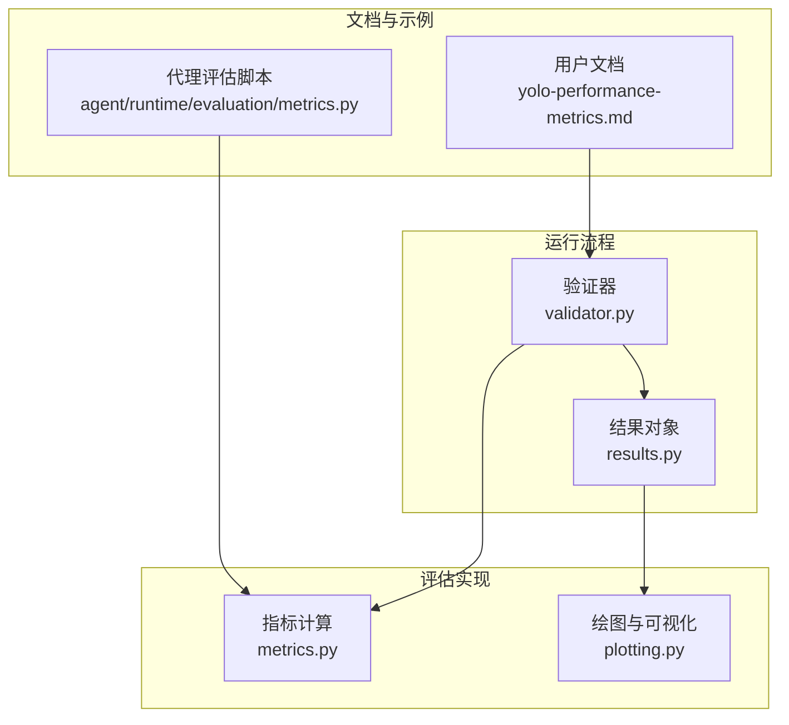
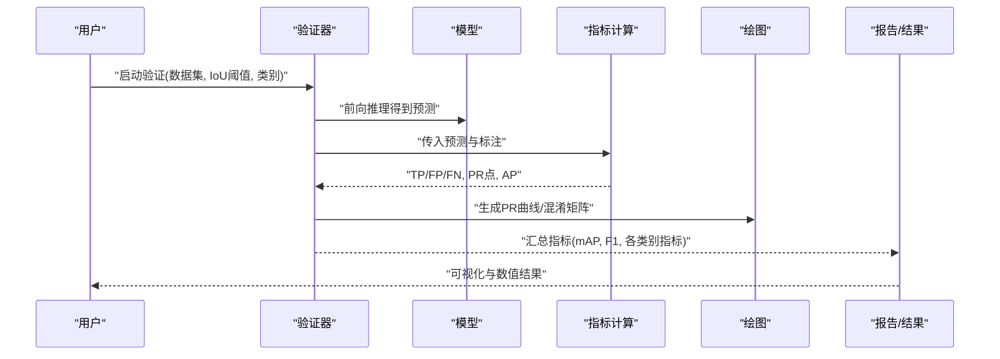
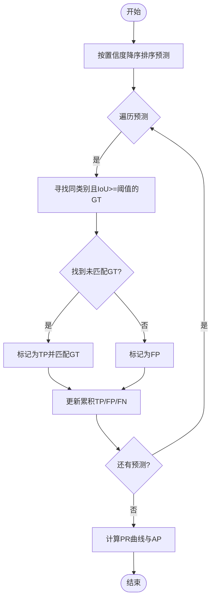
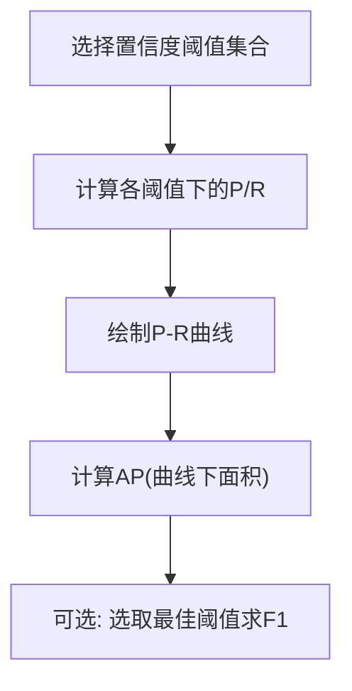
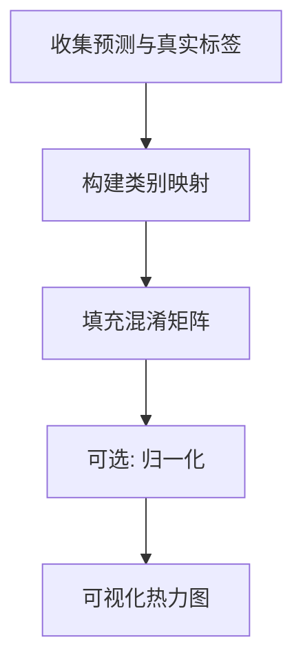
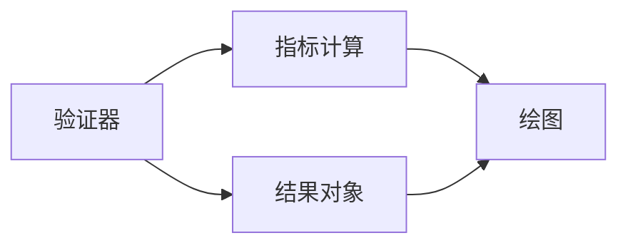

# 评估指标与性能分析

<cite>
**本文引用的文件**
- [ultralytics/utils/metrics.py](file://ultralytics/utils/metrics.py)
- [ultralytics/engine/validator.py](file://ultralytics/engine/validator.py)
- [ultralytics/engine/results.py](file://ultralytics/engine/results.py)
- [ultralytics/utils/plotting.py](file://ultralytics/utils/plotting.py)
- [docs/en/guides/yolo-performance-metrics.md](file://docs/en/guides/yolo-performance-metrics.md)
- [agent/runtime/evaluation/metrics.py](file://agent/runtime/evaluation/metrics.py)
</cite>

## 目录
1. [简介](#简介)
2. [项目结构](#项目结构)
3. [核心组件](#核心组件)
4. [架构总览](#架构总览)
5. [详细组件分析](#详细组件分析)
6. [依赖关系分析](#依赖关系分析)
7. [性能考量](#性能考量)
8. [故障排查指南](#故障排查指南)
9. [结论](#结论)
10. [附录](#附录)

## 简介
本文件面向目标检测任务，系统化讲解评估指标与性能分析方法，重点覆盖：
- mAP（mean Average Precision）计算原理、IoU阈值的影响与常见变体
- Precision-Recall曲线、F1分数、混淆矩阵的含义与分析方法
- 按类别的性能分析与错误类型识别（漏检、误检、定位不准）
- 性能基准测试方法与多模型对比技巧

## 项目结构
本项目在多个位置提供检测评估能力：
- 核心指标实现位于工具模块中，负责IoU、PR曲线、mAP等基础计算
- 验证流程在引擎层编排，串联预测、匹配、统计与汇总
- 结果对象承载单样本或批次的检测结果与可视化接口
- 文档侧提供面向用户的指标说明与使用指引
- 代理运行时提供轻量评估脚本与辅助函数

图表来源
- [ultralytics/utils/metrics.py](file://ultralytics/utils/metrics.py)
- [ultralytics/engine/validator.py](file://ultralytics/engine/validator.py)
- [ultralytics/engine/results.py](file://ultralytics/engine/results.py)
- [ultralytics/utils/plotting.py](file://ultralytics/utils/plotting.py)
- [docs/en/guides/yolo-performance-metrics.md](file://docs/en/guides/yolo-performance-metrics.md)
- [agent/runtime/evaluation/metrics.py](file://agent/runtime/evaluation/metrics.py)

章节来源
- [ultralytics/utils/metrics.py](file://ultralytics/utils/metrics.py)
- [ultralytics/engine/validator.py](file://ultralytics/engine/validator.py)
- [ultralytics/engine/results.py](file://ultralytics/engine/results.py)
- [ultralytics/utils/plotting.py](file://ultralytics/utils/plotting.py)
- [docs/en/guides/yolo-performance-metrics.md](file://docs/en/guides/yolo-performance-metrics.md)
- [agent/runtime/evaluation/metrics.py](file://agent/runtime/evaluation/metrics.py)

## 核心组件
- 指标计算模块
  - 负责IoU计算、置信度排序、TP/FP/FN判定、PR曲线构建、AP与mAP聚合
  - 支持不同IoU阈值与类别维度的统计
- 验证器
  - 组织数据加载、推理、后处理、匹配与指标统计
  - 输出每类与整体的Precision、Recall、mAP等
- 结果对象
  - 封装单图/批量检测结果，便于后续可视化与导出
- 绘图模块
  - 绘制PR曲线、混淆矩阵、各类别指标图
- 文档与脚本
  - 提供指标定义、参数说明与快速上手示例

章节来源
- [ultralytics/utils/metrics.py](file://ultralytics/utils/metrics.py)
- [ultralytics/engine/validator.py](file://ultralytics/engine/validator.py)
- [ultralytics/engine/results.py](file://ultralytics/engine/results.py)
- [ultralytics/utils/plotting.py](file://ultralytics/utils/plotting.py)
- [docs/en/guides/yolo-performance-metrics.md](file://docs/en/guides/yolo-performance-metrics.md)
- [agent/runtime/evaluation/metrics.py](file://agent/runtime/evaluation/metrics.py)

## 架构总览
下图展示从验证到指标计算的端到端流程。

图表来源
- [ultralytics/engine/validator.py](file://ultralytics/engine/validator.py)
- [ultralytics/utils/metrics.py](file://ultralytics/utils/metrics.py)
- [ultralytics/utils/plotting.py](file://ultralytics/utils/plotting.py)

## 详细组件分析

### mAP（平均精度均值）与IoU阈值
- 基本概念
  - 对每个类别，依据置信度从高到低排序预测框，逐条判定是否为真阳性（TP）、假阳性（FP），并累计假阴性（FN）
  - 在每个阈值下计算Precision与Recall，进而得到该阈值的Average Precision（AP）
  - mAP为所有类别AP的平均值；COCO常用mAP@[.5:.95]表示在多个IoU阈值上取平均
- IoU阈值的影响
  - 较低阈值（如0.5）更宽容，更容易获得较高AP
  - 较高阈值（如0.75及以上）强调定位准确性，AP通常更低但更能反映定位质量
  - 多阈值平均（如0.5至0.95步长0.05）能综合衡量分类与定位能力
- 计算要点
  - 同一图像内一个GT只能被一个预测匹配，避免重复计数
  - 类别一致性必须严格，跨类别的匹配不计入
  - 未匹配的预测均为FP，未匹配的GT均为FN

图表来源
- [ultralytics/utils/metrics.py](file://ultralytics/utils/metrics.py)

章节来源
- [ultralytics/utils/metrics.py](file://ultralytics/utils/metrics.py)

### Precision-Recall曲线与F1分数
- Precision-Recall曲线
  - 横轴为召回率（Recall），纵轴为精确率（Precision）
  - 曲线下面积即为AP；曲线越靠近右上角，性能越好
  - 低置信度阈值会提升召回率但降低精确率，需权衡
- F1分数
  - 精确率与召回率的调和平均，常用于单一阈值下的综合度量
  - 适合关注“查全”与“查准”平衡的场景，但不直接替代AP用于排序比较

图表来源
- [ultralytics/utils/metrics.py](file://ultralytics/utils/metrics.py)
- [ultralytics/utils/plotting.py](file://ultralytics/utils/plotting.py)

章节来源
- [ultralytics/utils/metrics.py](file://ultralytics/utils/metrics.py)
- [ultralytics/utils/plotting.py](file://ultralytics/utils/plotting.py)

### 混淆矩阵（Confusion Matrix）
- 含义
  - 行通常为真实标签，列通常为预测标签
  - 对角线为正确分类数量，非对角线为误分类
- 使用方法
  - 观察主要误分方向，定位易混淆类别
  - 结合类别不平衡情况解读，必要时采用归一化混淆矩阵
- 可视化
  - 热力图形式直观呈现各类别间的混淆强度

图表来源
- [ultralytics/utils/plotting.py](file://ultralytics/utils/plotting.py)

章节来源
- [ultralytics/utils/plotting.py](file://ultralytics/utils/plotting.py)

### 按类别性能分析与错误类型识别
- 类别维度分析
  - 分别查看各类别的Precision、Recall、AP与mAP
  - 针对长尾类别进行专项优化（数据增强、难例挖掘、阈值调优）
- 常见错误类型
  - 漏检（False Negative）：召回率低，可能由小目标、遮挡、阈值过高导致
  - 误检（False Positive）：精确率低，可能由背景相似、阈值过低、类别混淆导致
  - 定位不准：高IoU阈值下AP显著下降，需改进边界框回归或NMS策略
- 诊断建议
  - 通过PR曲线与混淆矩阵定位问题类别
  - 抽样可视化典型失败案例，针对性调整训练数据与超参

章节来源
- [ultralytics/utils/metrics.py](file://ultralytics/utils/metrics.py)
- [ultralytics/utils/plotting.py](file://ultralytics/utils/plotting.py)

### 性能基准测试与多模型对比
- 基准测试方法
  - 固定数据集与预处理，统一IoU阈值与类别设置
  - 记录mAP、mAP@.5、mAP@.75、各类别AP、推理时延与吞吐
- 对比技巧
  - 控制变量法：仅改变模型结构或权重，其他条件一致
  - 分层对比：整体mAP与关键类别AP并重
  - 稳定性评估：多次运行取均值与方差，排除随机性影响
- 自动化与可复现
  - 使用验证器与指标模块自动产出结果
  - 保存配置与随机种子，确保可复现实验

章节来源
- [ultralytics/engine/validator.py](file://ultralytics/engine/validator.py)
- [ultralytics/utils/metrics.py](file://ultralytics/utils/metrics.py)

## 依赖关系分析
- 验证器依赖指标计算与结果对象
- 指标计算依赖IoU与匹配逻辑
- 绘图模块依赖指标与结果对象以生成可视化
- 文档与脚本作为上层入口，调用上述组件完成评测

图表来源
- [ultralytics/engine/validator.py](file://ultralytics/engine/validator.py)
- [ultralytics/utils/metrics.py](file://ultralytics/utils/metrics.py)
- [ultralytics/engine/results.py](file://ultralytics/engine/results.py)
- [ultralytics/utils/plotting.py](file://ultralytics/utils/plotting.py)

章节来源
- [ultralytics/engine/validator.py](file://ultralytics/engine/validator.py)
- [ultralytics/utils/metrics.py](file://ultralytics/utils/metrics.py)
- [ultralytics/engine/results.py](file://ultralytics/engine/results.py)
- [ultralytics/utils/plotting.py](file://ultralytics/utils/plotting.py)

## 性能考量
- 阈值选择
  - 根据业务需求选择合适的IoU阈值与置信度阈值
  - 若重视定位精度，提高IoU阈值；若重视召回，适当降低阈值
- 类别不平衡
  - 对少数类进行加权采样或损失重标定
  - 单独监控少数类的AP与PR曲线
- 计算效率
  - 批处理与并行化减少IO与内存拷贝开销
  - 合理设置NMS与后处理参数，避免过度过滤

[本节为通用指导，不直接分析具体文件]

## 故障排查指南
- 指标异常
  - 检查类别映射是否一致，避免跨类别匹配
  - 确认GT与预测坐标格式与归一化方式一致
- 可视化缺失
  - 确认绘图模块可用，路径与权限正常
- 结果不一致
  - 固定随机种子与数据顺序，确保可复现
  - 检查NMS与阈值参数是否稳定

章节来源
- [ultralytics/utils/metrics.py](file://ultralytics/utils/metrics.py)
- [ultralytics/utils/plotting.py](file://ultralytics/utils/plotting.py)

## 结论
- mAP是衡量分类与定位能力的核心指标，IoU阈值直接影响结果
- PR曲线与F1分数提供不同视角的综合评估
- 混淆矩阵有助于识别易混淆类别与系统性误差
- 通过严格的基准测试与对比方法，可客观评估模型差异并指导优化

[本节为总结，不直接分析具体文件]

## 附录
- 参考文档
  - 用户级指标说明与使用指南
- 辅助脚本
  - 代理运行时中的轻量评估脚本，便于快速验证

章节来源
- [docs/en/guides/yolo-performance-metrics.md](file://docs/en/guides/yolo-performance-metrics.md)
- [agent/runtime/evaluation/metrics.py](file://agent/runtime/evaluation/metrics.py)