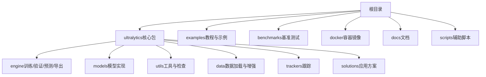
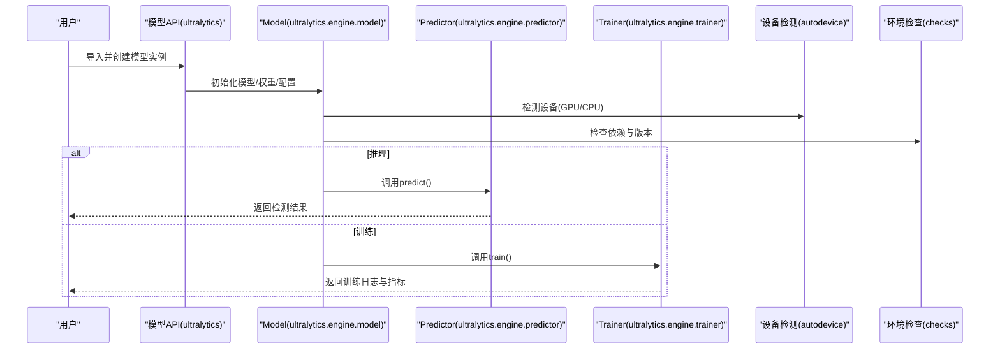
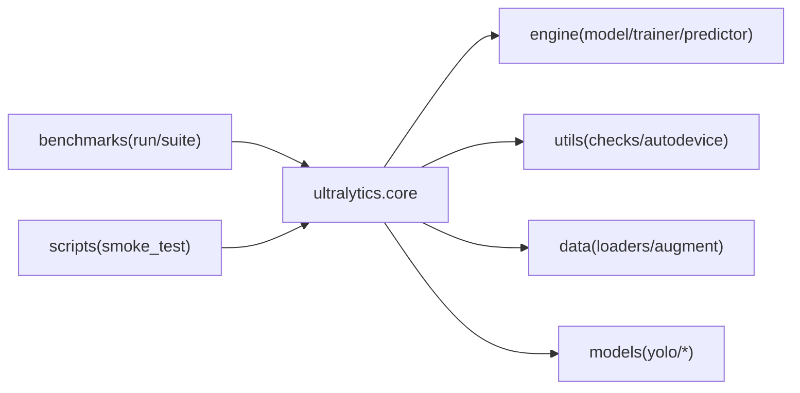

# 快速开始

<cite>
**本文引用的文件**
- [README.md](file://README.md)
- [pyproject.toml](file://pyproject.toml)
- [ultralytics/__init__.py](file://ultralytics/__init__.py)
- [ultralytics/engine/model.py](file://ultralytics/engine/model.py)
- [ultralytics/engine/predictor.py](file://ultralytics/engine/predictor.py)
- [ultralytics/engine/trainer.py](file://ultralytics/engine/trainer.py)
- [ultralytics/utils/checks.py](file://ultralytics/utils/checks.py)
- [ultralytics/utils/autodevice.py](file://ultralytics/utils/autodevice.py)
- [examples/tutorial.ipynb](file://examples/tutorial.ipynb)
- [examples/hub.ipynb](file://examples/hub.ipynb)
- [benchmarks/run.py](file://benchmarks/run.py)
- [benchmarks/suite.py](file://benchmarks/suite.py)
- [scripts/smoke_test_coco2017.py](file://scripts/smoke_test_coco2017.py)
- [docker/Dockerfile](file://docker/Dockerfile)
</cite>

## 目录
1. [简介](#简介)
2. [项目结构](#项目结构)
3. [核心组件](#核心组件)
4. [架构总览](#架构总览)
5. [详细组件分析](#详细组件分析)
6. [依赖关系分析](#依赖关系分析)
7. [性能考虑](#性能考虑)
8. [故障排查指南](#故障排查指南)
9. [结论](#结论)
10. [附录](#附录)

## 简介
本快速开始指南面向首次接触 YOLO-Master 的用户，目标是帮助你在最短时间内完成环境搭建、安装配置、运行第一个训练与推理示例，并掌握命令行接口与 Python API 的基本用法。同时提供 Jupyter Notebook 交互式开发环境搭建方法、预训练模型库访问方式、常见问题解决方案以及性能基准测试与基础调优建议。

## 项目结构
YOLO-Master 采用模块化设计，核心功能集中在 ultralytics 包中，包含模型定义、训练器、预测器、导出工具、数据集加载与评估等模块；examples 提供教程与样例脚本；benchmarks 提供基准测试套件；docker 提供容器化构建；docs 为文档资源。

[本节为概念性概述，不直接分析具体文件]

## 核心组件
- 模型入口与统一接口：通过包级初始化暴露高层 API，便于以简洁方式加载、训练、验证与推理。
- 训练器：封装训练流程、优化器、损失计算、日志记录与回调机制。
- 预测器：封装推理流程，支持自动设备选择、批处理、可视化输出与结果后处理。
- 设备与环境检查：自动检测 GPU/CPU 可用性，进行驱动与运行时兼容性校验。
- 基准测试：提供端到端基准任务与指标统计，便于横向对比不同模型或配置。

章节来源
- [ultralytics/__init__.py](file://ultralytics/__init__.py)
- [ultralytics/engine/trainer.py](file://ultralytics/engine/trainer.py)
- [ultralytics/engine/predictor.py](file://ultralytics/engine/predictor.py)
- [ultralytics/utils/checks.py](file://ultralytics/utils/checks.py)
- [ultralytics/utils/autodevice.py](file://ultralytics/utils/autodevice.py)

## 架构总览
下图展示了从用户调用到内部执行的关键路径：Python API 或 CLI 进入模型对象，随后由训练器或预测器接管，底层依赖设备检测与工具函数完成环境适配与数据处理。

图表来源
- [ultralytics/engine/model.py](file://ultralytics/engine/model.py)
- [ultralytics/engine/predictor.py](file://ultralytics/engine/predictor.py)
- [ultralytics/engine/trainer.py](file://ultralytics/engine/trainer.py)
- [ultralytics/utils/autodevice.py](file://ultralytics/utils/autodevice.py)
- [ultralytics/utils/checks.py](file://ultralytics/utils/checks.py)

## 详细组件分析

### 环境安装与配置
- Python 环境
  - 建议使用 Python 3.10+，推荐使用 conda 或 venv 管理虚拟环境。
  - 在仓库根目录使用包管理器安装依赖（参考 pyproject.toml）。
- GPU 驱动与 CUDA
  - 确保已安装与 PyTorch 匹配的 NVIDIA 驱动与 CUDA 工具链。
  - 若仅使用 CPU，可跳过 CUDA 相关步骤。
- 可选加速后端
  - 根据部署目标可选择 ONNXRuntime、TensorRT、OpenVINO 等（见 examples 与 docs 中的集成指南）。
- Docker 一键环境
  - 使用 docker/Dockerfile 构建镜像，适合隔离与复现。

章节来源
- [pyproject.toml](file://pyproject.toml)
- [docker/Dockerfile](file://docker/Dockerfile)

### 第一个模型训练演示（基于小数据集）
- 准备数据
  - 使用仓库内提供的 mini-detect 示例数据或自行准备 YOLO 格式数据集。
  - 编写或复用数据集配置文件（如 mini_detect.yaml），指定类别与路径。
- 启动训练
  - 通过 Python API 或命令行调用训练接口，指定模型名称与数据配置。
  - 训练过程将输出日志、保存权重与可视化结果。
- 查看结果
  - 训练结束后，可在 runs/train 目录下查看权重、曲线与可视化图。

章节来源
- [agent/assets/mini-detect/mini_detect.yaml](file://agent/assets/mini-detect/mini_detect.yaml)
- [ultralytics/engine/trainer.py](file://ultralytics/engine/trainer.py)

### 第一个模型推理演示（使用预训练模型）
- 加载预训练模型
  - 通过模型名称或权重路径加载官方预训练权重。
- 执行推理
  - 对单张图像或视频流进行目标检测，设置置信度阈值与 NMS 参数。
  - 支持批量推理与多设备并行。
- 结果输出
  - 返回检测结果（边界框、类别、置信度），并可保存可视化图片。

章节来源
- [ultralytics/engine/model.py](file://ultralytics/engine/model.py)
- [ultralytics/engine/predictor.py](file://ultralytics/engine/predictor.py)

### 命令行接口（CLI）基本用法
- 常用命令
  - 训练：yolo train ...
  - 验证：yolo val ...
  - 推理：yolo predict ...
  - 导出：yolo export ...
  - 基准：yolo benchmark ...
- 关键参数
  - 数据配置、模型名称、设备选择、批次大小、学习率、迭代次数等。
- 示例
  - 参考 scripts/smoke_test_coco2017.py 的调用方式，快速验证环境。

章节来源
- [scripts/smoke_test_coco2017.py](file://scripts/smoke_test_coco2017.py)

### Python API 基本用法
- 加载模型
  - 通过包级 API 创建模型实例，指定模型名或权重路径。
- 训练与验证
  - 调用 train()/val() 接口，传入数据配置与超参。
- 推理
  - 调用 predict() 接口，传入图像路径或数组，设置阈值与可视化选项。
- 结果处理
  - 获取检测结果列表，遍历每个目标的类别、置信度与坐标。

章节来源
- [ultralytics/__init__.py](file://ultralytics/__init__.py)
- [ultralytics/engine/model.py](file://ultralytics/engine/model.py)
- [ultralytics/engine/predictor.py](file://ultralytics/engine/predictor.py)

### Jupyter Notebook 交互式开发
- 安装依赖
  - 安装 notebook/jupyterlab 及可视化依赖。
- 运行教程
  - 打开 examples/tutorial.ipynb 或 examples/hub.ipynb，按步骤执行。
- 调试与可视化
  - 利用 Notebook 的分步执行与绘图能力，快速验证数据与模型效果。

章节来源
- [examples/tutorial.ipynb](file://examples/tutorial.ipynb)
- [examples/hub.ipynb](file://examples/hub.ipynb)

### 预训练模型库访问与使用
- 在线下载
  - 首次推理或训练时，可通过模型名称自动下载官方预训练权重。
- 本地缓存
  - 权重默认缓存至本地目录，后续可直接加载，避免重复下载。
- 自定义权重
  - 支持直接指定本地 .pt 权重路径进行推理或微调。

章节来源
- [ultralytics/engine/model.py](file://ultralytics/engine/model.py)

### 性能基准测试与基础调优
- 基准测试
  - 使用 benchmarks/run.py 与 benchmarks/suite.py 执行端到端基准任务，统计吞吐与延迟。
- 基础调优建议
  - 调整批次大小、输入分辨率、NMS 阈值与置信度阈值。
  - 启用混合精度与编译优化（如适用）。
  - 针对小目标增加数据增强与采样策略。
- 监控与日志
  - 关注训练曲线与验证指标，结合日志定位瓶颈。

章节来源
- [benchmarks/run.py](file://benchmarks/run.py)
- [benchmarks/suite.py](file://benchmarks/suite.py)

## 依赖关系分析
- 核心依赖
  - PyTorch、NumPy、OpenCV、Pillow、tqdm、matplotlib 等。
- 可选依赖
  - ONNXRuntime、TensorRT、OpenVINO、Gradio、Streamlit 等用于导出与部署。
- 设备与运行时
  - autodevice 负责设备选择，checks 负责环境与版本校验。

图表来源
- [ultralytics/engine/model.py](file://ultralytics/engine/model.py)
- [ultralytics/engine/trainer.py](file://ultralytics/engine/trainer.py)
- [ultralytics/engine/predictor.py](file://ultralytics/engine/predictor.py)
- [ultralytics/utils/checks.py](file://ultralytics/utils/checks.py)
- [ultralytics/utils/autodevice.py](file://ultralytics/utils/autodevice.py)
- [benchmarks/run.py](file://benchmarks/run.py)
- [benchmarks/suite.py](file://benchmarks/suite.py)
- [scripts/smoke_test_coco2017.py](file://scripts/smoke_test_coco2017.py)

章节来源
- [pyproject.toml](file://pyproject.toml)

## 性能考虑
- 硬件选择
  - 优先使用 GPU 进行训练与推理；CPU 模式适用于轻量场景。
- 内存与显存
  - 合理设置批次大小与输入分辨率，避免 OOM。
- 数据管道
  - 使用多线程与缓存提升 I/O 效率；必要时启用预取与预处理流水线。
- 导出与部署
  - 根据目标平台选择合适导出格式（ONNX/TensorRT/OpenVINO），并进行端到端延迟测试。

[本节为通用指导，不直接分析具体文件]

## 故障排查指南
- 无法检测到 GPU
  - 检查 NVIDIA 驱动与 CUDA 版本是否与 PyTorch 匹配。
  - 使用 autodevice 与 checks 进行自检，确认设备状态。
- 依赖缺失或版本冲突
  - 重新安装依赖，确保 pyproject.toml 中列出的版本兼容。
- 数据路径错误
  - 确认数据集配置文件路径正确，标签与图像一一对应。
- 推理结果异常
  - 调整置信度与 NMS 阈值；检查输入尺寸与归一化是否正确。
- 基准测试失败
  - 检查网络与缓存目录权限；确认基准任务所需数据可用。

章节来源
- [ultralytics/utils/autodevice.py](file://ultralytics/utils/autodevice.py)
- [ultralytics/utils/checks.py](file://ultralytics/utils/checks.py)
- [scripts/smoke_test_coco2017.py](file://scripts/smoke_test_coco2017.py)

## 结论
通过本指南，你已完成 YOLO-Master 的环境搭建、首个训练与推理示例、CLI 与 Python API 的基础使用，并了解了 Notebook 开发、预训练模型访问、基准测试与常见问题的处理方法。建议在实际项目中结合业务数据与部署目标，逐步引入数据增强、超参搜索与导出优化，以获得更稳定与高效的性能表现。

## 附录
- 参考文档
  - README.md 提供项目概览与使用说明。
  - docs 目录包含各任务与模式的详细文档。
- 示例与脚本
  - examples 与 scripts 提供丰富的实战案例与自动化脚本。
- 社区与支持
  - 遇到问题可参考 docs/help 与 issues 反馈渠道。

章节来源
- [README.md](file://README.md)