# 最佳实践指南

<cite>
**本文引用的文件**
- [README.md](file://README.md)
- [pyproject.toml](file://pyproject.toml)
- [docker/Dockerfile](file://docker/Dockerfile)
- [ultralytics/engine/trainer.py](file://ultralytics/engine/trainer.py)
- [ultralytics/engine/validator.py](file://ultralytics/engine/validator.py)
- [ultralytics/engine/predictor.py](file://ultralytics/engine/predictor.py)
- [ultralytics/engine/exporter.py](file://ultralytics/engine/exporter.py)
- [ultralytics/utils/dist.py](file://ultralytics/utils/dist.py)
- [ultralytics/utils/checks.py](file://ultralytics/utils/checks.py)
- [ultralytics/utils/logger.py](file://ultralytics/utils/logger.py)
- [ultralytics/utils/benchmarks.py](file://ultralytics/utils/benchmarks.py)
- [ultralytics/data/build.py](file://ultralytics/data/build.py)
- [ultralytics/data/dataset.py](file://ultralytics/data/dataset.py)
- [ultralytics/cfg/default.yaml](file://ultralytics/cfg/default.yaml)
- [tests/test_engine.py](file://tests/test_engine.py)
- [tests/test_export_roundtrip.py](file://tests/test_export_roundtrip.py)
- [tests/test_moe_ddp_fixes.py](file://tests/test_moe_ddp_fixes.py)
- [scripts/smoke_test_coco2017.py](file://scripts/smoke_test_coco2017.py)
- [benchmarks/run.py](file://benchmarks/run.py)
- [benchmarks/suite.py](file://benchmarks/suite.py)
- [examples/YOLO-Master-Cross-Platform-Edge-Deployment/TECHNICAL_REPORT.md](file://examples/YOLO-Master-Cross-Platform-Edge-Deployment/TECHNICAL_REPORT.md)
- [docs/en/guides/model-deployment-practices.md](file://docs/en/guides/model-deployment-practices.md)
- [docs/en/guides/yolo-performance-metrics.md](file://docs/en/guides/yolo-performance-metrics.md)
- [docs/en/guides/model-monitoring-and-maintenance.md](file://docs/en/guides/model-monitoring-and-maintenance.md)
- [docs/en/help/security.md](file://docs/en/help/security.md)
- [docs/en/help/privacy.md](file://docs/en/help/privacy.md)
- [model-zoo/models.json](file://model-zoo/models.json)
- [model-zoo/submission.schema.json](file://model-zoo/submission.schema.json)
- [model-zoo/submissions/example.yaml](file://model-zoo/submissions/example.yaml)
- [tools/model_zoo_automation.py](file://tools/model_zoo_automation.py)
</cite>

## 更新摘要
**变更内容**
- 新增模型动物园最佳实践章节，涵盖模型提交规范、性能基准测试标准、元数据格式要求
- 扩展模型版本管理章节，增加社区贡献一致性保障机制
- 完善持续集成与发布流水线，集成模型质量门禁和自动化验证流程

## 目录
1. [简介](#简介)
2. [项目结构](#项目结构)
3. [核心组件](#核心组件)
4. [架构总览](#架构总览)
5. [详细组件分析](#详细组件分析)
6. [依赖关系分析](#依赖关系分析)
7. [性能与内存优化](#性能与内存优化)
8. [大规模数据处理与分布式训练](#大规模数据处理与分布式训练)
9. [模型版本管理与实验追踪](#模型版本管理与实验追踪)
10. [模型动物园最佳实践](#模型动物园最佳实践)
11. [代码质量保障与测试策略](#代码质量保障与测试策略)
12. [持续集成与发布流水线](#持续集成与发布流水线)
13. [安全、隐私与合规](#安全隐私与合规)
14. [监控告警与日志管理](#监控告警与日志管理)
15. [故障诊断与排错](#故障诊断与排错)
16. [团队协作与知识传承](#团队协作与知识传承)
17. [结论](#结论)

## 简介
本指南面向生产环境部署与工程化落地，围绕YOLO-Master在推理、训练、导出、评测、监控、安全与协作等全链路环节提供系统化最佳实践。内容涵盖：
- 生产部署流程与注意事项（容器化、资源配额、灰度发布）
- 性能调优与内存优化（批大小、精度、I/O、缓存）
- 错误处理与可观测性（结构化日志、指标、告警）
- 模型版本管理、实验追踪与结果复现（配置即代码、数据与权重溯源）
- **模型动物园管理与社区贡献规范**（新增）
- 大规模数据处理与分布式训练（DDP、数据并行、多进程）
- 代码质量保障与测试策略（单元、回归、端到端、基准）
- 安全、隐私与合规（密钥管理、数据脱敏、审计）
- 监控告警与日志管理（Prometheus/Grafana、集中式日志）
- 团队协作与文档维护（规范、模板、知识库）

## 项目结构
仓库采用分层模块化组织：
- ultralytics：核心框架（引擎、模型、数据、工具、导出、跟踪、解决方案）
- tests：单元测试、集成测试、回归与基准
- scripts：脚本化任务（复现实验、评估、基准、迁移）
- benchmarks：基准套件与运行器
- examples：示例与跨平台部署参考
- docs：用户文档与帮助
- docker：容器镜像构建
- model-zoo：模型仓库与管理工具（新增）
- tools：自动化工具与辅助脚本
- pyproject.toml：依赖与元信息

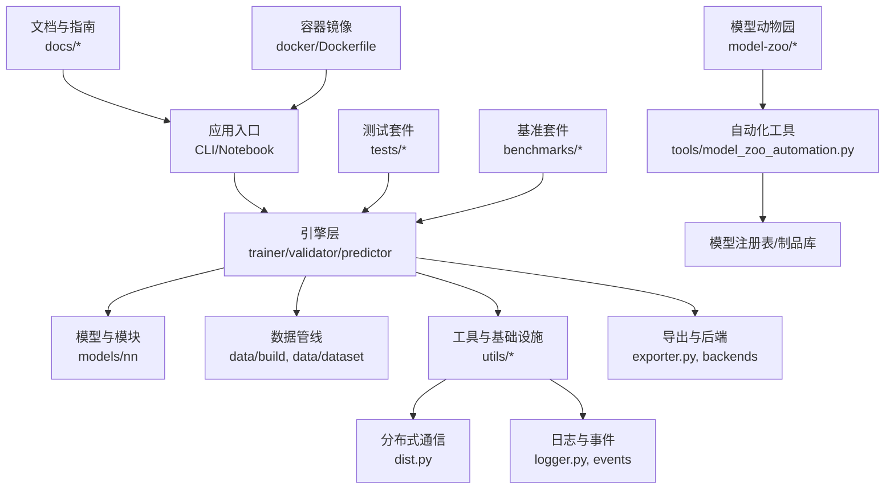

图表来源
- [ultralytics/engine/trainer.py](file://ultralytics/engine/trainer.py)
- [ultralytics/engine/validator.py](file://ultralytics/engine/validator.py)
- [ultralytics/engine/predictor.py](file://ultralytics/engine/predictor.py)
- [ultralytics/engine/exporter.py](file://ultralytics/engine/exporter.py)
- [ultralytics/utils/dist.py](file://ultralytics/utils/dist.py)
- [ultralytics/utils/logger.py](file://ultralytics/utils/logger.py)
- [ultralytics/data/build.py](file://ultralytics/data/build.py)
- [ultralytics/data/dataset.py](file://ultralytics/data/dataset.py)
- [docker/Dockerfile](file://docker/Dockerfile)
- [model-zoo/models.json](file://model-zoo/models.json)
- [tools/model_zoo_automation.py](file://tools/model_zoo_automation.py)

章节来源
- [README.md](file://README.md)
- [pyproject.toml](file://pyproject.toml)

## 核心组件
- 训练器（Trainer）：负责训练循环、优化器调度、EMA、检查点保存、回调与日志记录。
- 验证器（Validator）：负责验证集评估、指标计算、可视化与报告生成。
- 预测器（Predictor）：负责推理加载、预处理、后处理、结果序列化与流式推理。
- 导出器（Exporter）：负责将PyTorch模型导出为ONNX/TensorRT/OpenVINO/TFLite等格式，并进行预检与校验。
- 分布式工具（dist）：封装DDP初始化、设备发现、进程间通信与错误传播。
- 数据构建（data/build, dataset）：数据集构建、增强、分片、缓存与多进程加载。
- 工具与基础设施（utils）：日志、事件、基准、导出能力矩阵、预检、错误体系等。
- **模型动物园管理（新增）**：提供模型提交、验证、注册与自动化工作流。

章节来源
- [ultralytics/engine/trainer.py](file://ultralytics/engine/trainer.py)
- [ultralytics/engine/validator.py](file://ultralytics/engine/validator.py)
- [ultralytics/engine/predictor.py](file://ultralytics/engine/predictor.py)
- [ultralytics/engine/exporter.py](file://ultralytics/engine/exporter.py)
- [ultralytics/utils/dist.py](file://ultralytics/utils/dist.py)
- [ultralytics/data/build.py](file://ultralytics/data/build.py)
- [ultralytics/data/dataset.py](file://ultralytics/data/dataset.py)

## 架构总览
下图展示从入口到核心引擎、数据与导出、以及外部系统的交互关系。

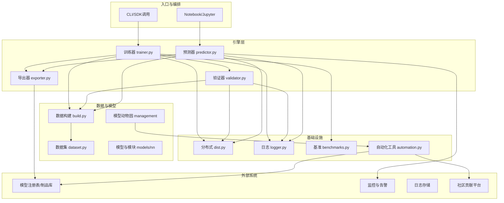

图表来源
- [ultralytics/engine/trainer.py](file://ultralytics/engine/trainer.py)
- [ultralytics/engine/validator.py](file://ultralytics/engine/validator.py)
- [ultralytics/engine/predictor.py](file://ultralytics/engine/predictor.py)
- [ultralytics/engine/exporter.py](file://ultralytics/engine/exporter.py)
- [ultralytics/utils/dist.py](file://ultralytics/utils/dist.py)
- [ultralytics/utils/logger.py](file://ultralytics/utils/logger.py)
- [ultralytics/utils/benchmarks.py](file://ultralytics/utils/benchmarks.py)
- [ultralytics/data/build.py](file://ultralytics/data/build.py)
- [ultralytics/data/dataset.py](file://ultralytics/data/dataset.py)
- [model-zoo/models.json](file://model-zoo/models.json)
- [tools/model_zoo_automation.py](file://tools/model_zoo_automation.py)

## 详细组件分析

### 训练器（Trainer）
- 职责：训练循环、损失组合、优化器与学习率调度、EMA、检查点、回调、日志与指标上报。
- 关键要点：
  - 使用统一配置驱动（default.yaml），确保可复现实验。
  - 结合分布式工具进行多卡训练，注意梯度同步与归一化一致性。
  - 通过回调机制接入实验追踪与监控。
  - 异常路径需记录上下文并向上抛出，便于根因定位。

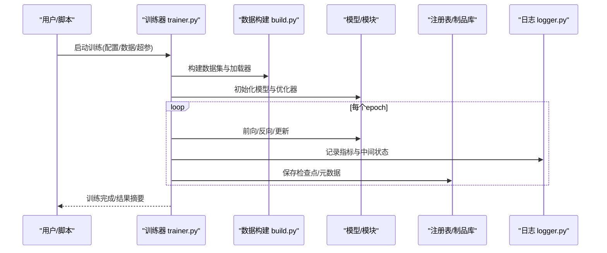

图表来源
- [ultralytics/engine/trainer.py](file://ultralytics/engine/trainer.py)
- [ultralytics/data/build.py](file://ultralytics/data/build.py)
- [ultralytics/utils/logger.py](file://ultralytics/utils/logger.py)

章节来源
- [ultralytics/engine/trainer.py](file://ultralytics/engine/trainer.py)
- [ultralytics/cfg/default.yaml](file://ultralytics/cfg/default.yaml)

### 验证器（Validator）
- 职责：验证集评估、指标计算、可视化输出、报告生成。
- 关键要点：
  - 固定随机种子与确定性设置，保证评估可复现。
  - 支持多种任务与度量，统一接口便于扩展。
  - 与导出器联动，对导出模型进行一致性校验。

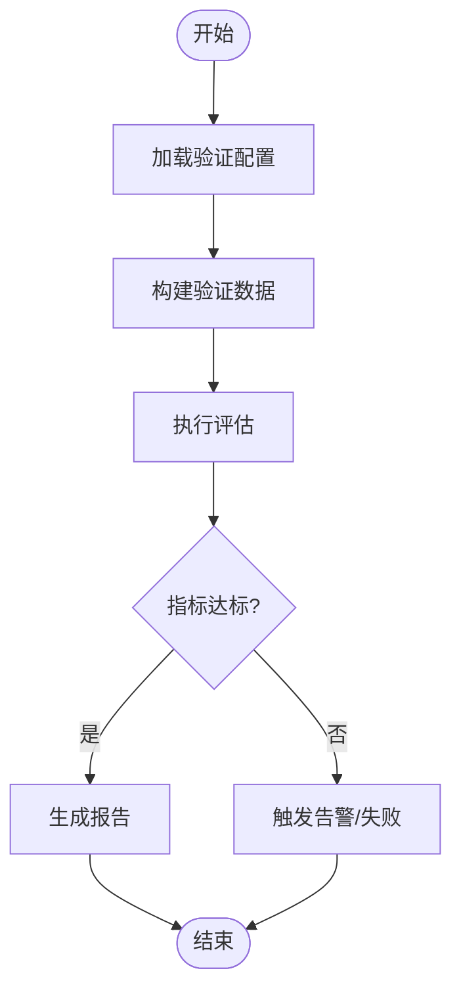

图表来源
- [ultralytics/engine/validator.py](file://ultralytics/engine/validator.py)

章节来源
- [ultralytics/engine/validator.py](file://ultralytics/engine/validator.py)

### 预测器（Predictor）
- 职责：推理加载、预处理、后处理、批量与流式推理、结果序列化。
- 关键要点：
  - 预热与缓存策略降低首帧延迟。
  - 动态批大小与精度选择平衡吞吐与延迟。
  - 与导出器配合，优先使用目标后端优化模型。

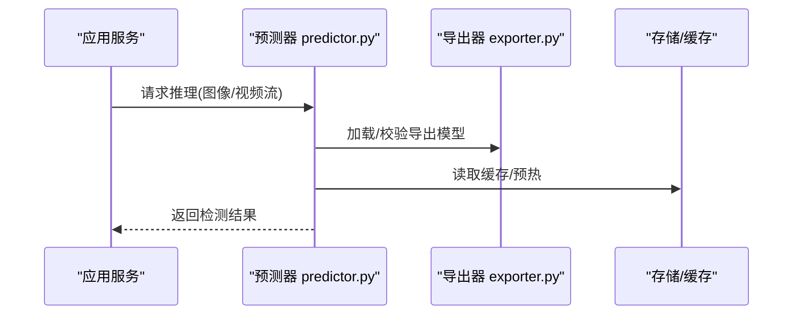

图表来源
- [ultralytics/engine/predictor.py](file://ultralytics/engine/predictor.py)
- [ultralytics/engine/exporter.py](file://ultralytics/engine/exporter.py)

章节来源
- [ultralytics/engine/predictor.py](file://ultralytics/engine/predictor.py)
- [ultralytics/engine/exporter.py](file://ultralytics/engine/exporter.py)

### 导出器（Exporter）
- 职责：模型导出、预检、能力矩阵匹配、导出后校验。
- 关键要点：
  - 导出前进行输入形状、算子支持与精度兼容性检查。
  - 导出后执行round-trip一致性测试，确保数值稳定。
  - 与基准套件联动，对比不同后端性能。

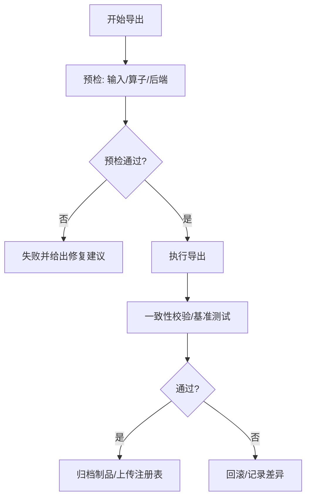

图表来源
- [ultralytics/engine/exporter.py](file://ultralytics/engine/exporter.py)
- [tests/test_export_roundtrip.py](file://tests/test_export_roundtrip.py)

章节来源
- [ultralytics/engine/exporter.py](file://ultralytics/engine/exporter.py)
- [tests/test_export_roundtrip.py](file://tests/test_export_roundtrip.py)

### 分布式工具（dist）
- 职责：DDP初始化、设备发现、进程通信、错误传播与恢复。
- 关键要点：
  - 统一环境变量与端口分配，避免冲突。
  - 捕获并聚合各进程异常，提升可观测性。
  - 与训练器/验证器深度集成，屏蔽底层细节。

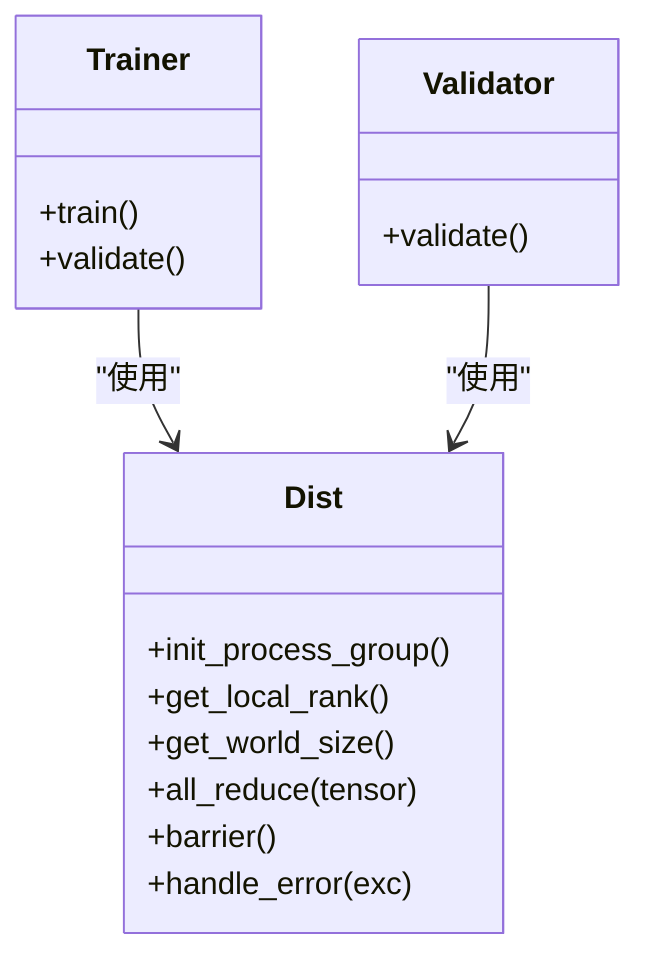

图表来源
- [ultralytics/utils/dist.py](file://ultralytics/utils/dist.py)
- [ultralytics/engine/trainer.py](file://ultralytics/engine/trainer.py)
- [ultralytics/engine/validator.py](file://ultralytics/engine/validator.py)

章节来源
- [ultralytics/utils/dist.py](file://ultralytics/utils/dist.py)
- [tests/test_moe_ddp_fixes.py](file://tests/test_moe_ddp_fixes.py)

### 数据构建与数据集（data/build, dataset）
- 职责：数据集解析、增强、分片、缓存、多进程加载。
- 关键要点：
  - 合理设置workers与batch size，避免I/O瓶颈。
  - 启用缓存与持久化，加速重复训练与评估。
  - 数据校验与异常样本隔离，提高鲁棒性。

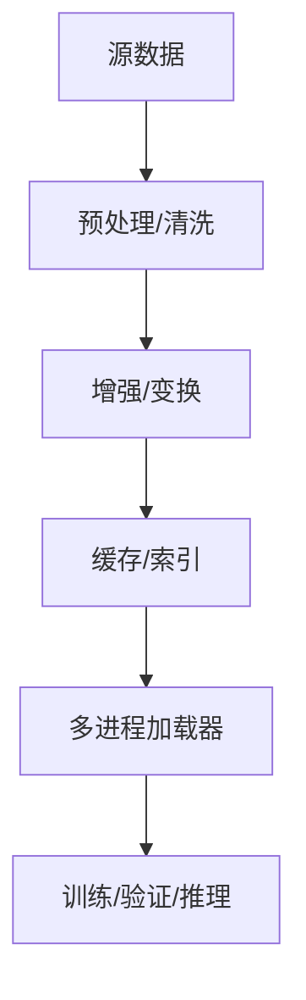

图表来源
- [ultralytics/data/build.py](file://ultralytics/data/build.py)
- [ultralytics/data/dataset.py](file://ultralytics/data/dataset.py)

章节来源
- [ultralytics/data/build.py](file://ultralytics/data/build.py)
- [ultralytics/data/dataset.py](file://ultralytics/data/dataset.py)

## 依赖关系分析
- 内部依赖：
  - 引擎层依赖数据构建与工具模块；导出器依赖后端能力矩阵与校验工具。
  - 分布式工具被训练器与验证器共同使用，形成横向支撑。
  - **模型动物园管理依赖自动化工具进行验证与注册**。
- 外部依赖：
  - 容器镜像定义运行时环境与依赖版本，确保一致性与可移植性。
  - 基准套件用于回归与性能门禁。

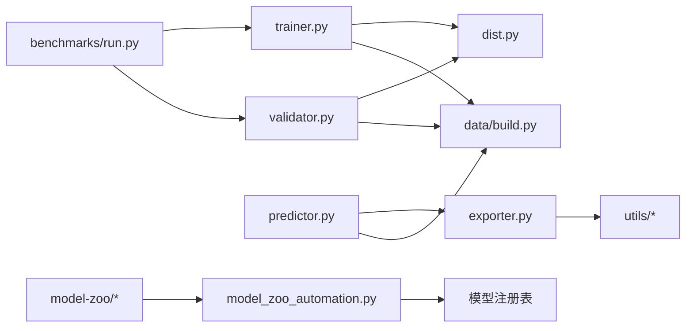

图表来源
- [ultralytics/engine/trainer.py](file://ultralytics/engine/trainer.py)
- [ultralytics/engine/validator.py](file://ultralytics/engine/validator.py)
- [ultralytics/engine/predictor.py](file://ultralytics/engine/predictor.py)
- [ultralytics/engine/exporter.py](file://ultralytics/engine/exporter.py)
- [ultralytics/utils/dist.py](file://ultralytics/utils/dist.py)
- [ultralytics/data/build.py](file://ultralytics/data/build.py)
- [benchmarks/run.py](file://benchmarks/run.py)
- [model-zoo/models.json](file://model-zoo/models.json)
- [tools/model_zoo_automation.py](file://tools/model_zoo_automation.py)

章节来源
- [pyproject.toml](file://pyproject.toml)
- [docker/Dockerfile](file://docker/Dockerfile)

## 性能与内存优化
- 推理侧
  - 使用导出器生成目标后端优化模型（如TensorRT/OpenVINO），减少Python开销。
  - 预热模型与缓存常用输入，降低首帧延迟。
  - 动态批大小与半精度推理，权衡吞吐与延迟。
- 训练侧
  - 调整workers与pin_memory，缓解I/O瓶颈。
  - 使用混合精度与梯度累积，提升显存利用率。
  - 合理设置EMA与检查点频率，平衡稳定性与IO。
- 基准与回归
  - 使用基准套件进行前后版本对比，建立性能门禁。

章节来源
- [ultralytics/engine/exporter.py](file://ultralytics/engine/exporter.py)
- [ultralytics/utils/benchmarks.py](file://ultralytics/utils/benchmarks.py)
- [docs/en/guides/yolo-performance-metrics.md](file://docs/en/guides/yolo-performance-metrics.md)

## 大规模数据处理与分布式训练
- 数据规模
  - 分片与增量加载，避免一次性载入全部数据。
  - 持久化缓存与索引，加速多次迭代。
- 分布式训练
  - 使用DDP进行多卡并行，确保全局归一化与梯度同步正确。
  - 进程错误聚合与根因上报，缩短排障时间。
- 资源管理
  - 容器化部署，明确CPU/GPU/内存配额与限制。
  - 队列与限流，保护下游服务与存储。

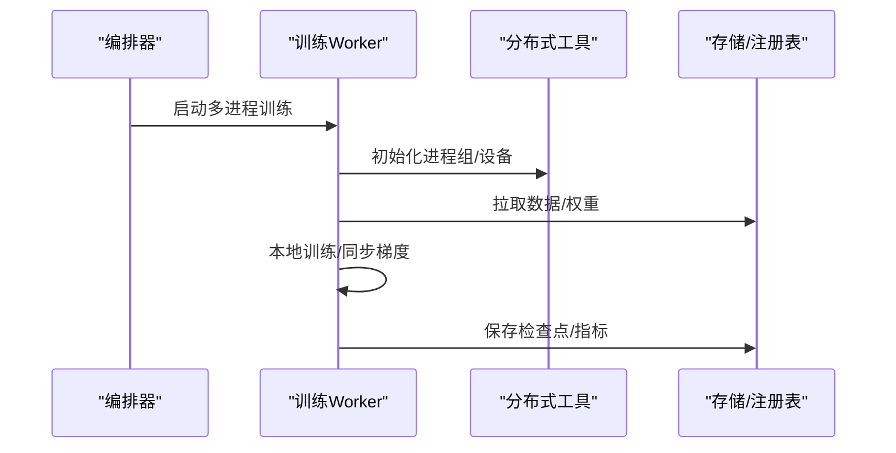

图表来源
- [ultralytics/utils/dist.py](file://ultralytics/utils/dist.py)
- [ultralytics/engine/trainer.py](file://ultralytics/engine/trainer.py)

章节来源
- [ultralytics/utils/dist.py](file://ultralytics/utils/dist.py)
- [tests/test_moe_ddp_fixes.py](file://tests/test_moe_ddp_fixes.py)

## 模型版本管理与实验追踪
- 配置即代码
  - 所有超参与数据路径以YAML/JSON形式固化，纳入版本控制。
- 制品与注册表
  - 导出模型与检查点按语义化版本归档，附带元数据与哈希指纹。
- 实验追踪
  - 训练与验证指标、日志与可视化统一上报，支持回溯与对比。
- 结果复现
  - 固定随机种子、确定性与后端版本，确保可复现。

章节来源
- [ultralytics/cfg/default.yaml](file://ultralytics/cfg/default.yaml)
- [ultralytics/engine/trainer.py](file://ultralytics/engine/trainer.py)
- [ultralytics/engine/validator.py](file://ultralytics/engine/validator.py)

## 模型动物园最佳实践

### 模型提交规范
为确保模型质量和社区贡献的一致性，所有模型提交必须遵循以下规范：

- **元数据格式要求**
  - 使用标准化的JSON Schema验证模型元数据
  - 包含完整的模型描述、作者信息、许可证声明
  - 提供详细的性能基准测试结果和适用场景说明
  - 标注支持的导出格式和硬件平台兼容性

- **模型文件结构**
  - 统一的目录组织和命名约定
  - 包含配置文件、权重文件、验证脚本
  - 提供最小可复现的示例代码和数据集引用

- **质量门禁标准**
  - 必须通过自动化测试套件验证
  - 性能指标达到基准阈值要求
  - 导出兼容性验证通过
  - 安全检查扫描无漏洞

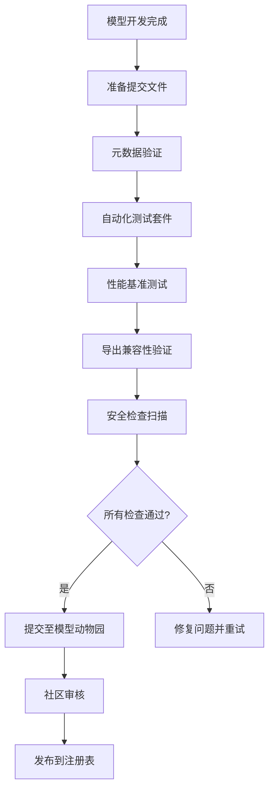

图表来源
- [model-zoo/submission.schema.json](file://model-zoo/submission.schema.json)
- [model-zoo/submissions/example.yaml](file://model-zoo/submissions/example.yaml)
- [tools/model_zoo_automation.py](file://tools/model_zoo_automation.py)

### 性能基准测试标准
- **基准测试套件**
  - 标准化测试数据集和评估指标
  - 多硬件平台性能对比测试
  - 不同导出格式的精度和速度对比
  - 回归测试防止性能退化

- **性能指标要求**
  - mAP、mAR等检测精度指标
  - 推理延迟和吞吐量指标
  - 内存占用和GPU利用率
  - 模型文件大小和压缩比

- **基准测试流程**
  - 自动化执行基准测试套件
  - 生成详细的性能报告
  - 与历史版本进行对比分析
  - 设置性能门禁阈值

### 自动化验证工作流
- **验证管道设计**
  - 基于GitHub Actions的CI/CD流水线
  - 并行执行多项验证任务
  - 自动生成验证报告和文档
  - 失败时提供详细的错误诊断信息

- **质量保证措施**
  - 代码静态分析和风格检查
  - 单元测试覆盖率要求
  - 集成测试和端到端测试
  - 安全漏洞扫描和依赖审查

**章节来源**
- [model-zoo/models.json](file://model-zoo/models.json)
- [model-zoo/submission.schema.json](file://model-zoo/submission.schema.json)
- [model-zoo/submissions/example.yaml](file://model-zoo/submissions/example.yaml)
- [tools/model_zoo_automation.py](file://tools/model_zoo_automation.py)

## 代码质量保障与测试策略
- 测试分层
  - 单元测试：覆盖核心函数与工具。
  - 集成测试：训练/验证/导出链路闭环。
  - 端到端测试：模拟真实场景与边界条件。
  - 基准测试：性能回归门禁。
- 关键用例
  - 引擎行为与错误传播。
  - 导出round-trip一致性。
  - MoE/DDP修复路径验证。
- 自动化
  - 提交前静态检查与测试套件执行。
  - 覆盖率阈值与质量门禁。

章节来源
- [tests/test_engine.py](file://tests/test_engine.py)
- [tests/test_export_roundtrip.py](file://tests/test_export_roundtrip.py)
- [tests/test_moe_ddp_fixes.py](file://tests/test_moe_ddp_fixes.py)

## 持续集成与发布流水线
- CI阶段
  - 依赖安装与环境准备（容器镜像）。
  - 静态检查、单元测试、集成测试与基准回归。
  - **模型动物园提交验证和质量门禁**。
- CD阶段
  - 构建与签名制品，上传至注册表。
  - 灰度发布与回滚策略，健康检查与自动回退。
  - **模型发布前的自动化验证和社区审核**。
- 文档与变更
  - 自动生成API与变更日志，保持文档与代码同步。
  - **模型动物园文档和示例的自动生成与维护**。

章节来源
- [docker/Dockerfile](file://docker/Dockerfile)
- [scripts/smoke_test_coco2017.py](file://scripts/smoke_test_coco2017.py)
- [benchmarks/run.py](file://benchmarks/run.py)
- [benchmarks/suite.py](file://benchmarks/suite.py)
- [tools/model_zoo_automation.py](file://tools/model_zoo_automation.py)

## 安全、隐私与合规
- 安全
  - 最小权限原则与密钥管理，避免硬编码敏感信息。
  - 输入校验与白名单，防止恶意载荷。
  - 导出模型完整性校验与签名。
  - **模型动物园的安全扫描和依赖审查**。
- 隐私
  - 数据脱敏与匿名化，遵循最小必要原则。
  - 访问控制与审计日志，满足合规要求。
- 合规
  - 第三方依赖许可证审查与安全漏洞扫描。
  - 数据跨境与留存策略符合法规。
  - **模型许可证和知识产权合规检查**。

章节来源
- [docs/en/help/security.md](file://docs/en/help/security.md)
- [docs/en/help/privacy.md](file://docs/en/help/privacy.md)

## 监控告警与日志管理
- 日志
  - 结构化日志与分级输出，包含上下文与TraceID。
  - 集中式日志采集与检索，支持快速定位问题。
- 指标与告警
  - 收集延迟、吞吐、错误率、资源使用等关键指标。
  - 基于阈值的告警与自愈策略。
- 可观测性
  - 链路追踪与采样，识别热点与瓶颈。
  - 仪表盘与报表，辅助决策与复盘。

章节来源
- [ultralytics/utils/logger.py](file://ultralytics/utils/logger.py)
- [docs/en/guides/model-monitoring-and-maintenance.md](file://docs/en/guides/model-monitoring-and-maintenance.md)

## 故障诊断与排错
- 常见问题
  - 分布式通信失败：检查网络、端口与防火墙。
  - 导出不一致：核对输入形状、算子支持与精度。
  - 数据加载慢：调整workers、缓存与磁盘I/O。
  - **模型提交失败：检查元数据格式和验证规则**。
- 诊断工具
  - 使用基准套件与日志定位性能瓶颈。
  - 利用错误层次与根因上报，快速收敛问题。
  - **模型动物园自动化工具的诊断报告**。
- 恢复策略
  - 检查点回滚与灰度切换，降低影响面。
  - 降级模式与熔断保护，保障可用性。

章节来源
- [ultralytics/utils/checks.py](file://ultralytics/utils/checks.py)
- [ultralytics/utils/benchmarks.py](file://ultralytics/utils/benchmarks.py)
- [tests/test_engine.py](file://tests/test_engine.py)

## 团队协作与知识传承
- 规范与模板
  - 统一的配置模板、提交信息与变更说明。
  - 文档模板与案例库，降低上手成本。
  - **模型提交模板和最佳实践指南**。
- 评审与分享
  - 代码评审清单与最佳实践分享会。
  - 故障复盘与经验沉淀，形成知识库。
  - **模型评审流程和社区贡献指南**。
- 知识管理
  - 版本化文档与变更记录，确保可追溯。
  - 新人引导与导师制度，加速成长。
  - **模型动物园的使用教程和案例分享**。

章节来源
- [examples/YOLO-Master-Cross-Platform-Edge-Deployment/TECHNICAL_REPORT.md](file://examples/YOLO-Master-Cross-Platform-Edge-Deployment/TECHNICAL_REPORT.md)
- [docs/en/guides/model-deployment-practices.md](file://docs/en/guides/model-deployment-practices.md)

## 结论
通过容器化与标准化流水线、严格的测试与基准门禁、完善的监控与日志体系、以及规范的版本与实验管理，YOLO-Master可在生产环境中实现高可用、高性能与高可维护的交付。**新增的模型动物园最佳实践进一步确保了模型质量和社区贡献的一致性**。建议在团队内推广本指南的最佳实践，并结合业务特性持续优化与演进。