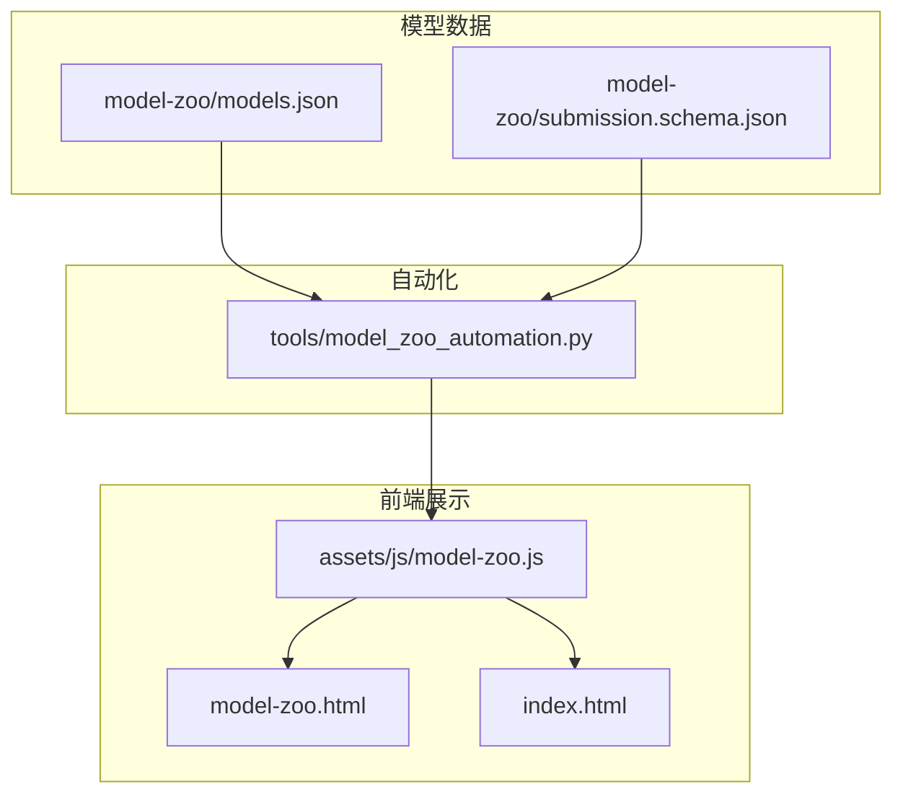
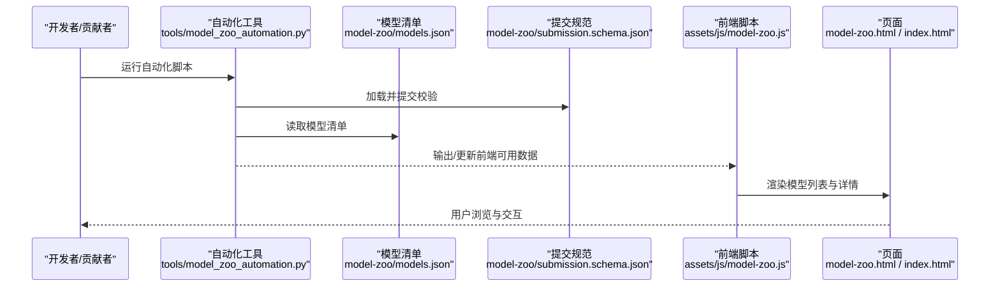
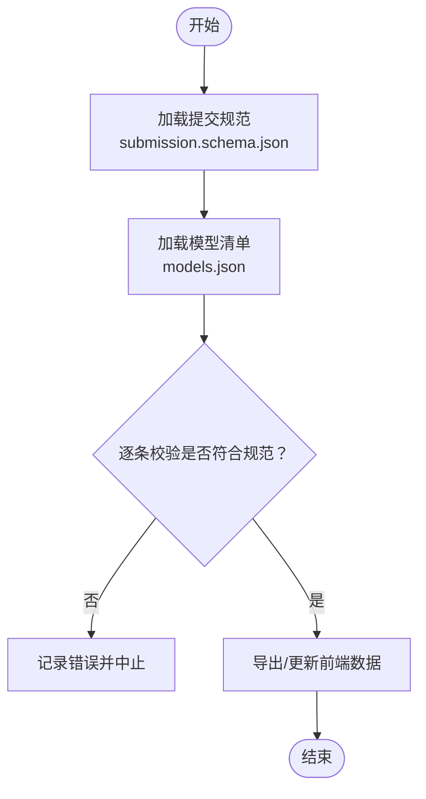
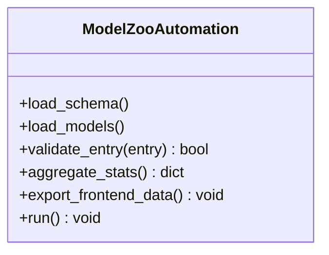
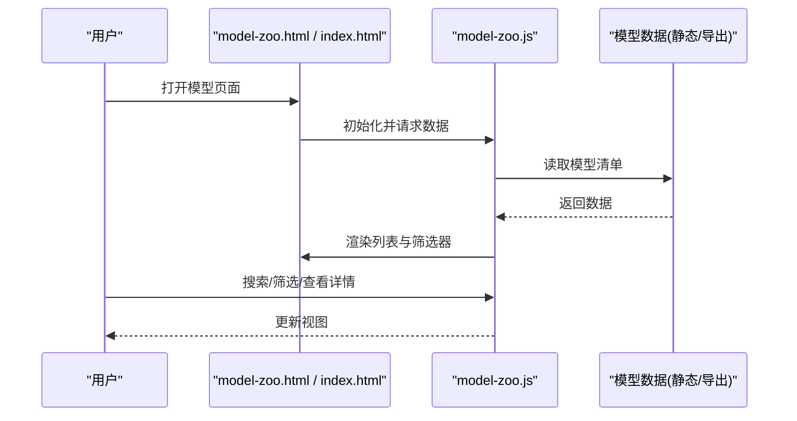
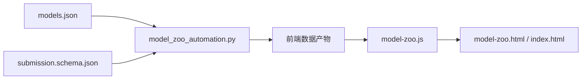

# 模型动物园系统

<cite>
**本文引用的文件**
- [model-zoo/models.json](file://model-zoo/models.json)
- [model-zoo/submission.schema.json](file://model-zoo/submission.schema.json)
- [tools/model_zoo_automation.py](file://tools/model_zoo_automation.py)
- [assets/js/model-zoo.js](file://assets/js/model-zoo.js)
- [index.html](file://index.html)
- [model-zoo.html](file://model-zoo.html)
- [app.py](file://app.py)
</cite>

## 目录
1. [简介](#简介)
2. [项目结构](#项目结构)
3. [核心组件](#核心组件)
4. [架构总览](#架构总览)
5. [详细组件分析](#详细组件分析)
6. [依赖关系分析](#依赖关系分析)
7. [性能与扩展性](#性能与扩展性)
8. [故障排查指南](#故障排查指南)
9. [结论](#结论)
10. [附录](#附录)

## 简介
本文件面向“模型动物园系统”的实现与使用，聚焦于仓库中用于发布、注册、校验与展示预训练/微调模型的子体系。该系统围绕以下目标展开：
- 提供统一的模型清单与元数据规范（JSON Schema）
- 自动化生成与更新模型页面与索引
- 为前端展示层提供结构化数据源
- 支持社区提交与审核流程的约束校验

该子系统由数据定义（models.json）、提交规范（submission.schema.json）、自动化脚本（tools/model_zoo_automation.py）以及前端展示（assets/js/model-zoo.js、HTML 页面）组成，形成从“数据—工具—展示”的闭环。

## 项目结构
模型动物园相关代码与资源主要分布在如下位置：
- model-zoo：模型清单与提交规范
- tools：自动化构建与校验脚本
- assets/js：前端交互逻辑
- HTML 入口：模型页面与主页集成

图表来源
- [model-zoo/models.json](file://model-zoo/models.json)
- [model-zoo/submission.schema.json](file://model-zoo/submission.schema.json)
- [tools/model_zoo_automation.py](file://tools/model_zoo_automation.py)
- [assets/js/model-zoo.js](file://assets/js/model-zoo.js)
- [model-zoo.html](file://model-zoo.html)
- [index.html](file://index.html)

章节来源
- [model-zoo/models.json](file://model-zoo/models.json)
- [model-zoo/submission.schema.json](file://model-zoo/submission.schema.json)
- [tools/model_zoo_automation.py](file://tools/model_zoo_automation.py)
- [assets/js/model-zoo.js](file://assets/js/model-zoo.js)
- [model-zoo.html](file://model-zoo.html)
- [index.html](file://index.html)

## 核心组件
- 模型清单 models.json
  - 作用：集中维护所有可发布的模型条目，包含名称、任务类型、权重路径、指标、许可证等元信息。
  - 特点：作为单一事实来源（SSOT），被自动化工具与前端共同消费。
- 提交规范 submission.schema.json
  - 作用：定义新增或更新模型条目的 JSON Schema，确保字段完整性与取值范围。
  - 特点：在提交阶段进行强校验，避免脏数据进入清单。
- 自动化脚本 model_zoo_automation.py
  - 作用：读取清单与规范，执行校验、聚合、导出等操作；必要时生成供前端消费的中间产物。
  - 特点：将“数据—规则—产物”串联，减少人工维护成本。
- 前端脚本 model-zoo.js
  - 作用：加载模型数据并渲染列表、筛选、搜索、详情展示等交互。
  - 特点：与后端/静态数据解耦，通过统一接口或静态文件获取数据。
- HTML 页面 model-zoo.html 与 index.html
  - 作用：承载模型动物园页面的结构与布局，集成前端脚本。
  - 特点：轻量视图层，侧重展示与交互编排。

章节来源
- [model-zoo/models.json](file://model-zoo/models.json)
- [model-zoo/submission.schema.json](file://model-zoo/submission.schema.json)
- [tools/model_zoo_automation.py](file://tools/model_zoo_automation.py)
- [assets/js/model-zoo.js](file://assets/js/model-zoo.js)
- [model-zoo.html](file://model-zoo.html)
- [index.html](file://index.html)

## 架构总览
下图展示了模型动物园的数据流与职责边界：数据层提供权威清单与规范，自动化层负责校验与产物生成，前端层负责呈现与交互。

图表来源
- [tools/model_zoo_automation.py](file://tools/model_zoo_automation.py)
- [model-zoo/models.json](file://model-zoo/models.json)
- [model-zoo/submission.schema.json](file://model-zoo/submission.schema.json)
- [assets/js/model-zoo.js](file://assets/js/model-zoo.js)
- [model-zoo.html](file://model-zoo.html)
- [index.html](file://index.html)

## 详细组件分析

### 数据层：模型清单与提交规范
- models.json
  - 内容：模型条目数组，每个条目包含唯一标识、任务类型、权重路径、评估指标、许可证、作者等信息。
  - 用途：作为自动化脚本与前端的数据源。
- submission.schema.json
  - 内容：对模型条目的字段类型、必填项、枚举值等进行约束。
  - 用途：在提交时进行强校验，保证数据质量。

图表来源
- [model-zoo/submission.schema.json](file://model-zoo/submission.schema.json)
- [model-zoo/models.json](file://model-zoo/models.json)

章节来源
- [model-zoo/models.json](file://model-zoo/models.json)
- [model-zoo/submission.schema.json](file://model-zoo/submission.schema.json)

### 自动化层：模型清单自动化处理
- 功能要点
  - 读取 models.json 与 submission.schema.json
  - 执行字段校验、去重、排序、过滤等
  - 生成供前端使用的数据文件或缓存
  - 可选：生成统计摘要、变更日志
- 设计原则
  - 幂等：多次运行结果一致
  - 可观测：输出清晰的日志与错误定位
  - 可扩展：新增字段或规则无需改动前端

图表来源
- [tools/model_zoo_automation.py](file://tools/model_zoo_automation.py)

章节来源
- [tools/model_zoo_automation.py](file://tools/model_zoo_automation.py)

### 前端层：模型展示与交互
- 数据加载
  - 从静态数据或自动化工具产出的文件中读取模型清单
- 渲染与交互
  - 列表渲染、分页、搜索、筛选（按任务、大小、精度等）
  - 详情弹窗或跳转至权重下载页
- 错误处理
  - 网络/数据异常提示
  - 空状态与降级展示

图表来源
- [assets/js/model-zoo.js](file://assets/js/model-zoo.js)
- [model-zoo.html](file://model-zoo.html)
- [index.html](file://index.html)

章节来源
- [assets/js/model-zoo.js](file://assets/js/model-zoo.js)
- [model-zoo.html](file://model-zoo.html)
- [index.html](file://index.html)

### 应用入口与集成点
- app.py
  - 可能承担本地服务启动、路由分发或与其他模块集成的职责
  - 若存在，可作为模型动物园页面的托管入口或 API 网关

章节来源
- [app.py](file://app.py)

## 依赖关系分析
- 内部依赖
  - 自动化脚本依赖数据定义（models.json、submission.schema.json）
  - 前端脚本依赖自动化产出的数据或静态清单
- 外部依赖
  - 前端通常依赖浏览器环境
  - 自动化脚本依赖 Python 标准库或第三方 JSON/校验库（具体以实现为准）

图表来源
- [model-zoo/models.json](file://model-zoo/models.json)
- [model-zoo/submission.schema.json](file://model-zoo/submission.schema.json)
- [tools/model_zoo_automation.py](file://tools/model_zoo_automation.py)
- [assets/js/model-zoo.js](file://assets/js/model-zoo.js)
- [model-zoo.html](file://model-zoo.html)
- [index.html](file://index.html)

章节来源
- [model-zoo/models.json](file://model-zoo/models.json)
- [model-zoo/submission.schema.json](file://model-zoo/submission.schema.json)
- [tools/model_zoo_automation.py](file://tools/model_zoo_automation.py)
- [assets/js/model-zoo.js](file://assets/js/model-zoo.js)
- [model-zoo.html](file://model-zoo.html)
- [index.html](file://index.html)

## 性能与扩展性
- 数据规模
  - 当模型条目较多时，建议在前端采用分页与懒加载策略，降低首屏渲染压力
- 自动化效率
  - 增量校验：仅对变更条目进行校验与重新导出
  - 并行处理：对批量条目进行并发校验与导出
- 可扩展性
  - 通过 schema 演进兼容新字段，保持向后兼容
  - 前端通过配置化筛选维度，快速适配新的业务需求

[本节为通用指导，不直接分析具体文件]

## 故障排查指南
- 提交校验失败
  - 检查 models.json 中的条目是否满足 submission.schema.json 的约束
  - 关注自动化脚本输出的错误定位信息
- 前端无法加载数据
  - 确认自动化脚本已正确导出数据文件
  - 检查页面脚本中的数据路径与跨域策略
- 页面渲染异常
  - 查看浏览器控制台错误日志
  - 验证数据格式与字段命名是否与前端期望一致

章节来源
- [model-zoo/submission.schema.json](file://model-zoo/submission.schema.json)
- [tools/model_zoo_automation.py](file://tools/model_zoo_automation.py)
- [assets/js/model-zoo.js](file://assets/js/model-zoo.js)

## 结论
模型动物园系统通过“数据—规则—工具—前端”的分层设计，实现了模型资产的标准化注册、自动化治理与可视化展示。其核心价值在于：
- 以 JSON Schema 保障数据质量
- 以自动化脚本降低维护成本
- 以清晰的前端交互提升用户体验

建议在后续迭代中持续完善：
- 增加版本管理与变更审计
- 引入更丰富的筛选与对比能力
- 优化大数据量下的渲染与查询性能

[本节为总结性内容，不直接分析具体文件]

## 附录
- 术语
  - 模型清单：集中描述模型元数据的 JSON 文件
  - 提交规范：对模型清单字段进行约束的 JSON Schema
  - 自动化脚本：用于校验、聚合与导出的工具程序
  - 前端脚本：负责数据加载与页面渲染的 JavaScript 模块

[本节为概念说明，不直接分析具体文件]