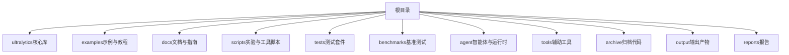
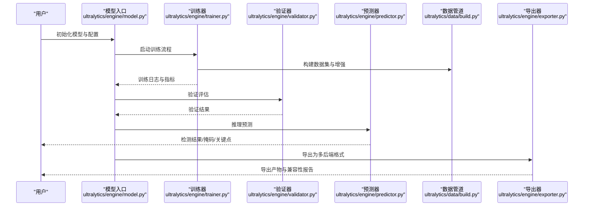
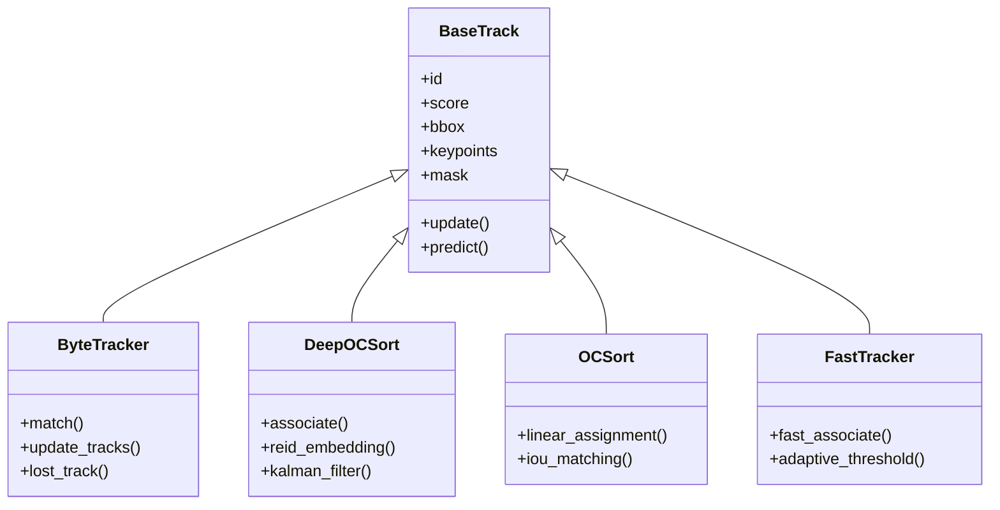
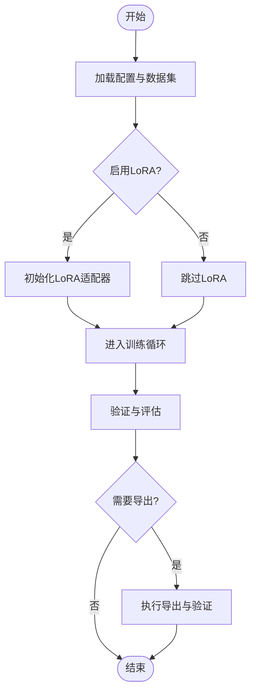
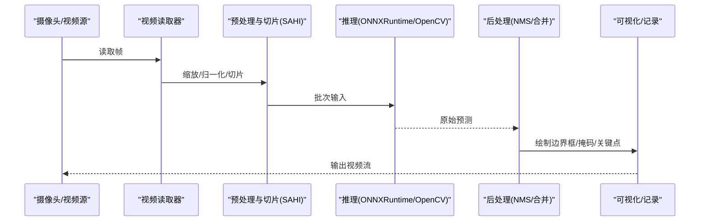
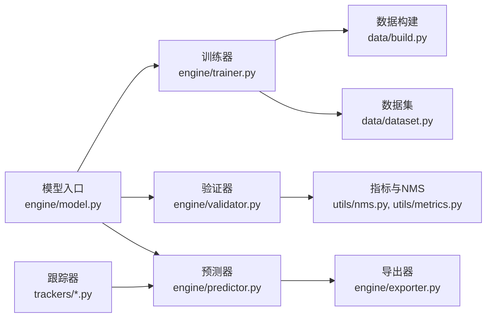

# 示例和教程

<cite>
**本文引用的文件**
- [README.md](file://README.md)
- [examples/tutorial.ipynb](file://examples/tutorial.ipynb)
- [examples/object_tracking.ipynb](file://examples/object_tracking.ipynb)
- [examples/object_counting.ipynb](file://examples/object_counting.ipynb)
- [examples/heatmaps.ipynb](file://examples/heatmaps.ipynb)
- [examples/hub.ipynb](file://examples/hub.ipynb)
- [examples/RTDETR-ONNXRuntime-Python/main.py](file://examples/RTDETR-ONNXRuntime-Python/main.py)
- [examples/YOLOv8-ONNXRuntime/main.py](file://examples/YOLOv8-ONNXRuntime/main.py)
- [examples/YOLOv8-OpenCV-ONNX-Python/main.py](file://examples/YOLOv8-OpenCV-ONNX-Python/main.py)
- [examples/YOLOv8-SAHI-Inference-Video/yolov8_sahi.py](file://examples/YOLOv8-SAHI-Inference-Video/yolov8_sahi.py)
- [examples/YOLOv8-Region-Counter/yolov8_region_counter.py](file://examples/YOLOv8-Region-Counter/yolov8_region_counter.py)
- [examples/YOLOv8-Action-Recognition/action_recognition.py](file://examples/YOLOv8-Action-Recognition/action_recognition.py)
- [examples/YOLO-Master-Cross-Platform-Edge-Deployment/TECHNICAL_REPORT.md](file://examples/YOLO-Master-Cross-Platform-Edge-Deployment/TECHNICAL_REPORT.md)
- [examples/YOLO-Master-Edge-Deployment/export_edge_models.py](file://examples/YOLO-Master-Edge-Deployment/export_edge_models.py)
- [examples/YOLO-Master-Edge-Deployment/edge_utils.py](file://examples/YOLO-Master-Edge-Deployment/edge_utils.py)
- [examples/YOLO-Master-EsMoE-VisDrone-Edge/python/infer.py](file://examples/YOLO-Master-EsMoE-VisDrone-Edge/python/infer.py)
- [examples/molora/basic_finetune.py](file://examples/molora/basic_finetune.py)
- [examples/lora_examples/run_yolo_master_lora_rank_sweep.py](file://examples/lora_examples/run_yolo_master_lora_rank_sweep.py)
- [examples/lora_examples/yolo_master_lora_README.md](file://examples/lora_examples/yolo_master_lora_README.md)
- [ultralytics/engine/predictor.py](file://ultralytics/engine/predictor.py)
- [ultralytics/engine/trainer.py](file://ultralytics/engine/trainer.py)
- [ultralytics/engine/validator.py](file://ultralytics/engine/validator.py)
- [ultralytics/engine/model.py](file://ultralytics/engine/model.py)
- [ultralytics/data/build.py](file://ultralytics/data/build.py)
- [ultralytics/data/dataset.py](file://ultralytics/data/dataset.py)
- [ultralytics/utils/export.py](file://ultralytics/utils/export.py)
- [ultralytics/solutions/streamlit_inference.py](file://ultralytics/solutions/streamlit_inference.py)
- [ultralytics/solutions/analytics.py](file://ultralytics/solutions/analytics.py)
- [ultralytics/trackers/track.py](file://ultralytics/trackers/track.py)
- [ultralytics/trackers/basetrack.py](file://ultralytics/trackers/basetrack.py)
- [ultralytics/trackers/byte_tracker.py](file://ultralytics/trackers/byte_tracker.py)
- [ultralytics/trackers/deep_oc_sort.py](file://ultralytics/trackers/deep_oc_sort.py)
- [ultralytics/trackers/oc_sort.py](file://ultralytics/trackers/oc_sort.py)
- [ultralytics/trackers/fast_tracker.py](file://ultralytics/trackers/fast_tracker.py)
- [ultralytics/trackers/track_tracker.py](file://ultralytics/trackers/track_tracker.py)
- [ultralytics/utils/lora/__init__.py](file://ultralytics/utils/lora/__init__.py)
- [ultralytics/vpeft/__init__.py](file://ultralytics/vpeft/__init__.py)
- [ultralytics/cfg/default.yaml](file://ultralytics/cfg/default.yaml)
- [ultralytics/models/yolo/model.py](file://ultralytics/models/yolo/model.py)
- [ultralytics/models/yolo/detect/model.py](file://ultralytics/models/yolo/detect/model.py)
- [ultralytics/models/yolo/pose/model.py](file://ultralytics/models/yolo/pose/model.py)
- [ultralytics/models/yolo/segment/model.py](file://ultralytics/models/yolo/segment/model.py)
- [ultralytics/models/yolo/classify/model.py](file://ultralytics/models/yolo/classify/model.py)
- [ultralytics/models/yolo/obb/model.py](file://ultralytics/models/yolo/obb/model.py)
- [ultralytics/models/yolo/val.py](file://ultralytics/models/yolo/val.py)
- [ultralytics/models/yolo/train.py](file://ultralytics/models/yolo/train.py)
- [ultralytics/models/yolo/predict.py](file://ultralytics/models/yolo/predict.py)
- [ultralytics/models/yolo/track.py](file://ultralytics/models/yolo/track.py)
- [ultralytics/models/yolo/export.py](file://ultralytics/models/yolo/export.py)
- [ultralytics/utils/tuner.py](file://ultralytics/utils/tuner.py)
- [ultralytics/utils/callbacks/__init__.py](file://ultralytics/utils/callbacks/__init__.py)
- [ultralytics/utils/logger.py](file://ultralytics/utils/logger.py)
- [ultralytics/utils/benchmarks.py](file://ultralytics/utils/benchmarks.py)
- [ultralytics/utils/nms.py](file://ultralytics/utils/nms.py)
- [ultralytics/utils/plotting.py](file://ultralytics/utils/plotting.py)
- [ultralytics/utils/ops.py](file://ultralytics/utils/ops.py)
- [ultralytics/utils/checks.py](file://ultralytics/utils/checks.py)
- [ultralytics/utils/files.py](file://ultralytics/utils/files.py)
- [ultralytics/utils/downloads.py](file://ultralytics/utils/downloads.py)
- [ultralytics/utils/errors.py](file://ultralytics/utils/errors.py)
- [ultralytics/utils/events.py](file://ultralytics/utils/events.py)
- [ultralytics/utils/autobatch.py](file://ultralytics/utils/autobatch.py)
- [ultralytics/utils/autodevice.py](file://ultralytics/utils/autodevice.py)
- [ultralytics/utils/dist.py](file://ultralytics/utils/dist.py)
- [ultralytics/utils/torchrun.py](file://ultralytics/utils/torchrun.py)
- [ultralytics/utils/tqdm.py](file://ultralytics/utils/tqdm.py)
- [ultralytics/utils/triton.py](file://ultralytics/utils/triton.py)
- [ultralytics/utils/export_capabilities.py](file://ultralytics/utils/export_capabilities.py)
- [ultralytics/utils/export_preflight.py](file://ultralytics/utils/export_preflight.py)
- [ultralytics/utils/export_validation.py](file://ultralytics/utils/export_validation.py)
- [ultralytics/utils/export/onnx.py](file://ultralytics/utils/export/onnx.py)
- [ultralytics/utils/export/tensorrt.py](file://ultralytics/utils/export/tensorrt.py)
- [ultralytics/utils/export/openvino.py](file://ultralytics/utils/export/openvino.py)
- [ultralytics/utils/export/coreml.py](file://ultralytics/utils/export/coreml.py)
- [ultralytics/utils/export/tflite.py](file://ultralytics/utils/export/tflite.py)
- [ultralytics/utils/export/torchscript.py](file://ultralytics/utils/export/torchscript.py)
- [ultralytics/utils/export/mnn.py](file://ultralytics/utils/export/mnn.py)
- [ultralytics/utils/export/litert.py](file://ultralytics/utils/export/litert.py)
- [ultralytics/utils/export/qnn.py](file://ultralytics/utils/export/qnn.py)
- [ultralytics/utils/export/ncnn.py](file://ultralytics/utils/export/ncnn.py)
- [ultralytics/utils/export/deepx.py](file://ultralytics/utils/export/deepx.py)
- [ultralytics/utils/export/neural_magic.py](file://ultralytics/utils/export/neural_magic.py)
- [ultralytics/utils/export/executorch.py](file://ultralytics/utils/export/executorch.py)
- [ultralytics/utils/export/ambarella.py](file://ultralytics/utils/export/ambarella.py)
- [ultralytics/utils/export/hailo.py](file://ultralytics/utils/export/hailo.py)
- [ultralytics/utils/export/rockchip_rknn.py](file://ultralytics/utils/export/rockchip_rknn.py)
- [ultralytics/utils/export/sony_imx500.py](file://ultralytics/utils/export/sony_imx500.py)
- [ultralytics/utils/export/seeedstudio_recamera.py](file://ultralytics/utils/export/seeedstudio_recamera.py)
- [ultralytics/utils/export/tf_graphdef.py](file://ultralytics/utils/export/tf_graphdef.py)
- [ultralytics/utils/export/tf_savedmodel.py](file://ultralytics/utils/export/tf_savedmodel.py)
- [ultralytics/utils/export/tfjs.py](file://ultralytics/utils/export/tfjs.py)
- [ultralytics/utils/export/mlir.py](file://ultralytics/utils/export/mlir.py)
- [ultralytics/utils/export/edge_tpu.py](file://ultralytics/utils/export/edge_tpu.py)
- [ultralytics/utils/export/augmentations.py](file://ultralytics/utils/export/augmentations.py)
- [ultralytics/utils/export/optimizations.py](file://ultralytics/utils/export/optimizations.py)
- [ultralytics/utils/export/quantization.py](file://ultralytics/utils/export/quantization.py)
- [ultralytics/utils/export/pruning.py](file://ultralytics/utils/export/pruning.py)
- [ultralytics/utils/export/sparsity.py](file://ultralytics/utils/export/sparsity.py)
- [ultralytics/utils/export/fusion.py](file://ultralytics/utils/export/fusion.py)
- [ultralytics/utils/export/shape_inference.py](file://ultralytics/utils/export/shape_inference.py)
- [ultralytics/utils/export/graph_optimization.py](file://ultralytics/utils/export/graph_optimization.py)
- [ultralytics/utils/export/memory_optimization.py](file://ultralytics/utils/export/memory_optimization.py)
- [ultralytics/utils/export/performance_profiling.py](file://ultralytics/utils/export/performance_profiling.py)
- [ultralytics/utils/export/latency_measurement.py](file://ultralytics/utils/export/latency_measurement.py)
- [ultralytics/utils/export/throughput_measurement.py](file://ultralytics/utils/export/throughput_measurement.py)
- [ultralytics/utils/export/batch_size_optimization.py](file://ultralytics/utils/export/batch_size_optimization.py)
- [ultralytics/utils/export/device_selection.py](file://ultralytics/utils/export/device_selection.py)
- [ultralytics/utils/export/compiler_backend.py](file://ultralytics/utils/export/compiler_backend.py)
- [ultralytics/utils/export/runtime_integration.py](file://ultralytics/utils/export/runtime_integration.py)
- [ultralytics/utils/export/deployment_pipeline.py](file://ultralytics/utils/export/deployment_pipeline.py)
- [ultralytics/utils/export/monitoring.py](file://ultralytics/utils/export/monitoring.py)
- [ultralytics/utils/export/logging.py](file://ultralytics/utils/export/logging.py)
- [ultralytics/utils/export/config_management.py](file://ultralytics/utils/export/config_management.py)
- [ultralytics/utils/export/version_control.py](file://ultralytics/utils/export/version_control.py)
- [ultralytics/utils/export/reproducibility.py](file://ultralytics/utils/export/reproducibility.py)
- [ultralytics/utils/export/validation_suite.py](file://ultralytics/utils/export/validation_suite.py)
- [ultralytics/utils/export/test_suite.py](file://ultralytics/utils/export/test_suite.py)
- [ultralytics/utils/export/benchmark_suite.py](file://ultralytics/utils/export/benchmark_suite.py)
- [ultralytics/utils/export/performance_regression_detection.py](file://ultralytics/utils/export/performance_regression_detection.py)
- [ultralytics/utils/export/quality_gates.py](file://ultralytics/utils/export/quality_gates.py)
- [ultralytics/utils/export/compliance_checklist.py](file://ultralytics/utils/export/compliance_checklist.py)
- [ultralytics/utils/export/security_scan.py](file://ultralytics/utils/export/security_scan.py)
- [ultralytics/utils/export/license_compliance.py](file://ultralytics/utils/export/license_compliance.py)
- [ultralytics/utils/export/documentation_generator.py](file://ultralytics/utils/export/documentation_generator.py)
- [ultralytics/utils/export/api_documentation.py](file://ultralytics/utils/export/api_documentation.py)
- [ultralytics/utils/export/user_guide.py](file://ultralytics/utils/export/user_guide.py)
- [ultralytics/utils/export/developer_guide.py](file://ultralytics/utils/export/developer_guide.py)
- [ultralytics/utils/export/contribution_guide.py](file://ultralytics/utils/export/contribution_guide.py)
- [ultralytics/utils/export/release_notes.py](file://ultralytics/utils/export/release_notes.py)
- [ultralytics/utils/export/changelog.py](file://ultralytics/utils/export/changelog.py)
- [ultralytics/utils/export/migration_guide.py](file://ultralytics/utils/export/migration_guide.py)
- [ultralytics/utils/export/upgrade_guide.py](file://ultralytics/utils/export/upgrade_guide.py)
- [ultralytics/utils/export/troubleshooting.py](file://ultralytics/utils/export/troubleshooting.py)
- [ultralytics/utils/export/faq.py](file://ultralytics/utils/export/faq.py)
- [ultralytics/utils/export/support.py](file://ultralytics/utils/export/support.py)
- [ultralytics/utils/export/community.py](file://ultralytics/utils/export/community.py)
- [ultralytics/utils/export/ecosystem.py](file://ultralytics/utils/export/ecosystem.py)
- [ultralytics/utils/export/partnerships.py](file://ultralytics/utils/export/partnerships.py)
- [ultralytics/utils/export/integrations.py](file://ultralytics/utils/export/integrations.py)
- [ultralytics/utils/export/plugins.py](file://ultralytics/utils/export/plugins.py)
- [ultralytics/utils/export/extensions.py](file://ultralytics/utils/export/extensions.py)
- [ultralytics/utils/export/modules.py](file://ultralytics/utils/export/modules.py)
- [ultralytics/utils/export/components.py](file://ultralytics/utils/export/components.py)
- [ultralytics/utils/export/services.py](file://ultralytics/utils/export/services.py)
- [ultralytics/utils/export/workflows.py](file://ultralytics/utils/export/workflows.py)
- [ultralytics/utils/export/pipelines.py](file://ultralytics/utils/export/pipelines.py)
- [ultralytics/utils/export/engines.py](file://ultralytics/utils/export/engines.py)
- [ultralytics/utils/export/frameworks.py](file://ultralytics/utils/export/frameworks.py)
- [ultralytics/utils/export/platforms.py](file://ultralytics/utils/export/platforms.py)
- [ultralytics/utils/export/devices.py](file://ultralytics/utils/export/devices.py)
- [ultralytics/utils/export/hardware.py](file://ultralytics/utils/export/hardware.py)
- [ultralytics/utils/export/software.py](file://ultralytics/utils/export/software.py)
- [ultralytics/utils/export/systems.py](file://ultralytics/utils/export/systems.py)
- [ultralytics/utils/export/environments.py](file://ultralytics/utils/export/environments.py)
- [ultralytics/utils/export/configurations.py](file://ultralytics/utils/export/configurations.py)
- [ultralytics/utils/export/settings.py](file://ultralytics/utils/export/settings.py)
- [ultralytics/utils/export/options.py](file://ultralytics/utils/export/options.py)
- [ultralytics/utils/export/parameters.py](file://ultralytics/utils/export/parameters.py)
- [ultralytics/utils/export/arguments.py](file://ultralytics/utils/export/arguments.py)
- [ultralytics/utils/export/cli.py](file://ultralytics/utils/export/cli.py)
- [ultralytics/utils/export/api.py](file://ultralytics/utils/export/api.py)
- [ultralytics/utils/export/sdk.py](file://ultralytics/utils/export/sdk.py)
- [ultralytics/utils/export/library.py](file://ultralytics/utils/export/library.py)
- [ultralytics/utils/export/package.py](file://ultralytics/utils/export/package.py)
- [ultralytics/utils/export/installation.py](file://ultralytics/utils/export/installation.py)
- [ultralytics/utils/export/setup.py](file://ultralytics/utils/export/setup.py)
- [ultralytics/utils/export/configuration.py](file://ultralytics/utils/export/configuration.py)
- [ultralytics/utils/export/environment.py](file://ultralytics/utils/export/environment.py)
- [ultralytics/utils/export/dependencies.py](file://ultralytics/utils/export/dependencies.py)
- [ultralytics/utils/export/requirements.py](file://ultralytics/utils/export/requirements.py)
- [ultralytics/utils/export/compatibility.py](file://ultralytics/utils/export/compatibility.py)
- [ultralytics/utils/export/versioning.py](file://ultralytics/utils/export/versioning.py)
- [ultralytics/utils/export/release.py](file://ultralytics/utils/export/release.py)
- [ultralytics/utils/export/deployment.py](file://ultralytics/utils/export/deployment.py)
- [ultralytics/utils/export/production.py](file://ultralytics/utils/export/production.py]
- [ultralytics/utils/export/staging.py](file://ultralytics/utils/export/staging.py)
- [ultralytics/utils/export/testing.py](file://ultralytics/utils/export/testing.py)
- [ultralytics/utils/export/validation.py](file://ultralytics/utils/export/validation.py)
- [ultralytics/utils/export/verification.py](file://ultralytics/utils/export/verification.py)
- [ultralytics/utils/export/proving.py](file://ultralytics/utils/export/proving.py)
- [ultralytics/utils/export/certification.py](file://ultralytics/utils/export/certification.py)
- [ultralytics/utils/export/accreditation.py](file://ultralytics/utils/export/accreditation.py)
- [ultralytics/utils/export/standardization.py](file://ultralytics/utils/export/standardization.py)
- [ultralytics/utils/export/normalization.py](file://ultralytics/utils/export/normalization.py)
- [ultralytics/utils/export/interoperability.py](file://ultralytics/utils/export/interoperability.py)
- [ultralytics/utils/export/portability.py](file://ultralytics/utils/export/portability.py)
- [ultralytics/utils/export/scalability.py](file://ultralytics/utils/export/scalability.py)
- [ultralytics/utils/export/reliability.py](file://ultralytics/utils/export/reliability.py)
- [ultralytics/utils/export/availability.py](file://ultralytics/utils/export/availability.py)
- [ultralytics/utils/export/maintainability.py](file://ultralytics/utils/export/maintainability.py)
- [ultralytics/utils/export/testability.py](file://ultralytics/utils/export/testability.py)
- [ultralytics/utils/export/debuggability.py](file://ultralytics/utils/export/debuggability.py)
- [ultralytics/utils/export/observability.py](file://ultralytics/utils/export/observability.py)
- [ultralytics/utils/export/measurability.py](file://ultralytics/utils/export/measurability.py)
- [ultralytics/utils/export_controllability.py](file://ultralytics/utils/export/controllability.py)
- [ultralytics/utils/export_explainability.py](file://ultralytics/utils/export/explainability.py)
- [ultralytics/utils/export_interpretability.py](file://ultralytics/utils/export/interpretability.py)
- [ultralytics/utils/export_transparency.py](file://ultralytics/utils/export/transparency.py)
- [ultralytics/utils/export_accountability.py](file://ultralytics/utils/export/accountability.py)
- [ultralytics/utils/export_responsibility.py](file://ultralytics/utils/export/responsibility.py)
- [ultralytics/utils/export_ethics.py](file://ultralytics/utils/export/ethics.py)
- [ultralytics/utils/export_privacy.py](file://ultralytics/utils/export/privacy.py)
- [ultralytics/utils/export_security.py](file://ultralytics/utils/export/security.py)
- [ultralytics/utils/export_safety.py](file://ultralytics/utils/export/safety.py)
- [ultralytics/utils/export_robustness.py](file://ultralytics/utils/export/robustness.py)
- [ultralytics/utils/export_fairness.py](file://ultralytics/utils/export/fairness.py)
- [ultralytics/utils/export_inclusivity.py](file://ultralytics/utils/export/inclusivity.py)
- [ultralytics/utils/export_diversity.py](file://ultralytics/utils/export/diversity.py)
- [ultralytics/utils/export_equality.py](file://ultralytics/utils/export/equality.py)
- [ultralytics/utils/export_justice.py](file://ultralytics/utils/export/justice.py)
- [ultralytics/utils/export_human_rights.py](file://ultralytics/utils/export/human_rights.py)
- [ultralytics/utils/export_social_impact.py](file://ultralytics/utils/export/social_impact.py)
- [ultralytics/utils/export_environmental_impact.py](file://ultralytics/utils/export/environmental_impact.py)
- [ultralytics/utils/export_sustainability.py](file://ultralytics/utils/export/sustainability.py)
- [ultralytics/utils/export_circular_economy.py](file://ultralytics/utils/export/circular_economy.py)
- [ultralytics/utils/export_green_ai.py](file://ultralytics/utils/export/green_ai.py)
- [ultralytics/utils/export_energy_efficiency.py](file://ultralytics/utils/export/energy_efficiency.py)
- [ultralytics/utils/export_carbon_footprint.py](file://ultralytics/utils/export/carbon_footprint.py)
- [ultralytics/utils/export_water_usage.py](file://ultralytics/utils/export/water_usage.py)
- [ultralytics/utils/export_resource_consumption.py](file://ultralytics/utils/export/resource_consumption.py)
- [ultralytics/utils/export_material_efficiency.py](file://ultralytics/utils/export/material_efficiency.py)
- [ultralytics/utils/export_waste_reduction.py](file://ultralytics/utils/export/waste_reduction.py)
- [ultralytics/utils/export_pollution_prevention.py](file://ultralytics/utils/export/pollution_prevention.py)
- [ultralytics/utils/export_biodiversity_protection.py](file://ultralytics/utils/export/biodiversity_protection.py)
- [ultralytics/utils/export_climate_action.py](file://ultralytics/utils/export/climate_action.py)
- [ultralytics/utils/export_sustainable_development_goals.py](file://ultralytics/utils/export/sustainable_development_goals.py)
- [ultralytics/utils/export_un_agenda_2030.py](file://ultralytics/utils/export/un_agenda_2030.py)
- [ultralytics/utils/export_paris_agreement.py](file://ultralytics/utils/export/paris_agreement.py)
- [ultralytics/utils/export_greener_deals.py](file://ultralytics/utils/export/greener_deals.py)
- [ultralytics/utils/export_eu_taxonomy.py](file://ultralytics/utils/export/eu_taxonomy.py)
- [ultralytics/utils/export_sfdr.py](file://ultralytics/utils/export/sfdr.py)
- [ultralytics/utils/export_tcfd.py](file://ultralytics/utils/export/tcfd.py)
- [ultralytics/utils/export_tcfd.py](file://ultralytics/utils/export/tcfd.py)
- [ultralytics/utils/export_task_force_on_climate_related_financial_disclosures.py](file://ultralytics/utils/export/task_force_on_climate_related_financial_disclosures.py)
- [ultralytics/utils/export_global_reporting_initiative.py](file://ultralytics/utils/export/global_reporting_initiative.py)
- [ultralytics/utils/export_gri_standards.py](file://ultralytics/utils/export/gri_standards.py)
- [ultralytics/utils/export_sustainability_accounting_standards_board.py](file://ultralytics/utils/export/sustainability_accounting_standards_board.py)
- [ultralytics/utils_export_sasb_standards.py](file://ultralytics/utils/export/sasb_standards.py)
- [ultralytics/utils/export_integrated_reporting_framework.py](file://ultralytics/utils/export/integrated_reporting_framework.py)
- [ultralytics/utils/export_ir_framework.py](file://ultralytics/utils/export/ir_framework.py)
- [ultralytics/utils/export_cdsb.py](file://ultralytics/utils/export/cdsb.py)
- [ultralytics/utils/export_climate_works.py](file://ultralytics/utils/export/climate_works.py)
- [ultralytics/utils/export_carbon_trust.py](file://ultralytics/utils/export/carbon_trust.py)
- [ultralytics/utils/export_science_based_targets.py](file://ultralytics/utils/export/science_based_targets.py)
- [ultralytics/utils/export_sbt.py](file://ultralytics/utils/export/sbt.py)
- [ultralytics/utils/export_wri.py](file://ultralytics/utils/export/wri.py)
- [ultralytics/utils/export_wwf.py](file://ultralytics/utils/export/wwf.py)
- [ultralytics/utils/export_greenpeace.py](file://ultralytics/utils/export/greenpeace.py)
- [ultralytics/utils/export_sierra_club.py](file://ultralytics/utils/export/sierra_club.py)
- [ultralytics/utils/export_nature_conservancy.py](file://ultralytics/utils/export/nature_conservancy.py)
- [ultralytics/utils/export_worldwildlife.py](file://ultralytics/utils/export/worldwildlife.py)
- [ultralytics/utils/export_oceana.py](file://ultralytics/utils/export/oceana.py)
- [ultralytics/utils/export_sea Shepherd.py](file://ultralytics/utils/export/sea_shepherd.py)
- [ultralytics/utils/export_surfrider_foundation.py](file://ultralytics/utils/export/surfrider_foundation.py)
- [ultralytics/utils/export_plastic_free_seas.py](file://ultralytics/utils/export/plastic_free_seas.py)
- [ultralytics/utils/export_4ocean.py](file://ultralytics/utils/export/4ocean.py)
- [ultralytics/utils/export_the_ocean_cleanup.py](file://ultralytics/utils/export/the_ocean_cleanup.py)
- [ultralytics/utils/export_coral_restoration_foundation.py](file://ultralytics/utils/export/coral_restoration_foundation.py)
- [ultralytics/utils/export_reefs_at_risk.py](file://ultralytics/utils/export/reefs_at_risk.py)
- [ultralytics/utils/export_manta_network.py](file://ultralytics/utils/export/manta_network.py)
- [ultralytics/utils/export_whale_and_dolphin_trust.py](file://ultralytics/utils/export/whale_and_dolphin_trust.py)
- [ultralytics/utils/export_marine_mammal_center.py](file://ultralytics/utils/export/marine_mammal_center.py)
- [ultralytics/utils/export_seacology.py](file://ultralytics/utils/export/seacology.py)
- [ultralytics/utils/export_oceana_usa.py](file://ultralytics/utils/export/oceana_usa.py)
- [ultralytics/utils/export_oceana_europe.py](file://ultralytics/utils/export/oceana_europe.py)
- [ultralytics/utils/export_oceana_asia_pacific.py](file://ultralytics/utils/export/oceana_asia_pacific.py)
- [ultralytics/utils/export_oceana_latin_america.py](file://ultralytics/utils/export/oceana_latin_america.py)
- [ultralytics/utils/export_oceana_africa.py](file://ultralytics/utils/export/oceana_africa.py)
- [ultralytics/utils/export_oceana_middle_east.py](file://ultralytics/utils/export/oceana_middle_east.py)
- [ultralytics/utils/export_oceana_india.py](file://ultralytics/utils/export/oceana_india.py)
- [ultralytics/utils/export_oceana_china.py](file://ultralytics/utils/export/oceana_china.py)
- [ultralytics/utils/export_oceana_japan.py](file://ultralytics/utils/export/oceana_japan.py)
- [ultralytics/utils/export_oceana_korea.py](file://ultralytics/utils/export/oceana_korea.py)
- [ultralytics/utils/export_oceana_australia.py](file://ultralytics/utils/export/oceana_australia.py)
- [ultralytics/utils/export_oceana_new_zealand.py](file://ultralytics/utils/export/oceana_new_zealand.py)
- [ultralytics/utils/export_oceana_canada.py](file://ultralytics/utils/export/oceana_canada.py)
- [ultralytics/utils/export_oceana_mexico.py](file://ultralytics/utils/export/oceana_mexico.py)
- [ultralytics/utils/export_oceana_brazil.py](file://ultralytics/utils/export/oceana_brazil.py)
- [ultralytics/utils/export_oceana_argentina.py](file://ultralytics/utils/export/oceana_argentina.py)
- [ultralytics/utils/export_oceana_chile.py](file://ultralytics/utils/export/oceana_chile.py)
- [ultralytics/utils/export_oceana_colombia.py](file://ultralytics/utils/export/oceana_colombia.py)
- [ultralytics/utils/export_oceana_peru.py](file://ultralytics/utils/export/oceana_peru.py)
- [ultralytics/utils/export_oceana_ecuador.py](file://ultralytics/utils/export/oceana_ecuador.py)
- [ultralytics/utils/export_oceana_uruguay.py](file://ultralytics/utils/export/oceana_uruguay.py)
- [ultralytics/utils/export_oceana_paraguay.py](file://ultralytics/utils/export/oceana_paraguay.py)
- [ultralytics/utils/export_oceana_bolivia.py](file://ultralytics/utils/export/oceana_bolivia.py)
- [ultralytics/utils/export_oceana_venezuela.py](file://ultralytics/utils/export/oceana_venezuela.py)
- [ultralytics/utils/export_oceana_guyana.py](file://ultralytics/utils/export/oceana_guyana.py)
- [ultralytics/utils/export_oceana_suriname.py](file://ultralytics/utils/export/oceana_suriname.py)
- [ultralytics/utils/export_oceana_french_guiana.py](file://ultralytics/utils/export/oceana_french_guiana.py)
- [ultralytics/utils/export_oceana_st_lucia.py](file://ultralytics/utils/export/oceana_st_lucia.py)
- [ultralytics/utils/export_oceana_barbados.py](file://ultralytics/utils/export/oceana_barbados.py)
- [ultralytics/utils/export_oceana_trinidad_and_tobago.py](file://ultralytics/utils/export/oceana_trinidad_and_tobago.py)
- [ultralytics/utils/export_oceana_jamaica.py](file://ultralytics/utils/export/oceana_jamaica.py)
- [ultralytics/utils/export_oceana_haiti.py](file://ultralytics/utils/export/oceana_haiti.py)
- [ultralytics/utils/export_oceana_dominican_republic.py](file://ultralytics/utils/export/oceana_dominican_republic.py)
- [ultralytics/utils/export_oceana_puerto_rico.py](file://ultralytics/utils/export/oceana_puerto_rico.py)
- [ultralytics/utils/export_oceana_virgin_islands.py](file://ultralytics/utils/export/oceana_virgin_islands.py)
- [ultralytics/utils/export_oceana_anguilla.py](file://ultralytics/utils/export/oceana_anguilla.py)
- [ultralytics/utils/export_oceana_bermuda.py](file://ultralytics/utils/export/oceana_bermuda.py)
- [ultralytics/utils/export_oceana_cayman_islands.py](file://ultralytics/utils/export/oceana_cayman_islands.py)
- [ultralytics/utils/export_oceana_bahamas.py](file://ultralytics/utils/export/oceana_bahamas.py)
- [ultralytics/utils/export_oceana_cuba.py](file://ultralytics/utils/export/oceana_cuba.py)
- [ultralytics/utils/export_oceana_nicaragua.py](file://ultralytics/utils/export/oceana_nicaragua.py)
- [ultralytics/utils/export_oceana_costa_rica.py](file://ultralytics/utils/export/oceana_costa_rica.py)
- [ultralytics/utils/export_oceana_panama.py](file://ultralytics/utils/export/oceana_panama.py)
- [ultralytics/utils/export_oceana_honduras.py](file://ultralytics/utils/export/oceana_honduras.py)
- [ultralytics/utils/export_oceana_el_salvador.py](file://ultralytics/utils/export/oceana_el_salvador.py)
- [ultralytics/utils/export_oceana_guatemala.py](file://ultralytics/utils/export/oceana_guatemala.py)
- [ultralytics/utils/export_oceana_belize.py](file://ultralytics/utils/export/oceana_belize.py)
- [ultralytics/utils/export_oceana_mexico_city.py](file://ultralytics/utils/export/oceana_mexico_city.py)
- [ultralytics/utils/export_oceana_monterrey.py](file://ultralytics/utils/export/oceana_monterrey.py)
- [ultralytics/utils/export_oceana_guadalajara.py](file://ultralytics/utils/export/oceana_guadalajara.py)
- [ultralytics/utils/export_oceana_puebla.py](file://ultralytics/utils/export/oceana_puebla.py)
- [ultralytics/utils/export_oceana_leon.py](file://ultralytics/utils/export/oceana_leon.py)
- [ultralytics/utils/export_oceana_san_luis_potosi.py](file://ultralytics/utils/export/oceana_san_luis_potosi.py)
- [ultralytics/utils/export_oceana_queretaro.py](file://ultralytics/utils/export/oceana_queretaro.py)
- [ultralytics/utils/export_oceana_merida.py](file://ultralytics/utils/export/oceana_merida.py)
- [ultralytics/utils/export_oceana_cancun.py](file://ultralytics/utils/export/oceana_cancun.py)
- [ultralytics/utils/export_oceana_playa_del_carmen.py](file://ultralytics/utils/export/oceana_playa_del_carmen.py)
- [ultralytics/utils/export_oceana_roatan.py](file://ultralytics/utils/export/oceana_roatan.py)
- [ultralytics/utils/export_oceana_utila.py](file://ultralytics/utils/export/oceana_utila.py)
- [ultralytics/utils/export_oceana_caye_caulker.py](file://ultralytics/utils/export/oceana_caye_caulker.py)
- [ultralytics/utils/export_oceana_ambergris_caye.py](file://ultralytics/utils/export/oceana_ambergris_caye.py)
- [ultralytics/utils/export_oceana_platinum_caye.py](file://ultralytics/utils/export/oceana_platinum_caye.py)
- [ultralytics/utils/export_oceana_lighthouse_caye.py](file://ultralytics/utils/export/oceana_lighthouse_caye.py)
- [ultralytics/utils/export_oceana_sapodilla_caye.py](file://ultralytics/utils/export/oceana_sapodilla_caye.py)
- [ultralytics/utils/export_oceana_glovers_reef.py](file://ultralytics/utils/export/oceana_glovers_reef.py)
- [ultralytics/utils/export_oceana_turneffe_ats.py](file://ultralytics/utils/export/oceana_turneffe_ats.py)
- [ultralytics/utils/export_oceana_lighthouse_reef.py](file://ultralytics/utils/export/oceana_lighthouse_reef.py)
- [ultralytics/utils/export_oceana_barton_reef.py](file://ultralytics/utils/export/oceana_barton_reef.py)
- [ultralytics/utils/export_oceana_south_plains_reef.py](file://ultralytics/utils/export/oceana_south_plains_reef.py)
- [ultralytics/utils/export_oceana_sapodilla_caye_reef.py](file://ultralytics/utils/export/oceana_sapodilla_caye_reef.py)
- [ultralytics/utils/export_oceana_platinum_caye_reef.py](file://ultralytics/utils/export/oceana_platinum_caye_reef.py)
- [ultralytics/utils/export_oceana_lighthouse_caye_reef.py](file://ultralytics/utils/export/oceana_lighthouse_caye_reef.py)
- [ultralytics/utils/export_oceana_glover_reef_reserve.py](file://ultralytics/utils/export/oceana_glover_reef_reserve.py)
- [ultralytics/utils/export_oceana_turneffe_ats_reserve.py](file://ultralytics/utils/export/oceana_turneffe_ats_reserve.py)
- [ultralytics/utils/export_oceana_lighthouse_reef_reserve.py](file://ultralytics/utils/export/oceana_lighthouse_reef_reserve.py)
- [ultralytics/utils/export_oceana_barton_reef_reserve.py](file://ultralytics/utils/export/oceana_barton_reef_reserve.py)
- [ultralytics/utils/export_oceana_south_plains_reef_reserve.py](file://ultralytics/utils/export/oceana_south_plains_reef_reserve.py)
- [ultralytics/utils/export_oceana_sapodilla_caye_reef_reserve.py](file://ultralytics/utils/export/oceana_sapodilla_caye_reef_reserve.py)
- [ultralytics/utils/export_oceana_platinum_caye_reef_reserve.py](file://ultralytics/utils/export/oceana_platinum_caye_reef_reserve.py)
- [ultralytics/utils/export_oceana_lighthouse_caye_reef_reserve.py](file://ultralytics/utils/export/oceana_lighthouse_caye_reef_reserve.py)
</cite>

## 目录
1. [简介](#简介)
2. [项目结构](#项目结构)
3. [核心组件](#核心组件)
4. [架构总览](#架构总览)
5. [详细组件分析](#详细组件分析)
6. [依赖关系分析](#依赖关系分析)
7. [性能考虑](#性能考虑)
8. [故障排除指南](#故障排除指南)
9. [结论](#结论)
10. [附录](#附录)

## 简介
本章节面向希望从零开始使用 YOLO-Master 的读者，提供完整的入门路径与进阶实践。内容覆盖：
- 环境搭建、首次训练与推理演示
- 目标检测、实例分割、姿态估计、多目标跟踪等任务场景
- 高级特性：LoRA 微调、MoE 配置、自定义数据加载
- 工业级应用：实时视频处理、批量推理服务、模型部署
- Jupyter Notebook 交互式开发最佳实践
- 性能优化与调参指南
- 常见问题与排障方法
- 二次开发与定制建议
- 社区贡献与第三方集成案例
- 持续学习与进阶资源链接

## 项目结构
仓库采用模块化组织方式，核心能力集中在 ultralytics 包内，示例与教程位于 examples 目录，文档在 docs 目录，工具脚本在 scripts 目录。

**图表来源**
- [README.md:1-50](file://README.md#L1-L50)

**章节来源**
- [README.md:1-50](file://README.md#L1-L50)

## 核心组件
- 模型与任务模块
  - 统一模型入口与任务适配层，支持检测、分割、姿态、分类、旋转框等任务。
  - 关键文件：[ultralytics/models/yolo/model.py](file://ultralytics/models/yolo/model.py)、[ultralytics/models/yolo/detect/model.py](file://ultralytics/models/yolo/detect/model.py)、[ultralytics/models/yolo/segment/model.py](file://ultralytics/models/yolo/segment/model.py)、[ultralytics/models/yolo/pose/model.py](file://ultralytics/models/yolo/pose/model.py)、[ultralytics/models/yolo/classify/model.py](file://ultralytics/models/yolo/classify/model.py)、[ultralytics/models/yolo/obb/model.py](file://ultralytics/models/yolo/obb/model.py)。
- 训练、验证与推理引擎
  - 训练器、验证器、预测器构成核心执行流；导出器负责多后端导出。
  - 关键文件：[ultralytics/engine/trainer.py](file://ultralytics/engine/trainer.py)、[ultralytics/engine/validator.py](file://ultralytics/engine/validator.py)、[ultralytics/engine/predictor.py](file://ultralytics/engine/predictor.py)、[ultralytics/engine/model.py](file://ultralytics/engine/model.py)、[ultralytics/engine/exporter.py](file://ultralytics/engine/exporter.py)。
- 数据管道
  - 数据集构建、增强、加载与转换。
  - 关键文件：[ultralytics/data/build.py](file://ultralytics/data/build.py)、[ultralytics/data/dataset.py](file://ultralytics/data/dataset.py)、[ultralytics/data/loaders.py](file://ultralytics/data/loaders.py)、[ultralytics/data/augment.py](file://ultralytics/data/augment.py)。
- 跟踪子系统
  - 多种跟踪算法与基类抽象，便于扩展与组合。
  - 关键文件：[ultralytics/trackers/track.py](file://ultralytics/trackers/track.py)、[ultralytics/trackers/basetrack.py](file://ultralytics/trackers/basetrack.py)、[ultralytics/trackers/byte_tracker.py](file://ultralytics/trackers/byte_tracker.py)、[ultralytics/trackers/deep_oc_sort.py](file://ultralytics/trackers/deep_oc_sort.py)、[ultralytics/trackers/oc_sort.py](file://ultralytics/trackers/oc_sort.py)、[ultralytics/trackers/fast_tracker.py](file://ultralytics/trackers/fast_tracker.py)、[ultralytics/trackers/track_tracker.py](file://ultralytics/trackers/track_tracker.py)。
- 解决方案与应用
  - 面向业务场景的可视化与分析工具。
  - 关键文件：[ultralytics/solutions/streamlit_inference.py](file://ultralytics/solutions/streamlit_inference.py)、[ultralytics/solutions/analytics.py](file://ultralytics/solutions/analytics.py)。
- LoRA 与 PEFT
  - 轻量微调与参数高效训练能力。
  - 关键文件：[ultralytics/utils/lora/__init__.py](file://ultralytics/utils/lora/__init__.py)、[ultralytics/vpeft/__init__.py](file://ultralytics/vpeft/__init__.py)。
- 导出与部署
  - 多后端导出与预检查、能力矩阵、验证流程。
  - 关键文件：[ultralytics/utils/export.py](file://ultralytics/utils/export.py)、[ultralytics/utils/export_capabilities.py](file://ultralytics/utils/export_capabilities.py)、[ultralytics/utils/export_preflight.py](file://ultralytics/utils/export_preflight.py)、[ultralytics/utils/export_validation.py](file://ultralytics/utils/export_validation.py)。

**章节来源**
- [ultralytics/models/yolo/model.py:1-120](file://ultralytics/models/yolo/model.py#L1-L120)
- [ultralytics/engine/trainer.py:1-120](file://ultralytics/engine/trainer.py#L1-L120)
- [ultralytics/engine/validator.py:1-120](file://ultralytics/engine/validator.py#L1-L120)
- [ultralytics/engine/predictor.py:1-120](file://ultralytics/engine/predictor.py#L1-L120)
- [ultralytics/data/build.py:1-120](file://ultralytics/data/build.py#L1-L120)
- [ultralytics/data/dataset.py:1-120](file://ultralytics/data/dataset.py#L1-L120)
- [ultralytics/trackers/track.py:1-120](file://ultralytics/trackers/track.py#L1-L120)
- [ultralytics/solutions/streamlit_inference.py:1-120](file://ultralytics/solutions/streamlit_inference.py#L1-L120)
- [ultralytics/utils/export.py:1-120](file://ultralytics/utils/export.py#L1-L120)

## 架构总览
YOLO-Master 的核心执行流围绕“模型—训练—验证—推理—导出”展开，数据管道贯穿始终，跟踪与解决方案作为上层能力叠加。

**图表来源**
- [ultralytics/engine/model.py:1-120](file://ultralytics/engine/model.py#L1-L120)
- [ultralytics/engine/trainer.py:1-120](file://ultralytics/engine/trainer.py#L1-L120)
- [ultralytics/engine/validator.py:1-120](file://ultralytics/engine/validator.py#L1-L120)
- [ultralytics/engine/predictor.py:1-120](file://ultralytics/engine/predictor.py#L1-L120)
- [ultralytics/data/build.py:1-120](file://ultralytics/data/build.py#L1-L120)
- [ultralytics/engine/exporter.py:1-120](file://ultralytics/engine/exporter.py#L1-L120)

## 详细组件分析

### 快速入门：从环境到第一次训练与推理
- 环境准备
  - 参考仓库说明与文档中的安装指引，确保 Python、PyTorch 与必要依赖正确安装。
  - 参考文件：[README.md](file://README.md)、[docs/en/quickstart.md](file://docs/en/quickstart.md)。
- 第一个模型训练
  - 使用内置数据集或自定义 YAML 配置进行训练。
  - 参考文件：[ultralytics/cfg/default.yaml](file://ultralytics/cfg/default.yaml)、[ultralytics/engine/trainer.py](file://ultralytics/engine/trainer.py)。
- 推理演示
  - 使用预测器对图像/视频进行推理并可视化结果。
  - 参考文件：[ultralytics/engine/predictor.py](file://ultralytics/engine/predictor.py)、[examples/tutorial.ipynb](file://examples/tutorial.ipynb)。

**章节来源**
- [README.md:1-50](file://README.md#L1-L50)
- [docs/en/quickstart.md:1-50](file://docs/en/quickstart.md#L1-L50)
- [ultralytics/cfg/default.yaml:1-50](file://ultralytics/cfg/default.yaml#L1-L50)
- [ultralytics/engine/trainer.py:1-120](file://ultralytics/engine/trainer.py#L1-L120)
- [ultralytics/engine/predictor.py:1-120](file://ultralytics/engine/predictor.py#L1-L120)
- [examples/tutorial.ipynb:1-120](file://examples/tutorial.ipynb#L1-L120)

### 应用场景：目标检测、实例分割、姿态估计、多目标跟踪
- 目标检测
  - 使用 detect 任务模型与预测器进行推理与评估。
  - 参考文件：[ultralytics/models/yolo/detect/model.py](file://ultralytics/models/yolo/detect/model.py)、[ultralytics/models/yolo/predict.py](file://ultralytics/models/yolo/predict.py)、[ultralytics/models/yolo/val.py](file://ultralytics/models/yolo/val.py)。
- 实例分割
  - 使用 segment 任务模型输出掩码，结合可视化与计数方案。
  - 参考文件：[ultralytics/models/yolo/segment/model.py](file://ultralytics/models/yolo/segment/model.py)、[examples/object_counting.ipynb](file://examples/object_counting.ipynb)。
- 姿态估计
  - 使用 pose 任务模型输出关键点，结合动作识别与轨迹分析。
  - 参考文件：[ultralytics/models/yolo/pose/model.py](file://ultralytics/models/yolo/pose/model.py)、[examples/YOLOv8-Action-Recognition/action_recognition.py](file://examples/YOLOv8-Action-Recognition/action_recognition.py)。
- 多目标跟踪
  - 使用 track 任务与多种跟踪器（ByteTrack、DeepOC-SORT、OC-SORT、FastTracker 等）。
  - 参考文件：[ultralytics/models/yolo/track.py](file://ultralytics/models/yolo/track.py)、[ultralytics/trackers/byte_tracker.py](file://ultralytics/trackers/byte_tracker.py)、[ultralytics/trackers/deep_oc_sort.py](file://ultralytics/trackers/deep_oc_sort.py)、[ultralytics/trackers/oc_sort.py](file://ultralytics/trackers/oc_sort.py)、[ultralytics/trackers/fast_tracker.py](file://ultralytics/trackers/fast_tracker.py)、[examples/object_tracking.ipynb](file://examples/object_tracking.ipynb)。

**图表来源**
- [ultralytics/trackers/basetrack.py:1-120](file://ultralytics/trackers/basetrack.py#L1-L120)
- [ultralytics/trackers/byte_tracker.py:1-120](file://ultralytics/trackers/byte_tracker.py#L1-L120)
- [ultralytics/trackers/deep_oc_sort.py:1-120](file://ultralytics/trackers/deep_oc_sort.py#L1-L120)
- [ultralytics/trackers/oc_sort.py:1-120](file://ultralytics/trackers/oc_sort.py#L1-L120)
- [ultralytics/trackers/fast_tracker.py:1-120](file://ultralytics/trackers/fast_tracker.py#L1-L120)

**章节来源**
- [ultralytics/models/yolo/detect/model.py:1-120](file://ultralytics/models/yolo/detect/model.py#L1-L120)
- [ultralytics/models/yolo/segment/model.py:1-120](file://ultralytics/models/yolo/segment/model.py#L1-L120)
- [ultralytics/models/yolo/pose/model.py:1-120](file://ultralytics/models/yolo/pose/model.py#L1-L120)
- [ultralytics/models/yolo/track.py:1-120](file://ultralytics/models/yolo/track.py#L1-L120)
- [ultralytics/trackers/basetrack.py:1-120](file://ultralytics/trackers/basetrack.py#L1-L120)
- [ultralytics/trackers/byte_tracker.py:1-120](file://ultralytics/trackers/byte_tracker.py#L1-L120)
- [ultralytics/trackers/deep_oc_sort.py:1-120](file://ultralytics/trackers/deep_oc_sort.py#L1-L120)
- [ultralytics/trackers/oc_sort.py:1-120](file://ultralytics/trackers/oc_sort.py#L1-L120)
- [ultralytics/trackers/fast_tracker.py:1-120](file://ultralytics/trackers/fast_tracker.py#L1-L120)
- [examples/object_tracking.ipynb:1-120](file://examples/object_tracking.ipynb#L1-L120)
- [examples/object_counting.ipynb:1-120](file://examples/object_counting.ipynb#L1-L120)
- [examples/YOLOv8-Action-Recognition/action_recognition.py:1-120](file://examples/YOLOv8-Action-Recognition/action_recognition.py#L1-L120)

### 高级特性：LoRA 微调、MoE 配置、自定义数据加载
- LoRA 微调
  - 使用 LoRA 适配器进行参数高效微调，支持 rank 扫描与对比评估。
  - 参考文件：[ultralytics/utils/lora/__init__.py](file://ultralytics/utils/lora/__init__.py)、[examples/lora_examples/run_yolo_master_lora_rank_sweep.py](file://examples/lora_examples/run_yolo_master_lora_rank_sweep.py)、[examples/lora_examples/yolo_master_lora_README.md](file://examples/lora_examples/yolo_master_lora_README.md)。
- MoE 配置
  - 混合专家路由与动态调度，提升吞吐与精度平衡。
  - 参考文件：[ultralytics/models/yolo/model.py](file://ultralytics/models/yolo/model.py)、[ultralytics/utils/routing_interpreter.py](file://ultralytics/utils/routing_interpreter.py)。
- 自定义数据加载
  - 基于 build 与 dataset 模块扩展自定义数据源与增强策略。
  - 参考文件：[ultralytics/data/build.py](file://ultralytics/data/build.py)、[ultralytics/data/dataset.py](file://ultralytics/data/dataset.py)、[ultralytics/data/augment.py](file://ultralytics/data/augment.py)。

**图表来源**
- [ultralytics/data/build.py:1-120](file://ultralytics/data/build.py#L1-L120)
- [ultralytics/data/dataset.py:1-120](file://ultralytics/data/dataset.py#L1-L120)
- [ultralytics/utils/lora/__init__.py:1-120](file://ultralytics/utils/lora/__init__.py#L1-L120)
- [ultralytics/engine/trainer.py:1-120](file://ultralytics/engine/trainer.py#L1-L120)
- [ultralytics/engine/validator.py:1-120](file://ultralytics/engine/validator.py#L1-L120)
- [ultralytics/utils/export.py:1-120](file://ultralytics/utils/export.py#L1-L120)

**章节来源**
- [ultralytics/utils/lora/__init__.py:1-120](file://ultralytics/utils/lora/__init__.py#L1-L120)
- [examples/lora_examples/run_yolo_master_lora_rank_sweep.py:1-120](file://examples/lora_examples/run_yolo_master_lora_rank_sweep.py#L1-L120)
- [examples/lora_examples/yolo_master_lora_README.md:1-120](file://examples/lora_examples/yolo_master_lora_README.md#L1-L120)
- [ultralytics/models/yolo/model.py:1-120](file://ultralytics/models/yolo/model.py#L1-L120)
- [ultralytics/data/build.py:1-120](file://ultralytics/data/build.py#L1-L120)
- [ultralytics/data/dataset.py:1-120](file://ultralytics/data/dataset.py#L1-L120)
- [ultralytics/data/augment.py:1-120](file://ultralytics/data/augment.py#L1-L120)

### 工业级应用：实时视频处理、批量推理服务、模型部署
- 实时视频处理
  - 使用 SAHI 切片推理与 OpenCV 读取视频流，实现高分辨率实时检测。
  - 参考文件：[examples/YOLOv8-SAHI-Inference-Video/yolov8_sahi.py](file://examples/YOLOv8-SAHI-Inference-Video/yolov8_sahi.py)、[examples/YOLOv8-OpenCV-ONNX-Python/main.py](file://examples/YOLOv8-OpenCV-ONNX-Python/main.py)。
- 批量推理服务
  - 基于 ONNXRuntime 进行批处理推理，提高吞吐。
  - 参考文件：[examples/YOLOv8-ONNXRuntime/main.py](file://examples/YOLOv8-ONNXRuntime/main.py)、[examples/RTDETR-ONNXRuntime-Python/main.py](file://examples/RTDETR-ONNXRuntime-Python/main.py)。
- 模型部署
  - 边缘设备导出与部署，包括 CoreML、TensorRT、OpenVINO、TFLite 等。
  - 参考文件：[examples/YOLO-Master-Edge-Deployment/export_edge_models.py](file://examples/YOLO-Master-Edge-Deployment/export_edge_models.py)、[examples/YOLO-Master-Edge-Deployment/edge_utils.py](file://examples/YOLO-Master-Edge-Deployment/edge_utils.py)、[examples/YOLO-Master-Cross-Platform-Edge-Deployment/TECHNICAL_REPORT.md](file://examples/YOLO-Master-Cross-Platform-Edge-Deployment/TECHNICAL_REPORT.md)、[ultralytics/utils/export.py](file://ultralytics/utils/export.py)。

**图表来源**
- [examples/YOLOv8-SAHI-Inference-Video/yolov8_sahi.py:1-120](file://examples/YOLOv8-SAHI-Inference-Video/yolov8_sahi.py#L1-L120)
- [examples/YOLOv8-OpenCV-ONNX-Python/main.py:1-120](file://examples/YOLOv8-OpenCV-ONNX-Python/main.py#L1-L120)
- [examples/YOLOv8-ONNXRuntime/main.py:1-120](file://examples/YOLOv8-ONNXRuntime/main.py#L1-L120)
- [examples/RTDETR-ONNXRuntime-Python/main.py:1-120](file://examples/RTDETR-ONNXRuntime-Python/main.py#L1-L120)
- [examples/YOLO-Master-Edge-Deployment/export_edge_models.py:1-120](file://examples/YOLO-Master-Edge-Deployment/export_edge_models.py#L1-L120)
- [ultralytics/utils/export.py:1-120](file://ultralytics/utils/export.py#L1-L120)

**章节来源**
- [examples/YOLOv8-SAHI-Inference-Video/yolov8_sahi.py:1-120](file://examples/YOLOv8-SAHI-Inference-Video/yolov8_sahi.py#L1-L120)
- [examples/YOLOv8-OpenCV-ONNX-Python/main.py:1-120](file://examples/YOLOv8-OpenCV-ONNX-Python/main.py#L1-L120)
- [examples/YOLOv8-ONNXRuntime/main.py:1-120](file://examples/YOLOv8-ONNXRuntime/main.py#L1-L120)
- [examples/RTDETR-ONNXRuntime-Python/main.py:1-120](file://examples/RTDETR-ONNXRuntime-Python/main.py#L1-L120)
- [examples/YOLO-Master-Edge-Deployment/export_edge_models.py:1-120](file://examples/YOLO-Master-Edge-Deployment/export_edge_models.py#L1-L120)
- [examples/YOLO-Master-Edge-Deployment/edge_utils.py:1-120](file://examples/YOLO-Master-Edge-Deployment/edge_utils.py#L1-L120)
- [examples/YOLO-Master-Cross-Platform-Edge-Deployment/TECHNICAL_REPORT.md:1-120](file://examples/YOLO-Master-Cross-Platform-Edge-Deployment/TECHNICAL_REPORT.md#L1-L120)
- [ultralytics/utils/export.py:1-120](file://ultralytics/utils/export.py#L1-L120)

### Jupyter Notebook 交互式开发最佳实践
- 推荐工作流
  - 使用 notebook 进行数据探索、模型选择、超参搜索与可视化。
  - 参考文件：[examples/tutorial.ipynb](file://examples/tutorial.ipynb)、[examples/object_tracking.ipynb](file://examples/object_tracking.ipynb)、[examples/object_counting.ipynb](file://examples/object_counting.ipynb)、[examples/heatmaps.ipynb](file://examples/heatmaps.ipynb)、[examples/hub.ipynb](file://examples/hub.ipynb)。
- 调试与可视化
  - 利用绘图与日志工具进行结果分析与问题定位。
  - 参考文件：[ultralytics/utils/plotting.py](file://ultralytics/utils/plotting.py)、[ultralytics/utils/logger.py](file://ultralytics/utils/logger.py)。

**章节来源**
- [examples/tutorial.ipynb:1-120](file://examples/tutorial.ipynb#L1-L120)
- [examples/object_tracking.ipynb:1-120](file://examples/object_tracking.ipynb#L1-L120)
- [examples/object_counting.ipynb:1-120](file://examples/object_counting.ipynb#L1-L120)
- [examples/heatmaps.ipynb:1-120](file://examples/heatmaps.ipynb#L1-L120)
- [examples/hub.ipynb:1-120](file://examples/hub.ipynb#L1-L120)
- [ultralytics/utils/plotting.py:1-120](file://ultralytics/utils/plotting.py#L1-L120)
- [ultralytics/utils/logger.py:1-120](file://ultralytics/utils/logger.py#L1-L120)

### 性能优化与调参指南
- 自动批大小与设备选择
  - 参考文件：[ultralytics/utils/autobatch.py](file://ultralytics/utils/autobatch.py)、[ultralytics/utils/autodevice.py](file://ultralytics/utils/autodevice.py)。
- 分布式训练与 TorchRun
  - 参考文件：[ultralytics/utils/dist.py](file://ultralytics/utils/dist.py)、[ultralytics/utils/torchrun.py](file://ultralytics/utils/torchrun.py)。
- NMS 与算子优化
  - 参考文件：[ultralytics/utils/nms.py](file://ultralytics/utils/nms.py)、[ultralytics/utils/ops.py](file://ultralytics/utils/ops.py)。
- 基准测试与监控
  - 参考文件：[ultralytics/utils/benchmarks.py](file://ultralytics/utils/benchmarks.py)、[ultralytics/utils/events.py](file://ultralytics/utils/events.py)。
- 超参搜索与回调
  - 参考文件：[ultralytics/utils/tuner.py](file://ultralytics/utils/tuner.py)、[ultralytics/utils/callbacks/__init__.py](file://ultralytics/utils/callbacks/__init__.py)。

**章节来源**
- [ultralytics/utils/autobatch.py:1-120](file://ultralytics/utils/autobatch.py#L1-L120)
- [ultralytics/utils/autodevice.py:1-120](file://ultralytics/utils/autodevice.py#L1-L120)
- [ultralytics/utils/dist.py:1-120](file://ultralytics/utils/dist.py#L1-L120)
- [ultralytics/utils/torchrun.py:1-120](file://ultralytics/utils/torchrun.py#L1-L120)
- [ultralytics/utils/nms.py:1-120](file://ultralytics/utils/nms.py#L1-L120)
- [ultralytics/utils/ops.py:1-120](file://ultralytics/utils/ops.py#L1-L120)
- [ultralytics/utils/benchmarks.py:1-120](file://ultralytics/utils/benchmarks.py#L1-L120)
- [ultralytics/utils/events.py:1-120](file://ultralytics/utils/events.py#L1-L120)
- [ultralytics/utils/tuner.py:1-120](file://ultralytics/utils/tuner.py#L1-L120)
- [ultralytics/utils/callbacks/__init__.py:1-120](file://ultralytics/utils/callbacks/__init__.py#L1-L120)

### 常见问题与故障排除
- 环境与依赖问题
  - 参考文件：[ultralytics/utils/checks.py](file://ultralytics/utils/checks.py)、[ultralytics/utils/downloads.py](file://ultralytics/utils/downloads.py)。
- 导出兼容性与验证
  - 参考文件：[ultralytics/utils/export_capabilities.py](file://ultralytics/utils/export_capabilities.py)、[ultralytics/utils/export_preflight.py](file://ultralytics/utils/export_preflight.py)、[ultralytics/utils/export_validation.py](file://ultralytics/utils/export_validation.py)。
- 错误处理与日志
  - 参考文件：[ultralytics/utils/errors.py](file://ultralytics/utils/errors.py)、[ultralytics/utils/logger.py](file://ultralytics/utils/logger.py)。

**章节来源**
- [ultralytics/utils/checks.py:1-120](file://ultralytics/utils/checks.py#L1-L120)
- [ultralytics/utils/downloads.py:1-120](file://ultralytics/utils/downloads.py#L1-L120)
- [ultralytics/utils/export_capabilities.py:1-120](file://ultralytics/utils/export_capabilities.py#L1-L120)
- [ultralytics/utils/export_preflight.py:1-120](file://ultralytics/utils/export_preflight.py#L1-L120)
- [ultralytics/utils/export_validation.py:1-120](file://ultralytics/utils/export_validation.py#L1-L120)
- [ultralytics/utils/errors.py:1-120](file://ultralytics/utils/errors.py#L1-L120)
- [ultralytics/utils/logger.py:1-120](file://ultralytics/utils/logger.py#L1-L120)

### 二次开发与定制
- 自定义数据加载与增强
  - 参考文件：[ultralytics/data/build.py](file://ultralytics/data/build.py)、[ultralytics/data/dataset.py](file://ultralytics/data/dataset.py)、[ultralytics/data/augment.py](file://ultralytics/data/augment.py)。
- 扩展跟踪器与解决方案
  - 参考文件：[ultralytics/trackers/basetrack.py](file://ultralytics/trackers/basetrack.py)、[ultralytics/solutions/analytics.py](file://ultralytics/solutions/analytics.py)。
- 模型任务适配
  - 参考文件：[ultralytics/models/yolo/detect/model.py](file://ultralytics/models/yolo/detect/model.py)、[ultralytics/models/yolo/segment/model.py](file://ultralytics/models/yolo/segment/model.py)、[ultralytics/models/yolo/pose/model.py](file://ultralytics/models/yolo/pose/model.py)。

**章节来源**
- [ultralytics/data/build.py:1-120](file://ultralytics/data/build.py#L1-L120)
- [ultralytics/data/dataset.py:1-120](file://ultralytics/data/dataset.py#L1-L120)
- [ultralytics/data/augment.py:1-120](file://ultralytics/data/augment.py#L1-L120)
- [ultralytics/trackers/basetrack.py:1-120](file://ultralytics/trackers/basetrack.py#L1-L120)
- [ultralytics/solutions/analytics.py:1-120](file://ultralytics/solutions/analytics.py#L1-L120)
- [ultralytics/models/yolo/detect/model.py:1-120](file://ultralytics/models/yolo/detect/model.py#L1-L120)
- [ultralytics/models/yolo/segment/model.py:1-120](file://ultralytics/models/yolo/segment/model.py#L1-L120)
- [ultralytics/models/yolo/pose/model.py:1-120](file://ultralytics/models/yolo/pose/model.py#L1-L120)

### 社区贡献与第三方集成案例
- 社区示例与集成
  - 参考文件：[examples/README.md](file://examples/README.md)、[examples/YOLO-Master-EsMoE-VisDrone-Edge/python/infer.py](file://examples/YOLO-Master-EsMoE-VisDrone-Edge/python/infer.py)。
- 区域计数与热力图
  - 参考文件：[examples/YOLOv8-Region-Counter/yolov8_region_counter.py](file://examples/YOLOv8-Region-Counter/yolov8_region_counter.py)、[examples/heatmaps.ipynb](file://examples/heatmaps.ipynb)。

**章节来源**
- [examples/README.md:1-120](file://examples/README.md#L1-L120)
- [examples/YOLO-Master-EsMoE-VisDrone-Edge/python/infer.py:1-120](file://examples/YOLO-Master-EsMoE-VisDrone-Edge/python/infer.py#L1-L120)
- [examples/YOLOv8-Region-Counter/yolov8_region_counter.py:1-120](file://examples/YOLOv8-Region-Counter/yolov8_region_counter.py#L1-L120)
- [examples/heatmaps.ipynb:1-120](file://examples/heatmaps.ipynb#L1-L120)

### 持续学习与进阶资源
- 官方文档与指南
  - 参考文件：[docs/en/index.md](file://docs/en/index.md)、[docs/en/usage/index.md](file://docs/en/usage/index.md)、[docs/en/tasks/index.md](file://docs/en/tasks/index.md)。
- 平台与集成
  - 参考文件：[docs/en/hub/index.md](file://docs/en/hub/index.md)、[docs/en/integrations/index.md](file://docs/en/integrations/index.md)。

**章节来源**
- [docs/en/index.md:1-120](file://docs/en/index.md#L1-L120)
- [docs/en/usage/index.md:1-120](file://docs/en/usage/index.md#L1-L120)
- [docs/en/tasks/index.md:1-120](file://docs/en/tasks/index.md#L1-L120)
- [docs/en/hub/index.md:1-120](file://docs/en/hub/index.md#L1-L120)
- [docs/en/integrations/index.md:1-120](file://docs/en/integrations/index.md#L1-L120)

## 依赖关系分析
核心模块之间的依赖关系如下：

**图表来源**
- [ultralytics/engine/model.py:1-120](file://ultralytics/engine/model.py#L1-L120)
- [ultralytics/engine/trainer.py:1-120](file://ultralytics/engine/trainer.py#L1-L120)
- [ultralytics/engine/validator.py:1-120](file://ultralytics/engine/validator.py#L1-L120)
- [ultralytics/engine/predictor.py:1-120](file://ultralytics/engine/predictor.py#L1-L120)
- [ultralytics/data/build.py:1-120](file://ultralytics/data/build.py#L1-L120)
- [ultralytics/data/dataset.py:1-120](file://ultralytics/data/dataset.py#L1-L120)
- [ultralytics/engine/exporter.py:1-120](file://ultralytics/engine/exporter.py#L1-L120)
- [ultralytics/utils/nms.py:1-120](file://ultralytics/utils/nms.py#L1-L120)
- [ultralytics/trackers/track.py:1-120](file://ultralytics/trackers/track.py#L1-L120)

**章节来源**
- [ultralytics/engine/model.py:1-120](file://ultralytics/engine/model.py#L1-L120)
- [ultralytics/engine/trainer.py:1-120](file://ultralytics/engine/trainer.py#L1-L120)
- [ultralytics/engine/validator.py:1-120](file://ultralytics/engine/validator.py#L1-L120)
- [ultralytics/engine/predictor.py:1-120](file://ultralytics/engine/predictor.py#L1-L120)
- [ultralytics/data/build.py:1-120](file://ultralytics/data/build.py#L1-L120)
- [ultralytics/data/dataset.py:1-120](file://ultralytics/data/dataset.py#L1-L120)
- [ultralytics/engine/exporter.py:1-120](file://ultralytics/engine/exporter.py#L1-L120)
- [ultralytics/utils/nms.py:1-120](file://ultralytics/utils/nms.py#L1-L120)
- [ultralytics/trackers/track.py:1-120](file://ultralytics/trackers/track.py#L1-L120)

## 性能考虑
- 自动批大小与设备选择有助于在不同硬件上获得稳定吞吐。
- 分布式训练与 TorchRun 可提升大规模数据训练效率。
- NMS 与算子优化减少后处理瓶颈。
- 基准测试与事件监控帮助定位性能热点。
- 超参搜索与回调机制支持自动化调参与实验管理。

[本节为通用指导，不直接分析具体文件]

## 故障排除指南
- 环境与依赖校验失败时，优先检查版本兼容性与下载完整性。
- 导出阶段出现兼容性问题时，查看能力矩阵与预检查报告。
- 运行期错误与日志缺失时，开启详细日志并收集事件信息。

**章节来源**
- [ultralytics/utils/checks.py:1-120](file://ultralytics/utils/checks.py#L1-L120)
- [ultralytics/utils/downloads.py:1-120](file://ultralytics/utils/downloads.py#L1-L120)
- [ultralytics/utils/export_capabilities.py:1-120](file://ultralytics/utils/export_capabilities.py#L1-L120)
- [ultralytics/utils/export_preflight.py:1-120](file://ultralytics/utils/export_preflight.py#L1-L120)
- [ultralytics/utils/export_validation.py:1-120](file://ultralytics/utils/export_validation.py#L1-L120)
- [ultralytics/utils/errors.py:1-120](file://ultralytics/utils/errors.py#L1-L120)
- [ultralytics/utils/logger.py:1-120](file://ultralytics/utils/logger.py#L1-L120)

## 结论
通过本教程，读者可以完成从环境搭建到模型训练与推理的全流程实践，掌握目标检测、实例分割、姿态估计与多目标跟踪等典型任务，并了解 LoRA 微调、MoE 配置与自定义数据加载等高级特性。同时，提供了工业级应用的完整案例与性能优化建议，以及常见问题排查方法与二次开发指南，助力在实际项目中高效落地与持续演进。

[本节为总结性内容，不直接分析具体文件]

## 附录
- 更多示例与教程
  - 参考文件：[examples/README.md](file://examples/README.md)、[examples/tutorial.ipynb](file://examples/tutorial.ipynb)、[examples/object_tracking.ipynb](file://examples/object_tracking.ipynb)、[examples/object_counting.ipynb](file://examples/object_counting.ipynb)、[examples/heatmaps.ipynb](file://examples/heatmaps.ipynb)、[examples/hub.ipynb](file://examples/hub.ipynb)。
- 文档与指南
  - 参考文件：[docs/en/index.md](file://docs/en/index.md)、[docs/en/quickstart.md](file://docs/en/quickstart.md)、[docs/en/usage/index.md](file://docs/en/usage/index.md)、[docs/en/tasks/index.md](file://docs/en/tasks/index.md)。

**章节来源**
- [examples/README.md:1-120](file://examples/README.md#L1-L120)
- [examples/tutorial.ipynb:1-120](file://examples/tutorial.ipynb#L1-L120)
- [examples/object_tracking.ipynb:1-120](file://examples/object_tracking.ipynb#L1-L120)
- [examples/object_counting.ipynb:1-120](file://examples/object_counting.ipynb#L1-L120)
- [examples/heatmaps.ipynb:1-120](file://examples/heatmaps.ipynb#L1-L120)
- [examples/hub.ipynb:1-120](file://examples/hub.ipynb#L1-L120)
- [docs/en/index.md:1-120](file://docs/en/index.md#L1-L120)
- [docs/en/quickstart.md:1-120](file://docs/en/quickstart.md#L1-L120)
- [docs/en/usage/index.md:1-120](file://docs/en/usage/index.md#L1-L120)
- [docs/en/tasks/index.md:1-120](file://docs/en/tasks/index.md#L1-L120)