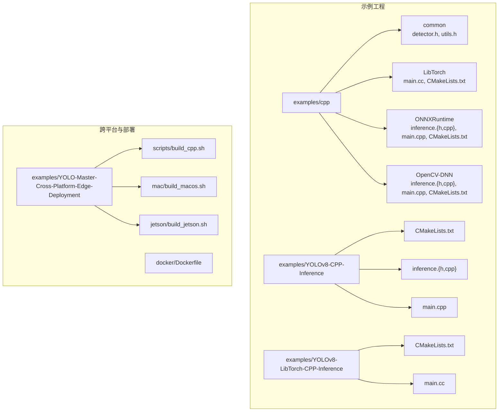
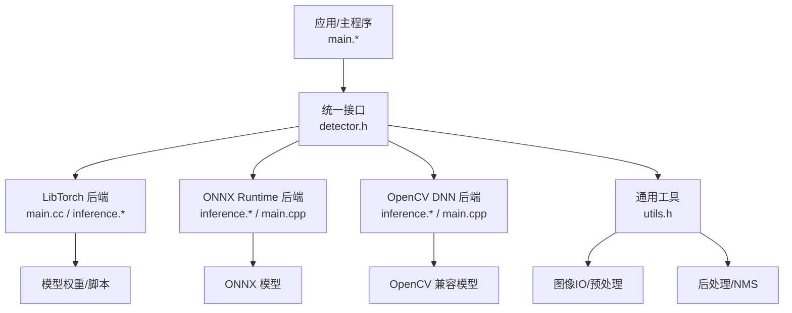
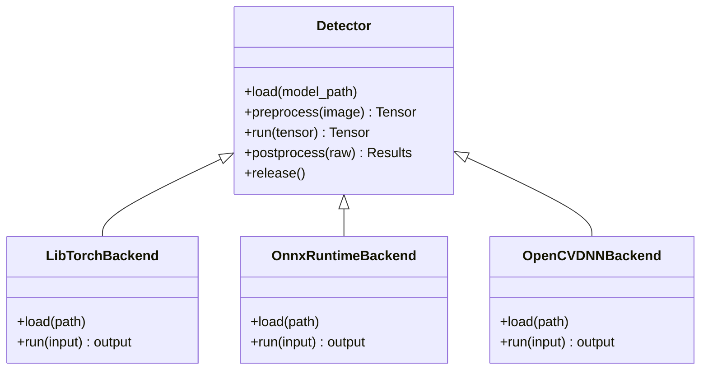
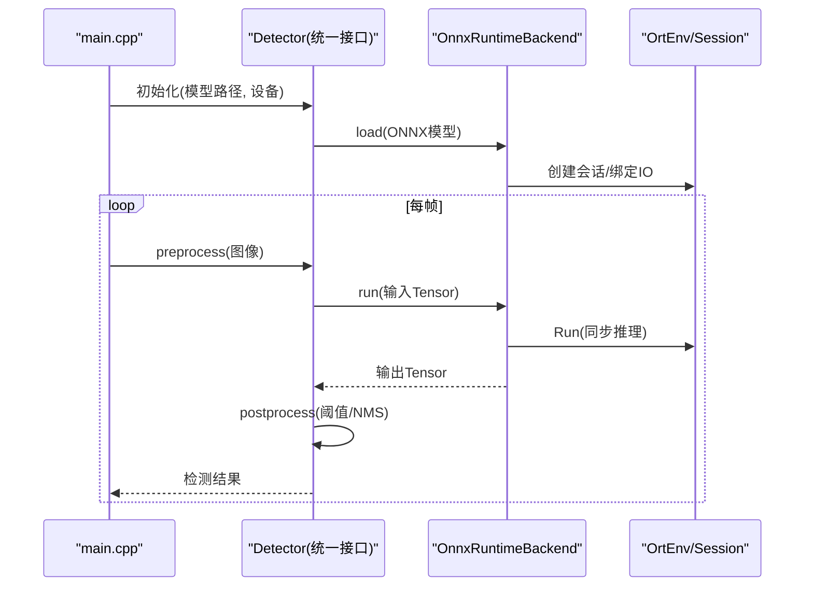
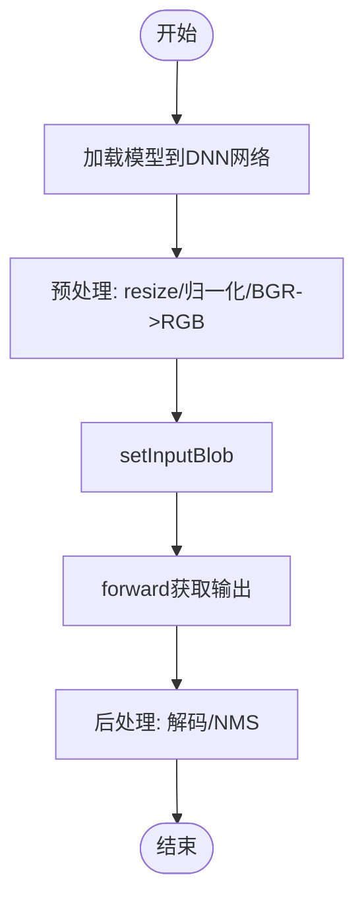
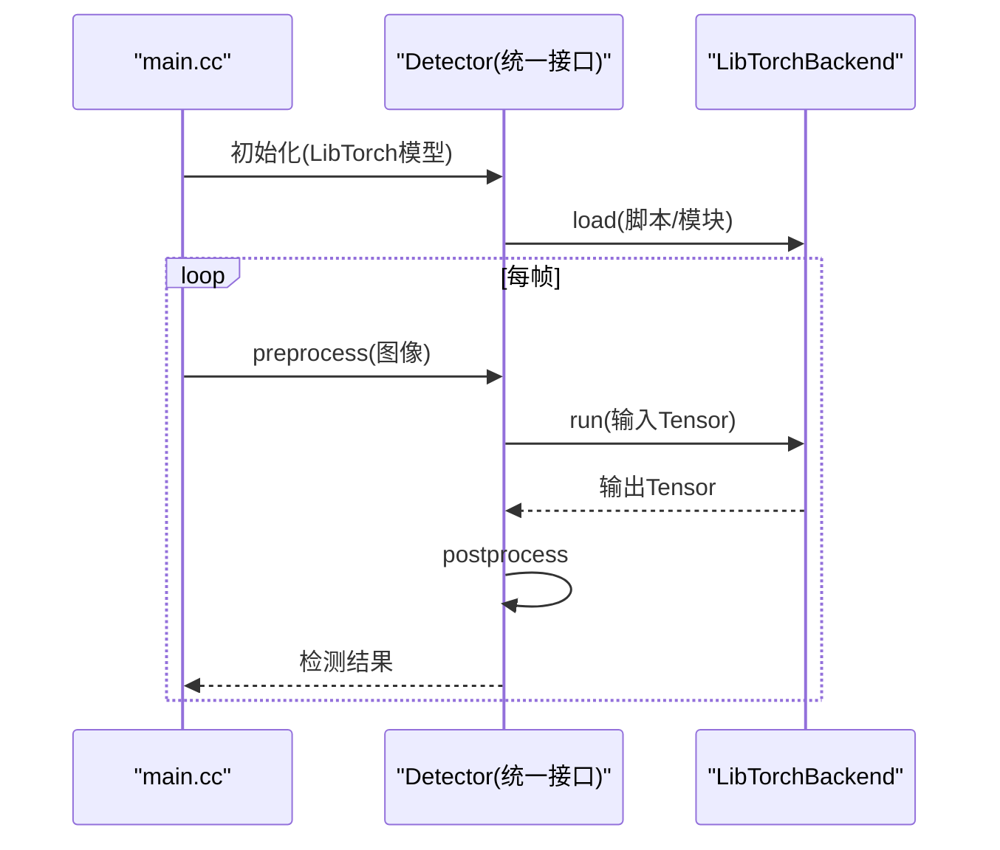

# C++高性能推理集成

<cite>
**本文引用的文件**
- [examples/cpp/README.md](file://examples/cpp/README.md)
- [examples/cpp/LibTorch/CMakeLists.txt](file://examples/cpp/LibTorch/CMakeLists.txt)
- [examples/cpp/LibTorch/main.cc](file://examples/cpp/LibTorch/main.cc)
- [examples/cpp/ONNXRuntime/CMakeLists.txt](file://examples/cpp/ONNXRuntime/CMakeLists.txt)
- [examples/cpp/ONNXRuntime/inference.cpp](file://examples/cpp/ONNXRuntime/inference.cpp)
- [examples/cpp/ONNXRuntime/inference.h](file://examples/cpp/ONNXRuntime/inference.h)
- [examples/cpp/ONNXRuntime/main.cpp](file://examples/cpp/ONNXRuntime/main.cpp)
- [examples/cpp/OpenCV-DNN/CMakeLists.txt](file://examples/cpp/OpenCV-DNN/CMakeLists.txt)
- [examples/cpp/OpenCV-DNN/inference.cpp](file://examples/cpp/OpenCV-DNN/inference.cpp)
- [examples/cpp/OpenCV-DNN/inference.h](file://examples/cpp/OpenCV-DNN/inference.h)
- [examples/cpp/OpenCV-DNN/main.cpp](file://examples/cpp/OpenCV-DNN/main.cpp)
- [examples/cpp/common/detector.h](file://examples/cpp/common/detector.h)
- [examples/cpp/common/utils.h](file://examples/cpp/common/utils.h)
- [examples/YOLOv8-CPP-Inference/CMakeLists.txt](file://examples/YOLOv8-CPP-Inference/CMakeLists.txt)
- [examples/YOLOv8-CPP-Inference/inference.h](file://examples/YOLOv8-CPP-Inference/inference.h)
- [examples/YOLOv8-CPP-Inference/inference.cpp](file://examples/YOLOv8-CPP-Inference/inference.cpp)
- [examples/YOLOv8-CPP-Inference/main.cpp](file://examples/YOLOv8-CPP-Inference/main.cpp)
- [examples/YOLOv8-LibTorch-CPP-Inference/CMakeLists.txt](file://examples/YOLOv8-LibTorch-CPP-Inference/CMakeLists.txt)
- [examples/YOLOv8-LibTorch-CPP-Inference/main.cc](file://examples/YOLOv8-LibTorch-CPP-Inference/main.cc)
- [examples/YOLO-Master-Cross-Platform-Edge-Deployment/TECHNICAL_REPORT.md](file://examples/YOLO-Master-Cross-Platform-Edge-Deployment/TECHNICAL_REPORT.md)
- [examples/YOLO-Master-Cross-Platform-Edge-Deployment/scripts/build_cpp.sh](file://examples/YOLO-Master-Cross-Platform-Edge-Deployment/scripts/build_cpp.sh)
- [examples/YOLO-Master-Cross-Platform-Edge-Deployment/mac/build_macos.sh](file://examples/YOLO-Master-Cross-Platform-Edge-Deployment/mac/build_macos.sh)
- [examples/YOLO-Master-Cross-Platform-Edge-Deployment/jetson/build_jetson.sh](file://examples/YOLO-Master-Cross-Platform-Edge-Deployment/jetson/build_jetson.sh)
- [docker/Dockerfile](file://docker/Dockerfile)
</cite>

## 目录
1. [简介](#简介)
2. [项目结构](#项目结构)
3. [核心组件](#核心组件)
4. [架构总览](#架构总览)
5. [详细组件分析](#详细组件分析)
6. [依赖与构建配置](#依赖与构建配置)
7. [性能与并发](#性能与并发)
8. [跨平台编译指南](#跨平台编译指南)
9. [容器化部署](#容器化部署)
10. [故障排查与调试](#故障排查与调试)
11. [结论](#结论)
12. [附录：示例与脚本路径](#附录示例与脚本路径)

## 简介
本文件面向在C++环境中集成YOLO-Master进行高性能推理的开发者，覆盖LibTorch、OpenCV DNN、ONNX Runtime C++ API三种后端的选择策略、工程组织、编译与依赖管理、内存与线程模型、异步处理、性能监控与调试技巧，以及生产环境部署与跨平台构建方案。文档以仓库中现有C++示例为基础，提供可复用的工程模板与最佳实践建议。

## 项目结构
仓库中与C++推理相关的代码主要集中在 examples 目录下，按后端划分，并共享通用工具模块；同时提供跨平台构建脚本与Docker镜像定义，便于在不同平台上快速搭建推理服务。

图表来源
- [examples/cpp/README.md](file://examples/cpp/README.md)
- [examples/cpp/common/detector.h](file://examples/cpp/common/detector.h)
- [examples/cpp/common/utils.h](file://examples/cpp/common/utils.h)
- [examples/cpp/LibTorch/CMakeLists.txt](file://examples/cpp/LibTorch/CMakeLists.txt)
- [examples/cpp/LibTorch/main.cc](file://examples/cpp/LibTorch/main.cc)
- [examples/cpp/ONNXRuntime/CMakeLists.txt](file://examples/cpp/ONNXRuntime/CMakeLists.txt)
- [examples/cpp/ONNXRuntime/inference.h](file://examples/cpp/ONNXRuntime/inference.h)
- [examples/cpp/ONNXRuntime/inference.cpp](file://examples/cpp/ONNXRuntime/inference.cpp)
- [examples/cpp/ONNXRuntime/main.cpp](file://examples/cpp/ONNXRuntime/main.cpp)
- [examples/cpp/OpenCV-DNN/CMakeLists.txt](file://examples/cpp/OpenCV-DNN/CMakeLists.txt)
- [examples/cpp/OpenCV-DNN/inference.h](file://examples/cpp/OpenCV-DNN/inference.h)
- [examples/cpp/OpenCV-DNN/inference.cpp](file://examples/cpp/OpenCV-DNN/inference.cpp)
- [examples/cpp/OpenCV-DNN/main.cpp](file://examples/cpp/OpenCV-DNN/main.cpp)
- [examples/YOLOv8-CPP-Inference/CMakeLists.txt](file://examples/YOLOv8-CPP-Inference/CMakeLists.txt)
- [examples/YOLOv8-CPP-Inference/inference.h](file://examples/YOLOv8-CPP-Inference/inference.h)
- [examples/YOLOv8-CPP-Inference/inference.cpp](file://examples/YOLOv8-CPP-Inference/inference.cpp)
- [examples/YOLOv8-CPP-Inference/main.cpp](file://examples/YOLOv8-CPP-Inference/main.cpp)
- [examples/YOLOv8-LibTorch-CPP-Inference/CMakeLists.txt](file://examples/YOLOv8-LibTorch-CPP-Inference/CMakeLists.txt)
- [examples/YOLOv8-LibTorch-CPP-Inference/main.cc](file://examples/YOLOv8-LibTorch-CPP-Inference/main.cc)
- [examples/YOLO-Master-Cross-Platform-Edge-Deployment/scripts/build_cpp.sh](file://examples/YOLO-Master-Cross-Platform-Edge-Deployment/scripts/build_cpp.sh)
- [examples/YOLO-Master-Cross-Platform-Edge-Deployment/mac/build_macos.sh](file://examples/YOLO-Master-Cross-Platform-Edge-Deployment/mac/build_macos.sh)
- [examples/YOLO-Master-Cross-Platform-Edge-Deployment/jetson/build_jetson.sh](file://examples/YOLO-Master-Cross-Platform-Edge-Deployment/jetson/build_jetson.sh)
- [docker/Dockerfile](file://docker/Dockerfile)

章节来源
- [examples/cpp/README.md](file://examples/cpp/README.md)

## 核心组件
- 统一检测接口（common）
  - detector.h：抽象出统一的加载、预处理、推理、后处理接口，屏蔽不同后端差异。
  - utils.h：图像IO、尺寸缩放、归一化、NMS等通用工具函数。
- 后端实现
  - LibTorch：基于torch::jit或torch::nn的推理封装，适合GPU加速与动态形状场景。
  - ONNX Runtime：通过ORT Session执行导出为ONNX的模型，具备良好跨平台性与生态支持。
  - OpenCV DNN：轻量级后端，无需额外运行时，适合CPU端快速集成。
- 入口程序
  - 各后端均提供main入口，负责参数解析、模型加载、循环推理与结果输出。

章节来源
- [examples/cpp/common/detector.h](file://examples/cpp/common/detector.h)
- [examples/cpp/common/utils.h](file://examples/cpp/common/utils.h)
- [examples/cpp/LibTorch/main.cc](file://examples/cpp/LibTorch/main.cc)
- [examples/cpp/ONNXRuntime/inference.h](file://examples/cpp/ONNXRuntime/inference.h)
- [examples/cpp/ONNXRuntime/inference.cpp](file://examples/cpp/ONNXRuntime/inference.cpp)
- [examples/cpp/ONNXRuntime/main.cpp](file://examples/cpp/ONNXRuntime/main.cpp)
- [examples/cpp/OpenCV-DNN/inference.h](file://examples/cpp/OpenCV-DNN/inference.h)
- [examples/cpp/OpenCV-DNN/inference.cpp](file://examples/cpp/OpenCV-DNN/inference.cpp)
- [examples/cpp/OpenCV-DNN/main.cpp](file://examples/cpp/OpenCV-DNN/main.cpp)

## 架构总览
下图展示了“应用层—统一接口—后端实现—数据流”的整体架构。应用侧调用统一检测接口，内部根据配置选择具体后端；数据从输入图像经预处理进入推理引擎，再通过后处理得到检测结果。

图表来源
- [examples/cpp/common/detector.h](file://examples/cpp/common/detector.h)
- [examples/cpp/common/utils.h](file://examples/cpp/common/utils.h)
- [examples/cpp/LibTorch/main.cc](file://examples/cpp/LibTorch/main.cc)
- [examples/cpp/ONNXRuntime/inference.h](file://examples/cpp/ONNXRuntime/inference.h)
- [examples/cpp/ONNXRuntime/inference.cpp](file://examples/cpp/ONNXRuntime/inference.cpp)
- [examples/cpp/ONNXRuntime/main.cpp](file://examples/cpp/ONNXRuntime/main.cpp)
- [examples/cpp/OpenCV-DNN/inference.h](file://examples/cpp/OpenCV-DNN/inference.h)
- [examples/cpp/OpenCV-DNN/inference.cpp](file://examples/cpp/OpenCV-DNN/inference.cpp)
- [examples/cpp/OpenCV-DNN/main.cpp](file://examples/cpp/OpenCV-DNN/main.cpp)

## 详细组件分析

### 统一检测接口（common）
- 设计目标
  - 将模型加载、预处理、推理、后处理解耦，对外暴露一致的API。
  - 支持多后端切换，便于基准测试与部署迁移。
- 关键职责
  - 初始化与资源管理：构造/析构、设备选择、内存池。
  - 预处理：resize、归一化、通道顺序转换、数据类型转换。
  - 推理：调用具体后端执行前向计算。
  - 后处理：置信度阈值过滤、NMS、坐标还原。
- 复杂度与优化
  - 预处理与后处理通常为O(N·H·W)，可通过SIMD/并行化优化。
  - 内存复用：预分配输入/输出缓冲区，减少频繁分配开销。

图表来源
- [examples/cpp/common/detector.h](file://examples/cpp/common/detector.h)

章节来源
- [examples/cpp/common/detector.h](file://examples/cpp/common/detector.h)
- [examples/cpp/common/utils.h](file://examples/cpp/common/utils.h)

### ONNX Runtime 后端
- 典型流程
  - 创建OrtEnv与Session，设置执行提供者（CPU/GPU）。
  - 绑定输入输出张量名与形状，准备内存缓冲。
  - 循环推理时复用会话与缓冲，避免重复初始化。
- 多线程与异步
  - 每个线程持有独立Session实例以避免状态竞争。
  - 使用InferenceSession::Run进行同步推理；如需异步，可在上层队列+线程池组合。
- 性能要点
  - 启用图优化级别、线程数、内存池大小等选项。
  - 固定输入形状以提升缓存命中与内核融合效果。

图表来源
- [examples/cpp/ONNXRuntime/inference.h](file://examples/cpp/ONNXRuntime/inference.h)
- [examples/cpp/ONNXRuntime/inference.cpp](file://examples/cpp/ONNXRuntime/inference.cpp)
- [examples/cpp/ONNXRuntime/main.cpp](file://examples/cpp/ONNXRuntime/main.cpp)

章节来源
- [examples/cpp/ONNXRuntime/inference.h](file://examples/cpp/ONNXRuntime/inference.h)
- [examples/cpp/ONNXRuntime/inference.cpp](file://examples/cpp/ONNXRuntime/inference.cpp)
- [examples/cpp/ONNXRuntime/main.cpp](file://examples/cpp/ONNXRuntime/main.cpp)

### OpenCV DNN 后端
- 特点
  - 零依赖外部推理运行时，易于打包与分发。
  - 对常见YOLO格式有较好支持，适合CPU端快速落地。
- 注意事项
  - 需确保模型格式与输入维度符合OpenCV DNN期望。
  - 针对大分辨率图像，注意内存占用与预处理开销。

图表来源
- [examples/cpp/OpenCV-DNN/inference.h](file://examples/cpp/OpenCV-DNN/inference.h)
- [examples/cpp/OpenCV-DNN/inference.cpp](file://examples/cpp/OpenCV-DNN/inference.cpp)
- [examples/cpp/OpenCV-DNN/main.cpp](file://examples/cpp/OpenCV-DNN/main.cpp)

章节来源
- [examples/cpp/OpenCV-DNN/inference.h](file://examples/cpp/OpenCV-DNN/inference.h)
- [examples/cpp/OpenCV-DNN/inference.cpp](file://examples/cpp/OpenCV-DNN/inference.cpp)
- [examples/cpp/OpenCV-DNN/main.cpp](file://examples/cpp/OpenCV-DNN/main.cpp)

### LibTorch 后端
- 特点
  - 原生PyTorch生态，支持动态形状与复杂算子。
  - 可结合CUDA/TensorRT提升性能。
- 关键点
  - 使用torch::jit::load加载脚本模型，或torch::nn::Module加载模块化模型。
  - 注意设备放置与类型一致性（如float32/int8）。
  - 批量推理时尽量使用连续内存布局。

图表来源
- [examples/cpp/LibTorch/main.cc](file://examples/cpp/LibTorch/main.cc)

章节来源
- [examples/cpp/LibTorch/main.cc](file://examples/cpp/LibTorch/main.cc)

### YOLOv8 C++ 参考实现
- 提供完整CMake工程与推理封装，可作为模板直接复用。
- 包含预处理、推理、后处理与可视化逻辑，适合快速上手。

章节来源
- [examples/YOLOv8-CPP-Inference/CMakeLists.txt](file://examples/YOLOv8-CPP-Inference/CMakeLists.txt)
- [examples/YOLOv8-CPP-Inference/inference.h](file://examples/YOLOv8-CPP-Inference/inference.h)
- [examples/YOLOv8-CPP-Inference/inference.cpp](file://examples/YOLOv8-CPP-Inference/inference.cpp)
- [examples/YOLOv8-CPP-Inference/main.cpp](file://examples/YOLOv8-CPP-Inference/main.cpp)

### YOLOv8 LibTorch C++ 参考实现
- 展示LibTorch方式加载与推理的最小可用示例。
- 适合作为LibTorch后端的入门模板。

章节来源
- [examples/YOLOv8-LibTorch-CPP-Inference/CMakeLists.txt](file://examples/YOLOv8-LibTorch-CPP-Inference/CMakeLists.txt)
- [examples/YOLOv8-LibTorch-CPP-Inference/main.cc](file://examples/YOLOv8-LibTorch-CPP-Inference/main.cc)

## 依赖与构建配置
- 构建系统
  - 使用CMake组织工程，按后端拆分子目录，便于选择性编译。
  - 各后端CMakeLists.txt中声明对应依赖库（OpenCV、ONNX Runtime、LibTorch）。
- 依赖管理建议
  - 使用包管理器（vcpkg/conan）或预编译二进制安装第三方库。
  - 固定版本与ABI，确保跨机器一致。
- 链接与路径
  - 明确指定include与lib路径，区分Debug/Release。
  - 在CI中缓存依赖下载与编译产物，缩短构建时间。

章节来源
- [examples/cpp/LibTorch/CMakeLists.txt](file://examples/cpp/LibTorch/CMakeLists.txt)
- [examples/cpp/ONNXRuntime/CMakeLists.txt](file://examples/cpp/ONNXRuntime/CMakeLists.txt)
- [examples/cpp/OpenCV-DNN/CMakeLists.txt](file://examples/cpp/OpenCV-DNN/CMakeLists.txt)
- [examples/YOLOv8-CPP-Inference/CMakeLists.txt](file://examples/YOLOv8-CPP-Inference/CMakeLists.txt)
- [examples/YOLOv8-LibTorch-CPP-Inference/CMakeLists.txt](file://examples/YOLOv8-LibTorch-CPP-Inference/CMakeLists.txt)

## 性能与并发
- 内存管理
  - 预分配输入/输出缓冲区，避免逐帧new/delete。
  - 使用对象池或内存池复用临时张量。
- 多线程推理
  - 每个工作线程持有独立模型实例或会话，避免锁竞争。
  - 采用生产者-消费者队列，解耦I/O与推理。
- 异步处理
  - 在上层引入任务队列与完成回调，实现流水线吞吐。
  - 对于ONNX Runtime，可结合批处理与固定形状进一步提升吞吐。
- 监控与调优
  - 统计端到端延迟、吞吐、CPU/GPU利用率、内存峰值。
  - 使用perf/VTune/NSys等工具定位热点。
  - 调整批大小、线程数、图优化等级与内存池容量。

[本节为通用指导，不直接分析具体文件]

## 跨平台编译指南
- Windows
  - 使用MSVC与CMake生成Visual Studio工程，配置OpenCV/ORT/LibTorch路径。
  - 注意DLL依赖与运行时环境变量。
- Linux
  - 使用GCC/Clang，推荐静态链接关键库以减少部署成本。
  - 合理设置LD_LIBRARY_PATH或使用rpath。
- macOS
  - 使用Xcode或命令行CMake，注意Homebrew安装的库路径。
- Jetson/ARM
  - 交叉编译或原生编译，适配JetPack与CUDA/cuDNN版本。
- 自动化脚本
  - 仓库提供跨平台构建脚本，用于一键构建与打包。

章节来源
- [examples/YOLO-Master-Cross-Platform-Edge-Deployment/scripts/build_cpp.sh](file://examples/YOLO-Master-Cross-Platform-Edge-Deployment/scripts/build_cpp.sh)
- [examples/YOLO-Master-Cross-Platform-Edge-Deployment/mac/build_macos.sh](file://examples/YOLO-Master-Cross-Platform-Edge-Deployment/mac/build_macos.sh)
- [examples/YOLO-Master-Cross-Platform-Edge-Deployment/jetson/build_jetson.sh](file://examples/YOLO-Master-Cross-Platform-Edge-Deployment/jetson/build_jetson.sh)
- [examples/YOLO-Master-Cross-Platform-Edge-Deployment/TECHNICAL_REPORT.md](file://examples/YOLO-Master-Cross-Platform-Edge-Deployment/TECHNICAL_REPORT.md)

## 容器化部署
- Docker镜像
  - 基于官方基础镜像，安装CMake、编译器与推理运行时依赖。
  - 将构建好的二进制与模型文件拷贝进镜像，暴露必要端口或命令。
- 最佳实践
  - 多阶段构建减小镜像体积。
  - 使用只读根文件系统与最小权限运行。
  - 健康检查与日志收集。

章节来源
- [docker/Dockerfile](file://docker/Dockerfile)

## 故障排查与调试
- 常见问题
  - 模型路径错误或格式不匹配：确认导出格式与后端要求一致。
  - 输入尺寸不一致：固定输入形状或在运行时校验。
  - 内存泄漏：检查RAII与析构释放，避免裸指针。
  - 线程安全：确保会话/模型实例不被多线程共享。
- 调试技巧
  - 打印中间张量形状与数值范围，验证预处理正确性。
  - 使用断点与日志分级，定位瓶颈与异常分支。
  - 对比Python端输出，验证C++后处理等价性。

[本节为通用指导，不直接分析具体文件]

## 结论
通过在C++工程中引入统一检测接口与多后端实现，YOLO-Master可以在不同硬件与部署环境下获得稳定且高性能的推理能力。结合合理的内存与并发设计、完善的构建与容器化方案，能够快速交付生产级服务。建议在生产环境优先评估ONNX Runtime与LibTorch后端，并在CPU受限场景下考虑OpenCV DNN以获得更轻量的依赖。

[本节为总结性内容，不直接分析具体文件]

## 附录：示例与脚本路径
- 统一接口与工具
  - [examples/cpp/common/detector.h](file://examples/cpp/common/detector.h)
  - [examples/cpp/common/utils.h](file://examples/cpp/common/utils.h)
- ONNX Runtime C++
  - [examples/cpp/ONNXRuntime/inference.h](file://examples/cpp/ONNXRuntime/inference.h)
  - [examples/cpp/ONNXRuntime/inference.cpp](file://examples/cpp/ONNXRuntime/inference.cpp)
  - [examples/cpp/ONNXRuntime/main.cpp](file://examples/cpp/ONNXRuntime/main.cpp)
  - [examples/cpp/ONNXRuntime/CMakeLists.txt](file://examples/cpp/ONNXRuntime/CMakeLists.txt)
- OpenCV DNN C++
  - [examples/cpp/OpenCV-DNN/inference.h](file://examples/cpp/OpenCV-DNN/inference.h)
  - [examples/cpp/OpenCV-DNN/inference.cpp](file://examples/cpp/OpenCV-DNN/inference.cpp)
  - [examples/cpp/OpenCV-DNN/main.cpp](file://examples/cpp/OpenCV-DNN/main.cpp)
  - [examples/cpp/OpenCV-DNN/CMakeLists.txt](file://examples/cpp/OpenCV-DNN/CMakeLists.txt)
- LibTorch C++
  - [examples/cpp/LibTorch/main.cc](file://examples/cpp/LibTorch/main.cc)
  - [examples/cpp/LibTorch/CMakeLists.txt](file://examples/cpp/LibTorch/CMakeLists.txt)
- YOLOv8 C++ 参考
  - [examples/YOLOv8-CPP-Inference/CMakeLists.txt](file://examples/YOLOv8-CPP-Inference/CMakeLists.txt)
  - [examples/YOLOv8-CPP-Inference/inference.h](file://examples/YOLOv8-CPP-Inference/inference.h)
  - [examples/YOLOv8-CPP-Inference/inference.cpp](file://examples/YOLOv8-CPP-Inference/inference.cpp)
  - [examples/YOLOv8-CPP-Inference/main.cpp](file://examples/YOLOv8-CPP-Inference/main.cpp)
- YOLOv8 LibTorch C++ 参考
  - [examples/YOLOv8-LibTorch-CPP-Inference/CMakeLists.txt](file://examples/YOLOv8-LibTorch-CPP-Inference/CMakeLists.txt)
  - [examples/YOLOv8-LibTorch-CPP-Inference/main.cc](file://examples/YOLOv8-LibTorch-CPP-Inference/main.cc)
- 跨平台构建脚本
  - [examples/YOLO-Master-Cross-Platform-Edge-Deployment/scripts/build_cpp.sh](file://examples/YOLO-Master-Cross-Platform-Edge-Deployment/scripts/build_cpp.sh)
  - [examples/YOLO-Master-Cross-Platform-Edge-Deployment/mac/build_macos.sh](file://examples/YOLO-Master-Cross-Platform-Edge-Deployment/mac/build_macos.sh)
  - [examples/YOLO-Master-Cross-Platform-Edge-Deployment/jetson/build_jetson.sh](file://examples/YOLO-Master-Cross-Platform-Edge-Deployment/jetson/build_jetson.sh)
  - [examples/YOLO-Master-Cross-Platform-Edge-Deployment/TECHNICAL_REPORT.md](file://examples/YOLO-Master-Cross-Platform-Edge-Deployment/TECHNICAL_REPORT.md)
- 容器镜像
  - [docker/Dockerfile](file://docker/Dockerfile)