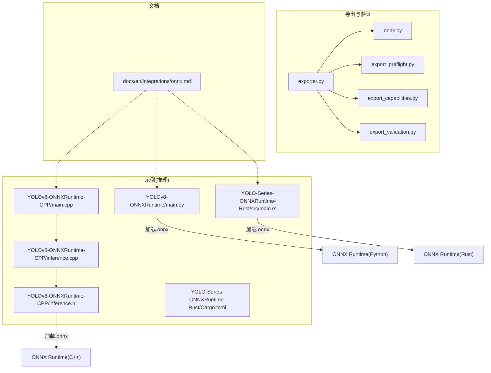
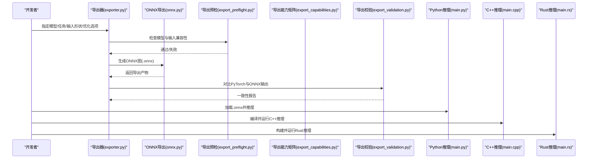
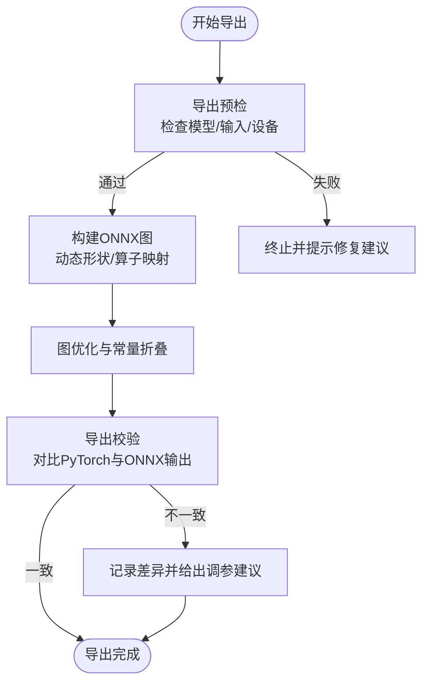
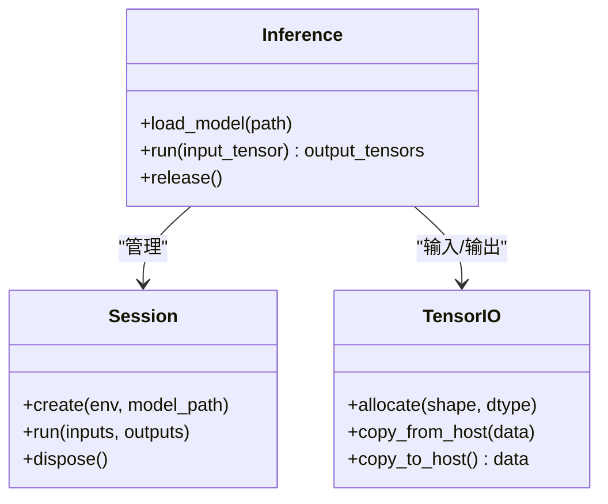
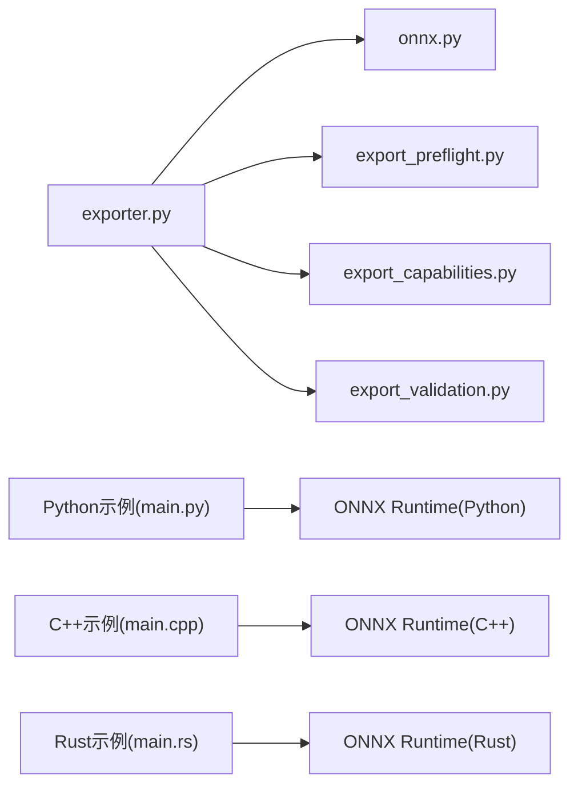

# ONNX Runtime集成

<cite>
**本文引用的文件**
- [examples/YOLOv8-ONNXRuntime/main.py](file://examples/YOLOv8-ONNXRuntime/main.py)
- [examples/YOLOv8-ONNXRuntime/README.md](file://examples/YOLOv8-ONNXRuntime/README.md)
- [examples/YOLOv8-ONNXRuntime-CPP/inference.cpp](file://examples/YOLOv8-ONNXRuntime-CPP/inference.cpp)
- [examples/YOLOv8-ONNXRuntime-CPP/inference.h](file://examples/YOLOv8-ONNXRuntime-CPP/inference.h)
- [examples/YOLOv8-ONNXRuntime-CPP/main.cpp](file://examples/YOLOv8-ONNXRuntime-CPP/main.cpp)
- [examples/YOLO-Series-ONNXRuntime-Rust/src/main.rs](file://examples/YOLO-Series-ONNXRuntime-Rust/src/main.rs)
- [examples/YOLO-Series-ONNXRuntime-Rust/Cargo.toml](file://examples/YOLO-Series-ONNXRuntime-Rust/Cargo.toml)
- [examples/YOLO-Series-ONNXRuntime-Rust/README.md](file://examples/YOLO-Series-ONNXRuntime-Rust/README.md)
- [ultralytics/engine/exporter.py](file://ultralytics/engine/exporter.py)
- [ultralytics/utils/export/__init__.py](file://ultralytics/utils/export/__init__.py)
- [ultralytics/utils/export/onnx.py](file://ultralytics/utils/export/onnx.py)
- [ultralytics/utils/export_capabilities.py](file://ultralytics/utils/export_capabilities.py)
- [ultralytics/utils/export_preflight.py](file://ultralytics/utils/export_preflight.py)
- [ultralytics/utils/export_validation.py](file://ultralytics/utils/export_validation.py)
- [tests/test_onnx_export_fix.py](file://tests/test_onnx_export_fix.py)
- [tests/test_exports.py](file://tests/test_exports.py)
- [docs/en/integrations/onnx.md](file://docs/en/integrations/onnx.md)
</cite>

## 目录
1. [简介](#简介)
2. [项目结构](#项目结构)
3. [核心组件](#核心组件)
4. [架构总览](#架构总览)
5. [详细组件分析](#详细组件分析)
6. [依赖关系分析](#依赖关系分析)
7. [性能考虑](#性能考虑)
8. [故障排查指南](#故障排查指南)
9. [结论](#结论)
10. [附录](#附录)

## 简介
本文件面向希望将YOLO-Master模型从PyTorch导出为ONNX，并在Python、C++与Rust环境中使用ONNX Runtime进行高效推理的开发者。文档覆盖：
- 模型导出流程与参数配置（动态形状、算子支持、优化选项）
- Python、C++、Rust三语言完整集成示例路径
- 批处理、内存管理与多线程推理等性能调优技巧
- 错误处理与异常恢复机制
- 生产环境部署最佳实践

## 项目结构
本项目在多个位置提供ONNX相关能力：
- 导出与验证：引擎导出器、导出预检与导出能力矩阵、导出校验脚本
- 示例代码：Python、C++、Rust三种语言的ONNX Runtime推理示例
- 文档：ONNX集成说明与用法指引

图表来源
- [ultralytics/engine/exporter.py](file://ultralytics/engine/exporter.py)
- [ultralytics/utils/export/onnx.py](file://ultralytics/utils/export/onnx.py)
- [ultralytics/utils/export_preflight.py](file://ultralytics/utils/export_preflight.py)
- [ultralytics/utils/export_capabilities.py](file://ultralytics/utils/export_capabilities.py)
- [ultralytics/utils/export_validation.py](file://ultralytics/utils/export_validation.py)
- [examples/YOLOv8-ONNXRuntime/main.py](file://examples/YOLOv8-ONNXRuntime/main.py)
- [examples/YOLOv8-ONNXRuntime-CPP/inference.h](file://examples/YOLOv8-ONNXRuntime-CPP/inference.h)
- [examples/YOLOv8-ONNXRuntime-CPP/inference.cpp](file://examples/YOLOv8-ONNXRuntime-CPP/inference.cpp)
- [examples/YOLOv8-ONNXRuntime-CPP/main.cpp](file://examples/YOLOv8-ONNXRuntime-CPP/main.cpp)
- [examples/YOLO-Series-ONNXRuntime-Rust/src/main.rs](file://examples/YOLO-Series-ONNXRuntime-Rust/src/main.rs)
- [examples/YOLO-Series-ONNXRuntime-Rust/Cargo.toml](file://examples/YOLO-Series-ONNXRuntime-Rust/Cargo.toml)
- [docs/en/integrations/onnx.md](file://docs/en/integrations/onnx.md)

章节来源
- [docs/en/integrations/onnx.md](file://docs/en/integrations/onnx.md)

## 核心组件
- 导出器与ONNX后端
  - 统一导出入口负责编排导出流程、设备选择、动态形状与优化策略
  - ONNX专用导出模块实现具体导出逻辑、算子映射与图优化
  - 导出前检查确保模型结构与输入规格满足目标运行时要求
  - 导出能力矩阵用于评估不同任务/模型对ONNX的支持度
  - 导出后校验用于对比PyTorch与ONNX输出一致性
- 推理示例
  - Python示例展示如何加载.onnx并执行推理
  - C++示例封装会话管理、张量I/O与结果解析
  - Rust示例通过绑定库调用ONNX Runtime完成推理

章节来源
- [ultralytics/engine/exporter.py](file://ultralytics/engine/exporter.py)
- [ultralytics/utils/export/onnx.py](file://ultralytics/utils/export/onnx.py)
- [ultralytics/utils/export_preflight.py](file://ultralytics/utils/export_preflight.py)
- [ultralytics/utils/export_capabilities.py](file://ultralytics/utils/export_capabilities.py)
- [ultralytics/utils/export_validation.py](file://ultralytics/utils/export_validation.py)
- [examples/YOLOv8-ONNXRuntime/main.py](file://examples/YOLOv8-ONNXRuntime/main.py)
- [examples/YOLOv8-ONNXRuntime-CPP/inference.h](file://examples/YOLOv8-ONNXRuntime-CPP/inference.h)
- [examples/YOLOv8-ONNXRuntime-CPP/inference.cpp](file://examples/YOLOv8-ONNXRuntime-CPP/inference.cpp)
- [examples/YOLOv8-ONNXRuntime-CPP/main.cpp](file://examples/YOLOv8-ONNXRuntime-CPP/main.cpp)
- [examples/YOLO-Series-ONNXRuntime-Rust/src/main.rs](file://examples/YOLO-Series-ONNXRuntime-Rust/src/main.rs)
- [examples/YOLO-Series-ONNXRuntime-Rust/Cargo.toml](file://examples/YOLO-Series-ONNXRuntime-Rust/Cargo.toml)

## 架构总览
下图展示了从训练好的PyTorch模型到ONNX Runtime推理的整体流程，包括导出、校验与多语言推理。

图表来源
- [ultralytics/engine/exporter.py](file://ultralytics/engine/exporter.py)
- [ultralytics/utils/export/onnx.py](file://ultralytics/utils/export/onnx.py)
- [ultralytics/utils/export_preflight.py](file://ultralytics/utils/export_preflight.py)
- [ultralytics/utils/export_capabilities.py](file://ultralytics/utils/export_capabilities.py)
- [ultralytics/utils/export_validation.py](file://ultralytics/utils/export_validation.py)
- [examples/YOLOv8-ONNXRuntime/main.py](file://examples/YOLOv8-ONNXRuntime/main.py)
- [examples/YOLOv8-ONNXRuntime-CPP/main.cpp](file://examples/YOLOv8-ONNXRuntime-CPP/main.cpp)
- [examples/YOLO-Series-ONNXRuntime-Rust/src/main.rs](file://examples/YOLO-Series-ONNXRuntime-Rust/src/main.rs)

## 详细组件分析

### 导出器与ONNX后端
- 职责划分
  - exporter.py：统一导出入口，协调设备、形状、优化与日志
  - onnx.py：ONNX导出实现，包含动态形状、算子映射、常量折叠与图优化
  - export_preflight.py：导出前检查，避免不兼容配置导致失败
  - export_capabilities.py：维护不同任务/模型对ONNX的支持情况
  - export_validation.py：导出后一致性校验，比较数值误差与形状
- 关键流程
  - 预检：确认模型结构、输入维度、数据类型与目标运行时兼容性
  - 导出：生成静态或动态形状的ONNX图，应用优化（如常量折叠、算子融合）
  - 校验：以相同输入对比PyTorch与ONNX输出，记录差异与警告
- 典型问题定位
  - 若导出失败，优先查看预检阶段报错与能力矩阵中是否支持该任务/模型
  - 若推理精度下降，检查导出后的校验报告与动态形状设置

图表来源
- [ultralytics/utils/export_preflight.py](file://ultralytics/utils/export_preflight.py)
- [ultralytics/utils/export/onnx.py](file://ultralytics/utils/export/onnx.py)
- [ultralytics/utils/export_validation.py](file://ultralytics/utils/export_validation.py)
- [ultralytics/utils/export_capabilities.py](file://ultralytics/utils/export_capabilities.py)

章节来源
- [ultralytics/engine/exporter.py](file://ultralytics/engine/exporter.py)
- [ultralytics/utils/export/onnx.py](file://ultralytics/utils/export/onnx.py)
- [ultralytics/utils/export_preflight.py](file://ultralytics/utils/export_preflight.py)
- [ultralytics/utils/export_capabilities.py](file://ultralytics/utils/export_capabilities.py)
- [ultralytics/utils/export_validation.py](file://ultralytics/utils/export_validation.py)

### Python集成示例
- 功能要点
  - 加载.onnx模型文件
  - 准备输入数据（尺寸、归一化、数据类型）
  - 创建ONNX Runtime会话并执行推理
  - 解析输出（边界框、类别、置信度等）
- 参考路径
  - 示例入口：[examples/YOLOv8-ONNXRuntime/main.py](file://examples/YOLOv8-ONNXRuntime/main.py)
  - 使用说明：[examples/YOLOv8-ONNXRuntime/README.md](file://examples/YOLOv8-ONNXRuntime/README.md)

章节来源
- [examples/YOLOv8-ONNXRuntime/main.py](file://examples/YOLOv8-ONNXRuntime/main.py)
- [examples/YOLOv8-ONNXRuntime/README.md](file://examples/YOLOv8-ONNXRuntime/README.md)

### C++集成示例
- 功能要点
  - 封装ONNX Runtime会话生命周期管理
  - 输入/输出张量的分配与拷贝
  - 线程安全与资源释放
- 参考路径
  - 头文件：[examples/YOLOv8-ONNXRuntime-CPP/inference.h](file://examples/YOLOv8-ONNXRuntime-CPP/inference.h)
  - 实现文件：[examples/YOLOv8-ONNXRuntime-CPP/inference.cpp](file://examples/YOLOv8-ONNXRuntime-CPP/inference.cpp)
  - 主程序：[examples/YOLOv8-ONNXRuntime-CPP/main.cpp](file://examples/YOLOv8-ONNXRuntime-CPP/main.cpp)

图表来源
- [examples/YOLOv8-ONNXRuntime-CPP/inference.h](file://examples/YOLOv8-ONNXRuntime-CPP/inference.h)
- [examples/YOLOv8-ONNXRuntime-CPP/inference.cpp](file://examples/YOLOv8-ONNXRuntime-CPP/inference.cpp)
- [examples/YOLOv8-ONNXRuntime-CPP/main.cpp](file://examples/YOLOv8-ONNXRuntime-CPP/main.cpp)

章节来源
- [examples/YOLOv8-ONNXRuntime-CPP/inference.h](file://examples/YOLOv8-ONNXRuntime-CPP/inference.h)
- [examples/YOLOv8-ONNXRuntime-CPP/inference.cpp](file://examples/YOLOv8-ONNXRuntime-CPP/inference.cpp)
- [examples/YOLOv8-ONNXRuntime-CPP/main.cpp](file://examples/YOLOv8-ONNXRuntime-CPP/main.cpp)

### Rust集成示例
- 功能要点
  - 通过绑定库调用ONNX Runtime
  - 管理模型加载、会话与张量I/O
  - 错误类型与异常恢复
- 参考路径
  - 源码：[examples/YOLO-Series-ONNXRuntime-Rust/src/main.rs](file://examples/YOLO-Series-ONNXRuntime-Rust/src/main.rs)
  - 依赖配置：[examples/YOLO-Series-ONNXRuntime-Rust/Cargo.toml](file://examples/YOLO-Series-ONNXRuntime-Rust/Cargo.toml)
  - 使用说明：[examples/YOLO-Series-ONNXRuntime-Rust/README.md](file://examples/YOLO-Series-ONNXRuntime-Rust/README.md)

章节来源
- [examples/YOLO-Series-ONNXRuntime-Rust/src/main.rs](file://examples/YOLO-Series-ONNXRuntime-Rust/src/main.rs)
- [examples/YOLO-Series-ONNXRuntime-Rust/Cargo.toml](file://examples/YOLO-Series-ONNXRuntime-Rust/Cargo.toml)
- [examples/YOLO-Series-ONNXRuntime-Rust/README.md](file://examples/YOLO-Series-ONNXRuntime-Rust/README.md)

## 依赖关系分析
- 导出链路
  - exporter.py 依赖 onnx.py、export_preflight.py、export_capabilities.py、export_validation.py
- 推理链路
  - Python/C++/Rust示例均依赖各自平台的ONNX Runtime库
- 外部依赖
  - ONNX Runtime（Python/C++/Rust绑定）
  - NumPy/OpenCV（数据处理）
  - 平台特定加速后端（可选）

图表来源
- [ultralytics/engine/exporter.py](file://ultralytics/engine/exporter.py)
- [ultralytics/utils/export/onnx.py](file://ultralytics/utils/export/onnx.py)
- [ultralytics/utils/export_preflight.py](file://ultralytics/utils/export_preflight.py)
- [ultralytics/utils/export_capabilities.py](file://ultralytics/utils/export_capabilities.py)
- [ultralytics/utils/export_validation.py](file://ultralytics/utils/export_validation.py)
- [examples/YOLOv8-ONNXRuntime/main.py](file://examples/YOLOv8-ONNXRuntime/main.py)
- [examples/YOLOv8-ONNXRuntime-CPP/main.cpp](file://examples/YOLOv8-ONNXRuntime-CPP/main.cpp)
- [examples/YOLO-Series-ONNXRuntime-Rust/src/main.rs](file://examples/YOLO-Series-ONNXRuntime-Rust/src/main.rs)

章节来源
- [ultralytics/engine/exporter.py](file://ultralytics/engine/exporter.py)
- [ultralytics/utils/export/onnx.py](file://ultralytics/utils/export/onnx.py)
- [ultralytics/utils/export_preflight.py](file://ultralytics/utils/export_preflight.py)
- [ultralytics/utils/export_capabilities.py](file://ultralytics/utils/export_capabilities.py)
- [ultralytics/utils/export_validation.py](file://ultralytics/utils/export_validation.py)
- [examples/YOLOv8-ONNXRuntime/main.py](file://examples/YOLOv8-ONNXRuntime/main.py)
- [examples/YOLOv8-ONNXRuntime-CPP/main.cpp](file://examples/YOLOv8-ONNXRuntime-CPP/main.cpp)
- [examples/YOLO-Series-ONNXRuntime-Rust/src/main.rs](file://examples/YOLO-Series-ONNXRuntime-Rust/src/main.rs)

## 性能考虑
- 批处理
  - 使用固定或分段的批量大小，减少会话创建与图编译开销
  - 注意动态形状场景下的内存峰值与缓存命中率
- 内存管理
  - 复用输入/输出缓冲区，避免频繁分配与拷贝
  - 控制中间张量生命周期，及时释放不再使用的资源
- 多线程推理
  - 每个线程持有独立会话或使用线程安全的会话池
  - 合理设置线程数，避免CPU/GPU争用导致抖动
- 图优化
  - 启用常量折叠、算子融合等优化选项（由导出器与ONNX后端提供）
  - 针对目标平台选择合适的优化级别与后端（如CPU/GPU/NPU）
- 精度与速度权衡
  - 动态形状提升灵活性但可能影响性能；静态形状可进一步提升吞吐
  - 导出校验报告用于评估精度损失是否在可接受范围

[本节为通用指导，无需列出具体文件来源]

## 故障排查指南
- 导出失败
  - 检查导出预检阶段的错误信息，确认模型结构与输入形状是否符合目标运行时要求
  - 查看导出能力矩阵，确认当前任务/模型是否被ONNX支持
- 推理精度异常
  - 使用导出校验工具对比PyTorch与ONNX输出，关注最大误差与分布差异
  - 调整导出参数（如动态形状、优化级别）并重试
- 运行时崩溃或内存泄漏
  - 确保会话与张量资源正确释放
  - 在C++/Rust中检查异常捕获与错误码处理路径
- 参考测试用例
  - ONNX导出修复与回归测试：[tests/test_onnx_export_fix.py](file://tests/test_onnx_export_fix.py)
  - 通用导出测试套件：[tests/test_exports.py](file://tests/test_exports.py)

章节来源
- [tests/test_onnx_export_fix.py](file://tests/test_onnx_export_fix.py)
- [tests/test_exports.py](file://tests/test_exports.py)

## 结论
通过将YOLO-Master模型导出为ONNX并使用ONNX Runtime在多语言环境中推理，可以在保持精度的同时显著提升部署效率。建议在生产环境中：
- 使用导出预检与能力矩阵规避不兼容配置
- 利用导出校验保障精度一致性
- 结合批处理、内存复用与多线程策略优化吞吐
- 建立完善的错误处理与监控机制，确保稳定性

[本节为总结性内容，无需列出具体文件来源]

## 附录
- 快速开始
  - Python示例与说明：[examples/YOLOv8-ONNXRuntime/README.md](file://examples/YOLOv8-ONNXRuntime/README.md)、[examples/YOLOv8-ONNXRuntime/main.py](file://examples/YOLOv8-ONNXRuntime/main.py)
  - C++示例与说明：[examples/YOLOv8-ONNXRuntime-CPP/README.md](file://examples/YOLOv8-ONNXRuntime-CPP/README.md)
  - Rust示例与说明：[examples/YOLO-Series-ONNXRuntime-Rust/README.md](file://examples/YOLO-Series-ONNXRuntime-Rust/README.md)、[examples/YOLO-Series-ONNXRuntime-Rust/Cargo.toml](file://examples/YOLO-Series-ONNXRuntime-Rust/Cargo.toml)
- 官方文档
  - ONNX集成指南：[docs/en/integrations/onnx.md](file://docs/en/integrations/onnx.md)

章节来源
- [examples/YOLOv8-ONNXRuntime/README.md](file://examples/YOLOv8-ONNXRuntime/README.md)
- [examples/YOLOv8-ONNXRuntime/main.py](file://examples/YOLOv8-ONNXRuntime/main.py)
- [examples/YOLO-Series-ONNXRuntime-Rust/README.md](file://examples/YOLO-Series-ONNXRuntime-Rust/README.md)
- [examples/YOLO-Series-ONNXRuntime-Rust/Cargo.toml](file://examples/YOLO-Series-ONNXRuntime-Rust/Cargo.toml)
- [docs/en/integrations/onnx.md](file://docs/en/integrations/onnx.md)