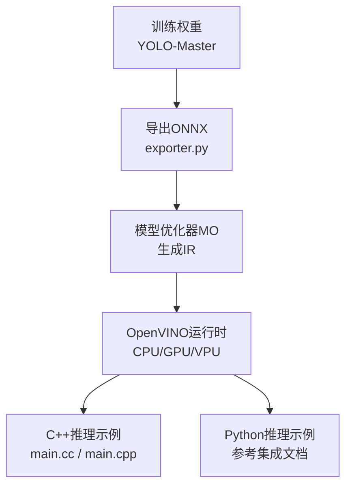
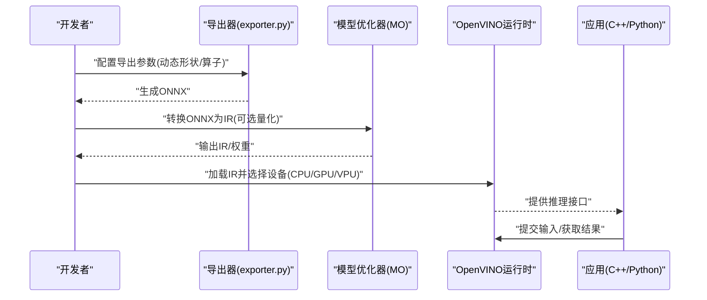
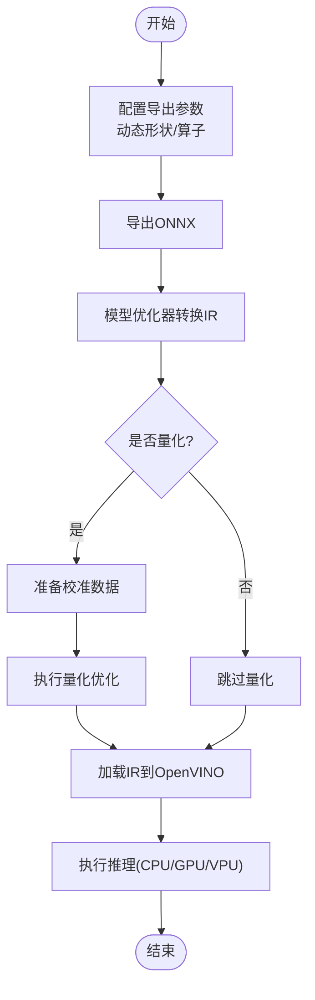
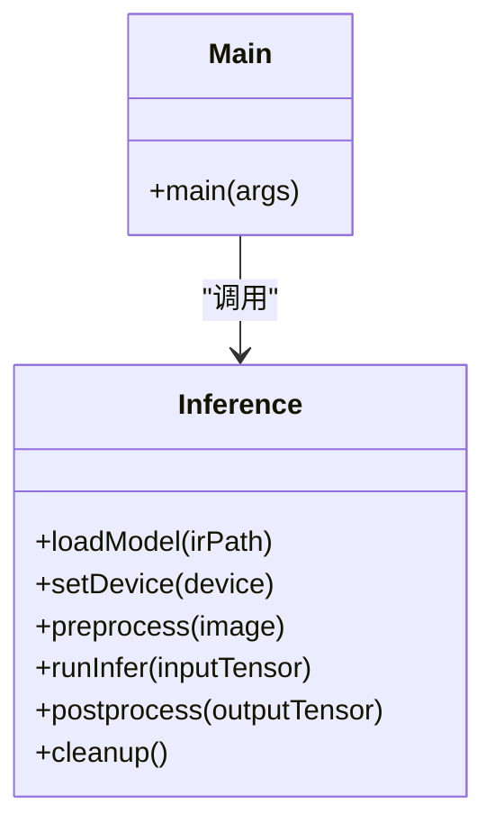
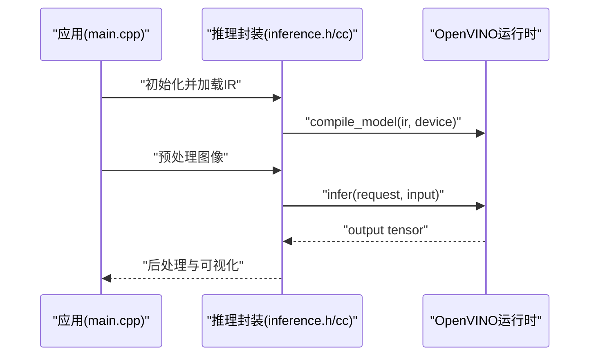
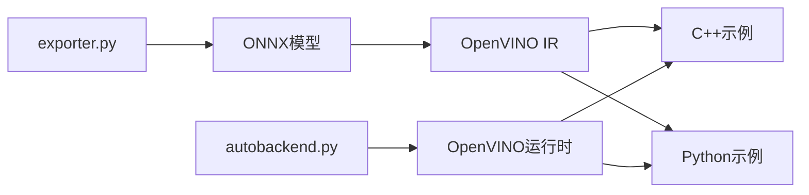

# OpenVINO集成

<cite>
**本文引用的文件**
- [openvino.md](file://docs/en/integrations/openvino.md)
- [YOLOv8-OpenVINO-CPP-Inference/main.cc](file://examples/YOLOv8-OpenVINO-CPP-Inference/main.cc)
- [YOLOv8-OpenVINO-CPP-Inference/inference.cc](file://examples/YOLOv8-OpenVINO-CPP-Inference/inference.cc)
- [YOLOv8-OpenVINO-CPP-Inference/inference.h](file://examples/YOLOv8-OpenVINO-CPP-Inference/inference.h)
- [YOLOv8-OpenVINO-CPP-Inference/CMakeLists.txt](file://examples/YOLOv8-OpenVINO-CPP-Inference/CMakeLists.txt)
- [YOLOv8-OpenVINO-CPP-Inference/README.md](file://examples/YOLOv8-OpenVINO-CPP-Inference/README.md)
- [cpp/OpenVINO/main.cpp](file://examples/cpp/OpenVINO/main.cpp)
- [cpp/OpenVINO/inference.cpp](file://examples/cpp/OpenVINO/inference.cpp)
- [cpp/OpenVINO/inference.h](file://examples/cpp/OpenVINO/inference.h)
- [cpp/OpenVINO/CMakeLists.txt](file://examples/cpp/OpenVINO/CMakeLists.txt)
- [cpp/OpenVINO/README.md](file://examples/cpp/OpenVINO/README.md)
- [exporter.py](file://ultralytics/engine/exporter.py)
- [autobackend.py](file://ultralytics/nn/autobackend.py)
- [optimizing-openvino-latency-vs-throughput-modes.md](file://docs/en/guides/optimizing-openvino-latency-vs-throughput-modes.md)
</cite>

## 目录
1. [简介](#简介)
2. [项目结构](#项目结构)
3. [核心组件](#核心组件)
4. [架构总览](#架构总览)
5. [详细组件分析](#详细组件分析)
6. [依赖关系分析](#依赖关系分析)
7. [性能考量](#性能考量)
8. [故障排查指南](#故障排查指南)
9. [结论](#结论)
10. [附录](#附录)

## 简介
本文件面向希望在YOLO-Master项目中集成Intel OpenVINO的开发者，提供从模型导出到IR、量化优化、设备适配与推理部署的全流程说明。内容涵盖：
- 将YOLO-Master模型导出为ONNX并转换为OpenVINO IR（含动态形状支持）
- 在CPU、GPU、VPU设备上运行推理的C++与Python示例路径
- 异步推理、批量处理与动态形状等优化策略
- 模型压缩与精度控制方法
- 边缘设备部署注意事项与基准测试建议

## 项目结构
仓库中与OpenVINO相关的文档与示例主要分布在以下位置：
- 集成文档：docs/en/integrations/openvino.md
- 性能指南：docs/en/guides/optimizing-openvino-latency-vs-throughput-modes.md
- C++示例（YOLOv8风格）：examples/YOLOv8-OpenVINO-CPP-Inference/*
- C++示例（通用OpenVINO）：examples/cpp/OpenVINO/*
- 导出与自动后端选择：ultralytics/engine/exporter.py, ultralytics/nn/autobackend.py

图表来源
- [exporter.py:1-200](file://ultralytics/engine/exporter.py#L1-200)
- [openvino.md:1-200](file://docs/en/integrations/openvino.md#L1-L200)

章节来源
- [openvino.md:1-200](file://docs/en/integrations/openvino.md#L1-L200)
- [optimizing-openvino-latency-vs-throughput-modes.md:1-200](file://docs/en/guides/optimizing-openvino-latency-vs-throughput-modes.md#L1-L200)

## 核心组件
- 导出器（exporter.py）：负责将PyTorch模型导出为ONNX，并提供动态输入形状、算子兼容性与导出后处理的配置入口。
- 自动后端（autobackend.py）：根据目标平台与可用库自动选择推理后端（包含OpenVINO），简化跨平台部署。
- OpenVINO集成文档（openvino.md）：提供OpenVINO安装、IR转换、设备选择与基本推理流程说明。
- 性能指南（optimizing-openvino-latency-vs-throughput-modes.md）：对比延迟优先与吞吐优先模式，给出参数调优建议。
- C++示例：
  - examples/YOLOv8-OpenVINO-CPP-Inference/*：基于YOLOv8风格的OpenVINO C++推理示例，包含构建脚本与主程序。
  - examples/cpp/OpenVINO/*：通用OpenVINO C++推理示例，展示加载IR、设置设备、执行推理的基本流程。

章节来源
- [exporter.py:1-200](file://ultralytics/engine/exporter.py#L1-L200)
- [autobackend.py:1-200](file://ultralytics/nn/autobackend.py#L1-L200)
- [openvino.md:1-200](file://docs/en/integrations/openvino.md#L1-L200)
- [YOLOv8-OpenVINO-CPP-Inference/README.md:1-200](file://examples/YOLOv8-OpenVINO-CPP-Inference/README.md#L1-L200)
- [cpp/OpenVINO/README.md:1-200](file://examples/cpp/OpenVINO/README.md#L1-L200)

## 架构总览
下图展示了从训练权重到OpenVINO IR再到多设备推理的整体流程，以及关键组件之间的交互关系。

图表来源
- [exporter.py:1-200](file://ultralytics/engine/exporter.py#L1-L200)
- [openvino.md:1-200](file://docs/en/integrations/openvino.md#L1-L200)

## 详细组件分析

### 导出与IR转换流程
- ONNX导出：通过导出器配置输入形状（静态或动态）、算子版本与导出选项，确保后续能被OpenVINO正确解析。
- IR生成：使用模型优化器将ONNX转换为OpenVINO IR（.xml/.bin），可开启量化以减小体积与提升速度。
- 设备适配：在运行时指定设备字符串（如“CPU”、“GPU”、“MYRIAD”），OpenVINO内部完成内核选择与内存布局优化。

图表来源
- [exporter.py:1-200](file://ultralytics/engine/exporter.py#L1-L200)
- [openvino.md:1-200](file://docs/en/integrations/openvino.md#L1-L200)

章节来源
- [exporter.py:1-200](file://ultralytics/engine/exporter.py#L1-L200)
- [openvino.md:1-200](file://docs/en/integrations/openvino.md#L1-L200)

### C++推理示例（YOLOv8风格）
该示例展示了如何在C++中加载OpenVINO IR、预处理图像、执行推理与后处理结果。

图表来源
- [YOLOv8-OpenVINO-CPP-Inference/inference.h:1-200](file://examples/YOLOv8-OpenVINO-CPP-Inference/inference.h#L1-L200)
- [YOLOv8-OpenVINO-CPP-Inference/inference.cc:1-200](file://examples/YOLOv8-OpenVINO-CPP-Inference/inference.cc#L1-L200)
- [YOLOv8-OpenVINO-CPP-Inference/main.cc:1-200](file://examples/YOLOv8-OpenVINO-CPP-Inference/main.cc#L1-L200)

章节来源
- [YOLOv8-OpenVINO-CPP-Inference/README.md:1-200](file://examples/YOLOv8-OpenVINO-CPP-Inference/README.md#L1-L200)
- [YOLOv8-OpenVINO-CPP-Inference/CMakeLists.txt:1-200](file://examples/YOLOv8-OpenVINO-CPP-Inference/CMakeLists.txt#L1-L200)
- [YOLOv8-OpenVINO-CPP-Inference/inference.h:1-200](file://examples/YOLOv8-OpenVINO-CPP-Inference/inference.h#L1-L200)
- [YOLOv8-OpenVINO-CPP-Inference/inference.cc:1-200](file://examples/YOLOv8-OpenVINO-CPP-Inference/inference.cc#L1-L200)
- [YOLOv8-OpenVINO-CPP-Inference/main.cc:1-200](file://examples/YOLOv8-OpenVINO-CPP-Inference/main.cc#L1-L200)

### C++推理示例（通用OpenVINO）
通用示例更贴近OpenVINO API原语，适合快速验证IR加载与设备切换。

图表来源
- [cpp/OpenVINO/main.cpp:1-200](file://examples/cpp/OpenVINO/main.cpp#L1-L200)
- [cpp/OpenVINO/inference.h:1-200](file://examples/cpp/OpenVINO/inference.h#L1-L200)
- [cpp/OpenVINO/inference.cpp:1-200](file://examples/cpp/OpenVINO/inference.cpp#L1-L200)

章节来源
- [cpp/OpenVINO/README.md:1-200](file://examples/cpp/OpenVINO/README.md#L1-L200)
- [cpp/OpenVINO/CMakeLists.txt:1-200](file://examples/cpp/OpenVINO/CMakeLists.txt#L1-L200)
- [cpp/OpenVINO/main.cpp:1-200](file://examples/cpp/OpenVINO/main.cpp#L1-L200)
- [cpp/OpenVINO/inference.h:1-200](file://examples/cpp/OpenVINO/inference.h#L1-L200)
- [cpp/OpenVINO/inference.cpp:1-200](file://examples/cpp/OpenVINO/inference.cpp#L1-L200)

### Python集成要点
- 参考集成文档中的Python示例路径与步骤，通常包括：
  - 安装OpenVINO相关包
  - 加载IR并创建编译模型
  - 设置设备（CPU/GPU/VPU）
  - 预处理输入、执行推理、后处理结果
- 如需完整代码片段，请参考文档中的示例章节与示例路径。

章节来源
- [openvino.md:1-200](file://docs/en/integrations/openvino.md#L1-L200)

## 依赖关系分析
- 导出器与自动后端：
  - exporter.py提供导出能力，autobackend.py根据环境选择合适后端（含OpenVINO）。
- 示例与运行时：
  - C++示例依赖OpenVINO C++ API；Python示例依赖OpenVINO Python API。
- 文档与指南：
  - openvino.md与性能指南为开发与调优提供权威参考。

图表来源
- [exporter.py:1-200](file://ultralytics/engine/exporter.py#L1-L200)
- [autobackend.py:1-200](file://ultralytics/nn/autobackend.py#L1-L200)
- [openvino.md:1-200](file://docs/en/integrations/openvino.md#L1-L200)

章节来源
- [exporter.py:1-200](file://ultralytics/engine/exporter.py#L1-L200)
- [autobackend.py:1-200](file://ultralytics/nn/autobackend.py#L1-L200)
- [openvino.md:1-200](file://docs/en/integrations/openvino.md#L1-L200)

## 性能考量
- 延迟优先 vs 吞吐优先：
  - 参考性能指南，针对低延迟场景与高吞吐场景分别调整批大小、线程数与缓存策略。
- 动态形状支持：
  - 在导出阶段启用动态输入维度，并在运行时按需设定具体形状，避免重复编译。
- 异步推理：
  - 使用OpenVINO异步API提高流水线并行度，减少等待时间。
- 批量处理：
  - 合理设置batch size，结合设备特性（CPU多线程、GPU共享内存）进行权衡。
- 量化优化：
  - 使用INT8量化降低模型体积与加速推理，需准备代表性校准数据集并评估精度损失。

章节来源
- [optimizing-openvino-latency-vs-throughput-modes.md:1-200](file://docs/en/guides/optimizing-openvino-latency-vs-throughput-modes.md#L1-L200)
- [openvino.md:1-200](file://docs/en/integrations/openvino.md#L1-L200)

## 故障排查指南
- 常见导入错误：
  - 检查OpenVINO版本与系统依赖是否匹配，确认IR文件完整性。
- 设备不可用：
  - 确认驱动与固件已安装（尤其是VPU），使用设备枚举命令验证可用性。
- 精度异常：
  - 复核导出时的动态形状与算子兼容性，必要时回退到静态形状或禁用特定优化。
- 性能不达预期：
  - 调整批大小、线程数与缓存策略，尝试不同优化模式（延迟/吞吐）。

章节来源
- [openvino.md:1-200](file://docs/en/integrations/openvino.md#L1-L200)
- [YOLOv8-OpenVINO-CPP-Inference/README.md:1-200](file://examples/YOLOv8-OpenVINO-CPP-Inference/README.md#L1-L200)
- [cpp/OpenVINO/README.md:1-200](file://examples/cpp/OpenVINO/README.md#L1-L200)

## 结论
通过将YOLO-Master模型导出为ONNX并转换为OpenVINO IR，可在CPU、GPU与VPU上获得高效的推理性能。结合动态形状、异步推理与批量处理，以及合理的量化与优化策略，能够在多种硬件平台上实现低延迟与高吞吐的目标。建议在实际部署前进行充分的基准测试与精度验证，并根据业务需求选择合适的优化模式。

## 附录
- 示例构建与运行：
  - C++示例均提供CMakeLists.txt与README，便于本地构建与调试。
- 参考路径：
  - 集成文档与性能指南位于docs/en/integrations与docs/en/guides目录下。
  - 导出与自动后端逻辑位于ultralytics/engine与ultralytics/nn目录。