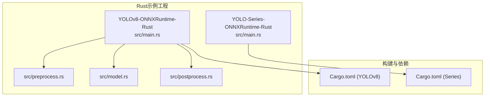
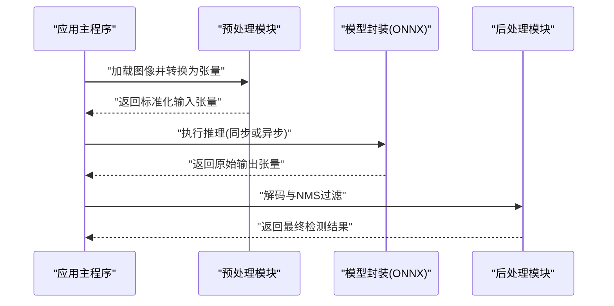
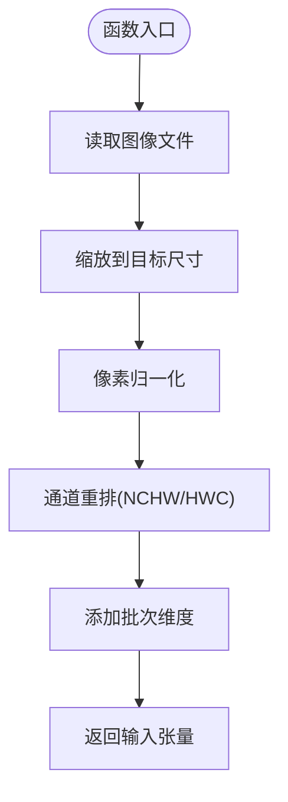
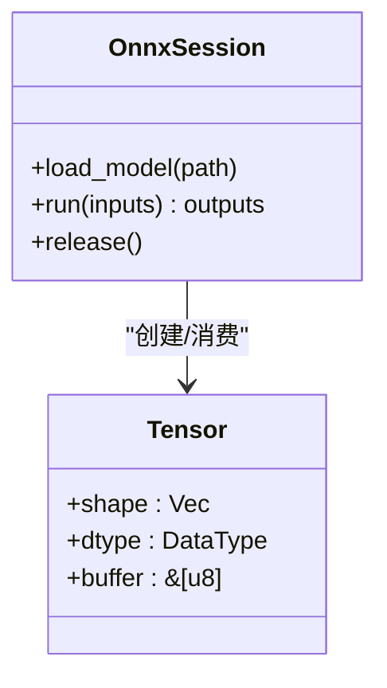
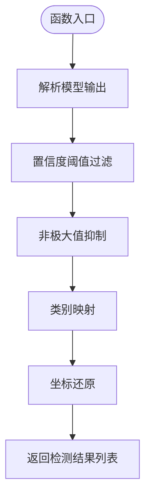
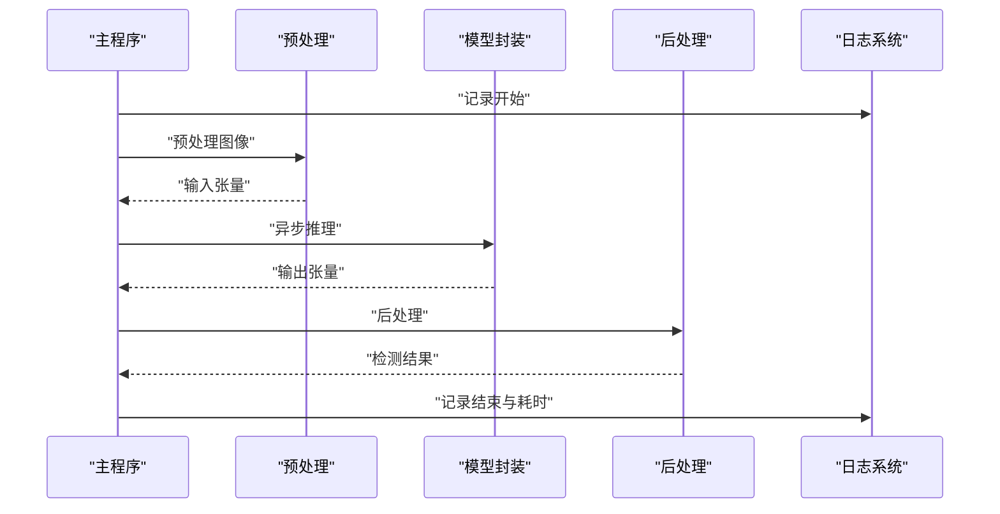
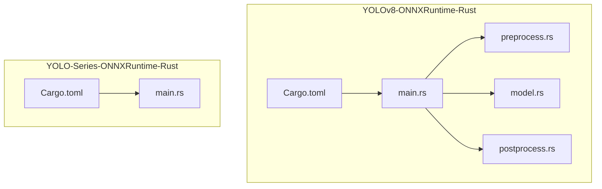

# Rust语言集成

<cite>
**本文引用的文件**
- [examples/YOLO-Series-ONNXRuntime-Rust/Cargo.toml](file://examples/YOLO-Series-ONNXRuntime-Rust/Cargo.toml)
- [examples/YOLO-Series-ONNXRuntime-Rust/src/main.rs](file://examples/YOLO-Series-ONNXRuntime-Rust/src/main.rs)
- [examples/YOLOv8-ONNXRuntime-Rust/Cargo.toml](file://examples/YOLOv8-ONNXRuntime-Rust/Cargo.toml)
- [examples/YOLOv8-ONNXRuntime-Rust/src/main.rs](file://examples/YOLOv8-ONNXRuntime-Rust/src/main.rs)
- [examples/YOLOv8-ONNXRuntime-Rust/src/preprocess.rs](file://examples/YOLOv8-ONNXRuntime-Rust/src/preprocess.rs)
- [examples/YOLOv8-ONNXRuntime-Rust/src/postprocess.rs](file://examples/YOLOv8-ONNXRuntime-Rust/src/postprocess.rs)
- [examples/YOLOv8-ONNXRuntime-Rust/src/model.rs](file://examples/YOLOv8-ONNXRuntime-Rust/src/model.rs)
- [examples/YOLOv8-ONNXRuntime-Rust/README.md](file://examples/YOLOv8-ONNXRuntime-Rust/README.md)
</cite>

## 目录
1. [简介](#简介)
2. [项目结构](#项目结构)
3. [核心组件](#核心组件)
4. [架构总览](#架构总览)
5. [详细组件分析](#详细组件分析)
6. [依赖分析](#依赖分析)
7. [性能考虑](#性能考虑)
8. [故障排查指南](#故障排查指南)
9. [结论](#结论)
10. [附录](#附录)

## 简介
本文件面向希望在Rust中集成YOLO-Master的开发者，聚焦于使用ONNX Runtime Rust绑定进行模型推理。文档涵盖类型安全的数据处理与内存管理、完整的Cargo项目配置与构建流程、异步推理、错误处理与日志记录、Rust所有权模型在深度学习推理中的应用、性能优化最佳实践、跨平台编译与部署，以及与Rust生态系统的集成方法。文中所有实现细节均基于仓库内已有的Rust示例工程（YOLOv8 ONNX Runtime Rust 与 YOLO Series ONNX Runtime Rust），并提供可追溯的文件来源与图示。

## 项目结构
仓库中与Rust集成相关的代码位于 examples 目录下，主要包含两个独立的Rust示例工程：
- YOLOv8-ONNXRuntime-Rust：提供完整的预处理、模型加载与推理、后处理流水线，适合作为端到端参考实现。
- YOLO-Series-ONNXRuntime-Rust：更通用的系列模型推理示例，便于扩展至其他YOLO变体。

图表来源
- [examples/YOLOv8-ONNXRuntime-Rust/src/main.rs](file://examples/YOLOv8-ONNXRuntime-Rust/src/main.rs)
- [examples/YOLOv8-ONNXRuntime-Rust/src/preprocess.rs](file://examples/YOLOv8-ONNXRuntime-Rust/src/preprocess.rs)
- [examples/YOLOv8-ONNXRuntime-Rust/src/model.rs](file://examples/YOLOv8-ONNXRuntime-Rust/src/model.rs)
- [examples/YOLOv8-ONNXRuntime-Rust/src/postprocess.rs](file://examples/YOLOv8-ONNXRuntime-Rust/src/postprocess.rs)
- [examples/YOLO-Series-ONNXRuntime-Rust/src/main.rs](file://examples/YOLO-Series-ONNXRuntime-Rust/src/main.rs)
- [examples/YOLOv8-ONNXRuntime-Rust/Cargo.toml](file://examples/YOLOv8-ONNXRuntime-Rust/Cargo.toml)
- [examples/YOLO-Series-ONNXRuntime-Rust/Cargo.toml](file://examples/YOLO-Series-ONNXRuntime-Rust/Cargo.toml)

章节来源
- [examples/YOLOv8-ONNXRuntime-Rust/README.md](file://examples/YOLOv8-ONNXRuntime-Rust/README.md)
- [examples/YOLOv8-ONNXRuntime-Rust/Cargo.toml](file://examples/YOLOv8-ONNXRuntime-Rust/Cargo.toml)
- [examples/YOLO-Series-ONNXRuntime-Rust/Cargo.toml](file://examples/YOLO-Series-ONNXRuntime-Rust/Cargo.toml)

## 核心组件
- 预处理模块：负责图像读取、缩放、归一化、通道重排与张量布局转换，确保输入符合ONNX模型的期望形状与数据类型。
- 模型封装：封装ONNX会话创建、输入输出张量分配、运行与资源释放，暴露统一的推理接口。
- 后处理模块：对模型原始输出进行解码、NMS过滤、置信度阈值筛选与坐标还原，生成最终检测结果。
- 主程序编排：串联预处理、推理与后处理，组织错误处理与日志记录，并演示同步/异步调用方式。

章节来源
- [examples/YOLOv8-ONNXRuntime-Rust/src/preprocess.rs](file://examples/YOLOv8-ONNXRuntime-Rust/src/preprocess.rs)
- [examples/YOLOv8-ONNXRuntime-Rust/src/model.rs](file://examples/YOLOv8-ONNXRuntime-Rust/src/model.rs)
- [examples/YOLOv8-ONNXRuntime-Rust/src/postprocess.rs](file://examples/YOLOv8-ONNXRuntime-Rust/src/postprocess.rs)
- [examples/YOLOv8-ONNXRuntime-Rust/src/main.rs](file://examples/YOLOv8-ONNXRuntime-Rust/src/main.rs)

## 架构总览
下图展示了从输入图像到检测结果的完整数据流，以及各模块之间的交互关系。

图表来源
- [examples/YOLOv8-ONNXRuntime-Rust/src/main.rs](file://examples/YOLOv8-ONNXRuntime-Rust/src/main.rs)
- [examples/YOLOv8-ONNXRuntime-Rust/src/preprocess.rs](file://examples/YOLOv8-ONNXRuntime-Rust/src/preprocess.rs)
- [examples/YOLOv8-ONNXRuntime-Rust/src/model.rs](file://examples/YOLOv8-ONNXRuntime-Rust/src/model.rs)
- [examples/YOLOv8-ONNXRuntime-Rust/src/postprocess.rs](file://examples/YOLOv8-ONNXRuntime-Rust/src/postprocess.rs)

## 详细组件分析

### 预处理模块分析
- 职责：将图像转换为模型所需的输入格式，包括尺寸调整、像素值归一化、通道顺序转换与批量维度添加。
- 类型安全：通过强类型表示图像缓冲区与张量形状，避免越界与类型不匹配。
- 内存管理：利用Rust的所有权与借用规则，确保输入缓冲区的生命周期与张量对象一致，减少拷贝与泄漏风险。
- 性能优化：尽量使用零拷贝视图与预分配缓冲区；必要时采用SIMD指令集加速图像处理。

图表来源
- [examples/YOLOv8-ONNXRuntime-Rust/src/preprocess.rs](file://examples/YOLOv8-ONNXRuntime-Rust/src/preprocess.rs)

章节来源
- [examples/YOLOv8-ONNXRuntime-Rust/src/preprocess.rs](file://examples/YOLOv8-ONNXRuntime-Rust/src/preprocess.rs)

### 模型封装分析
- 职责：封装ONNX Runtime会话初始化、输入输出张量分配、推理执行与资源清理。
- 类型安全：定义输入/输出张量的形状与数据类型，并在运行时校验，防止不兼容的模型版本。
- 内存管理：显式管理张量缓冲区与会话生命周期，遵循RAII原则，在作用域结束时自动释放资源。
- 异步推理：提供阻塞与非阻塞两种调用方式，便于在高并发场景下提升吞吐。

图表来源
- [examples/YOLOv8-ONNXRuntime-Rust/src/model.rs](file://examples/YOLOv8-ONNXRuntime-Rust/src/model.rs)

章节来源
- [examples/YOLOv8-ONNXRuntime-Rust/src/model.rs](file://examples/YOLOv8-ONNXRuntime-Rust/src/model.rs)

### 后处理模块分析
- 职责：对模型原始输出进行解码、类别映射、置信度阈值过滤与NMS去重，还原边界框坐标。
- 类型安全：严格定义输出张量的结构与字段含义，避免索引越界与语义误用。
- 内存管理：结果集合采用向量存储，按生命周期管理，避免悬垂引用。
- 性能优化：NMS算法可采用向量化实现；提前剪枝低置信度预测以减少计算量。

图表来源
- [examples/YOLOv8-ONNXRuntime-Rust/src/postprocess.rs](file://examples/YOLOv8-ONNXRuntime-Rust/src/postprocess.rs)

章节来源
- [examples/YOLOv8-ONNXRuntime-Rust/src/postprocess.rs](file://examples/YOLOv8-ONNXRuntime-Rust/src/postprocess.rs)

### 主程序编排与错误处理
- 职责：协调预处理、推理与后处理，组织错误处理与日志记录，提供CLI或API入口。
- 错误处理：统一错误类型与传播策略，区分IO错误、模型加载失败、推理异常与后处理异常。
- 日志记录：使用结构化日志库，记录关键步骤与性能指标，便于问题定位与监控。
- 异步支持：在主程序中展示如何以异步方式调用推理，结合任务队列提升吞吐。

图表来源
- [examples/YOLOv8-ONNXRuntime-Rust/src/main.rs](file://examples/YOLOv8-ONNXRuntime-Rust/src/main.rs)

章节来源
- [examples/YOLOv8-ONNXRuntime-Rust/src/main.rs](file://examples/YOLOv8-ONNXRuntime-Rust/src/main.rs)

## 依赖分析
- Cargo配置：每个示例工程均有独立的Cargo.toml，声明ONNX Runtime绑定、图像处理与日志等依赖。
- 外部依赖：ONNX Runtime提供底层推理能力；图像处理库用于读取与变换；日志库用于结构化记录。
- 版本管理：建议固定ONNX Runtime版本以确保跨平台一致性；根据目标平台选择CPU/GPU后端。

图表来源
- [examples/YOLOv8-ONNXRuntime-Rust/Cargo.toml](file://examples/YOLOv8-ONNXRuntime-Rust/Cargo.toml)
- [examples/YOLOv8-ONNXRuntime-Rust/src/main.rs](file://examples/YOLOv8-ONNXRuntime-Rust/src/main.rs)
- [examples/YOLO-Series-ONNXRuntime-Rust/Cargo.toml](file://examples/YOLO-Series-ONNXRuntime-Rust/Cargo.toml)
- [examples/YOLO-Series-ONNXRuntime-Rust/src/main.rs](file://examples/YOLO-Series-ONNXRuntime-Rust/src/main.rs)

章节来源
- [examples/YOLOv8-ONNXRuntime-Rust/Cargo.toml](file://examples/YOLOv8-ONNXRuntime-Rust/Cargo.toml)
- [examples/YOLO-Series-ONNXRuntime-Rust/Cargo.toml](file://examples/YOLO-Series-ONNXRuntime-Rust/Cargo.toml)

## 性能考虑
- 批处理：尽可能合并多帧输入以提升GPU利用率与吞吐。
- 内存复用：重用输入/输出缓冲区，避免频繁分配与释放。
- 线程池：使用工作窃取线程池并行处理多个请求，注意会话与资源的线程安全。
- 后端选择：CPU/GPU后端按需切换；在边缘设备上优先选择轻量后端。
- 数值精度：根据模型要求选择合适的浮点精度（FP32/FP16），权衡精度与速度。
- I/O优化：使用异步I/O与零拷贝路径，减少磁盘与网络延迟。

## 故障排查指南
- 模型加载失败：检查模型路径、权限与格式兼容性；确认ONNX Runtime后端已正确安装。
- 输入形状不匹配：核对预处理输出的形状与数据类型是否与模型期望一致。
- 推理超时：评估设备负载与批大小；必要时降低分辨率或启用异步模式。
- 后处理异常：验证NMS参数与置信度阈值；检查类别映射是否正确。
- 日志定位：开启详细日志，记录关键步骤的时间戳与中间状态，快速定位瓶颈与错误源。

章节来源
- [examples/YOLOv8-ONNXRuntime-Rust/src/main.rs](file://examples/YOLOv8-ONNXRuntime-Rust/src/main.rs)

## 结论
通过在Rust中使用ONNX Runtime绑定，YOLO-Master可以在类型安全、内存安全与高性能的前提下完成端到端推理。借助模块化设计（预处理、模型封装、后处理）与清晰的错误处理与日志记录，开发者可以快速集成并扩展至生产环境。同时，遵循Rust所有权模型与性能优化最佳实践，可在不同平台上获得稳定且高效的推理体验。

## 附录
- 构建与运行：参考各示例工程的README与Cargo.toml，安装必要依赖后执行cargo build与cargo run。
- 跨平台部署：针对不同操作系统与硬件后端选择合适的ONNX Runtime二进制包；在容器环境中固化依赖版本。
- 生态系统集成：可与Tokio异步运行时、actix-web服务器、serde序列化、tracing日志系统集成，构建高可用服务。