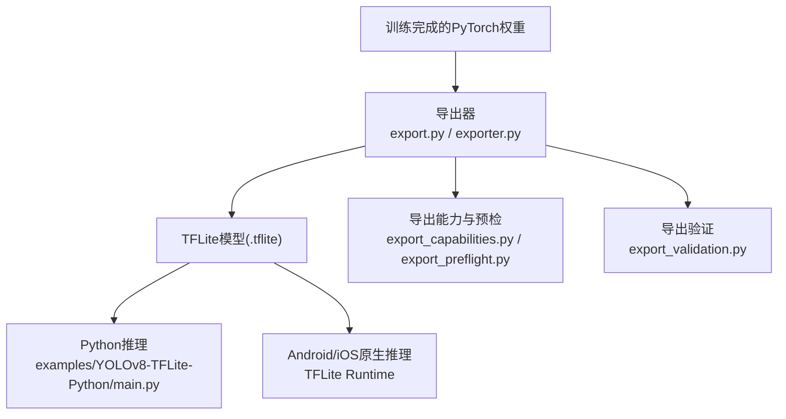
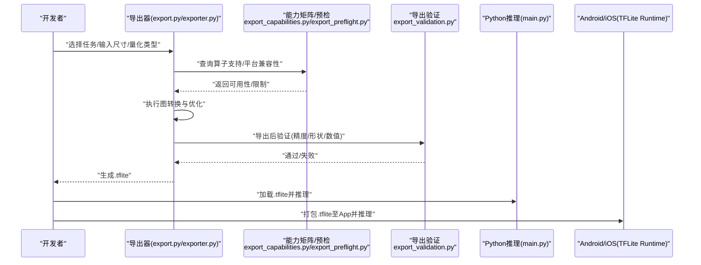
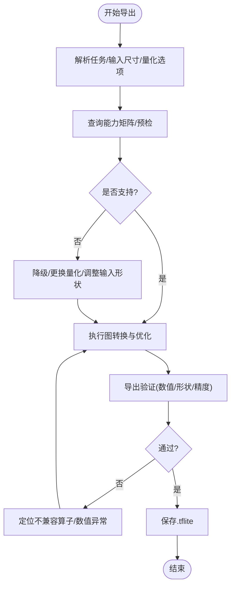
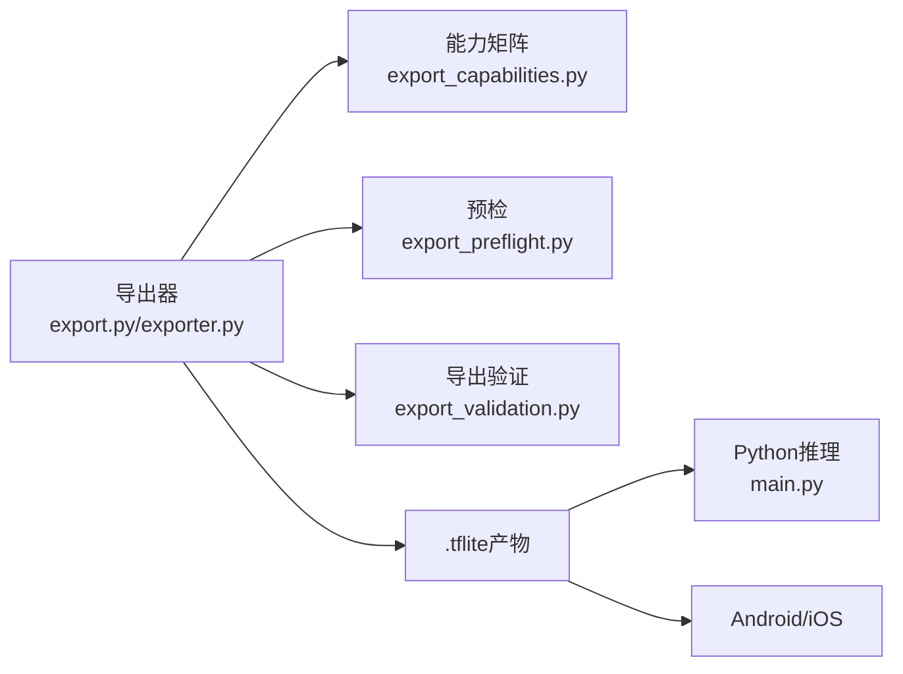

# TensorFlow Lite集成

<cite>
**本文引用的文件**
- [examples/YOLOv8-TFLite-Python/README.md](file://examples/YOLOv8-TFLite-Python/README.md)
- [examples/YOLOv8-TFLite-Python/main.py](file://examples/YOLOv8-TFLite-Python/main.py)
- [ultralytics/utils/export.py](file://ultralytics/utils/export.py)
- [ultralytics/engine/exporter.py](file://ultralytics/engine/exporter.py)
- [ultralytics/utils/export_capabilities.py](file://ultralytics/utils/export_capabilities.py)
- [ultralytics/utils/export_preflight.py](file://ultralytics/utils/export_preflight.py)
- [ultralytics/utils/export_validation.py](file://ultralytics/utils/export_validation.py)
- [docs/en/integrations/tflite.md](file://docs/en/integrations/tflite.md)
- [docs/en/integrations/litert.md](file://docs/en/integrations/litert.md)
- [examples/YOLO-Master-Cross-Platform-Edge-Deployment/TECHNICAL_REPORT.md](file://examples/YOLO-Master-Cross-Platform-Edge-Deployment/TECHNICAL_REPORT.md)
- [examples/YOLO-Master-Edge-Deployment/export_edge_models.py](file://examples/YOLO-Master-Edge-Deployment/export_edge_models.py)
- [examples/YOLO-Master-Edge-Deployment/edge_utils.py](file://examples/YOLO-Master-Edge-Deployment/edge_utils.py)
</cite>

## 目录
1. [简介](#简介)
2. [项目结构](#项目结构)
3. [核心组件](#核心组件)
4. [架构总览](#架构总览)
5. [详细组件分析](#详细组件分析)
6. [依赖关系分析](#依赖关系分析)
7. [性能与内存优化](#性能与内存优化)
8. [故障排查指南](#故障排查指南)
9. [结论](#结论)
10. [附录：示例与脚本路径](#附录示例与脚本路径)

## 简介
本文件面向在移动端和嵌入式设备上部署YOLO-Master的开发者，聚焦于将模型导出为TensorFlow Lite（TFLite）并在Python、Android/iOS原生环境中高效运行。内容涵盖：
- TFLite导出流程与量化策略（INT8、FP16）
- 算子支持与平台兼容性检查
- Python与Android/iOS原生推理集成要点
- 内存优化与性能调优（分片、缓存、线程管理）
- 跨平台部署注意事项与构建建议

## 项目结构
仓库中与TFLite相关的关键位置包括：
- 文档与集成说明：docs/en/integrations/tflite.md、docs/en/integrations/litert.md
- 导出能力矩阵与预检：ultralytics/utils/export_capabilities.py、ultralytics/utils/export_preflight.py
- 导出实现入口：ultralytics/utils/export.py、ultralytics/engine/exporter.py
- 验证与回归：ultralytics/utils/export_validation.py
- 示例与边缘部署脚本：examples/YOLOv8-TFLite-Python/*、examples/YOLO-Master-Edge-Deployment/*、examples/YOLO-Master-Cross-Platform-Edge-Deployment/*

图表来源
- [ultralytics/utils/export.py](file://ultralytics/utils/export.py)
- [ultralytics/engine/exporter.py](file://ultralytics/engine/exporter.py)
- [ultralytics/utils/export_capabilities.py](file://ultralytics/utils/export_capabilities.py)
- [ultralytics/utils/export_preflight.py](file://ultralytics/utils/export_preflight.py)
- [ultralytics/utils/export_validation.py](file://ultralytics/utils/export_validation.py)
- [examples/YOLOv8-TFLite-Python/main.py](file://examples/YOLOv8-TFLite-Python/main.py)

章节来源
- [docs/en/integrations/tflite.md](file://docs/en/integrations/tflite.md)
- [docs/en/integrations/litert.md](file://docs/en/integrations/litert.md)
- [ultralytics/utils/export.py](file://ultralytics/utils/export.py)
- [ultralytics/engine/exporter.py](file://ultralytics/engine/exporter.py)
- [ultralytics/utils/export_capabilities.py](file://ultralytics/utils/export_capabilities.py)
- [ultralytics/utils/export_preflight.py](file://ultralytics/utils/export_preflight.py)
- [ultralytics/utils/export_validation.py](file://ultralytics/utils/export_validation.py)
- [examples/YOLOv8-TFLite-Python/README.md](file://examples/YOLOv8-TFLite-Python/README.md)
- [examples/YOLOv8-TFLite-Python/main.py](file://examples/YOLOv8-TFLite-Python/main.py)

## 核心组件
- 导出器与能力矩阵
  - 负责将YOLO-Master从PyTorch导出到TFLite，并依据能力矩阵与预检规则判断目标格式是否可用。
  - 关键文件：ultralytics/utils/export.py、ultralytics/engine/exporter.py、ultralytics/utils/export_capabilities.py、ultralytics/utils/export_preflight.py
- 导出验证
  - 对导出产物进行一致性校验与数值回环测试，确保移动端推理结果稳定。
  - 关键文件：ultralytics/utils/export_validation.py
- 示例与集成
  - Python端示例：examples/YOLOv8-TFLite-Python/main.py
  - 文档参考：docs/en/integrations/tflite.md、docs/en/integrations/litert.md
- 边缘部署辅助
  - 批量导出与工具函数：examples/YOLO-Master-Edge-Deployment/export_edge_models.py、examples/YOLO-Master-Edge-Deployment/edge_utils.py
  - 跨平台技术报告：examples/YOLO-Master-Cross-Platform-Edge-Deployment/TECHNICAL_REPORT.md

章节来源
- [ultralytics/utils/export.py](file://ultralytics/utils/export.py)
- [ultralytics/engine/exporter.py](file://ultralytics/engine/exporter.py)
- [ultralytics/utils/export_capabilities.py](file://ultralytics/utils/export_capabilities.py)
- [ultralytics/utils/export_preflight.py](file://ultralytics/utils/export_preflight.py)
- [ultralytics/utils/export_validation.py](file://ultralytics/utils/export_validation.py)
- [examples/YOLOv8-TFLite-Python/main.py](file://examples/YOLOv8-TFLite-Python/main.py)
- [docs/en/integrations/tflite.md](file://docs/en/integrations/tflite.md)
- [docs/en/integrations/litert.md](file://docs/en/integrations/litert.md)
- [examples/YOLO-Master-Edge-Deployment/export_edge_models.py](file://examples/YOLO-Master-Edge-Deployment/export_edge_models.py)
- [examples/YOLO-Master-Edge-Deployment/edge_utils.py](file://examples/YOLO-Master-Edge-Deployment/edge_utils.py)
- [examples/YOLO-Master-Cross-Platform-Edge-Deployment/TECHNICAL_REPORT.md](file://examples/YOLO-Master-Cross-Platform-Edge-Deployment/TECHNICAL_REPORT.md)

## 架构总览
下图展示了从训练权重到移动端推理的整体流程，以及导出过程中的能力检查与验证环节。

图表来源
- [ultralytics/utils/export.py](file://ultralytics/utils/export.py)
- [ultralytics/engine/exporter.py](file://ultralytics/engine/exporter.py)
- [ultralytics/utils/export_capabilities.py](file://ultralytics/utils/export_capabilities.py)
- [ultralytics/utils/export_preflight.py](file://ultralytics/utils/export_preflight.py)
- [ultralytics/utils/export_validation.py](file://ultralytics/utils/export_validation.py)
- [examples/YOLOv8-TFLite-Python/main.py](file://examples/YOLOv8-TFLite-Python/main.py)

## 详细组件分析

### 导出器与能力矩阵
- 职责
  - 解析任务配置与导出参数，调用后端转换器生成TFLite。
  - 基于能力矩阵与预检逻辑，判定目标设备/运行时是否支持所选量化与算子组合。
- 关键点
  - 量化类型：INT8（含可选校准）、FP16半精度；需结合能力矩阵确认设备支持度。
  - 动态形状：部分设备不支持动态输入，需在导出前固定或采用多版本模型。
  - 算子覆盖：若存在未覆盖算子，预检会提示降级或替换方案。
- 相关文件
  - ultralytics/utils/export.py
  - ultralytics/engine/exporter.py
  - ultralytics/utils/export_capabilities.py
  - ultralytics/utils/export_preflight.py

图表来源
- [ultralytics/utils/export.py](file://ultralytics/utils/export.py)
- [ultralytics/utils/export_capabilities.py](file://ultralytics/utils/export_capabilities.py)
- [ultralytics/utils/export_preflight.py](file://ultralytics/utils/export_preflight.py)
- [ultralytics/utils/export_validation.py](file://ultralytics/utils/export_validation.py)

章节来源
- [ultralytics/utils/export.py](file://ultralytics/utils/export.py)
- [ultralytics/engine/exporter.py](file://ultralytics/engine/exporter.py)
- [ultralytics/utils/export_capabilities.py](file://ultralytics/utils/export_capabilities.py)
- [ultralytics/utils/export_preflight.py](file://ultralytics/utils/export_preflight.py)
- [ultralytics/utils/export_validation.py](file://ultralytics/utils/export_validation.py)

### 导出验证
- 职责
  - 对比原始模型与TFLite导出的输出差异，检查形状、数据类型与数值误差是否在阈值内。
- 关键点
  - 针对检测任务的NMS/后处理差异进行容差控制。
  - 提供可复现的验证用例，便于CI集成。
- 相关文件
  - ultralytics/utils/export_validation.py

章节来源
- [ultralytics/utils/export_validation.py](file://ultralytics/utils/export_validation.py)

### Python推理示例
- 职责
  - 演示如何在Python中加载.tflite并进行图像预处理、推理与后处理。
- 关键点
  - 输入尺寸应与导出时一致；注意归一化与通道顺序。
  - 根据任务类型（检测/分割/姿态等）选择合适的后处理。
- 相关文件
  - examples/YOLOv8-TFLite-Python/main.py
  - examples/YOLOv8-TFLite-Python/README.md

章节来源
- [examples/YOLOv8-TFLite-Python/main.py](file://examples/YOLOv8-TFLite-Python/main.py)
- [examples/YOLOv8-TFLite-Python/README.md](file://examples/YOLOv8-TFLite-Python/README.md)

### Android/iOS原生集成要点
- 职责
  - 在移动平台上加载.tflite，完成数据准备、推理与可视化。
- 关键点
  - 使用官方TFLite运行时库；合理设置线程数与内存池。
  - 注意图片解码与预处理在CPU/GPU/NPU上的成本权衡。
- 参考文档
  - docs/en/integrations/tflite.md
  - docs/en/integrations/litert.md

章节来源
- [docs/en/integrations/tflite.md](file://docs/en/integrations/tflite.md)
- [docs/en/integrations/litert.md](file://docs/en/integrations/litert.md)

### 边缘部署辅助与跨平台实践
- 职责
  - 提供批量导出脚本与通用工具函数，加速在不同平台间的模型适配。
- 关键点
  - 针对不同硬件（CPU/GPU/NPU）生成多版本模型（如FP16/INT8）。
  - 统一输入/输出契约，降低平台间差异带来的维护成本。
- 相关文件
  - examples/YOLO-Master-Edge-Deployment/export_edge_models.py
  - examples/YOLO-Master-Edge-Deployment/edge_utils.py
  - examples/YOLO-Master-Cross-Platform-Edge-Deployment/TECHNICAL_REPORT.md

章节来源
- [examples/YOLO-Master-Edge-Deployment/export_edge_models.py](file://examples/YOLO-Master-Edge-Deployment/export_edge_models.py)
- [examples/YOLO-Master-Edge-Deployment/edge_utils.py](file://examples/YOLO-Master-Edge-Deployment/edge_utils.py)
- [examples/YOLO-Master-Cross-Platform-Edge-Deployment/TECHNICAL_REPORT.md](file://examples/YOLO-Master-Cross-Platform-Edge-Deployment/TECHNICAL_REPORT.md)

## 依赖关系分析
- 模块耦合
  - 导出器依赖能力矩阵与预检模块，以决定导出策略与约束。
  - 导出验证独立于导出器，用于闭环质量保障。
- 外部依赖
  - TFLite运行时（Python端与移动端）
  - 图像处理与NMS等后处理库（由示例代码引入）
- 潜在风险
  - 动态形状与自定义算子在部分设备受限，需提前预检与降级。
  - INT8量化需要校准数据集，否则可能影响精度。

图表来源
- [ultralytics/utils/export.py](file://ultralytics/utils/export.py)
- [ultralytics/engine/exporter.py](file://ultralytics/engine/exporter.py)
- [ultralytics/utils/export_capabilities.py](file://ultralytics/utils/export_capabilities.py)
- [ultralytics/utils/export_preflight.py](file://ultralytics/utils/export_preflight.py)
- [ultralytics/utils/export_validation.py](file://ultralytics/utils/export_validation.py)
- [examples/YOLOv8-TFLite-Python/main.py](file://examples/YOLOv8-TFLite-Python/main.py)

章节来源
- [ultralytics/utils/export.py](file://ultralytics/utils/export.py)
- [ultralytics/engine/exporter.py](file://ultralytics/engine/exporter.py)
- [ultralytics/utils/export_capabilities.py](file://ultralytics/utils/export_capabilities.py)
- [ultralytics/utils/export_preflight.py](file://ultralytics/utils/export_preflight.py)
- [ultralytics/utils/export_validation.py](file://ultralytics/utils/export_validation.py)
- [examples/YOLOv8-TFLite-Python/main.py](file://examples/YOLOv8-TFLite-Python/main.py)

## 性能与内存优化
- 量化策略
  - FP16：在支持的设备上显著降低内存带宽与提升吞吐，精度损失通常较小。
  - INT8：进一步压缩模型体积与内存占用，需准备代表性校准集；对极端场景需评估精度。
- 输入与形状
  - 固定输入尺寸可减少运行时重分配；必要时按场景准备多尺寸模型。
- 线程与并行
  - 合理设置TFLite线程数，避免与UI/IO线程竞争；视频流可采用生产者-消费者队列。
- 内存管理
  - 复用输入/输出缓冲区，减少频繁分配；大图可分块推理（tile）以降低峰值内存。
- 缓存策略
  - 对重复帧或相似场景的结果做短时缓存；结合时间戳与置信度阈值去抖。
- 平台特性
  - 优先利用GPU/NPU加速路径；在iOS/CoreML或AndroidNNAPI上启用相应后端。
- 参考文档与实践
  - docs/en/integrations/tflite.md
  - docs/en/integrations/litert.md
  - examples/YOLO-Master-Cross-Platform-Edge-Deployment/TECHNICAL_REPORT.md

[本节为通用指导，无需特定文件引用]

## 故障排查指南
- 导出失败/算子不支持
  - 查看能力矩阵与预检日志，定位不支持的算子或形状；考虑替换算子或降级量化。
  - 参考：ultralytics/utils/export_capabilities.py、ultralytics/utils/export_preflight.py
- 精度下降
  - 检查INT8校准集的代表性与数量；对比FP16与INT8的差异；关注NMS阈值与后处理一致性。
  - 参考：ultralytics/utils/export_validation.py
- 运行时崩溃/内存不足
  - 减小输入尺寸或启用分块推理；关闭不必要的线程；检查图片解码与预处理开销。
  - 参考：examples/YOLOv8-TFLite-Python/main.py
- 平台差异
  - 不同设备的TFLite后端行为可能存在差异，建议在目标设备上复现实验并记录日志。
  - 参考：docs/en/integrations/tflite.md、docs/en/integrations/litert.md

章节来源
- [ultralytics/utils/export_capabilities.py](file://ultralytics/utils/export_capabilities.py)
- [ultralytics/utils/export_preflight.py](file://ultralytics/utils/export_preflight.py)
- [ultralytics/utils/export_validation.py](file://ultralytics/utils/export_validation.py)
- [examples/YOLOv8-TFLite-Python/main.py](file://examples/YOLOv8-TFLite-Python/main.py)
- [docs/en/integrations/tflite.md](file://docs/en/integrations/tflite.md)
- [docs/en/integrations/litert.md](file://docs/en/integrations/litert.md)

## 结论
通过将YOLO-Master导出为TFLite并结合能力矩阵与预检机制，可在多种移动端与嵌入式平台上获得稳定的推理体验。推荐优先尝试FP16以获得更好的精度-性能平衡，再在算力受限设备上评估INT8量化。配合合理的输入形状、线程与内存管理策略，以及平台特定的加速后端，可实现端到端的高效部署。

[本节为总结性内容，无需特定文件引用]

## 附录：示例与脚本路径
- Python推理示例
  - examples/YOLOv8-TFLite-Python/main.py
  - examples/YOLOv8-TFLite-Python/README.md
- 导出与验证
  - ultralytics/utils/export.py
  - ultralytics/engine/exporter.py
  - ultralytics/utils/export_capabilities.py
  - ultralytics/utils/export_preflight.py
  - ultralytics/utils/export_validation.py
- 文档与集成指南
  - docs/en/integrations/tflite.md
  - docs/en/integrations/litert.md
- 边缘部署与跨平台实践
  - examples/YOLO-Master-Edge-Deployment/export_edge_models.py
  - examples/YOLO-Master-Edge-Deployment/edge_utils.py
  - examples/YOLO-Master-Cross-Platform-Edge-Deployment/TECHNICAL_REPORT.md