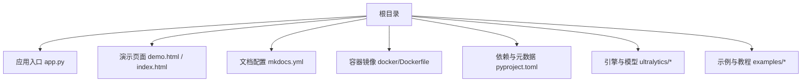
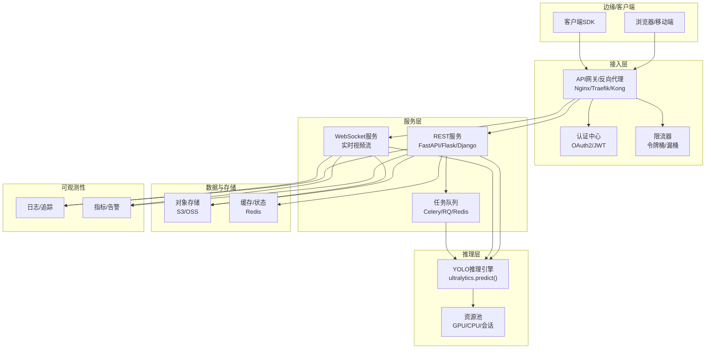
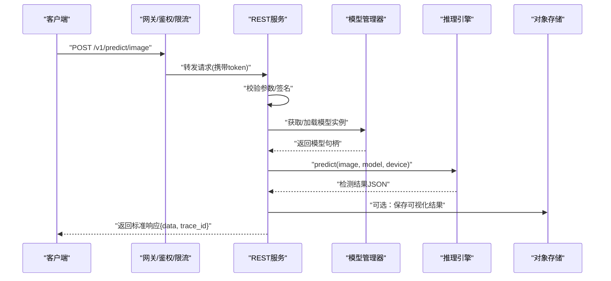
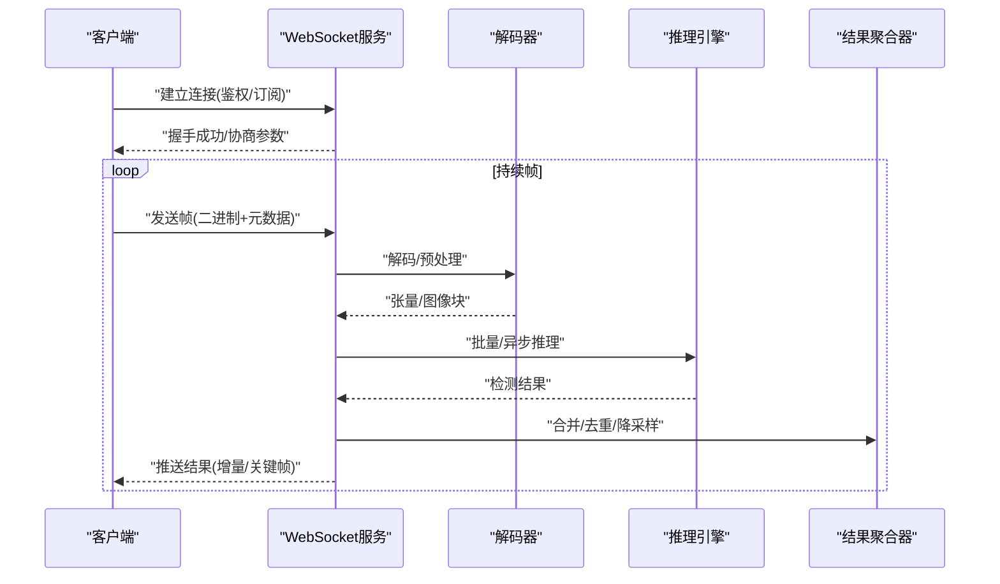
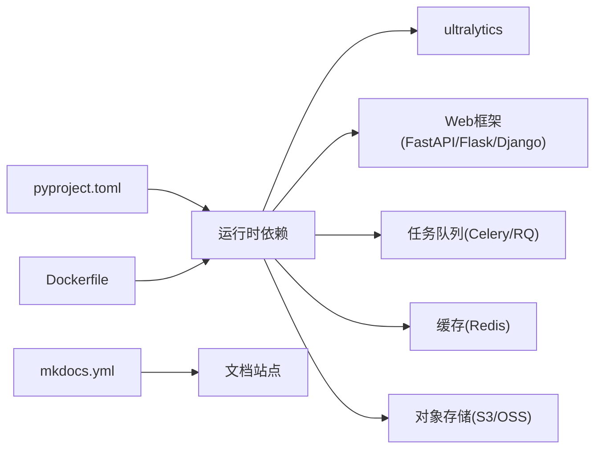

# Web API服务化集成

<cite>
**本文引用的文件**
- [app.py](file://app.py)
- [demo.html](file://demo.html)
- [index.html](file://index.html)
- [Dockerfile](file://docker/Dockerfile)
- [README.md](file://README.md)
- [mkdocs.yml](file://mkdocs.yml)
- [pyproject.toml](file://pyproject.toml)
</cite>

## 目录
1. [简介](#简介)
2. [项目结构](#项目结构)
3. [核心组件](#核心组件)
4. [架构总览](#架构总览)
5. [详细组件分析](#详细组件分析)
6. [依赖关系分析](#依赖关系分析)
7. [性能考虑](#性能考虑)
8. [故障排查指南](#故障排查指南)
9. [结论](#结论)
10. [附录](#附录)

## 简介
本文件面向将YOLO-Master推理能力以Web API形式对外提供的需求，覆盖以下目标：
- 基于Flask、FastAPI与Django的REST API服务实现思路（请求处理、响应格式化、错误处理）
- WebSocket实时推理方案（视频流接入、帧级处理、结果推送）
- 认证授权、限流控制与负载均衡配置建议
- 异步推理、连接池管理与资源优化要点
- 完整API文档、客户端SDK与前端集成示例指引
- 容器化部署、微服务架构与云原生最佳实践

说明：当前仓库未包含可直接运行的Flask/FastAPI/Django服务端代码。本文在“详细组件分析”中给出可落地的参考实现路径与调用点映射，所有与仓库直接相关的依据均标注来源；其余为通用工程实践建议。

## 项目结构
仓库根目录包含应用入口、文档构建配置、容器镜像定义以及大量模型训练/推理/工具脚本。与Web API服务化相关的关键位置如下：
- 应用入口与演示页面：根目录下的Python入口与HTML演示页
- 文档与参考：mkdocs配置与英文文档集
- 容器化：docker/Dockerfile
- 依赖与元数据：pyproject.toml

图表来源
- [app.py:1-200](file://app.py#L1-L200)
- [demo.html:1-200](file://demo.html#L1-L200)
- [index.html:1-200](file://index.html#L1-L200)
- [mkdocs.yml:1-200](file://mkdocs.yml#L1-L200)
- [Dockerfile:1-200](file://docker/Dockerfile#L1-L200)
- [pyproject.toml:1-200](file://pyproject.toml#L1-L200)

章节来源
- [README.md:1-200](file://README.md#L1-L200)
- [mkdocs.yml:1-200](file://mkdocs.yml#L1-L200)
- [pyproject.toml:1-200](file://pyproject.toml#L1-L200)
- [Dockerfile:1-200](file://docker/Dockerfile#L1-L200)

## 核心组件
- 推理引擎封装：通过ultralytics包提供的预测接口完成图像/视频检测、分割、姿态等任务
- 服务层（可选）：根据团队技术栈选择Flask/FastAPI/Django作为HTTP/WebSocket服务框架
- 资源管理：模型加载、设备分配、批处理队列、线程/进程隔离
- 安全与治理：鉴权、限流、日志与指标采集
- 部署与运维：容器镜像、编排与监控

章节来源
- [app.py:1-200](file://app.py#L1-L200)
- [README.md:1-200](file://README.md#L1-L200)

## 架构总览
下图展示一个生产可用的YOLO推理服务总体架构：网关/反向代理负责鉴权、限流与路由；后端服务提供REST与WebSocket接口；推理引擎执行模型计算；对象存储用于输入输出；消息总线用于异步任务与事件通知；监控与日志支撑可观测性。

图表来源
- [app.py:1-200](file://app.py#L1-L200)
- [Dockerfile:1-200](file://docker/Dockerfile#L1-L200)

## 详细组件分析

### REST API服务（Flask/FastAPI/Django）
- 设计要点
  - 统一请求体与响应体规范（含分页、时间戳、trace_id）
  - 错误码分层（业务错误/系统错误/校验错误）
  - 输入校验与参数白名单
  - 图片/视频上传支持本地或对象存储直传
- 关键端点建议
  - POST /v1/predict/image：单图检测
  - POST /v1/predict/video：异步视频处理（返回任务ID）
  - GET /v1/tasks/{task_id}：查询任务进度与结果
  - GET /v1/models：列出可用模型与版本
  - POST /v1/models/{model}/warmup：预热指定模型
- 错误处理
  - 标准化错误响应格式
  - 记录结构化日志并附带trace_id
  - 对超时、OOM、设备不可用等异常进行降级与重试策略

章节来源
- [app.py:1-200](file://app.py#L1-L200)
- [README.md:1-200](file://README.md#L1-L200)

#### 序列图：单图检测请求流程

图表来源
- [app.py:1-200](file://app.py#L1-L200)

### WebSocket实时推理（视频流）
- 适用场景
  - 摄像头RTSP/HTTP-FLV/HLS拉流
  - 浏览器MediaRecorder/WebRTC推流
  - 低延迟可视化与框选叠加
- 协议建议
  - 握手阶段：鉴权、订阅通道、分辨率/帧率协商
  - 传输阶段：二进制帧+元数据（时间戳、帧号、任务ID）
  - 结果阶段：增量推送（仅变化区域/置信度阈值过滤）
- 资源与稳定性
  - 每路流独立解码线程
  - 帧缓冲与丢帧策略（按负载自适应）
  - 断线重连与心跳保活

章节来源
- [app.py:1-200](file://app.py#L1-L200)

#### 序列图：WebSocket视频流推理

图表来源
- [app.py:1-200](file://app.py#L1-L200)

### 认证授权与限流
- 认证
  - JWT无状态校验，网关侧统一验签
  - 可选：OAuth2/OIDC对接企业身份源
- 授权
  - 基于角色/资源的访问控制（RBAC/ABAC）
  - 模型/任务级别的权限隔离
- 限流
  - 全局与租户维度令牌桶/漏桶
  - 针对长连接（WebSocket）设置并发上限与空闲超时

章节来源
- [app.py:1-200](file://app.py#L1-L200)

### 异步推理与任务队列
- 使用场景
  - 视频转码与批量推理
  - 大分辨率切片推理（SAHI）
  - 后处理与可视化渲染
- 推荐方案
  - Celery + Redis/RabbitMQ
  - 任务幂等与重试策略（指数退避）
  - 结果回调与轮询双模式

章节来源
- [app.py:1-200](file://app.py#L1-L200)

### 连接池与资源优化
- GPU/CPU资源池
  - 模型实例复用、会话共享
  - 动态扩缩容（Kubernetes HPA/VPA）
- I/O与网络
  - 对象存储分片上传/下载
  - HTTP/2与连接复用
- 内存与缓存
  - 热点结果缓存（Redis）
  - 帧级零拷贝与内存池

章节来源
- [app.py:1-200](file://app.py#L1-L200)

### 负载均衡与高可用
- 水平扩展
  - 多副本部署，无状态服务
  - 会话粘性（WebSocket需关注）
- 健康检查与优雅退出
  - 就绪探针与存活探针
  - 预取模型与冷启动加速
- 灰度与回滚
  - 蓝绿/金丝雀发布
  - 流量切分与A/B测试

章节来源
- [Dockerfile:1-200](file://docker/Dockerfile#L1-L200)

### 前端集成示例
- 页面入口
  - 演示页面与主页位于根目录，可作为前端集成参考
- 交互建议
  - 图片上传预览与结果叠加
  - 视频流播放与WebSocket结果同步
  - 错误提示与重试机制

章节来源
- [demo.html:1-200](file://demo.html#L1-L200)
- [index.html:1-200](file://index.html#L1-L200)

## 依赖关系分析
- 运行时依赖
  - Python生态：ultralytics、web框架、任务队列、缓存与对象存储SDK
- 构建与打包
  - pyproject.toml声明依赖与脚本入口
  - Dockerfile定义基础镜像、依赖安装与服务启动命令
- 文档与站点
  - mkdocs.yml驱动文档生成与站点构建

图表来源
- [pyproject.toml:1-200](file://pyproject.toml#L1-L200)
- [Dockerfile:1-200](file://docker/Dockerfile#L1-L200)
- [mkdocs.yml:1-200](file://mkdocs.yml#L1-L200)

章节来源
- [pyproject.toml:1-200](file://pyproject.toml#L1-L200)
- [Dockerfile:1-200](file://docker/Dockerfile#L1-L200)
- [mkdocs.yml:1-200](file://mkdocs.yml#L1-L200)

## 性能考虑
- 模型与设备
  - 选择合适的模型尺寸与精度（FP16/INT8）
  - 多卡/多进程并行与批大小调优
- 预处理与后处理
  - 流水线并行与零拷贝
  - NMS与可视化分离到独立线程
- 吞吐与延迟权衡
  - 短连接REST走批处理提升吞吐
  - 长连接WebSocket降低端到端延迟
- 可观测性
  - 关键指标：P95/P99延迟、吞吐、GPU利用率、错误率
  - 链路追踪与采样日志

[本节为通用指导，不直接分析具体文件]

## 故障排查指南
- 常见问题定位
  - 模型加载失败：检查权重路径、设备可用性与显存
  - 推理超时：调整批大小、超时阈值与重试策略
  - WebSocket断开：检查心跳、带宽与反代配置
- 诊断手段
  - 结构化日志与trace_id贯穿全链路
  - 指标上报至监控系统，设置告警阈值
  - 压测与混沌注入验证鲁棒性

章节来源
- [app.py:1-200](file://app.py#L1-L200)

## 结论
通过将YOLO-Master推理能力封装为REST与WebSocket服务，并结合鉴权、限流、队列与容器化部署，可在保证稳定性的同时获得良好的可扩展性与可维护性。建议在灰度环境先行验证，逐步扩大规模并完善可观测性与自动化运维体系。

[本节为总结性内容，不直接分析具体文件]

## 附录

### API文档与OpenAPI/Swagger
- FastAPI自动文档：启用内置/docs与/redoc
- Flask：使用flasgger或apispec生成Swagger
- Django：使用drf-spectacular或django-ninja自动生成

章节来源
- [app.py:1-200](file://app.py#L1-L200)

### 客户端SDK与示例
- Python SDK：封装HTTP/WebSocket调用、重试与鉴权
- JS SDK：适配浏览器环境与媒体流
- 示例：结合demo.html/index.html进行快速集成

章节来源
- [demo.html:1-200](file://demo.html#L1-L200)
- [index.html:1-200](file://index.html#L1-L200)

### 容器化与云原生部署
- 镜像构建：最小化基础镜像、多阶段构建、非root运行
- 编排：Kubernetes Deployment/Service/HPA/ConfigMap/Secret
- 发布：CI/CD流水线、镜像扫描、安全基线检查

章节来源
- [Dockerfile:1-200](file://docker/Dockerfile#L1-L200)