# 框架集成示例

<cite>
**本文引用的文件**
- [README.md](file://README.md)
- [pyproject.toml](file://pyproject.toml)
- [app.py](file://app.py)
- [engine/exporter.py](file://ultralytics/engine/exporter.py)
- [nn/autobackend.py](file://ultralytics/nn/autobackend.py)
- [utils/export/__init__.py](file://ultralytics/utils/export/__init__.py)
- [examples/YOLOv8-ONNXRuntime/main.py](file://examples/YOLOv8-ONNXRuntime/main.py)
- [examples/YOLOv8-OpenVINO-CPP-Inference/inference.h](file://examples/YOLOv8-OpenVINO-CPP-Inference/inference.h)
- [examples/YOLOv8-OpenVINO-CPP-Inference/inference.cc](file://examples/YOLOv8-OpenVINO-CPP-Inference/inference.cc)
- [examples/YOLOv8-TFLite-Python/main.py](file://examples/YOLOv8-TFLite-Python/main.py)
- [examples/YOLO-Series-ONNXRuntime-Rust/src/lib.rs](file://examples/YOLO-Series-ONNXRuntime-Rust/src/lib.rs)
- [examples/YOLOv8-ONNXRuntime-Rust/src/lib.rs](file://examples/YOLOv8-ONNXRuntime-Rust/src/lib.rs)
- [examples/YOLO11-Triton-CPP/inference.hpp](file://examples/YOLO11-Triton-CPP/inference.hpp)
- [examples/YOLO11-Triton-CPP/inference.cpp](file://examples/YOLO11-Triton-CPP/inference.cpp)
- [examples/YOLO11-Triton-CPP/main.cpp](file://examples/YOLO11-Triton-CPP/main.cpp)
- [examples/YOLO-Master-Cross-Platform-Edge-Deployment/cpp/main.cpp](file://examples/YOLO-Master-Cross-Platform-Edge-Deployment/cpp/main.cpp)
- [examples/YOLO-Master-Edge-Deployment/edge_utils.py](file://examples/YOLO-Master-Edge-Deployment/edge_utils.py)
- [examples/YOLO-Master-Edge-Deployment/export_edge_models.py](file://examples/YOLO-Master-Edge-Deployment/export_edge_models.py)
- [examples/YOLOv8-ONNXRuntime-CPP/inference.h](file://examples/YOLOv8-ONNXRuntime-CPP/inference.h)
- [examples/YOLOv8-ONNXRuntime-CPP/inference.cpp](file://examples/YOLOv8-ONNXRuntime-CPP/inference.cpp)
- [examples/YOLOv8-ONNXRuntime-CPP/main.cpp](file://examples/YOLOv8-ONNXRuntime-CPP/main.cpp)
- [examples/YOLOv8-LibTorch-CPP-Inference/main.cc](file://examples/YOLOv8-LibTorch-CPP-Inference/main.cc)
- [examples/YOLOv8-MNN-CPP/main.cpp](file://examples/YOLOv8-MNN-CPP/main.cpp)
- [examples/YOLOv8-OpenCV-ONNX-Python/main.py](file://examples/YOLOv8-OpenCV-ONNX-Python/main.py)
- [examples/YOLOv8-SAHI-Inference-Video/yolov8_sahi.py](file://examples/YOLOv8-SAHI-Inference-Video/yolov8_sahi.py)
- [examples/YOLOv8-Segmentation-ONNXRuntime-Python/main.py](file://examples/YOLOv8-Segmentation-ONNXRuntime-Python/main.py)
- [examples/YOLO-Axelera-Python/yolo11-seg.py](file://examples/YOLO-Axelera-Python/yolo11-seg.py)
- [examples/YOLO-Master-EsMoE-VisDrone-Edge/python/infer.py](file://examples/YOLO-Master-EsMoE-VisDrone-Edge/python/infer.py)
- [examples/YOLO-Master-EsMoE-VisDrone-Edge/scripts/run_export.sh](file://examples/YOLO-Master-EsMoE-VisDrone-Edge/scripts/run_export.sh)
- [examples/YOLO-Master-EsMoE-VisDrone-Edge/configs/esmoe.yaml](file://examples/YOLO-Master-EsMoE-VisDrone-Edge/configs/esmoe.yaml)
- [examples/YOLOv8-Region-Counter/yolov8_region_counter.py](file://examples/YOLOv8-Region-Counter/yolov8_region_counter.py)
- [examples/object_counting.ipynb](file://examples/object_counting.ipynb)
- [examples/tutorial.ipynb](file://examples/tutorial.ipynb)
- [benchmarks/suite.py](file://benchmarks/suite.py)
- [benchmarks/run.py](file://benchmarks/run.py)
- [scripts/smoke_test_coco2017.py](file://scripts/smoke_test_coco2017.py)
- [tests/test_autobackend_warmup.py](file://tests/test_autobackend_warmup.py)
- [tests/test_integrations.py](file://tests/test_integrations.py)
</cite>

## 目录
1. [简介](#简介)
2. [项目结构](#项目结构)
3. [核心组件](#核心组件)
4. [架构总览](#架构总览)
5. [详细组件分析](#详细组件分析)
6. [依赖关系分析](#依赖关系分析)
7. [性能考虑](#性能考虑)
8. [故障排查指南](#故障排查指南)
9. [结论](#结论)
10. [附录](#附录)

## 简介
本文件面向生产环境，提供YOLO-Master与主流推理引擎（ONNX Runtime、OpenVINO、TensorFlow Lite）以及高性能语言（C++、Rust）的完整集成指南。内容覆盖模型导出与转换、部署配置、异步推理、批量处理、连接池管理、Web服务化（Flask/FastAPI/Django）与gRPC微服务方案，并给出可直接复用的示例路径与最佳实践。

## 项目结构
仓库采用“核心库 + 示例 + 文档”的组织方式：
- 核心库位于 ultralytics/ 下，包含导出器、自动后端选择、工具集等
- 示例位于 examples/ 下，按引擎/语言/任务分类，便于快速上手
- 文档位于 docs/ 下，涵盖各引擎集成与部署实践
- 基准与测试位于 benchmarks/ 与 tests/ 下，用于验证与回归

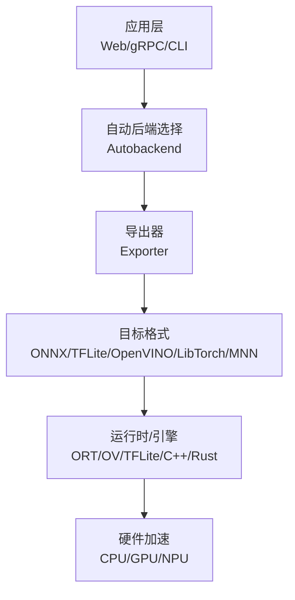

图表来源
- [engine/exporter.py:1-200](file://ultralytics/engine/exporter.py#L1-200)
- [nn/autobackend.py:1-200](file://ultralytics/nn/autobackend.py#L1-200)

章节来源
- [README.md:1-120](file://README.md#L1-L120)
- [pyproject.toml:1-120](file://pyproject.toml#L1-L120)

## 核心组件
- 导出器（Exporter）：统一封装从PyTorch到多格式的导出流程，支持动态形状、优化选项与校验。
- 自动后端（Autobackend）：根据可用环境与模型格式选择最优运行时，屏蔽底层差异。
- 工具与脚本：提供边缘端导出、验证、基准与端到端示例。

章节来源
- [engine/exporter.py:1-200](file://ultralytics/engine/exporter.py#L1-L200)
- [nn/autobackend.py:1-200](file://ultralytics/nn/autobackend.py#L1-L200)
- [utils/export/__init__.py:1-120](file://ultralytics/utils/export/__init__.py#L1-L120)

## 架构总览
下图展示从训练权重到多引擎部署的整体链路，包括导出、运行时加载与服务化。

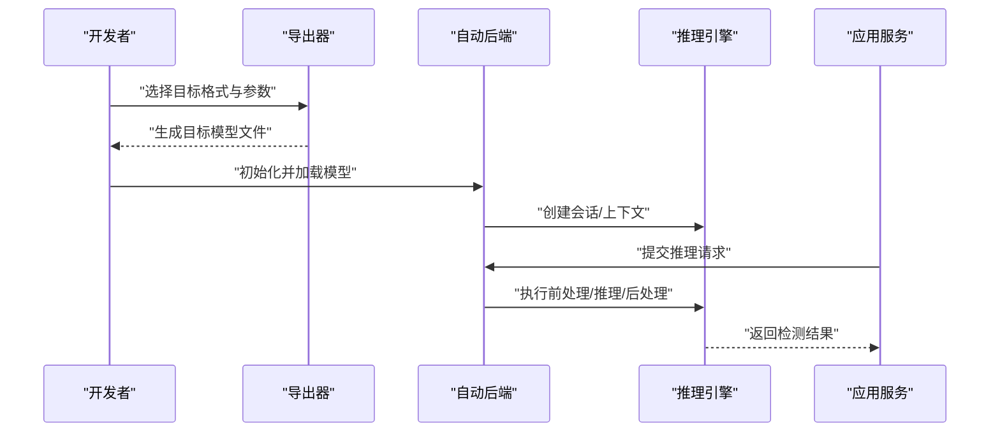

图表来源
- [engine/exporter.py:1-200](file://ultralytics/engine/exporter.py#L1-L200)
- [nn/autobackend.py:1-200](file://ultralytics/nn/autobackend.py#L1-L200)

## 详细组件分析

### ONNX Runtime 集成（Python/C++/Rust）
- Python示例：提供图像预处理、模型加载、推理与可视化全流程。
- C++示例：基于ONNX Runtime C API实现零拷贝输入输出与线程安全调用。
- Rust示例：通过绑定或原生接口调用ONNX Runtime，适合高并发场景。

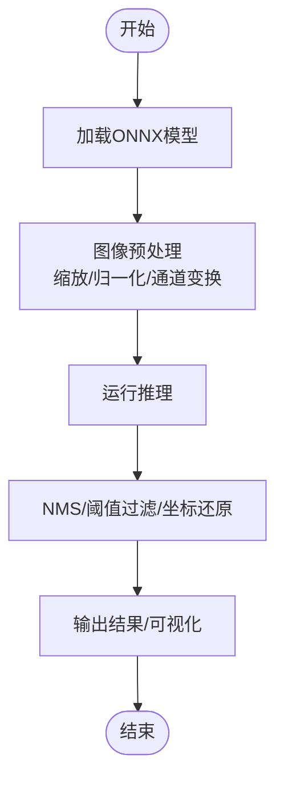

图表来源
- [examples/YOLOv8-ONNXRuntime/main.py:1-200](file://examples/YOLOv8-ONNXRuntime/main.py#L1-L200)
- [examples/YOLOv8-ONNXRuntime-CPP/inference.h:1-120](file://examples/YOLOv8-ONNXRuntime-CPP/inference.h#L1-L120)
- [examples/YOLOv8-ONNXRuntime-CPP/inference.cpp:1-200](file://examples/YOLOv8-ONNXRuntime-CPP/inference.cpp#L1-L200)
- [examples/YOLO-Series-ONNXRuntime-Rust/src/lib.rs:1-200](file://examples/YOLO-Series-ONNXRuntime-Rust/src/lib.rs#L1-L200)
- [examples/YOLOv8-ONNXRuntime-Rust/src/lib.rs:1-200](file://examples/YOLOv8-ONNXRuntime-Rust/src/lib.rs#L1-L200)

章节来源
- [examples/YOLOv8-ONNXRuntime/main.py:1-200](file://examples/YOLOv8-ONNXRuntime/main.py#L1-L200)
- [examples/YOLOv8-ONNXRuntime-CPP/inference.h:1-120](file://examples/YOLOv8-ONNXRuntime-CPP/inference.h#L1-L120)
- [examples/YOLOv8-ONNXRuntime-CPP/inference.cpp:1-200](file://examples/YOLOv8-ONNXRuntime-CPP/inference.cpp#L1-L200)
- [examples/YOLO-Series-ONNXRuntime-Rust/src/lib.rs:1-200](file://examples/YOLO-Series-ONNXRuntime-Rust/src/lib.rs#L1-L200)
- [examples/YOLOv8-ONNXRuntime-Rust/src/lib.rs:1-200](file://examples/YOLOv8-ONNXRuntime-Rust/src/lib.rs#L1-L200)

### OpenVINO 集成（C++/Python）
- C++示例：使用OpenVINO C++ API进行模型加载、编译与推理，支持多线程与设备选择。
- Python示例：结合OpenVINO Python API完成端到端检测流程。

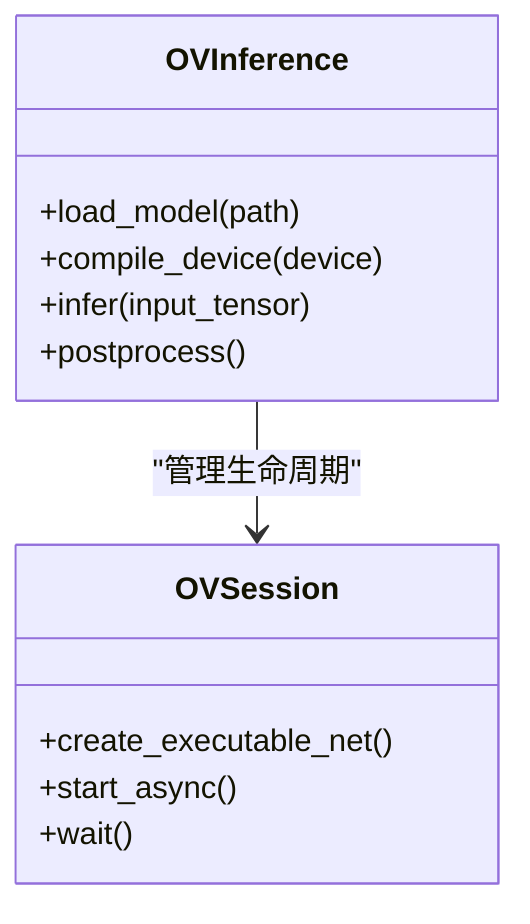

图表来源
- [examples/YOLOv8-OpenVINO-CPP-Inference/inference.h:1-120](file://examples/YOLOv8-OpenVINO-CPP-Inference/inference.h#L1-L120)
- [examples/YOLOv8-OpenVINO-CPP-Inference/inference.cc:1-200](file://examples/YOLOv8-OpenVINO-CPP-Inference/inference.cc#L1-L200)

章节来源
- [examples/YOLOv8-OpenVINO-CPP-Inference/inference.h:1-120](file://examples/YOLOv8-OpenVINO-CPP-Inference/inference.h#L1-L120)
- [examples/YOLOv8-OpenVINO-CPP-Inference/inference.cc:1-200](file://examples/YOLOv8-OpenVINO-CPP-Inference/inference.cc#L1-L200)

### TensorFlow Lite 集成（Python）
- Python示例：将模型导出为TFLite并使用Interpreter进行推理，适合移动端与嵌入式部署。

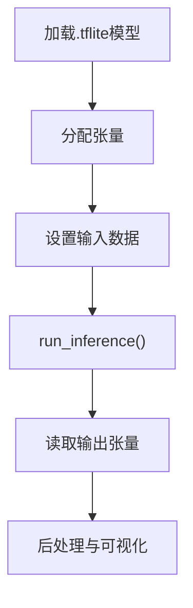

图表来源
- [examples/YOLOv8-TFLite-Python/main.py:1-200](file://examples/YOLOv8-TFLite-Python/main.py#L1-L200)

章节来源
- [examples/YOLOv8-TFLite-Python/main.py:1-200](file://examples/YOLOv8-TFLite-Python/main.py#L1-L200)

### Triton Inference Server 集成（C++客户端）
- C++客户端示例：通过gRPC/HTTP与Triton交互，支持批处理与异步调用。

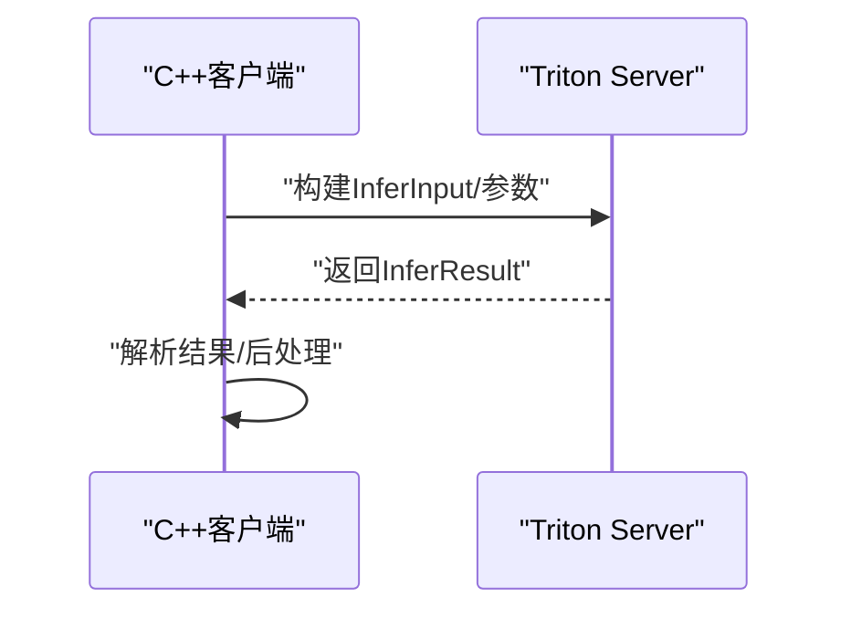

图表来源
- [examples/YOLO11-Triton-CPP/inference.hpp:1-120](file://examples/YOLO11-Triton-CPP/inference.hpp#L1-L120)
- [examples/YOLO11-Triton-CPP/inference.cpp:1-200](file://examples/YOLO11-Triton-CPP/inference.cpp#L1-L200)
- [examples/YOLO11-Triton-CPP/main.cpp:1-120](file://examples/YOLO11-Triton-CPP/main.cpp#L1-L120)

章节来源
- [examples/YOLO11-Triton-CPP/inference.hpp:1-120](file://examples/YOLO11-Triton-CPP/inference.hpp#L1-L120)
- [examples/YOLO11-Triton-CPP/inference.cpp:1-200](file://examples/YOLO11-Triton-CPP/inference.cpp#L1-L200)
- [examples/YOLO11-Triton-CPP/main.cpp:1-120](file://examples/YOLO11-Triton-CPP/main.cpp#L1-L120)

### 跨平台边缘部署（C++/Python）
- 跨平台示例：提供C++主程序与Python辅助脚本，适配多种边缘设备。
- 边缘工具：导出边缘模型、验证输出一致性、自动化脚本。

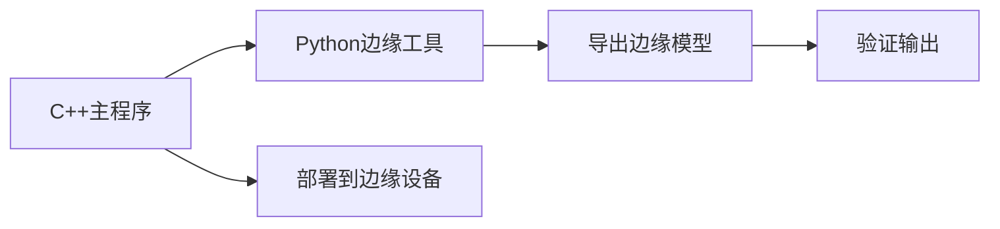

图表来源
- [examples/YOLO-Master-Cross-Platform-Edge-Deployment/cpp/main.cpp:1-200](file://examples/YOLO-Master-Cross-Platform-Edge-Deployment/cpp/main.cpp#L1-L200)
- [examples/YOLO-Master-Edge-Deployment/edge_utils.py:1-200](file://examples/YOLO-Master-Edge-Deployment/edge_utils.py#L1-L200)
- [examples/YOLO-Master-Edge-Deployment/export_edge_models.py:1-200](file://examples/YOLO-Master-Edge-Deployment/export_edge_models.py#L1-L200)

章节来源
- [examples/YOLO-Master-Cross-Platform-Edge-Deployment/cpp/main.cpp:1-200](file://examples/YOLO-Master-Cross-Platform-Edge-Deployment/cpp/main.cpp#L1-L200)
- [examples/YOLO-Master-Edge-Deployment/edge_utils.py:1-200](file://examples/YOLO-Master-Edge-Deployment/edge_utils.py#L1-L200)
- [examples/YOLO-Master-Edge-Deployment/export_edge_models.py:1-200](file://examples/YOLO-Master-Edge-Deployment/export_edge_models.py#L1-L200)

### Web 服务化（REST API）
- Flask/FastAPI/Django：可将YOLO推理封装为REST服务，支持图片上传、JSON结果返回与错误码规范。
- 建议模式：单例模型加载 + 线程池/进程池 + 限流与超时控制。

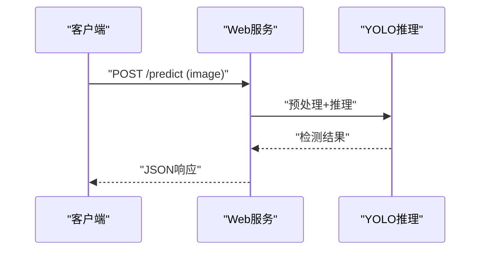

[此图为概念性流程图，不直接映射具体源码文件]

### gRPC 微服务架构
- 定义.proto接口，服务端实现推理逻辑，客户端以gRPC调用，支持双向流与批处理。
- 可结合连接池、重试与熔断策略提升稳定性。

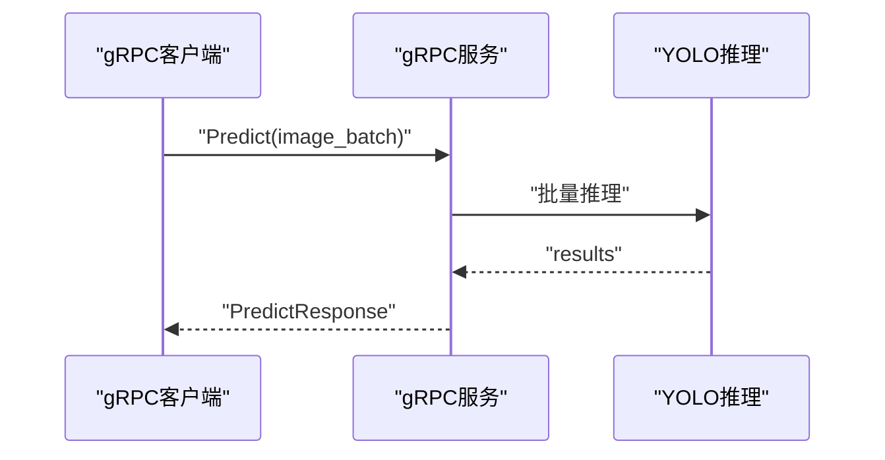

[此图为概念性流程图，不直接映射具体源码文件]

### 高级特性：异步推理、批量处理与连接池
- 异步推理：在C++/Rust中利用引擎提供的异步API，避免阻塞；在Python中使用asyncio与线程池。
- 批量处理：合并小批次请求，提高吞吐；注意内存峰值与延迟权衡。
- 连接池：对Triton/远程服务建立持久连接，减少握手开销。

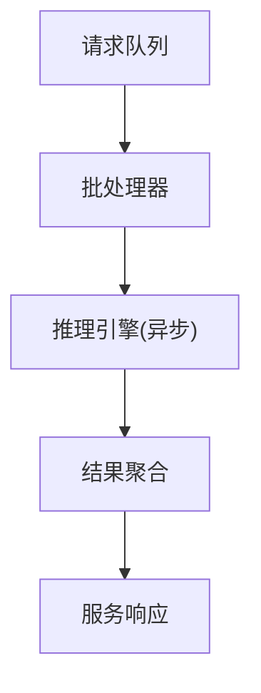

[此图为概念性流程图，不直接映射具体源码文件]

## 依赖关系分析
- 导出器与自动后端是核心耦合点：导出器负责生成多格式模型，自动后端负责运行时选择与加载。
- 示例工程依赖各自引擎的SDK与头文件，需确保版本一致与环境正确。

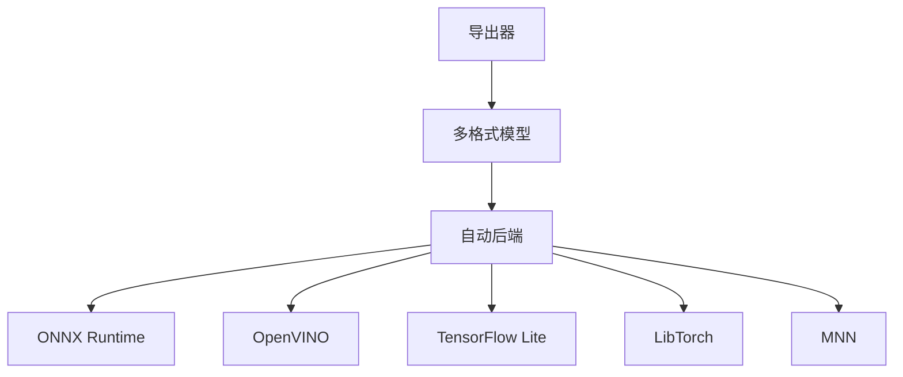

图表来源
- [engine/exporter.py:1-200](file://ultralytics/engine/exporter.py#L1-L200)
- [nn/autobackend.py:1-200](file://ultralytics/nn/autobackend.py#L1-L200)

章节来源
- [engine/exporter.py:1-200](file://ultralytics/engine/exporter.py#L1-L200)
- [nn/autobackend.py:1-200](file://ultralytics/nn/autobackend.py#L1-L200)

## 性能考虑
- 模型优化：启用INT8/FP16量化、算子融合、静态形状（如适用）。
- 运行时调优：合理设置线程数、内存池大小、设备亲和性。
- 流水线并行：前后处理与推理重叠，降低端到端延迟。
- 监控与基准：使用内置基准套件与自定义指标持续评估。

章节来源
- [benchmarks/suite.py:1-200](file://benchmarks/suite.py#L1-L200)
- [benchmarks/run.py:1-200](file://benchmarks/run.py#L1-L200)

## 故障排查指南
- 常见问题：模型格式不匹配、动态形状未配置、设备不可用、依赖缺失。
- 诊断步骤：检查导出日志、验证模型元信息、最小化复现用例、对比参考输出。
- 回归测试：使用端到端脚本与单元测试保障变更质量。

章节来源
- [scripts/smoke_test_coco2017.py:1-200](file://scripts/smoke_test_coco2017.py#L1-L200)
- [tests/test_autobackend_warmup.py:1-200](file://tests/test_autobackend_warmup.py#L1-L200)
- [tests/test_integrations.py:1-200](file://tests/test_integrations.py#L1-L200)

## 结论
通过统一的导出器与自动后端，YOLO-Master能够高效对接多种推理引擎与高性能语言。结合示例工程与最佳实践，可在生产环境中实现低延迟、高吞吐、易维护的视觉推理服务。

## 附录
- 更多示例与教程：
  - [examples/YOLOv8-OpenCV-ONNX-Python/main.py](file://examples/YOLOv8-OpenCV-ONNX-Python/main.py)
  - [examples/YOLOv8-SAHI-Inference-Video/yolov8_sahi.py](file://examples/YOLOv8-SAHI-Inference-Video/yolov8_sahi.py)
  - [examples/YOLOv8-Segmentation-ONNXRuntime-Python/main.py](file://examples/YOLOv8-Segmentation-ONNXRuntime-Python/main.py)
  - [examples/YOLO-Axelera-Python/yolo11-seg.py](file://examples/YOLO-Axelera-Python/yolo11-seg.py)
  - [examples/YOLO-Master-EsMoE-VisDrone-Edge/python/infer.py](file://examples/YOLO-Master-EsMoE-VisDrone-Edge/python/infer.py)
  - [examples/YOLO-Master-EsMoE-VisDrone-Edge/scripts/run_export.sh](file://examples/YOLO-Master-EsMoE-VisDrone-Edge/scripts/run_export.sh)
  - [examples/YOLO-Master-EsMoE-VisDrone-Edge/configs/esmoe.yaml](file://examples/YOLO-Master-EsMoE-VisDrone-Edge/configs/esmoe.yaml)
  - [examples/YOLOv8-Region-Counter/yolov8_region_counter.py](file://examples/YOLOv8-Region-Counter/yolov8_region_counter.py)
  - [examples/object_counting.ipynb](file://examples/object_counting.ipynb)
  - [examples/tutorial.ipynb](file://examples/tutorial.ipynb)
- 其他后端示例：
  - [examples/YOLOv8-LibTorch-CPP-Inference/main.cc](file://examples/YOLOv8-LibTorch-CPP-Inference/main.cc)
  - [examples/YOLOv8-MNN-CPP/main.cpp](file://examples/YOLOv8-MNN-CPP/main.cpp)