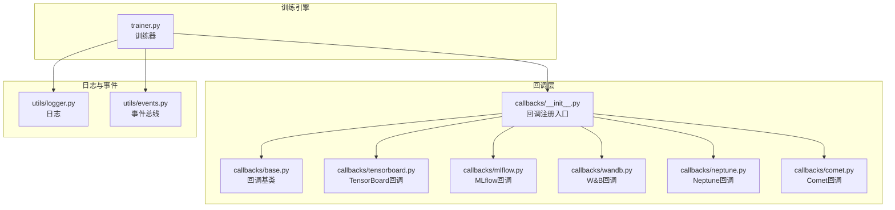
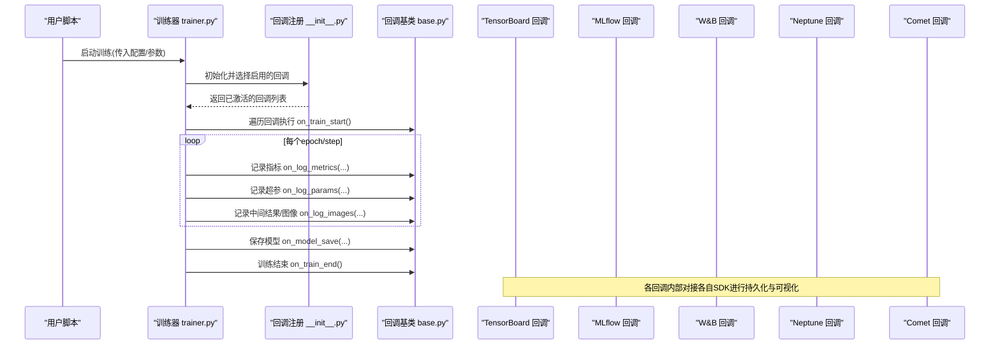
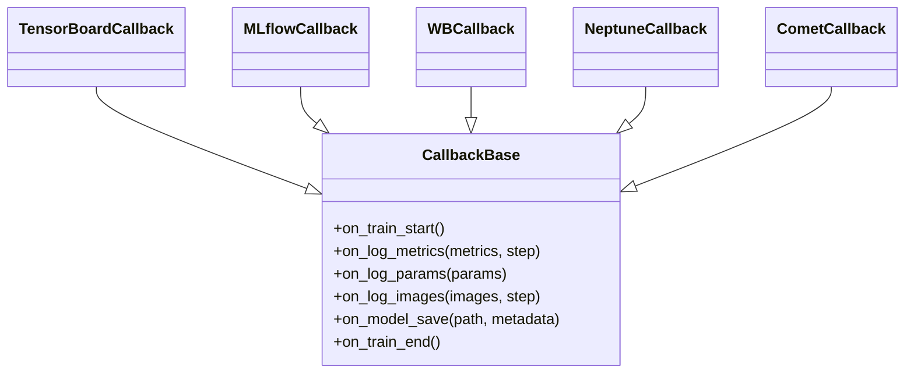
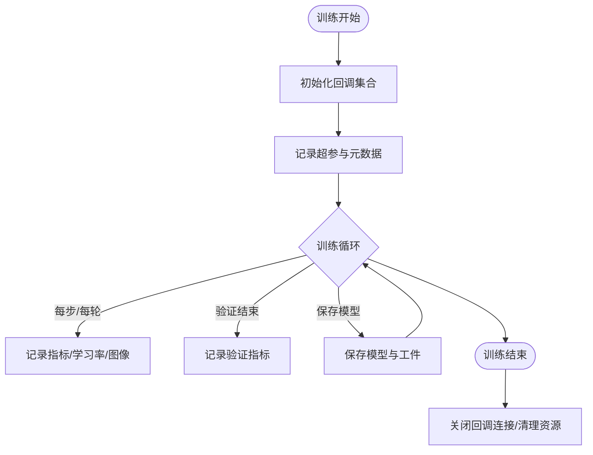
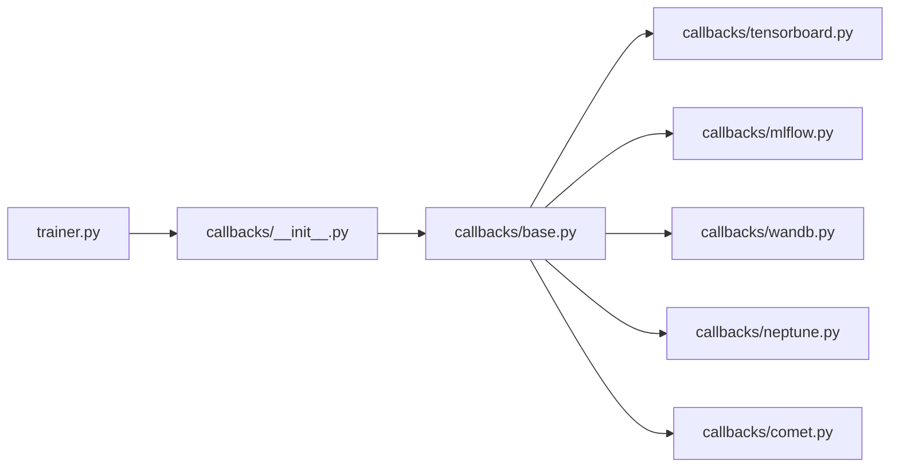

# MLOps工具集成

<cite>
**本文引用的文件**
- [ultralytics/utils/callbacks/__init__.py](file://ultralytics/utils/callbacks/__init__.py)
- [ultralytics/utils/callbacks/base.py](file://ultralytics/utils/callbacks/base.py)
- [ultralytics/utils/callbacks/tensorboard.py](file://ultralytics/utils/callbacks/tensorboard.py)
- [ultralytics/utils/callbacks/mlflow.py](file://ultralytics/utils/callbacks/mlflow.py)
- [ultralytics/utils/callbacks/wandb.py](file://ultralytics/utils/callbacks/wandb.py)
- [ultralytics/utils/callbacks/neptune.py](file://ultralytics/utils/callbacks/neptune.py)
- [ultralytics/utils/callbacks/comet.py](file://ultralytics/utils/callbacks/comet.py)
- [ultralytics/engine/trainer.py](file://ultralytics/engine/trainer.py)
- [ultralytics/utils/logger.py](file://ultralytics/utils/logger.py)
- [ultralytics/utils/events.py](file://ultralytics/utils/events.py)
- [docs/en/integrations/index.md](file://docs/en/integrations/index.md)
- [docs/en/integrations/mlflow.md](file://docs/en/integrations/mlflow.md)
- [docs/en/integrations/weights-biases.md](file://docs/en/integrations/weights-biases.md)
- [docs/en/integrations/tensorboard.md](file://docs/en/integrations/tensorboard.md)
- [docs/en/integrations/neptune.md](file://docs/en/integrations/neptune.md)
- [docs/en/integrations/comet.md](file://docs/en/integrations/comet.md)
</cite>

## 目录
1. [简介](#简介)
2. [项目结构](#项目结构)
3. [核心组件](#核心组件)
4. [架构总览](#架构总览)
5. [详细组件分析](#详细组件分析)
6. [依赖关系分析](#依赖关系分析)
7. [性能考虑](#性能考虑)
8. [故障排除指南](#故障排除指南)
9. [结论](#结论)
10. [附录](#附录)

## 简介
本文件面向YOLO-Master与主流MLOps工具的集成实践，覆盖MLflow、Weights & Biases（W&B）、TensorBoard、Neptune、Comet等实验跟踪与可视化平台。文档从系统架构、回调机制、数据流、配置与环境变量、云平台部署认证、监控指标扩展、日志格式定制、性能优化与故障排查等方面给出完整说明，并提供可操作的示例路径与流程图示，帮助读者快速落地端到端训练追踪与模型版本管理。

## 项目结构
YOLO-Master将各MLOps平台的集成以“回调”形式解耦，统一由训练器在关键生命周期事件触发记录。主要位置如下：
- 回调注册入口与基础类定义位于回调包中
- 具体平台回调实现分别位于对应文件中
- 训练器在训练、验证、保存等阶段调用回调
- 文档位于docs/en/integrations下，提供平台使用说明

图表来源
- [ultralytics/engine/trainer.py](file://ultralytics/engine/trainer.py)
- [ultralytics/utils/callbacks/__init__.py](file://ultralytics/utils/callbacks/__init__.py)
- [ultralytics/utils/callbacks/base.py](file://ultralytics/utils/callbacks/base.py)
- [ultralytics/utils/callbacks/tensorboard.py](file://ultralytics/utils/callbacks/tensorboard.py)
- [ultralytics/utils/callbacks/mlflow.py](file://ultralytics/utils/callbacks/mlflow.py)
- [ultralytics/utils/callbacks/wandb.py](file://ultralytics/utils/callbacks/wandb.py)
- [ultralytics/utils/callbacks/neptune.py](file://ultralytics/utils/callbacks/neptune.py)
- [ultralytics/utils/callbacks/comet.py](file://ultralytics/utils/callbacks/comet.py)
- [ultralytics/utils/logger.py](file://ultralytics/utils/logger.py)
- [ultralytics/utils/events.py](file://ultralytics/utils/events.py)

章节来源
- [ultralytics/utils/callbacks/__init__.py](file://ultralytics/utils/callbacks/__init__.py)
- [ultralytics/utils/callbacks/base.py](file://ultralytics/utils/callbacks/base.py)
- [ultralytics/engine/trainer.py](file://ultralytics/engine/trainer.py)
- [docs/en/integrations/index.md](file://docs/en/integrations/index.md)

## 核心组件
- 回调基类与注册机制
  - 所有平台回调均继承自统一的回调基类，提供一致的接口约定（如初始化、记录指标、记录超参、保存模型等）。
  - 回调注册入口负责根据配置动态启用相应回调实例，避免不必要的依赖加载。
- 训练器集成点
  - 训练器在训练开始、每步/每轮、验证结束、模型保存、训练结束等关键节点调用回调方法，确保指标、权重、超参、日志一致落盘或上报。
- 日志与事件
  - 日志模块用于结构化输出训练信息；事件模块可用于跨模块通知，便于扩展自定义回调。

章节来源
- [ultralytics/utils/callbacks/base.py](file://ultralytics/utils/callbacks/base.py)
- [ultralytics/utils/callbacks/__init__.py](file://ultralytics/utils/callbacks/__init__.py)
- [ultralytics/engine/trainer.py](file://ultralytics/engine/trainer.py)
- [ultralytics/utils/logger.py](file://ultralytics/utils/logger.py)
- [ultralytics/utils/events.py](file://ultralytics/utils/events.py)

## 架构总览
下图展示了训练器与多平台回调的交互流程，以及指标、超参、模型工件的流向。

图表来源
- [ultralytics/engine/trainer.py](file://ultralytics/engine/trainer.py)
- [ultralytics/utils/callbacks/__init__.py](file://ultralytics/utils/callbacks/__init__.py)
- [ultralytics/utils/callbacks/base.py](file://ultralytics/utils/callbacks/base.py)
- [ultralytics/utils/callbacks/tensorboard.py](file://ultralytics/utils/callbacks/tensorboard.py)
- [ultralytics/utils/callbacks/mlflow.py](file://ultralytics/utils/callbacks/mlflow.py)
- [ultralytics/utils/callbacks/wandb.py](file://ultralytics/utils/callbacks/wandb.py)
- [ultralytics/utils/callbacks/neptune.py](file://ultralytics/utils/callbacks/neptune.py)
- [ultralytics/utils/callbacks/comet.py](file://ultralytics/utils/callbacks/comet.py)

## 详细组件分析

### 回调基类与注册机制
- 设计要点
  - 统一接口：为不同平台提供一致的钩子方法，如初始化、记录指标、记录超参、记录图像、保存模型、结束等。
  - 条件启用：通过配置开关控制是否加载特定回调，减少运行时开销与外部依赖。
  - 错误隔离：单个回调异常不应影响主训练流程。
- 典型使用方式
  - 在训练配置中开启所需回调，例如仅启用TensorBoard或同时启用多个平台。
  - 在训练前后自动完成环境初始化、元数据写入与资源清理。

章节来源
- [ultralytics/utils/callbacks/base.py](file://ultralytics/utils/callbacks/base.py)
- [ultralytics/utils/callbacks/__init__.py](file://ultralytics/utils/callbacks/__init__.py)

#### 类图（回调体系）

图表来源
- [ultralytics/utils/callbacks/base.py](file://ultralytics/utils/callbacks/base.py)
- [ultralytics/utils/callbacks/tensorboard.py](file://ultralytics/utils/callbacks/tensorboard.py)
- [ultralytics/utils/callbacks/mlflow.py](file://ultralytics/utils/callbacks/mlflow.py)
- [ultralytics/utils/callbacks/wandb.py](file://ultralytics/utils/callbacks/wandb.py)
- [ultralytics/utils/callbacks/neptune.py](file://ultralytics/utils/callbacks/neptune.py)
- [ultralytics/utils/callbacks/comet.py](file://ultralytics/utils/callbacks/comet.py)

### TensorBoard 集成
- 功能范围
  - 记录损失、精度、mAP等标量指标
  - 记录学习率、梯度范数等训练曲线
  - 可选记录预测图像、混淆矩阵等可视化内容
- 配置要点
  - 指定日志目录与刷新频率
  - 按需开启图像/直方图等重计算项
- 使用示例路径
  - 参考文档：[docs/en/integrations/tensorboard.md](file://docs/en/integrations/tensorboard.md)
  - 代码实现：[ultralytics/utils/callbacks/tensorboard.py](file://ultralytics/utils/callbacks/tensorboard.py)

章节来源
- [docs/en/integrations/tensorboard.md](file://docs/en/integrations/tensorboard.md)
- [ultralytics/utils/callbacks/tensorboard.py](file://ultralytics/utils/callbacks/tensorboard.py)

### MLflow 集成
- 功能范围
  - 记录超参数与运行元数据
  - 记录训练指标与评估指标
  - 自动注册模型版本（若启用）
- 配置要点
  - 设置跟踪服务器地址或本地路径
  - 配置实验名、运行名、标签
- 使用示例路径
  - 参考文档：[docs/en/integrations/mlflow.md](file://docs/en/integrations/mlflow.md)
  - 代码实现：[ultralytics/utils/callbacks/mlflow.py](file://ultralytics/utils/callbacks/mlflow.py)

章节来源
- [docs/en/integrations/mlflow.md](file://docs/en/integrations/mlflow.md)
- [ultralytics/utils/callbacks/mlflow.py](file://ultralytics/utils/callbacks/mlflow.py)

### Weights & Biases (W&B) 集成
- 功能范围
  - 记录超参、指标、中间结果
  - 可视化训练曲线、混淆矩阵、预测样本
  - 支持超参搜索与工作流编排
- 配置要点
  - 设置API密钥与实体/项目
  - 配置同步策略与采样频率
- 使用示例路径
  - 参考文档：[docs/en/integrations/weights-biases.md](file://docs/en/integrations/weights-biases.md)
  - 代码实现：[ultralytics/utils/callbacks/wandb.py](file://ultralytics/utils/callbacks/wandb.py)

章节来源
- [docs/en/integrations/weights-biases.md](file://docs/en/integrations/weights-biases.md)
- [ultralytics/utils/callbacks/wandb.py](file://ultralytics/utils/callbacks/wandb.py)

### Neptune 集成
- 功能范围
  - 记录超参、指标、工件（模型权重、数据集索引等）
  - 可视化训练过程与对比分析
- 配置要点
  - 设置API令牌与项目命名空间
  - 配置工件上传策略与大小限制
- 使用示例路径
  - 参考文档：[docs/en/integrations/neptune.md](file://docs/en/integrations/neptune.md)
  - 代码实现：[ultralytics/utils/callbacks/neptune.py](file://ultralytics/utils/callbacks/neptune.py)

章节来源
- [docs/en/integrations/neptune.md](file://docs/en/integrations/neptune.md)
- [ultralytics/utils/callbacks/neptune.py](file://ultralytics/utils/callbacks/neptune.py)

### Comet 集成
- 功能范围
  - 记录超参、指标、代码快照、环境信息
  - 可视化训练曲线与对比实验
- 配置要点
  - 设置API密钥与项目名
  - 配置日志级别与采样间隔
- 使用示例路径
  - 参考文档：[docs/en/integrations/comet.md](file://docs/en/integrations/comet.md)
  - 代码实现：[ultralytics/utils/callbacks/comet.py](file://ultralytics/utils/callbacks/comet.py)

章节来源
- [docs/en/integrations/comet.md](file://docs/en/integrations/comet.md)
- [ultralytics/utils/callbacks/comet.py](file://ultralytics/utils/callbacks/comet.py)

### 训练器中的回调调用流程
训练器在以下阶段触发回调：
- 训练开始：初始化各回调、写入超参与环境信息
- 训练循环：按步/轮记录指标、学习率、中间可视化
- 验证阶段：记录验证指标与混淆矩阵等
- 模型保存：将权重与元数据提交到各平台
- 训练结束：关闭连接、释放资源

图表来源
- [ultralytics/engine/trainer.py](file://ultralytics/engine/trainer.py)
- [ultralytics/utils/callbacks/base.py](file://ultralytics/utils/callbacks/base.py)

章节来源
- [ultralytics/engine/trainer.py](file://ultralytics/engine/trainer.py)

## 依赖关系分析
- 耦合与内聚
  - 回调层与训练器松耦合：训练器仅依赖回调基类接口，具体实现可插拔。
  - 平台SDK仅在对应回调中引入，避免全局依赖污染。
- 外部依赖
  - 各回调依赖对应平台的Python SDK（如mlflow、wandb、neptune-client、comet_ml、tensorboard）。
- 潜在循环依赖
  - 回调之间无直接相互引用，均通过基类与训练器间接协作，降低循环风险。

图表来源
- [ultralytics/engine/trainer.py](file://ultralytics/engine/trainer.py)
- [ultralytics/utils/callbacks/__init__.py](file://ultralytics/utils/callbacks/__init__.py)
- [ultralytics/utils/callbacks/base.py](file://ultralytics/utils/callbacks/base.py)
- [ultralytics/utils/callbacks/tensorboard.py](file://ultralytics/utils/callbacks/tensorboard.py)
- [ultralytics/utils/callbacks/mlflow.py](file://ultralytics/utils/callbacks/mlflow.py)
- [ultralytics/utils/callbacks/wandb.py](file://ultralytics/utils/callbacks/wandb.py)
- [ultralytics/utils/callbacks/neptune.py](file://ultralytics/utils/callbacks/neptune.py)
- [ultralytics/utils/callbacks/comet.py](file://ultralytics/utils/callbacks/comet.py)

章节来源
- [ultralytics/utils/callbacks/__init__.py](file://ultralytics/utils/callbacks/__init__.py)
- [ultralytics/utils/callbacks/base.py](file://ultralytics/utils/callbacks/base.py)
- [ultralytics/engine/trainer.py](file://ultralytics/engine/trainer.py)

## 性能考虑
- 采样与批处理
  - 合理设置指标记录频率，避免高频I/O造成训练瓶颈。
  - 对图像/直方图等重计算项采用降采样或延迟记录策略。
- 异步与缓冲
  - 优先使用平台SDK提供的异步写入或批量提交接口（若可用）。
  - 本地缓存临时结果，周期性合并上传。
- 资源隔离
  - 在多GPU或多进程环境下，确保回调初始化与写入线程安全。
- 存储与网络
  - 本地日志目录使用高性能磁盘；远程服务注意带宽与重试策略。

## 故障排除指南
- 常见认证问题
  - 检查环境变量是否正确设置（如API密钥、实体/项目名、跟踪服务器地址）。
  - 确认网络可达性与代理配置。
- 权限与路径
  - 确保日志/工件目录具有写权限。
  - 远程平台的项目命名空间与访问令牌具备写入权限。
- 依赖缺失
  - 未安装对应平台SDK会导致回调初始化失败；按需安装最小依赖集。
- 异常隔离
  - 单个回调异常不应中断训练；查看日志定位具体回调的错误堆栈。
- 调试建议
  - 先启用单一回调进行最小复现，逐步增加其他回调。
  - 降低记录频率与禁用图像/直方图以定位性能问题。

章节来源
- [ultralytics/utils/logger.py](file://ultralytics/utils/logger.py)
- [ultralytics/utils/callbacks/base.py](file://ultralytics/utils/callbacks/base.py)

## 结论
YOLO-Master通过统一的回调机制将训练器与多种MLOps平台解耦，既保证了可扩展性，又降低了集成成本。借助文档与示例路径，用户可以快速完成MLflow、W&B、TensorBoard、Neptune、Comet的配置与使用，并在云平台环境中稳定运行。结合本文的性能优化与故障排除建议，可在保证训练效率的同时获得完善的实验追踪与模型版本管理能力。

## 附录

### 环境变量与认证清单（按平台）
- MLflow
  - 跟踪服务器地址或本地路径
  - 实验名、运行名、标签
  - 参考：[docs/en/integrations/mlflow.md](file://docs/en/integrations/mlflow.md)
- W&B
  - API密钥、实体/项目名
  - 同步策略与采样频率
  - 参考：[docs/en/integrations/weights-biases.md](file://docs/en/integrations/weights-biases.md)
- TensorBoard
  - 日志目录、刷新频率
  - 参考：[docs/en/integrations/tensorboard.md](file://docs/en/integrations/tensorboard.md)
- Neptune
  - API令牌、项目命名空间
  - 工件上传策略
  - 参考：[docs/en/integrations/neptune.md](file://docs/en/integrations/neptune.md)
- Comet
  - API密钥、项目名
  - 日志级别与采样间隔
  - 参考：[docs/en/integrations/comet.md](file://docs/en/integrations/comet.md)

### 自定义监控指标与日志格式
- 自定义指标
  - 在回调基类约定的记录接口中追加自定义字段，确保训练器在合适时机调用。
  - 参考回调基类与注册入口：[ultralytics/utils/callbacks/base.py](file://ultralytics/utils/callbacks/base.py)、[ultralytics/utils/callbacks/__init__.py](file://ultralytics/utils/callbacks/__init__.py)
- 日志格式
  - 通过日志模块统一输出结构化信息，便于解析与聚合。
  - 参考：[ultralytics/utils/logger.py](file://ultralytics/utils/logger.py)
- 事件扩展
  - 利用事件总线发布/订阅训练状态变化，驱动额外回调逻辑。
  - 参考：[ultralytics/utils/events.py](file://ultralytics/utils/events.py)

### 云平台部署注意事项
- 容器镜像
  - 预装所需平台SDK与系统依赖，减小冷启动时间。
- 环境变量注入
  - 通过平台Secrets或配置中心注入认证信息，避免硬编码。
- 网络与安全
  - 配置出站白名单与代理，确保能访问平台API。
- 资源配额
  - 调整并发与批大小，避免超出平台配额导致失败。