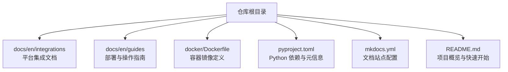
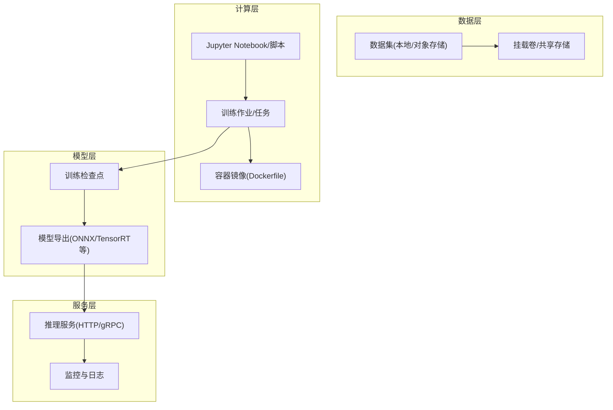
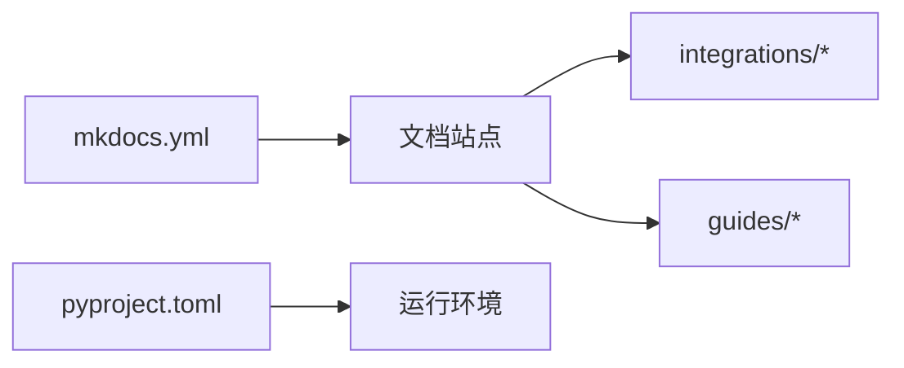

# 云平台集成

<cite>
**本文引用的文件**
- [amazon-sagemaker.md](file://docs/en/integrations/amazon-sagemaker.md)
- [google-colab.md](file://docs/en/integrations/google-colab.md)
- [kaggle.md](file://docs/en/integrations/kaggle.md)
- [azureml-quickstart.md](file://docs/en/guides/azureml-quickstart.md)
- [vertex-ai-deployment-with-docker.md](file://docs/en/guides/vertex-ai-deployment-with-docker.md)
- [docker/Dockerfile](file://docker/Dockerfile)
- [mkdocs.yml](file://mkdocs.yml)
- [pyproject.toml](file://pyproject.toml)
- [README.md](file://README.md)
</cite>

## 目录
1. [简介](#简介)
2. [项目结构](#项目结构)
3. [核心组件](#核心组件)
4. [架构总览](#架构总览)
5. [详细组件分析](#详细组件分析)
6. [依赖分析](#依赖分析)
7. [性能考虑](#性能考虑)
8. [故障排查指南](#故障排查指南)
9. [结论](#结论)
10. [附录](#附录)

## 简介
本文件面向在主流云平台上部署与运行 YOLO-Master 的工程师，提供端到端的集成与部署指南。内容覆盖 AWS SageMaker、Google Vertex AI、Azure ML、Google Colab、Kaggle 等平台的配置与使用流程，包含数据上传下载、模型训练、推理服务化、GPU 实例选择与优化、成本优化建议、错误处理与调试技巧，并给出可复用的 Jupyter Notebook 示例与自动化脚本路径。

## 项目结构
YOLO-Master 仓库提供了多平台集成文档与容器镜像构建入口，便于在各云平台快速拉起训练与推理环境：
- 平台集成文档位于 docs/en/integrations 与 docs/en/guides 下，分别对应各云平台的入门与部署指南。
- 容器镜像定义位于 docker/Dockerfile，用于打包训练与推理依赖。
- 项目元信息与依赖声明位于 pyproject.toml；文档站点配置位于 mkdocs.yml。
- README.md 提供总体说明与快速开始指引。

图表来源
- [mkdocs.yml](file://mkdocs.yml)
- [docker/Dockerfile](file://docker/Dockerfile)
- [pyproject.toml](file://pyproject.toml)
- [README.md](file://README.md)

章节来源
- [README.md](file://README.md)
- [mkdocs.yml](file://mkdocs.yml)
- [pyproject.toml](file://pyproject.toml)
- [docker/Dockerfile](file://docker/Dockerfile)

## 核心组件
- 平台集成文档
  - AWS SageMaker：[amazon-sagemaker.md](file://docs/en/integrations/amazon-sagemaker.md)
  - Google Colab：[google-colab.md](file://docs/en/integrations/google-colab.md)
  - Kaggle：[kaggle.md](file://docs/en/integrations/kaggle.md)
  - Azure ML 快速开始：[azureml-quickstart.md](file://docs/en/guides/azureml-quickstart.md)
  - Vertex AI（Docker 部署）：[vertex-ai-deployment-with-docker.md](file://docs/en/guides/vertex-ai-deployment-with-docker.md)
- 容器镜像
  - Dockerfile：[docker/Dockerfile](file://docker/Dockerfile)
- 依赖与元信息
  - Python 包与依赖：[pyproject.toml](file://pyproject.toml)
  - 文档站点配置：[mkdocs.yml](file://mkdocs.yml)

章节来源
- [amazon-sagemaker.md](file://docs/en/integrations/amazon-sagemaker.md)
- [google-colab.md](file://docs/en/integrations/google-colab.md)
- [kaggle.md](file://docs/en/integrations/kaggle.md)
- [azureml-quickstart.md](file://docs/en/guides/azureml-quickstart.md)
- [vertex-ai-deployment-with-docker.md](file://docs/en/guides/vertex-ai-deployment-with-docker.md)
- [docker/Dockerfile](file://docker/Dockerfile)
- [pyproject.toml](file://pyproject.toml)
- [mkdocs.yml](file://mkdocs.yml)

## 架构总览
下图展示了在多云平台上的通用工作流：从数据准备到训练、导出与推理服务化的端到端链路。不同平台通过各自的 CLI/控制台/Notebook 界面驱动同一套代码与容器镜像。

图表来源
- [docker/Dockerfile](file://docker/Dockerfile)
- [amazon-sagemaker.md](file://docs/en/integrations/amazon-sagemaker.md)
- [vertex-ai-deployment-with-docker.md](file://docs/en/guides/vertex-ai-deployment-with-docker.md)
- [azureml-quickstart.md](file://docs/en/guides/azureml-quickstart.md)
- [google-colab.md](file://docs/en/integrations/google-colab.md)
- [kaggle.md](file://docs/en/integrations/kaggle.md)

## 详细组件分析

### AWS SageMaker 集成与部署
- 目标
  - 在 SageMaker Notebook/Training/Endpoint 上完成数据准备、训练、导出与服务化。
- 关键步骤
  - 准备数据集并上传至 S3；在 Notebook 中通过 SDK 读取或挂载。
  - 使用 SageMaker Training Job 启动训练，指定 GPU 实例类型与并行策略。
  - 将训练产物导出为部署格式（如 ONNX/TensorRT），上传至 S3。
  - 创建 SageMaker Endpoint 进行在线推理，或使用 Batch Transform 进行离线推理。
- 参考文档
  - 平台集成文档：[amazon-sagemaker.md](file://docs/en/integrations/amazon-sagemaker.md)
- 典型资源
  - 训练作业、S3 桶、Endpoint、IAM 角色、VPC 与安全组。
- 最佳实践
  - 使用带 GPU 的实例族，结合分布式训练提升吞吐。
  - 合理设置批大小与学习率，避免显存溢出。
  - 对导出模型进行量化与图优化以降低延迟。
- 成本优化
  - 按需+Spot 混合策略；训练完成后及时释放 Endpoint。
  - 使用分层存储与生命周期策略管理 S3 数据。

章节来源
- [amazon-sagemaker.md](file://docs/en/integrations/amazon-sagemaker.md)

### Google Vertex AI 集成与部署
- 目标
  - 使用 Vertex AI Notebooks、Custom Training Jobs 与 Endpoints 完成端到端流程。
- 关键步骤
  - 在 Vertex AI Notebooks 中准备环境与数据（GCS）。
  - 提交 Custom Training Job（支持 GPU），输出检查点到 GCS。
  - 导出模型并打包为容器镜像（基于仓库中的 Dockerfile）。
  - 部署为 Vertex AI Endpoint 提供服务。
- 参考文档
  - 平台集成文档：[vertex-ai-deployment-with-docker.md](file://docs/en/guides/vertex-ai-deployment-with-docker.md)
- 典型资源
  - GCS 存储桶、Vertex AI 笔记本、自定义训练作业、容器镜像仓库、Endpoint。
- 最佳实践
  - 使用预构建镜像加速冷启动；启用自动缩放以应对流量波动。
  - 利用 TensorBoard 与日志系统进行观测。
- 成本优化
  - 使用 preemptible VM 执行训练；按峰值弹性伸缩推理服务。

章节来源
- [vertex-ai-deployment-with-docker.md](file://docs/en/guides/vertex-ai-deployment-with-docker.md)

### Azure ML 集成与部署
- 目标
  - 在 Azure ML Workspace 中完成数据注册、训练与部署。
- 关键步骤
  - 将数据集注册为 Azure ML Datastore/Data Asset。
  - 使用 Compute Instance/Cluster 运行训练脚本，指定 GPU 规格。
  - 将模型注册到 Model Registry，并部署为实时推理服务（Managed Online Endpoint）。
- 参考文档
  - 快速开始指南：[azureml-quickstart.md](file://docs/en/guides/azureml-quickstart.md)
- 典型资源
  - Workspace、Compute、Datastore、Model Registry、Online Endpoint。
- 最佳实践
  - 使用 AML Pipelines 编排数据预处理、训练与评估。
  - 对模型进行序列化优化与缓存预热。
- 成本优化
  - 训练使用 Spot 节点；推理根据 QPS 动态扩缩容。

章节来源
- [azureml-quickstart.md](file://docs/en/guides/azureml-quickstart.md)

### Google Colab 集成与使用
- 目标
  - 在 Colab Notebook 中快速验证与实验，适合小规模训练与推理演示。
- 关键步骤
  - 安装依赖并克隆仓库；挂载 Google Drive 作为数据持久化。
  - 在 Notebook 中执行训练与导出；保存结果到 Drive。
- 参考文档
  - 平台集成文档：[google-colab.md](file://docs/en/integrations/google-colab.md)
- 注意事项
  - 注意会话时长与配额限制；大模型训练建议使用云端 GPU 实例。
- 最佳实践
  - 使用 %tensorflow_version 或 pip 安装指定版本；开启 GPU 运行时。
  - 将中间产物与最终模型保存到 Drive，避免丢失。

章节来源
- [google-colab.md](file://docs/en/integrations/google-colab.md)

### Kaggle 集成与使用
- 目标
  - 在 Kaggle Notebook 或 Dataset 环境中进行训练与分享。
- 关键步骤
  - 创建私有/公开数据集；在 Notebook 中挂载并读取。
  - 安装依赖并执行训练；将结果提交或导出。
- 参考文档
  - 平台集成文档：[kaggle.md](file://docs/en/integrations/kaggle.md)
- 注意事项
  - 遵守网络访问与外部库安装限制；优先使用 Kaggle 提供的 GPU 配额。
- 最佳实践
  - 使用 Kaggle Secrets 管理凭据；将大型数据拆分为分片以提升加载效率。

章节来源
- [kaggle.md](file://docs/en/integrations/kaggle.md)

### 容器镜像与跨平台一致性
- 目标
  - 通过统一的 Dockerfile 确保训练与推理环境一致，降低“在我机器上能跑”的问题。
- 关键步骤
  - 基于官方 CUDA/cuDNN 基础镜像，安装 PyTorch 与 YOLO-Master 依赖。
  - 暴露推理端口并提供健康检查；将模型权重与配置文件放入镜像或挂载卷。
- 参考文件
  - 容器镜像定义：[docker/Dockerfile](file://docker/Dockerfile)
- 最佳实践
  - 使用多阶段构建减小镜像体积；仅复制必要文件。
  - 在镜像内固定依赖版本，保证可重现性。

章节来源
- [docker/Dockerfile](file://docker/Dockerfile)

## 依赖分析
- 文档站点与依赖
  - 文档站点配置：[mkdocs.yml](file://mkdocs.yml)
  - Python 包与依赖：[pyproject.toml](file://pyproject.toml)
- 平台文档索引
  - 平台集成文档集合位于 docs/en/integrations 与 docs/en/guides，便于统一检索与维护。

图表来源
- [mkdocs.yml](file://mkdocs.yml)
- [pyproject.toml](file://pyproject.toml)

章节来源
- [mkdocs.yml](file://mkdocs.yml)
- [pyproject.toml](file://pyproject.toml)

## 性能考虑
- GPU 实例选择
  - 训练：优先选择高显存、高带宽的 GPU 实例（如 A100/V100），并结合多卡并行。
  - 推理：根据 QPS 与延迟目标选择合适实例，必要时使用专用推理优化引擎（TensorRT/OpenVINO）。
- 数据 I/O
  - 使用高速磁盘与并行 DataLoader；将数据置于就近存储（S3/GCS/Azure Blob）以减少跨区延迟。
- 模型导出与优化
  - 导出为 ONNX/TensorRT 并进行算子融合与量化；推理前进行预热。
- 并发与批处理
  - 调整 batch size 与线程数，平衡吞吐与显存占用；使用异步请求队列提高稳定性。
- 监控与调优
  - 采集 GPU 利用率、显存、I/O 等待与网络吞吐；结合日志与指标定位瓶颈。

## 故障排查指南
- 常见问题
  - 依赖冲突：确认基础镜像与依赖版本一致；在容器中固定版本。
  - 显存不足：降低 batch size、启用梯度累积或减少输入分辨率。
  - 数据加载慢：增加数据并行度、使用内存映射或预取机制。
  - 推理超时：增大实例规格、启用连接池与超时重试。
- 调试技巧
  - 在 Notebook 中逐步执行并打印关键张量形状与设备信息。
  - 使用平台日志系统（CloudWatch/Stackdriver/Azure Monitor）收集训练与推理日志。
  - 对导出模型进行单元测试与回归测试，确保前后端一致性。
- 恢复策略
  - 定期保存检查点并上传对象存储；失败时从最近检查点恢复。
  - 对推理服务启用健康检查与自动重启。

## 结论
通过在各大云平台采用统一的容器镜像与标准化工作流，YOLO-Master 可在 SageMaker、Vertex AI、Azure ML、Colab 与 Kaggle 上高效落地。遵循本文的配置与最佳实践，可实现稳定的训练与低延迟推理，并在成本与性能之间取得良好平衡。

## 附录
- 快速开始
  - 项目概览与快速开始：[README.md](file://README.md)
- 相关文档
  - 平台集成与部署指南均位于 docs/en/integrations 与 docs/en/guides 目录下，可按需查阅。