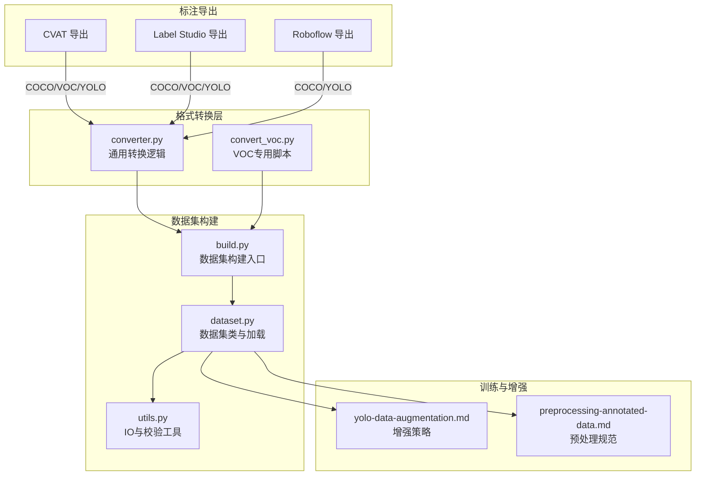
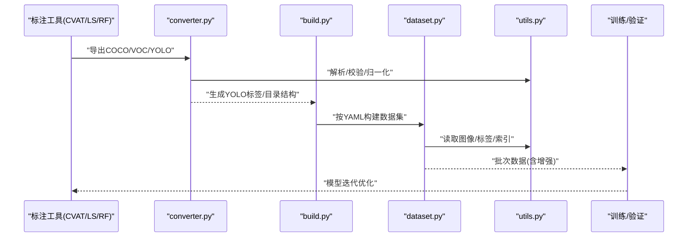
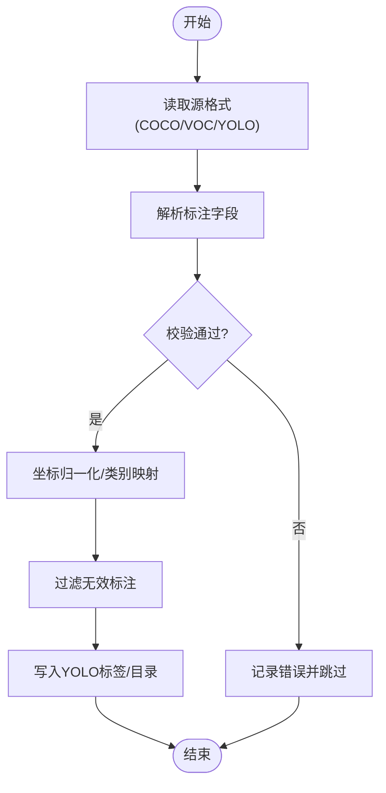
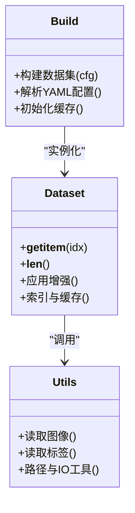
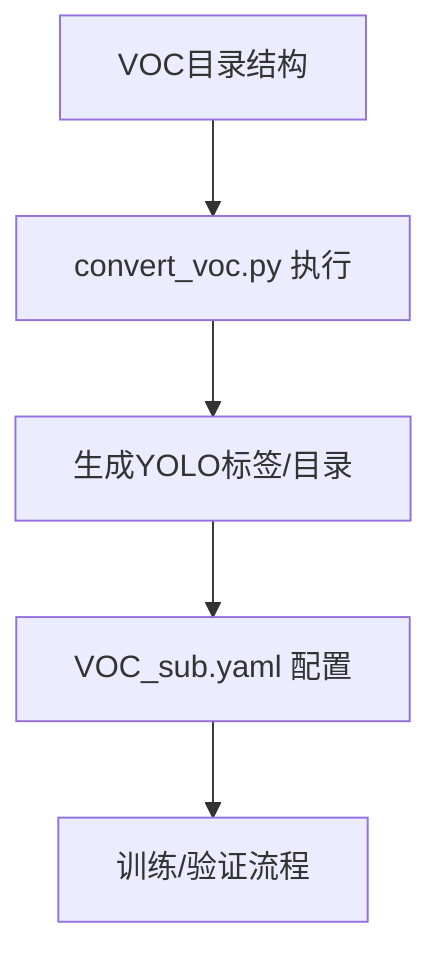
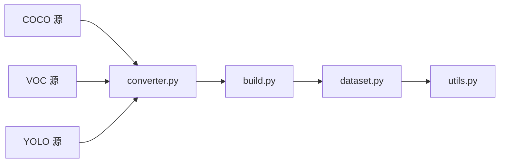

# 数据标注工具集成

<cite>
**本文引用的文件**
- [ultralytics/data/converter.py](file://ultralytics/data/converter.py)
- [ultralytics/data/dataset.py](file://ultralytics/data/dataset.py)
- [ultralytics/data/build.py](file://ultralytics/data/build.py)
- [ultralytics/data/utils.py](file://ultralytics/data/utils.py)
- [scripts/convert_voc.py](file://scripts/convert_voc.py)
- [scripts/VOC_sub.yaml](file://scripts/VOC_sub.yaml)
- [scripts/_voc_local.yaml](file://scripts/_voc_local.yaml)
- [scripts/_voc_local_v0_13_15.yaml](file://scripts/_voc_local_v0_13_15.yaml)
- [docs/en/guides/coco-to-yolo.md](file://docs/en/guides/coco-to-yolo.md)
- [docs/en/guides/preprocessing-annotated-data.md](file://docs/en/guides/preprocessing-annotated-data.md)
- [docs/en/guides/yolo-data-augmentation.md](file://docs/en/guides/yolo-data-augmentation.md)
- [docs/en/integrations/roboflow.md](file://docs/en/integrations/roboflow.md)
</cite>

## 目录
1. [简介](#简介)
2. [项目结构](#项目结构)
3. [核心组件](#核心组件)
4. [架构总览](#架构总览)
5. [详细组件分析](#详细组件分析)
6. [依赖关系分析](#依赖关系分析)
7. [性能考虑](#性能考虑)
8. [故障排查指南](#故障排查指南)
9. [结论](#结论)
10. [附录](#附录)

## 简介
本文件面向YOLO-Master与主流数据标注工具的集成，覆盖CVAT、Label Studio、Roboflow等工具导出的常见格式（COCO、Pascal VOC、YOLO）的转换与处理流程。文档提供批量数据处理与验证方法、数据质量检查与清洗建议、自定义标注格式的适配指南，以及数据增强与预处理的最佳实践。内容以仓库内现有实现与文档为依据，帮助读者快速构建从标注到训练的一体化数据流水线。

## 项目结构
围绕数据标注与格式转换的核心代码集中在以下位置：
- 数据格式转换与通用工具：ultralytics/data/converter.py、ultralytics/data/utils.py
- 数据集加载与构建：ultralytics/data/dataset.py、ultralytics/data/build.py
- Pascal VOC 相关脚本与配置：scripts/convert_voc.py、scripts/VOC_sub.yaml、scripts/_voc_local*.yaml
- 官方指南与最佳实践：docs/en/guides/coco-to-yolo.md、docs/en/guides/preprocessing-annotated-data.md、docs/en/guides/yolo-data-augmentation.md
- Roboflow 集成说明：docs/en/integrations/roboflow.md

图表来源
- [ultralytics/data/converter.py](file://ultralytics/data/converter.py)
- [ultralytics/data/build.py](file://ultralytics/data/build.py)
- [ultralytics/data/dataset.py](file://ultralytics/data/dataset.py)
- [ultralytics/data/utils.py](file://ultralytics/data/utils.py)
- [scripts/convert_voc.py](file://scripts/convert_voc.py)
- [docs/en/guides/yolo-data-augmentation.md](file://docs/en/guides/yolo-data-augmentation.md)
- [docs/en/guides/preprocessing-annotated-data.md](file://docs/en/guides/preprocessing-annotated-data.md)

章节来源
- [ultralytics/data/converter.py](file://ultralytics/data/converter.py)
- [ultralytics/data/build.py](file://ultralytics/data/build.py)
- [ultralytics/data/dataset.py](file://ultralytics/data/dataset.py)
- [ultralytics/data/utils.py](file://ultralytics/data/utils.py)
- [scripts/convert_voc.py](file://scripts/convert_voc.py)
- [docs/en/guides/coco-to-yolo.md](file://docs/en/guides/coco-to-yolo.md)
- [docs/en/guides/preprocessing-annotated-data.md](file://docs/en/guides/preprocessing-annotated-data.md)
- [docs/en/guides/yolo-data-augmentation.md](file://docs/en/guides/yolo-data-augmentation.md)
- [docs/en/integrations/roboflow.md](file://docs/en/integrations/roboflow.md)

## 核心组件
- 格式转换器（converter.py）
  - 负责将外部标注格式（如COCO、VOC、YOLO等）统一转换为YOLO内部期望的数据组织与标签格式，供后续训练与评估使用。
  - 通常包含：读取源格式、解析标注对象、坐标归一化、类别映射、输出YOLO文本标签或中间表示。
- 数据集构建器（build.py）
  - 作为数据集加载的统一入口，根据配置文件（YAML）解析路径、任务类型、类别定义，并调用底层数据集类进行实例化与缓存管理。
- 数据集类（dataset.py）
  - 封装图像与标签的加载、批处理、数据增强管线接入、索引与缓存机制，确保训练/验证阶段的高效访问。
- 工具函数（utils.py）
  - 提供通用的I/O、路径处理、基本校验、可视化辅助等能力，被转换器和数据集模块复用。
- VOC专用脚本（convert_voc.py）
  - 针对Pascal VOC结构的批量转换脚本，便于从传统VOC工程迁移至YOLO格式。
- 官方指南与集成文档
  - coco-to-yolo.md：COCO转YOLO的流程与注意事项。
  - preprocessing-annotated-data.md：标注数据的预处理规范与常见问题。
  - yolo-data-augmentation.md：数据增强的策略与参数建议。
  - roboflow.md：通过Roboflow平台导出与导入YOLO格式的实践。

章节来源
- [ultralytics/data/converter.py](file://ultralytics/data/converter.py)
- [ultralytics/data/build.py](file://ultralytics/data/build.py)
- [ultralytics/data/dataset.py](file://ultralytics/data/dataset.py)
- [ultralytics/data/utils.py](file://ultralytics/data/utils.py)
- [scripts/convert_voc.py](file://scripts/convert_voc.py)
- [docs/en/guides/coco-to-yolo.md](file://docs/en/guides/coco-to-yolo.md)
- [docs/en/guides/preprocessing-annotated-data.md](file://docs/en/guides/preprocessing-annotated-data.md)
- [docs/en/guides/yolo-data-augmentation.md](file://docs/en/guides/yolo-data-augmentation.md)
- [docs/en/integrations/roboflow.md](file://docs/en/integrations/roboflow.md)

## 架构总览
下图展示了从标注工具导出到YOLO训练的端到端数据流，包括格式转换、数据集构建、增强与预处理等环节。

图表来源
- [ultralytics/data/converter.py](file://ultralytics/data/converter.py)
- [ultralytics/data/build.py](file://ultralytics/data/build.py)
- [ultralytics/data/dataset.py](file://ultralytics/data/dataset.py)
- [ultralytics/data/utils.py](file://ultralytics/data/utils.py)

## 详细组件分析

### 格式转换组件（converter.py）
- 职责
  - 统一处理多源标注格式，输出YOLO兼容的标签与目录结构。
  - 支持类别映射、坐标归一化、边界框有效性过滤、重复项去重等。
- 关键流程
  - 输入：COCO JSON / VOC XML / YOLO txt 等
  - 处理：解析字段、校验几何与类别、归一化坐标、写入YOLO标签
  - 输出：YOLO目录结构（images/labels）、类别映射文件（可选）
- 复杂度与性能
  - 时间复杂度主要取决于样本数量与标注密度；可通过并行读取与批处理提升吞吐。
  - 空间复杂度受缓存与中间表示影响，建议在大规模数据时启用磁盘缓存。
- 错误处理
  - 对缺失字段、非法坐标、越界bbox、类别不存在等情况进行记录与跳过，保证转换鲁棒性。

图表来源
- [ultralytics/data/converter.py](file://ultralytics/data/converter.py)
- [ultralytics/data/utils.py](file://ultralytics/data/utils.py)

章节来源
- [ultralytics/data/converter.py](file://ultralytics/data/converter.py)
- [ultralytics/data/utils.py](file://ultralytics/data/utils.py)

### 数据集构建与加载（build.py + dataset.py）
- build.py
  - 作为数据集构建的统一入口，解析YAML配置（路径、任务、类别），创建对应数据集实例。
  - 负责缓存策略、分片与并行加载的配置。
- dataset.py
  - 封装图像与标签的读取、索引、批处理、增强管线接入。
  - 提供统一的接口供训练/验证循环调用。
- 典型调用链
  - 训练脚本 -> build() -> Dataset类 -> utils读取 -> 返回批次数据

图表来源
- [ultralytics/data/build.py](file://ultralytics/data/build.py)
- [ultralytics/data/dataset.py](file://ultralytics/data/dataset.py)
- [ultralytics/data/utils.py](file://ultralytics/data/utils.py)

章节来源
- [ultralytics/data/build.py](file://ultralytics/data/build.py)
- [ultralytics/data/dataset.py](file://ultralytics/data/dataset.py)
- [ultralytics/data/utils.py](file://ultralytics/data/utils.py)

### Pascal VOC 专用转换（convert_voc.py 与 YAML 配置）
- convert_voc.py
  - 针对VOC目录结构（JPEGImages/Annotations等）进行批量转换，输出YOLO标签与目录布局。
  - 适合历史项目迁移或团队沿用VOC工作流的场景。
- VOC_sub.yaml / _voc_local*.yaml
  - 提供VOC子集或本地路径的示例配置，便于快速验证转换结果与训练链路。
- 使用建议
  - 先运行转换脚本生成YOLO格式，再基于YAML配置进行训练/验证。
  - 若存在类别差异，可在YAML中调整nc与names映射。

图表来源
- [scripts/convert_voc.py](file://scripts/convert_voc.py)
- [scripts/VOC_sub.yaml](file://scripts/VOC_sub.yaml)
- [scripts/_voc_local.yaml](file://scripts/_voc_local.yaml)
- [scripts/_voc_local_v0_13_15.yaml](file://scripts/_voc_local_v0_13_15.yaml)

章节来源
- [scripts/convert_voc.py](file://scripts/convert_voc.py)
- [scripts/VOC_sub.yaml](file://scripts/VOC_sub.yaml)
- [scripts/_voc_local.yaml](file://scripts/_voc_local.yaml)
- [scripts/_voc_local_v0_13_15.yaml](file://scripts/_voc_local_v0_13_15.yaml)

### COCO 转 YOLO 指南（coco-to-yolo.md）
- 要点
  - 明确COCO字段到YOLO标签的映射规则。
  - 强调坐标归一化、类别ID到名称的映射、空标注与无效框的处理。
  - 提供批量转换命令与目录组织建议。
- 适用场景
  - 从COCO标准数据集或平台导出（如CVAT/Label Studio/COCO API）后直接转换。

章节来源
- [docs/en/guides/coco-to-yolo.md](file://docs/en/guides/coco-to-yolo.md)

### 预处理与数据增强（preprocessing-annotated-data.md + yolo-data-augmentation.md）
- 预处理规范
  - 图像尺寸统一、命名规范、路径一致性、缺失值清理。
  - 标注质量检查：重叠框、过小目标、类别不一致等。
- 增强策略
  - 几何变换（旋转、翻转、缩放）、色彩变换、Mosaic/MixUp等组合增强。
  - 结合任务特性选择增强强度与概率，避免破坏小目标或姿态信息。
- 最佳实践
  - 在验证集上禁用或减弱增强，以保证评估稳定性。
  - 使用缓存与预取减少IO瓶颈。

章节来源
- [docs/en/guides/preprocessing-annotated-data.md](file://docs/en/guides/preprocessing-annotated-data.md)
- [docs/en/guides/yolo-data-augmentation.md](file://docs/en/guides/yolo-data-augmentation.md)

### Roboflow 集成（roboflow.md）
- 导出与导入
  - 通过Roboflow平台导出YOLO格式，直接用于YOLO-Master训练。
  - 也可导出COCO/VOC后，使用内置转换器进行二次处理。
- 版本与兼容性
  - 注意不同导出版本的字段差异，必要时在转换层做兼容处理。

章节来源
- [docs/en/integrations/roboflow.md](file://docs/en/integrations/roboflow.md)

## 依赖关系分析
- 模块耦合
  - converter.py 依赖 utils.py 的基础工具；build.py 驱动 dataset.py；dataset.py 依赖 utils.py 进行I/O。
- 外部依赖
  - 标注工具导出格式（COCO/VOC/YOLO）为上游输入；训练/验证为下游消费方。
- 潜在风险
  - 大体积JSON/XML解析可能引发内存压力，需关注分批与流式处理。
  - 类别映射不一致会导致训练失败，应在转换阶段严格校验。

图表来源
- [ultralytics/data/converter.py](file://ultralytics/data/converter.py)
- [ultralytics/data/build.py](file://ultralytics/data/build.py)
- [ultralytics/data/dataset.py](file://ultralytics/data/dataset.py)
- [ultralytics/data/utils.py](file://ultralytics/data/utils.py)

章节来源
- [ultralytics/data/converter.py](file://ultralytics/data/converter.py)
- [ultralytics/data/build.py](file://ultralytics/data/build.py)
- [ultralytics/data/dataset.py](file://ultralytics/data/dataset.py)
- [ultralytics/data/utils.py](file://ultralytics/data/utils.py)

## 性能考虑
- I/O优化
  - 使用缓存与预取，减少磁盘随机读；合理设置workers与batch size。
- 转换效率
  - 对大型COCO JSON采用流式解析；对VOC XML可并行遍历。
- 内存控制
  - 避免一次性加载全部图像到内存；按需读取与释放。
- 增强开销
  - 在训练阶段启用增强，但注意CPU/GPU负载平衡；必要时使用异步增强管线。

[本节为通用指导，不直接分析具体文件]

## 故障排查指南
- 转换失败
  - 检查源格式字段完整性与坐标范围；确认类别映射一致。
  - 查看日志中的跳过记录，定位异常样本。
- 训练报错
  - 核对YAML配置（nc、names、路径）；确认YOLO标签格式正确。
  - 验证图像分辨率与标签归一化是否匹配。
- 性能问题
  - 增加workers、启用缓存；检查磁盘IO与网络存储延迟。
  - 调整增强强度与比例，避免过强导致收敛困难。

章节来源
- [ultralytics/data/converter.py](file://ultralytics/data/converter.py)
- [ultralytics/data/build.py](file://ultralytics/data/build.py)
- [ultralytics/data/dataset.py](file://ultralytics/data/dataset.py)
- [ultralytics/data/utils.py](file://ultralytics/data/utils.py)

## 结论
通过将CVAT、Label Studio、Roboflow等标注工具导出的COCO/VOC/YOLO格式统一转换为YOLO-Master所需的数据组织与标签格式，并结合严格的预处理与增强策略，可以构建稳定高效的数据流水线。建议在生产环境中引入自动化校验与监控，持续保障数据质量与训练稳定性。

[本节为总结性内容，不直接分析具体文件]

## 附录
- 常用命令与配置示例
  - 参考coco-to-yolo.md中的步骤与目录组织建议。
  - 使用VOC_sub.yaml与_convert_voc.py完成VOC迁移。
- 自定义标注格式适配
  - 在converter.py基础上扩展新的解析器，遵循“解析-校验-归一化-输出”的固定流程。
  - 在build.py中注册新格式的数据集类，并在YAML中声明路径与类别。
- 数据质量检查清单
  - 图像完整性、标签有效性、类别一致性、坐标归一化、重复与空标注清理。

章节来源
- [docs/en/guides/coco-to-yolo.md](file://docs/en/guides/coco-to-yolo.md)
- [scripts/convert_voc.py](file://scripts/convert_voc.py)
- [scripts/VOC_sub.yaml](file://scripts/VOC_sub.yaml)
- [ultralytics/data/converter.py](file://ultralytics/data/converter.py)
- [ultralytics/data/build.py](file://ultralytics/data/build.py)