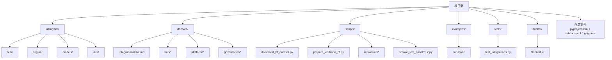
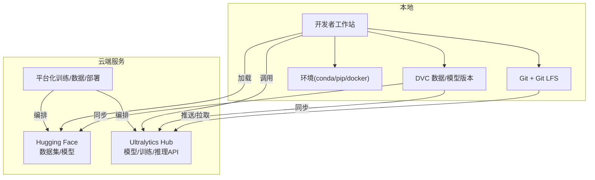
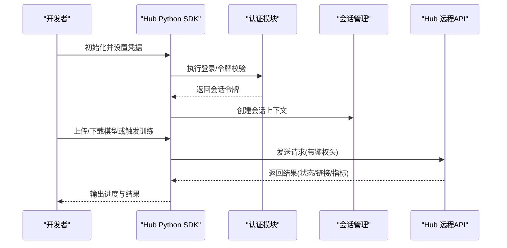
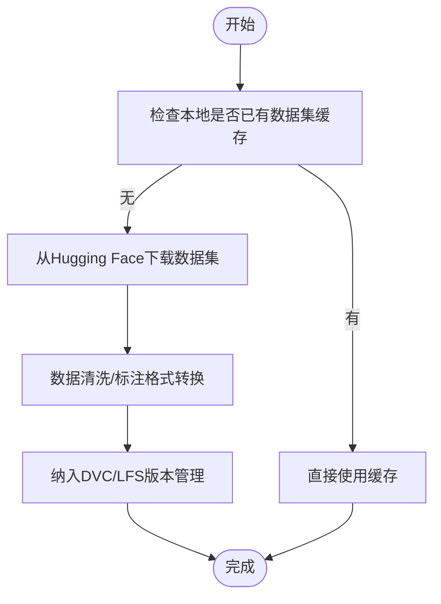
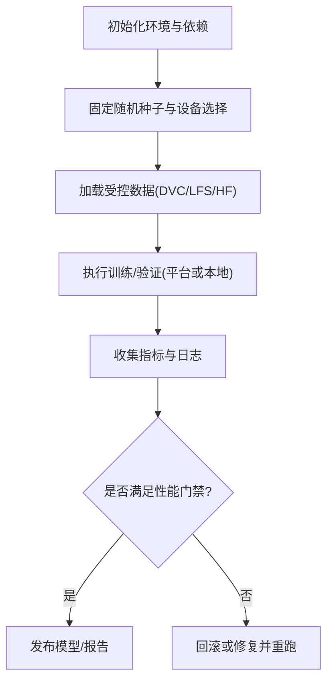
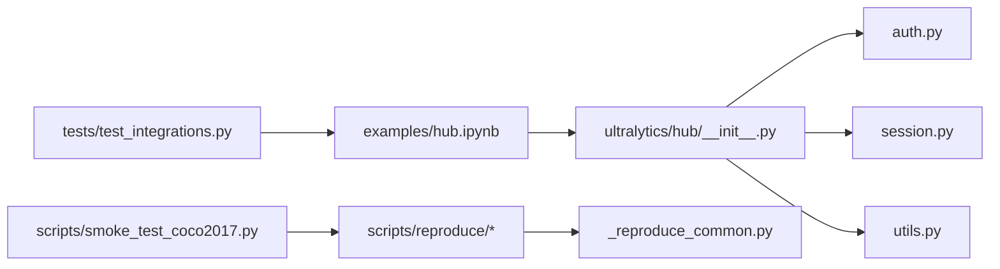

# 版本控制与协作工具

<cite>
**本文引用的文件**
- [README.md](file://README.md)
- [.gitignore](file://.gitignore)
- [pyproject.toml](file://pyproject.toml)
- [mkdocs.yml](file://mkdocs.yml)
- [docker/Dockerfile](file://docker/Dockerfile)
- [examples/hub.ipynb](file://examples/hub.ipynb)
- [ultralytics/hub/__init__.py](file://ultralytics/hub/__init__.py)
- [ultralytics/hub/auth.py](file://ultralytics/hub/auth.py)
- [ultralytics/hub/session.py](file://ultralytics/hub/session.py)
- [ultralytics/hub/utils.py](file://ultralytics/hub/utils.py)
- [scripts/download_hf_dataset.py](file://scripts/download_hf_dataset.py)
- [scripts/prepare_visdrone_hf.py](file://scripts/prepare_visdrone_hf.py)
- [docs/en/integrations/dvc.md](file://docs/en/integrations/dvc.md)
- [docs/en/hub/index.md](file://docs/en/hub/index.md)
- [docs/en/hub/quickstart.md](file://docs/en/hub/quickstart.md)
- [docs/en/hub/models.md](file://docs/en/hub/models.md)
- [docs/en/hub/datasets.md](file://docs/en/hub/datasets.md)
- [docs/en/hub/teams.md](file://docs/en/hub/teams.md)
- [docs/en/hub/cloud-training.md](file://docs/en/hub/cloud-training.md)
- [docs/en/platform/train/index.md](file://docs/en/platform/train/index.md)
- [docs/en/platform/data/index.md](file://docs/en/platform/data/index.md)
- [docs/en/platform/deploy/index.md](file://docs/en/platform/deploy/index.md)
- [docs/en/governance/baseline-20260716.md](file://docs/en/governance/baseline-20260716.md)
- [docs/en/governance/performance-gates.md](file://docs/en/governance/performance-gates.md)
- [scripts/reproduce/README.md](file://scripts/reproduce/README.md)
- [scripts/reproduce/_reproduce_common.py](file://scripts/reproduce/_reproduce_common.py)
- [scripts/reproduce/reproduce_visdrone.py](file://scripts/reproduce/reproduce_visdrone.py)
- [scripts/smoke_test_coco2017.py](file://scripts/smoke_test_coco2017.py)
- [tests/test_integrations.py](file://tests/test_integrations.py)
</cite>

## 目录
1. [简介](#简介)
2. [项目结构](#项目结构)
3. [核心组件](#核心组件)
4. [架构总览](#架构总览)
5. [详细组件分析](#详细组件分析)
6. [依赖关系分析](#依赖关系分析)
7. [性能考虑](#性能考虑)
8. [故障排查指南](#故障排查指南)
9. [结论](#结论)
10. [附录](#附录)

## 简介
本文件面向YOLO-Master团队，系统化说明如何结合Git、Git LFS、DVC、Ultralytics Hub与Hugging Face进行大文件版本管理、模型权重管理、数据集共享、实验复现与环境一致性保障，并给出团队协作工作流与最佳实践。文档同时覆盖平台化训练、数据管理与部署的集成要点，帮助团队在工程化与可复现性之间取得平衡。

## 项目结构
仓库采用“代码+文档+脚本+测试”的分层组织方式：
- 代码核心位于 ultralytics 子包，包含Hub客户端、引擎、模型、工具等模块
- 文档集中于 docs/en，涵盖集成指南（含DVC）、Hub使用、平台化训练/数据/部署、治理规范等
- 示例与脚本集中在 examples 与 scripts，提供Hub交互、HF数据集下载与准备、复现实验与冒烟测试
- 配置与构建相关：pyproject.toml、mkdocs.yml、docker/Dockerfile、.gitignore

图表来源
- [pyproject.toml:1-200](file://pyproject.toml#L1-L200)
- [mkdocs.yml:1-200](file://mkdocs.yml#L1-L200)
- [docker/Dockerfile:1-200](file://docker/Dockerfile#L1-L200)
- [docs/en/integrations/dvc.md:1-200](file://docs/en/integrations/dvc.md#L1-L200)
- [docs/en/hub/index.md:1-200](file://docs/en/hub/index.md#L1-L200)
- [scripts/download_hf_dataset.py:1-200](file://scripts/download_hf_dataset.py#L1-L200)
- [scripts/prepare_visdrone_hf.py:1-200](file://scripts/prepare_visdrone_hf.py#L1-L200)
- [examples/hub.ipynb:1-200](file://examples/hub.ipynb#L1-L200)
- [tests/test_integrations.py:1-200](file://tests/test_integrations.py#L1-L200)

章节来源
- [README.md:1-200](file://README.md#L1-L200)
- [pyproject.toml:1-200](file://pyproject.toml#L1-L200)
- [mkdocs.yml:1-200](file://mkdocs.yml#L1-L200)
- [docker/Dockerfile:1-200](file://docker/Dockerfile#L1-L200)
- [.gitignore:1-200](file://.gitignore#L1-L200)

## 核心组件
- Git + Git LFS：用于代码与二进制大文件（权重、数据集）的版本控制与增量同步
- DVC：面向机器学习的数据与模型版本管理，支持外部存储后端与流水线追踪
- Ultralytics Hub：模型托管、在线训练、推理API与团队协作（私有空间、团队权限）
- Hugging Face：数据集与模型的加载、分享与复用
- 平台化能力：平台化训练、数据管理与部署流程（文档驱动）
- 复现与治理：基线、性能门禁、复现实验脚本与冒烟测试

章节来源
- [docs/en/integrations/dvc.md:1-200](file://docs/en/integrations/dvc.md#L1-L200)
- [docs/en/hub/index.md:1-200](file://docs/en/hub/index.md#L1-L200)
- [docs/en/hub/quickstart.md:1-200](file://docs/en/hub/quickstart.md#L1-L200)
- [docs/en/hub/models.md:1-200](file://docs/en/hub/models.md#L1-L200)
- [docs/en/hub/datasets.md:1-200](file://docs/en/hub/datasets.md#L1-L200)
- [docs/en/hub/teams.md:1-200](file://docs/en/hub/teams.md#L1-L200)
- [docs/en/hub/cloud-training.md:1-200](file://docs/en/hub/cloud-training.md#L1-L200)
- [docs/en/platform/train/index.md:1-200](file://docs/en/platform/train/index.md#L1-L200)
- [docs/en/platform/data/index.md:1-200](file://docs/en/platform/data/index.md#L1-L200)
- [docs/en/platform/deploy/index.md:1-200](file://docs/en/platform/deploy/index.md#L1-L200)
- [docs/en/governance/baseline-20260716.md:1-200](file://docs/en/governance/baseline-20260716.md#L1-L200)
- [docs/en/governance/performance-gates.md:1-200](file://docs/en/governance/performance-gates.md#L1-L200)
- [scripts/reproduce/README.md:1-200](file://scripts/reproduce/README.md#L1-L200)
- [scripts/reproduce/_reproduce_common.py:1-200](file://scripts/reproduce/_reproduce_common.py#L1-L200)
- [scripts/reproduce/reproduce_visdrone.py:1-200](file://scripts/reproduce/reproduce_visdrone.py#L1-L200)
- [scripts/smoke_test_coco2017.py:1-200](file://scripts/smoke_test_coco2017.py#L1-L200)
- [tests/test_integrations.py:1-200](file://tests/test_integrations.py#L1-L200)

## 架构总览
下图展示从本地开发到云端协作的整体链路：代码与配置通过Git管理；大文件（权重/数据集）由Git LFS或DVC管理；模型与数据集可在Ultralytics Hub与Hugging Face间共享；平台化训练与部署由文档与脚本驱动；复现与门禁保障质量。

图表来源
- [docs/en/integrations/dvc.md:1-200](file://docs/en/integrations/dvc.md#L1-L200)
- [docs/en/hub/index.md:1-200](file://docs/en/hub/index.md#L1-L200)
- [docs/en/hub/quickstart.md:1-200](file://docs/en/hub/quickstart.md#L1-L200)
- [docs/en/hub/models.md:1-200](file://docs/en/hub/models.md#L1-L200)
- [docs/en/hub/datasets.md:1-200](file://docs/en/hub/datasets.md#L1-L200)
- [docs/en/hub/teams.md:1-200](file://docs/en/hub/teams.md#L1-L200)
- [docs/en/hub/cloud-training.md:1-200](file://docs/en/hub/cloud-training.md#L1-L200)
- [docs/en/platform/train/index.md:1-200](file://docs/en/platform/train/index.md#L1-L200)
- [docs/en/platform/data/index.md:1-200](file://docs/en/platform/data/index.md#L1-L200)
- [docs/en/platform/deploy/index.md:1-200](file://docs/en/platform/deploy/index.md#L1-L200)
- [scripts/download_hf_dataset.py:1-200](file://scripts/download_hf_dataset.py#L1-L200)
- [scripts/prepare_visdrone_hf.py:1-200](file://scripts/prepare_visdrone_hf.py#L1-L200)

## 详细组件分析

### Git + Git LFS 配置与实践
- 适用场景：代码、配置文件、小权重与小型数据集；对大权重/大型数据集建议使用DVC或LFS
- 关键实践：
  - 在仓库中维护 .gitattributes 以声明LFS跟踪规则（如 *.pt, *.onnx, *.zip 等）
  - 使用 git lfs track / git lfs install 初始化与注册
  - 提交时注意首次上传耗时，建议CI中缓存LFS对象
  - 分支策略与标签：为重要权重与数据集打tag，便于回溯
- 与仓库现有文件的衔接：
  - .gitignore 排除本地缓存与临时产物，避免污染仓库体积
  - pyproject.toml 定义依赖与构建元信息，配合CI稳定环境

章节来源
- [.gitignore:1-200](file://.gitignore#L1-L200)
- [pyproject.toml:1-200](file://pyproject.toml#L1-L200)

### DVC 集成与使用
- 定位：数据与模型版本管理，支持外部存储（S3/GCS/OSS等），与Git协同
- 典型流程：
  - dvc init 初始化
  - dvc add 将数据/模型加入版本库（生成.dvc与.gitignore条目）
  - dvc push/pull 与远端存储同步
  - dvc exp / dvc stage 记录实验与流水线
- 与Hub/HF的协作：
  - 可将DVC远端指向Hub或HF Space/Repo作为存储后端
  - 在实验中引用DVC管理的权重/数据集路径，保证可复现
- 参考文档：
  - 集成指南与最佳实践见 docs/en/integrations/dvc.md

章节来源
- [docs/en/integrations/dvc.md:1-200](file://docs/en/integrations/dvc.md#L1-L200)

### Ultralytics Hub 集成与团队协作
- 功能概览：
  - 模型托管与版本：上传/下载模型权重、查看指标与对比
  - 在线训练：通过平台化训练接口发起任务
  - 推理API：便捷部署与调用
  - 团队协作：私有空间、成员角色与权限控制
- 快速开始与用法：
  - 认证登录、创建项目/模型、上传/下载、查看运行结果
  - 与Python SDK/Jupyter Notebook交互（examples/hub.ipynb）
- 平台化训练/数据/部署：
  - 平台化训练入口与参数说明
  - 数据管理与版本化
  - 部署选项与最佳实践

图表来源
- [ultralytics/hub/auth.py:1-200](file://ultralytics/hub/auth.py#L1-L200)
- [ultralytics/hub/session.py:1-200](file://ultralytics/hub/session.py#L1-L200)
- [ultralytics/hub/utils.py:1-200](file://ultralytics/hub/utils.py#L1-L200)
- [examples/hub.ipynb:1-200](file://examples/hub.ipynb#L1-L200)
- [docs/en/hub/quickstart.md:1-200](file://docs/en/hub/quickstart.md#L1-L200)
- [docs/en/hub/models.md:1-200](file://docs/en/hub/models.md#L1-L200)
- [docs/en/hub/datasets.md:1-200](file://docs/en/hub/datasets.md#L1-L200)
- [docs/en/hub/teams.md:1-200](file://docs/en/hub/teams.md#L1-L200)
- [docs/en/hub/cloud-training.md:1-200](file://docs/en/hub/cloud-training.md#L1-L200)

章节来源
- [docs/en/hub/index.md:1-200](file://docs/en/hub/index.md#L1-L200)
- [docs/en/hub/quickstart.md:1-200](file://docs/en/hub/quickstart.md#L1-L200)
- [docs/en/hub/models.md:1-200](file://docs/en/hub/models.md#L1-L200)
- [docs/en/hub/datasets.md:1-200](file://docs/en/hub/datasets.md#L1-L200)
- [docs/en/hub/teams.md:1-200](file://docs/en/hub/teams.md#L1-L200)
- [docs/en/hub/cloud-training.md:1-200](file://docs/en/hub/cloud-training.md#L1-L200)
- [examples/hub.ipynb:1-200](file://examples/hub.ipynb#L1-L200)
- [ultralytics/hub/__init__.py:1-200](file://ultralytics/hub/__init__.py#L1-L200)
- [ultralytics/hub/auth.py:1-200](file://ultralytics/hub/auth.py#L1-L200)
- [ultralytics/hub/session.py:1-200](file://ultralytics/hub/session.py#L1-L200)
- [ultralytics/hub/utils.py:1-200](file://ultralytics/hub/utils.py#L1-L200)

### Hugging Face 数据集与模型
- 数据集下载与准备：
  - 使用脚本下载HF数据集并进行格式转换与预处理
  - 将处理后的数据纳入DVC或LFS管理，确保可复现
- 模型加载与分享：
  - 通过HF Hub加载预训练权重或发布自定义模型
  - 与DVC/LFS协同，保持本地与远端一致

图表来源
- [scripts/download_hf_dataset.py:1-200](file://scripts/download_hf_dataset.py#L1-L200)
- [scripts/prepare_visdrone_hf.py:1-200](file://scripts/prepare_visdrone_hf.py#L1-L200)
- [docs/en/integrations/dvc.md:1-200](file://docs/en/integrations/dvc.md#L1-L200)

章节来源
- [scripts/download_hf_dataset.py:1-200](file://scripts/download_hf_dataset.py#L1-L200)
- [scripts/prepare_visdrone_hf.py:1-200](file://scripts/prepare_visdrone_hf.py#L1-L200)
- [docs/en/integrations/dvc.md:1-200](file://docs/en/integrations/dvc.md#L1-L200)

### 模型权重管理与版本控制策略
- 分层策略：
  - 基础权重：通过HF或Hub集中管理，团队统一拉取
  - 微调权重：按任务/数据集/超参打标签，存入DVC或Hub
  - 导出权重：ONNX/TensorRT等目标格式纳入DVC/LFS
- 命名与索引：
  - 建立模型清单（名称、哈希、来源、用途、负责人）
  - 使用语义化版本（vX.Y.Z）与变更日志
- 安全与合规：
  - 敏感数据脱敏后再入库
  - 访问控制与审计日志

章节来源
- [docs/en/hub/models.md:1-200](file://docs/en/hub/models.md#L1-L200)
- [docs/en/integrations/dvc.md:1-200](file://docs/en/integrations/dvc.md#L1-L200)

### 实验结果复现与环境一致性
- 环境一致性：
  - 使用conda/pip锁定依赖（pyproject.toml）
  - Docker镜像固化运行时（docker/Dockerfile）
- 复现实验：
  - 使用复现脚本与公共数据集，固定随机种子与硬件约束
  - 通过平台化训练或本地DVC流水线记录实验元数据
- 门禁与基线：
  - 性能门禁与基线报告，防止回归

图表来源
- [scripts/reproduce/README.md:1-200](file://scripts/reproduce/README.md#L1-L200)
- [scripts/reproduce/_reproduce_common.py:1-200](file://scripts/reproduce/_reproduce_common.py#L1-L200)
- [scripts/reproduce/reproduce_visdrone.py:1-200](file://scripts/reproduce/reproduce_visdrone.py#L1-L200)
- [scripts/smoke_test_coco2017.py:1-200](file://scripts/smoke_test_coco2017.py#L1-L200)
- [docs/en/governance/baseline-20260716.md:1-200](file://docs/en/governance/baseline-20260716.md#L1-L200)
- [docs/en/governance/performance-gates.md:1-200](file://docs/en/governance/performance-gates.md#L1-L200)
- [docker/Dockerfile:1-200](file://docker/Dockerfile#L1-L200)
- [pyproject.toml:1-200](file://pyproject.toml#L1-L200)

章节来源
- [scripts/reproduce/README.md:1-200](file://scripts/reproduce/README.md#L1-L200)
- [scripts/reproduce/_reproduce_common.py:1-200](file://scripts/reproduce/_reproduce_common.py#L1-L200)
- [scripts/reproduce/reproduce_visdrone.py:1-200](file://scripts/reproduce/reproduce_visdrone.py#L1-L200)
- [scripts/smoke_test_coco2017.py:1-200](file://scripts/smoke_test_coco2017.py#L1-L200)
- [docs/en/governance/baseline-20260716.md:1-200](file://docs/en/governance/baseline-20260716.md#L1-L200)
- [docs/en/governance/performance-gates.md:1-200](file://docs/en/governance/performance-gates.md#L1-L200)
- [docker/Dockerfile:1-200](file://docker/Dockerfile#L1-L200)
- [pyproject.toml:1-200](file://pyproject.toml#L1-L200)

### 团队开发与协作工作流
- 分支与PR：
  - 主分支保护，特性分支开发，PR需通过门禁与复现测试
- 权限与空间：
  - Hub私有空间与团队角色管理，最小权限原则
- 资产沉淀：
  - 模型/数据/实验报告统一归档，形成知识图谱
- 自动化：
  - CI/CD集成DVC/LFS缓存、HF下载缓存、Hub上传校验

章节来源
- [docs/en/hub/teams.md:1-200](file://docs/en/hub/teams.md#L1-L200)
- [docs/en/hub/cloud-training.md:1-200](file://docs/en/hub/cloud-training.md#L1-L200)
- [docs/en/platform/train/index.md:1-200](file://docs/en/platform/train/index.md#L1-L200)
- [docs/en/platform/data/index.md:1-200](file://docs/en/platform/data/index.md#L1-L200)
- [docs/en/platform/deploy/index.md:1-200](file://docs/en/platform/deploy/index.md#L1-L200)

## 依赖关系分析
- 代码依赖：
  - Hub客户端模块（认证、会话、工具）被示例Notebook与上层应用调用
  - 复现脚本依赖通用复现工具与冒烟测试
- 外部依赖：
  - Hugging Face数据集与模型服务
  - DVC远端存储（可选）
  - Hub远程API（认证与会话）

图表来源
- [ultralytics/hub/__init__.py:1-200](file://ultralytics/hub/__init__.py#L1-L200)
- [ultralytics/hub/auth.py:1-200](file://ultralytics/hub/auth.py#L1-L200)
- [ultralytics/hub/session.py:1-200](file://ultralytics/hub/session.py#L1-L200)
- [ultralytics/hub/utils.py:1-200](file://ultralytics/hub/utils.py#L1-L200)
- [examples/hub.ipynb:1-200](file://examples/hub.ipynb#L1-L200)
- [scripts/reproduce/_reproduce_common.py:1-200](file://scripts/reproduce/_reproduce_common.py#L1-L200)
- [scripts/reproduce/reproduce_visdrone.py:1-200](file://scripts/reproduce/reproduce_visdrone.py#L1-L200)
- [scripts/smoke_test_coco2017.py:1-200](file://scripts/smoke_test_coco2017.py#L1-L200)
- [tests/test_integrations.py:1-200](file://tests/test_integrations.py#L1-L200)

章节来源
- [ultralytics/hub/__init__.py:1-200](file://ultralytics/hub/__init__.py#L1-L200)
- [ultralytics/hub/auth.py:1-200](file://ultralytics/hub/auth.py#L1-L200)
- [ultralytics/hub/session.py:1-200](file://ultralytics/hub/session.py#L1-L200)
- [ultralytics/hub/utils.py:1-200](file://ultralytics/hub/utils.py#L1-L200)
- [examples/hub.ipynb:1-200](file://examples/hub.ipynb#L1-L200)
- [scripts/reproduce/_reproduce_common.py:1-200](file://scripts/reproduce/_reproduce_common.py#L1-L200)
- [scripts/reproduce/reproduce_visdrone.py:1-200](file://scripts/reproduce/reproduce_visdrone.py#L1-L200)
- [scripts/smoke_test_coco2017.py:1-200](file://scripts/smoke_test_coco2017.py#L1-L200)
- [tests/test_integrations.py:1-200](file://tests/test_integrations.py#L1-L200)

## 性能考虑
- 网络与缓存：
  - 启用DVC/LFS/HF下载缓存，减少重复传输
  - 合理分片与并行下载，提升大数据集获取效率
- 存储与I/O：
  - 使用高性能磁盘与SSD，避免网络盘瓶颈
  - 对频繁读写的中间产物使用本地缓存
- 计算资源：
  - 平台化训练按需扩缩容，避免资源争用
  - 监控GPU/CPU利用率与内存峰值，优化批大小与精度

[本节为通用指导，不直接分析具体文件]

## 故障排查指南
- 认证与会话问题：
  - 检查Hub令牌有效性、过期时间与服务端可达性
  - 重试机制与退避策略
- 数据与模型缺失：
  - 确认DVC/LFS远端配置与权限
  - 校验文件哈希与完整性
- 复现失败：
  - 核对随机种子、硬件差异与依赖版本
  - 使用冒烟测试与门禁报告定位偏差
- 常见错误定位：
  - 查看Hub API响应码与错误消息
  - 检查日志与指标曲线，定位异常点

章节来源
- [ultralytics/hub/auth.py:1-200](file://ultralytics/hub/auth.py#L1-L200)
- [ultralytics/hub/session.py:1-200](file://ultralytics/hub/session.py#L1-L200)
- [ultralytics/hub/utils.py:1-200](file://ultralytics/hub/utils.py#L1-L200)
- [scripts/reproduce/_reproduce_common.py:1-200](file://scripts/reproduce/_reproduce_common.py#L1-L200)
- [scripts/smoke_test_coco2017.py:1-200](file://scripts/smoke_test_coco2017.py#L1-L200)
- [tests/test_integrations.py:1-200](file://tests/test_integrations.py#L1-L200)

## 结论
通过将Git/Git LFS、DVC、Ultralytics Hub与Hugging Face有机结合，YOLO-Master团队可实现从数据、模型到训练与部署的全链路版本化与协作。配合平台化训练、门禁与复现脚本，能够显著提升工程效率与结果可复现性。建议在团队内推广本文的工作流与最佳实践，持续完善资产治理与自动化流程。

[本节为总结性内容，不直接分析具体文件]

## 附录
- 常用命令速查（概念性）：
  - Git LFS：安装、初始化、跟踪、提交
  - DVC：初始化、添加、推送/拉取、实验记录
  - Hub：登录、上传/下载模型、触发训练、查看指标
  - HF：下载数据集、加载模型、发布模型
- 参考文档路径：
  - DVC集成：docs/en/integrations/dvc.md
  - Hub快速开始与模型/数据集/团队：docs/en/hub/*
  - 平台化训练/数据/部署：docs/en/platform/*
  - 治理与门禁：docs/en/governance/*
  - 复现与冒烟测试：scripts/reproduce/*, scripts/smoke_test_coco2017.py

[本节为补充信息，不直接分析具体文件]