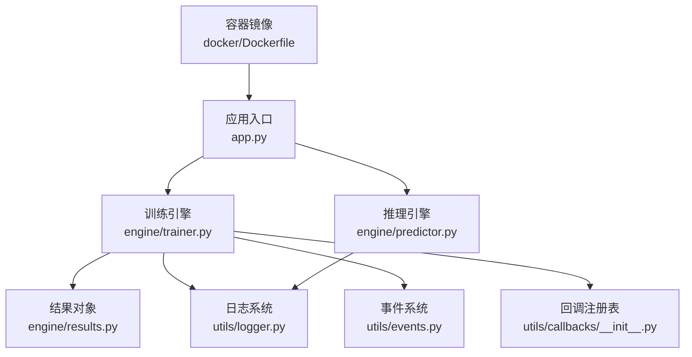
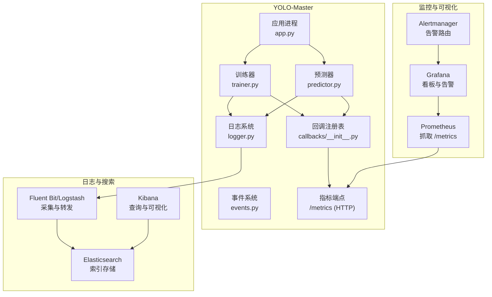
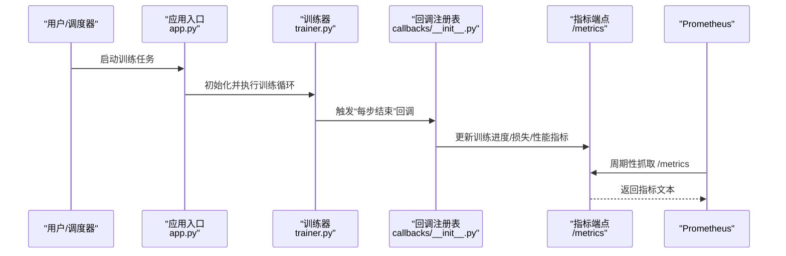
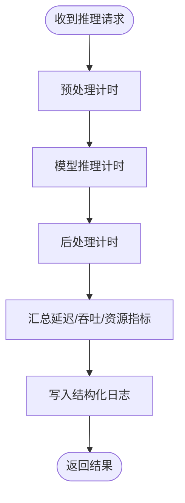
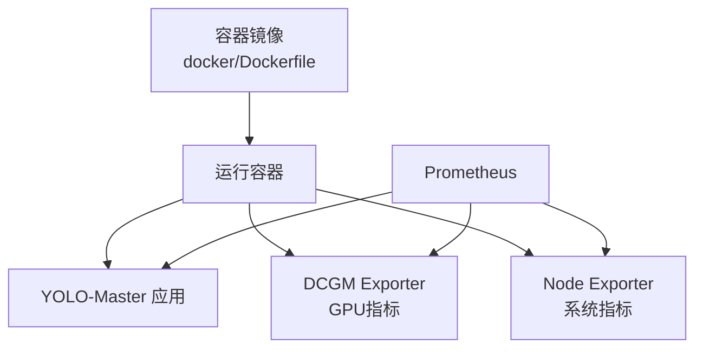
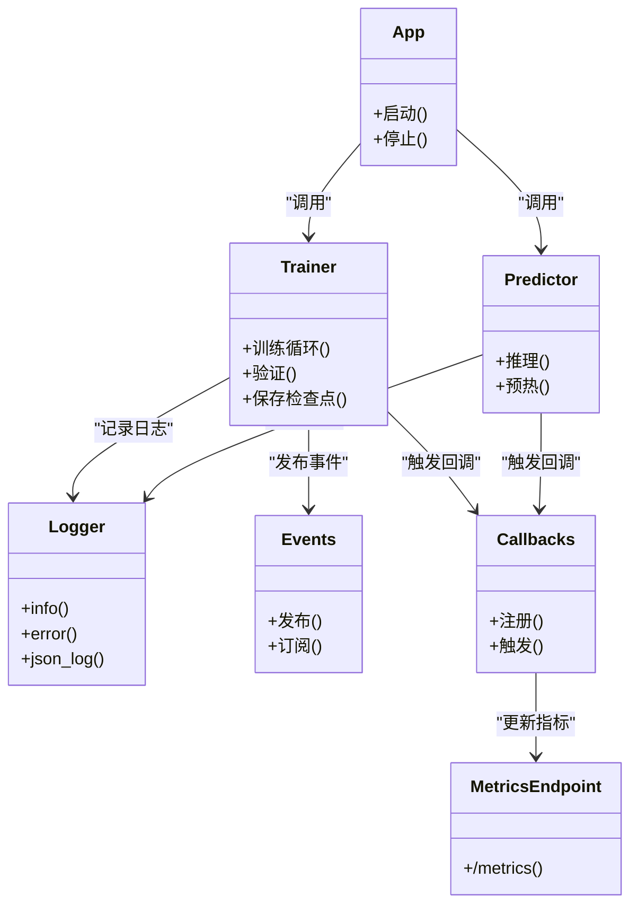

# 监控系统集成

<cite>
**本文引用的文件**
- [app.py](file://app.py)
- [Dockerfile](file://docker/Dockerfile)
- [pyproject.toml](file://pyproject.toml)
- [README.md](file://README.md)
- [model_monitoring_and_maintenance.md](file://docs/en/guides/model-monitoring-and-maintenance.md)
- [yolo_performance_metrics.md](file://docs/en/guides/yolo-performance-metrics.md)
- [trainer.py](file://ultralytics/engine/trainer.py)
- [predictor.py](file://ultralytics/engine/predictor.py)
- [results.py](file://ultralytics/engine/results.py)
- [logger.py](file://ultralytics/utils/logger.py)
- [events.py](file://ultralytics/utils/events.py)
- [callbacks/__init__.py](file://ultralytics/utils/callbacks/__init__.py)
</cite>

## 目录
1. [简介](#简介)
2. [项目结构](#项目结构)
3. [核心组件](#核心组件)
4. [架构总览](#架构总览)
5. [详细组件分析](#详细组件分析)
6. [依赖分析](#依赖分析)
7. [性能考虑](#性能考虑)
8. [故障诊断指南](#故障诊断指南)
9. [结论](#结论)
10. [附录](#附录)

## 简介
本文件面向YOLO-Master与监控系统的集成，目标是提供一套可落地的Prometheus、Grafana、ELK Stack（Elasticsearch、Logstash/Fluent Bit、Kibana）集成方案。内容覆盖：
- 关键指标采集：GPU利用率、显存使用、CPU/内存、训练进度、推理延迟与吞吐等
- 自定义指标定义与暴露方式（HTTP /metrics）
- 告警规则配置建议（Prometheus Alertmanager）
- 生产环境性能监控与故障诊断方法
- 容器化部署的监控配置示例（基于仓库中的Dockerfile）
- 日志管理与分析最佳实践（结构化日志、集中式收集、索引策略）

## 项目结构
从仓库视角看，与监控相关的关键位置包括：
- 应用入口与进程管理：应用主脚本位于根目录
- 训练与推理引擎：engine模块包含训练器、预测器等核心运行时
- 日志与事件：utils/logger.py与utils/events.py提供日志与事件能力
- 回调机制：utils/callbacks用于在训练/验证/导出等阶段注入钩子
- 文档：guides下包含模型监控与维护、性能指标等相关说明
- 容器镜像构建：docker/Dockerfile用于打包运行环境

图表来源
- [app.py](file://app.py)
- [trainer.py](file://ultralytics/engine/trainer.py)
- [predictor.py](file://ultralytics/engine/predictor.py)
- [results.py](file://ultralytics/engine/results.py)
- [logger.py](file://ultralytics/utils/logger.py)
- [events.py](file://ultralytics/utils/events.py)
- [callbacks/__init__.py](file://ultralytics/utils/callbacks/__init__.py)
- [Dockerfile](file://docker/Dockerfile)

章节来源
- [README.md](file://README.md)
- [model_monitoring_and_maintenance.md](file://docs/en/guides/model-monitoring-and-maintenance.md)
- [yolo_performance_metrics.md](file://docs/en/guides/yolo-performance-metrics.md)

## 核心组件
- 训练器（trainer.py）：负责训练生命周期、批次迭代、评估与保存检查点。适合在此处埋点训练进度、损失收敛、学习率变化、每步耗时等指标。
- 预测器（predictor.py）：负责推理流程，适合埋点推理延迟、吞吐、输入尺寸分布、批大小变化等指标。
- 结果对象（results.py）：封装单次推理或验证的结果，便于将指标与样本关联并输出到日志或外部系统。
- 日志系统（logger.py）：统一日志接口，支持结构化输出，便于被Fluent Bit/Logstash采集。
- 事件系统（events.py）：提供事件发布/订阅能力，可用于解耦指标上报逻辑。
- 回调机制（callbacks/__init__.py）：在训练/验证/导出等阶段插入自定义逻辑，是接入Prometheus指标上报的理想切入点。

章节来源
- [trainer.py](file://ultralytics/engine/trainer.py)
- [predictor.py](file://ultralytics/engine/predictor.py)
- [results.py](file://ultralytics/engine/results.py)
- [logger.py](file://ultralytics/utils/logger.py)
- [events.py](file://ultralytics/utils/events.py)
- [callbacks/__init__.py](file://ultralytics/utils/callbacks/__init__.py)

## 架构总览
下图展示YOLO-Master与监控栈的整体集成关系：应用通过回调和事件系统在训练/推理过程中采集指标；Prometheus定期抓取HTTP /metrics端点；Grafana消费Prometheus数据形成看板；ELK集中收集结构化日志并提供检索与分析。

图表来源
- [app.py](file://app.py)
- [trainer.py](file://ultralytics/engine/trainer.py)
- [predictor.py](file://ultralytics/engine/predictor.py)
- [logger.py](file://ultralytics/utils/logger.py)
- [events.py](file://ultralytics/utils/events.py)
- [callbacks/__init__.py](file://ultralytics/utils/callbacks/__init__.py)

## 详细组件分析

### 训练期指标采集与回调接入
- 目标指标
  - 训练进度：当前轮次、总轮次、步数、剩余时间估计
  - 损失与指标：各任务损失、mAP、精度、召回率
  - 资源占用：GPU利用率、显存峰值、CPU/内存使用、I/O等待
  - 性能：每步耗时、吞吐（样本/秒）、批大小、学习率
- 接入点
  - 在回调注册表中注册训练开始、每步结束、每轮结束、验证完成等钩子
  - 在事件系统中发布训练事件，供指标上报模块订阅
  - 通过日志系统输出结构化日志，便于ELK采集
- 指标暴露
  - 在应用内启动轻量HTTP服务，暴露/metrics端点，遵循Prometheus文本格式
  - 为每个指标设置合理标签（如任务类型、数据集、设备、批大小）

图表来源
- [app.py](file://app.py)
- [trainer.py](file://ultralytics/engine/trainer.py)
- [callbacks/__init__.py](file://ultralytics/utils/callbacks/__init__.py)

章节来源
- [trainer.py](file://ultralytics/engine/trainer.py)
- [callbacks/__init__.py](file://ultralytics/utils/callbacks/__init__.py)

### 推理期指标采集与延迟追踪
- 目标指标
  - 延迟：端到端延迟、预处理/模型推理/后处理分段延迟
  - 吞吐：QPS、并发度、批大小
  - 资源：GPU/CPU利用率、显存占用、内存峰值
  - 质量：置信度分布、类别分布、失败率
- 接入点
  - 在预测器中记录请求进入/离开时间，计算延迟分位数
  - 在回调中根据输入尺寸动态调整批大小，记录自适应行为
  - 将结果对象（results.py）中的关键信息写入结构化日志

图表来源
- [predictor.py](file://ultralytics/engine/predictor.py)
- [results.py](file://ultralytics/engine/results.py)
- [logger.py](file://ultralytics/utils/logger.py)

章节来源
- [predictor.py](file://ultralytics/engine/predictor.py)
- [results.py](file://ultralytics/engine/results.py)
- [logger.py](file://ultralytics/utils/logger.py)

### 日志系统与ELK集成
- 结构化日志
  - 使用统一的日志接口输出JSON格式，包含字段：时间戳、级别、模块、任务ID、指标键值对
  - 避免在日志中输出敏感信息（密钥、完整图像路径等）
- 采集与转发
  - 在容器内安装Fluent Bit或Logstash，监听应用日志目录或stdout/stderr
  - 将日志转发至Elasticsearch，按日期或业务维度建立索引
- 可视化与分析
  - 在Kibana中创建仪表盘，聚合错误率、延迟分布、资源异常等
  - 设置告警规则，当错误率或延迟超过阈值时通知运维

图表来源
- [logger.py](file://ultralytics/utils/logger.py)

章节来源
- [logger.py](file://ultralytics/utils/logger.py)

### 容器化部署的监控配置示例
- 镜像构建
  - 基于仓库提供的Dockerfile进行扩展，安装必要的监控代理（如node_exporter、nvidia-dcgm-exporter）
  - 将应用指标端点与系统指标端点暴露给Prometheus
- 环境变量与端口
  - 通过环境变量控制指标采样频率、日志级别、是否启用监控
  - 确保容器网络允许Prometheus访问/metrics端口
- 健康检查与就绪探针
  - 在编排平台（如Kubernetes）中配置liveness/readiness探针，结合指标端点判断服务状态

图表来源
- [Dockerfile](file://docker/Dockerfile)

章节来源
- [Dockerfile](file://docker/Dockerfile)

## 依赖分析
- 内部依赖
  - 应用入口依赖训练器与预测器，二者均依赖日志与事件系统
  - 回调注册表作为横切关注点，贯穿训练与推理流程
- 外部依赖
  - Prometheus抓取HTTP /metrics端点
  - Fluent Bit/Logstash采集日志并转发至Elasticsearch
  - Grafana连接Prometheus与Elasticsearch进行可视化
- 耦合与内聚
  - 通过回调与事件系统降低指标上报与核心逻辑的耦合
  - 日志系统统一抽象，提升可观测性的一致性

图表来源
- [app.py](file://app.py)
- [trainer.py](file://ultralytics/engine/trainer.py)
- [predictor.py](file://ultralytics/engine/predictor.py)
- [logger.py](file://ultralytics/utils/logger.py)
- [events.py](file://ultralytics/utils/events.py)
- [callbacks/__init__.py](file://ultralytics/utils/callbacks/__init__.py)

章节来源
- [app.py](file://app.py)
- [trainer.py](file://ultralytics/engine/trainer.py)
- [predictor.py](file://ultralytics/engine/predictor.py)
- [logger.py](file://ultralytics/utils/logger.py)
- [events.py](file://ultralytics/utils/events.py)
- [callbacks/__init__.py](file://ultralytics/utils/callbacks/__init__.py)

## 性能考虑
- 指标采样频率
  - 训练期：每步或每N步上报一次，避免过高频率影响训练吞吐
  - 推理期：按请求粒度上报延迟，聚合为滑动窗口统计
- 标签基数控制
  - 为指标添加必要标签（任务、数据集、设备），但避免高基数字段（如随机ID）
- 资源开销
  - 指标上报应异步执行，避免阻塞主流程
  - 日志写入采用批量或异步模式，减少IO抖动
- 容量规划
  - 预估指标数量与保留周期，合理配置Prometheus存储与滚动策略
  - 日志索引按天滚动，设置冷热分层与TTL策略

[本节为通用指导，不直接分析具体文件]

## 故障诊断指南
- 常见问题定位
  - GPU利用率低：检查批大小、数据加载瓶颈、模型并行策略
  - 显存泄漏：观察显存曲线是否单调增长，排查未释放的张量或缓存
  - 训练不稳定：关注损失震荡、梯度爆炸/消失、学习率过大
  - 推理延迟突增：检查队列积压、GC停顿、磁盘IO争用
- 诊断步骤
  - 查看Grafana看板：对比历史基线，识别异常时段
  - 检索Kibana日志：过滤错误级别与关键模块，定位堆栈信息
  - 核对Prometheus指标：确认指标端点可达性与数据新鲜度
  - 复现实验：固定随机种子与输入分布，缩小问题范围
- 告警建议
  - 训练损失连续上升或停滞
  - 推理P99延迟超过阈值
  - GPU显存使用接近上限
  - 错误率或重试率异常升高

章节来源
- [model_monitoring_and_maintenance.md](file://docs/en/guides/model-monitoring-and-maintenance.md)
- [yolo_performance_metrics.md](file://docs/en/guides/yolo-performance-metrics.md)

## 结论
通过在训练与推理关键路径上接入回调与事件系统，并结合结构化日志与HTTP指标端点，YOLO-Master可以无缝对接Prometheus、Grafana与ELK Stack，实现全面的可观测性。在生产环境中，建议严格控制指标标签基数与采样频率，配合合理的告警规则与日志索引策略，保障稳定性与可维护性。

[本节为总结，不直接分析具体文件]

## 附录
- 指标清单建议
  - 训练：epoch、step、loss_*、map、precision、recall、lr、step_time、throughput、gpu_util、gpu_mem_used、cpu_usage、mem_usage
  - 推理：latency_p50/p90/p99、qps、batch_size、input_shape、confidence_dist、failure_rate
- 告警规则示例（描述性）
  - 当连续N分钟训练损失高于阈值且无下降趋势时触发
  - 当推理P99延迟超过SLO的1.5倍持续M分钟时触发
  - 当GPU显存使用超过阈值的90%持续K分钟时触发
- 容器化要点
  - 在镜像中安装必要的Exporter与日志采集器
  - 通过环境变量控制监控开关与参数
  - 在编排平台配置探针与资源限制

[本节为补充信息，不直接分析具体文件]