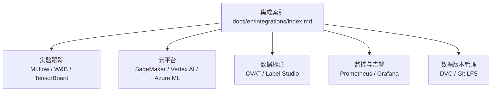
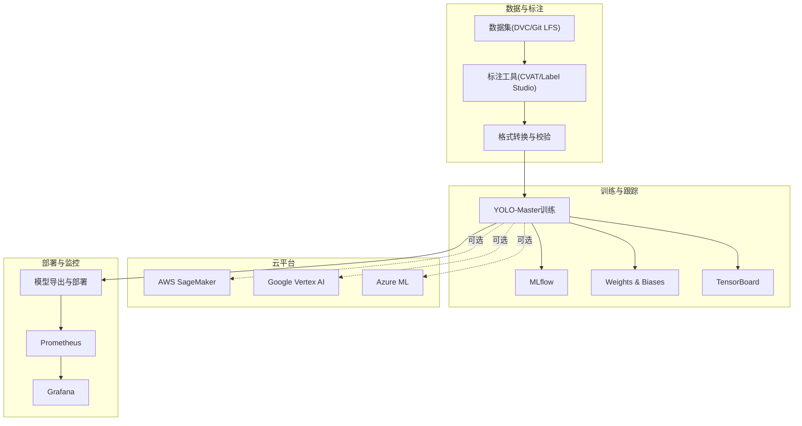
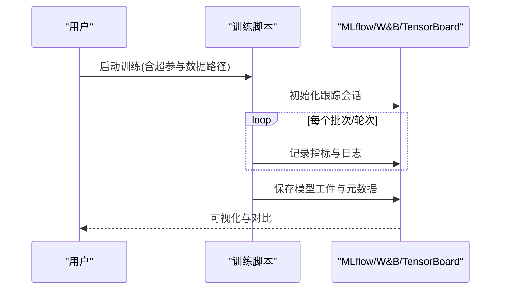
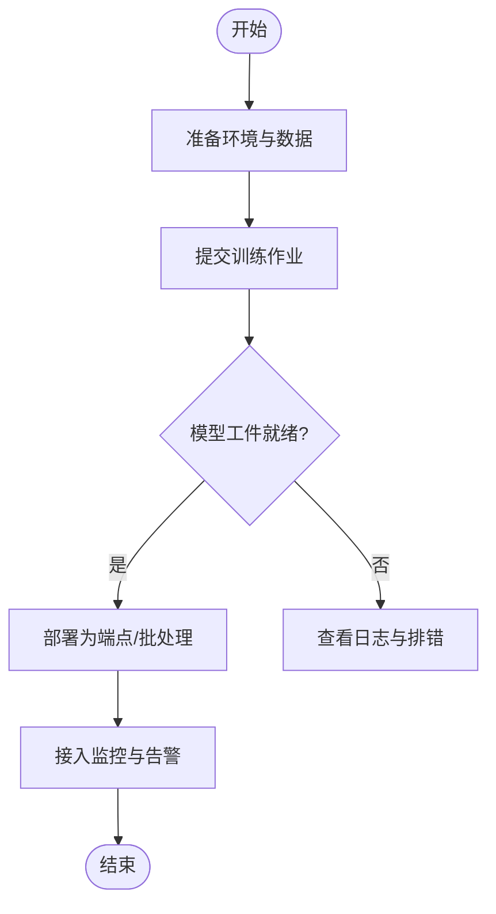
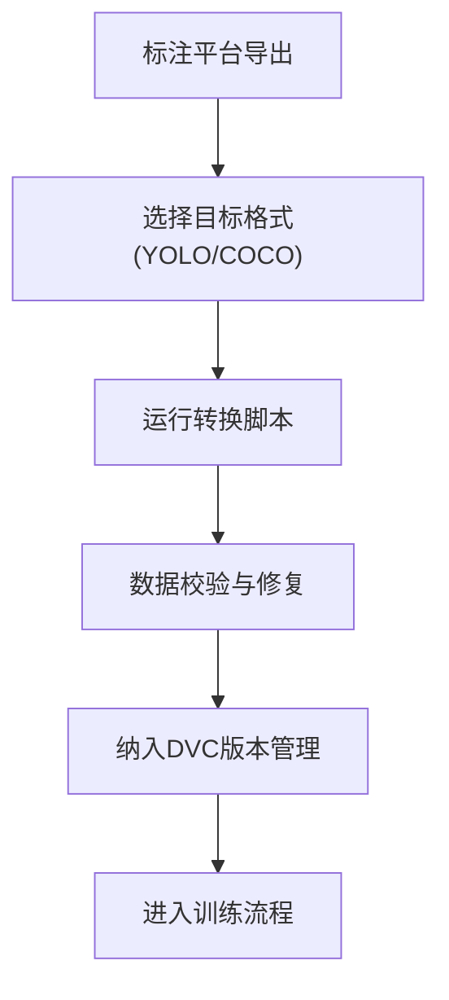
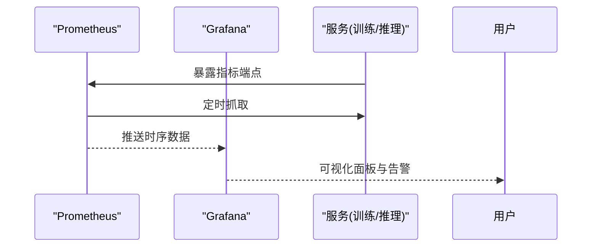
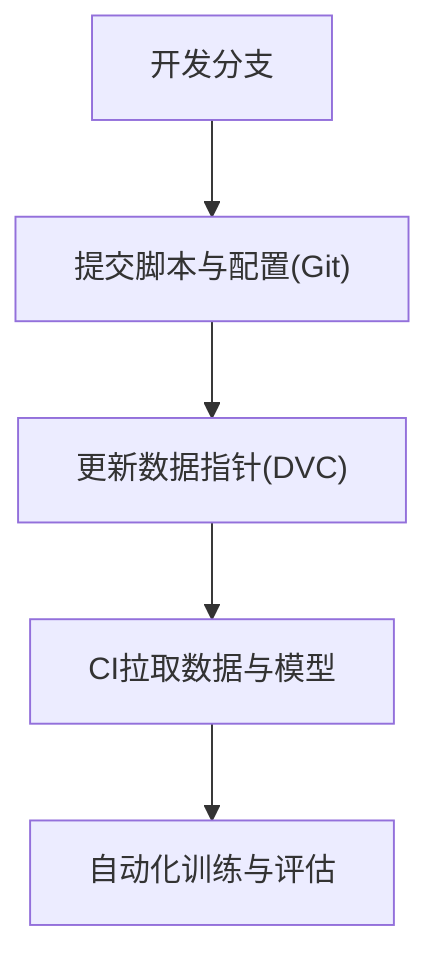
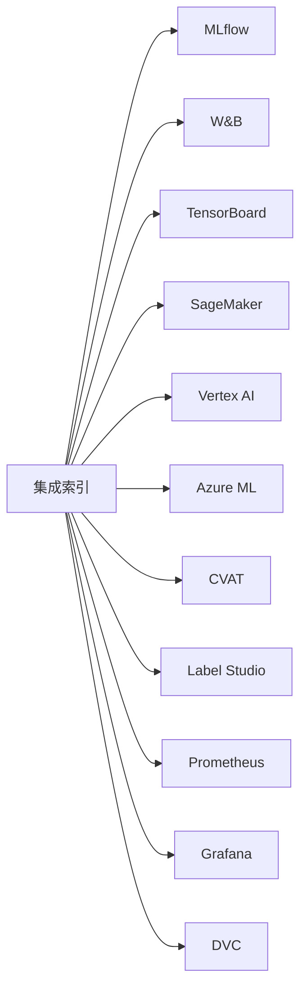

# 第三方工具集成

<cite>
**本文引用的文件**
- [integrations/index.md](file://docs/en/integrations/index.md)
- [mlflow.md](file://docs/en/integrations/mlflow.md)
- [tensorboard.md](file://docs/en/integrations/tensorboard.md)
- [weights-biases.md](file://docs/en/integrations/weights-biases.md)
- [amazon-sagemaker.md](file://docs/en/integrations/amazon-sagemaker.md)
- [vertex-ai-deployment-with-docker.md](file://docs/en/guides/vertex-ai-deployment-with-docker.md)
- [azureml-quickstart.md](file://docs/en/guides/azureml-quickstart.md)
- [dvc.md](file://docs/en/integrations/dvc.md)
- [model-monitoring-and-maintenance.md](file://docs/en/guides/model-monitoring-and-maintenance.md)
- [data-collection-and-annotation.md](file://docs/en/guides/data-collection-and-annotation.md)
- [prometheus.md](file://docs/en/integrations/prometheus.md)
- [grafana.md](file://docs/en/integrations/grafana.md)
- [cvat.md](file://docs/en/integrations/cvat.md)
- [label-studio.md](file://docs/en/integrations/label-studio.md)
</cite>

## 目录
1. [简介](#简介)
2. [项目结构](#项目结构)
3. [核心组件](#核心组件)
4. [架构总览](#架构总览)
5. [详细组件分析](#详细组件分析)
6. [依赖分析](#依赖分析)
7. [性能考虑](#性能考虑)
8. [故障排除指南](#故障排除指南)
9. [结论](#结论)
10. [附录](#附录)

## 简介
本文件面向希望在YOLO-Master工作流中引入主流MLOps、云平台、数据标注与监控工具的工程师与研究者，提供端到端的集成指南。内容覆盖：
- 实验跟踪与可视化：MLflow、Weights & Biases、TensorBoard
- 云平台训练与部署：AWS SageMaker、Google Vertex AI、Azure ML
- 数据标注工具：CVAT、Label Studio的数据格式转换与处理流程
- 监控与告警：Prometheus、Grafana的指标采集与告警配置
- 版本控制与协作：Git LFS、DVC的数据管理方案
- 完整配置示例与常见问题排查

## 项目结构
YOLO-Master在文档层提供了丰富的集成说明，便于快速上手与深度定制。关键位置如下：
- 集成索引与入口：docs/en/integrations/index.md
- MLOps与可视化：docs/en/integrations/mlflow.md、docs/en/integrations/weights-biases.md、docs/en/integrations/tensorboard.md
- 云平台：docs/en/integrations/amazon-sagemaker.md、docs/en/guides/vertex-ai-deployment-with-docker.md、docs/en/guides/azureml-quickstart.md
- 数据标注：docs/en/guides/data-collection-and-annotation.md（并配合各标注平台文档）
- 监控与可观测性：docs/en/guides/model-monitoring-and-maintenance.md（结合Prometheus/Grafana文档）
- 数据版本管理：docs/en/integrations/dvc.md

[本节为概览性描述，不直接分析具体代码文件]

## 核心组件
- 实验跟踪与可视化
  - MLflow：记录超参、指标、模型工件，支持追踪对比与模型注册
  - Weights & Biases：实时可视化训练曲线、参数扫描、结果分享
  - TensorBoard：训练日志可视化，适合本地或集群环境
- 云平台训练与部署
  - AWS SageMaker：托管训练与推理，支持容器化与弹性扩缩容
  - Google Vertex AI：统一机器学习平台，支持Notebook、训练作业与端点部署
  - Azure ML：企业级云ML服务，支持数据集版本、流水线与模型注册
- 数据标注与格式转换
  - CVAT、Label Studio：标注产出到YOLO格式的转换与校验
- 监控与告警
  - Prometheus + Grafana：采集GPU/CPU/内存等系统指标与业务指标，设置阈值告警
- 数据版本管理
  - DVC：大文件与数据集版本化；Git LFS：二进制大对象存储

**章节来源**
- [integrations/index.md](file://docs/en/integrations/index.md)

## 架构总览
下图展示从数据准备、训练、评估、导出到部署与监控的整体集成视图。

[本图为概念性架构图，未映射到具体源码文件]

## 详细组件分析

### 实验跟踪与可视化（MLflow、Weights & Biases、TensorBoard）
- 目标
  - 记录每次训练的超参、指标、日志与模型权重
  - 支持多实验对比、复现与归档
- 典型流程
  - 启动训练时初始化跟踪器
  - 每步/每轮记录指标与中间产物
  - 结束训练后上传模型工件与元数据
- 可视化
  - MLflow UI：实验列表、参数-指标散点图、模型注册表
  - W&B Dashboard：实时曲线、超参搜索、报告导出
  - TensorBoard：损失曲线、混淆矩阵、分布直方图等

**章节来源**
- [mlflow.md](file://docs/en/integrations/mlflow.md)
- [weights-biases.md](file://docs/en/integrations/weights-biases.md)
- [tensorboard.md](file://docs/en/integrations/tensorboard.md)

### 云平台集成（AWS SageMaker、Google Vertex AI、Azure ML）
- 目标
  - 在云上完成数据准备、分布式训练、模型注册与在线/离线部署
- 通用步骤
  - 准备容器镜像或运行环境
  - 定义训练作业与资源规格
  - 将数据集挂载至训练实例
  - 输出模型工件至云存储
  - 创建推理端点或批处理任务
- 平台要点
  - SageMaker：使用内置算法或自定义容器，配合S3进行数据与模型存取
  - Vertex AI：通过Notebook或Training Job运行，Artifact Registry管理镜像
  - Azure ML：使用数据集版本、Compute Target与Pipeline编排

**章节来源**
- [amazon-sagemaker.md](file://docs/en/integrations/amazon-sagemaker.md)
- [vertex-ai-deployment-with-docker.md](file://docs/en/guides/vertex-ai-deployment-with-docker.md)
- [azureml-quickstart.md](file://docs/en/guides/azureml-quickstart.md)

### 数据标注工具集成（CVAT、Label Studio）
- 目标
  - 将CVAT/Label Studio导出的标注转换为YOLO格式，并进行一致性校验
- 典型流程
  - 在标注平台导出数据集（如COCO/JSON/YOLO）
  - 运行格式转换脚本，生成YOLO所需的图像与标签目录结构
  - 执行数据校验（类别映射、边界框有效性、缺失检查）
  - 将转换后的数据纳入DVC版本管理
- 注意事项
  - 确保类别ID与名称一致
  - 处理空标签与异常样本
  - 保持训练/验证/测试划分稳定

**章节来源**
- [data-collection-and-annotation.md](file://docs/en/guides/data-collection-and-annotation.md)
- [cvat.md](file://docs/en/integrations/cvat.md)
- [label-studio.md](file://docs/en/integrations/label-studio.md)

### 监控与告警（Prometheus、Grafana）
- 目标
  - 采集训练与推理阶段的系统指标与业务指标，建立可视化面板与告警规则
- 指标范围
  - 系统：CPU、内存、GPU利用率、显存占用、I/O吞吐
  - 训练：损失、学习率、梯度范数、吞吐
  - 推理：QPS、延迟分位、错误率、缓存命中率
- 实施要点
  - 在训练/推理进程暴露指标端点
  - Prometheus抓取指标，Grafana构建看板
  - 基于阈值与趋势设置告警（邮件/Slack/钉钉）

**章节来源**
- [model-monitoring-and-maintenance.md](file://docs/en/guides/model-monitoring-and-maintenance.md)
- [prometheus.md](file://docs/en/integrations/prometheus.md)
- [grafana.md](file://docs/en/integrations/grafana.md)

### 数据版本管理与协作（DVC、Git LFS）
- 目标
  - 对大规模数据集与模型权重进行版本化管理，保障可复现性与团队协作
- 实践建议
  - 使用DVC管理数据与中间产物，Git仅保留元数据与脚本
  - 使用Git LFS管理大型二进制文件（如预训练权重）
  - 在CI/CD中拉取指定版本的数据与模型，保证一致性

**章节来源**
- [dvc.md](file://docs/en/integrations/dvc.md)

## 依赖分析
- 集成入口与导航
  - 集成索引页聚合了所有外部工具的使用指南，作为统一入口
- 模块耦合关系
  - 训练阶段与跟踪器松耦合：通过回调或CLI参数启用不同跟踪后端
  - 云平台以容器/作业形式解耦：镜像与作业定义独立于训练代码
  - 监控以指标端点解耦：无需侵入核心逻辑即可接入
- 潜在风险
  - 网络与权限：云端访问密钥、存储桶策略、镜像仓库鉴权
  - 数据一致性：跨平台路径与命名规范差异
  - 版本漂移：依赖库与框架版本需锁定

**章节来源**
- [integrations/index.md](file://docs/en/integrations/index.md)

## 性能考虑
- 训练阶段
  - 合理设置批大小与混合精度，避免OOM
  - 使用数据并行与异步I/O提升吞吐
  - 开启早停与学习率调度减少无效计算
- 监控阶段
  - 采样频率与指标粒度平衡，避免过度采集影响性能
  - 对高频指标做降采样与聚合
- 部署阶段
  - 模型量化与算子优化降低延迟
  - 批处理与动态批提高吞吐
  - 缓存热点数据与中间结果

[本节为通用指导，不直接分析具体代码文件]

## 故障排除指南
- 实验跟踪
  - 无法连接跟踪后端：检查网络、代理与凭据
  - 指标丢失：确认记录时机与事件写入权限
- 云平台
  - 训练失败：查看作业日志、资源配额与磁盘空间
  - 部署失败：检查镜像可达性、端口与环境变量
- 数据标注
  - 格式不一致：核对类别映射与坐标归一化
  - 缺失文件：校验路径与文件名大小写
- 监控告警
  - 指标未上报：确认端点可达与抓取间隔
  - 误报过多：调整阈值与窗口长度

**章节来源**
- [model-monitoring-and-maintenance.md](file://docs/en/guides/model-monitoring-and-maintenance.md)

## 结论
通过将YOLO-Master与主流MLOps、云平台、标注工具与监控系统集成，可以显著提升实验效率、可复现性与工程化水平。建议以“最小可行集成”起步，逐步完善数据版本、监控与部署闭环，并在团队内沉淀最佳实践与模板。

[本节为总结性内容，不直接分析具体代码文件]

## 附录
- 常用命令与配置清单（按平台与工具分类）
- 参考链接与官方文档索引
- 术语表与符号约定

[本节为补充信息，不直接分析具体代码文件]