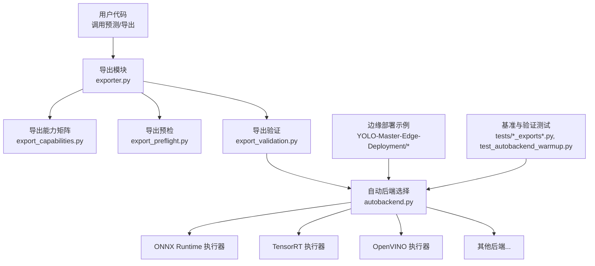
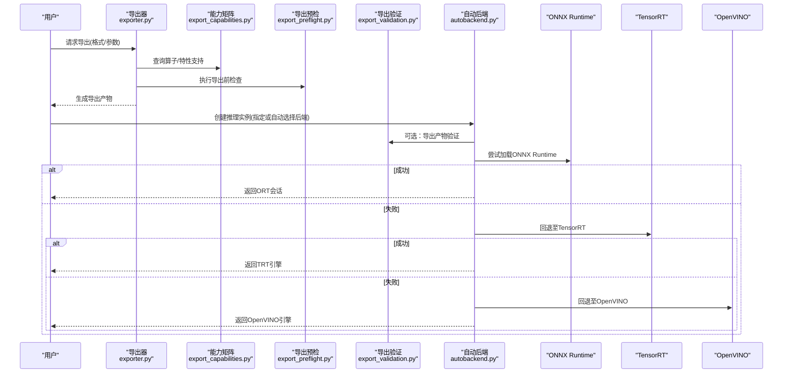
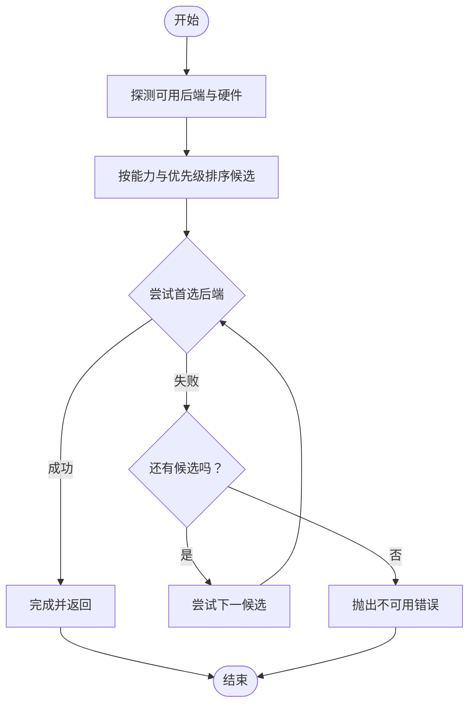
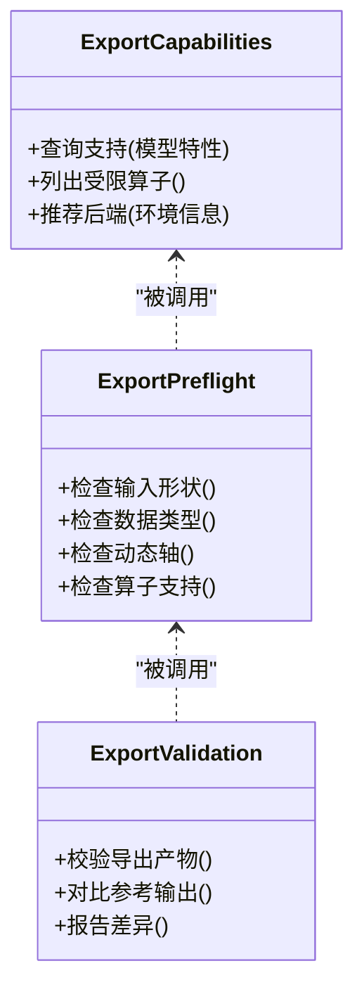
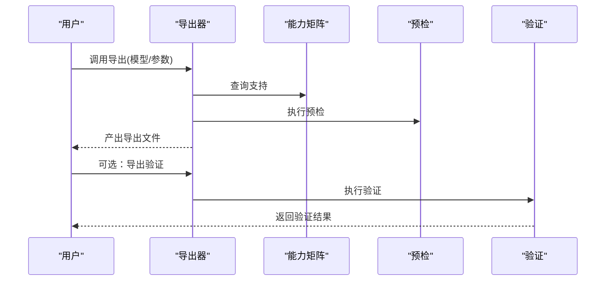
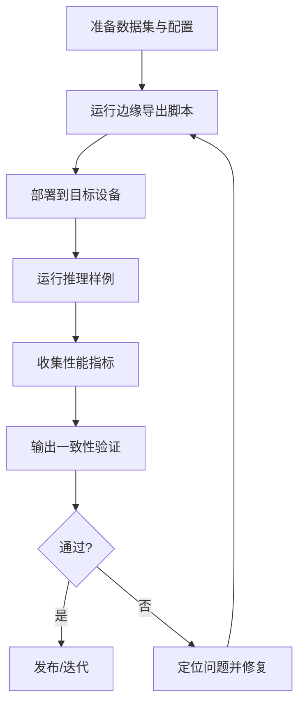
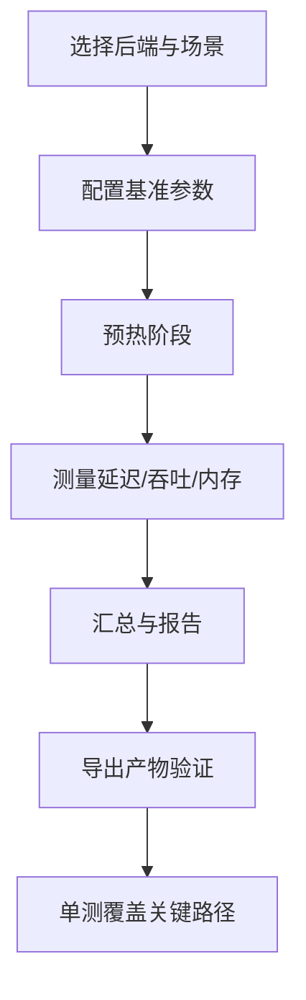
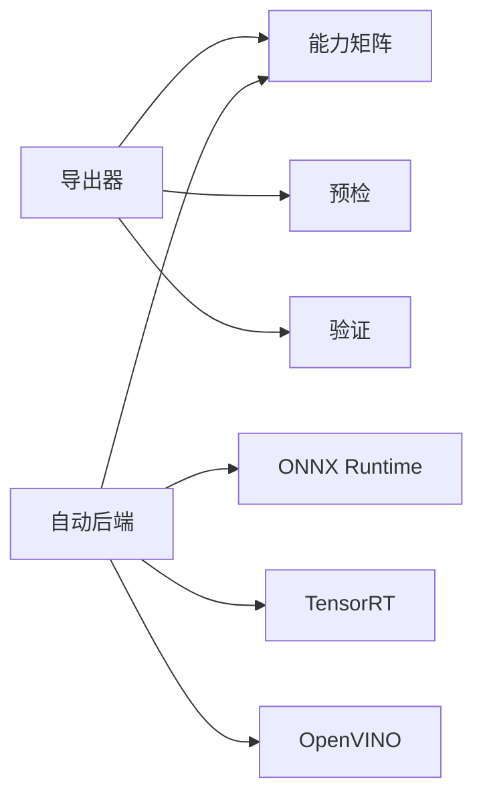

# 后端适配器开发

<cite>
**本文引用的文件**
- [autobackend.py](file://ultralytics/nn/autobackend.py)
- [exporter.py](file://ultralytics/engine/exporter.py)
- [export_capabilities.py](file://ultralytics/utils/export_capabilities.py)
- [export_preflight.py](file://ultralytics/utils/export_preflight.py)
- [export_validation.py](file://ultralytics/utils/export_validation.py)
- [benchmarks.py](file://ultralytics/utils/benchmarks.py)
- [test_autobackend_warmup.py](file://tests/test_autobackend_warmup.py)
- [test_export_capability_matrix.py](file://tests/test_export_capability_matrix.py)
- [test_export_preflight.py](file://tests/test_export_preflight.py)
- [test_exports.py](file://tests/test_exports.py)
- [test_edge_deployment_utils.py](file://tests/test_edge_deployment_utils.py)
- [README.md](file://examples/YOLO-Master-Edge-Deployment/README.md)
- [edge_utils.py](file://examples/YOLO-Master-Edge-Deployment/edge_utils.py)
- [export_edge_models.py](file://examples/YOLO-Master-Edge-Deployment/export_edge_models.py)
- [validate_edge_outputs.py](file://examples/YOLO-Master-Edge-Deployment/validate_edge_outputs.py)
</cite>

## 目录
1. [简介](#简介)
2. [项目结构](#项目结构)
3. [核心组件](#核心组件)
4. [架构总览](#架构总览)
5. [详细组件分析](#详细组件分析)
6. [依赖关系分析](#依赖关系分析)
7. [性能考量](#性能考量)
8. [故障排查指南](#故障排查指南)
9. [结论](#结论)
10. [附录](#附录)

## 简介
本指南面向希望为 YOLO 推理系统新增“推理后端适配器”的开发者，覆盖从接口抽象、ONNX Runtime/TensorRT/OpenVINO 等框架集成、模型导出与优化（含算子支持与精度校准）、边缘设备适配（ARM/GPU/专用加速器）、后端选择与自动回退策略、性能基准与兼容性验证工具使用，到内存管理与资源调优的最佳实践。文档同时提供可复用的适配器模板与开发环境搭建建议，帮助快速落地新后端。

## 项目结构
本项目在推理后端相关能力上采用“统一导出 + 自动后端选择 + 多后端执行”的分层设计：
- 导出与预检：负责将 PyTorch 模型转换为中间格式（如 ONNX），并进行能力矩阵校验与导出前检查。
- 自动后端选择：根据目标平台、可用库与模型能力，动态选择最优后端并支持回退。
- 执行器：封装各后端的加载、预热、推理、结果解析与资源管理。
- 测试与示例：提供端到端导出、边缘部署与验证脚本，以及针对自动后端与导出能力的单元测试。

图表来源
- [exporter.py](file://ultralytics/engine/exporter.py)
- [export_capabilities.py](file://ultralytics/utils/export_capabilities.py)
- [export_preflight.py](file://ultralytics/utils/export_preflight.py)
- [export_validation.py](file://ultralytics/utils/export_validation.py)
- [autobackend.py](file://ultralytics/nn/autobackend.py)
- [README.md](file://examples/YOLO-Master-Edge-Deployment/README.md)
- [test_autobackend_warmup.py](file://tests/test_autobackend_warmup.py)
- [test_export_capability_matrix.py](file://tests/test_export_capability_matrix.py)
- [test_export_preflight.py](file://tests/test_export_preflight.py)
- [test_exports.py](file://tests/test_exports.py)

章节来源
- [exporter.py](file://ultralytics/engine/exporter.py)
- [autobackend.py](file://ultralytics/nn/autobackend.py)
- [README.md](file://examples/YOLO-Master-Edge-Deployment/README.md)

## 核心组件
- 导出与能力矩阵
  - 负责将模型导出为目标格式，并在导出前/后进行能力校验与验证，确保目标后端能正确运行模型。
  - 关键职责：导出参数解析、图转换、算子支持判定、导出产物校验。
- 自动后端选择
  - 基于运行时环境与能力矩阵，选择最优后端；当首选失败时，按优先级回退到其他可用后端。
  - 关键职责：环境探测、能力匹配、加载与初始化、错误恢复与回退。
- 边缘部署工具链
  - 提供导出脚本、边缘端推理样例与输出一致性验证工具，便于在 ARM/GPU/专用加速器上进行部署与回归验证。
- 基准与测试
  - 提供端到端导出与自动后端选择的单测，以及边缘部署工具的单测，保障功能稳定与兼容。

章节来源
- [exporter.py](file://ultralytics/engine/exporter.py)
- [export_capabilities.py](file://ultralytics/utils/export_capabilities.py)
- [export_preflight.py](file://ultralytics/utils/export_preflight.py)
- [export_validation.py](file://ultralytics/utils/export_validation.py)
- [autobackend.py](file://ultralytics/nn/autobackend.py)
- [edge_utils.py](file://examples/YOLO-Master-Edge-Deployment/edge_utils.py)
- [export_edge_models.py](file://examples/YOLO-Master-Edge-Deployment/export_edge_models.py)
- [validate_edge_outputs.py](file://examples/YOLO-Master-Edge-Deployment/validate_edge_outputs.py)
- [test_autobackend_warmup.py](file://tests/test_autobackend_warmup.py)
- [test_export_capability_matrix.py](file://tests/test_export_capability_matrix.py)
- [test_export_preflight.py](file://tests/test_export_preflight.py)
- [test_exports.py](file://tests/test_exports.py)

## 架构总览
下图展示了从“导出”到“自动后端选择与执行”的整体流程，以及边缘部署与测试验证的接入点。

图表来源
- [exporter.py](file://ultralytics/engine/exporter.py)
- [export_capabilities.py](file://ultralytics/utils/export_capabilities.py)
- [export_preflight.py](file://ultralytics/utils/export_preflight.py)
- [export_validation.py](file://ultralytics/utils/export_validation.py)
- [autobackend.py](file://ultralytics/nn/autobackend.py)

## 详细组件分析

### 自动后端选择与回退机制
- 设计要点
  - 环境探测：检测可用库（如 onnxruntime、tensorrt、openvino）及硬件能力（CPU/GPU/NPU）。
  - 能力匹配：结合导出能力矩阵与模型特性，筛选候选后端。
  - 加载与预热：优先尝试首选后端，失败则按优先级回退；对选定后端进行必要预热以稳定延迟。
  - 错误处理：捕获导入缺失、版本不兼容、算子不支持等异常，记录诊断信息并触发回退。
- 典型流程
  - 用户传入目标后端或留空由系统自动选择。
  - 若未显式指定，系统依据能力矩阵与环境探测结果排序候选。
  - 依次尝试加载，任一阶段失败即进入下一个候选。
  - 成功后返回统一接口供上层调用。

图表来源
- [autobackend.py](file://ultralytics/nn/autobackend.py)

章节来源
- [autobackend.py](file://ultralytics/nn/autobackend.py)
- [test_autobackend_warmup.py](file://tests/test_autobackend_warmup.py)

### 导出与能力矩阵
- 能力矩阵
  - 维护不同后端对模型特性（输入形状、数据类型、算子集）的支持情况，用于导出前评估与运行时选择。
- 导出预检
  - 在导出前检查输入维度、数据类型、动态轴配置、算子是否受支持等，避免无效导出。
- 导出验证
  - 对导出的中间产物进行基本校验（如形状、数值范围、关键节点存在性），降低运行时失败概率。
- 最佳实践
  - 为新后端添加能力条目，明确支持的输入/输出约束与已知限制。
  - 在导出参数中暴露必要的优化开关（如精度、图优化级别、内核选择）。

图表来源
- [export_capabilities.py](file://ultralytics/utils/export_capabilities.py)
- [export_preflight.py](file://ultralytics/utils/export_preflight.py)
- [export_validation.py](file://ultralytics/utils/export_validation.py)

章节来源
- [export_capabilities.py](file://ultralytics/utils/export_capabilities.py)
- [export_preflight.py](file://ultralytics/utils/export_preflight.py)
- [export_validation.py](file://ultralytics/utils/export_validation.py)
- [test_export_capability_matrix.py](file://tests/test_export_capability_matrix.py)
- [test_export_preflight.py](file://tests/test_export_preflight.py)

### 导出器与执行入口
- 导出器
  - 负责将训练好的模型转换为目标格式（如 ONNX），并根据能力矩阵与预检结果调整导出选项。
  - 支持批量导出、分步导出与增量更新，便于在不同平台上并行构建。
- 执行入口
  - 对外暴露统一的预测接口，内部通过自动后端选择器获取具体执行器。
  - 对常见任务（检测、分割、姿态等）提供标准化输入/输出协议。

图表来源
- [exporter.py](file://ultralytics/engine/exporter.py)
- [export_capabilities.py](file://ultralytics/utils/export_capabilities.py)
- [export_preflight.py](file://ultralytics/utils/export_preflight.py)
- [export_validation.py](file://ultralytics/utils/export_validation.py)

章节来源
- [exporter.py](file://ultralytics/engine/exporter.py)
- [test_exports.py](file://tests/test_exports.py)

### 边缘设备适配与部署
- 适配方法
  - 使用边缘部署示例中的导出脚本，针对不同目标（ARM CPU、NVIDIA Jetson、RKNN、CoreML 等）生成优化后的模型。
  - 利用边缘端推理样例进行端到端验证，并通过输出一致性工具比对与参考实现的结果。
- 关键步骤
  - 准备数据与配置文件，设置目标平台与优化选项。
  - 执行导出脚本生成目标格式模型。
  - 在目标设备上安装对应运行时与依赖。
  - 运行推理样例并收集指标（吞吐、延迟、内存占用）。
  - 使用验证工具对比输出，确保精度与稳定性。
- 注意事项
  - 关注动态尺寸与静态尺寸的取舍，必要时固定输入形状以提升性能。
  - 针对 NPU/GPU 启用相应优化开关（如量化、内核融合、批大小）。

图表来源
- [README.md](file://examples/YOLO-Master-Edge-Deployment/README.md)
- [edge_utils.py](file://examples/YOLO-Master-Edge-Deployment/edge_utils.py)
- [export_edge_models.py](file://examples/YOLO-Master-Edge-Deployment/export_edge_models.py)
- [validate_edge_outputs.py](file://examples/YOLO-Master-Edge-Deployment/validate_edge_outputs.py)
- [test_edge_deployment_utils.py](file://tests/test_edge_deployment_utils.py)

章节来源
- [README.md](file://examples/YOLO-Master-Edge-Deployment/README.md)
- [edge_utils.py](file://examples/YOLO-Master-Edge-Deployment/edge_utils.py)
- [export_edge_models.py](file://examples/YOLO-Master-Edge-Deployment/export_edge_models.py)
- [validate_edge_outputs.py](file://examples/YOLO-Master-Edge-Deployment/validate_edge_outputs.py)
- [test_edge_deployment_utils.py](file://tests/test_edge_deployment_utils.py)

### 性能基准与兼容性验证
- 基准工具
  - 提供统一的基准入口，支持对不同后端进行延迟、吞吐与资源占用的测量。
  - 可配置批次大小、输入分辨率、重复次数与预热轮次，以获得稳定的统计结果。
- 兼容性验证
  - 通过导出能力矩阵与导出预检/验证，确保模型在不同后端上的行为一致。
  - 使用单测套件覆盖关键路径，包括自动后端预热、导出能力矩阵、导出预检与端到端导出。

图表来源
- [benchmarks.py](file://ultralytics/utils/benchmarks.py)
- [test_autobackend_warmup.py](file://tests/test_autobackend_warmup.py)
- [test_export_capability_matrix.py](file://tests/test_export_capability_matrix.py)
- [test_export_preflight.py](file://tests/test_export_preflight.py)
- [test_exports.py](file://tests/test_exports.py)

章节来源
- [benchmarks.py](file://ultralytics/utils/benchmarks.py)
- [test_autobackend_warmup.py](file://tests/test_autobackend_warmup.py)
- [test_export_capability_matrix.py](file://tests/test_export_capability_matrix.py)
- [test_export_preflight.py](file://tests/test_export_preflight.py)
- [test_exports.py](file://tests/test_exports.py)

## 依赖关系分析
- 组件耦合
  - 导出器依赖能力矩阵与预检/验证模块，形成“导出前评估—导出—导出后验证”的闭环。
  - 自动后端选择器依赖能力矩阵与环境探测结果，决定最终执行器。
- 外部依赖
  - ONNX Runtime、TensorRT、OpenVINO 等第三方运行时按需加载，失败时回退。
- 潜在风险
  - 版本不兼容导致导入失败或运行时崩溃，需在能力矩阵中明确最低版本要求。
  - 算子缺失或不支持需在前置检查中拦截，避免浪费导出时间。

图表来源
- [exporter.py](file://ultralytics/engine/exporter.py)
- [export_capabilities.py](file://ultralytics/utils/export_capabilities.py)
- [export_preflight.py](file://ultralytics/utils/export_preflight.py)
- [export_validation.py](file://ultralytics/utils/export_validation.py)
- [autobackend.py](file://ultralytics/nn/autobackend.py)

章节来源
- [exporter.py](file://ultralytics/engine/exporter.py)
- [autobackend.py](file://ultralytics/nn/autobackend.py)

## 性能考量
- 后端选择策略
  - 优先选择具备硬件加速且算子支持完整的后端；在无 GPU/NPU 环境下回退至 CPU 优化路径。
- 导出优化
  - 固定输入形状、启用图优化与算子融合；在 TensorRT/OpenVINO 上开启相应优化开关。
- 预热与缓存
  - 首次推理前进行预热，减少冷启动抖动；复用会话/引擎对象以降低开销。
- 内存与资源
  - 控制批大小与输入分辨率，避免峰值内存过高；合理分配线程数与内存池。
- 精度与稳定性
  - 在量化或低精度模式下进行校准与验证，确保精度损失在可接受范围内。

[本节为通用指导，无需特定文件引用]

## 故障排查指南
- 常见问题
  - 导入失败：缺少第三方库或版本不满足要求，检查能力矩阵与依赖声明。
  - 算子不支持：导出预检失败或运行时报错，查看受限算子列表并替换/降级。
  - 回退失败：所有候选后端均不可用，确认硬件驱动与运行时安装。
  - 精度偏差：导出产物验证失败或结果不一致，检查输入预处理与动态轴配置。
- 定位手段
  - 启用导出预检与验证日志，定位失败阶段。
  - 使用基准工具对比不同后端的表现，识别瓶颈。
  - 使用边缘部署验证工具对比输出，缩小问题范围。

章节来源
- [export_preflight.py](file://ultralytics/utils/export_preflight.py)
- [export_validation.py](file://ultralytics/utils/export_validation.py)
- [benchmarks.py](file://ultralytics/utils/benchmarks.py)
- [validate_edge_outputs.py](file://examples/YOLO-Master-Edge-Deployment/validate_edge_outputs.py)

## 结论
通过“能力矩阵 + 导出预检/验证 + 自动后端选择与回退”的设计，项目实现了跨框架、跨平台的统一推理体验。开发者只需扩展能力矩阵与后端执行器，即可快速接入新的推理后端。配合边缘部署工具链与基准/验证测试，可在保证精度的前提下获得稳定高效的部署效果。

[本节为总结，无需特定文件引用]

## 附录

### 适配器模板与开发清单
- 新建后端执行器
  - 实现统一接口：加载、预热、推理、释放资源。
  - 注册到自动后端选择器的候选列表，并声明能力与限制。
- 更新能力矩阵
  - 补充对新后端的输入/输出约束、数据类型、动态轴与算子支持情况。
- 导出与验证
  - 在导出器中添加对新格式的导出选项；在预检/验证中加入对应规则。
- 测试与基准
  - 编写单测覆盖加载、预热、推理与回退路径；加入基准用例评估性能。
- 边缘部署
  - 在边缘部署示例中增加目标平台导出脚本与推理样例；完善一致性验证。

[本节为操作清单，无需特定文件引用]