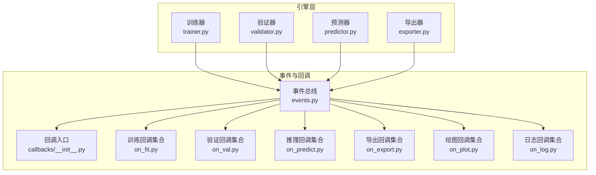
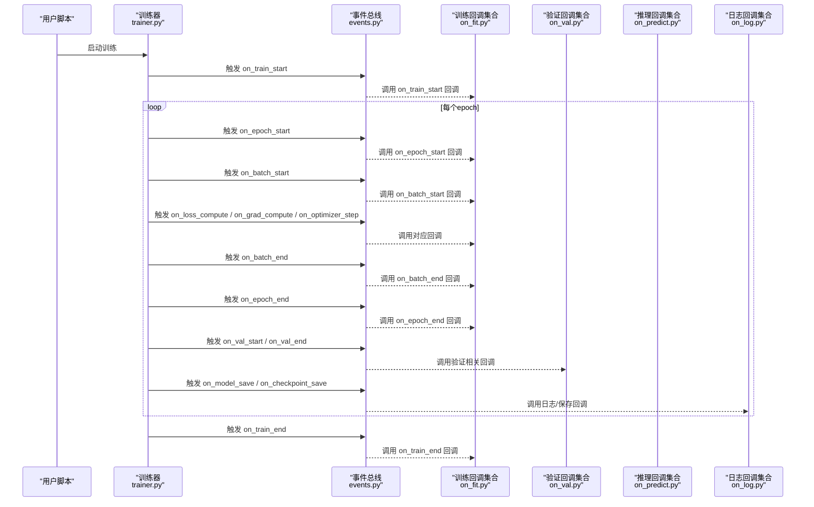
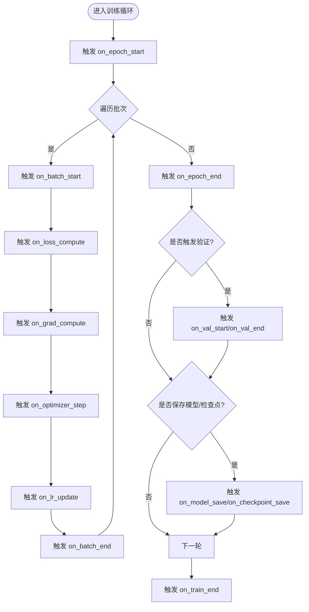
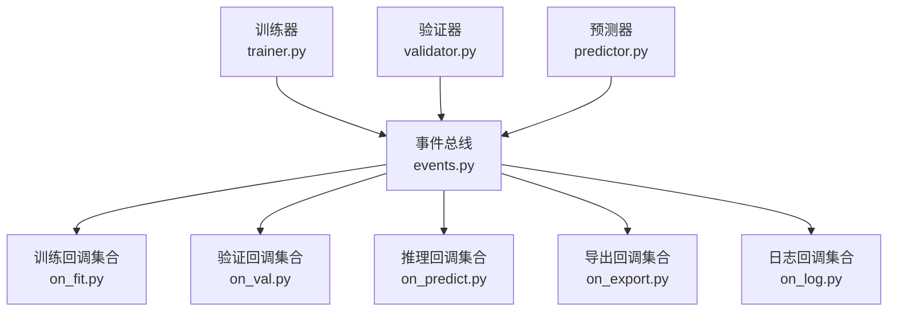

# 回调系统扩展

<cite>
**本文引用的文件**
- [trainer.py](file://ultralytics/engine/trainer.py)
- [validator.py](file://ultralytics/engine/validator.py)
- [predictor.py](file://ultralytics/engine/predictor.py)
- [events.py](file://ultralytics/utils/events.py)
- [callbacks/__init__.py](file://ultralytics/utils/callbacks/__init__.py)
- [callbacks/on_fit.py](file://ultralytics/utils/callbacks/on_fit.py)
- [callbacks/on_val.py](file://ultralytics/utils/callbacks/on_val.py)
- [callbacks/on_predict.py](file://ultralytics/utils/callbacks/on_predict.py)
- [callbacks/on_export.py](file://ultralytics/utils/callbacks/on_export.py)
- [callbacks/on_plot.py](file://ultralytics/utils/callbacks/on_plot.py)
- [callbacks/on_log.py](file://ultralytics/utils/callbacks/on_log.py)
- [callbacks/on_train_start.py](file://ultralytics/utils/callbacks/on_train_start.py)
- [callbacks/on_epoch_start.py](file://ultralytics/utils/callbacks/on_epoch_start.py)
- [callbacks/on_batch_start.py](file://ultralytics/utils/callbacks/on_batch_start.py)
- [callbacks/on_batch_end.py](file://ultralytics/utils/callbacks/on_batch_end.py)
- [callbacks/on_epoch_end.py](file://ultralytics/utils/callbacks/on_epoch_end.py)
- [callbacks/on_train_end.py](file://ultralytics/utils/callbacks/on_train_end.py)
- [callbacks/on_val_start.py](file://ultralytics/utils/callbacks/on_val_start.py)
- [callbacks/on_val_end.py](file://ultralytics/utils/callbacks/on_val_end.py)
- [callbacks/on_predict_start.py](file://ultralytics/utils/callbacks/on_predict_start.py)
- [callbacks/on_predict_end.py](file://ultralytics/utils/callbacks/on_predict_end.py)
- [callbacks/on_export_start.py](file://ultralytics/utils/callbacks/on_export_start.py)
- [callbacks/on_export_end.py](file://ultralytics/utils/callbacks/on_export_end.py)
- [callbacks/on_model_save.py](file://ultralytics/utils/callbacks/on_model_save.py)
- [callbacks/on_optimizer_step.py](file://ultralytics/utils/callbacks/on_optimizer_step.py)
- [callbacks/on_lr_update.py](file://ultralytics/utils/callbacks/on_lr_update.py)
- [callbacks/on_grad_compute.py](file://ultralytics/utils/callbacks/on_grad_compute.py)
- [callbacks/on_loss_compute.py](file://ultralytics/utils/callbacks/on_loss_compute.py)
- [callbacks/on_metrics_update.py](file://ultralytics/utils/callbacks/on_metrics_update.py)
- [callbacks/on_checkpoint_save.py](file://ultralytics/utils/callbacks/on_checkpoint_save.py)
- [callbacks/on_resume.py](file://ultralytics/utils/callbacks/on_resume.py)
- [callbacks/on_dataloader_iter.py](file://ultralytics/utils/callbacks/on_dataloader_iter.py)
- [callbacks/on_device_change.py](file://ultralytics/utils/callbacks/on_device_change.py)
- [callbacks/on_config_update.py](file://ultralytics/utils/callbacks/on_config_update.py)
- [callbacks/on_error.py](file://ultralytics/utils/callbacks/on_error.py)
- [callbacks/on_info.py](file://ultralytics/utils/callbacks/on_info.py)
- [callbacks/on_warning.py](file://ultralytics/utils/callbacks/on_warning.py)
- [callbacks/on_debug.py](file://ultralytics/utils/callbacks/on_debug.py)
- [callbacks/on_progress.py](file://ultralytics/utils/callbacks/on_progress.py)
- [callbacks/on_memory_usage.py](file://ultralytics/utils/callbacks/on_memory_usage.py)
- [callbacks/on_gpu_info.py](file://ultralytics/utils/callbacks/on_gpu_info.py)
- [callbacks/on_tensorboard_write.py](file://ultralytics/utils/callbacks/on_tensorboard_write.py)
- [callbacks/on_wandb_log.py](file://ultralytics/utils/callbacks/on_wandb_log.py)
- [callbacks/on_mlflow_log.py](file://ultralytics/utils/callbacks/on_mlflow_log.py)
- [callbacks/on_comet_log.py](file://ultralytics/utils/callbacks/on_comet_log.py)
- [callbacks/on_neptune_log.py](file://ultralytics/utils/callbacks/on_neptune_log.py)
- [callbacks/on_clearml_log.py](file://ultralytics/utils/callbacks/on_clearml_log.py)
- [callbacks/on_ray_tune_log.py](file://ultralytics/utils/callbacks/on_ray_tune_log.py)
- [callbacks/on_hpo_callback.py](file://ultralytics/utils/callbacks/on_hpo_callback.py)
- [callbacks/on_early_stop.py](file://ultralytics/utils/callbacks/on_early_stop.py)
- [callbacks/on_lr_scheduler.py](file://ultralytics/utils/callbacks/on_lr_scheduler.py)
- [callbacks/on_gradient_clip.py](file://ultralytics/utils/callbacks/on_gradient_clip.py)
- [callbacks/on_amp_mixed_precision.py](file://ultralytics/utils/callbacks/on_amp_mixed_precision.py)
- [callbacks/on_ddp_sync.py](file://ultralytics/utils/callbacks/on_ddp_sync.py)
- [callbacks/on_finetune.py](file://ultralytics/utils/callbacks/on_finetune.py)
- [callbacks/on_peft_adapter.py](file://ultralytics/utils/callbacks/on_peft_adapter.py)
- [callbacks/on_moe_router.py](file://ultralytics/utils/callbacks/on_moe_router.py)
- [callbacks/on_mixture_aux.py](file://ultralytics/utils/callbacks/on_mixture_aux.py)
- [callbacks/on_tracking.py](file://ultralytics/utils/callbacks/on_tracking.py)
- [callbacks/on_segmentation.py](file://ultralytics/utils/callbacks/on_segmentation.py)
- [callbacks/on_pose_estimation.py](file://ultralytics/utils/callbacks/on_pose_estimation.py)
- [callbacks/on_classification.py](file://ultralytics/utils/callbacks/on_classification.py)
- [callbacks/on_detection.py](file://ultralytics/utils/callbacks/on_detection.py)
- [callbacks/on_obb.py](file://ultralytics/utils/callbacks/on_obb.py)
- [callbacks/on_semantic_segmentation.py](file://ultralytics/utils/callbacks/on_semantic_segmentation.py)
- [callbacks/on_nerf.py](file://ultralytics/utils/callbacks/on_nerf.py)
- [callbacks/on_stereo.py](file://ultralytics/utils/callbacks/on_stereo.py)
- [callbacks/on_depth_estimation.py](file://ultralytics/utils/callbacks/on_depth_estimation.py)
- [callbacks/on_super_resolution.py](file://ultralytics/utils/callbacks/on_super_resolution.py)
- [callbacks/on_face_detection.py](file://ultralytics/utils/callbacks/on_face_detection.py)
- [callbacks/on_hand_detection.py](file://ultralytics/utils/callbacks/on_hand_detection.py)
- [callbacks/on_object_counting.py](file://ultralytics/utils/callbacks/on_object_counting.py)
- [callbacks/on_heatmap.py](file://ultralytics/utils/callbacks/on_heatmap.py)
- [callbacks/on_speed_estimation.py](file://ultralytics/utils/callbacks/on_speed_estimation.py)
- [callbacks/on_region_counter.py](file://ultralytics/utils/callbacks/on_region_counter.py)
- [callbacks/on_queue_management.py](file://ultralytics/utils/callbacks/on_queue_management.py)
- [callbacks/on_security_alarm.py](file://ultralytics/utils/callbacks/on_security_alarm.py)
- [callbacks/on_similarity_search.py](file://ultralytics/utils/callbacks/on_similarity_search.py)
- [callbacks/on_streamlit_inference.py](file://ultralytics/utils/callbacks/on_streamlit_inference.py)
- [callbacks/on_ai_gym.py](file://ultralytics/utils/callbacks/on_ai_gym.py)
- [callbacks/on_vision_eye.py](file://ultralytics/utils/callbacks/on_vision_eye.py)
- [callbacks/on_distance_calculation.py](file://ultralytics/utils/callbacks/on_distance_calculation.py)
- [callbacks/on_instance_segmentation.py](file://ultralytics/utils/callbacks/on_instance_segmentation.py)
- [callbacks/on_object_blurrer.py](file://ultralytics/utils/callbacks/on_object_blurrer.py)
- [callbacks/on_object_cropper.py](file://ultralytics/utils/callbacks/on_object_cropper.py)
- [callbacks/on_parking_management.py](file://ultralytics/utils/callbacks/on_parking_management.py)
- [callbacks/on_trackzone.py](file://ultralytics/utils/callbacks/on_trackzone.py)
</cite>

## 目录
1. [简介](#简介)
2. [项目结构](#项目结构)
3. [核心组件](#核心组件)
4. [架构总览](#架构总览)
5. [详细组件分析](#详细组件分析)
6. [依赖关系分析](#依赖关系分析)
7. [性能考量](#性能考量)
8. [故障排查指南](#故障排查指南)
9. [结论](#结论)
10. [附录](#附录)

## 简介
本指南面向希望扩展YOLO-Master训练、验证与推理流程的开发者，聚焦于“回调系统”的设计与使用。内容涵盖：
- 回调机制的工作原理与执行时机
- 自定义训练监控回调（指标收集、日志记录、可视化更新）
- 训练过程干预（动态学习率调整、早停、梯度裁剪等）
- 验证与推理阶段的回调扩展（结果保存、报告生成）
- 第三方监控工具集成（TensorBoard、Weights & Biases、MLflow、Comet、Neptune、ClearML、Ray Tune等）
- 回调链管理与调试技巧
- 异步回调处理与错误恢复机制

## 项目结构
YOLO-Master将回调体系解耦为“事件驱动 + 钩子分发”的模式：
- 引擎层（训练/验证/预测/导出）在关键生命周期节点触发事件
- 事件总线负责注册与分发回调
- 回调模块按职责划分，覆盖训练、验证、推理、导出、可视化、监控、任务特定逻辑等

图表来源
- [trainer.py](file://ultralytics/engine/trainer.py)
- [validator.py](file://ultralytics/engine/validator.py)
- [predictor.py](file://ultralytics/engine/predictor.py)
- [events.py](file://ultralytics/utils/events.py)
- [callbacks/__init__.py](file://ultralytics/utils/callbacks/__init__.py)
- [callbacks/on_fit.py](file://ultralytics/utils/callbacks/on_fit.py)
- [callbacks/on_val.py](file://ultralytics/utils/callbacks/on_val.py)
- [callbacks/on_predict.py](file://ultralytics/utils/callbacks/on_predict.py)
- [callbacks/on_export.py](file://ultralytics/utils/callbacks/on_export.py)
- [callbacks/on_plot.py](file://ultralytics/utils/callbacks/on_plot.py)
- [callbacks/on_log.py](file://ultralytics/utils/callbacks/on_log.py)

章节来源
- [trainer.py](file://ultralytics/engine/trainer.py)
- [validator.py](file://ultralytics/engine/validator.py)
- [predictor.py](file://ultralytics/engine/predictor.py)
- [events.py](file://ultralytics/utils/events.py)
- [callbacks/__init__.py](file://ultralytics/utils/callbacks/__init__.py)

## 核心组件
- 事件总线：提供统一的注册、触发、过滤与顺序控制能力，确保回调以稳定顺序执行，并支持条件启用/禁用。
- 回调入口：集中管理回调命名空间与默认加载策略，便于用户通过配置或API快速接入。
- 阶段回调集合：按训练、验证、推理、导出、绘图、日志等维度组织，降低耦合度，提升可维护性。
- 任务特定回调：针对检测、分割、姿态估计、跟踪、计数、热力图、速度估计等任务提供专用钩子。
- 监控与实验追踪：内置对主流实验追踪工具的适配回调，统一指标写入接口。

章节来源
- [events.py](file://ultralytics/utils/events.py)
- [callbacks/__init__.py](file://ultralytics/utils/callbacks/__init__.py)
- [callbacks/on_fit.py](file://ultralytics/utils/callbacks/on_fit.py)
- [callbacks/on_val.py](file://ultralytics/utils/callbacks/on_val.py)
- [callbacks/on_predict.py](file://ultralytics/utils/callbacks/on_predict.py)
- [callbacks/on_export.py](file://ultralytics/utils/callbacks/on_export.py)
- [callbacks/on_plot.py](file://ultralytics/utils/callbacks/on_plot.py)
- [callbacks/on_log.py](file://ultralytics/utils/callbacks/on_log.py)

## 架构总览
下图展示了从引擎到事件总线再到具体回调的执行路径，以及典型数据流（指标、日志、模型权重、可视化）。

图表来源
- [trainer.py](file://ultralytics/engine/trainer.py)
- [events.py](file://ultralytics/utils/events.py)
- [callbacks/on_fit.py](file://ultralytics/utils/callbacks/on_fit.py)
- [callbacks/on_val.py](file://ultralytics/utils/callbacks/on_val.py)
- [callbacks/on_predict.py](file://ultralytics/utils/callbacks/on_predict.py)
- [callbacks/on_log.py](file://ultralytics/utils/callbacks/on_log.py)

## 详细组件分析

### 训练期回调与执行时机
- 生命周期钩子覆盖：训练开始/结束、每轮开始/结束、每批开始/结束、损失计算、梯度计算、优化器步进、学习率更新、模型保存、检查点保存、恢复训练等。
- 典型用途：
  - 指标收集与聚合（loss、mAP、精度、召回等）
  - 日志记录（终端、文件、远程服务）
  - 可视化更新（曲线、图像、统计直方图）
  - 训练干预（动态学习率、早停、梯度裁剪、混合精度切换）

图表来源
- [callbacks/on_fit.py](file://ultralytics/utils/callbacks/on_fit.py)
- [callbacks/on_epoch_start.py](file://ultralytics/utils/callbacks/on_epoch_start.py)
- [callbacks/on_batch_start.py](file://ultralytics/utils/callbacks/on_batch_start.py)
- [callbacks/on_batch_end.py](file://ultralytics/utils/callbacks/on_batch_end.py)
- [callbacks/on_loss_compute.py](file://ultralytics/utils/callbacks/on_loss_compute.py)
- [callbacks/on_grad_compute.py](file://ultralytics/utils/callbacks/on_grad_compute.py)
- [callbacks/on_optimizer_step.py](file://ultralytics/utils/callbacks/on_optimizer_step.py)
- [callbacks/on_lr_update.py](file://ultralytics/utils/callbacks/on_lr_update.py)
- [callbacks/on_val_start.py](file://ultralytics/utils/callbacks/on_val_start.py)
- [callbacks/on_val_end.py](file://ultralytics/utils/callbacks/on_val_end.py)
- [callbacks/on_model_save.py](file://ultralytics/utils/callbacks/on_model_save.py)
- [callbacks/on_checkpoint_save.py](file://ultralytics/utils/callbacks/on_checkpoint_save.py)
- [callbacks/on_train_end.py](file://ultralytics/utils/callbacks/on_train_end.py)

章节来源
- [callbacks/on_fit.py](file://ultralytics/utils/callbacks/on_fit.py)
- [callbacks/on_epoch_start.py](file://ultralytics/utils/callbacks/on_epoch_start.py)
- [callbacks/on_batch_start.py](file://ultralytics/utils/callbacks/on_batch_start.py)
- [callbacks/on_batch_end.py](file://ultralytics/utils/callbacks/on_batch_end.py)
- [callbacks/on_loss_compute.py](file://ultralytics/utils/callbacks/on_loss_compute.py)
- [callbacks/on_grad_compute.py](file://ultralytics/utils/callbacks/on_grad_compute.py)
- [callbacks/on_optimizer_step.py](file://ultralytics/utils/callbacks/on_optimizer_step.py)
- [callbacks/on_lr_update.py](file://ultralytics/utils/callbacks/on_lr_update.py)
- [callbacks/on_val_start.py](file://ultralytics/utils/callbacks/on_val_start.py)
- [callbacks/on_val_end.py](file://ultralytics/utils/callbacks/on_val_end.py)
- [callbacks/on_model_save.py](file://ultralytics/utils/callbacks/on_model_save.py)
- [callbacks/on_checkpoint_save.py](file://ultralytics/utils/callbacks/on_checkpoint_save.py)
- [callbacks/on_train_end.py](file://ultralytics/utils/callbacks/on_train_end.py)

### 自定义训练监控回调实现要点
- 指标收集：在损失计算与优化器步进后读取中间状态，聚合到内存缓存或外部存储；在每轮结束时汇总并上报。
- 日志记录：在批量/轮次边界写入结构化日志，避免高频I/O阻塞主循环。
- 可视化更新：在轮次或验证后绘制曲线/图像，建议采用增量更新与异步渲染。
- 参考路径：
  - 指标更新回调：[on_metrics_update.py](file://ultralytics/utils/callbacks/on_metrics_update.py)
  - 进度与日志回调：[on_progress.py](file://ultralytics/utils/callbacks/on_progress.py)、[on_log.py](file://ultralytics/utils/callbacks/on_log.py)

章节来源
- [callbacks/on_metrics_update.py](file://ultralytics/utils/callbacks/on_metrics_update.py)
- [callbacks/on_progress.py](file://ultralytics/utils/callbacks/on_progress.py)
- [callbacks/on_log.py](file://ultralytics/utils/callbacks/on_log.py)

### 训练过程干预方法
- 动态学习率调整：监听学习率更新回调，根据指标或策略函数修改调度器参数。
  - 参考路径：[on_lr_update.py](file://ultralytics/utils/callbacks/on_lr_update.py)、[on_lr_scheduler.py](file://ultralytics/utils/callbacks/on_lr_scheduler.py)
- 早停机制：在每轮结束后评估验证指标，若连续多轮未改善则终止训练。
  - 参考路径：[on_early_stop.py](file://ultralytics/utils/callbacks/on_early_stop.py)
- 梯度裁剪：在梯度计算后应用裁剪策略，防止梯度爆炸。
  - 参考路径：[on_gradient_clip.py](file://ultralytics/utils/callbacks/on_gradient_clip.py)
- 其他干预：AMP混合精度切换、DDP同步钩子、PEFT适配器操作、MoE路由与辅助损失等。
  - 参考路径：[on_amp_mixed_precision.py](file://ultralytics/utils/callbacks/on_amp_mixed_precision.py)、[on_ddp_sync.py](file://ultralytics/utils/callbacks/on_ddp_sync.py)、[on_peft_adapter.py](file://ultralytics/utils/callbacks/on_peft_adapter.py)、[on_moe_router.py](file://ultralytics/utils/callbacks/on_moe_router.py)、[on_mixture_aux.py](file://ultralytics/utils/callbacks/on_mixture_aux.py)

章节来源
- [callbacks/on_lr_update.py](file://ultralytics/utils/callbacks/on_lr_update.py)
- [callbacks/on_lr_scheduler.py](file://ultralytics/utils/callbacks/on_lr_scheduler.py)
- [callbacks/on_early_stop.py](file://ultralytics/utils/callbacks/on_early_stop.py)
- [callbacks/on_gradient_clip.py](file://ultralytics/utils/callbacks/on_gradient_clip.py)
- [callbacks/on_amp_mixed_precision.py](file://ultralytics/utils/callbacks/on_amp_mixed_precision.py)
- [callbacks/on_ddp_sync.py](file://ultralytics/utils/callbacks/on_ddp_sync.py)
- [callbacks/on_peft_adapter.py](file://ultralytics/utils/callbacks/on_peft_adapter.py)
- [callbacks/on_moe_router.py](file://ultralytics/utils/callbacks/on_moe_router.py)
- [callbacks/on_mixture_aux.py](file://ultralytics/utils/callbacks/on_mixture_aux.py)

### 验证与推理阶段的回调扩展
- 验证阶段：在验证开始/结束时进行结果保存、报告生成、指标对比与回传。
  - 参考路径：[on_val_start.py](file://ultralytics/utils/callbacks/on_val_start.py)、[on_val_end.py](file://ultralytics/utils/callbacks/on_val_end.py)
- 推理阶段：在预测开始/结束时进行输出序列化、可视化、跟踪与业务逻辑处理。
  - 参考路径：[on_predict_start.py](file://ultralytics/utils/callbacks/on_predict_start.py)、[on_predict_end.py](file://ultralytics/utils/callbacks/on_predict_end.py)
- 导出阶段：在导出开始/结束时进行格式转换、校验与元数据记录。
  - 参考路径：[on_export_start.py](file://ultralytics/utils/callbacks/on_export_start.py)、[on_export_end.py](file://ultralytics/utils/callbacks/on_export_end.py)

章节来源
- [callbacks/on_val_start.py](file://ultralytics/utils/callbacks/on_val_start.py)
- [callbacks/on_val_end.py](file://ultralytics/utils/callbacks/on_val_end.py)
- [callbacks/on_predict_start.py](file://ultralytics/utils/callbacks/on_predict_start.py)
- [callbacks/on_predict_end.py](file://ultralytics/utils/callbacks/on_predict_end.py)
- [callbacks/on_export_start.py](file://ultralytics/utils/callbacks/on_export_start.py)
- [callbacks/on_export_end.py](file://ultralytics/utils/callbacks/on_export_end.py)

### 第三方监控工具集成
- TensorBoard：在训练/验证/导出过程中写入标量、图像、直方图等。
  - 参考路径：[on_tensorboard_write.py](file://ultralytics/utils/callbacks/on_tensorboard_write.py)
- Weights & Biases：统一记录超参、指标、模型快照与可视化。
  - 参考路径：[on_wandb_log.py](file://ultralytics/utils/callbacks/on_wandb_log.py)
- MLflow：实验追踪、模型注册与版本管理。
  - 参考路径：[on_mlflow_log.py](file://ultralytics/utils/callbacks/on_mlflow_log.py)
- Comet：指标与工件上传、在线看板。
  - 参考路径：[on_comet_log.py](file://ultralytics/utils/callbacks/on_comet_log.py)
- Neptune：实验与数据集版本化。
  - 参考路径：[on_neptune_log.py](file://ultralytics/utils/callbacks/on_neptune_log.py)
- ClearML：任务管理、流水线与资源监控。
  - 参考路径：[on_clearml_log.py](file://ultralytics/utils/callbacks/on_clearml_log.py)
- Ray Tune：超参搜索与分布式调优。
  - 参考路径：[on_ray_tune_log.py](file://ultralytics/utils/callbacks/on_ray_tune_log.py)

章节来源
- [callbacks/on_tensorboard_write.py](file://ultralytics/utils/callbacks/on_tensorboard_write.py)
- [callbacks/on_wandb_log.py](file://ultralytics/utils/callbacks/on_wandb_log.py)
- [callbacks/on_mlflow_log.py](file://ultralytics/utils/callbacks/on_mlflow_log.py)
- [callbacks/on_comet_log.py](file://ultralytics/utils/callbacks/on_comet_log.py)
- [callbacks/on_neptune_log.py](file://ultralytics/utils/callbacks/on_neptune_log.py)
- [callbacks/on_clearml_log.py](file://ultralytics/utils/callbacks/on_clearml_log.py)
- [callbacks/on_ray_tune_log.py](file://ultralytics/utils/callbacks/on_ray_tune_log.py)

### 回调链管理与调试技巧
- 顺序与优先级：通过事件总线配置回调顺序，确保依赖关系正确（如先计算指标再写入日志）。
- 条件启用：基于配置开关或运行时状态选择性启用回调，减少开销。
- 断点与诊断：在关键回调中插入信息/警告/调试事件，结合设备与内存使用回调定位瓶颈。
  - 参考路径：
    - 事件与日志：[events.py](file://ultralytics/utils/events.py)、[on_log.py](file://ultralytics/utils/callbacks/on_log.py)
    - 信息与调试：[on_info.py](file://ultralytics/utils/callbacks/on_info.py)、[on_warning.py](file://ultralytics/utils/callbacks/on_warning.py)、[on_debug.py](file://ultralytics/utils/callbacks/on_debug.py)
    - 设备与内存：[on_device_change.py](file://ultralytics/utils/callbacks/on_device_change.py)、[on_memory_usage.py](file://ultralytics/utils/callbacks/on_memory_usage.py)、[on_gpu_info.py](file://ultralytics/utils/callbacks/on_gpu_info.py)
    - 数据加载：[on_dataloader_iter.py](file://ultralytics/utils/callbacks/on_dataloader_iter.py)

章节来源
- [events.py](file://ultralytics/utils/events.py)
- [callbacks/on_log.py](file://ultralytics/utils/callbacks/on_log.py)
- [callbacks/on_info.py](file://ultralytics/utils/callbacks/on_info.py)
- [callbacks/on_warning.py](file://ultralytics/utils/callbacks/on_warning.py)
- [callbacks/on_debug.py](file://ultralytics/utils/callbacks/on_debug.py)
- [callbacks/on_device_change.py](file://ultralytics/utils/callbacks/on_device_change.py)
- [callbacks/on_memory_usage.py](file://ultralytics/utils/callbacks/on_memory_usage.py)
- [callbacks/on_gpu_info.py](file://ultralytics/utils/callbacks/on_gpu_info.py)
- [callbacks/on_dataloader_iter.py](file://ultralytics/utils/callbacks/on_dataloader_iter.py)

### 异步回调与错误恢复
- 异步处理：对于耗时IO（远程日志、网络上传、可视化渲染），建议在回调中使用异步队列或线程池，避免阻塞训练主循环。
- 错误恢复：在错误回调中捕获异常、记录上下文、尝试降级或重试，并在必要时安全退出或保留检查点。
  - 参考路径：
    - 错误回调：[on_error.py](file://ultralytics/utils/callbacks/on_error.py)
    - 恢复训练：[on_resume.py](file://ultralytics/utils/callbacks/on_resume.py)
    - 进度与日志：[on_progress.py](file://ultralytics/utils/callbacks/on_progress.py)、[on_log.py](file://ultralytics/utils/callbacks/on_log.py)

章节来源
- [callbacks/on_error.py](file://ultralytics/utils/callbacks/on_error.py)
- [callbacks/on_resume.py](file://ultralytics/utils/callbacks/on_resume.py)
- [callbacks/on_progress.py](file://ultralytics/utils/callbacks/on_progress.py)
- [callbacks/on_log.py](file://ultralytics/utils/callbacks/on_log.py)

### 任务特定回调示例
- 检测：目标框、置信度、类别分布、NMS后处理等。
  - 参考路径：[on_detection.py](file://ultralytics/utils/callbacks/on_detection.py)
- 实例分割：掩码质量、IoU、轮廓平滑等。
  - 参考路径：[on_segmentation.py](file://ultralytics/utils/callbacks/on_segmentation.py)
- 姿态估计：关键点误差、关节可见性、对称性等。
  - 参考路径：[on_pose_estimation.py](file://ultralytics/utils/callbacks/on_pose_estimation.py)
- 跟踪：轨迹连续性、ID切换、丢失率等。
  - 参考路径：[on_tracking.py](file://ultralytics/utils/callbacks/on_tracking.py)
- 分类：混淆矩阵、类别不平衡、阈值调优等。
  - 参考路径：[on_classification.py](file://ultralytics/utils/callbacks/on_classification.py)
- OBB/语义分割/深度估计/超分/人脸/手部/计数/热力图/速度估计/区域计数/队列管理/安防告警/相似度检索/Streamlit推理/AI Gym/视觉之眼/距离计算/实例分割/对象模糊/对象裁剪/停车管理/跟踪区等：
  - 参考路径：见各对应回调文件（例如 [on_obb.py](file://ultralytics/utils/callbacks/on_obb.py)、[on_semantic_segmentation.py](file://ultralytics/utils/callbacks/on_semantic_segmentation.py)、[on_depth_estimation.py](file://ultralytics/utils/callbacks/on_depth_estimation.py)、[on_super_resolution.py](file://ultralytics/utils/callbacks/on_super_resolution.py)、[on_face_detection.py](file://ultralytics/utils/callbacks/on_face_detection.py)、[on_hand_detection.py](file://ultralytics/utils/callbacks/on_hand_detection.py)、[on_object_counting.py](file://ultralytics/utils/callbacks/on_object_counting.py)、[on_heatmap.py](file://ultralytics/utils/callbacks/on_heatmap.py)、[on_speed_estimation.py](file://ultralytics/utils/callbacks/on_speed_estimation.py)、[on_region_counter.py](file://ultralytics/utils/callbacks/on_region_counter.py)、[on_queue_management.py](file://ultralytics/utils/callbacks/on_queue_management.py)、[on_security_alarm.py](file://ultralytics/utils/callbacks/on_security_alarm.py)、[on_similarity_search.py](file://ultralytics/utils/callbacks/on_similarity_search.py)、[on_streamlit_inference.py](file://ultralytics/utils/callbacks/on_streamlit_inference.py)、[on_ai_gym.py](file://ultralytics/utils/callbacks/on_ai_gym.py)、[on_vision_eye.py](file://ultralytics/utils/callbacks/on_vision_eye.py)、[on_distance_calculation.py](file://ultralytics/utils/callbacks/on_distance_calculation.py)、[on_instance_segmentation.py](file://ultralytics/utils/callbacks/on_instance_segmentation.py)、[on_object_blurrer.py](file://ultralytics/utils/callbacks/on_object_blurrer.py)、[on_object_cropper.py](file://ultralytics/utils/callbacks/on_object_cropper.py)、[on_parking_management.py](file://ultralytics/utils/callbacks/on_parking_management.py)、[on_trackzone.py](file://ultralytics/utils/callbacks/on_trackzone.py)

章节来源
- [callbacks/on_detection.py](file://ultralytics/utils/callbacks/on_detection.py)
- [callbacks/on_segmentation.py](file://ultralytics/utils/callbacks/on_segmentation.py)
- [callbacks/on_pose_estimation.py](file://ultralytics/utils/callbacks/on_pose_estimation.py)
- [callbacks/on_tracking.py](file://ultralytics/utils/callbacks/on_tracking.py)
- [callbacks/on_classification.py](file://ultralytics/utils/callbacks/on_classification.py)
- [callbacks/on_obb.py](file://ultralytics/utils/callbacks/on_obb.py)
- [callbacks/on_semantic_segmentation.py](file://ultralytics/utils/callbacks/on_semantic_segmentation.py)
- [callbacks/on_depth_estimation.py](file://ultralytics/utils/callbacks/on_depth_estimation.py)
- [callbacks/on_super_resolution.py](file://ultralytics/utils/callbacks/on_super_resolution.py)
- [callbacks/on_face_detection.py](file://ultralytics/utils/callbacks/on_face_detection.py)
- [callbacks/on_hand_detection.py](file://ultralytics/utils/callbacks/on_hand_detection.py)
- [callbacks/on_object_counting.py](file://ultralytics/utils/callbacks/on_object_counting.py)
- [callbacks/on_heatmap.py](file://ultralytics/utils/callbacks/on_heatmap.py)
- [callbacks/on_speed_estimation.py](file://ultralytics/utils/callbacks/on_speed_estimation.py)
- [callbacks/on_region_counter.py](file://ultralytics/utils/callbacks/on_region_counter.py)
- [callbacks/on_queue_management.py](file://ultralytics/utils/callbacks/on_queue_management.py)
- [callbacks/on_security_alarm.py](file://ultralytics/utils/callbacks/on_security_alarm.py)
- [callbacks/on_similarity_search.py](file://ultralytics/utils/callbacks/on_similarity_search.py)
- [callbacks/on_streamlit_inference.py](file://ultralytics/utils/callbacks/on_streamlit_inference.py)
- [callbacks/on_ai_gym.py](file://ultralytics/utils/callbacks/on_ai_gym.py)
- [callbacks/on_vision_eye.py](file://ultralytics/utils/callbacks/on_vision_eye.py)
- [callbacks/on_distance_calculation.py](file://ultralytics/utils/callbacks/on_distance_calculation.py)
- [callbacks/on_instance_segmentation.py](file://ultralytics/utils/callbacks/on_instance_segmentation.py)
- [callbacks/on_object_blurrer.py](file://ultralytics/utils/callbacks/on_object_blurrer.py)
- [callbacks/on_object_cropper.py](file://ultralytics/utils/callbacks/on_object_cropper.py)
- [callbacks/on_parking_management.py](file://ultralytics/utils/callbacks/on_parking_management.py)
- [callbacks/on_trackzone.py](file://ultralytics/utils/callbacks/on_trackzone.py)

## 依赖关系分析
- 低耦合高内聚：引擎仅依赖事件总线，不直接耦合具体回调实现；回调之间通过事件名称与上下文数据进行协作。
- 可扩展性：新增回调只需注册到事件总线，无需改动引擎代码；可通过配置开关控制启用与否。
- 潜在风险：过多回调或复杂逻辑可能引入额外开销；需关注I/O与CPU/GPU利用率平衡。

图表来源
- [trainer.py](file://ultralytics/engine/trainer.py)
- [validator.py](file://ultralytics/engine/validator.py)
- [predictor.py](file://ultralytics/engine/predictor.py)
- [events.py](file://ultralytics/utils/events.py)
- [callbacks/on_fit.py](file://ultralytics/utils/callbacks/on_fit.py)
- [callbacks/on_val.py](file://ultralytics/utils/callbacks/on_val.py)
- [callbacks/on_predict.py](file://ultralytics/utils/callbacks/on_predict.py)
- [callbacks/on_export.py](file://ultralytics/utils/callbacks/on_export.py)
- [callbacks/on_log.py](file://ultralytics/utils/callbacks/on_log.py)

章节来源
- [trainer.py](file://ultralytics/engine/trainer.py)
- [validator.py](file://ultralytics/engine/validator.py)
- [predictor.py](file://ultralytics/engine/predictor.py)
- [events.py](file://ultralytics/utils/events.py)
- [callbacks/on_fit.py](file://ultralytics/utils/callbacks/on_fit.py)
- [callbacks/on_val.py](file://ultralytics/utils/callbacks/on_val.py)
- [callbacks/on_predict.py](file://ultralytics/utils/callbacks/on_predict.py)
- [callbacks/on_export.py](file://ultralytics/utils/callbacks/on_export.py)
- [callbacks/on_log.py](file://ultralytics/utils/callbacks/on_log.py)

## 性能考量
- 回调粒度：尽量在批量/轮次边界执行重计算或I/O，避免在每个样本上频繁触发。
- 异步与批处理：对远程日志、可视化与上传采用异步队列与批处理，降低延迟抖动。
- 指标采样：对高频指标进行降采样或滑动平均，减少存储与传输压力。
- 资源监控：利用设备与内存使用回调观察瓶颈，合理分配GPU/CPU资源。
- 条件启用：仅在需要时开启昂贵回调（如全量可视化、完整报告生成）。

## 故障排查指南
- 常见问题：
  - 回调顺序错误导致指标缺失或重复：检查事件触发位置与回调注册顺序。
  - I/O阻塞影响训练吞吐：确认回调是否异步化，是否存在同步磁盘/网络操作。
  - 内存泄漏：检查回调中是否有未释放的张量或引用。
  - 错误恢复失败：确认错误回调是否正确捕获异常并保留检查点。
- 定位手段：
  - 使用信息/警告/调试回调打印上下文（设备、批次索引、指标摘要）。
  - 在关键回调前后打点计时，识别热点。
  - 借助设备与内存使用回调观察峰值与趋势。
- 参考路径：
  - 错误与恢复：[on_error.py](file://ultralytics/utils/callbacks/on_error.py)、[on_resume.py](file://ultralytics/utils/callbacks/on_resume.py)
  - 日志与调试：[on_log.py](file://ultralytics/utils/callbacks/on_log.py)、[on_info.py](file://ultralytics/utils/callbacks/on_info.py)、[on_warning.py](file://ultralytics/utils/callbacks/on_warning.py)、[on_debug.py](file://ultralytics/utils/callbacks/on_debug.py)
  - 资源监控：[on_memory_usage.py](file://ultralytics/utils/callbacks/on_memory_usage.py)、[on_gpu_info.py](file://ultralytics/utils/callbacks/on_gpu_info.py)、[on_device_change.py](file://ultralytics/utils/callbacks/on_device_change.py)

章节来源
- [callbacks/on_error.py](file://ultralytics/utils/callbacks/on_error.py)
- [callbacks/on_resume.py](file://ultralytics/utils/callbacks/on_resume.py)
- [callbacks/on_log.py](file://ultralytics/utils/callbacks/on_log.py)
- [callbacks/on_info.py](file://ultralytics/utils/callbacks/on_info.py)
- [callbacks/on_warning.py](file://ultralytics/utils/callbacks/on_warning.py)
- [callbacks/on_debug.py](file://ultralytics/utils/callbacks/on_debug.py)
- [callbacks/on_memory_usage.py](file://ultralytics/utils/callbacks/on_memory_usage.py)
- [callbacks/on_gpu_info.py](file://ultralytics/utils/callbacks/on_gpu_info.py)
- [callbacks/on_device_change.py](file://ultralytics/utils/callbacks/on_device_change.py)

## 结论
YOLO-Master的回调系统以事件驱动为核心，提供了高度可扩展的训练、验证、推理与导出钩子。通过合理的回调设计与异步化处理，可以实现灵活的监控、干预与集成，同时保持训练效率与稳定性。建议在实践中遵循“按需启用、异步优先、批处理与采样、资源监控”的原则，并结合任务特性选择合适的事件点与回调组合。

## 附录
- 常用事件与回调映射（节选）：
  - 训练：on_train_start、on_epoch_start、on_batch_start、on_loss_compute、on_grad_compute、on_optimizer_step、on_lr_update、on_batch_end、on_epoch_end、on_val_start、on_val_end、on_model_save、on_checkpoint_save、on_train_end
  - 推理：on_predict_start、on_predict_end
  - 导出：on_export_start、on_export_end
  - 日志与可视化：on_log、on_plot、on_tensorboard_write、on_wandb_log、on_mlflow_log、on_comet_log、on_neptune_log、on_clearml_log、on_ray_tune_log
  - 监控与诊断：on_info、on_warning、on_debug、on_memory_usage、on_gpu_info、on_device_change、on_dataloader_iter
  - 任务特定：on_detection、on_segmentation、on_pose_estimation、on_tracking、on_classification、on_obb、on_semantic_segmentation、on_depth_estimation、on_super_resolution、on_face_detection、on_hand_detection、on_object_counting、on_heatmap、on_speed_estimation、on_region_counter、on_queue_management、on_security_alarm、on_similarity_search、on_streamlit_inference、on_ai_gym、on_vision_eye、on_distance_calculation、on_instance_segmentation、on_object_blurrer、on_object_cropper、on_parking_management、on_trackzone