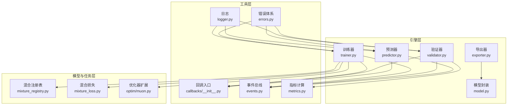
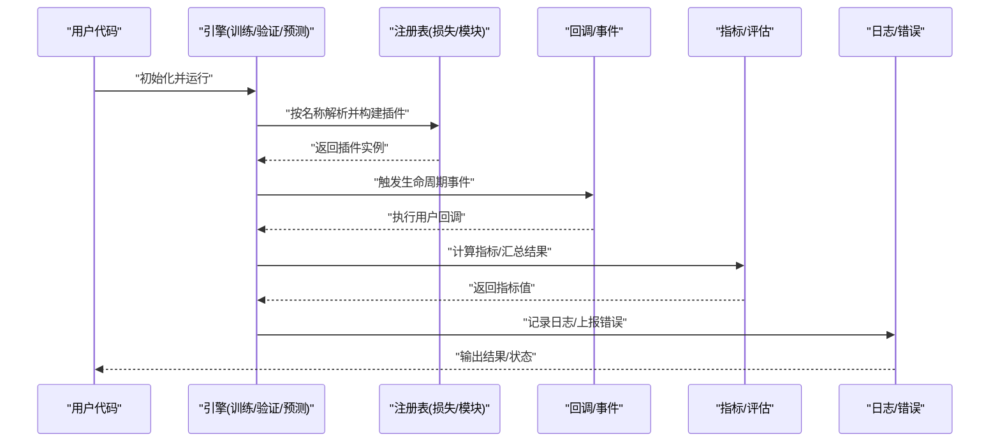
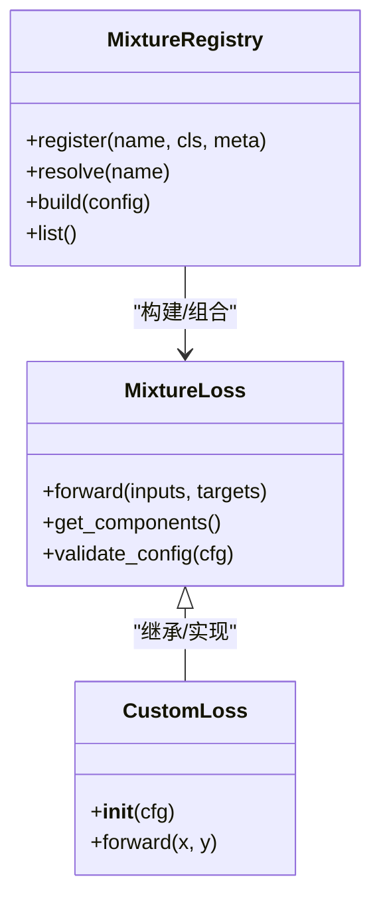
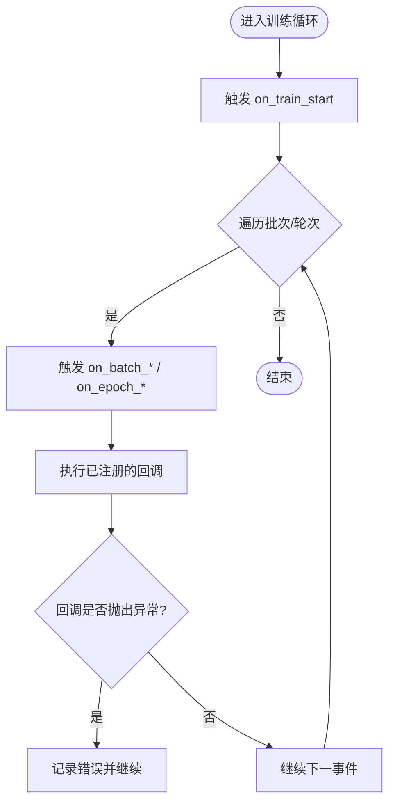
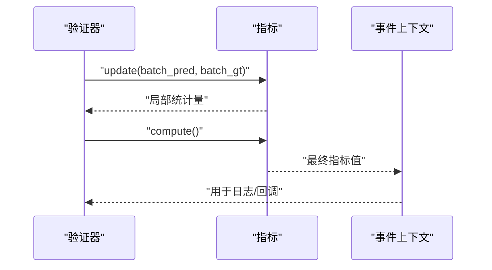
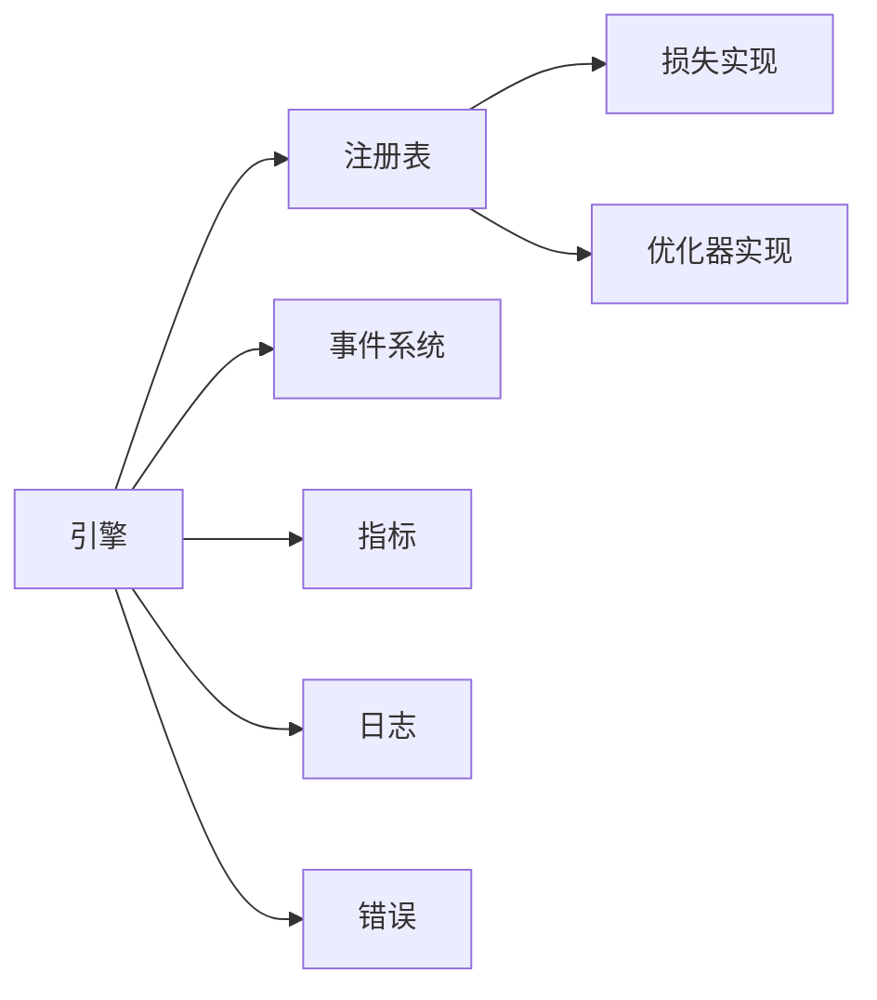

# 插件架构使用指南

<cite>
**本文引用的文件**
- [README.md](file://README.md)
- [pyproject.toml](file://pyproject.toml)
- [ultralytics/engine/trainer.py](file://ultralytics/engine/trainer.py)
- [ultralytics/engine/validator.py](file://ultralytics/engine/validator.py)
- [ultralytics/engine/predictor.py](file://ultralytics/engine/predictor.py)
- [ultralytics/engine/model.py](file://ultralytics/engine/model.py)
- [ultralytics/engine/exporter.py](file://ultralytics/engine/exporter.py)
- [ultralytics/utils/callbacks/__init__.py](file://ultralytics/utils/callbacks/__init__.py)
- [ultralytics/utils/events.py](file://ultralytics/utils/events.py)
- [ultralytics/utils/logger.py](file://ultralytics/utils/logger.py)
- [ultralytics/utils/errors.py](file://ultralytics/utils/errors.py)
- [ultralytics/nn/mixture_registry.py](file://ultralytics/nn/mixture_registry.py)
- [ultralytics/nn/mixture_loss.py](file://ultralytics/nn/mixture_loss.py)
- [ultralytics/optim/muon.py](file://ultralytics/optim/muon.py)
- [ultralytics/utils/metrics.py](file://ultralytics/utils/metrics.py)
- [tests/test_mixture_config_registry.py](file://tests/test_mixture_config_registry.py)
- [tests/test_mixture_loss_composition.py](file://tests/test_mixture_loss_composition.py)
- [tests/test_metrics_numerical_stability.py](file://tests/test_metrics_numerical_stability.py)
</cite>

## 目录
1. [简介](#简介)
2. [项目结构](#项目结构)
3. [核心组件](#核心组件)
4. [架构总览](#架构总览)
5. [详细组件分析](#详细组件分析)
6. [依赖分析](#依赖分析)
7. [性能考量](#性能考量)
8. [故障排查指南](#故障排查指南)
9. [结论](#结论)
10. [附录](#附录)

## 简介
本指南面向希望在 YOLO-Master 中开发“可插拔”组件的工程师与研究者，围绕以下目标展开：
- 插件生命周期与管理机制：发现、加载、卸载
- 可插拔组件类型：损失函数、优化器、评估指标
- 配置与依赖管理最佳实践
- 插件间通信协议与数据交换格式
- 版本兼容性与升级策略
- 插件市场或共享平台接入方法（概念性说明）
- 安全沙箱与权限控制（概念性说明）
- 插件开发模板与测试框架

为便于落地，文档将结合仓库中的注册表、事件回调、训练/验证/预测流程以及现有扩展点进行分析，并给出可视化图示与参考路径。

## 项目结构
YOLO-Master 采用分层模块化设计，关键扩展点集中在：
- 引擎层：训练、验证、预测、导出等主流程
- 工具层：事件系统、日志、错误处理、指标计算
- 模型与任务层：混合损失与注册表、优化器扩展点
- 测试层：覆盖注册表、损失组合、数值稳定性等

图表来源
- [ultralytics/engine/trainer.py](file://ultralytics/engine/trainer.py)
- [ultralytics/engine/validator.py](file://ultralytics/engine/validator.py)
- [ultralytics/engine/predictor.py](file://ultralytics/engine/predictor.py)
- [ultralytics/engine/model.py](file://ultralytics/engine/model.py)
- [ultralytics/engine/exporter.py](file://ultralytics/engine/exporter.py)
- [ultralytics/utils/callbacks/__init__.py](file://ultralytics/utils/callbacks/__init__.py)
- [ultralytics/utils/events.py](file://ultralytics/utils/events.py)
- [ultralytics/utils/logger.py](file://ultralytics/utils/logger.py)
- [ultralytics/utils/errors.py](file://ultralytics/utils/errors.py)
- [ultralytics/utils/metrics.py](file://ultralytics/utils/metrics.py)
- [ultralytics/nn/mixture_registry.py](file://ultralytics/nn/mixture_registry.py)
- [ultralytics/nn/mixture_loss.py](file://ultralytics/nn/mixture_loss.py)
- [ultralytics/optim/muon.py](file://ultralytics/optim/muon.py)

章节来源
- [README.md](file://README.md)
- [pyproject.toml](file://pyproject.toml)

## 核心组件
- 注册表与工厂模式
  - 通过注册表集中管理可插拔实现（如混合损失），支持按名称解析与实例化，便于动态选择与组合。
  - 典型职责：注册、查找、校验、构建。
- 事件系统与回调
  - 在训练/验证/预测的关键阶段触发事件，允许外部逻辑注入（如自定义日志、监控、早停、检查点）。
  - 典型职责：事件定义、订阅/发布、顺序保证、异常隔离。
- 指标与评估
  - 提供统一的指标接口与聚合方式，便于新增自定义指标并在验证流程中使用。
- 优化器扩展点
  - 通过统一入口创建优化器，支持第三方优化器以最小改动接入。
- 错误与日志
  - 标准化错误类型与日志输出，提升可观测性与排障效率。

章节来源
- [ultralytics/nn/mixture_registry.py](file://ultralytics/nn/mixture_registry.py)
- [ultralytics/nn/mixture_loss.py](file://ultralytics/nn/mixture_loss.py)
- [ultralytics/utils/callbacks/__init__.py](file://ultralytics/utils/callbacks/__init__.py)
- [ultralytics/utils/events.py](file://ultralytics/utils/events.py)
- [ultralytics/utils/metrics.py](file://ultralytics/utils/metrics.py)
- [ultralytics/optim/muon.py](file://ultralytics/optim/muon.py)
- [ultralytics/utils/logger.py](file://ultralytics/utils/logger.py)
- [ultralytics/utils/errors.py](file://ultralytics/utils/errors.py)

## 架构总览
下图展示了从用户调用到插件落地的端到端流程，包括注册表解析、事件分发、指标计算与错误处理。

图表来源
- [ultralytics/engine/trainer.py](file://ultralytics/engine/trainer.py)
- [ultralytics/engine/validator.py](file://ultralytics/engine/validator.py)
- [ultralytics/engine/predictor.py](file://ultralytics/engine/predictor.py)
- [ultralytics/nn/mixture_registry.py](file://ultralytics/nn/mixture_registry.py)
- [ultralytics/utils/callbacks/__init__.py](file://ultralytics/utils/callbacks/__init__.py)
- [ultralytics/utils/events.py](file://ultralytics/utils/events.py)
- [ultralytics/utils/metrics.py](file://ultralytics/utils/metrics.py)
- [ultralytics/utils/logger.py](file://ultralytics/utils/logger.py)
- [ultralytics/utils/errors.py](file://ultralytics/utils/errors.py)

## 详细组件分析

### 注册表与工厂（以混合损失为例）
- 职责
  - 维护插件元信息（名称、版本、依赖、构造参数）
  - 提供注册、查询、实例化、校验能力
  - 支持组合式构建（如多损失加权）
- 关键流程
  - 注册：在模块导入时自动注册
  - 解析：根据配置键名查找实现类
  - 构建：依据配置参数实例化并校验
  - 组合：将多个子损失组合为复合损失
- 复杂度
  - 注册/查找通常为 O(1) 字典操作
  - 组合构建时间取决于子项数量与参数校验成本
- 优化建议
  - 缓存已解析的实现类引用
  - 对重型参数进行延迟校验
  - 提供只读快照用于并发安全

图表来源
- [ultralytics/nn/mixture_registry.py](file://ultralytics/nn/mixture_registry.py)
- [ultralytics/nn/mixture_loss.py](file://ultralytics/nn/mixture_loss.py)

章节来源
- [ultralytics/nn/mixture_registry.py](file://ultralytics/nn/mixture_registry.py)
- [ultralytics/nn/mixture_loss.py](file://ultralytics/nn/mixture_loss.py)
- [tests/test_mixture_config_registry.py](file://tests/test_mixture_config_registry.py)
- [tests/test_mixture_loss_composition.py](file://tests/test_mixture_loss_composition.py)

### 事件系统与回调（训练/验证/预测）
- 职责
  - 定义标准事件（如 on_train_start、on_epoch_end、on_val_batch_end 等）
  - 提供订阅/发布机制，确保回调顺序与异常隔离
  - 与日志、指标、检查点等子系统协作
- 关键流程
  - 引擎在关键节点触发事件
  - 回调处理器接收上下文对象（包含进度、指标、配置等）
  - 异常被捕获并上报，避免影响主流程
- 扩展建议
  - 为自定义回调提供基类与默认空实现
  - 在事件上下文中传递不可变快照，降低副作用风险

图表来源
- [ultralytics/utils/callbacks/__init__.py](file://ultralytics/utils/callbacks/__init__.py)
- [ultralytics/utils/events.py](file://ultralytics/utils/events.py)
- [ultralytics/engine/trainer.py](file://ultralytics/engine/trainer.py)
- [ultralytics/engine/validator.py](file://ultralytics/engine/validator.py)
- [ultralytics/engine/predictor.py](file://ultralytics/engine/predictor.py)

章节来源
- [ultralytics/utils/callbacks/__init__.py](file://ultralytics/utils/callbacks/__init__.py)
- [ultralytics/utils/events.py](file://ultralytics/utils/events.py)
- [ultralytics/engine/trainer.py](file://ultralytics/engine/trainer.py)
- [ultralytics/engine/validator.py](file://ultralytics/engine/validator.py)
- [ultralytics/engine/predictor.py](file://ultralytics/engine/predictor.py)

### 指标与评估（可插拔指标）
- 职责
  - 定义指标接口（输入/输出规范、归一化、累计策略）
  - 提供常用指标实现与聚合器
  - 在验证流程中按需启用/禁用
- 关键流程
  - 验证器在每个批次/全局结束时收集中间结果
  - 指标计算完成后写入事件上下文供回调消费
- 扩展建议
  - 指标应无状态或显式重置
  - 提供数值稳定性保障与单元测试

图表来源
- [ultralytics/utils/metrics.py](file://ultralytics/utils/metrics.py)
- [ultralytics/engine/validator.py](file://ultralytics/engine/validator.py)

章节来源
- [ultralytics/utils/metrics.py](file://ultralytics/utils/metrics.py)
- [tests/test_metrics_numerical_stability.py](file://tests/test_metrics_numerical_stability.py)

### 优化器扩展点
- 职责
  - 提供统一的优化器创建入口
  - 支持第三方优化器以最小改动接入
- 关键流程
  - 根据配置键名解析优化器类
  - 传入模型参数与超参完成实例化
- 扩展建议
  - 保持参数命名一致，避免破坏兼容性
  - 在单元测试中覆盖常见配置场景

章节来源
- [ultralytics/optim/muon.py](file://ultralytics/optim/muon.py)

### 导出与模型封装（插件相关）
- 职责
  - 模型封装对外暴露统一接口
  - 导出器负责序列化与后端适配
- 插件关联
  - 若插件涉及权重/图结构变更，需在导出前完成合并或转换
  - 导出能力矩阵可用于约束可用插件组合

章节来源
- [ultralytics/engine/model.py](file://ultralytics/engine/model.py)
- [ultralytics/engine/exporter.py](file://ultralytics/engine/exporter.py)

## 依赖分析
- 组件耦合
  - 引擎层依赖注册表、事件、指标、日志与错误处理
  - 注册表与损失/优化器等实现解耦，通过名称与配置绑定
- 潜在环依赖
  - 应避免在注册表中直接导入具体实现，改为延迟导入或显式注册
- 外部依赖
  - 第三方库（如 torch、numpy）应在扩展点处引入，避免污染核心路径

图表来源
- [ultralytics/engine/trainer.py](file://ultralytics/engine/trainer.py)
- [ultralytics/engine/validator.py](file://ultralytics/engine/validator.py)
- [ultralytics/engine/predictor.py](file://ultralytics/engine/predictor.py)
- [ultralytics/nn/mixture_registry.py](file://ultralytics/nn/mixture_registry.py)
- [ultralytics/utils/events.py](file://ultralytics/utils/events.py)
- [ultralytics/utils/metrics.py](file://ultralytics/utils/metrics.py)
- [ultralytics/utils/logger.py](file://ultralytics/utils/logger.py)
- [ultralytics/utils/errors.py](file://ultralytics/utils/errors.py)

章节来源
- [ultralytics/engine/trainer.py](file://ultralytics/engine/trainer.py)
- [ultralytics/engine/validator.py](file://ultralytics/engine/validator.py)
- [ultralytics/engine/predictor.py](file://ultralytics/engine/predictor.py)
- [ultralytics/nn/mixture_registry.py](file://ultralytics/nn/mixture_registry.py)
- [ultralytics/utils/events.py](file://ultralytics/utils/events.py)
- [ultralytics/utils/metrics.py](file://ultralytics/utils/metrics.py)
- [ultralytics/utils/logger.py](file://ultralytics/utils/logger.py)
- [ultralytics/utils/errors.py](file://ultralytics/utils/errors.py)

## 性能考量
- 注册表查找与实例化
  - 缓存已解析的类引用；对重型参数进行懒加载与校验
- 事件回调开销
  - 批量事件合并、异步回调、跳过空回调
- 指标计算
  - 增量更新、向量化计算、减少内存分配
- 日志与错误
  - 结构化日志、采样降频、错误去重

[本节为通用指导，不直接分析具体文件]

## 故障排查指南
- 常见问题定位
  - 插件未找到：检查注册表键名与导入时机
  - 参数不匹配：核对配置结构与默认值
  - 回调异常：查看事件上下文与错误堆栈
  - 指标不稳定：检查数值精度与边界条件
- 诊断手段
  - 开启详细日志级别
  - 在关键事件打印上下文快照
  - 使用最小复现用例与单测回归

章节来源
- [ultralytics/utils/logger.py](file://ultralytics/utils/logger.py)
- [ultralytics/utils/errors.py](file://ultralytics/utils/errors.py)
- [ultralytics/utils/events.py](file://ultralytics/utils/events.py)

## 结论
YOLO-Master 通过注册表、事件回调、指标与错误/日志体系提供了完善的插件化基础。围绕这些扩展点，开发者可以低成本地实现新的损失函数、优化器与评估指标，并通过配置驱动的方式灵活组合。建议在开发过程中遵循最小侵入原则、明确契约与版本策略，并完善测试覆盖，以确保系统的稳定性与可演进性。

[本节为总结性内容，不直接分析具体文件]

## 附录

### 插件生命周期与管理机制（发现、加载、卸载）
- 发现
  - 通过包扫描或显式导入触发注册；推荐在模块顶层进行注册
- 加载
  - 基于配置键名解析实现类，按需实例化；支持延迟加载
- 卸载
  - 释放资源（句柄、缓存、临时文件）；清理事件订阅
- 建议
  - 提供幂等的 init/destroy 钩子
  - 在事件系统中增加 on_plugin_loaded/on_plugin_unloaded

[本节为概念性说明，不直接分析具体文件]

### 如何开发可插拔组件
- 新损失函数
  - 实现标准接口；在注册表中注册；编写单测覆盖正向/边界/数值稳定性
- 新优化器
  - 遵循统一参数约定；在优化器入口注册；覆盖常见配置场景
- 新评估指标
  - 实现 update/compute；在验证流程中启用；提供数值稳定单测

章节来源
- [ultralytics/nn/mixture_registry.py](file://ultralytics/nn/mixture_registry.py)
- [ultralytics/nn/mixture_loss.py](file://ultralytics/nn/mixture_loss.py)
- [ultralytics/optim/muon.py](file://ultralytics/optim/muon.py)
- [ultralytics/utils/metrics.py](file://ultralytics/utils/metrics.py)
- [tests/test_mixture_config_registry.py](file://tests/test_mixture_config_registry.py)
- [tests/test_mixture_loss_composition.py](file://tests/test_mixture_loss_composition.py)
- [tests/test_metrics_numerical_stability.py](file://tests/test_metrics_numerical_stability.py)

### 插件配置与依赖管理最佳实践
- 配置
  - 使用清晰的分层结构（全局/任务/插件）；提供默认值与校验
- 依赖
  - 声明可选依赖；在运行时检测并优雅降级
- 版本
  - 插件元信息中包含版本范围；冲突时给出可读提示

[本节为通用指导，不直接分析具体文件]

### 插件间通信协议与数据交换格式
- 事件上下文
  - 作为跨插件的数据载体，包含进度、指标、配置快照等
- 数据格式
  - 优先使用轻量级、可序列化的结构（如 dict/tuple/张量）
- 一致性
  - 在契约文档中明确字段含义与类型，避免隐式约定

章节来源
- [ultralytics/utils/events.py](file://ultralytics/utils/events.py)
- [ultralytics/utils/callbacks/__init__.py](file://ultralytics/utils/callbacks/__init__.py)

### 版本兼容性与升级策略
- 向后兼容
  - 保留旧键名映射；提供迁移脚本
- 渐进升级
  - 分阶段弃用旧接口；灰度发布
- 回滚
  - 保存上次可用配置与状态快照

[本节为通用指导，不直接分析具体文件]

### 插件市场或共享平台接入方法（概念性）
- 打包规范
  - 清单文件（名称、版本、依赖、入口）
- 安装与发现
  - 包管理器集成；自动注册
- 质量门禁
  - 自动化测试、基准、许可证检查

[本节为概念性说明，不直接分析具体文件]

### 安全沙箱与权限控制（概念性）
- 沙箱
  - 限制文件系统/网络访问；白名单导入
- 权限
  - 基于角色的最小权限原则
- 审计
  - 记录插件行为与资源使用

[本节为概念性说明，不直接分析具体文件]

### 插件开发模板与测试框架
- 模板要点
  - 注册入口、配置校验、核心实现、文档注释
- 测试框架
  - 单元/集成/端到端；覆盖正常路径与异常分支
  - 针对注册表、损失组合、指标数值稳定性提供专项单测

章节来源
- [tests/test_mixture_config_registry.py](file://tests/test_mixture_config_registry.py)
- [tests/test_mixture_loss_composition.py](file://tests/test_mixture_loss_composition.py)
- [tests/test_metrics_numerical_stability.py](file://tests/test_metrics_numerical_stability.py)