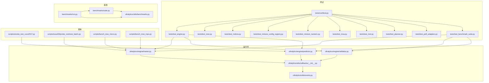
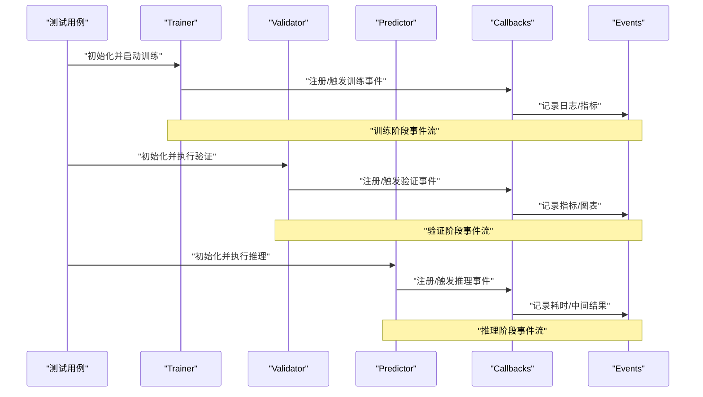
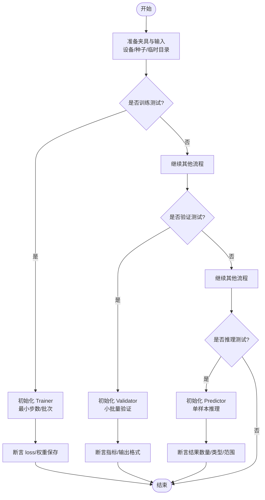
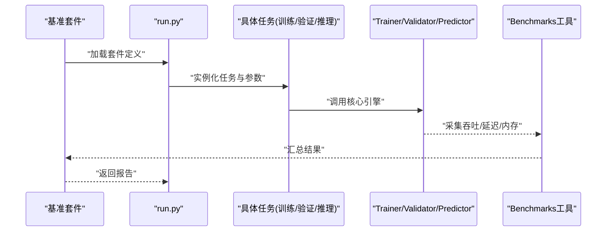
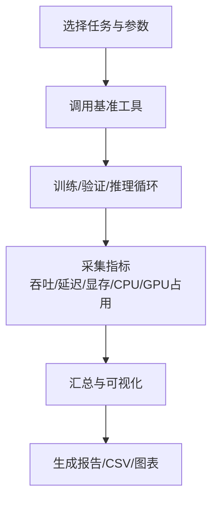
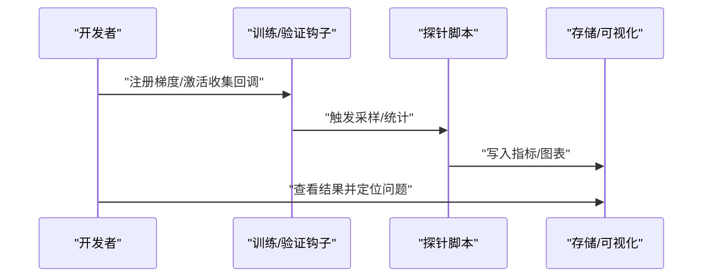
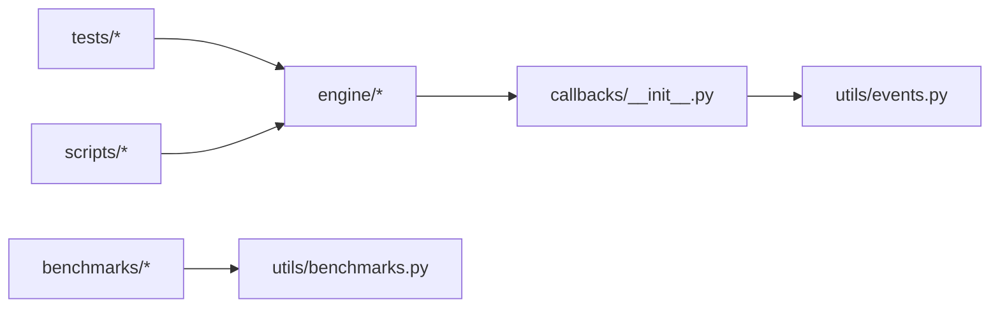

# 测试与调试工具

<cite>
**本文引用的文件**
- [tests/conftest.py](file://tests/conftest.py)
- [tests/test_engine.py](file://tests/test_engine.py)
- [tests/test_moe.py](file://tests/test_moe.py)
- [tests/test_molora.py](file://tests/test_molora.py)
- [tests/test_mixture_config_registry.py](file://tests/test_mixture_config_registry.py)
- [tests/test_mixture_numeric.py](file://tests/test_mixture_numeric.py)
- [tests/test_moa.py](file://tests/test_moa.py)
- [tests/test_mot.py](file://tests/test_mot.py)
- [tests/test_planner.py](file://tests/test_planner.py)
- [tests/test_peft_adapters.py](file://tests/test_peft_adapters.py)
- [tests/test_benchmark_suite.py](file://tests/test_benchmark_suite.py)
- [benchmarks/suite.py](file://benchmarks/suite.py)
- [benchmarks/run.py](file://benchmarks/run.py)
- [ultralytics/utils/benchmarks.py](file://ultralytics/utils/benchmarks.py)
- [ultralytics/engine/trainer.py](file://ultralytics/engine/trainer.py)
- [ultralytics/engine/validator.py](file://ultralytics/engine/validator.py)
- [ultralytics/engine/predictor.py](file://ultralytics/engine/predictor.py)
- [ultralytics/utils/callbacks/__init__.py](file://ultralytics/utils/callbacks/__init__.py)
- [ultralytics/utils/events.py](file://ultralytics/utils/events.py)
- [scripts/smoke_test_coco2017.py](file://scripts/smoke_test_coco2017.py)
- [scripts/issue53/probe_visdrone_batch.py](file://scripts/issue53/probe_visdrone_batch.py)
- [scripts/bench_moe_micro.py](file://scripts/bench_moe_micro.py)
- [scripts/bench_moe_mps.py](file://scripts/bench_moe_mps.py)
- [.github/workflows/ci.yml](file://.github/workflows/ci.yml)
</cite>

## 目录
1. [简介](#简介)
2. [项目结构](#项目结构)
3. [核心组件](#核心组件)
4. [架构总览](#架构总览)
5. [详细组件分析](#详细组件分析)
6. [依赖关系分析](#依赖关系分析)
7. [性能考量](#性能考量)
8. [故障排查指南](#故障排查指南)
9. [结论](#结论)
10. [附录](#附录)

## 简介
本指南面向扩展开发者，聚焦“自定义扩展的测试与调试工具使用”。内容覆盖：
- 单元测试编写方法（含模拟数据、断言验证）
- 集成测试设计模式（确保扩展与核心系统兼容）
- 性能分析工具（内存泄漏检测、CPU/GPU利用率分析）
- 调试技巧与问题诊断流程（梯度检查、激活值分析、计算图可视化）
- 基准测试构建与结果解读
- 持续集成中的自动化测试配置
- 常见问题排查方法与解决方案

## 项目结构
仓库围绕“测试”和“基准/性能”两大主题组织：
- tests：PyTest 测试套件，按模块划分（engine、moe、molora、mixture、moa、mot、planner、peft等），并提供 conftest 全局夹具。
- benchmarks：基准套件定义与运行入口，统一编排不同任务与数据集的基准用例。
- ultralytics/utils/benchmarks.py：通用基准工具函数（如吞吐/延迟统计）。
- scripts：脚本化测试与诊断工具（冒烟测试、微基准、MPS 环境探测等）。
- .github/workflows：CI 流水线配置，驱动自动化测试与基准。

图表来源
- [tests/conftest.py](file://tests/conftest.py)
- [tests/test_engine.py](file://tests/test_engine.py)
- [tests/test_moe.py](file://tests/test_moe.py)
- [tests/test_molora.py](file://tests/test_molora.py)
- [tests/test_mixture_config_registry.py](file://tests/test_mixture_config_registry.py)
- [tests/test_mixture_numeric.py](file://tests/test_mixture_numeric.py)
- [tests/test_moa.py](file://tests/test_moa.py)
- [tests/test_mot.py](file://tests/test_mot.py)
- [tests/test_planner.py](file://tests/test_planner.py)
- [tests/test_peft_adapters.py](file://tests/test_peft_adapters.py)
- [tests/test_benchmark_suite.py](file://tests/test_benchmark_suite.py)
- [benchmarks/suite.py](file://benchmarks/suite.py)
- [benchmarks/run.py](file://benchmarks/run.py)
- [ultralytics/utils/benchmarks.py](file://ultralytics/utils/benchmarks.py)
- [ultralytics/engine/trainer.py](file://ultralytics/engine/trainer.py)
- [ultralytics/engine/validator.py](file://ultralytics/engine/validator.py)
- [ultralytics/engine/predictor.py](file://ultralytics/engine/predictor.py)
- [ultralytics/utils/callbacks/__init__.py](file://ultralytics/utils/callbacks/__init__.py)
- [ultralytics/utils/events.py](file://ultralytics/utils/events.py)
- [scripts/smoke_test_coco2017.py](file://scripts/smoke_test_coco2017.py)
- [scripts/issue53/probe_visdrone_batch.py](file://scripts/issue53/probe_visdrone_batch.py)
- [scripts/bench_moe_micro.py](file://scripts/bench_moe_micro.py)
- [scripts/bench_moe_mps.py](file://scripts/bench_moe_mps.py)

章节来源
- [tests/conftest.py](file://tests/conftest.py)
- [benchmarks/suite.py](file://benchmarks/suite.py)
- [benchmarks/run.py](file://benchmarks/run.py)
- [ultralytics/utils/benchmarks.py](file://ultralytics/utils/benchmarks.py)

## 核心组件
- PyTest 夹具与共享资源（conftest）
  - 提供设备选择、随机种子、临时目录、模型权重缓存、数据集路径等夹具，保证测试可重复与环境隔离。
- 引擎层测试（trainer/validator/predictor）
  - 通过最小输入构造训练/验证/推理流程，断言输出形状、类型与关键指标范围，验证扩展与核心引擎的兼容性。
- MoE/MoA/Mixture 专项测试
  - 覆盖路由、专家加载、稀疏调度、数值稳定性、导出一致性等关键路径。
- MOLORA 专项测试
  - 验证路由感知合并、稀疏分发、数据类型兼容性与语义正确性。
- MOT 与 Planner 测试
  - 验证多目标跟踪链路、场景感知路由与规划器行为。
- PEFT/LoRA 适配测试
  - 验证适配器注入、参数冻结/解冻、合并与导出流程。
- 基准套件与工具
  - 统一基准定义、执行与结果汇总；封装吞吐/延迟统计与可视化辅助。

章节来源
- [tests/conftest.py](file://tests/conftest.py)
- [tests/test_engine.py](file://tests/test_engine.py)
- [tests/test_moe.py](file://tests/test_moe.py)
- [tests/test_molora.py](file://tests/test_molora.py)
- [tests/test_mixture_config_registry.py](file://tests/test_mixture_config_registry.py)
- [tests/test_mixture_numeric.py](file://tests/test_mixture_numeric.py)
- [tests/test_moa.py](file://tests/test_moa.py)
- [tests/test_mot.py](file://tests/test_mot.py)
- [tests/test_planner.py](file://tests/test_planner.py)
- [tests/test_peft_adapters.py](file://tests/test_peft_adapters.py)
- [tests/test_benchmark_suite.py](file://tests/test_benchmark_suite.py)
- [benchmarks/suite.py](file://benchmarks/suite.py)
- [benchmarks/run.py](file://benchmarks/run.py)
- [ultralytics/utils/benchmarks.py](file://ultralytics/utils/benchmarks.py)

## 架构总览
下图展示从测试到运行时核心组件的调用链路与事件回调机制。

图表来源
- [ultralytics/engine/trainer.py](file://ultralytics/engine/trainer.py)
- [ultralytics/engine/validator.py](file://ultralytics/engine/validator.py)
- [ultralytics/engine/predictor.py](file://ultralytics/engine/predictor.py)
- [ultralytics/utils/callbacks/__init__.py](file://ultralytics/utils/callbacks/__init__.py)
- [ultralytics/utils/events.py](file://ultralytics/utils/events.py)

## 详细组件分析

### 单元测试编写指南（含模拟数据与断言）
- 夹具与共享资源
  - 使用 conftest 提供的设备、种子、临时目录与权重缓存，避免硬编码路径与随机性差异。
- 构造最小可复现输入
  - 使用固定形状与类型的张量或图像数组作为输入，必要时结合轻量数据集路径进行端到端验证。
- 断言策略
  - 形状与类型：确保输出维度、dtype 符合预期。
  - 数值范围：对损失、置信度、坐标等进行合理阈值断言。
  - 稳定性：多次运行对比方差，或在低精度下断言相对误差。
- 常见模式
  - 训练：初始化 Trainer -> 设置最小 epoch/batch -> 断言 loss 收敛趋势与保存产物。
  - 验证：初始化 Validator -> 在小型集上跑一轮 -> 断言 mAP/metrics 非空且合理。
  - 推理：初始化 Predictor -> 单样本推理 -> 断言检测结果数量与格式。

章节来源
- [tests/conftest.py](file://tests/conftest.py)
- [tests/test_engine.py](file://tests/test_engine.py)
- [tests/test_moe.py](file://tests/test_moe.py)
- [tests/test_molora.py](file://tests/test_molora.py)
- [tests/test_mixture_config_registry.py](file://tests/test_mixture_config_registry.py)
- [tests/test_mixture_numeric.py](file://tests/test_mixture_numeric.py)
- [tests/test_moa.py](file://tests/test_moa.py)
- [tests/test_mot.py](file://tests/test_mot.py)
- [tests/test_planner.py](file://tests/test_planner.py)
- [tests/test_peft_adapters.py](file://tests/test_peft_adapters.py)

### 集成测试设计模式（扩展与核心系统兼容）
- 端到端冒烟测试
  - 使用真实数据集路径与默认配置，快速验证训练/验证/推理主流程不崩溃且产出合理。
- 子系统联动
  - 针对 MoE/MoA/Mixture/MOT/Planner/PEFT 等子系统，串联其接口，验证跨模块契约（如路由输出、专家权重加载、适配器合并）。
- 回归与兼容性
  - 校验导出前后一致性、权重版本兼容、配置漂移检测等。

图表来源
- [benchmarks/suite.py](file://benchmarks/suite.py)
- [benchmarks/run.py](file://benchmarks/run.py)
- [ultralytics/utils/benchmarks.py](file://ultralytics/utils/benchmarks.py)
- [ultralytics/engine/trainer.py](file://ultralytics/engine/trainer.py)
- [ultralytics/engine/validator.py](file://ultralytics/engine/validator.py)
- [ultralytics/engine/predictor.py](file://ultralytics/engine/predictor.py)

章节来源
- [tests/test_benchmark_suite.py](file://tests/test_benchmark_suite.py)
- [benchmarks/suite.py](file://benchmarks/suite.py)
- [benchmarks/run.py](file://benchmarks/run.py)
- [scripts/smoke_test_coco2017.py](file://scripts/smoke_test_coco2017.py)

### 性能分析工具使用方法
- 基准套件
  - 使用 suite 定义不同任务/数据集/批大小组合，run 统一执行并汇总吞吐与延迟。
- 通用工具
  - 封装了计时、内存采样、GPU 利用率采集等能力，便于在训练/验证/推理中插入测量点。
- 专用脚本
  - 微基准脚本用于特定模块（如 MoE）的性能剖析；MPS 脚本用于 Apple Silicon 环境探测与稳定性验证。

章节来源
- [benchmarks/suite.py](file://benchmarks/suite.py)
- [benchmarks/run.py](file://benchmarks/run.py)
- [ultralytics/utils/benchmarks.py](file://ultralytics/utils/benchmarks.py)
- [scripts/bench_moe_micro.py](file://scripts/bench_moe_micro.py)
- [scripts/bench_moe_mps.py](file://scripts/bench_moe_mps.py)

### 调试技巧与问题诊断流程
- 梯度检查
  - 在训练回调中记录关键层的梯度范数与均值，定位梯度爆炸/消失。
- 激活值分析
  - 在推理/验证阶段捕获中间特征分布，观察异常峰值或零区域。
- 计算图可视化
  - 借助事件系统与回调，将关键算子/模块的执行时序与资源占用绘制为图表。
- 典型脚本
  - 冒烟测试快速确认主流程；批处理探针脚本用于复现实验环境与内存占用问题。

章节来源
- [ultralytics/utils/callbacks/__init__.py](file://ultralytics/utils/callbacks/__init__.py)
- [ultralytics/utils/events.py](file://ultralytics/utils/events.py)
- [scripts/smoke_test_coco2017.py](file://scripts/smoke_test_coco2017.py)
- [scripts/issue53/probe_visdrone_batch.py](file://scripts/issue53/probe_visdrone_batch.py)

### 基准测试构建与结果解读
- 构建方式
  - 在 suite 中声明任务、数据集、超参与硬件约束；run 负责并行/串行执行与结果聚合。
- 结果解读
  - 关注吞吐（FPS）、延迟（ms）、显存峰值、CPU/GPU利用率；对比不同配置下的帕累托前沿。
- 回归门禁
  - 将关键指标纳入 CI，失败时阻断合并，防止性能退化。

章节来源
- [benchmarks/suite.py](file://benchmarks/suite.py)
- [benchmarks/run.py](file://benchmarks/run.py)
- [tests/test_benchmark_suite.py](file://tests/test_benchmark_suite.py)

### 持续集成中的自动化测试配置
- 触发条件
  - 代码提交/PR 自动触发测试与基准任务。
- 任务矩阵
  - 按 Python 版本、操作系统、CUDA/MPS 环境组合矩阵化执行。
- 缓存与加速
  - 缓存依赖与权重，缩短构建时间。
- 报告与归档
  - 上传测试结果与基准报告，便于回溯与评审。

章节来源
- [.github/workflows/ci.yml](file://.github/workflows/ci.yml)

## 依赖关系分析
- 测试与运行时耦合
  - 测试直接依赖 trainer/validator/predictor 的公共接口，确保扩展以稳定契约接入。
- 事件与回调
  - 通过 callbacks 与 events 解耦观测逻辑，便于扩展自定义监控与诊断。
- 基准与工具
  - 基准套件复用通用工具函数，降低重复实现成本。

图表来源
- [tests/test_engine.py](file://tests/test_engine.py)
- [ultralytics/engine/trainer.py](file://ultralytics/engine/trainer.py)
- [ultralytics/engine/validator.py](file://ultralytics/engine/validator.py)
- [ultralytics/engine/predictor.py](file://ultralytics/engine/predictor.py)
- [ultralytics/utils/callbacks/__init__.py](file://ultralytics/utils/callbacks/__init__.py)
- [ultralytics/utils/events.py](file://ultralytics/utils/events.py)
- [benchmarks/suite.py](file://benchmarks/suite.py)
- [benchmarks/run.py](file://benchmarks/run.py)
- [ultralytics/utils/benchmarks.py](file://ultralytics/utils/benchmarks.py)
- [scripts/smoke_test_coco2017.py](file://scripts/smoke_test_coco2017.py)

## 性能考量
- 批大小与精度
  - 在小批/半精度下优先验证数值稳定性，再在大批/全精度下评估吞吐。
- 设备差异
  - CUDA 与 MPS 的行为差异需分别覆盖，避免平台相关回归。
- 内存管理
  - 注意中间激活与缓存的释放策略，避免长时训练导致 OOM。
- 并行与通信
  - 分布式场景下关注同步开销与错误传播路径，确保可扩展性。

[本节为通用指导，无需源码引用]

## 故障排查指南
- 训练不收敛或 NaN
  - 检查学习率、梯度裁剪、混合精度配置；使用梯度范数与激活分布探针定位异常层。
- 推理结果异常
  - 核对预处理/后处理管线；用单样本推理与可视化输出比对。
- 导出失败或不一致
  - 使用导出预检与 roundtrip 测试，确认算子支持与数值一致性。
- 内存泄漏
  - 使用内存快照与增量对比，定位未释放的张量或缓存。
- 分布式错误
  - 关注根因上报与错误传播路径，复现最小可重现场景。

章节来源
- [ultralytics/utils/callbacks/__init__.py](file://ultralytics/utils/callbacks/__init__.py)
- [ultralytics/utils/events.py](file://ultralytics/utils/events.py)
- [scripts/issue53/probe_visdrone_batch.py](file://scripts/issue53/probe_visdrone_batch.py)
- [tests/test_engine.py](file://tests/test_engine.py)

## 结论
通过统一的夹具、清晰的测试分层、完善的基准与诊断工具，以及稳定的 CI 门禁，本项目为扩展开发提供了可靠的测试与调试基础设施。建议新增扩展时遵循既有模式，补充对应单元/集成/基准用例，并在 PR 中附带性能回归报告。

[本节为总结，无需源码引用]

## 附录
- 常用命令
  - 运行测试：使用 pytest 指定模块或标签
  - 运行基准：通过 run 加载 suite 定义
  - 冒烟测试：执行 smoke 脚本快速验证主流程
- 参考用例
  - 引擎层、MoE/MoA/Mixture、MOLORA、MOT、Planner、PEFT 等测试文件可作为模板参考

章节来源
- [tests/test_engine.py](file://tests/test_engine.py)
- [tests/test_moe.py](file://tests/test_moe.py)
- [tests/test_molora.py](file://tests/test_molora.py)
- [tests/test_mixture_config_registry.py](file://tests/test_mixture_config_registry.py)
- [tests/test_mixture_numeric.py](file://tests/test_mixture_numeric.py)
- [tests/test_moa.py](file://tests/test_moa.py)
- [tests/test_mot.py](file://tests/test_mot.py)
- [tests/test_planner.py](file://tests/test_planner.py)
- [tests/test_peft_adapters.py](file://tests/test_peft_adapters.py)
- [tests/test_benchmark_suite.py](file://tests/test_benchmark_suite.py)
- [benchmarks/suite.py](file://benchmarks/suite.py)
- [benchmarks/run.py](file://benchmarks/run.py)
- [scripts/smoke_test_coco2017.py](file://scripts/smoke_test_coco2017.py)