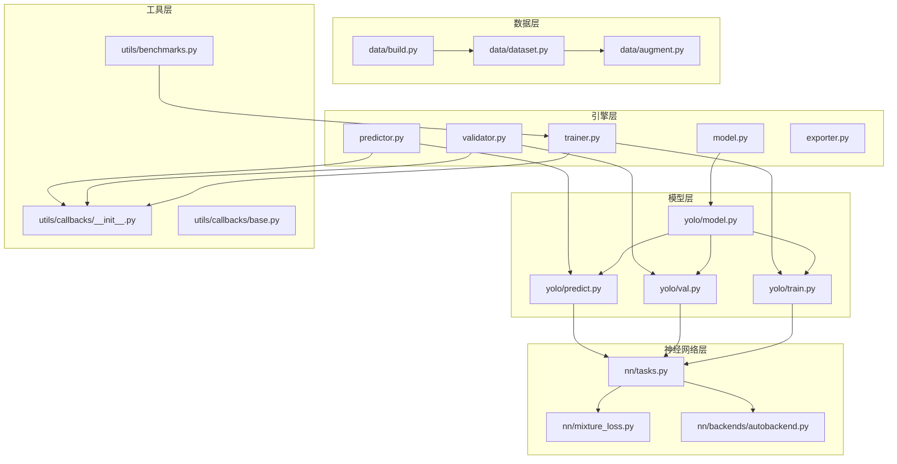
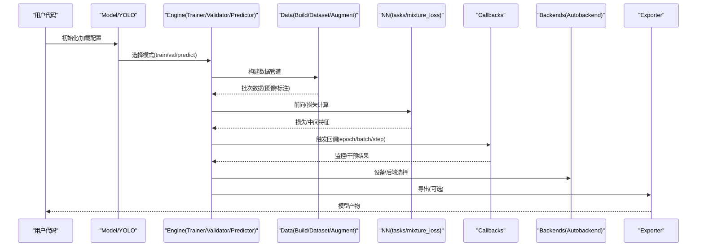
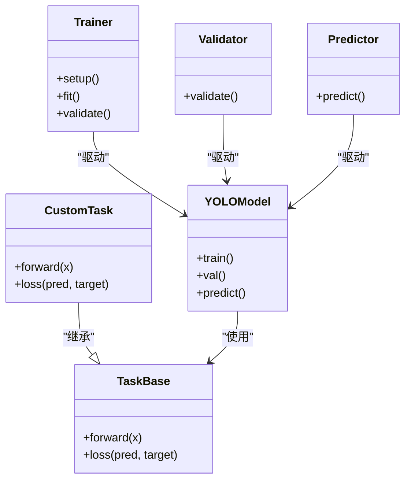
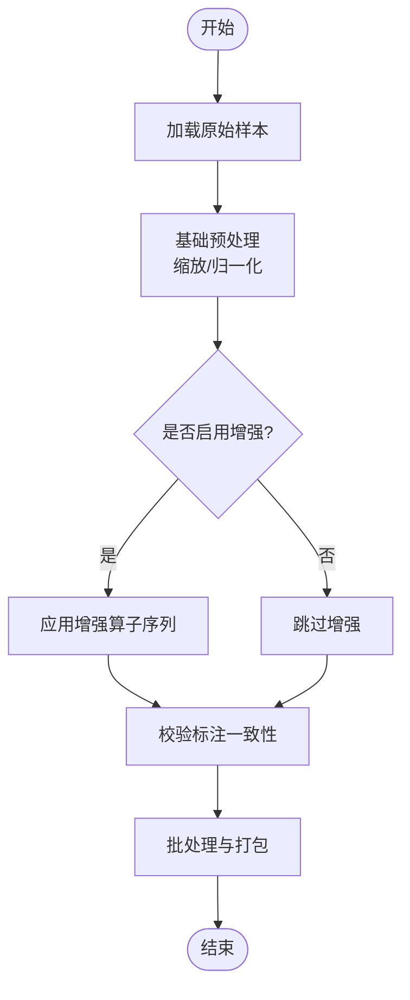
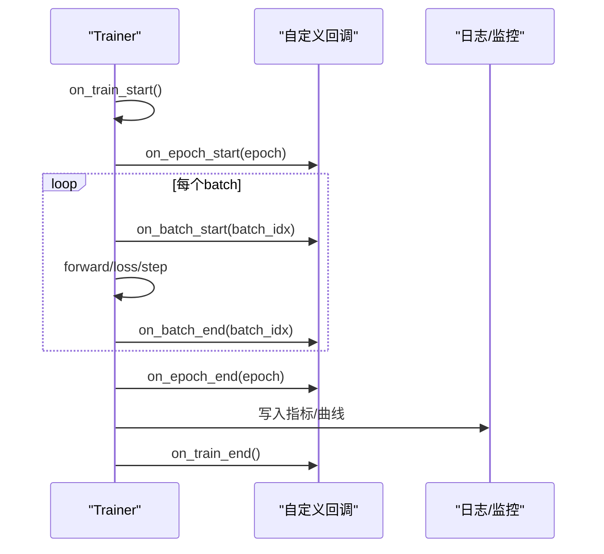
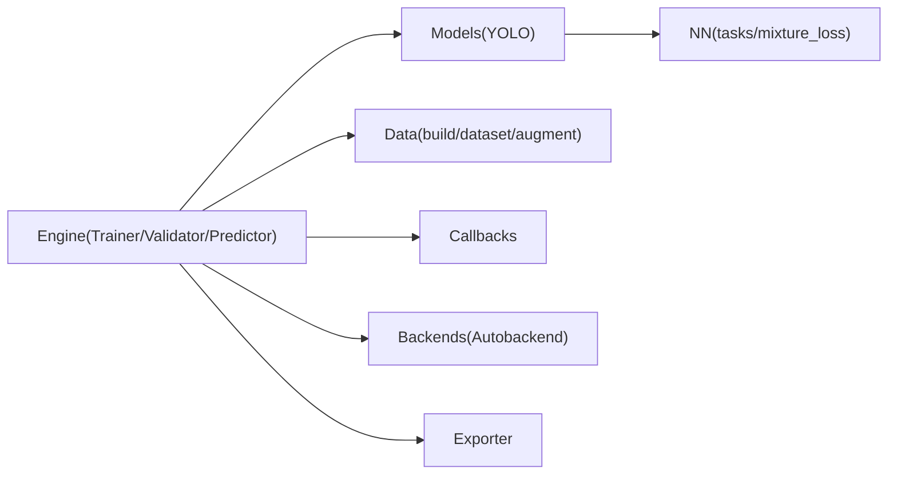

# 自定义扩展开发

<cite>
**本文引用的文件**
- [README.md](file://README.md)
- [ultralytics/engine/trainer.py](file://ultralytics/engine/trainer.py)
- [ultralytics/engine/validator.py](file://ultralytics/engine/validator.py)
- [ultralytics/engine/predictor.py](file://ultralytics/engine/predictor.py)
- [ultralytics/engine/model.py](file://ultralytics/engine/model.py)
- [ultralytics/engine/exporter.py](file://ultralytics/engine/exporter.py)
- [ultralytics/utils/callbacks/__init__.py](file://ultralytics/utils/callbacks/__init__.py)
- [ultralytics/utils/callbacks/base.py](file://ultralytics/utils/callbacks/base.py)
- [ultralytics/data/augment.py](file://ultralytics/data/augment.py)
- [ultralytics/data/dataset.py](file://ultralytics/data/dataset.py)
- [ultralytics/data/build.py](file://ultralytics/data/build.py)
- [ultralytics/models/yolo/model.py](file://ultralytics/models/yolo/model.py)
- [ultralytics/models/yolo/train.py](file://ultralytics/models/yolo/train.py)
- [ultralytics/models/yolo/val.py](file://ultralytics/models/yolo/val.py)
- [ultralytics/models/yolo/predict.py](file://ultralytics/models/yolo/predict.py)
- [ultralytics/nn/tasks.py](file://ultralytics/nn/tasks.py)
- [ultralytics/nn/mixture_loss.py](file://ultralytics/nn/mixture_loss.py)
- [ultralytics/nn/backends/autobackend.py](file://ultralytics/nn/backends/autobackend.py)
- [ultralytics/utils/loss.py](file://ultralytics/utils/loss.py)
- [ultralytics/utils/benchmarks.py](file://ultralytics/utils/benchmarks.py)
- [tests/test_engine.py](file://tests/test_engine.py)
- [tests/test_model_registry.py](file://tests/test_model_registry.py)
- [tests/test_mixture_config_registry.py](file://tests/test_mixture_config_registry.py)
- [tests/test_peft_adapters.py](file://tests/test_peft_adapters.py)
</cite>

## 目录
1. [简介](#简介)
2. [项目结构](#项目结构)
3. [核心组件](#核心组件)
4. [架构总览](#架构总览)
5. [详细组件分析](#详细组件分析)
6. [依赖关系分析](#依赖关系分析)
7. [性能考虑](#性能考虑)
8. [故障排查指南](#故障排查指南)
9. [结论](#结论)
10. [附录](#附录)

## 简介
本指南面向希望在 YOLO-Master 中开发自定义扩展的工程师，覆盖从网络架构设计、损失函数定义、训练配置到数据增强与预处理、回调系统扩展、插件与后端适配器注册、性能分析与调试、以及测试策略的全流程。文档以仓库现有实现为依据，提供可操作的步骤、关键入口与最佳实践，帮助开发者在不破坏既有稳定性的前提下，安全地注入新能力。

## 项目结构
YOLO-Master 采用分层模块化组织：
- 引擎层（engine）：训练、验证、预测、导出等运行时控制流
- 模型层（models）：任务级封装与高层接口
- 神经网络层（nn）：模块、任务图、损失、后端适配
- 数据层（data）：数据集构建、加载与增强
- 工具层（utils）：回调、日志、基准、导出辅助等
- 测试（tests）：单元与集成测试套件

图表来源
- [ultralytics/engine/trainer.py](file://ultralytics/engine/trainer.py)
- [ultralytics/engine/validator.py](file://ultralytics/engine/validator.py)
- [ultralytics/engine/predictor.py](file://ultralytics/engine/predictor.py)
- [ultralytics/engine/model.py](file://ultralytics/engine/model.py)
- [ultralytics/engine/exporter.py](file://ultralytics/engine/exporter.py)
- [ultralytics/models/yolo/model.py](file://ultralytics/models/yolo/model.py)
- [ultralytics/models/yolo/train.py](file://ultralytics/models/yolo/train.py)
- [ultralytics/models/yolo/val.py](file://ultralytics/models/yolo/val.py)
- [ultralytics/models/yolo/predict.py](file://ultralytics/models/yolo/predict.py)
- [ultralytics/nn/tasks.py](file://ultralytics/nn/tasks.py)
- [ultralytics/nn/mixture_loss.py](file://ultralytics/nn/mixture_loss.py)
- [ultralytics/nn/backends/autobackend.py](file://ultralytics/nn/backends/autobackend.py)
- [ultralytics/data/augment.py](file://ultralytics/data/augment.py)
- [ultralytics/data/dataset.py](file://ultralytics/data/dataset.py)
- [ultralytics/data/build.py](file://ultralytics/data/build.py)
- [ultralytics/utils/callbacks/__init__.py](file://ultralytics/utils/callbacks/__init__.py)
- [ultralytics/utils/callbacks/base.py](file://ultralytics/utils/callbacks/base.py)
- [ultralytics/utils/benchmarks.py](file://ultralytics/utils/benchmarks.py)

章节来源
- [README.md](file://README.md)

## 核心组件
- 训练器（Trainer）：负责训练生命周期、优化器/调度器装配、EMA、日志与回调触发、检查点保存等。
- 验证器（Validator）：负责评估指标计算、结果汇总与可视化。
- 预测器（Predictor）：负责推理流水线、后处理与结果输出。
- 模型封装（Model/YOLO）：将具体任务模型与引擎解耦，提供统一 API。
- 任务与损失（tasks/mixture_loss）：定义前向逻辑、损失组合与多任务融合。
- 数据管道（data/*）：数据集构建、加载、增强与批处理。
- 回调系统（callbacks）：在训练各阶段钩子处执行监控、干预与记录。
- 后端适配（backends/autobackend）：自动选择并适配不同部署后端。
- 基准工具（benchmarks）：用于性能分析与回归对比。

章节来源
- [ultralytics/engine/trainer.py](file://ultralytics/engine/trainer.py)
- [ultralytics/engine/validator.py](file://ultralytics/engine/validator.py)
- [ultralytics/engine/predictor.py](file://ultralytics/engine/predictor.py)
- [ultralytics/engine/model.py](file://ultralytics/engine/model.py)
- [ultralytics/models/yolo/model.py](file://ultralytics/models/yolo/model.py)
- [ultralytics/nn/tasks.py](file://ultralytics/nn/tasks.py)
- [ultralytics/nn/mixture_loss.py](file://ultralytics/nn/mixture_loss.py)
- [ultralytics/data/augment.py](file://ultralytics/data/augment.py)
- [ultralytics/data/dataset.py](file://ultralytics/data/dataset.py)
- [ultralytics/data/build.py](file://ultralytics/data/build.py)
- [ultralytics/utils/callbacks/__init__.py](file://ultralytics/utils/callbacks/__init__.py)
- [ultralytics/utils/callbacks/base.py](file://ultralytics/utils/callbacks/base.py)
- [ultralytics/nn/backends/autobackend.py](file://ultralytics/nn/backends/autobackend.py)
- [ultralytics/utils/benchmarks.py](file://ultralytics/utils/benchmarks.py)

## 架构总览
下图展示了自定义扩展在系统中的接入点与调用链：用户通过 Model/YOLO 暴露的统一接口进入，引擎根据模式（train/val/predict）分发到对应控制器；数据侧由 data/build 组装 Dataset 与增强；训练过程中通过 callbacks 触发监控与干预；损失与任务逻辑位于 nn 层；导出与部署由 exporter 与 autobackend 协同完成。

图表来源
- [ultralytics/engine/trainer.py](file://ultralytics/engine/trainer.py)
- [ultralytics/engine/validator.py](file://ultralytics/engine/validator.py)
- [ultralytics/engine/predictor.py](file://ultralytics/engine/predictor.py)
- [ultralytics/models/yolo/model.py](file://ultralytics/models/yolo/model.py)
- [ultralytics/data/build.py](file://ultralytics/data/build.py)
- [ultralytics/data/dataset.py](file://ultralytics/data/dataset.py)
- [ultralytics/data/augment.py](file://ultralytics/data/augment.py)
- [ultralytics/nn/tasks.py](file://ultralytics/nn/tasks.py)
- [ultralytics/nn/mixture_loss.py](file://ultralytics/nn/mixture_loss.py)
- [ultralytics/utils/callbacks/__init__.py](file://ultralytics/utils/callbacks/__init__.py)
- [ultralytics/nn/backends/autobackend.py](file://ultralytics/nn/backends/autobackend.py)
- [ultralytics/engine/exporter.py](file://ultralytics/engine/exporter.py)

## 详细组件分析

### 自定义网络架构与任务模型
- 目标：在不修改核心引擎的前提下，替换或扩展任务前向与损失组合。
- 建议路径：
  - 在任务层（nn/tasks）新增或继承现有任务类，实现新的前向分支与输出对齐。
  - 若涉及多任务融合，参考 mixture_loss 的组合方式，在任务返回中携带额外头或辅助信号。
  - 在 models/yolo 的任务封装中注册新任务，确保与引擎的输入输出契约一致。
- 关键点：
  - 保持张量形状与语义约定不变，避免下游解析失败。
  - 对新增参数进行显式声明，便于序列化与恢复。
  - 为复杂分支添加必要的数值稳定性保护（如归一化、裁剪）。

章节来源
- [ultralytics/nn/tasks.py](file://ultralytics/nn/tasks.py)
- [ultralytics/nn/mixture_loss.py](file://ultralytics/nn/mixture_loss.py)
- [ultralytics/models/yolo/model.py](file://ultralytics/models/yolo/model.py)

#### 类关系示意

图表来源
- [ultralytics/nn/tasks.py](file://ultralytics/nn/tasks.py)
- [ultralytics/models/yolo/model.py](file://ultralytics/models/yolo/model.py)
- [ultralytics/engine/trainer.py](file://ultralytics/engine/trainer.py)
- [ultralytics/engine/validator.py](file://ultralytics/engine/validator.py)
- [ultralytics/engine/predictor.py](file://ultralytics/engine/predictor.py)

### 自定义损失函数与组合
- 目标：引入新损失项或与现有损失组合，支持多任务场景。
- 建议路径：
  - 在 utils/loss 或 nn/mixture_loss 中实现新损失，遵循统一的签名与返回值约定。
  - 在任务的前向中按需计算并返回损失字典，交由 Trainer 聚合。
  - 若需动态权重或条件激活，可在 Trainer 的回调中按 epoch/step 调整。
- 关键点：
  - 保证梯度稳定，必要时加入正则或裁剪。
  - 对缺失标签或空批做防御性处理。

章节来源
- [ultralytics/utils/loss.py](file://ultralytics/utils/loss.py)
- [ultralytics/nn/mixture_loss.py](file://ultralytics/nn/mixture_loss.py)
- [ultralytics/engine/trainer.py](file://ultralytics/engine/trainer.py)

### 训练配置与生命周期
- 目标：通过配置驱动训练行为，包括优化器、调度器、EMA、日志与导出。
- 建议路径：
  - 在 Trainer 的 setup 阶段读取配置并实例化相应组件。
  - 利用回调在 epoch/batch/step 节点插入自定义逻辑（如早停、学习率预热、断点续训）。
  - 结合 Exporter 在训练完成后自动导出多种格式。
- 关键点：
  - 配置变更应向后兼容，避免破坏已有实验复现。
  - 对分布式环境下的同步与通信进行健壮性处理。

章节来源
- [ultralytics/engine/trainer.py](file://ultralytics/engine/trainer.py)
- [ultralytics/engine/exporter.py](file://ultralytics/engine/exporter.py)

### 数据增强与预处理扩展
- 目标：添加新的增强算子或预处理管线，提升模型泛化能力。
- 建议路径：
  - 在 data/augment 中实现新的增强类，遵循统一的输入输出规范。
  - 在 data/build 中注册增强策略，并在 data/dataset 中按配置组合。
  - 对于昂贵的增强，考虑异步加载与缓存策略。
- 关键点：
  - 增强应保持标注一致性（坐标、类别、掩码等）。
  - 对边界情况（小目标、遮挡）进行针对性设计。

章节来源
- [ultralytics/data/augment.py](file://ultralytics/data/augment.py)
- [ultralytics/data/build.py](file://ultralytics/data/build.py)
- [ultralytics/data/dataset.py](file://ultralytics/data/dataset.py)

#### 增强管线流程图

图表来源
- [ultralytics/data/augment.py](file://ultralytics/data/augment.py)
- [ultralytics/data/build.py](file://ultralytics/data/build.py)
- [ultralytics/data/dataset.py](file://ultralytics/data/dataset.py)

### 回调系统扩展机制
- 目标：在训练各阶段插入监控、干预与记录逻辑。
- 建议路径：
  - 基于 utils/callbacks/base 中的基类，实现自定义回调。
  - 在 Trainer/Validator/Predictor 的生命周期中，于合适钩子触发回调。
  - 支持事件驱动的记录（如 TensorBoard、MLFlow、自定义存储）。
- 关键点：
  - 回调应避免阻塞主线程，必要时异步执行。
  - 对异常进行捕获与上报，防止影响训练主流程。

章节来源
- [ultralytics/utils/callbacks/base.py](file://ultralytics/utils/callbacks/base.py)
- [ultralytics/utils/callbacks/__init__.py](file://ultralytics/utils/callbacks/__init__.py)
- [ultralytics/engine/trainer.py](file://ultralytics/engine/trainer.py)
- [ultralytics/engine/validator.py](file://ultralytics/engine/validator.py)
- [ultralytics/engine/predictor.py](file://ultralytics/engine/predictor.py)

#### 回调时序图

图表来源
- [ultralytics/engine/trainer.py](file://ultralytics/engine/trainer.py)
- [ultralytics/utils/callbacks/base.py](file://ultralytics/utils/callbacks/base.py)

### 插件架构与后端适配器
- 目标：在不侵入核心逻辑的情况下，扩展模型注册、任务路由与后端适配。
- 建议路径：
  - 在 models/yolo 中注册新任务或变体，确保与引擎契约一致。
  - 在 nn/backends/autobackend 中注册新的后端类型，实现设备/格式适配。
  - 在 engine/exporter 中对接导出流程，支持新后端产物。
- 关键点：
  - 插件应具备最小权限原则，仅暴露必要接口。
  - 对版本兼容性进行严格校验，避免运行时崩溃。

章节来源
- [ultralytics/models/yolo/model.py](file://ultralytics/models/yolo/model.py)
- [ultralytics/nn/backends/autobackend.py](file://ultralytics/nn/backends/autobackend.py)
- [ultralytics/engine/exporter.py](file://ultralytics/engine/exporter.py)

### 性能分析工具集成
- 目标：定位瓶颈、对比优化前后性能差异。
- 建议路径：
  - 使用 utils/benchmarks 提供的基准脚本，在不同硬件上运行标准任务。
  - 在 Trainer 中集成计时与内存统计，结合回调输出报告。
  - 针对自定义模块编写微基准，纳入回归测试。
- 关键点：
  - 关注端到端延迟与吞吐，区分算子耗时与I/O开销。
  - 对多卡/多进程场景进行公平对比。

章节来源
- [ultralytics/utils/benchmarks.py](file://ultralytics/utils/benchmarks.py)
- [ultralytics/engine/trainer.py](file://ultralytics/engine/trainer.py)

### 单元测试与集成测试
- 目标：确保扩展的稳定性和兼容性。
- 建议路径：
  - 为自定义任务/损失/增强编写单测，覆盖正常与边界用例。
  - 使用 tests/test_engine.py 作为集成入口，验证端到端流程。
  - 对模型注册表与配置解析进行专项测试，确保无冲突。
- 关键点：
  - 固定随机种子，保证结果可复现。
  - 对分布式路径进行冒烟测试，快速发现通信问题。

章节来源
- [tests/test_engine.py](file://tests/test_engine.py)
- [tests/test_model_registry.py](file://tests/test_model_registry.py)
- [tests/test_mixture_config_registry.py](file://tests/test_mixture_config_registry.py)
- [tests/test_peft_adapters.py](file://tests/test_peft_adapters.py)

## 依赖关系分析
- 耦合度：
  - 引擎层与模型层通过统一接口解耦，降低替换成本。
  - 数据层与增强模块松耦合，便于独立演进。
- 外部依赖：
  - 后端适配抽象了不同部署框架的差异，减少上层感知。
  - 回调系统允许第三方监控工具无缝接入。
- 潜在风险：
  - 过度定制可能导致契约漂移，需在注册表中集中管理。
  - 分布式环境下需关注同步与错误传播。

图表来源
- [ultralytics/engine/trainer.py](file://ultralytics/engine/trainer.py)
- [ultralytics/engine/validator.py](file://ultralytics/engine/validator.py)
- [ultralytics/engine/predictor.py](file://ultralytics/engine/predictor.py)
- [ultralytics/models/yolo/model.py](file://ultralytics/models/yolo/model.py)
- [ultralytics/nn/tasks.py](file://ultralytics/nn/tasks.py)
- [ultralytics/nn/mixture_loss.py](file://ultralytics/nn/mixture_loss.py)
- [ultralytics/data/build.py](file://ultralytics/data/build.py)
- [ultralytics/data/dataset.py](file://ultralytics/data/dataset.py)
- [ultralytics/data/augment.py](file://ultralytics/data/augment.py)
- [ultralytics/utils/callbacks/__init__.py](file://ultralytics/utils/callbacks/__init__.py)
- [ultralytics/nn/backends/autobackend.py](file://ultralytics/nn/backends/autobackend.py)
- [ultralytics/engine/exporter.py](file://ultralytics/engine/exporter.py)

## 性能考虑
- 数据I/O：优先使用预取与并行加载，减少GPU空闲时间。
- 算子融合：尽量合并相邻操作，降低内核启动开销。
- 精度与速度权衡：混合精度与量化需配合校准集与回归测试。
- 分布式：合理划分批大小与通信步长，避免同步热点。
- 监控：在关键路径埋点，持续跟踪延迟分布与峰值。

## 故障排查指南
- 常见问题：
  - 维度不匹配：检查任务输出与损失输入的形状约定。
  - 梯度爆炸/消失：引入梯度裁剪与数值稳定技巧。
  - 回调阻塞：确认回调内无长时间阻塞操作。
  - 后端不兼容：核对导出格式与目标设备要求。
- 诊断手段：
  - 使用回调打印中间张量统计（均值、方差、NaN占比）。
  - 借助基准脚本对比不同实现的耗时差异。
  - 在分布式环境中捕获并上报根因信息，缩短定位时间。

章节来源
- [ultralytics/engine/trainer.py](file://ultralytics/engine/trainer.py)
- [ultralytics/utils/benchmarks.py](file://ultralytics/utils/benchmarks.py)

## 结论
通过在引擎、模型、数据、回调与后端适配层的明确扩展点，YOLO-Master 提供了完善的自定义能力。遵循契约与测试策略，开发者可以安全地引入新架构、损失与增强，并通过回调与基准工具实现高效监控与优化。建议在每次变更后运行完整测试套件，确保兼容性与稳定性。

## 附录
- 开发模板清单：
  - 自定义任务类骨架
  - 自定义损失函数骨架
  - 自定义增强算子骨架
  - 自定义回调骨架
  - 后端适配器骨架
- 调试技巧：
  - 逐步关闭增强与回调，定位问题范围
  - 在小数据集上快速验证，再扩展到全量数据
  - 使用固定种子与最小复现脚本，提高协作效率