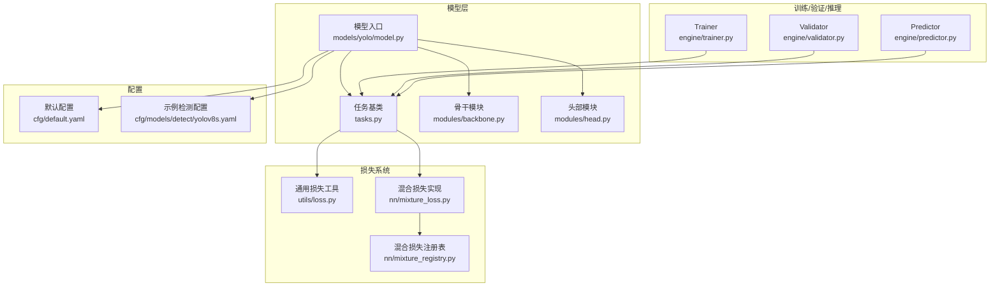
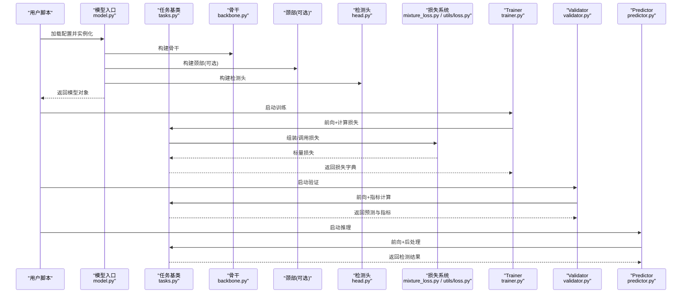
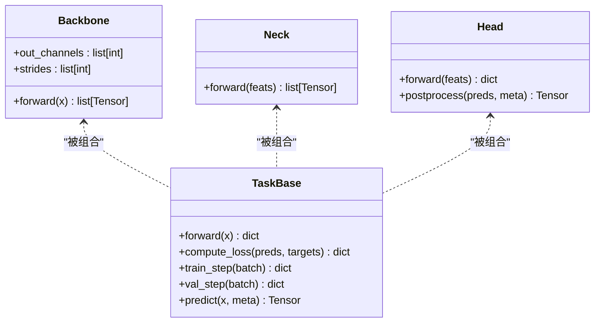
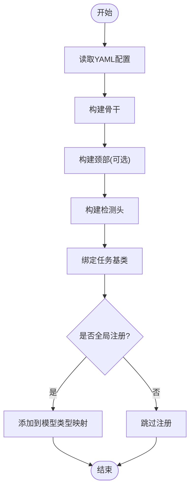
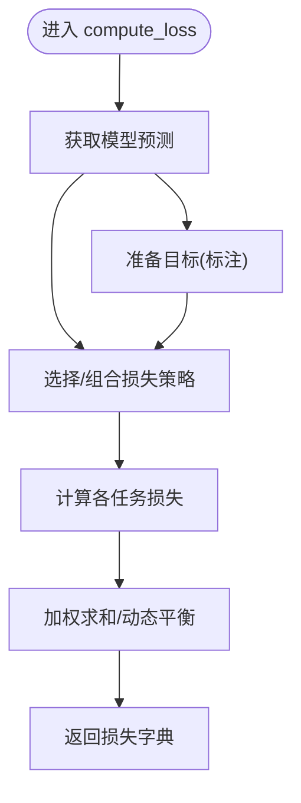
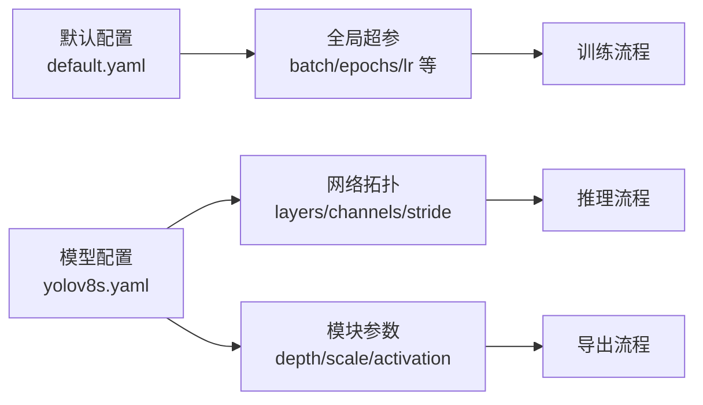
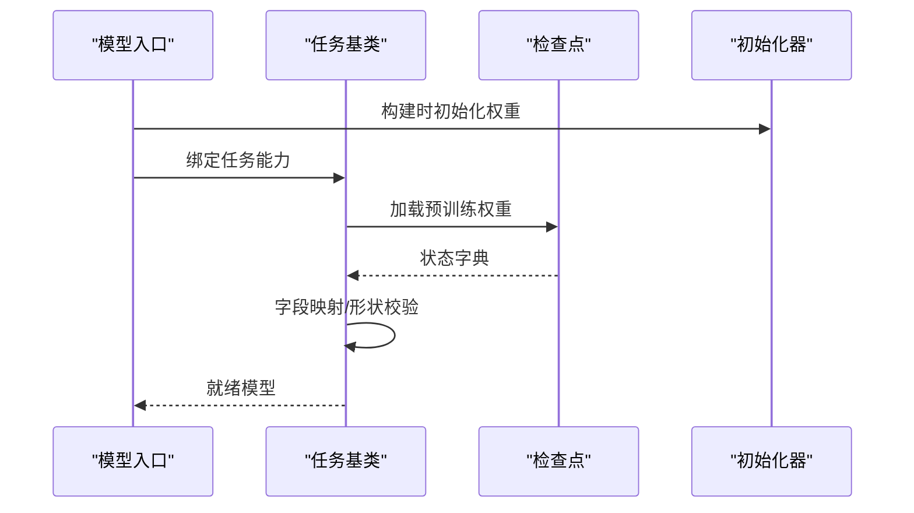
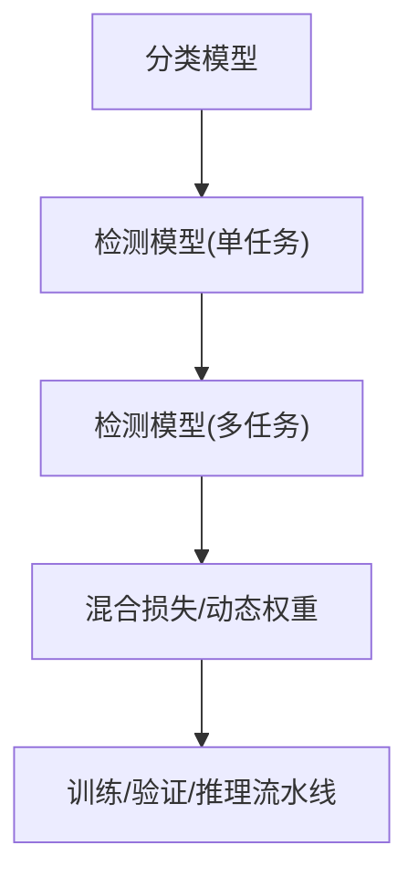
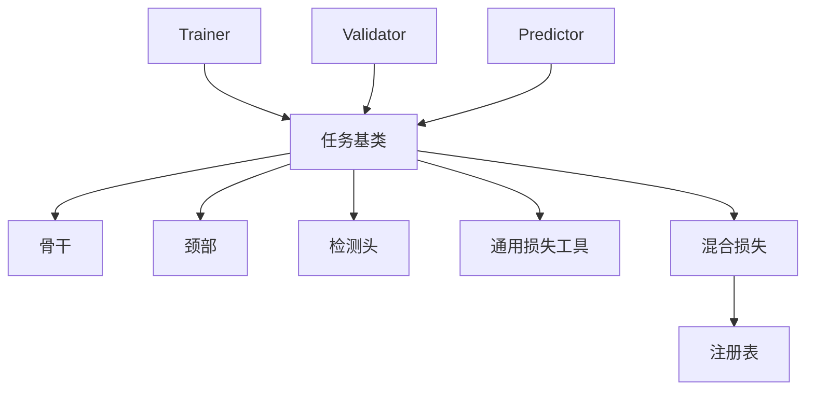

# 自定义模型开发

<cite>
**本文引用的文件**
- [ultralytics/models/yolo/model.py](file://ultralytics/models/yolo/model.py)
- [ultralytics/nn/tasks.py](file://ultralytics/nn/tasks.py)
- [ultralytics/nn/mixture_loss.py](file://ultralytics/nn/mixture_loss.py)
- [ultralytics/nn/mixture_registry.py](file://ultralytics/nn/mixture_registry.py)
- [ultralytics/utils/loss.py](file://ultralytics/utils/loss.py)
- [ultralytics/engine/trainer.py](file://ultralytics/engine/trainer.py)
- [ultralytics/engine/validator.py](file://ultralytics/engine/validator.py)
- [ultralytics/engine/predictor.py](file://ultralytics/engine/predictor.py)
- [ultralytics/nn/modules/backbone.py](file://ultralytics/nn/modules/backbone.py)
- [ultralytics/nn/modules/head.py](file://ultralytics/nn/modules/head.py)
- [ultralytics/cfg/default.yaml](file://ultralytics/cfg/default.yaml)
- [ultralytics/cfg/models/detect/yolov8s.yaml](file://ultralytics/cfg/models/detect/yolov8s.yaml)
</cite>

## 目录
1. [简介](#简介)
2. [项目结构](#项目结构)
3. [核心组件](#核心组件)
4. [架构总览](#架构总览)
5. [详细组件分析](#详细组件分析)
6. [依赖关系分析](#依赖关系分析)
7. [性能考虑](#性能考虑)
8. [故障排查指南](#故障排查指南)
9. [结论](#结论)
10. [附录](#附录)

## 简介
本指南面向希望基于 YOLO-Master 框架扩展或完全自定义检测/多任务模型的开发者。内容覆盖：
- 如何设计新的骨干网络、颈部与检测头，并组合为完整模型
- 如何继承基础模型类并注册新模型类型
- 如何实现自定义损失（含多任务与混合损失）
- 模型配置文件的结构与参数定义
- 权重初始化与加载机制
- 性能优化与内存管理最佳实践

## 项目结构
YOLO-Master 的模型体系围绕“任务基类 + 模块拼装 + 配置驱动”展开：
- 任务基类封装训练/验证/推理流程与损失装配
- 模块层提供可复用的骨干、颈部、头部等构建块
- 配置文件以 YAML 描述模型拓扑与超参
- 损失系统支持标准损失与混合损失注册

图表来源
- [ultralytics/models/yolo/model.py](file://ultralytics/models/yolo/model.py)
- [ultralytics/nn/tasks.py](file://ultralytics/nn/tasks.py)
- [ultralytics/nn/modules/backbone.py](file://ultralytics/nn/modules/backbone.py)
- [ultralytics/nn/modules/head.py](file://ultralytics/nn/modules/head.py)
- [ultralytics/engine/trainer.py](file://ultralytics/engine/trainer.py)
- [ultralytics/engine/validator.py](file://ultralytics/engine/validator.py)
- [ultralytics/engine/predictor.py](file://ultralytics/engine/predictor.py)
- [ultralytics/utils/loss.py](file://ultralytics/utils/loss.py)
- [ultralytics/nn/mixture_loss.py](file://ultralytics/nn/mixture_loss.py)
- [ultralytics/nn/mixture_registry.py](file://ultralytics/nn/mixture_registry.py)
- [ultralytics/cfg/default.yaml](file://ultralytics/cfg/default.yaml)
- [ultralytics/cfg/models/detect/yolov8s.yaml](file://ultralytics/cfg/models/detect/yolov8s.yaml)

章节来源
- [ultralytics/models/yolo/model.py](file://ultralytics/models/yolo/model.py)
- [ultralytics/nn/tasks.py](file://ultralytics/nn/tasks.py)
- [ultralytics/nn/mixture_loss.py](file://ultralytics/nn/mixture_loss.py)
- [ultralytics/nn/mixture_registry.py](file://ultralytics/nn/mixture_registry.py)
- [ultralytics/utils/loss.py](file://ultralytics/utils/loss.py)
- [ultralytics/engine/trainer.py](file://ultralytics/engine/trainer.py)
- [ultralytics/engine/validator.py](file://ultralytics/engine/validator.py)
- [ultralytics/engine/predictor.py](file://ultralytics/engine/predictor.py)
- [ultralytics/nn/modules/backbone.py](file://ultralytics/nn/modules/backbone.py)
- [ultralytics/nn/modules/head.py](file://ultralytics/nn/modules/head.py)
- [ultralytics/cfg/default.yaml](file://ultralytics/cfg/default.yaml)
- [ultralytics/cfg/models/detect/yolov8s.yaml](file://ultralytics/cfg/models/detect/yolov8s.yaml)

## 核心组件
- 任务基类：统一封装 forward、compute_loss、train_step、val_step、predict 等流程，并提供损失装配接口
- 模型入口：根据配置实例化 backbone-neck-head，绑定任务基类能力
- 模块库：backbone/head 等可复用子模块，便于快速拼装新架构
- 损失系统：通用损失工具 + 混合损失注册表，支持多任务与加权组合
- 训练/验证/推理引擎：Trainer/Validator/Predictor 调用任务基类完成端到端流程

章节来源
- [ultralytics/nn/tasks.py](file://ultralytics/nn/tasks.py)
- [ultralytics/models/yolo/model.py](file://ultralytics/models/yolo/model.py)
- [ultralytics/nn/modules/backbone.py](file://ultralytics/nn/modules/backbone.py)
- [ultralytics/nn/modules/head.py](file://ultralytics/nn/modules/head.py)
- [ultralytics/utils/loss.py](file://ultralytics/utils/loss.py)
- [ultralytics/nn/mixture_loss.py](file://ultralytics/nn/mixture_loss.py)
- [ultralytics/nn/mixture_registry.py](file://ultralytics/nn/mixture_registry.py)
- [ultralytics/engine/trainer.py](file://ultralytics/engine/trainer.py)
- [ultralytics/engine/validator.py](file://ultralytics/engine/validator.py)
- [ultralytics/engine/predictor.py](file://ultralytics/engine/predictor.py)

## 架构总览
下图展示从配置到模型实例化、再到训练/验证/推理的关键路径。

图表来源
- [ultralytics/models/yolo/model.py](file://ultralytics/models/yolo/model.py)
- [ultralytics/nn/tasks.py](file://ultralytics/nn/tasks.py)
- [ultralytics/nn/modules/backbone.py](file://ultralytics/nn/modules/backbone.py)
- [ultralytics/nn/modules/head.py](file://ultralytics/nn/modules/head.py)
- [ultralytics/nn/mixture_loss.py](file://ultralytics/nn/mixture_loss.py)
- [ultralytics/utils/loss.py](file://ultralytics/utils/loss.py)
- [ultralytics/engine/trainer.py](file://ultralytics/engine/trainer.py)
- [ultralytics/engine/validator.py](file://ultralytics/engine/validator.py)
- [ultralytics/engine/predictor.py](file://ultralytics/engine/predictor.py)

## 详细组件分析

### 1) 设计新网络架构（骨干/颈部/检测头）
- 骨干网络
  - 建议遵循现有模块接口，输出多尺度特征图
  - 关注通道数、步长与下采样策略，确保与颈部/头部对齐
- 颈部网络
  - 负责融合多尺度特征，常见为自顶向下/自底向上路径
  - 注意特征分辨率与通道一致性
- 检测头
  - 输出类别概率、边界框回归、分割掩码等
  - 保持与任务基类的输入/输出契约一致

图表来源
- [ultralytics/nn/modules/backbone.py](file://ultralytics/nn/modules/backbone.py)
- [ultralytics/nn/modules/head.py](file://ultralytics/nn/modules/head.py)
- [ultralytics/nn/tasks.py](file://ultralytics/nn/tasks.py)

章节来源
- [ultralytics/nn/modules/backbone.py](file://ultralytics/nn/modules/backbone.py)
- [ultralytics/nn/modules/head.py](file://ultralytics/nn/modules/head.py)
- [ultralytics/nn/tasks.py](file://ultralytics/nn/tasks.py)

### 2) 继承基础模型类并注册新模型类型
- 通过模型入口按配置实例化 backbone-neck-head，并绑定任务基类能力
- 在配置中声明新模型名称与层级结构，使训练/验证/推理能正确解析
- 若需全局注册新模型类型，可在模型入口处添加映射逻辑，以便通过统一 API 创建

图表来源
- [ultralytics/models/yolo/model.py](file://ultralytics/models/yolo/model.py)
- [ultralytics/cfg/models/detect/yolov8s.yaml](file://ultralytics/cfg/models/detect/yolov8s.yaml)

章节来源
- [ultralytics/models/yolo/model.py](file://ultralytics/models/yolo/model.py)
- [ultralytics/cfg/models/detect/yolov8s.yaml](file://ultralytics/cfg/models/detect/yolov8s.yaml)

### 3) 自定义损失函数（多任务学习与混合损失）
- 单任务损失
  - 使用通用损失工具进行数值稳定与归一化
- 多任务学习
  - 将多个任务的损失按权重相加，或在训练循环中分别统计
- 混合损失
  - 利用混合损失实现与注册表，动态选择/组合不同损失策略

图表来源
- [ultralytics/nn/tasks.py](file://ultralytics/nn/tasks.py)
- [ultralytics/utils/loss.py](file://ultralytics/utils/loss.py)
- [ultralytics/nn/mixture_loss.py](file://ultralytics/nn/mixture_loss.py)
- [ultralytics/nn/mixture_registry.py](file://ultralytics/nn/mixture_registry.py)

章节来源
- [ultralytics/nn/tasks.py](file://ultralytics/nn/tasks.py)
- [ultralytics/utils/loss.py](file://ultralytics/utils/loss.py)
- [ultralytics/nn/mixture_loss.py](file://ultralytics/nn/mixture_loss.py)
- [ultralytics/nn/mixture_registry.py](file://ultralytics/nn/mixture_registry.py)

### 4) 模型配置文件结构与参数定义
- 默认配置
  - 包含数据、训练、导出等全局选项
- 模型配置
  - 指定 backbone/neck/head 的层级、通道、深度、激活等
  - 通过键值对描述网络拓扑与超参

图表来源
- [ultralytics/cfg/default.yaml](file://ultralytics/cfg/default.yaml)
- [ultralytics/cfg/models/detect/yolov8s.yaml](file://ultralytics/cfg/models/detect/yolov8s.yaml)

章节来源
- [ultralytics/cfg/default.yaml](file://ultralytics/cfg/default.yaml)
- [ultralytics/cfg/models/detect/yolov8s.yaml](file://ultralytics/cfg/models/detect/yolov8s.yaml)

### 5) 权重初始化与加载机制
- 初始化
  - 在模型构建阶段对关键层执行合适的初始化策略（如卷积核、BN 层）
- 加载
  - 从检查点恢复权重，兼容旧版本格式与字段名映射
- 校验
  - 加载前后进行形状与设备一致性检查，避免运行时错误

图表来源
- [ultralytics/models/yolo/model.py](file://ultralytics/models/yolo/model.py)
- [ultralytics/nn/tasks.py](file://ultralytics/nn/tasks.py)

章节来源
- [ultralytics/models/yolo/model.py](file://ultralytics/models/yolo/model.py)
- [ultralytics/nn/tasks.py](file://ultralytics/nn/tasks.py)

### 6) 端到端示例路径（从分类到多任务检测）
- 简单分类模型
  - 使用轻量骨干 + 分类头，配置最小化，训练/验证/推理走相同任务基类
- 复杂多任务检测模型
  - 骨干 + 颈部 + 检测头，输出类别/框/分割等多任务结果；损失采用混合策略

[此图为概念性流程图，无需图表来源]

章节来源
- [ultralytics/nn/tasks.py](file://ultralytics/nn/tasks.py)
- [ultralytics/nn/mixture_loss.py](file://ultralytics/nn/mixture_loss.py)
- [ultralytics/nn/mixture_registry.py](file://ultralytics/nn/mixture_registry.py)

## 依赖关系分析
- 低耦合高内聚
  - 任务基类仅依赖模块接口，不关心具体实现细节
  - 损失系统与任务解耦，通过注册表动态装配
- 外部依赖
  - 训练/验证/推理引擎通过任务基类间接依赖模型与损失

图表来源
- [ultralytics/engine/trainer.py](file://ultralytics/engine/trainer.py)
- [ultralytics/engine/validator.py](file://ultralytics/engine/validator.py)
- [ultralytics/engine/predictor.py](file://ultralytics/engine/predictor.py)
- [ultralytics/nn/tasks.py](file://ultralytics/nn/tasks.py)
- [ultralytics/nn/modules/backbone.py](file://ultralytics/nn/modules/backbone.py)
- [ultralytics/nn/modules/head.py](file://ultralytics/nn/modules/head.py)
- [ultralytics/utils/loss.py](file://ultralytics/utils/loss.py)
- [ultralytics/nn/mixture_loss.py](file://ultralytics/nn/mixture_loss.py)
- [ultralytics/nn/mixture_registry.py](file://ultralytics/nn/mixture_registry.py)

章节来源
- [ultralytics/engine/trainer.py](file://ultralytics/engine/trainer.py)
- [ultralytics/engine/validator.py](file://ultralytics/engine/validator.py)
- [ultralytics/engine/predictor.py](file://ultralytics/engine/predictor.py)
- [ultralytics/nn/tasks.py](file://ultralytics/nn/tasks.py)
- [ultralytics/nn/modules/backbone.py](file://ultralytics/nn/modules/backbone.py)
- [ultralytics/nn/modules/head.py](file://ultralytics/nn/modules/head.py)
- [ultralytics/utils/loss.py](file://ultralytics/utils/loss.py)
- [ultralytics/nn/mixture_loss.py](file://ultralytics/nn/mixture_loss.py)
- [ultralytics/nn/mixture_registry.py](file://ultralytics/nn/mixture_registry.py)

## 性能考虑
- 计算效率
  - 减少不必要的中间张量复制，尽量原地操作
  - 合理设置批大小与图像尺寸，避免显存抖动
- 内存管理
  - 及时释放中间变量引用，避免梯度图累积
  - 使用梯度累积替代超大 batch
- 数值稳定性
  - 损失计算中加入数值保护（如对数、除法分母加小常数）
  - 监控梯度范数与 NaN/Inf
- 并行与分布式
  - 确保所有模块支持 DDP 通信原语
  - 同步 BN 统计量，避免跨卡不一致

[本节为通用指导，无需章节来源]

## 故障排查指南
- 常见问题
  - 维度不匹配：检查骨干输出通道/步长与颈部/头部配置是否一致
  - 损失爆炸：检查标签范围、损失权重与数值稳定性
  - 权重加载失败：核对字段名映射与版本兼容性
- 定位方法
  - 打印关键张量形状与设备信息
  - 逐步注释模块，缩小问题范围
  - 使用最小可复现配置与数据集

章节来源
- [ultralytics/nn/tasks.py](file://ultralytics/nn/tasks.py)
- [ultralytics/utils/loss.py](file://ultralytics/utils/loss.py)
- [ultralytics/models/yolo/model.py](file://ultralytics/models/yolo/model.py)

## 结论
通过在任务基类之上组合可复用模块、以配置驱动模型拓扑、并以注册表管理损失策略，YOLO-Master 提供了高度可扩展的自定义模型开发范式。按照本指南的步骤，你可以从简单的分类模型起步，逐步演进到复杂的多任务检测模型，并在训练、验证与推理全流程中获得一致的体验。

## 附录
- 参考路径
  - 任务基类与模型入口：[ultralytics/nn/tasks.py](file://ultralytics/nn/tasks.py)、[ultralytics/models/yolo/model.py](file://ultralytics/models/yolo/model.py)
  - 模块库：[ultralytics/nn/modules/backbone.py](file://ultralytics/nn/modules/backbone.py)、[ultralytics/nn/modules/head.py](file://ultralytics/nn/modules/head.py)
  - 损失系统：[ultralytics/utils/loss.py](file://ultralytics/utils/loss.py)、[ultralytics/nn/mixture_loss.py](file://ultralytics/nn/mixture_loss.py)、[ultralytics/nn/mixture_registry.py](file://ultralytics/nn/mixture_registry.py)
  - 训练/验证/推理：[ultralytics/engine/trainer.py](file://ultralytics/engine/trainer.py)、[ultralytics/engine/validator.py](file://ultralytics/engine/validator.py)、[ultralytics/engine/predictor.py](file://ultralytics/engine/predictor.py)
  - 配置：[ultralytics/cfg/default.yaml](file://ultralytics/cfg/default.yaml)、[ultralytics/cfg/models/detect/yolov8s.yaml](file://ultralytics/cfg/models/detect/yolov8s.yaml)