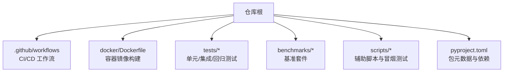
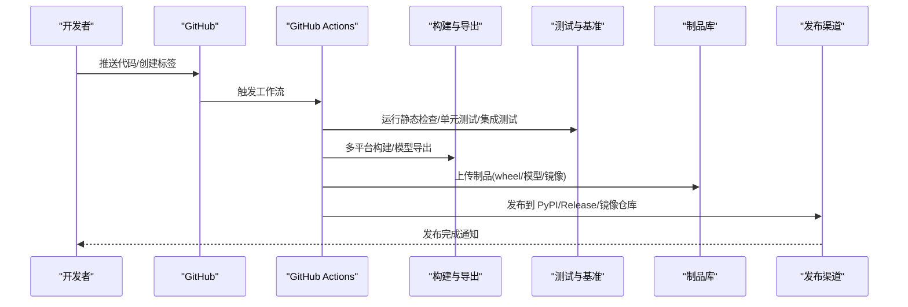
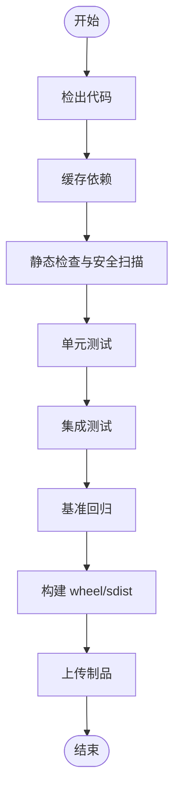
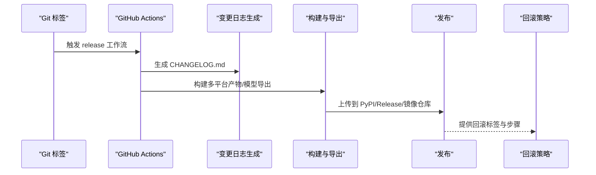
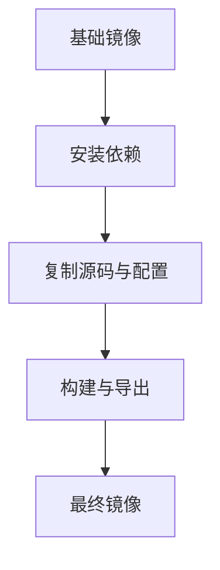
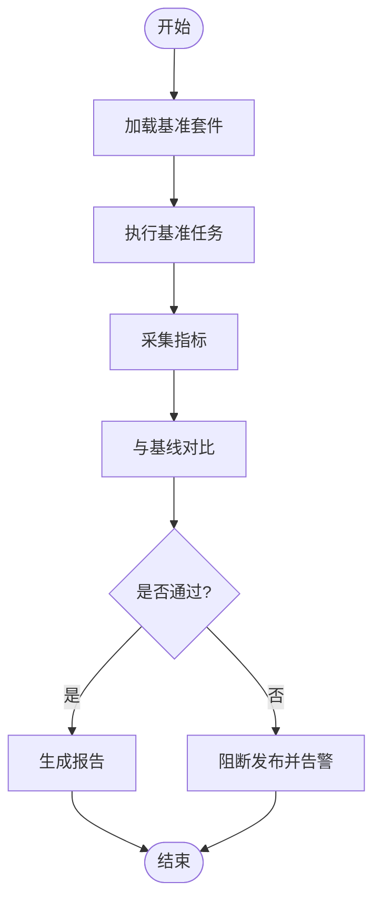
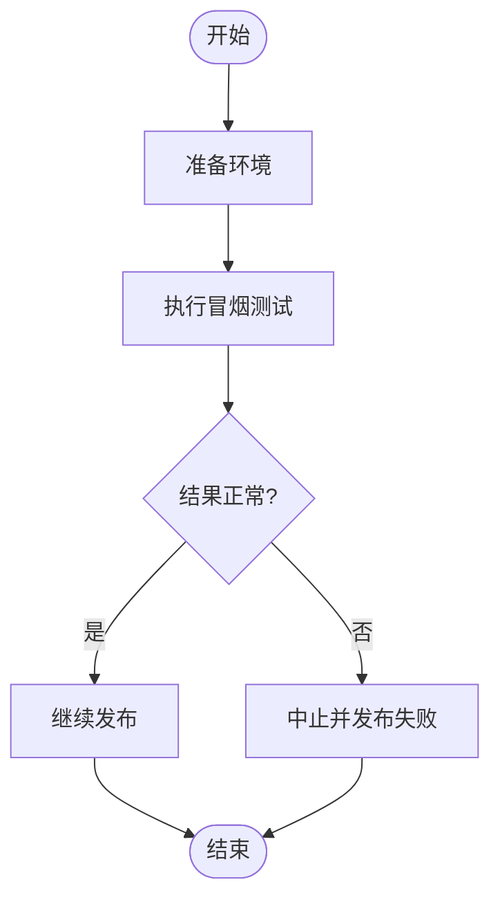
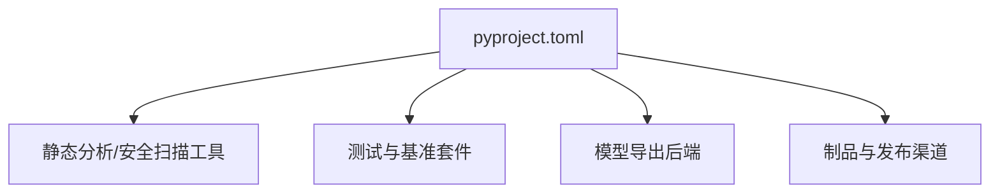

# CI/CD流水线

<cite>
**本文引用的文件**
- [pyproject.toml](file://pyproject.toml)
- [.github/workflows/ci.yml](file://.github/workflows/ci.yml)
- [.github/workflows/release.yml](file://.github/workflows/release.yml)
- [docker/Dockerfile](file://docker/Dockerfile)
- [tests/conftest.py](file://tests/conftest.py)
- [benchmarks/suite.py](file://benchmarks/suite.py)
- [scripts/smoke_test_coco2017.py](file://scripts/smoke_test_coco2017.py)
- [ultralytics/utils/benchmarks.py](file://ultralytics/utils/benchmarks.py)
</cite>

## 目录
1. [简介](#简介)
2. [项目结构](#项目结构)
3. [核心组件](#核心组件)
4. [架构总览](#架构总览)
5. [详细组件分析](#详细组件分析)
6. [依赖分析](#依赖分析)
7. [性能考虑](#性能考虑)
8. [故障排查指南](#故障排查指南)
9. [结论](#结论)
10. [附录](#附录)

## 简介
本文件为 YOLO-Master 的完整 CI/CD 流水线设计文档，目标是在 GitHub Actions 中构建端到端的自动化流程：代码检查、单元测试、集成测试与性能回归；多平台编译与模型导出；制品打包与发布；质量门禁（静态分析、安全扫描、许可证检查）；语义化版本管理与变更日志生成；以及回滚策略与故障恢复机制。文档同时给出可落地的流水线编排建议与关键脚本路径，便于直接落地实施。

## 项目结构
仓库已具备 CI/CD 所需的基础设施位置与工件产出约定：
- GitHub Actions 工作流存放于 .github/workflows
- Docker 镜像构建入口位于 docker/Dockerfile
- 测试用例集中于 tests 目录，包含配置与收敛性断言
- 基准与回归脚本位于 benchmarks 与 scripts
- Python 包元数据与依赖定义在 pyproject.toml

**章节来源**
- [pyproject.toml](file://pyproject.toml)
- [.github/workflows/ci.yml](file://.github/workflows/ci.yml)
- [.github/workflows/release.yml](file://.github/workflows/release.yml)
- [docker/Dockerfile](file://docker/Dockerfile)
- [tests/conftest.py](file://tests/conftest.py)
- [benchmarks/suite.py](file://benchmarks/suite.py)
- [scripts/smoke_test_coco2017.py](file://scripts/smoke_test_coco2017.py)
- [ultralytics/utils/benchmarks.py](file://ultralytics/utils/benchmarks.py)

## 核心组件
- 代码质量门禁
  - 静态分析与格式检查：基于 ruff/flake8/isort/black 等工具链（通过 pyproject.toml 管理）
  - 安全扫描：使用 trivy 或 gitleaks 对源码与依赖进行漏洞与密钥扫描
  - 许可证合规：使用 license-checker 或 scancode 校验第三方许可
- 测试套件
  - 单元测试：pytest + conftest 初始化环境
  - 集成测试：端到端训练/验证/导出链路
  - 性能回归：基于 benchmarks 与 ultralytics.utils.benchmarks 的指标采集与阈值比较
- 构建与导出
  - 多平台构建：Linux/macOS/Windows 矩阵
  - 模型导出：ONNX/TensorRT/OpenVINO/CoreML/TFLite 等
  - 包产物：wheel/sdist 与可选的 Docker 镜像
- 发布与版本管理
  - 语义化版本：基于 Git tag 触发 release 工作流
  - 变更日志：自动生成 CHANGELOG.md
  - 制品归档：PyPI/GitHub Releases/容器镜像仓库
- 回滚与恢复
  - 快速回滚：按标签回退到稳定版本
  - 灰度发布：分阶段部署与自动熔断
  - 健康检查：发布后执行冒烟与基准回归，失败即回滚

**章节来源**
- [pyproject.toml](file://pyproject.toml)
- [tests/conftest.py](file://tests/conftest.py)
- [benchmarks/suite.py](file://benchmarks/suite.py)
- [ultralytics/utils/benchmarks.py](file://ultralytics/utils/benchmarks.py)

## 架构总览
下图展示从提交到发布的端到端流水线，包括质量门禁、测试、构建、导出、制品与发布。

[此图为概念性流程图，不直接映射具体源文件]

## 详细组件分析

### 工作流一：持续集成（ci.yml）
职责
- 拉取代码并缓存依赖
- 运行静态检查与安全扫描
- 执行单元测试与集成测试
- 运行基准回归并与基线对比
- 构建多平台 wheel/sdist
- 上传制品与测试结果

关键步骤建议
- 设置 Python 环境与依赖缓存
- 安装 ruff/flake8/isort/black 并执行检查
- 运行 pytest 并输出 JUnit 报告
- 调用 benchmarks 套件与 ultralytics.utils.benchmarks 采集指标
- 构建 wheel/sdist 并上传至制品存储

**章节来源**
- [.github/workflows/ci.yml](file://.github/workflows/ci.yml)
- [tests/conftest.py](file://tests/conftest.py)
- [benchmarks/suite.py](file://benchmarks/suite.py)
- [ultralytics/utils/benchmarks.py](file://ultralytics/utils/benchmarks.py)

### 工作流二：发布与版本管理（release.yml）
职责
- 监听 Git 标签事件（如 v*.*.*）
- 校验语义化版本
- 生成变更日志
- 构建跨平台产物与模型导出
- 发布到 PyPI/GitHub Releases/镜像仓库
- 记录发布摘要与回滚指引

关键步骤建议
- 解析标签并校验语义化版本
- 生成 CHANGELOG.md（基于提交消息或 PR 模板）
- 构建多平台 wheel/sdist 与 Docker 镜像
- 签名与完整性校验（可选）
- 发布并触发下游环境部署

**章节来源**
- [.github/workflows/release.yml](file://.github/workflows/release.yml)

### 容器镜像构建（Dockerfile）
职责
- 定义基础镜像与运行时依赖
- 安装项目依赖与构建工具
- 复制源码与配置文件
- 暴露端口与默认命令

建议
- 使用多阶段构建减小镜像体积
- 固定依赖版本以确保可重现性
- 将模型导出与推理作为独立镜像层

**章节来源**
- [docker/Dockerfile](file://docker/Dockerfile)

### 测试与基准
- 单元测试与集成测试
  - 使用 pytest 组织用例，conftest.py 负责环境初始化与夹具
  - 集成测试覆盖训练/验证/导出/跟踪等端到端场景
- 基准与性能回归
  - 使用 benchmarks/suite.py 定义基准任务与参数
  - 使用 ultralytics.utils.benchmarks 采集延迟、吞吐与精度指标
  - 与历史基线对比，超阈则阻断发布

**章节来源**
- [tests/conftest.py](file://tests/conftest.py)
- [benchmarks/suite.py](file://benchmarks/suite.py)
- [ultralytics/utils/benchmarks.py](file://ultralytics/utils/benchmarks.py)

### 冒烟测试与快速验证
- 使用 scripts/smoke_test_coco2017.py 进行轻量级端到端验证
- 在发布前对关键路径进行快速回归，确保基本功能可用

**章节来源**
- [scripts/smoke_test_coco2017.py](file://scripts/smoke_test_coco2017.py)

## 依赖分析
- 包元数据与依赖
  - pyproject.toml 集中管理依赖、构建系统与工具链配置
  - 建议在 CI 中缓存 pip 依赖以加速构建
- 外部依赖与集成点
  - 静态分析与安全扫描工具
  - 基准与导出后端（ONNX/TensorRT/OpenVINO 等）
  - 制品与发布渠道（PyPI/GitHub Releases/镜像仓库）

**章节来源**
- [pyproject.toml](file://pyproject.toml)

## 性能考虑
- 并行化
  - 在 CI 中使用矩阵策略并行运行不同平台与任务
  - 拆分基准任务，避免单步过长导致超时
- 缓存
  - 缓存 Python 依赖、模型权重与导出中间产物
- 资源限制
  - 合理分配 CPU/GPU 资源，避免内存溢出
- 增量构建
  - 仅构建变更相关的模块与导出目标
- 指标监控
  - 持续收集延迟、吞吐与精度指标，建立趋势图与告警

[本节为通用指导，不直接分析具体文件]

## 故障排查指南
- 常见问题定位
  - 静态检查失败：查看 ruff/flake8/isort/black 输出，修复格式与风格问题
  - 测试失败：根据 pytest 报告定位失败用例与环境差异
  - 基准回归失败：对比指标变化，确认是否为预期优化或退化
  - 构建失败：检查依赖版本冲突与平台特定问题
- 日志与制品
  - 保留测试报告与基准结果，便于回溯
  - 上传构建日志与错误堆栈，辅助定位
- 回滚与恢复
  - 使用最近稳定标签快速回滚
  - 灰度发布时逐步放量，出现异常立即熔断并回滚

**章节来源**
- [tests/conftest.py](file://tests/conftest.py)
- [benchmarks/suite.py](file://benchmarks/suite.py)
- [ultralytics/utils/benchmarks.py](file://ultralytics/utils/benchmarks.py)

## 结论
通过上述 CI/CD 流水线设计，YOLO-Master 可实现从代码提交到生产发布的端到端自动化，涵盖质量门禁、测试、构建、导出、制品与发布，并提供完善的版本管理、回滚与故障恢复机制。建议在实际落地时结合团队规范与基础设施条件，逐步完善各阶段细节与告警策略。

[本节为总结性内容，不直接分析具体文件]

## 附录
- 建议的流水线阶段清单
  - 代码检查：ruff/flake8/isort/black
  - 安全扫描：trivy/gitleaks
  - 许可证检查：license-checker/scancode
  - 单元测试：pytest
  - 集成测试：端到端训练/验证/导出
  - 基准回归：benchmarks + ultralytics.utils.benchmarks
  - 构建：wheel/sdist + Docker 镜像
  - 发布：PyPI/GitHub Releases/镜像仓库
  - 回滚：按标签回退与灰度熔断

[本节为补充信息，不直接分析具体文件]