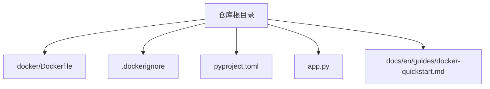
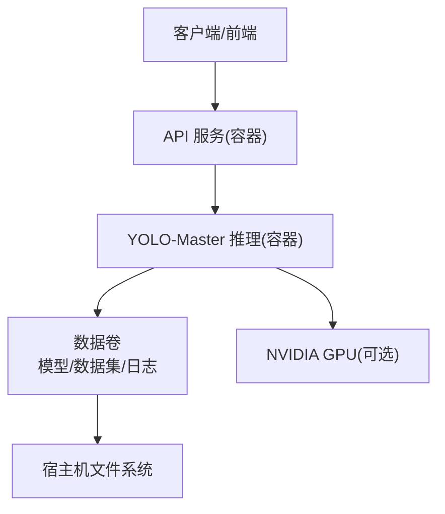
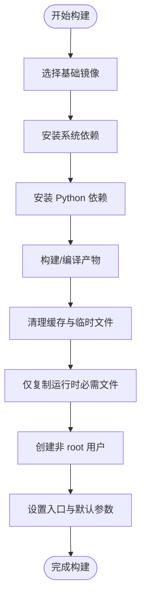
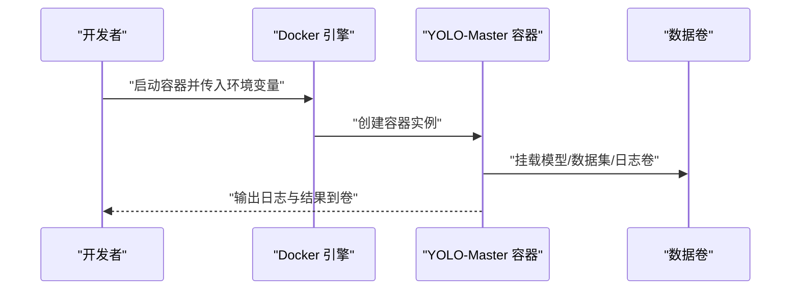
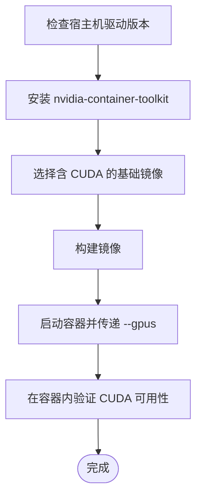
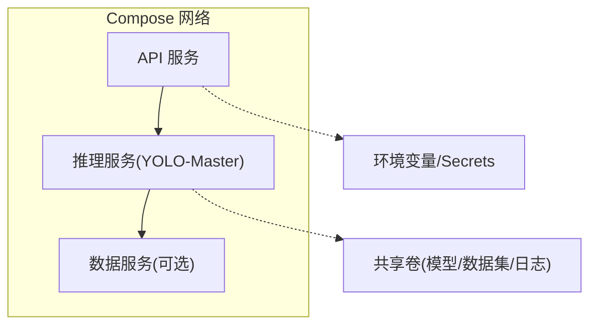
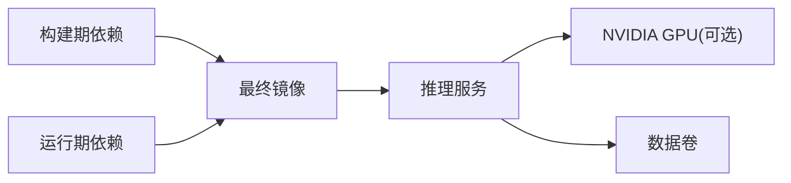

# Docker容器化部署

<cite>
**本文引用的文件**
- [docker/Dockerfile](file://docker/Dockerfile)
- [.dockerignore](file://.dockerignore)
- [pyproject.toml](file://pyproject.toml)
- [app.py](file://app.py)
- [docs/en/guides/docker-quickstart.md](file://docs/en/guides/docker-quickstart.md)
</cite>

## 目录
1. [简介](#简介)
2. [项目结构](#项目结构)
3. [核心组件](#核心组件)
4. [架构总览](#架构总览)
5. [详细组件分析](#详细组件分析)
6. [依赖关系分析](#依赖关系分析)
7. [性能考量](#性能考量)
8. [故障排查指南](#故障排查指南)
9. [结论](#结论)
10. [附录](#附录)

## 简介
本指南面向希望在生产环境中容器化运行 YOLO-Master 的工程师与运维人员，提供从多阶段构建、镜像体积优化、GPU 支持到安全加固与编排部署的全流程说明。文档基于仓库中现有的 Dockerfile、忽略规则、Python 工程配置以及官方快速开始文档进行系统化整理，并给出可落地的最佳实践建议。

## 项目结构
与容器化直接相关的顶层文件如下：
- docker/Dockerfile：容器镜像构建定义
- .dockerignore：构建上下文过滤，减少镜像体积与构建时间
- pyproject.toml：Python 包元数据与依赖声明（用于推断运行时依赖）
- app.py：应用入口脚本（可作为容器启动命令参考）
- docs/en/guides/docker-quickstart.md：官方 Docker 快速入门文档

**图表来源**
- [docker/Dockerfile](file://docker/Dockerfile)
- [.dockerignore](file://.dockerignore)
- [pyproject.toml](file://pyproject.toml)
- [app.py](file://app.py)
- [docs/en/guides/docker-quickstart.md](file://docs/en/guides/docker-quickstart.md)

**章节来源**
- [docker/Dockerfile](file://docker/Dockerfile)
- [.dockerignore](file://.dockerignore)
- [pyproject.toml](file://pyproject.toml)
- [app.py](file://app.py)
- [docs/en/guides/docker-quickstart.md](file://docs/en/guides/docker-quickstart.md)

## 核心组件
- 多阶段构建：通过构建期与运行期分离，将编译/安装产物留在构建阶段，仅拷贝必要文件至最终镜像，显著减小镜像体积。
- 基础镜像选择：优先使用精简且安全的发行版作为基础镜像；如需 GPU 加速，选择包含 CUDA/cuDNN 或 NVIDIA Container Toolkit 兼容的基础镜像。
- 依赖安装优化：利用缓存层、合并 RUN 指令、按需安装系统依赖与 Python 依赖，避免重复下载与冗余包。
- 镜像最小化策略：清理包管理器缓存、删除临时文件、移除开发工具链、仅保留运行时所需二进制与库。
- 环境变量管理：通过 ENV/ARG 注入配置，结合 .env 或编排平台的环境变量机制实现灵活配置。
- 卷挂载与持久化：将模型权重、数据集、日志与结果输出映射到宿主机目录，确保数据可复用与可观测。
- GPU 支持：在宿主安装 NVIDIA 驱动与 nvidia-container-toolkit，并在容器启动时传递 --gpus 参数或使用 Compose 的 deploy.resources.reservations.devices 配置。
- 安全最佳实践：以非 root 用户运行、启用只读根文件系统、限制能力集、定期扫描镜像漏洞并及时修复。
- 编排示例：使用 Docker Compose 定义服务、网络、卷与资源限制，实现多服务协同与弹性扩展。

**章节来源**
- [docker/Dockerfile](file://docker/Dockerfile)
- [docs/en/guides/docker-quickstart.md](file://docs/en/guides/docker-quickstart.md)

## 架构总览
下图展示容器化后典型的生产部署架构：外部请求进入 API 服务，API 调用 YOLO-Master 推理服务，推理服务访问本地或远端模型与数据卷，必要时通过 GPU 加速。

[此图为概念性架构图，不直接映射具体源码文件]

## 详细组件分析

### 多阶段构建与镜像最小化
- 构建阶段：安装系统依赖、Python 依赖、编译原生扩展等；该阶段产物不进入最终镜像。
- 运行阶段：仅复制必要的可执行文件、Python 包与配置文件；设置工作目录、环境变量与非 root 用户。
- 关键优化点：
  - 分层缓存：先复制依赖清单再复制代码，充分利用 Docker 层缓存。
  - 清理缓存：在安装完成后立即清理包管理器缓存与构建中间文件。
  - 精简基础镜像：选择 alpine/minimal 类发行版，或在需要 CUDA 时使用官方精简镜像变体。
  - 单进程模型：容器内仅运行单一主进程，便于水平扩展与资源隔离。

[此流程图展示通用多阶段构建策略，不直接映射具体源码文件]

**章节来源**
- [docker/Dockerfile](file://docker/Dockerfile)

### 基础镜像与依赖安装优化
- 基础镜像选择：
  - CPU-only：推荐轻量级 Linux 发行版镜像，减少攻击面与体积。
  - GPU：选择包含 CUDA/cuDNN 的镜像，并确保与宿主驱动版本匹配。
- 依赖安装优化：
  - 合并 RUN 指令以减少层数。
  - 使用虚拟环境或 pip 缓存提升构建速度。
  - 按功能裁剪依赖，避免引入不必要的重型包。
  - 对大型第三方库采用预编译 wheel 或离线源。

**章节来源**
- [docker/Dockerfile](file://docker/Dockerfile)
- [pyproject.toml](file://pyproject.toml)

### 环境变量管理与卷挂载
- 环境变量：
  - 通过 ENV 定义默认值，在运行时通过 -e 或编排平台覆盖。
  - 敏感信息建议使用密钥管理服务或编排平台的 Secret 机制。
- 卷挂载：
  - 模型权重：将训练好的权重目录挂载为只读卷，避免每次拉取。
  - 数据集：将数据集目录挂载为只读卷，提高 I/O 效率。
  - 日志与结果：将日志与导出结果挂载为读写卷，便于采集与分析。

[此序列图展示环境变量与卷挂载的典型交互，不直接映射具体源码文件]

**章节来源**
- [docker/Dockerfile](file://docker/Dockerfile)

### GPU 支持配置（NVIDIA Container Toolkit）
- 前提条件：
  - 宿主机已安装匹配的 NVIDIA 驱动。
  - 安装并启用 nvidia-container-toolkit。
- 容器启动：
  - 使用 --gpus all 或指定设备 ID。
  - 在 Compose 中使用 devices 字段声明 GPU 资源。
- 验证：
  - 在容器内检查 CUDA 可用性与设备枚举。
  - 运行轻量推理任务确认 GPU 路径正常。

[此流程图展示 GPU 支持的端到端步骤，不直接映射具体源码文件]

**章节来源**
- [docs/en/guides/docker-quickstart.md](file://docs/en/guides/docker-quickstart.md)

### 安全最佳实践
- 非 root 用户运行：在镜像中创建专用用户并以该用户启动进程。
- 最小权限：仅暴露必要端口，禁用不必要的能力集。
- 只读根文件系统：将可变数据写入卷，保持镜像不可变。
- 镜像扫描与修复：
  - 使用 Trivy、Snyk 等工具扫描镜像漏洞。
  - 及时更新基础镜像与依赖，关闭未使用的端口与服务。
- 密钥管理：避免在镜像中硬编码密钥，使用编排平台 Secret 或外部密钥服务。

**章节来源**
- [docker/Dockerfile](file://docker/Dockerfile)

### 应用入口与启动命令
- 入口脚本：参考 app.py 作为容器启动命令的参考实现。
- 启动参数：根据业务需求传入模型路径、输入输出目录、并发度等参数。
- 健康检查：在编排平台配置健康检查探针，确保服务可用性。

**章节来源**
- [app.py](file://app.py)

### Docker Compose 编排示例（多服务部署）
- 服务划分：
  - API 服务：对外暴露 REST/gRPC 接口。
  - 推理服务：封装 YOLO-Master 推理逻辑，支持 GPU。
  - 数据服务（可选）：提供对象存储或数据库访问。
- 网络与卷：
  - 使用自定义网络隔离服务间通信。
  - 共享卷用于模型、数据集与日志。
- 资源限制：
  - 为各服务设置 CPU/内存/GPU 配额，防止资源争用。
- 环境变量与密钥：
  - 使用 .env 文件或编排平台 Secret 管理配置与密钥。

[此图为概念性编排架构图，不直接映射具体源码文件]

**章节来源**
- [docs/en/guides/docker-quickstart.md](file://docs/en/guides/docker-quickstart.md)

## 依赖关系分析
- 构建期依赖：系统包管理器依赖、Python 依赖、编译工具链。
- 运行期依赖：仅保留运行时所需的二进制与库，剔除构建工具与调试符号。
- 外部集成：
  - NVIDIA 驱动与 nvidia-container-toolkit（GPU 场景）。
  - 对象存储或数据库（数据服务场景）。
- 耦合与内聚：
  - 推理服务应尽可能无状态，便于水平扩展。
  - 通过卷与网络解耦数据与通信，降低服务间耦合。

[此图为概念性依赖关系图，不直接映射具体源码文件]

**章节来源**
- [docker/Dockerfile](file://docker/Dockerfile)
- [pyproject.toml](file://pyproject.toml)

## 性能考量
- 构建性能：
  - 合理使用缓存层，优先复制依赖清单。
  - 并行安装依赖（如适用），缩短构建时间。
- 运行性能：
  - 调整批大小与线程数以匹配硬件资源。
  - 使用 GPU 加速与 TensorRT/ONNX 优化（如适用）。
  - 预热模型以降低冷启动延迟。
- I/O 优化：
  - 将数据集与模型放置于高性能存储（SSD/NVMe）。
  - 使用只读卷减少写放大。

[本节提供通用指导，不直接分析具体文件]

## 故障排查指南
- 构建失败：
  - 检查基础镜像版本与网络连通性。
  - 查看依赖安装日志，定位缺失的系统包或 Python 包。
- 运行时错误：
  - 验证环境变量是否正确注入。
  - 检查卷挂载路径与权限。
  - 确认 GPU 驱动与容器工具链版本匹配。
- 性能问题：
  - 监控 CPU/GPU/内存/磁盘 I/O 指标。
  - 调整批大小、线程数与并发度。
  - 分析热点路径，考虑模型量化或导出优化。

**章节来源**
- [docker/Dockerfile](file://docker/Dockerfile)
- [docs/en/guides/docker-quickstart.md](file://docs/en/guides/docker-quickstart.md)

## 结论
通过多阶段构建、精简基础镜像、严格的安全策略与合理的编排设计，可以在生产环境中稳定高效地运行 YOLO-Master。结合 GPU 加速与数据卷持久化，既能满足高吞吐推理需求，又能保障数据安全与可观测性。建议在 CI/CD 流水线中集成镜像扫描与安全加固，持续优化镜像体积与启动性能。

[本节为总结性内容，不直接分析具体文件]

## 附录
- 常用命令参考：
  - 构建镜像：在仓库根目录执行构建命令。
  - 运行容器：传入环境变量与卷挂载，按需启用 GPU。
  - 编排部署：使用 Compose 启动多服务组合。
- 参考文档：
  - 官方 Docker 快速入门：docs/en/guides/docker-quickstart.md

**章节来源**
- [docs/en/guides/docker-quickstart.md](file://docs/en/guides/docker-quickstart.md)