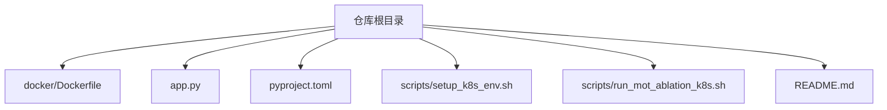
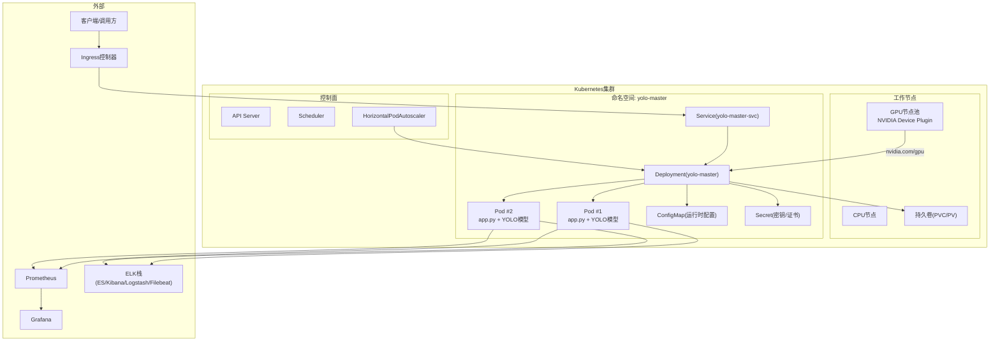
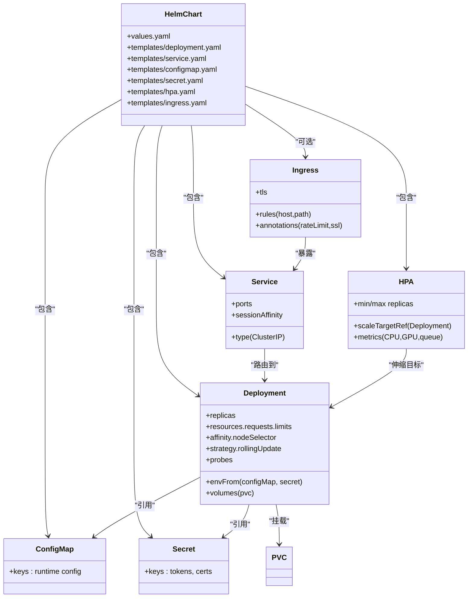
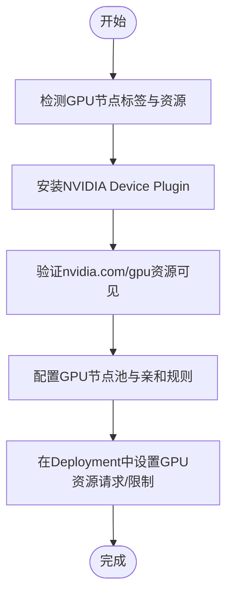
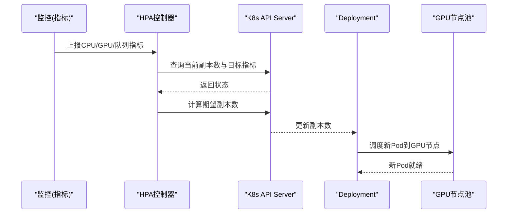
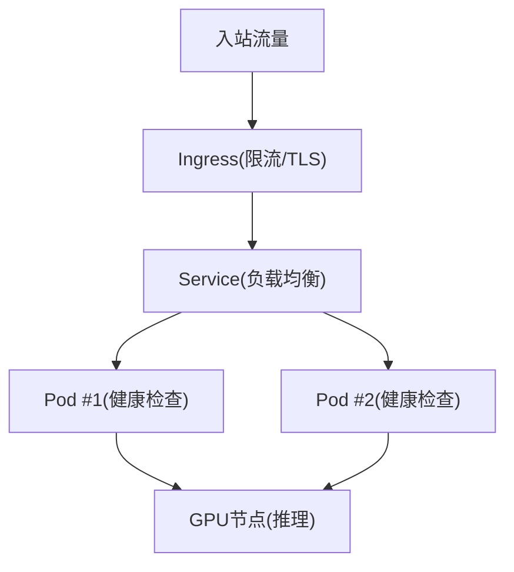
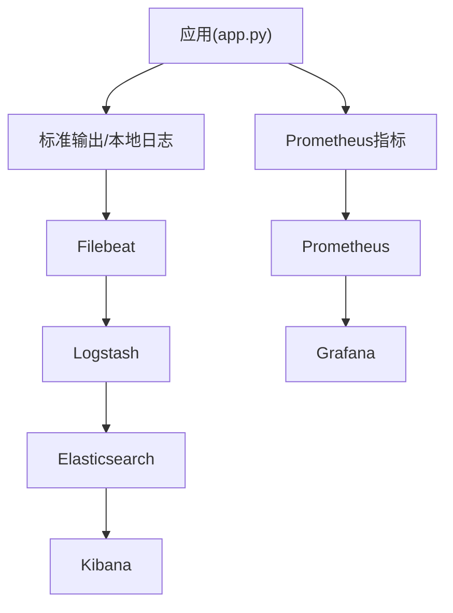
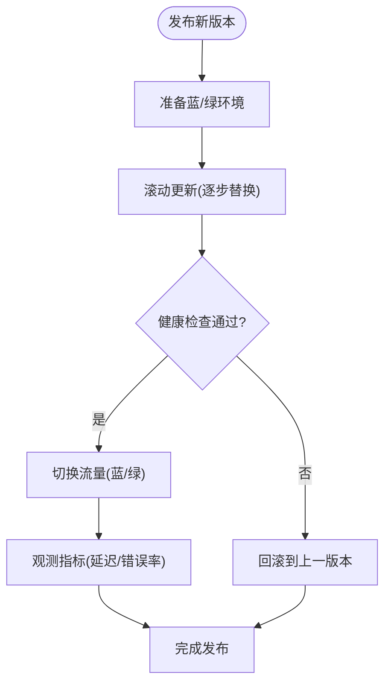
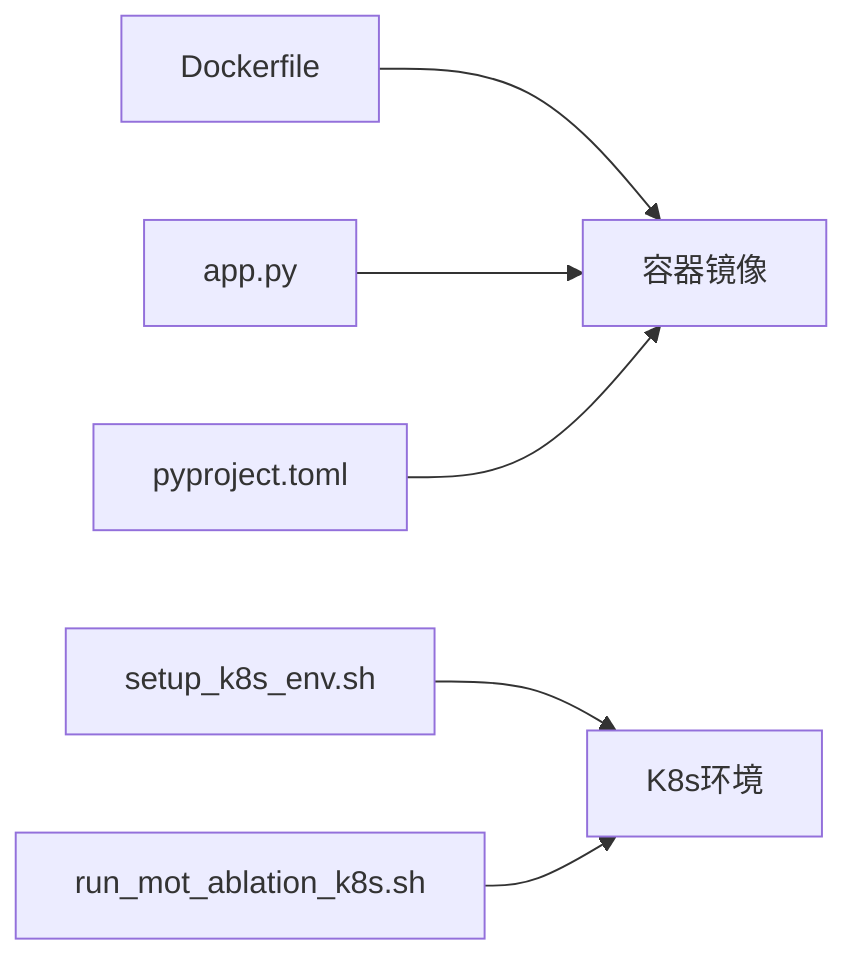

# Kubernetes集群部署

<cite>
**本文引用的文件**
- [Dockerfile](file://docker/Dockerfile)
- [app.py](file://app.py)
- [pyproject.toml](file://pyproject.toml)
- [README.md](file://README.md)
- [setup_k8s_env.sh](file://scripts/setup_k8s_env.sh)
- [run_mot_ablation_k8s.sh](file://scripts/run_mot_ablation_k8s.sh)
</cite>

## 目录
1. [简介](#简介)
2. [项目结构](#项目结构)
3. [核心组件](#核心组件)
4. [架构总览](#架构总览)
5. [详细组件分析](#详细组件分析)
6. [依赖分析](#依赖分析)
7. [性能考虑](#性能考虑)
8. [故障排查指南](#故障排查指南)
9. [结论](#结论)
10. [附录](#附录)

## 简介
本方案面向在Kubernetes集群中完整部署YOLO-Master推理服务，提供基于Helm的标准化模板与最佳实践。内容覆盖：
- Helm Chart资源定义（Deployment、Service、ConfigMap、Secret）
- GPU节点池配置与设备插件安装、资源分配策略
- 水平自动扩缩容（HPA），基于CPU/GPU使用率与请求队列长度
- 负载均衡与高可用配置
- 监控与日志收集（Prometheus、Grafana、ELK）
- 滚动更新与蓝绿发布策略，实现零停机发布

说明：仓库未包含现成的Helm Chart或Kubernetes清单，本文给出可直接落地的模板与步骤，并结合仓库中的容器镜像构建入口与应用启动脚本进行适配。

## 项目结构
与Kubernetes部署直接相关的仓库元素包括：
- 容器镜像构建入口：Dockerfile
- 应用主进程入口：app.py
- 依赖与环境声明：pyproject.toml
- K8s环境准备与示例运行脚本：scripts/setup_k8s_env.sh、scripts/run_mot_ablation_k8s.sh
- 项目概览与使用说明：README.md

**图表来源**
- [Dockerfile](file://docker/Dockerfile)
- [app.py](file://app.py)
- [pyproject.toml](file://pyproject.toml)
- [setup_k8s_env.sh](file://scripts/setup_k8s_env.sh)
- [run_mot_ablation_k8s.sh](file://scripts/run_mot_ablation_k8s.sh)
- [README.md](file://README.md)

**章节来源**
- [Dockerfile](file://docker/Dockerfile)
- [app.py](file://app.py)
- [pyproject.toml](file://pyproject.toml)
- [setup_k8s_env.sh](file://scripts/setup_k8s_env.sh)
- [run_mot_ablation_k8s.sh](file://scripts/run_mot_ablation_k8s.sh)
- [README.md](file://README.md)

## 核心组件
- 容器镜像构建
  - 通过Dockerfile定义基础镜像、依赖安装与可执行入口，确保GPU运行时与CUDA/cuDNN等依赖正确打包。
- 应用服务
  - app.py作为服务入口，负责加载模型、暴露HTTP/gRPC接口、处理并发推理任务。
- 环境与依赖
  - pyproject.toml声明Python依赖与版本约束，便于在镜像构建阶段固定依赖树。
- K8s环境准备
  - setup_k8s_env.sh用于初始化集群所需组件（如设备插件、存储类、网络插件等）。
- 示例工作负载
  - run_mot_ablation_k8s.sh展示如何在K8s上提交作业/运行任务，可作为参考以扩展为长期运行的推理服务。

**章节来源**
- [Dockerfile](file://docker/Dockerfile)
- [app.py](file://app.py)
- [pyproject.toml](file://pyproject.toml)
- [setup_k8s_env.sh](file://scripts/setup_k8s_env.sh)
- [run_mot_ablation_k8s.sh](file://scripts/run_mot_ablation_k8s.sh)

## 架构总览
下图展示了在Kubernetes上的端到端部署架构，涵盖Ingress、Service、Deployment、HPA、GPU Device Plugin、持久化存储、监控与日志采集等关键组件。

**图表来源**
- [Dockerfile](file://docker/Dockerfile)
- [app.py](file://app.py)
- [setup_k8s_env.sh](file://scripts/setup_k8s_env.sh)

## 详细组件分析

### Helm Chart模板设计
建议将以下资源组织到Helm Chart中，按环境（dev/staging/prod）通过values.yaml区分参数。

- Deployment
  - 副本数：初始副本数与最小/最大副本数由HPA管理
  - 资源限制与请求：CPU/GPU显存/内存设置，确保调度到具备GPU的节点
  - 探针：liveness/readiness/startup探针保障健康检查与就绪判定
  - 亲和性与反亲和性：优先调度至GPU节点池；同节点多Pod反亲和提升可用性
  - 滚动更新策略：maxUnavailable/maxSurge保证零停机发布
  - 环境变量与挂载：从ConfigMap/Secret注入配置与密钥；挂载PVC用于模型权重与缓存
- Service
  - ClusterIP类型，暴露内部访问；如需外部访问，结合Ingress
  - 会话亲和：根据业务需求选择None或ClientIP
- ConfigMap
  - 存放非敏感配置（模型路径、批大小、超时、日志级别等）
- Secret
  - 存放敏感信息（认证令牌、证书、数据库连接串等）
- HorizontalPodAutoscaler
  - 指标源：CPU利用率、GPU利用率（需metrics-server与自定义指标）、队列长度（自定义指标）
  - 目标：基于阈值触发扩缩容，避免过度伸缩
- Ingress
  - 对外暴露HTTPS入口，启用TLS与限流策略
- StorageClass & PVC
  - 使用高性能存储类承载模型权重与中间结果

**图表来源**
- [Dockerfile](file://docker/Dockerfile)
- [app.py](file://app.py)

**章节来源**
- [Dockerfile](file://docker/Dockerfile)
- [app.py](file://app.py)

### GPU节点池与设备插件
- 节点池规划
  - 创建专用GPU节点池，标签化节点（如node-role=worker-gpu），通过NodeSelector或NodeAffinity将Pod调度到GPU节点
- 设备插件安装
  - 安装NVIDIA Device Plugin，使Kubernetes识别并暴露nvidia.com/gpu资源
  - 确认kubelet与容器运行时已启用GPU支持
- 资源分配策略
  - 在Deployment中声明requests.limits的nvidia.com/gpu数量
  - 合理设置CPU/内存/GPU显存请求，避免超卖导致抖动
  - 使用Topology Manager与MIG（如适用）优化多租户隔离

**图表来源**
- [setup_k8s_env.sh](file://scripts/setup_k8s_env.sh)

**章节来源**
- [setup_k8s_env.sh](file://scripts/setup_k8s_env.sh)

### 自动扩缩容（HPA）
- 指标来源
  - CPU利用率：内置指标
  - GPU利用率：需要metrics-server与自定义指标导出器（例如nvidia-dcgm-exporter）
  - 请求队列长度：在应用侧暴露自定义指标（如队列深度、待处理任务数）
- 扩缩容策略
  - 基于CPU/GPU阈值的平均利用率目标
  - 基于队列长度的延迟敏感型扩容
  - 冷却时间与抖动抑制，避免频繁扩缩容

**图表来源**
- [app.py](file://app.py)

**章节来源**
- [app.py](file://app.py)

### 负载均衡与高可用
- 负载均衡
  - 使用Service对后端Pod进行轮询/会话亲和分发
  - 结合Ingress启用TLS、限流与熔断策略
- 高可用
  - 多副本部署，跨可用区分布
  - 反亲和规则避免单点故障
  - 健康检查与快速失败重试

**图表来源**
- [app.py](file://app.py)

**章节来源**
- [app.py](file://app.py)

### 监控与日志收集
- 指标采集
  - 应用侧暴露Prometheus指标（QPS、延迟分位、错误率、队列长度、GPU利用率）
  - 集成metrics-server与DCGM Exporter获取GPU指标
- 可视化
  - Grafana仪表盘展示系统与服务级指标
- 日志收集
  - Filebeat采集容器标准输出与本地日志
  - Logstash解析与过滤，Elasticsearch聚合存储，Kibana检索与分析

**图表来源**
- [app.py](file://app.py)

**章节来源**
- [app.py](file://app.py)

### 滚动更新与蓝绿部署
- 滚动更新
  - 使用RollingUpdate策略，逐步替换旧Pod，确保服务不中断
  - 配合探针与就绪检查，确保新版本稳定后再继续
- 蓝绿部署
  - 维护两套相同的服务集（蓝/绿），通过Service或Ingress切换流量
  - 灰度发布时按比例分流，观察指标后全量切换

**图表来源**
- [Dockerfile](file://docker/Dockerfile)
- [app.py](file://app.py)

**章节来源**
- [Dockerfile](file://docker/Dockerfile)
- [app.py](file://app.py)

## 依赖分析
- 容器镜像依赖
  - Dockerfile定义了基础镜像与依赖安装流程，确保GPU运行时与CUDA库可用
- 应用依赖
  - app.py作为服务入口，依赖Python生态与YOLO相关库
- 环境与工具
  - scripts/setup_k8s_env.sh用于集群环境初始化
  - scripts/run_mot_ablation_k8s.sh提供K8s作业运行示例

**图表来源**
- [Dockerfile](file://docker/Dockerfile)
- [app.py](file://app.py)
- [pyproject.toml](file://pyproject.toml)
- [setup_k8s_env.sh](file://scripts/setup_k8s_env.sh)
- [run_mot_ablation_k8s.sh](file://scripts/run_mot_ablation_k8s.sh)

**章节来源**
- [Dockerfile](file://docker/Dockerfile)
- [app.py](file://app.py)
- [pyproject.toml](file://pyproject.toml)
- [setup_k8s_env.sh](file://scripts/setup_k8s_env.sh)
- [run_mot_ablation_k8s.sh](file://scripts/run_mot_ablation_k8s.sh)

## 性能考虑
- 资源配额与限制
  - 合理设置CPU/GPU/内存请求与限制，避免资源争用
- 批处理与并发
  - 调整批大小与并发度，平衡吞吐与延迟
- 模型预热与缓存
  - 启动预热减少冷启动延迟；利用PVC缓存常用模型与中间结果
- 网络与I/O
  - 使用高性能存储类与网络插件，降低I/O瓶颈
- 弹性与稳定性
  - 结合HPA与探针，动态扩缩容与快速故障恢复

[本节为通用指导，无需特定文件来源]

## 故障排查指南
- 常见问题定位
  - GPU不可见：检查Device Plugin安装与nvidia.com/gpu资源是否被调度
  - 启动失败：查看Pod事件与日志，确认依赖与模型路径
  - 扩缩容异常：核对HPA指标源与阈值配置
  - 性能抖动：检查资源限制与亲和/反亲和策略
- 诊断步骤
  - 使用kubectl describe/pod logs查看问题上下文
  - 通过Grafana与Kibana关联指标与日志定位根因
  - 逐步回滚或调整资源配置验证修复效果

**章节来源**
- [setup_k8s_env.sh](file://scripts/setup_k8s_env.sh)
- [run_mot_ablation_k8s.sh](file://scripts/run_mot_ablation_k8s.sh)

## 结论
本方案提供了在Kubernetes集群中部署YOLO-Master的完整路径：从镜像构建、Helm模板设计、GPU节点池与设备插件、HPA自动扩缩容、负载均衡与高可用，到监控日志与发布策略。结合仓库中的Dockerfile与app.py，可按本文模板快速落地生产级部署，并通过持续优化实现稳定高效的推理服务。

[本节为总结，无需特定文件来源]

## 附录
- 部署清单要点
  - Deployment：副本、资源、探针、亲和、滚动更新、环境变量与挂载
  - Service：ClusterIP与端口映射
  - ConfigMap/Secret：配置与密钥分离
  - HPA：CPU/GPU/队列指标与目标阈值
  - Ingress：TLS、限流与域名绑定
  - StorageClass/PVC：模型与数据持久化
- 参考脚本
  - setup_k8s_env.sh：集群环境初始化
  - run_mot_ablation_k8s.sh：K8s作业运行示例

**章节来源**
- [setup_k8s_env.sh](file://scripts/setup_k8s_env.sh)
- [run_mot_ablation_k8s.sh](file://scripts/run_mot_ablation_k8s.sh)