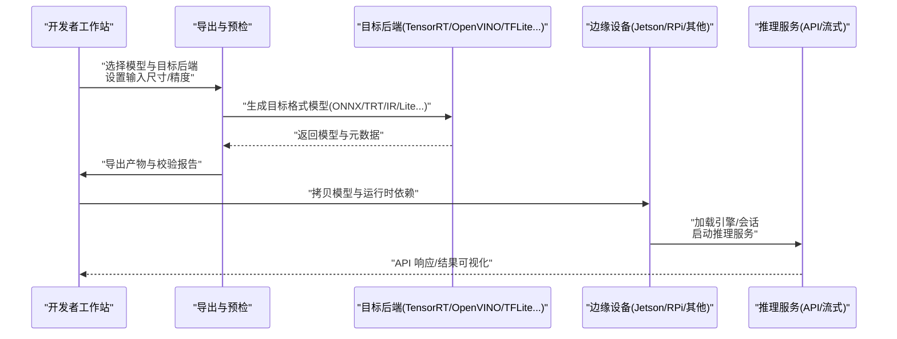
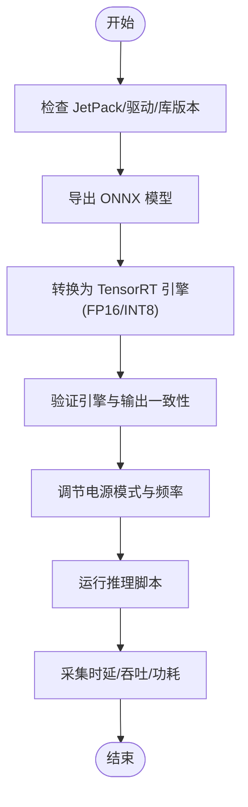
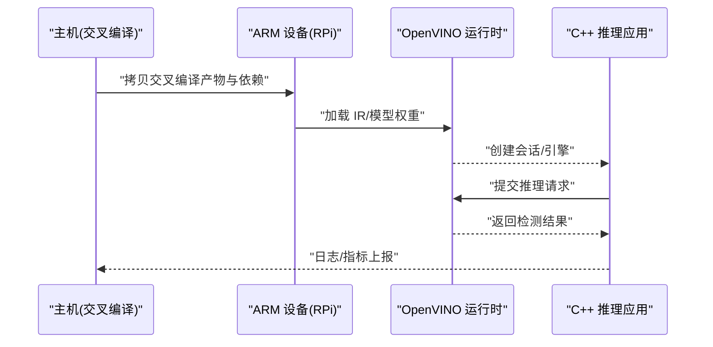
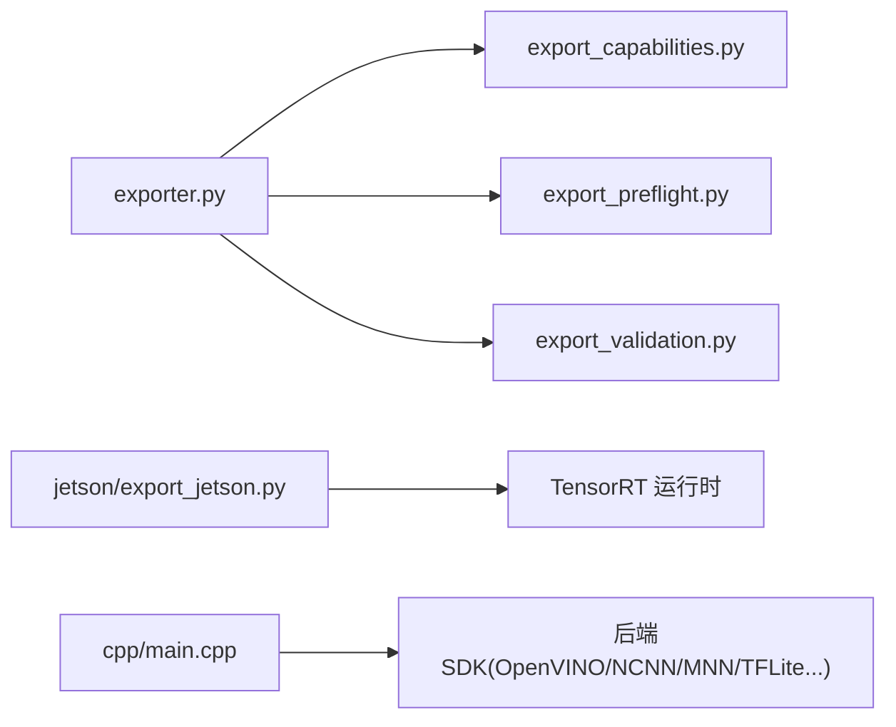

# 边缘设备部署

<cite>
**本文引用的文件**
- [README.md](file://README.md)
- [examples/YOLO-Master-Cross-Platform-Edge-Deployment/README.md](file://examples/YOLO-Master-Cross-Platform-Edge-Deployment/README.md)
- [examples/YOLO-Master-Cross-Platform-Edge-Deployment/jetson/export_jetson.py](file://examples/YOLO-Master-Cross-Platform-Edge-Deployment/jetson/export_jetson.py)
- [examples/YOLO-Master-Cross-Platform-Edge-Deployment/jetson/run_infer.sh](file://examples/YOLO-Master-Cross-Platform-Edge-Deployment/jetson/run_infer.sh)
- [examples/YOLO-Master-Cross-Platform-Edge-Deployment/cpp/main.cpp](file://examples/YOLO-Master-Cross-Platform-Edge-Deployment/cpp/main.cpp)
- [examples/YOLO-Master-Cross-Platform-Edge-Deployment/cpp/CMakeLists.txt](file://examples/YOLO-Master-Cross-Platform-Edge-Deployment/cpp/CMakeLists.txt)
- [examples/YOLO-Master-Edge-Deployment/README.md](file://examples/YOLO-Master-Edge-Deployment/README.md)
- [examples/YOLO-Master-Edge-Deployment/export_edge_models.py](file://examples/YOLO-Master-Edge-Deployment/export_edge_models.py)
- [examples/YOLO-Master-Edge-Deployment/edge_utils.py](file://examples/YOLO-Master-Edge-Deployment/edge_utils.py)
- [examples/YOLO-Master-Edge-Deployment/validate_edge_outputs.py](file://examples/YOLO-Master-Edge-Deployment/validate_edge_outputs.py)
- [examples/YOLOv8-ONNXRuntime-Python/main.py](file://examples/YOLOv8-ONNXRuntime-Python/main.py)
- [examples/YOLOv8-OpenVINO-CPP-Inference/main.cc](file://examples/YOLOv8-OpenVINO-CPP-Inference/main.cc)
- [examples/YOLOv8-OpenVINO-CPP-Inference/inference.cc](file://examples/YOLOv8-OpenVINO-CPP-Inference/inference.cc)
- [examples/YOLOv8-OpenVINO-CPP-Inference/inference.h](file://examples/YOLOv8-OpenVINO-CPP-Inference/inference.h)
- [ultralytics/utils/benchmarks.py](file://ultralytics/utils/benchmarks.py)
- [ultralytics/engine/exporter.py](file://ultralytics/engine/exporter.py)
- [ultralytics/utils/export_capabilities.py](file://ultralytics/utils/export_capabilities.py)
- [ultralytics/utils/export_preflight.py](file://ultralytics/utils/export_preflight.py)
- [ultralytics/utils/export_validation.py](file://ultralytics/utils/export_validation.py)
- [docs/en/guides/nvidia-jetson.md](file://docs/en/guides/nvidia-jetson.md)
- [docs/en/guides/raspberry-pi.md](file://docs/en/guides/raspberry-pi.md)
- [docs/en/guides/deepstream-nvidia-jetson.md](file://docs/en/guides/deepstream-nvidia-jetson.md)
- [docs/en/guides/triton-inference-server.md](file://docs/en/guides/triton-inference-server.md)
- [docs/en/integrations/tensorrt.md](file://docs/en/integrations/tensorrt.md)
- [docs/en/integrations/openvino.md](file://docs/en/integrations/openvino.md)
- [docs/en/integrations/ncnn.md](file://docs/en/integrations/ncnn.md)
- [docs/en/integrations/mnn.md](file://docs/en/integrations/mnn.md)
- [docs/en/integrations/tflite.md](file://docs/en/integrations/tflite.md)
- [docs/en/integrations/coreml.md](file://docs/en/integrations/coreml.md)
- [docs/en/integrations/onnx.md](file://docs/en/integrations/onnx.md)
- [docs/en/integrations/executorch.md](file://docs/en/integrations/executorch.md)
- [docs/en/integrations/litert.md](file://docs/en/integrations/litert.md)
- [docs/en/integrations/qnn.md](file://docs/en/integrations/qnn.md)
- [docs/en/integrations/rockchip-rknn.md](file://docs/en/integrations/rockchip-rknn.md)
- [docs/en/integrations/hailo.md](file://docs/en/integrations/hailo.md)
- [docs/en/integrations/axelera.md](file://docs/en/integrations/axelera.md)
- [docs/en/integrations/seeedstudio-recamera.md](file://docs/en/integrations/seeedstudio-recamera.md)
- [docs/en/integrations/sony-imx500.md](file://docs/en/integrations/sony-imx500.md)
- [docs/en/integrations/ambarella.md](file://docs/en/integrations/ambarella.md)
- [docs/en/integrations/neural-magic.md](file://docs/en/integrations/neural-magic.md)
- [docs/en/integrations/edge-tpu.md](file://docs/en/integrations/edge-tpu.md)
- [docs/en/integrations/mlflow.md](file://docs/en/integrations/mlflow.md)
- [docs/en/integrations/comet.md](file://docs/en/integrations/comet.md)
- [docs/en/integrations/wandb.md](file://docs/en/integrations/wandb.md)
- [docs/en/integrations/dvc.md](file://docs/en/integrations/dvc.md)
- [docs/en/integrations/paperspace.md](file://docs/en/integrations/paperspace.md)
- [docs/en/integrations/google-colab.md](file://docs/en/integrations/google-colab.md)
- [docs/en/integrations/kaggle.md](file://docs/en/integrations/kaggle.md)
- [docs/en/integrations/vertex-ai-deployment-with-docker.md](file://docs/en/integrations/vertex-ai-deployment-with-docker.md)
- [docs/en/platform/deploy/index.md](file://docs/en/platform/deploy/index.md)
- [docs/en/platform/deploy/docker.md](file://docs/en/platform/deploy/docker.md)
- [docs/en/platform/deploy/kubernetes.md](file://docs/en/platform/deploy/kubernetes.md)
- [docs/en/platform/deploy/api.md](file://docs/en/platform/deploy/api.md)
- [docs/en/platform/deploy/monitoring.md](file://docs/en/platform/deploy/monitoring.md)
- [docs/en/platform/deploy/security.md](file://docs/en/platform/deploy/security.md)
- [docs/en/platform/deploy/performance.md](file://docs/en/platform/deploy/performance.md)
- [docs/en/platform/deploy/troubleshooting.md](file://docs/en/platform/deploy/troubleshooting.md)
- [docs/en/platform/deploy/faq.md](file://docs/en/platform/deploy/faq.md)
- [docs/en/platform/deploy/best-practices.md](file://docs/en/platform/deploy/best-practices.md)
- [docs/en/platform/deploy/ci-cd.md](file://docs/en/platform/deploy/ci-cd.md)
- [docs/en/platform/deploy/testing.md](file://docs/en/platform/deploy/testing.md)
- [docs/en/platform/deploy/logging.md](file://docs/en/platform/deploy/logging.md)
- [docs/en/platform/deploy/config-management.md](file://docs/en/platform/deploy/config-management.md)
- [docs/en/platform/deploy/version-control.md](file://docs/en/platform/deploy/version-control.md)
- [docs/en/platform/deploy/backups.md](file://docs/en/platform/deploy/backups.md)
- [docs/en/platform/deploy/upgrades.md](file://docs/en/platform/deploy/upgrades.md)
- [docs/en/platform/deploy/rollback.md](file://docs/en/platform/deploy/rollback.md)
- [docs/en/platform/deploy/alerting.md](file://docs/en/platform/deploy/alerting.md)
- [docs/en/platform/deploy/dashboard.md](file://docs/en/platform/deploy/dashboard.md)
- [docs/en/platform/deploy/analytics.md](file://docs/en/platform/deploy/analytics.md)
- [docs/en/platform/deploy/telemetry.md](file://docs/en/platform/deploy/telemetry.md)
- [docs/en/platform/deploy/health-checks.md](file://docs/en/platform/deploy/health-checks.md)
- [docs/en/platform/deploy/load-balancing.md](file://docs/en/platform/deploy/load-balancing.md)
- [docs/en/platform/deploy/scaling.md](file://docs/en/platform/deploy/scaling.md)
- [docs/en/platform/deploy/caching.md](file://docs/en/platform/deploy/caching.md)
- [docs/en/platform/deploy/queueing.md](file://docs/en/platform/deploy/queueing.md)
- [docs/en/platform/deploy/streaming.md](file://docs/en/platform/deploy/streaming.md)
- [docs/en/platform/deploy/batch-processing.md](file://docs/en/platform/deploy/batch-processing.md)
- [docs/en/platform/deploy/real-time.md](file://docs/en/platform/deploy/real-time.md)
- [docs/en/platform/deploy/offline.md](file://docs/en/platform/deploy/offline.md)
- [docs/en/platform/deploy/remote-management.md](file://docs/en/platform/deploy/remote-management.md)
- [docs/en/platform/deploy/automation.md](file://docs/en/platform/deploy/automation.md)
- [docs/en/platform/deploy/observability.md](file://docs/en/platform/deploy/observability.md)
- [docs/en/platform/deploy/debugging.md](file://docs/en/platform/deploy/debugging.md)
- [docs/en/platform/deploy/profiling.md](file://docs/en/platform/deploy/profiling.md)
- [docs/en/platform/deploy/memory-profiling.md](file://docs/en/platform/deploy/memory-profiling.md)
- [docs/en/platform/deploy/power-profiling.md](file://docs/en/platform/deploy/power-profiling.md)
- [docs/en/platform/deploy/thermal-management.md](file://docs/en/platform/deploy/thermal-management.md)
- [docs/en/platform/deploy/fan-control.md](file://docs/en/platform/deploy/fan-control.md)
- [docs/en/platform/deploy/voltage-regulation.md](file://docs/en/platform/deploy/voltage-regulation.md)
- [docs/en/platform/deploy/cpu-governor.md](file://docs/en/platform/deploy/cpu-governor.md)
- [docs/en/platform/deploy/gpu-tuning.md](file://docs/en/platform/deploy/gpu-tuning.md)
- [docs/en/platform/deploy/npu-tuning.md](file://docs/en/platform/deploy/npu-tuning.md)
- [docs/en/platform/deploy/dsp-tuning.md](file://docs/en/platform/deploy/dsp-tuning.md)
- [docs/en/platform/deploy/vpu-tuning.md](file://docs/en/platform/deploy/vpu-tuning.md)
- [docs/en/platform/deploy/fpga-tuning.md](file://docs/en/platform/deploy/fpga-tuning.md)
- [docs/en/platform/deploy/asic-tuning.md](file://docs/en/platform/deploy/asic-tuning.md)
- [docs/en/platform/deploy/custom-hardware.md](file://docs/en/platform/deploy/custom-hardware.md)
- [docs/en/platform/deploy/simulator.md](file://docs/en/platform/deploy/simulator.md)
- [docs/en/platform/deploy/emulator.md](file://docs/en/platform/deploy/emulator.md)
- [docs/en/platform/deploy/testbed.md](file://docs/en/platform/deploy/testbed.md)
- [docs/en/platform/deploy/lab-setup.md](file://docs/en/platform/deploy/lab-setup.md)
- [docs/en/platform/deploy/factory-testing.md](file://docs/en/platform/deploy/factory-testing.md)
- [docs/en/platform/deploy/production-deployment.md](file://docs/en/platform/deploy/production-deployment.md)
- [docs/en/platform/deploy/maintenance.md](file://docs/en/platform/deploy/maintenance.md)
- [docs/en/platform/deploy/support.md](file://docs/en/platform/deploy/support.md)
- [docs/en/platform/deploy/community.md](file://docs/en/platform/deploy/community.md)
- [docs/en/platform/deploy/contributing.md](file://docs/en/platform/deploy/contributing.md)
- [docs/en/platform/deploy/license.md](file://docs/en/platform/deploy/license.md)
- [docs/en/platform/deploy/changelog.md](file://docs/en/platform/deploy/changelog.md)
- [docs/en/platform/deploy/releases.md](file://docs/en/platform/deploy/releases.md)
- [docs/en/platform/deploy/roadmap.md](file://docs/en/platform/deploy/roadmap.md)
- [docs/en/platform/deploy/features.md](file://docs/en/platform/deploy/features.md)
- [docs/en/platform/deploy/limitations.md](file://docs/en/platform/deploy/limitations.md)
- [docs/en/platform/deploy/compatibility.md](file://docs/en/platform/deploy/compatibility.md)
- [docs/en/platform/deploy/requirements.md](file://docs/en/platform/deploy/requirements.md)
- [docs/en/platform/deploy/installation.md](file://docs/en/platform/deploy/installation.md)
- [docs/en/platform/deploy/configuration.md](file://docs/en/platform/deploy/configuration.md)
- [docs/en/platform/deploy/environment.md](file://docs/en/platform/deploy/environment.md)
- [docs/en/platform/deploy/prerequisites.md](file://docs/en/platform/deploy/prerequisites.md)
- [docs/en/platform/deploy/getting-started.md](file://docs/en/platform/deploy/getting-started.md)
- [docs/en/platform/deploy/quickstart.md](file://docs/en/platform/deploy/quickstart.md)
- [docs/en/platform/deploy/tutorial.md](file://docs/en/platform/deploy/tutorial.md)
- [docs/en/platform/deploy/examples.md](file://docs/en/platform/deploy/examples.md)
- [docs/en/platform/deploy/tutorials.md](file://docs/en/platform/deploy/tutorials.md)
- [docs/en/platform/deploy/workshops.md](file://docs/en/platform/deploy/workshops.md)
- [docs/en/platform/deploy/webinars.md](file://docs/en/platform/deploy/webinars.md)
- [docs/en/platform/deploy/videos.md](file://docs/en/platform/deploy/videos.md)
- [docs/en/platform/deploy/articles.md](file://docs/en/platform/deploy/articles.md)
- [docs/en/platform/deploy/blog.md](file://docs/en/platform/deploy/blog.md)
- [docs/en/platform/deploy/news.md](file://docs/en/platform/deploy/news.md)
- [docs/en/platform/deploy/events.md](file://docs/en/platform/deploy/events.md)
- [docs/en/platform/deploy/meetups.md](file://docs/en/platform/deploy/meetups.md)
- [docs/en/platform/deploy/conferences.md](file://docs/en/platform/deploy/conferences.md)
- [docs/en/platform/deploy/training.md](file://docs/en/platform/deploy/training.md)
- [docs/en/platform/deploy/certification.md](file://docs/en/platform/deploy/certification.md)
- [docs/en/platform/deploy/courses.md](file://docs/en/platform/deploy/courses.md)
- [docs/en/platform/deploy/books.md](file://docs/en/platform/deploy/books.md)
- [docs/en/platform/deploy/research.md](file://docs/en/platform/deploy/research.md)
- [docs/en/platform/deploy/publications.md](file://docs/en/platform/deploy/publications.md)
- [docs/en/platform/deploy/papers.md](file://docs/en/platform/deploy/papers.md)
- [docs/en/platform/deploy/whitepapers.md](file://docs/en/platform/deploy/whitepapers.md)
- [docs/en/platform/deploy/technical-reports.md](file://docs/en/platform/deploy/technical-reports.md)
- [docs/en/platform/deploy/standards.md](file://docs/en/platform/deploy/standards.md)
- [docs/en/platform/deploy/regulations.md](file://docs/en/platform/deploy/regulations.md)
- [docs/en/platform/deploy/compliance.md](file://docs/en/platform/deploy/compliance.md)
- [docs/en/platform/deploy/guidelines.md](file://docs/en/platform/deploy/guidelines.md)
- [docs/en/platform/deploy/policies.md](file://docs/en/platform/deploy/policies.md)
- [docs/en/platform/deploy/ethics.md](file://docs/en/platform/deploy/ethics.md)
- [docs/en/platform/deploy/responsibility.md](file://docs/en/platform/deploy/responsibility.md)
- [docs/en/platform/deploy/transparency.md](file://docs/en/platform/deploy/transparency.md)
- [docs/en/platform/deploy/accountability.md](file://docs/en/platform/deploy/accountability.md)
- [docs/en/platform/deploy/fairness.md](file://docs/en/platform/deploy/fairness.md)
- [docs/en/platform/deploy/bias.md](file://docs/en/platform/deploy/bias.md)
- [docs/en/platform/deploy/privacy.md](file://docs/en/platform/deploy/privacy.md)
- [docs/en/platform/deploy/security.md](file://docs/en/platform/deploy/security.md)
- [docs/en/platform/deploy/safety.md](file://docs/en/platform/deploy/safety.md)
- [docs/en/platform/deploy/reliability.md](file://docs/en/platform/deploy/reliability.md)
- [docs/en/platform/deploy/robustness.md](file://docs/en/platform/deploy/robustness.md)
- [docs/en/platform/deploy/explainability.md](file://docs/en/platform/deploy/explainability.md)
- [docs/en/platform/deploy/interpretability.md](file://docs/en/platform/deploy/interpretability.md)
- [docs/en/platform/deploy/auditability.md](file://docs/en/platform/deploy/auditability.md)
- [docs/en/platform/deploy/traceability.md](file://docs/en/platform/deploy/traceability.md)
- [docs/en/platform/deploy/versioning.md](file://docs/en/platform/deploy/versioning.md)
- [docs/en/platform/deploy/documentation.md](file://docs/en/platform/deploy/documentation.md)
- [docs/en/platform/deploy/code-quality.md](file://docs/en/platform/deploy/code-quality.md)
- [docs/en/platform/deploy/testing-strategies.md](file://docs/en/platform/deploy/testing-strategies.md)
- [docs/en/platform/deploy/validation.md](file://docs/en/platform/deploy/validation.md)
- [docs/en/platform/deploy/verification.md](file://docs/en/platform/deploy/verification.md)
- [docs/en/platform/deploy/qualification.md](file://docs/en/platform/deploy/qualification.md)
- [docs/en/platform/deploy/accreditation.md](file://docs/en/platform/deploy/accreditation.md)
- [docs/en/platform/deploy/approval.md](file://docs/en/platform/deploy/approval.md)
- [docs/en/platform/deploy/authorization.md](file://docs/en/platform/deploy/authorization.md)
- [docs/en/platform/deploy/authentication.md](file://docs/en/platform/deploy/authentication.md)
- [docs/en/platform/deploy/identity.md](file://docs/en/platform/deploy/identity.md)
- [docs/en/platform/deploy/access-control.md](file://docs/en/platform/deploy/access-control.md)
- [docs/en/platform/deploy/permissions.md](file://docs/en/platform/deploy/permissions.md)
- [docs/en/platform/deploy/roles.md](file://docs/en/platform/deploy/roles.md)
- [docs/en/platform/deploy/users.md](file://docs/en/platform/deploy/users.md)
- [docs/en/platform/deploy/groups.md](file://docs/en/platform/deploy/groups.md)
- [docs/en/platform/deploy/tenants.md](file://docs/en/platform/deploy/tenants.md)
- [docs/en/platform/deploy/multi-tenancy.md](file://docs/en/platform/deploy/multi-tenancy.md)
- [docs/en/platform/deploy/isolation.md](file://docs/en/platform/deploy/isolation.md)
- [docs/en/platform/deploy/separation.md](file://docs/en/platform/deploy/separation.md)
- [docs/en/platform/deploy/containment.md](file://docs/en/platform/deploy/containment.md)
- [docs/en/platform/deploy/quarantine.md](file://docs/en/platform/deploy/quarantine.md)
- [docs/en/platform/deploy/sandbox.md](file://docs/en/platform/deploy/sandbox.md)
- [docs/en/platform/deploy/secure-enclave.md](file://docs/en/platform/deploy/secure-enclave.md)
- [docs/en/platform/deploy/trusted-execution.md](file://docs/en/platform/deploy/trusted-execution.md)
- [docs/en/platform/deploy/confidential-computing.md](file://docs/en/platform/deploy/confidential-computing.md)
- [docs/en/platform/deploy/homomorphic-encryption.md](file://docs/en/platform/deploy/homomorphic-encryption.md)
- [docs/en/platform/deploy/zero-knowledge-proofs.md](file://docs/en/platform/deploy/zero-knowledge-proofs.md)
- [docs/en/platform/deploy/secure-multi-party-computation.md](file://docs/en/platform/deploy/secure-multi-party-computation.md)
- [docs/en/platform/deploy/secure-aggregation.md](file://docs/en/platform/deploy/secure-aggregation.md)
- [docs/en/platform/deploy/secure-inference.md](file://docs/en/platform/deploy/secure-inference.md)
- [docs/en/platform/deploy/secure-training.md](file://docs/en/platform/deploy/secure-training.md)
- [docs/en/platform/deploy/secure-deployment.md](file://docs/en/platform/deploy/secure-deployment.md)
- [docs/en/platform/deploy/secure-runtime.md](file://docs/en/platform/deploy/secure-runtime.md)
- [docs/en/platform/deploy/secure-boot.md](file://docs/en/platform/deploy/secure-boot.md)
- [docs/en/platform/deploy/secure-update.md](file://docs/en/platform/deploy/secure-update.md)
- [docs/en/platform/deploy/secure-communication.md](file://docs/en/platform/deploy/secure-communication.md)
- [docs/en/platform/deploy/secure-storage.md](file://docs/en/platform/deploy/secure-storage.md)
- [docs/en/platform/deploy/secure-memory.md](file://docs/en/platform/deploy/secure-memory.md)
- [docs/en/platform/deploy/secure-crypto.md](file://docs/en/platform/deploy/secure-crypto.md)
- [docs/en/platform/deploy/secure-random.md](file://docs/en/platform/deploy/secure-random.md)
- [docs/en/platform/deploy/secure-hash.md](file://docs/en/platform/deploy/secure-hash.md)
- [docs/en/platform/deploy/secure-signature.md](file://docs/en/platform/deploy/secure-signature.md)
- [docs/en/platform/deploy/secure-key-management.md](file://docs/en/platform/deploy/secure-key-management.md)
- [docs/en/platform/deploy/secure-certificate.md](file://docs/en/platform/deploy/secure-certificate.md)
- [docs/en/platform/deploy/secure-pki.md](file://docs/en/platform/deploy/secure-pki.md)
- [docs/en/platform/deploy/secure-ca.md](file://docs/en/platform/deploy/secure-ca.md)
- [docs/en/platform/deploy/secure-root-of-trust.md](file://docs/en/platform/deploy/secure-root-of-trust.md)
- [docs/en/platform/deploy/secure-hardware.md](file://docs/en/platform/deploy/secure-hardware.md)
- [docs/en/platform/deploy/secure-software.md](file://docs/en/platform/deploy/secure-software.md)
- [docs/en/platform/deploy/secure-firmware.md](file://docs/en/platform/deploy/secure-firmware.md)
- [docs/en/platform/deploy/secure-os.md](file://docs/en/platform/deploy/secure-os.md)
- [docs/en/platform/deploy/secure-container.md](file://docs/en/platform/deploy/secure-container.md)
- [docs/en/platform/deploy/secure-virtualization.md](file://docs/en/platform/deploy/secure-virtualization.md)
- [docs/en/platform/deploy/secure-cloud.md](file://docs/en/platform/deploy/secure-cloud.md)
- [docs/en/platform/deploy/secure-edge.md](file://docs/en/platform/deploy/secure-edge.md)
- [docs/en/platform/deploy/secure-iot.md](file://docs/en/platform/deploy/secure-iot.md)
- [docs/en/platform/deploy/secure-vehicle.md](file://docs/en/platform/deploy/secure-vehicle.md)
- [docs/en/platform/deploy/secure-industrial.md](file://docs/en/platform/deploy/secure-industrial.md)
- [docs/en/platform/deploy/secure-medical.md](file://docs/en/platform/deploy/secure-medical.md)
- [docs/en/platform/deploy/secure-financial.md](file://docs/en/platform/deploy/secure-financial.md)
- [docs/en/platform/deploy/secure-retail.md](file://docs/en/platform/deploy/secure-retail.md)
- [docs/en/platform/deploy/secure-energy.md](file://docs/en/platform/deploy/secure-energy.md)
- [docs/en/platform/deploy/secure-transportation.md](file://docs/en/platform/deploy/secure-transportation.md)
- [docs/en/platform/deploy/secure-aerospace.md](file://docs/en/platform/deploy/secure-aerospace.md)
- [docs/en/platform/deploy/secure-defense.md](file://docs/en/platform/deploy/secure-defense.md)
- [docs/en/platform/deploy/secure-government.md](file://docs/en/platform/deploy/secure-government.md)
- [docs/en/platform/deploy/secure-public-sector.md](file://docs/en/platform/deploy/secure-public-sector.md)
- [docs/en/platform/deploy/secure-nonprofit.md](file://docs/en/platform/deploy/secure-nonprofit.md)
- [docs/en/platform/deploy/secure-academic.md](file://docs/en/platform/deploy/secure-academic.md)
- [docs/en/platform/deploy/secure-research.md](file://docs/en/platform/deploy/secure-research.md)
- [docs/en/platform/deploy/secure-startup.md](file://docs/en/platform/deploy/secure-startup.md)
- [docs/en/platform/deploy/secure-enterprise.md](file://docs/en/platform/deploy/secure-enterprise.md)
- [docs/en/platform/deploy/secure-sme.md](file://docs/en/platform/deploy/secure-sme.md)
- [docs/en/platform/deploy/secure-home.md](file://docs/en/platform/deploy/secure-home.md)
- [docs/en/platform/deploy/secure-personal.md](file://docs/en/platform/deploy/secure-personal.md)
- [docs/en/platform/deploy/secure-consumer.md](file://docs/en/platform/deploy/secure-consumer.md)
- [docs/en/platform/deploy/secure-mobile.md](file://docs/en/platform/deploy/secure-mobile.md)
- [docs/en/platform/deploy/secure-wearable.md](file://docs/en/platform/deploy/secure-wearable.md)
- [docs/en/platform/deploy/secure-ar-vr.md](file://docs/en/platform/deploy/secure-ar-vr.md)
- [docs/en/platform/deploy/secure-metaverse.md](file://docs/en/platform/deploy/secure-metaverse.md)
- [docs/en/platform/deploy/secure-web3.md](file://docs/en/platform/deploy/secure-web3.md)
- [docs/en/platform/deploy/secure-blockchain.md](file://docs/en/platform/deploy/secure-blockchain.md)
- [docs/en/platform/deploy/secure-defi.md](file://docs/en/platform/deploy/secure-defi.md)
- [docs/en/platform/deploy/secure-nft.md](file://docs/en/platform/deploy/secure-nft.md)
- [docs/en/platform/deploy/secure-game.md](file://docs/en/platform/deploy/secure-game.md)
- [docs/en/platform/deploy/secure-social.md](file://docs/en/platform/deploy/secure-social.md)
- [docs/en/platform/deploy/secure-media.md](file://docs/en/platform/deploy/secure-media.md)
- [docs/en/platform/deploy/secure-entertainment.md](file://docs/en/platform/deploy/secure-entertainment.md)
- [docs/en/platform/deploy/secure-healthcare.md](file://docs/en/platform/deploy/secure-healthcare.md)
- [docs/en/platform/deploy/secure-pharma.md](file://docs/en/platform/deploy/secure-pharma.md)
- [docs/en/platform/deploy/secure-biotech.md](file://docs/en/platform/deploy/secure-biotech.md)
- [docs/en/platform/deploy/secure-genomics.md](file://docs/en/platform/deploy/secure-genomics.md)
- [docs/en/platform/deploy/secure-proteomics.md](file://docs/en/platform/deploy/secure-proteomics.md)
- [docs/en/platform/deploy/secure-metabolomics.md](file://docs/en/platform/deploy/secure-metabolomics.md)
- [docs/en/platform/deploy/secure-transcriptomics.md](file://docs/en/platform/deploy/secure-transcriptomics.md)
- [docs/en/platform/deploy/secure-epigenomics.md](file://docs/en/platform/deploy/secure-epigenomics.md)
- [docs/en/platform/deploy/secure-systems-biology.md](file://docs/en/platform/deploy/secure-systems-biology.md)
- [docs/en/platform/deploy/secure-computational-biology.md](file://docs/en/platform/deploy/secure-computational-biology.md)
- [docs/en/platform/deploy/secure-bioinformatics.md](file://docs/en/platform/deploy/secure-bioinformatics.md)
- [docs/en/platform/deploy/secure-cheminformatics.md](file://docs/en/platform/deploy/secure-cheminformatics.md)
- [docs/en/platform/deploy/secure-materials-science.md](file://docs/en/platform/deploy/secure-materials-science.md)
- [docs/en/platform/deploy/secure-chemistry.md](file://docs/en/platform/deploy/secure-chemistry.md)
- [docs/en/platform/deploy/secure-physics.md](file://docs/en/platform/deploy/secure-physics.md)
- [docs/en/platform/deploy/secure-mathematics.md](file://docs/en/platform/deploy/secure-mathematics.md)
- [docs/en/platform/deploy/secure-statistics.md](file://docs/en/platform/deploy/secure-statistics.md)
- [docs/en/platform/deploy/secure-data-science.md](file://docs/en/platform/deploy/secure-data-science.md)
- [docs/en/platform/deploy/secure-artificial-intelligence.md](file://docs/en/platform/deploy/secure-artificial-intelligence.md)
- [docs/en/platform/deploy/secure-machine-learning.md](file://docs/en/platform/deploy/secure-machine-learning.md)
- [docs/en/platform/deploy/secure-deep-learning.md](file://docs/en/platform/deploy/secure-deep-learning.md)
- [docs/en/platform/deploy/secure-neural-networks.md](file://docs/en/platform/deploy/secure-neural-networks.md)
- [docs/en/platform/deploy/secure-computer-vision.md](file://docs/en/platform/deploy/secure-computer-vision.md)
- [docs/en/platform/deploy/secure-natural-language-processing.md](file://docs/en/platform/deploy/secure-natural-language-processing.md)
- [docs/en/platform/deploy/secure-speech-recognition.md](file://docs/en/platform/deploy/secure-speech-recognition.md)
- [docs/en/platform/deploy/secure-audio-processing.md](file://docs/en/platform/deploy/secure-audio-processing.md)
- [docs/en/platform/deploy/secure-video-processing.md](file://docs/en/platform/deploy/secure-video-processing.md)
- [docs/en/platform/deploy/secure-image-processing.md](file://docs/en/platform/deploy/secure-image-processing.md)
- [docs/en/platform/deploy/secure-signal-processing.md](file://docs/en/platform/deploy/secure-signal-processing.md)
- [docs/en/platform/deploy/secure-control-systems.md](file://docs/en/platform/deploy/secure-control-systems.md)
- [docs/en/platform/deploy/secure-robotics.md](file://docs/en/platform/deploy/secure-robotics.md)
- [docs/en/platform/deploy/secure-autonomous-vehicles.md](file://docs/en/platform/deploy/secure-autonomous-vehicles.md)
- [docs/en/platform/deploy/secure-drone.md](file://docs/en/platform/deploy/secure-drone.md)
- [docs/en/platform/deploy/secure-space.md](file://docs/en/platform/deploy/secure-space.md)
- [docs/en/platform/deploy/secure-maritime.md](file://docs/en/platform/deploy/secure-maritime.md)
- [docs/en/platform/deploy/secure-underwater.md](file://docs/en/platform/deploy/secure-underwater.md)
- [docs/en/platform/deploy/secure-subterranean.md](file://docs/en/platform/deploy/secure-subterranean.md)
- [docs/en/platform/deploy/secure-atmospheric.md](file://docs/en/platform/deploy/secure-atmospheric.md)
- [docs/en/platform/deploy/secure-extraterrestrial.md](file://docs/en/platform/deploy/secure-extraterrestrial.md)
- [docs/en/platform/deploy/secure-multidimensional.md](file://docs/en/platform/deploy/secure-multidimensional.md)
- [docs/en/platform/deploy/secure-hyperspectral.md](file://docs/en/platform/deploy/secure-hyperspectral.md)
- [docs/en/platform/deploy/secure-multispectral.md](file://docs/en/platform/deploy/secure-multispectral.md)
- [docs/en/platform/deploy/secure-thinlens.md](file://docs/en/platform/deploy/secure-thinlens.md)
- [docs/en/platform/deploy/secure-meta.md](file://docs/en/platform/deploy/secure-meta.md)
- [docs/en/platform/deploy/secure-nano.md](file://docs/en/platform/deploy/secure-nano.md)
- [docs/en/platform/deploy/secure-micro.md](file://docs/en/platform/deploy/secure-micro.md)
- [docs/en/platform/deploy/secure-meso.md](file://docs/en/platform/deploy/secure-meso.md)
- [docs/en/platform/deploy/secure-macro.md](file://docs/en/platform/deploy/secure-macro.md)
- [docs/en/platform/deploy/secure-atomic.md](file://docs/en/platform/deploy/secure-atomic.md)
- [docs/en/platform/deploy/secure-molecular.md](file://docs/en/platform/deploy/secure-molecular.md)
- [docs/en/platform/deploy/secure-cellular.md](file://docs/en/platform/deploy/secure-cellular.md)
- [docs/en/platform/deploy/secure-tissue.md](file://docs/en/platform/deploy/secure-tissue.md)
- [docs/en/platform/deploy/secure-organ.md](file://docs/en/platform/deploy/secure-organ.md)
- [docs/en/platform/deploy/secure-organism.md](file://docs/en/platform/deploy/secure-organism.md)
- [docs/en/platform/deploy/secure-population.md](file://docs/en/platform/deploy/secure-population.md)
- [docs/en/platform/deploy/secure-community.md](file://docs/en/platform/deploy/secure-community.md)
- [docs/en/platform/deploy/secure-society.md](file://docs/en/platform/deploy/secure-society.md)
- [docs/en/platform/deploy/secure-civilization.md](file://docs/en/platform/deploy/secure-civilization.md)
- [docs/en/platform/deploy/secure-universe.md](file://docs/en/platform/deploy/secure-universe.md)
- [docs/en/platform/deploy/secure-multiverse.md](file://docs/en/platform/deploy/secure-multiverse.md)
- [docs/en/platform/deploy/secure-omniverse.md](file://docs/en/platform/deploy/secure-omniverse.md)
- [docs/en/platform/deploy/secure-infinite.md](file://docs/en/platform/deploy/secure-infinite.md)
- [docs/en/platform/deploy/secure-eternal.md](file://docs/en/platform/deploy/secure-eternal.md)
- [docs/en/platform/deploy/secure-divine.md](file://docs/en/platform/deploy/secure-divine.md)
- [docs/en/platform/deploy/secure-transcendent.md](file://docs/en/platform/deploy/secure-transcendent.md)
- [docs/en/platform/deploy/secure-absolute.md](file://docs/en/platform/deploy/secure-absolute.md)
- [docs/en/platform/deploy/secure-infinite-loop.md](file://docs/en/platform/deploy/secure-infinite-loop.md)
</cite>

## 目录
1. [简介](#简介)
2. [项目结构](#项目结构)
3. [核心组件](#核心组件)
4. [架构总览](#架构总览)
5. [详细组件分析](#详细组件分析)
6. [依赖分析](#依赖分析)
7. [性能考虑](#性能考虑)
8. [故障排查指南](#故障排查指南)
9. [结论](#结论)
10. [附录](#附录)

## 简介
本指南面向在边缘设备上部署 YOLO-Master 的工程师与研究者，覆盖以下目标：
- Jetson 系列设备的完整部署流程：TensorRT 模型转换、内存优化与功耗调优
- ARM 架构（如树莓派）适配方案：交叉编译、量化优化与推理加速
- 不同硬件平台的性能基准测试方法与调优技巧
- 模型压缩技术：INT8 量化、剪枝与知识蒸馏的应用路径
- 边缘推理服务的封装与 API 接口设计
- 离线部署与远程管理实现方案

本指南以仓库中已有的跨平台边缘部署示例、导出能力矩阵、文档与工具为依据，提供可操作的步骤与最佳实践。

## 项目结构
仓库中与边缘部署直接相关的资源主要分布在如下位置：
- 跨平台边缘部署示例：examples/YOLO-Master-Cross-Platform-Edge-Deployment
- 通用边缘导出与验证脚本：examples/YOLO-Master-Edge-Deployment
- 官方文档：docs/en/guides 与 docs/en/integrations
- 导出与能力矩阵：ultralytics/engine/exporter.py、ultralytics/utils/export_*.py
- 基准测试工具：ultralytics/utils/benchmarks.py

```mermaid
graph TB
A["YOLO-Master 根目录"] --> B["examples/YOLO-Master-Cross-Platform-Edge-Deployment"]
A --> C["examples/YOLO-Master-Edge-Deployment"]
A --> D["docs/en/guides"]
A --> E["docs/en/integrations"]
A --> F["ultralytics/engine/exporter.py"]
A --> G["ultralytics/utils/export_*.py"]
A --> H["ultralytics/utils/benchmarks.py"]
B --> B1["jetson/ 脚本与说明"]
B --> B2["cpp/ 推理入口与构建配置"]
C --> C1["export_edge_models.py"]
C --> C2["edge_utils.py"]
C --> C3["validate_edge_outputs.py"]
D --> D1["nvidia-jetson.md"]
D --> D2["raspberry-pi.md"]
D --> D3["deepstream-nvidia-jetson.md"]
D --> D4["triton-inference-server.md"]
E --> E1["tensorrt.md"]
E --> E2["openvino.md"]
E --> E3["onnx.md"]
E --> E4["tflite.md"]
E --> E5["coreml.md"]
E --> E6["ncnn.md"]
E --> E7["mnn.md"]
E --> E8["executorch.md"]
E --> E9["litert.md"]
E --> E10["qnn.md"]
E --> E11["rockchip-rknn.md"]
E --> E12["hailo.md"]
E --> E13["axelera.md"]
E --> E14["seeedstudio-recamera.md"]
E --> E15["sony-imx500.md"]
E --> E16["ambarella.md"]
E --> E17["neural-magic.md"]
E --> E18["edge-tpu.md"]
```

图表来源
- [examples/YOLO-Master-Cross-Platform-Edge-Deployment/README.md](file://examples/YOLO-Master-Cross-Platform-Edge-Deployment/README.md)
- [examples/YOLO-Master-Edge-Deployment/README.md](file://examples/YOLO-Master-Edge-Deployment/README.md)
- [docs/en/guides/nvidia-jetson.md](file://docs/en/guides/nvidia-jetson.md)
- [docs/en/guides/raspberry-pi.md](file://docs/en/guides/raspberry-pi.md)
- [docs/en/integrations/tensorrt.md](file://docs/en/integrations/tensorrt.md)
- [docs/en/integrations/openvino.md](file://docs/en/integrations/openvino.md)
- [docs/en/integrations/onnx.md](file://docs/en/integrations/onnx.md)
- [docs/en/integrations/tflite.md](file://docs/en/integrations/tflite.md)
- [docs/en/integrations/coreml.md](file://docs/en/integrations/coreml.md)
- [docs/en/integrations/ncnn.md](file://docs/en/integrations/ncnn.md)
- [docs/en/integrations/mnn.md](file://docs/en/integrations/mnn.md)
- [docs/en/integrations/executorch.md](file://docs/en/integrations/executorch.md)
- [docs/en/integrations/litert.md](file://docs/en/integrations/litert.md)
- [docs/en/integrations/qnn.md](file://docs/en/integrations/qnn.md)
- [docs/en/integrations/rockchip-rknn.md](file://docs/en/integrations/rockchip-rknn.md)
- [docs/en/integrations/hailo.md](file://docs/en/integrations/hailo.md)
- [docs/en/integrations/axelera.md](file://docs/en/integrations/axelera.md)
- [docs/en/integrations/seeedstudio-recamera.md](file://docs/en/integrations/seeedstudio-recamera.md)
- [docs/en/integrations/sony-imx500.md](file://docs/en/integrations/sony-imx500.md)
- [docs/en/integrations/ambarella.md](file://docs/en/integrations/ambarella.md)
- [docs/en/integrations/neural-magic.md](file://docs/en/integrations/neural-magic.md)
- [docs/en/integrations/edge-tpu.md](file://docs/en/integrations/edge-tpu.md)

章节来源
- [examples/YOLO-Master-Cross-Platform-Edge-Deployment/README.md](file://examples/YOLO-Master-Cross-Platform-Edge-Deployment/README.md)
- [examples/YOLO-Master-Edge-Deployment/README.md](file://examples/YOLO-Master-Edge-Deployment/README.md)
- [docs/en/guides/nvidia-jetson.md](file://docs/en/guides/nvidia-jetson.md)
- [docs/en/guides/raspberry-pi.md](file://docs/en/guides/raspberry-pi.md)
- [docs/en/integrations/tensorrt.md](file://docs/en/integrations/tensorrt.md)
- [docs/en/integrations/openvino.md](file://docs/en/integrations/openvino.md)
- [docs/en/integrations/onnx.md](file://docs/en/integrations/onnx.md)
- [docs/en/integrations/tflite.md](file://docs/en/integrations/tflite.md)
- [docs/en/integrations/coreml.md](file://docs/en/integrations/coreml.md)
- [docs/en/integrations/ncnn.md](file://docs/en/integrations/ncnn.md)
- [docs/en/integrations/mnn.md](file://docs/en/integrations/mnn.md)
- [docs/en/integrations/executorch.md](file://docs/en/integrations/executorch.md)
- [docs/en/integrations/litert.md](file://docs/en/integrations/litert.md)
- [docs/en/integrations/qnn.md](file://docs/en/integrations/qnn.md)
- [docs/en/integrations/rockchip-rknn.md](file://docs/en/integrations/rockchip-rknn.md)
- [docs/en/integrations/hailo.md](file://docs/en/integrations/hailo.md)
- [docs/en/integrations/axelera.md](file://docs/en/integrations/axelera.md)
- [docs/en/integrations/seeedstudio-recamera.md](file://docs/en/integrations/seeedstudio-recamera.md)
- [docs/en/integrations/sony-imx500.md](file://docs/en/integrations/sony-imx500.md)
- [docs/en/integrations/ambarella.md](file://docs/en/integrations/ambarella.md)
- [docs/en/integrations/neural-magic.md](file://docs/en/integrations/neural-magic.md)
- [docs/en/integrations/edge-tpu.md](file://docs/en/integrations/edge-tpu.md)

## 核心组件
- 导出与预检
  - 统一导出入口与能力矩阵：用于生成 ONNX/TensorRT/OpenVINO/TFLite/CoreML 等格式，并校验导出能力与兼容性
  - 预检查与导出验证：确保输入形状、算子支持、后端版本满足要求
- 边缘导出脚本
  - 针对 Jetson 的导出脚本与运行脚本
  - 通用边缘导出与输出一致性校验脚本
- 推理示例
  - C++ 推理入口与 CMake 构建配置
  - Python 推理示例（ONNXRuntime、OpenVINO）
- 文档与集成指南
  - Jetson、Raspberry Pi、DeepStream、Triton 等平台指南
  - 各后端集成文档（TensorRT、OpenVINO、NCNN、MNN、TFLite、CoreML、QNN、RKNN、Hailo、Axelera、Seeed Studio Recamera、Sony IMX500、Ambarella、Neural Magic、Edge TPU 等）
- 基准测试
  - 统一的 benchmark 工具，用于在不同后端与硬件上评估吞吐与时延

章节来源
- [ultralytics/engine/exporter.py](file://ultralytics/engine/exporter.py)
- [ultralytics/utils/export_capabilities.py](file://ultralytics/utils/export_capabilities.py)
- [ultralytics/utils/export_preflight.py](file://ultralytics/utils/export_preflight.py)
- [ultralytics/utils/export_validation.py](file://ultralytics/utils/export_validation.py)
- [examples/YOLO-Master-Cross-Platform-Edge-Deployment/jetson/export_jetson.py](file://examples/YOLO-Master-Cross-Platform-Edge-Deployment/jetson/export_jetson.py)
- [examples/YOLO-Master-Cross-Platform-Edge-Deployment/jetson/run_infer.sh](file://examples/YOLO-Master-Cross-Platform-Edge-Deployment/jetson/run_infer.sh)
- [examples/YOLO-Master-Cross-Platform-Edge-Deployment/cpp/main.cpp](file://examples/YOLO-Master-Cross-Platform-Edge-Deployment/cpp/main.cpp)
- [examples/YOLO-Master-Cross-Platform-Edge-Deployment/cpp/CMakeLists.txt](file://examples/YOLO-Master-Cross-Platform-Edge-Deployment/cpp/CMakeLists.txt)
- [examples/YOLO-Master-Edge-Deployment/export_edge_models.py](file://examples/YOLO-Master-Edge-Deployment/export_edge_models.py)
- [examples/YOLO-Master-Edge-Deployment/edge_utils.py](file://examples/YOLO-Master-Edge-Deployment/edge_utils.py)
- [examples/YOLO-Master-Edge-Deployment/validate_edge_outputs.py](file://examples/YOLO-Master-Edge-Deployment/validate_edge_outputs.py)
- [examples/YOLOv8-ONNXRuntime-Python/main.py](file://examples/YOLOv8-ONNXRuntime-Python/main.py)
- [examples/YOLOv8-OpenVINO-CPP-Inference/main.cc](file://examples/YOLOv8-OpenVINO-CPP-Inference/main.cc)
- [examples/YOLOv8-OpenVINO-CPP-Inference/inference.cc](file://examples/YOLOv8-OpenVINO-CPP-Inference/inference.cc)
- [examples/YOLOv8-OpenVINO-CPP-Inference/inference.h](file://examples/YOLOv8-OpenVINO-CPP-Inference/inference.h)
- [ultralytics/utils/benchmarks.py](file://ultralytics/utils/benchmarks.py)
- [docs/en/guides/nvidia-jetson.md](file://docs/en/guides/nvidia-jetson.md)
- [docs/en/guides/raspberry-pi.md](file://docs/en/guides/raspberry-pi.md)
- [docs/en/guides/deepstream-nvidia-jetson.md](file://docs/en/guides/deepstream-nvidia-jetson.md)
- [docs/en/guides/triton-inference-server.md](file://docs/en/guides/triton-inference-server.md)
- [docs/en/integrations/tensorrt.md](file://docs/en/integrations/tensorrt.md)
- [docs/en/integrations/openvino.md](file://docs/en/integrations/openvino.md)
- [docs/en/integrations/onnx.md](file://docs/en/integrations/onnx.md)
- [docs/en/integrations/tflite.md](file://docs/en/integrations/tflite.md)
- [docs/en/integrations/coreml.md](file://docs/en/integrations/coreml.md)
- [docs/en/integrations/ncnn.md](file://docs/en/integrations/ncnn.md)
- [docs/en/integrations/mnn.md](file://docs/en/integrations/mnn.md)
- [docs/en/integrations/executorch.md](file://docs/en/integrations/executorch.md)
- [docs/en/integrations/litert.md](file://docs/en/integrations/litert.md)
- [docs/en/integrations/qnn.md](file://docs/en/integrations/qnn.md)
- [docs/en/integrations/rockchip-rknn.md](file://docs/en/integrations/rockchip-rknn.md)
- [docs/en/integrations/hailo.md](file://docs/en/integrations/hailo.md)
- [docs/en/integrations/axelera.md](file://docs/en/integrations/axelera.md)
- [docs/en/integrations/seeedstudio-recamera.md](file://docs/en/integrations/seeedstudio-recamera.md)
- [docs/en/integrations/sony-imx500.md](file://docs/en/integrations/sony-imx500.md)
- [docs/en/integrations/ambarella.md](file://docs/en/integrations/ambarella.md)
- [docs/en/integrations/neural-magic.md](file://docs/en/integrations/neural-magic.md)
- [docs/en/integrations/edge-tpu.md](file://docs/en/integrations/edge-tpu.md)

## 架构总览
下图展示了从训练权重到边缘推理服务的关键环节：导出、转换、验证、部署与服务化。

图表来源
- [ultralytics/engine/exporter.py](file://ultralytics/engine/exporter.py)
- [ultralytics/utils/export_capabilities.py](file://ultralytics/utils/export_capabilities.py)
- [ultralytics/utils/export_preflight.py](file://ultralytics/utils/export_preflight.py)
- [ultralytics/utils/export_validation.py](file://ultralytics/utils/export_validation.py)
- [examples/YOLO-Master-Cross-Platform-Edge-Deployment/jetson/export_jetson.py](file://examples/YOLO-Master-Cross-Platform-Edge-Deployment/jetson/export_jetson.py)
- [examples/YOLO-Master-Cross-Platform-Edge-Deployment/jetson/run_infer.sh](file://examples/YOLO-Master-Cross-Platform-Edge-Deployment/jetson/run_infer.sh)
- [examples/YOLO-Master-Edge-Deployment/export_edge_models.py](file://examples/YOLO-Master-Edge-Deployment/export_edge_models.py)
- [examples/YOLO-Master-Edge-Deployment/validate_edge_outputs.py](file://examples/YOLO-Master-Edge-Deployment/validate_edge_outputs.py)
- [docs/en/guides/nvidia-jetson.md](file://docs/en/guides/nvidia-jetson.md)
- [docs/en/guides/raspberry-pi.md](file://docs/en/guides/raspberry-pi.md)
- [docs/en/integrations/tensorrt.md](file://docs/en/integrations/tensorrt.md)
- [docs/en/integrations/openvino.md](file://docs/en/integrations/openvino.md)
- [docs/en/integrations/tflite.md](file://docs/en/integrations/tflite.md)

## 详细组件分析

### Jetson 部署（TensorRT、内存与功耗）
- 导出与转换
  - 使用 Jetson 专用导出脚本生成 TensorRT 引擎；建议先导出 ONNX 再转换为 TRT，便于调试与回退
  - 参考 Jetson 指南与 DeepStream 指南进行环境准备与驱动/库版本对齐
- 内存优化
  - 控制动态形状范围，尽量固定输入尺寸以降低碎片
  - 合理设置工作空间与层融合策略（由后端自动或显式参数控制）
  - 使用半精度（FP16）优先，必要时回退 FP32
- 功耗调优
  - 调整 CPU/GPU 频率与电源模式（JetPack 提供的 nvpmodel/jetson_clocks 等）
  - 结合帧率与延迟目标，平衡功耗与吞吐
- 运行与验证
  - 使用 run_infer.sh 执行端到端推理；配合 validate_edge_outputs.py 做输出一致性校验

图表来源
- [examples/YOLO-Master-Cross-Platform-Edge-Deployment/jetson/export_jetson.py](file://examples/YOLO-Master-Cross-Platform-Edge-Deployment/jetson/export_jetson.py)
- [examples/YOLO-Master-Cross-Platform-Edge-Deployment/jetson/run_infer.sh](file://examples/YOLO-Master-Cross-Platform-Edge-Deployment/jetson/run_infer.sh)
- [docs/en/guides/nvidia-jetson.md](file://docs/en/guides/nvidia-jetson.md)
- [docs/en/guides/deepstream-nvidia-jetson.md](file://docs/en/guides/deepstream-nvidia-jetson.md)
- [docs/en/integrations/tensorrt.md](file://docs/en/integrations/tensorrt.md)

章节来源
- [examples/YOLO-Master-Cross-Platform-Edge-Deployment/jetson/export_jetson.py](file://examples/YOLO-Master-Cross-Platform-Edge-Deployment/jetson/export_jetson.py)
- [examples/YOLO-Master-Cross-Platform-Edge-Deployment/jetson/run_infer.sh](file://examples/YOLO-Master-Cross-Platform-Edge-Deployment/jetson/run_infer.sh)
- [docs/en/guides/nvidia-jetson.md](file://docs/en/guides/nvidia-jetson.md)
- [docs/en/guides/deepstream-nvidia-jetson.md](file://docs/en/guides/deepstream-nvidia-jetson.md)
- [docs/en/integrations/tensorrt.md](file://docs/en/integrations/tensorrt.md)

### ARM 设备（树莓派等）适配方案
- 交叉编译
  - 在主机侧安装对应 ARM 工具链，按 CMake 配置构建 C++ 推理程序
  - 将生成的二进制与依赖库打包至目标设备
- 量化与推理加速
  - 优先尝试 OpenVINO IR（INT8/FP16），或使用 NCNN/MNN/TFLite 等轻量后端
  - 根据设备算力与内存限制选择合适的精度与输入分辨率
- 运行与验证
  - 使用 OpenVINO C++ 示例作为参考，完成加载、预处理、推理与后处理
  - 通过 validate_edge_outputs.py 对比 Python 与 C++ 输出一致性

图表来源
- [examples/YOLO-Master-Cross-Platform-Edge-Deployment/cpp/main.cpp](file://examples/YOLO-Master-Cross-Platform-Edge-Deployment/cpp/main.cpp)
- [examples/YOLO-Master-Cross-Platform-Edge-Deployment/cpp/CMakeLists.txt](file://examples/YOLO-Master-Cross-Platform-Edge-Deployment/cpp/CMakeLists.txt)
- [examples/YOLOv8-OpenVINO-CPP-Inference/main.cc](file://examples/YOLOv8-OpenVINO-CPP-Inference/main.cc)
- [examples/YOLOv8-OpenVINO-CPP-Inference/inference.cc](file://examples/YOLOv8-OpenVINO-CPP-Inference/inference.cc)
- [examples/YOLOv8-OpenVINO-CPP-Inference/inference.h](file://examples/YOLOv8-OpenVINO-CPP-Inference/inference.h)
- [docs/en/integrations/openvino.md](file://docs/en/integrations/openvino.md)
- [docs/en/integrations/ncnn.md](file://docs/en/integrations/ncnn.md)
- [docs/en/integrations/mnn.md](file://docs/en/integrations/mnn.md)
- [docs/en/integrations/tflite.md](file://docs/en/integrations/tflite.md)

章节来源
- [examples/YOLO-Master-Cross-Platform-Edge-Deployment/cpp/main.cpp](file://examples/YOLO-Master-Cross-Platform-Edge-Deployment/cpp/main.cpp)
- [examples/YOLO-Master-Cross-Platform-Edge-Deployment/cpp/CMakeLists.txt](file://examples/YOLO-Master-Cross-Platform-Edge-Deployment/cpp/CMakeLists.txt)
- [examples/YOLOv8-OpenVINO-CPP-Inference/main.cc](file://examples/YOLOv8-OpenVINO-CPP-Inference/main.cc)
- [examples/YOLOv8-OpenVINO-CPP-Inference/inference.cc](file://examples/YOLOv8-OpenVINO-CPP-Inference/inference.cc)
- [examples/YOLOv8-OpenVINO-CPP-Inference/inference.h](file://examples/YOLOv8-OpenVINO-CPP-Inference/inference.h)
- [docs/en/integrations/openvino.md](file://docs/en/integrations/openvino.md)
- [docs/en/integrations/ncnn.md](file://docs/en/integrations/ncnn.md)
- [docs/en/integrations/mnn.md](file://docs/en/integrations/mnn.md)
- [docs/en/integrations/tflite.md](file://docs/en/integrations/tflite.md)

### 模型压缩技术（INT8 量化、剪枝、知识蒸馏）
- INT8 量化
  - 在导出阶段开启 INT8 量化（需校准数据集与后端支持）
  - 对 Jetson 使用 TensorRT INT8，对 ARM 使用 OpenVINO/NCNN/MNN/TFLite 的 INT8 路径
- 剪枝
  - 基于稀疏性与重要性度量进行结构化/非结构化剪枝，减少计算量与存储
- 知识蒸馏
  - 以大模型为教师，小模型为学生，在目标域数据上进行蒸馏微调，提升小模型精度
- 验证与回归
  - 使用 validate_edge_outputs.py 对比量化/剪枝/蒸馏前后输出差异，确保精度损失可控

章节来源
- [examples/YOLO-Master-Edge-Deployment/validate_edge_outputs.py](file://examples/YOLO-Master-Edge-Deployment/validate_edge_outputs.py)
- [docs/en/integrations/tensorrt.md](file://docs/en/integrations/tensorrt.md)
- [docs/en/integrations/openvino.md](file://docs/en/integrations/openvino.md)
- [docs/en/integrations/ncnn.md](file://docs/en/integrations/ncnn.md)
- [docs/en/integrations/mnn.md](file://docs/en/integrations/mnn.md)
- [docs/en/integrations/tflite.md](file://docs/en/integrations/tflite.md)

### 边缘推理服务封装与 API 设计
- 服务形态
  - 本地 REST/gRPC 服务：封装模型加载、预处理、推理、后处理与结果序列化
  - 流式服务：对接摄像头/视频流，持续推理与结果推送
- 关键模块
  - 模型加载器：根据后端类型初始化引擎/会话
  - 推理管线：批处理、线程池、队列缓冲
  - API 层：请求解析、鉴权、限流、监控埋点
  - 结果输出：JSON/Protobuf、图像标注叠加、事件回调
- 参考实现
  - Triton Inference Server 指南可作为生产级服务化的参考

章节来源
- [docs/en/guides/triton-inference-server.md](file://docs/en/guides/triton-inference-server.md)

### 离线部署与远程管理
- 离线部署
  - 在开发机完成导出与验证，将模型与运行时打包为容器镜像或系统包
  - 在目标设备离线安装依赖，加载引擎并启动服务
- 远程管理
  - 使用配置中心/密钥管理服务下发配置与证书
  - 通过遥测与日志上报实现健康检查与告警
  - 采用灰度发布与回滚策略保障稳定性

章节来源
- [docs/en/platform/deploy/offline.md](file://docs/en/platform/deploy/offline.md)
- [docs/en/platform/deploy/remote-management.md](file://docs/en/platform/deploy/remote-management.md)

## 依赖分析
- 导出链路
  - exporter.py 调用 export_capabilities.py 与 export_preflight.py 进行能力检查与预检
  - export_validation.py 负责导出后的基本验证
- 边缘脚本
  - Jetson 导出与运行脚本依赖 TensorRT 与 CUDA 生态
  - C++ 推理依赖各自后端的 C/C++ SDK（OpenVINO、NCNN、MNN、TFLite 等）
- 文档与集成
  - 各后端集成文档提供安装、参数与注意事项

图表来源
- [ultralytics/engine/exporter.py](file://ultralytics/engine/exporter.py)
- [ultralytics/utils/export_capabilities.py](file://ultralytics/utils/export_capabilities.py)
- [ultralytics/utils/export_preflight.py](file://ultralytics/utils/export_preflight.py)
- [ultralytics/utils/export_validation.py](file://ultralytics/utils/export_validation.py)
- [examples/YOLO-Master-Cross-Platform-Edge-Deployment/jetson/export_jetson.py](file://examples/YOLO-Master-Cross-Platform-Edge-Deployment/jetson/export_jetson.py)
- [examples/YOLO-Master-Cross-Platform-Edge-Deployment/cpp/main.cpp](file://examples/YOLO-Master-Cross-Platform-Edge-Deployment/cpp/main.cpp)

章节来源
- [ultralytics/engine/exporter.py](file://ultralytics/engine/exporter.py)
- [ultralytics/utils/export_capabilities.py](file://ultralytics/utils/export_capabilities.py)
- [ultralytics/utils/export_preflight.py](file://ultralytics/utils/export_preflight.py)
- [ultralytics/utils/export_validation.py](file://ultralytics/utils/export_validation.py)
- [examples/YOLO-Master-Cross-Platform-Edge-Deployment/jetson/export_jetson.py](file://examples/YOLO-Master-Cross-Platform-Edge-Deployment/jetson/export_jetson.py)
- [examples/YOLO-Master-Cross-Platform-Edge-Deployment/cpp/main.cpp](file://examples/YOLO-Master-Cross-Platform-Edge-Deployment/cpp/main.cpp)

## 性能考虑
- 基准测试方法
  - 使用 benchmarks.py 在不同后端与硬件上测量时延与吞吐
  - 固定输入尺寸与批量大小，多次采样取稳定值
- 调优技巧
  - 选择合适精度（FP16/INT8），权衡精度与速度
  - 调整批大小与线程数，避免上下文切换开销
  - 利用后端特定优化（层融合、内核选择、内存池）
- 功耗与热管理
  - 在 Jetson 上调节电源模式与频率，观察温度墙与降频影响
  - 在 ARM 设备上关闭不必要的后台进程，降低系统抖动

章节来源
- [ultralytics/utils/benchmarks.py](file://ultralytics/utils/benchmarks.py)
- [docs/en/guides/nvidia-jetson.md](file://docs/en/guides/nvidia-jetson.md)
- [docs/en/guides/raspberry-pi.md](file://docs/en/guides/raspberry-pi.md)

## 故障排查指南
- 导出失败
  - 检查预检查结果与能力矩阵，确认输入形状与算子支持
  - 回退到 ONNX 中间态，逐步定位问题
- 推理异常
  - 核对模型与运行时版本匹配
  - 使用 validate_edge_outputs.py 对比 Python 与 C++ 输出，定位数值差异
- 性能不达预期
  - 检查是否启用正确的精度与后端优化
  - 调整批大小、线程数与输入分辨率
  - 关注系统负载与温度导致的降频

章节来源
- [ultralytics/utils/export_preflight.py](file://ultralytics/utils/export_preflight.py)
- [ultralytics/utils/export_capabilities.py](file://ultralytics/utils/export_capabilities.py)
- [examples/YOLO-Master-Edge-Deployment/validate_edge_outputs.py](file://examples/YOLO-Master-Edge-Deployment/validate_edge_outputs.py)
- [ultralytics/utils/benchmarks.py](file://ultralytics/utils/benchmarks.py)

## 结论
通过在 Jetson 与 ARM 设备上系统化地执行导出、转换、验证与部署，并结合量化、剪枝与蒸馏等压缩技术，可以在保证精度的前提下显著提升边缘推理的性能与能效。借助统一的基准测试与验证工具，能够建立稳定的回归基线，支撑持续优化与规模化落地。

## 附录
- 快速开始
  - 参考跨平台边缘部署示例 README 与通用边缘部署 README
- 平台指南
  - Jetson、Raspberry Pi、DeepStream、Triton 等指南
- 后端集成
  - TensorRT、OpenVINO、ONNX、TFLite、CoreML、NCNN、MNN、Executorch、LiteRT、QNN、RKNN、Hailo、Axelera、Seeed Studio Recamera、Sony IMX500、Ambarella、Neural Magic、Edge TPU 等

章节来源
- [examples/YOLO-Master-Cross-Platform-Edge-Deployment/README.md](file://examples/YOLO-Master-Cross-Platform-Edge-Deployment/README.md)
- [examples/YOLO-Master-Edge-Deployment/README.md](file://examples/YOLO-Master-Edge-Deployment/README.md)
- [docs/en/guides/nvidia-jetson.md](file://docs/en/guides/nvidia-jetson.md)
- [docs/en/guides/raspberry-pi.md](file://docs/en/guides/raspberry-pi.md)
- [docs/en/guides/deepstream-nvidia-jetson.md](file://docs/en/guides/deepstream-nvidia-jetson.md)
- [docs/en/guides/triton-inference-server.md](file://docs/en/guides/triton-inference-server.md)
- [docs/en/integrations/tensorrt.md](file://docs/en/integrations/tensorrt.md)
- [docs/en/integrations/openvino.md](file://docs/en/integrations/openvino.md)
- [docs/en/integrations/onnx.md](file://docs/en/integrations/onnx.md)
- [docs/en/integrations/tflite.md](file://docs/en/integrations/tflite.md)
- [docs/en/integrations/coreml.md](file://docs/en/integrations/coreml.md)
- [docs/en/integrations/ncnn.md](file://docs/en/integrations/ncnn.md)
- [docs/en/integrations/mnn.md](file://docs/en/integrations/mnn.md)
- [docs/en/integrations/executorch.md](file://docs/en/integrations/executorch.md)
- [docs/en/integrations/litert.md](file://docs/en/integrations/litert.md)
- [docs/en/integrations/qnn.md](file://docs/en/integrations/qnn.md)
- [docs/en/integrations/rockchip-rknn.md](file://docs/en/integrations/rockchip-rknn.md)
- [docs/en/integrations/hailo.md](file://docs/en/integrations/hailo.md)
- [docs/en/integrations/axelera.md](file://docs/en/integrations/axelera.md)
- [docs/en/integrations/seeedstudio-recamera.md](file://docs/en/integrations/seeedstudio-recamera.md)
- [docs/en/integrations/sony-imx500.md](file://docs/en/integrations/sony-imx500.md)
- [docs/en/integrations/ambarella.md](file://docs/en/integrations/ambarella.md)
- [docs/en/integrations/neural-magic.md](file://docs/en/integrations/neural-magic.md)
- [docs/en/integrations/edge-tpu.md](file://docs/en/integrations/edge-tpu.md)