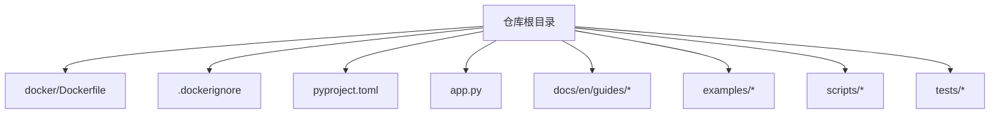
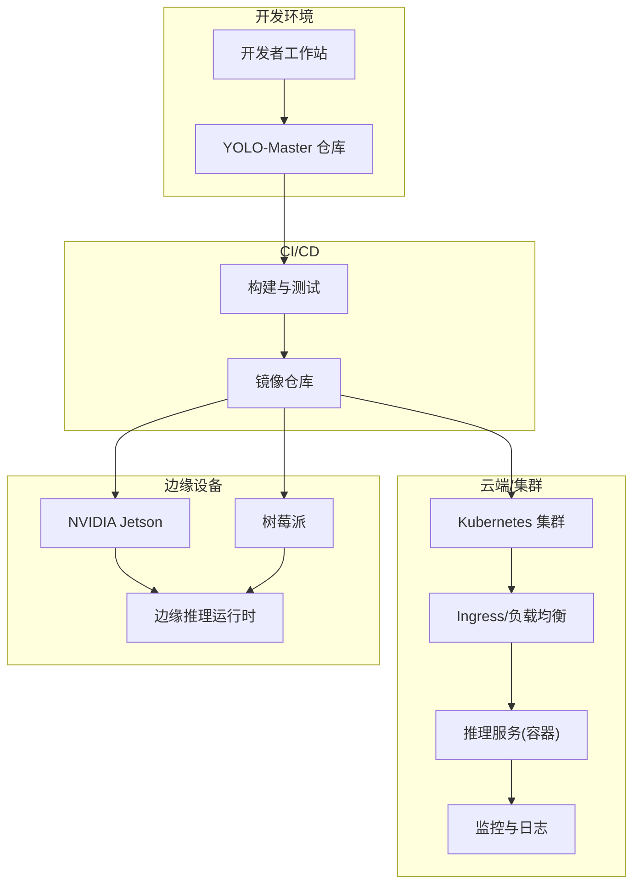
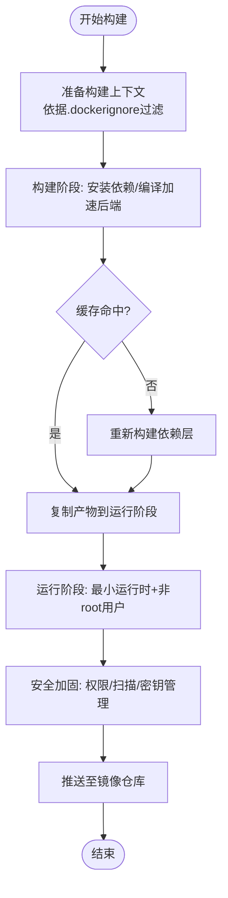
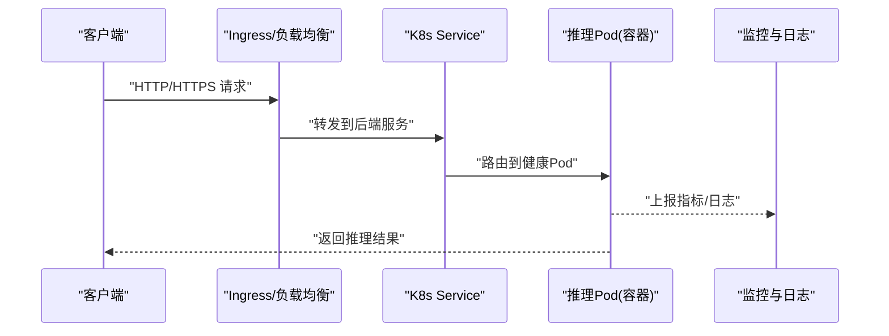
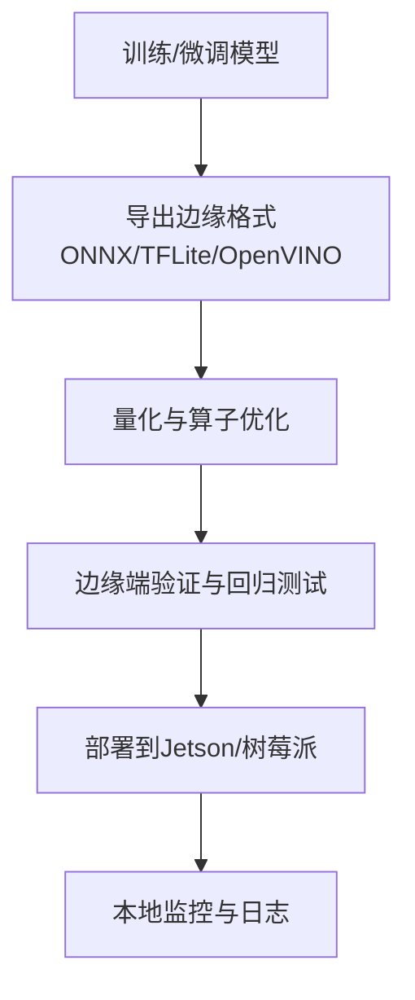
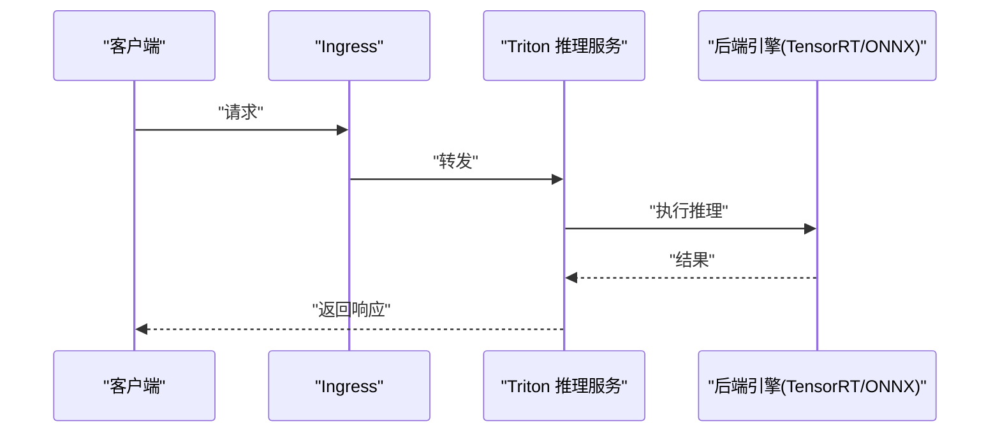
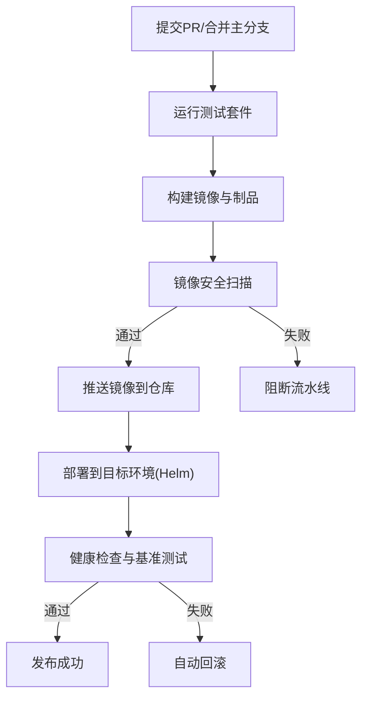
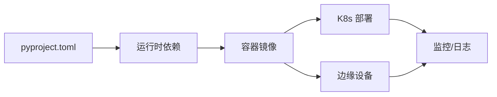

# 部署与容器化示例

<cite>
**本文引用的文件**
- [Dockerfile](file://docker/Dockerfile)
- [.dockerignore](file://.dockerignore)
- [pyproject.toml](file://pyproject.toml)
- [app.py](file://app.py)
- [README.md](file://README.md)
- [mkdocs.yml](file://mkdocs.yml)
- [docs/en/guides/docker-quickstart.md](file://docs/en/guides/docker-quickstart.md)
- [docs/en/guides/model-deployment-options.md](file://docs/en/guides/model-deployment-options.md)
- [docs/en/guides/triton-inference-server.md](file://docs/en/guides/triton-inference-server.md)
- [docs/en/guides/nvidia-jetson.md](file://docs/en/guides/nvidia-jetson.md)
- [docs/en/guides/raspberry-pi.md](file://docs/en/guides/raspberry-pi.md)
- [examples/YOLO-Master-Cross-Platform-Edge-Deployment/TECHNICAL_REPORT.md](file://examples/YOLO-Master-Cross-Platform-Edge-Deployment/TECHNICAL_REPORT.md)
- [examples/YOLO-Master-Cross-Platform-Edge-Deployment/jetson/README.md](file://examples/YOLO-Master-Cross-Platform-Edge-Deployment/jetson/README.md)
- [examples/YOLO-Master-Edge-Deployment/export_edge_models.py](file://examples/YOLO-Master-Edge-Deployment/export_edge_models.py)
- [examples/YOLO-Master-Edge-Deployment/edge_utils.py](file://examples/YOLO-Master-Edge-Deployment/edge_utils.py)
- [scripts/setup_k8s_env.sh](file://scripts/setup_k8s_env.sh)
- [scripts/run_planner_train_compare.py](file://scripts/run_planner_train_compare.py)
- [tests/test_cli.py](file://tests/test_cli.py)
- [tests/test_python.py](file://tests/test_python.py)
</cite>

## 目录
1. [简介](#简介)
2. [项目结构](#项目结构)
3. [核心组件](#核心组件)
4. [架构总览](#架构总览)
5. [详细组件分析](#详细组件分析)
6. [依赖分析](#依赖分析)
7. [性能考虑](#性能考虑)
8. [故障排查指南](#故障排查指南)
9. [结论](#结论)
10. [附录](#附录)

## 简介
本指南面向希望将 YOLO-Master 进行生产级部署的工程师，覆盖从 Docker 容器化、镜像优化与安全加固，到 Kubernetes 集群部署（含 Helm Chart 配置思路、负载均衡、自动扩缩容与监控告警）、边缘设备（Jetson、树莓派）适配与优化，以及 CI/CD 流水线构建脚本与云原生最佳实践。文档同时提供性能调优与资源限制的配置建议，帮助在不同环境中稳定高效地运行推理与服务。

## 项目结构
仓库中与部署和容器化直接相关的顶层文件与目录包括：
- docker/Dockerfile：容器镜像构建定义
- .dockerignore：构建上下文过滤规则
- pyproject.toml：Python 包与依赖声明
- app.py：应用入口（如 Web 服务或 CLI 启动）
- docs/en/guides/*：官方部署与平台指南
- examples/*：跨平台与边缘部署示例
- scripts/*：环境准备与自动化脚本
- tests/*：基础测试用例

**图表来源**
- [Dockerfile](file://docker/Dockerfile)
- [.dockerignore](file://.dockerignore)
- [pyproject.toml](file://pyproject.toml)
- [app.py](file://app.py)

**章节来源**
- [README.md](file://README.md)
- [mkdocs.yml](file://mkdocs.yml)

## 核心组件
- 容器镜像构建：基于 docker/Dockerfile 与 .dockerignore，结合 pyproject.toml 的依赖声明，完成可复现的 Python 运行时与模型推理环境的打包。
- 应用入口：app.py 作为服务或 CLI 的统一入口，便于在容器中以单进程方式启动。
- 平台与部署指南：docs/en/guides 下的多篇文章提供 Docker 快速开始、Triton 推理服务器、NVIDIA Jetson 与树莓派等平台的具体步骤。
- 边缘部署示例：examples 下包含跨平台与边缘部署的技术报告与脚本，用于导出与验证边缘模型。
- 自动化与环境准备：scripts 提供 K8s 环境初始化脚本等；tests 提供基础 CLI 与 Python 能力校验。

**章节来源**
- [Dockerfile](file://docker/Dockerfile)
- [.dockerignore](file://.dockerignore)
- [pyproject.toml](file://pyproject.toml)
- [app.py](file://app.py)
- [docs/en/guides/docker-quickstart.md](file://docs/en/guides/docker-quickstart.md)
- [docs/en/guides/triton-inference-server.md](file://docs/en/guides/triton-inference-server.md)
- [docs/en/guides/nvidia-jetson.md](file://docs/en/guides/nvidia-jetson.md)
- [docs/en/guides/raspberry-pi.md](file://docs/en/guides/raspberry-pi.md)
- [examples/YOLO-Master-Cross-Platform-Edge-Deployment/TECHNICAL_REPORT.md](file://examples/YOLO-Master-Cross-Platform-Edge-Deployment/TECHNICAL_REPORT.md)
- [examples/YOLO-Master-Edge-Deployment/export_edge_models.py](file://examples/YOLO-Master-Edge-Deployment/export_edge_models.py)
- [examples/YOLO-Master-Edge-Deployment/edge_utils.py](file://examples/YOLO-Master-Edge-Deployment/edge_utils.py)
- [scripts/setup_k8s_env.sh](file://scripts/setup_k8s_env.sh)
- [tests/test_cli.py](file://tests/test_cli.py)
- [tests/test_python.py](file://tests/test_python.py)

## 架构总览
下图展示从代码到容器、再到云端与边缘的整体部署路径。该图为概念性架构图，不直接映射具体源码文件。

[无需图表来源，因为此图为概念性架构示意]

## 详细组件分析

### Docker 容器化与镜像优化
- 多阶段构建策略
  - 构建阶段：安装系统依赖、编译可选加速后端、生成缓存层，减少最终镜像体积。
  - 运行阶段：仅包含最小运行时与必要库，使用非 root 用户运行，提升安全性。
- 镜像优化要点
  - 利用 .dockerignore 排除无关文件，缩小构建上下文。
  - 合并 RUN 指令、合理排序依赖安装顺序以提升缓存命中率。
  - 选择精简的基础镜像（如 slim/alpine），按需启用 GPU/CUDA 运行时。
- 安全加固
  - 非 root 用户运行、只读文件系统、最小权限原则。
  - 定期扫描镜像漏洞并更新基础镜像。
  - 通过环境变量注入敏感配置，避免硬编码。

**章节来源**
- [Dockerfile](file://docker/Dockerfile)
- [.dockerignore](file://.dockerignore)
- [pyproject.toml](file://pyproject.toml)
- [docs/en/guides/docker-quickstart.md](file://docs/en/guides/docker-quickstart.md)

### Kubernetes 集群部署方案
- 部署形态
  - 使用 Deployment 管理副本，Service 暴露端口，Ingress 提供外部访问与 TLS 终止。
  - 通过 ConfigMap/Secret 管理配置与密钥，实现配置与镜像解耦。
- 自动扩缩容
  - 基于 CPU/GPU 利用率或自定义指标（如 QPS、延迟）触发 HPA。
  - 针对批处理任务可使用 VPA 辅助调整资源请求与限制。
- 监控与告警
  - 采集容器指标（Prometheus）、日志（EFK/Loki）、链路追踪（OpenTelemetry）。
  - 设置 SLO/SLI 与告警规则，覆盖错误率、延迟、饱和度。
- Helm Chart 配置思路
  - 将副本数、资源限制、探针、环境变量、存储卷等参数化。
  - 提供 dev/staging/prod 多环境 values 文件，统一版本与变更管理。

[无需图表来源，因为此图为概念性流程示意]

**章节来源**
- [scripts/setup_k8s_env.sh](file://scripts/setup_k8s_env.sh)

### 边缘设备部署实践（Jetson、树莓派）
- NVIDIA Jetson
  - 使用官方 JetPack 与 TensorRT 加速，结合 ONNX/TensorRT 模型导出。
  - 参考 Jetson 平台指南与跨平台边缘部署技术报告，了解驱动、CUDA/TensorRT 版本匹配与内存优化。
- 树莓派
  - 使用轻量运行时（如 OpenVINO、ONNX Runtime）与量化模型，降低 CPU 占用与内存消耗。
  - 参考树莓派平台指南，关注交叉编译与依赖管理。
- 边缘模型导出与验证
  - 使用示例脚本导出边缘格式（ONNX/TFLite/OpenVINO），并进行输出一致性校验。

**章节来源**
- [docs/en/guides/nvidia-jetson.md](file://docs/en/guides/nvidia-jetson.md)
- [docs/en/guides/raspberry-pi.md](file://docs/en/guides/raspberry-pi.md)
- [examples/YOLO-Master-Cross-Platform-Edge-Deployment/TECHNICAL_REPORT.md](file://examples/YOLO-Master-Cross-Platform-Edge-Deployment/TECHNICAL_REPORT.md)
- [examples/YOLO-Master-Cross-Platform-Edge-Deployment/jetson/README.md](file://examples/YOLO-Master-Cross-Platform-Edge-Deployment/jetson/README.md)
- [examples/YOLO-Master-Edge-Deployment/export_edge_models.py](file://examples/YOLO-Master-Edge-Deployment/export_edge_models.py)
- [examples/YOLO-Master-Edge-Deployment/edge_utils.py](file://examples/YOLO-Master-Edge-Deployment/edge_utils.py)

### Triton 推理服务器集成
- 使用 Triton 作为高性能推理服务后端，支持动态批处理、并发与多种后端（TensorRT、ONNX、PyTorch）。
- 将 YOLO-Master 模型导出为 Triton 兼容格式，并通过 Model Repository 管理版本与配置。
- 结合 K8s 部署 Triton 服务，配合 Ingress 与 HPA 实现弹性伸缩。

**章节来源**
- [docs/en/guides/triton-inference-server.md](file://docs/en/guides/triton-inference-server.md)
- [docs/en/guides/model-deployment-options.md](file://docs/en/guides/model-deployment-options.md)

### CI/CD 流水线构建脚本
- 构建与测试
  - 在 CI 中拉取代码，安装依赖，运行单元测试与端到端冒烟测试。
  - 构建 Docker 镜像并推送到镜像仓库，记录构建元数据与制品。
- 部署与回滚
  - 根据分支与标签发布到不同环境（dev/staging/prod），使用 Helm 升级与回滚。
  - 部署后执行健康检查与基准测试，确保质量门禁。

**章节来源**
- [scripts/run_planner_train_compare.py](file://scripts/run_planner_train_compare.py)
- [tests/test_cli.py](file://tests/test_cli.py)
- [tests/test_python.py](file://tests/test_python.py)

### 云原生最佳实践
- 服务网格
  - 使用 Istio/Linkerd 实现流量治理、熔断、重试与灰度发布。
- 配置管理
  - 使用 ConfigMap/Secret 管理配置，结合 GitOps（ArgoCD/Flux）实现声明式部署。
- 故障恢复
  - 配置 Liveness/Readiness 探针，结合 PodDisruptionBudget 保障可用性。
  - 设计幂等接口与重试策略，避免级联故障。

[本节为通用指导，不直接分析具体文件]

## 依赖分析
- 构建期依赖
  - Python 包依赖由 pyproject.toml 声明，建议在构建阶段锁定版本并生成锁文件，保证可复现。
- 运行期依赖
  - 容器镜像仅包含运行时所需的最小依赖集，GPU/CUDA/TensorRT 按需引入。
- 外部集成点
  - 推理后端（Triton、ONNX Runtime、OpenVINO）、监控系统（Prometheus/Grafana）、日志系统（EFK/Loki）。

**章节来源**
- [pyproject.toml](file://pyproject.toml)

## 性能考虑
- 模型层面
  - 量化（INT8/FP16）、图优化（剪枝、融合）、算子替换（TensorRT/ONNX）。
- 服务层面
  - 动态批处理、并发线程数、内存池与零拷贝。
- 资源限制
  - 合理设置 CPU/GPU 请求与限制，避免过度分配与抖动。
- 监控与调优
  - 基于延迟分位、吞吐与资源利用率持续调优，结合压测基线评估改进效果。

[本节为通用指导，不直接分析具体文件]

## 故障排查指南
- 常见问题定位
  - 容器启动失败：检查入口命令、环境变量与依赖完整性。
  - 推理异常：核对模型版本、输入尺寸与数据类型，查看后端日志。
  - 性能退化：观察资源争用、GC 行为与网络瓶颈。
- 诊断工具
  - 使用 kubectl logs/exec 进入容器调试，结合 Prometheus 指标与分布式追踪定位问题。
  - 在 CI 中增加回归测试与基准对比，防止性能回退。

**章节来源**
- [app.py](file://app.py)
- [tests/test_cli.py](file://tests/test_cli.py)
- [tests/test_python.py](file://tests/test_python.py)

## 结论
通过将 YOLO-Master 容器化并在 Kubernetes 与边缘设备上标准化部署，可实现高可用、可扩展与可观测的生产级推理服务。结合 CI/CD 自动化与云原生最佳实践，能够持续提升交付效率与系统稳定性。建议在生产环境中持续进行性能基准与容量规划，确保在不同负载与硬件条件下均能达成预期 SLA。

## 附录
- 快速参考
  - Docker 快速开始：参考官方指南获取基本用法与常见陷阱。
  - 模型部署选项：了解不同后端与平台的权衡。
  - Triton 推理服务器：掌握模型管理与服务编排。
  - 平台指南：Jetson 与树莓派的适配要点与注意事项。

**章节来源**
- [docs/en/guides/docker-quickstart.md](file://docs/en/guides/docker-quickstart.md)
- [docs/en/guides/model-deployment-options.md](file://docs/en/guides/model-deployment-options.md)
- [docs/en/guides/triton-inference-server.md](file://docs/en/guides/triton-inference-server.md)
- [docs/en/guides/nvidia-jetson.md](file://docs/en/guides/nvidia-jetson.md)
- [docs/en/guides/raspberry-pi.md](file://docs/en/guides/raspberry-pi.md)