# 集成与扩展示例

<cite>
**本文引用的文件**
- [README.md](file://README.md)
- [pyproject.toml](file://pyproject.toml)
- [docker/Dockerfile](file://docker/Dockerfile)
- [examples/README.md](file://examples/README.md)
- [examples/YOLOv8-ONNXRuntime/main.py](file://examples/YOLOv8-ONNXRuntime/main.py)
- [examples/YOLOv8-ONNXRuntime/requirements.txt](file://examples/YOLOv8-ONNXRuntime/requirements.txt)
- [examples/YOLOv8-OpenVINO-CPP-Inference/inference.h](file://examples/YOLOv8-OpenVINO-CPP-Inference/inference.h)
- [examples/YOLOv8-OpenVINO-CPP-Inference/inference.cc](file://examples/YOLOv8-OpenVINO-CPP-Inference/inference.cc)
- [examples/YOLOv8-OpenVINO-CPP-Inference/main.cc](file://examples/YOLOv8-OpenVINO-CPP-Inference/main.cc)
- [examples/YOLO-Master-Cross-Platform-Edge-Deployment/TECHNICAL_REPORT.md](file://examples/YOLO-Master-Cross-Platform-Edge-Deployment/TECHNICAL_REPORT.md)
- [examples/YOLO-Series-ONNXRuntime-Rust/src/lib.rs](file://examples/YOLO-Series-ONNXRuntime-Rust/src/lib.rs)
- [examples/YOLO-Series-ONNXRuntime-Rust/Cargo.toml](file://examples/YOLO-Series-ONNXRuntime-Rust/Cargo.toml)
- [examples/YOLO11-Triton-CPP/inference.hpp](file://examples/YOLO11-Triton-CPP/inference.hpp)
- [examples/YOLO11-Triton-CPP/inference.cpp](file://examples/YOLO11-Triton-CPP/inference.cpp)
- [examples/YOLO11-Triton-CPP/main.cpp](file://examples/YOLO11-Triton-CPP/main.cpp)
- [ultralytics/engine/exporter.py](file://ultralytics/engine/exporter.py)
- [ultralytics/utils/export_capabilities.py](file://ultralytics/utils/export_capabilities.py)
- [ultralytics/utils/export_preflight.py](file://ultralytics/utils/export_preflight.py)
- [ultralytics/utils/export_validation.py](file://ultralytics/utils/export_validation.py)
- [ultralytics/models/yolo/detect/model.py](file://ultralytics/models/yolo/detect/model.py)
- [ultralytics/models/yolo/classify/model.py](file://ultralytics/models/yolo/classify/model.py)
- [ultralytics/models/yolo/segment/model.py](file://ultralytics/models/yolo/segment/model.py)
- [ultralytics/models/yolo/pose/model.py](file://ultralytics/models/yolo/pose/model.py)
- [ultralytics/models/yolo/obb/model.py](file://ultralytics/models/yolo/obb/model.py)
- [ultralytics/solutions/streamlit_inference.py](file://ultralytics/solutions/streamlit_inference.py)
- [ultralytics/solutions/queue_management.py](file://ultralytics/solutions/queue_management.py)
- [ultralytics/solutions/analytics.py](file://ultralytics/solutions/analytics.py)
- [scripts/setup_k8s_env.sh](file://scripts/setup_k8s_env.sh)
- [scripts/run_mot_ablation_k8s.sh](file://scripts/run_mot_ablation_k8s.sh)
- [tests/test_integrations.py](file://tests/test_integrations.py)
- [tests/test_export_capability_matrix.py](file://tests/test_export_capability_matrix.py)
- [tests/test_export_preflight.py](file://tests/test_export_preflight.py)
- [tests/test_export_roundtrip.py](file://tests/test_export_roundtrip.py)
- [tests/test_autobackend_warmup.py](file://tests/test_autobackend_warmup.py)
- [docs/en/integrations/index.md](file://docs/en/integrations/index.md)
- [docs/en/guides/docker-quickstart.md](file://docs/en/guides/docker-quickstart.md)
- [docs/en/guides/triton-inference-server.md](file://docs/en/guides/triton-inference-server.md)
- [docs/en/guides/model-deployment-options.md](file://docs/en/guides/model-deployment-options.md)
- [docs/en/guides/model-deployment-practices.md](file://docs/en/guides/model-deployment-practices.md)
- [docs/en/guides/model-monitoring-and-maintenance.md](file://docs/en/guides/model-monitoring-and-maintenance.md)
- [docs/en/platform/deploy/index.md](file://docs/en/platform/deploy/index.md)
</cite>

## 目录
1. [简介](#简介)
2. [项目结构](#项目结构)
3. [核心组件](#核心组件)
4. [架构总览](#架构总览)
5. [详细组件分析](#详细组件分析)
6. [依赖分析](#依赖分析)
7. [性能考虑](#性能考虑)
8. [故障排查指南](#故障排查指南)
9. [结论](#结论)
10. [附录](#附录)

## 简介
本文件面向希望将 YOLO-Master 集成到不同框架、平台与服务化环境的工程师，提供从模型导出、多后端推理（TensorFlow、PyTorch、ONNX Runtime、OpenVINO、Triton 等）、高性能语言（C++、Rust）调用、Web 服务化部署、数据库与消息队列集成、微服务实践，到容器化与 Kubernetes 编排、CI/CD 流水线与自动化测试的完整示例与最佳实践。文档以仓库内现有示例与工具为依据，结合官方文档指引，帮助读者快速落地生产级方案。

## 项目结构
YOLO-Master 在“模型导出—多后端推理—服务化部署”的链路中提供了丰富的示例与工具：
- 示例代码位于 examples/，涵盖 ONNX Runtime（Python/Rust/C++）、OpenVINO（C++）、Triton（C++）、跨平台边缘部署等。
- 导出能力集中在 ultralytics/engine/exporter.py 与 utils/export_* 系列模块，统一封装了导出前检查、能力矩阵、导出流程与导出后验证。
- Web 与解决方案层在 ultralytics/solutions/ 下提供 Streamlit 推理、队列管理、分析等可复用组件。
- 部署与运维相关脚本与文档位于 scripts/ 与 docs/ 下，包括 Docker 快速开始、Triton 部署指南、Kubernetes 环境准备与作业运行脚本等。
- 测试覆盖导出能力矩阵、导出前后校验、自动后端预热、集成用例等，保障导出与推理链路的稳定性。

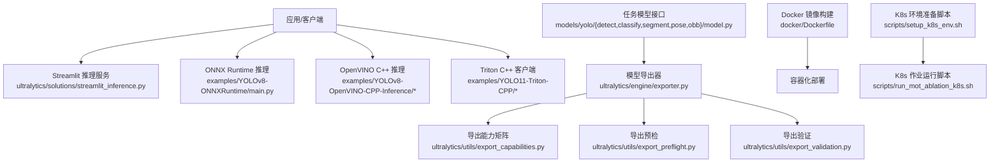

图表来源
- [ultralytics/engine/exporter.py](file://ultralytics/engine/exporter.py)
- [ultralytics/utils/export_capabilities.py](file://ultralytics/utils/export_capabilities.py)
- [ultralytics/utils/export_preflight.py](file://ultralytics/utils/export_preflight.py)
- [ultralytics/utils/export_validation.py](file://ultralytics/utils/export_validation.py)
- [ultralytics/models/yolo/detect/model.py](file://ultralytics/models/yolo/detect/model.py)
- [ultralytics/models/yolo/classify/model.py](file://ultralytics/models/yolo/classify/model.py)
- [ultralytics/models/yolo/segment/model.py](file://ultralytics/models/yolo/segment/model.py)
- [ultralytics/models/yolo/pose/model.py](file://ultralytics/models/yolo/pose/model.py)
- [ultralytics/models/yolo/obb/model.py](file://ultralytics/models/yolo/obb/model.py)
- [examples/YOLOv8-ONNXRuntime/main.py](file://examples/YOLOv8-ONNXRuntime/main.py)
- [examples/YOLOv8-OpenVINO-CPP-Inference/inference.h](file://examples/YOLOv8-OpenVINO-CPP-Inference/inference.h)
- [examples/YOLOv8-OpenVINO-CPP-Inference/inference.cc](file://examples/YOLOv8-OpenVINO-CPP-Inference/inference.cc)
- [examples/YOLOv8-OpenVINO-CPP-Inference/main.cc](file://examples/YOLOv8-OpenVINO-CPP-Inference/main.cc)
- [examples/YOLO11-Triton-CPP/inference.hpp](file://examples/YOLO11-Triton-CPP/inference.hpp)
- [examples/YOLO11-Triton-CPP/inference.cpp](file://examples/YOLO11-Triton-CPP/inference.cpp)
- [examples/YOLO11-Triton-CPP/main.cpp](file://examples/YOLO11-Triton-CPP/main.cpp)
- [docker/Dockerfile](file://docker/Dockerfile)
- [scripts/setup_k8s_env.sh](file://scripts/setup_k8s_env.sh)
- [scripts/run_mot_ablation_k8s.sh](file://scripts/run_mot_ablation_k8s.sh)

章节来源
- [README.md](file://README.md)
- [examples/README.md](file://examples/README.md)
- [docs/en/integrations/index.md](file://docs/en/integrations/index.md)

## 核心组件
- 导出器与能力矩阵
  - exporter.py 提供统一的导出入口，内部组合导出预检、能力矩阵解析与导出后验证，屏蔽各后端差异。
  - export_capabilities.py 维护导出能力矩阵，用于判断特定任务/模型是否支持某后端格式。
  - export_preflight.py 负责导出前的环境与参数校验，避免无效导出。
  - export_validation.py 负责导出后的结果一致性或基本正确性验证。
- 任务模型接口
  - models/yolo/{detect, classify, segment, pose, obb}/model.py 为不同任务的模型类，暴露训练、验证、预测与导出等统一接口，供导出器调用。
- 示例推理
  - ONNX Runtime Python 示例：examples/YOLOv8-ONNXRuntime/main.py 演示加载 ONNX 模型进行推理。
  - OpenVINO C++ 示例：examples/YOLOv8-OpenVINO-CPP-Inference/* 展示 C++ 端使用 OpenVINO 运行时进行推理。
  - Triton C++ 示例：examples/YOLO11-Triton-CPP/* 展示通过 gRPC/HTTP 与 Triton 交互的客户端实现。
- 服务化与解决方案
  - streamlit_inference.py 提供基于 Streamlit 的轻量 Web 推理界面。
  - queue_management.py 提供队列管理组件，便于接入消息队列或异步处理。
  - analytics.py 提供基础分析指标收集与可视化辅助。

章节来源
- [ultralytics/engine/exporter.py](file://ultralytics/engine/exporter.py)
- [ultralytics/utils/export_capabilities.py](file://ultralytics/utils/export_capabilities.py)
- [ultralytics/utils/export_preflight.py](file://ultralytics/utils/export_preflight.py)
- [ultralytics/utils/export_validation.py](file://ultralytics/utils/export_validation.py)
- [ultralytics/models/yolo/detect/model.py](file://ultralytics/models/yolo/detect/model.py)
- [ultralytics/models/yolo/classify/model.py](file://ultralytics/models/yolo/classify/model.py)
- [ultralytics/models/yolo/segment/model.py](file://ultralytics/models/yolo/segment/model.py)
- [ultralytics/models/yolo/pose/model.py](file://ultralytics/models/yolo/pose/model.py)
- [ultralytics/models/yolo/obb/model.py](file://ultralytics/models/yolo/obb/model.py)
- [examples/YOLOv8-ONNXRuntime/main.py](file://examples/YOLOv8-ONNXRuntime/main.py)
- [examples/YOLOv8-OpenVINO-CPP-Inference/inference.h](file://examples/YOLOv8-OpenVINO-CPP-Inference/inference.h)
- [examples/YOLOv8-OpenVINO-CPP-Inference/inference.cc](file://examples/YOLOv8-OpenVINO-CPP-Inference/inference.cc)
- [examples/YOLOv8-OpenVINO-CPP-Inference/main.cc](file://examples/YOLOv8-OpenVINO-CPP-Inference/main.cc)
- [examples/YOLO11-Triton-CPP/inference.hpp](file://examples/YOLO11-Triton-CPP/inference.hpp)
- [examples/YOLO11-Triton-CPP/inference.cpp](file://examples/YOLO11-Triton-CPP/inference.cpp)
- [examples/YOLO11-Triton-CPP/main.cpp](file://examples/YOLO11-Triton-CPP/main.cpp)
- [ultralytics/solutions/streamlit_inference.py](file://ultralytics/solutions/streamlit_inference.py)
- [ultralytics/solutions/queue_management.py](file://ultralytics/solutions/queue_management.py)
- [ultralytics/solutions/analytics.py](file://ultralytics/solutions/analytics.py)

## 架构总览
下图展示了从模型导出到多后端推理与服务化部署的整体架构。导出器作为中枢，协调任务模型与导出能力矩阵，生成目标格式；客户端或服务端根据部署环境选择合适后端；Web 与解决方案层提供易用接口与扩展点。

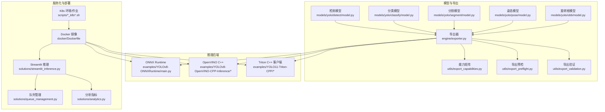

图表来源
- [ultralytics/engine/exporter.py](file://ultralytics/engine/exporter.py)
- [ultralytics/utils/export_capabilities.py](file://ultralytics/utils/export_capabilities.py)
- [ultralytics/utils/export_preflight.py](file://ultralytics/utils/export_preflight.py)
- [ultralytics/utils/export_validation.py](file://ultralytics/utils/export_validation.py)
- [ultralytics/models/yolo/detect/model.py](file://ultralytics/models/yolo/detect/model.py)
- [ultralytics/models/yolo/classify/model.py](file://ultralytics/models/yolo/classify/model.py)
- [ultralytics/models/yolo/segment/model.py](file://ultralytics/models/yolo/segment/model.py)
- [ultralytics/models/yolo/pose/model.py](file://ultralytics/models/yolo/pose/model.py)
- [ultralytics/models/yolo/obb/model.py](file://ultralytics/models/yolo/obb/model.py)
- [examples/YOLOv8-ONNXRuntime/main.py](file://examples/YOLOv8-ONNXRuntime/main.py)
- [examples/YOLOv8-OpenVINO-CPP-Inference/inference.h](file://examples/YOLOv8-OpenVINO-CPP-Inference/inference.h)
- [examples/YOLOv8-OpenVINO-CPP-Inference/inference.cc](file://examples/YOLOv8-OpenVINO-CPP-Inference/inference.cc)
- [examples/YOLOv8-OpenVINO-CPP-Inference/main.cc](file://examples/YOLOv8-OpenVINO-CPP-Inference/main.cc)
- [examples/YOLO11-Triton-CPP/inference.hpp](file://examples/YOLO11-Triton-CPP/inference.hpp)
- [examples/YOLO11-Triton-CPP/inference.cpp](file://examples/YOLO11-Triton-CPP/inference.cpp)
- [examples/YOLO11-Triton-CPP/main.cpp](file://examples/YOLO11-Triton-CPP/main.cpp)
- [ultralytics/solutions/streamlit_inference.py](file://ultralytics/solutions/streamlit_inference.py)
- [ultralytics/solutions/queue_management.py](file://ultralytics/solutions/queue_management.py)
- [ultralytics/solutions/analytics.py](file://ultralytics/solutions/analytics.py)
- [docker/Dockerfile](file://docker/Dockerfile)
- [scripts/setup_k8s_env.sh](file://scripts/setup_k8s_env.sh)
- [scripts/run_mot_ablation_k8s.sh](file://scripts/run_mot_ablation_k8s.sh)

## 详细组件分析

### 导出器与能力矩阵（导出管线）
导出器整合任务模型接口与导出能力矩阵，执行导出前预检与导出后验证，确保输出格式与目标后端兼容。

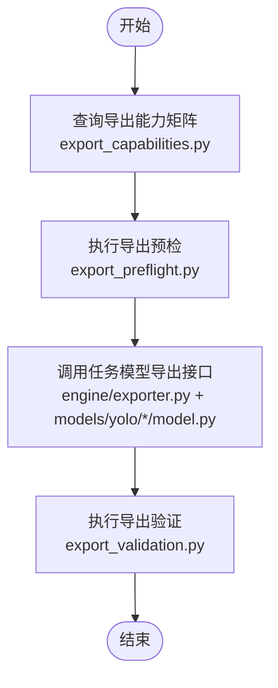

图表来源
- [ultralytics/engine/exporter.py](file://ultralytics/engine/exporter.py)
- [ultralytics/utils/export_capabilities.py](file://ultralytics/utils/export_capabilities.py)
- [ultralytics/utils/export_preflight.py](file://ultralytics/utils/export_preflight.py)
- [ultralytics/utils/export_validation.py](file://ultralytics/utils/export_validation.py)
- [ultralytics/models/yolo/detect/model.py](file://ultralytics/models/yolo/detect/model.py)
- [ultralytics/models/yolo/classify/model.py](file://ultralytics/models/yolo/classify/model.py)
- [ultralytics/models/yolo/segment/model.py](file://ultralytics/models/yolo/segment/model.py)
- [ultralytics/models/yolo/pose/model.py](file://ultralytics/models/yolo/pose/model.py)
- [ultralytics/models/yolo/obb/model.py](file://ultralytics/models/yolo/obb/model.py)

章节来源
- [ultralytics/engine/exporter.py](file://ultralytics/engine/exporter.py)
- [ultralytics/utils/export_capabilities.py](file://ultralytics/utils/export_capabilities.py)
- [ultralytics/utils/export_preflight.py](file://ultralytics/utils/export_preflight.py)
- [ultralytics/utils/export_validation.py](file://ultralytics/utils/export_validation.py)
- [ultralytics/models/yolo/detect/model.py](file://ultralytics/models/yolo/detect/model.py)
- [ultralytics/models/yolo/classify/model.py](file://ultralytics/models/yolo/classify/model.py)
- [ultralytics/models/yolo/segment/model.py](file://ultralytics/models/yolo/segment/model.py)
- [ultralytics/models/yolo/pose/model.py](file://ultralytics/models/yolo/pose/model.py)
- [ultralytics/models/yolo/obb/model.py](file://ultralytics/models/yolo/obb/model.py)

### ONNX Runtime 集成（Python）
ONNX Runtime 示例展示了如何加载导出的 ONNX 模型并进行推理。该路径适合在 Python 环境中快速集成与验证。

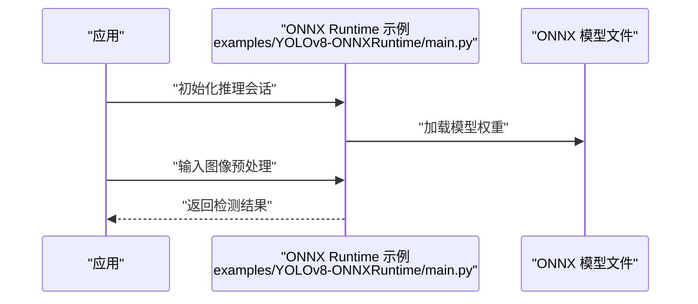

图表来源
- [examples/YOLOv8-ONNXRuntime/main.py](file://examples/YOLOv8-ONNXRuntime/main.py)
- [examples/YOLOv8-ONNXRuntime/requirements.txt](file://examples/YOLOv8-ONNXRuntime/requirements.txt)

章节来源
- [examples/YOLOv8-ONNXRuntime/main.py](file://examples/YOLOv8-ONNXRuntime/main.py)
- [examples/YOLOv8-ONNXRuntime/requirements.txt](file://examples/YOLOv8-ONNXRuntime/requirements.txt)

### OpenVINO C++ 集成
OpenVINO C++ 示例展示了在 C++ 环境下使用 OpenVINO 运行时进行推理，适合嵌入式与低延迟场景。

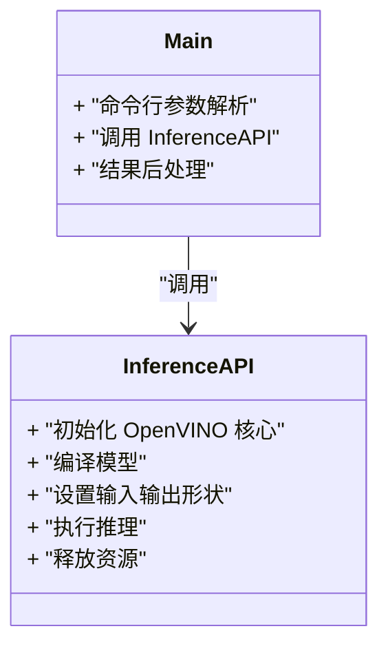

图表来源
- [examples/YOLOv8-OpenVINO-CPP-Inference/inference.h](file://examples/YOLOv8-OpenVINO-CPP-Inference/inference.h)
- [examples/YOLOv8-OpenVINO-CPP-Inference/inference.cc](file://examples/YOLOv8-OpenVINO-CPP-Inference/inference.cc)
- [examples/YOLOv8-OpenVINO-CPP-Inference/main.cc](file://examples/YOLOv8-OpenVINO-CPP-Inference/main.cc)

章节来源
- [examples/YOLOv8-OpenVINO-CPP-Inference/inference.h](file://examples/YOLOv8-OpenVINO-CPP-Inference/inference.h)
- [examples/YOLOv8-OpenVINO-CPP-Inference/inference.cc](file://examples/YOLOv8-OpenVINO-CPP-Inference/inference.cc)
- [examples/YOLOv8-OpenVINO-CPP-Inference/main.cc](file://examples/YOLOv8-OpenVINO-CPP-Inference/main.cc)

### Rust 集成（ONNX Runtime）
Rust 示例展示了如何在 Rust 项目中集成 ONNX Runtime 进行推理，适用于对内存与性能有严格要求的场景。

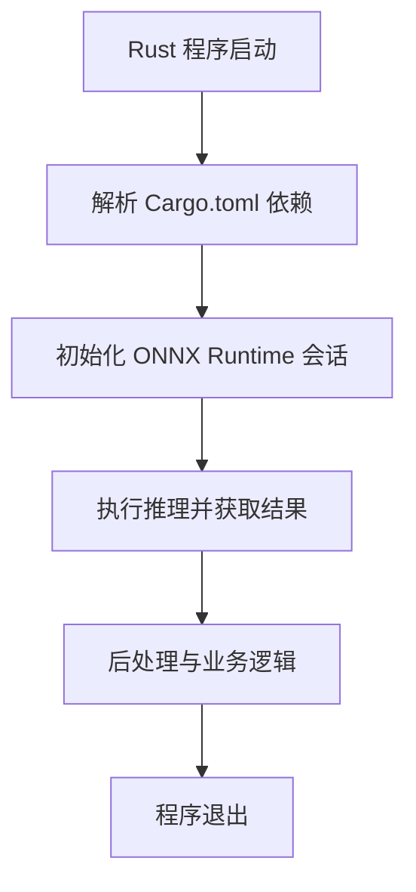

图表来源
- [examples/YOLO-Series-ONNXRuntime-Rust/src/lib.rs](file://examples/YOLO-Series-ONNXRuntime-Rust/src/lib.rs)
- [examples/YOLO-Series-ONNXRuntime-Rust/Cargo.toml](file://examples/YOLO-Series-ONNXRuntime-Rust/Cargo.toml)

章节来源
- [examples/YOLO-Series-ONNXRuntime-Rust/src/lib.rs](file://examples/YOLO-Series-ONNXRuntime-Rust/src/lib.rs)
- [examples/YOLO-Series-ONNXRuntime-Rust/Cargo.toml](file://examples/YOLO-Series-ONNXRuntime-Rust/Cargo.toml)

### Triton 集成（C++ 客户端）
Triton 示例展示了如何通过 gRPC/HTTP 与 Triton 推理服务器交互，适合高并发与分布式部署。

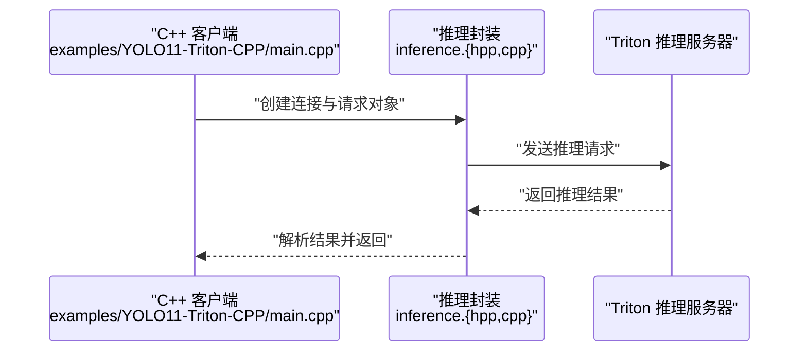

图表来源
- [examples/YOLO11-Triton-CPP/main.cpp](file://examples/YOLO11-Triton-CPP/main.cpp)
- [examples/YOLO11-Triton-CPP/inference.hpp](file://examples/YOLO11-Triton-CPP/inference.hpp)
- [examples/YOLO11-Triton-CPP/inference.cpp](file://examples/YOLO11-Triton-CPP/inference.cpp)

章节来源
- [examples/YOLO11-Triton-CPP/main.cpp](file://examples/YOLO11-Triton-CPP/main.cpp)
- [examples/YOLO11-Triton-CPP/inference.hpp](file://examples/YOLO11-Triton-CPP/inference.hpp)
- [examples/YOLO11-Triton-CPP/inference.cpp](file://examples/YOLO11-Triton-CPP/inference.cpp)

### Web 服务化与解决方案
Streamlit 推理提供轻量 Web 界面，配合队列管理与分析指标，可快速搭建在线推理服务。

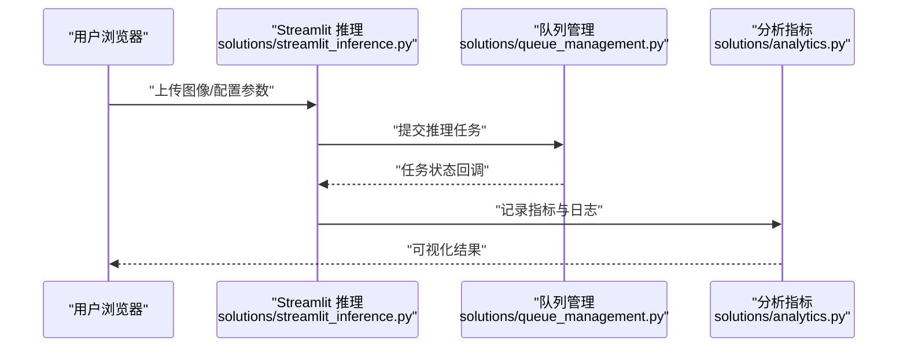

图表来源
- [ultralytics/solutions/streamlit_inference.py](file://ultralytics/solutions/streamlit_inference.py)
- [ultralytics/solutions/queue_management.py](file://ultralytics/solutions/queue_management.py)
- [ultralytics/solutions/analytics.py](file://ultralytics/solutions/analytics.py)

章节来源
- [ultralytics/solutions/streamlit_inference.py](file://ultralytics/solutions/streamlit_inference.py)
- [ultralytics/solutions/queue_management.py](file://ultralytics/solutions/queue_management.py)
- [ultralytics/solutions/analytics.py](file://ultralytics/solutions/analytics.py)

### 容器化与 Kubernetes 编排
Dockerfile 提供镜像构建基础，K8s 脚本用于环境准备与作业运行，形成端到端部署闭环。

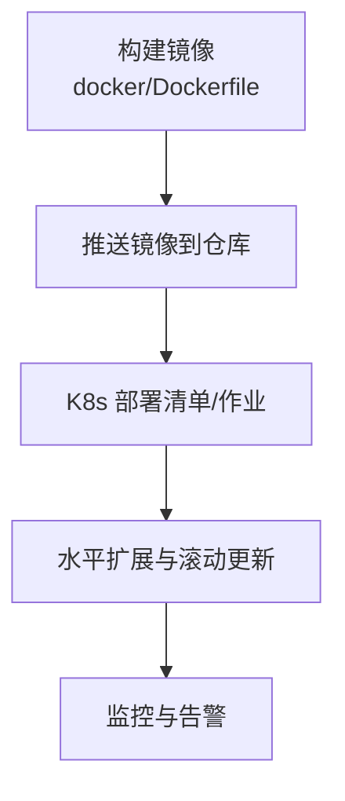

图表来源
- [docker/Dockerfile](file://docker/Dockerfile)
- [scripts/setup_k8s_env.sh](file://scripts/setup_k8s_env.sh)
- [scripts/run_mot_ablation_k8s.sh](file://scripts/run_mot_ablation_k8s.sh)

章节来源
- [docker/Dockerfile](file://docker/Dockerfile)
- [scripts/setup_k8s_env.sh](file://scripts/setup_k8s_env.sh)
- [scripts/run_mot_ablation_k8s.sh](file://scripts/run_mot_ablation_k8s.sh)

### CI/CD 与自动化测试
仓库包含针对导出能力矩阵、导出前后校验、自动后端预热与集成用例的测试，可作为 CI/CD 流水线的质量门禁。

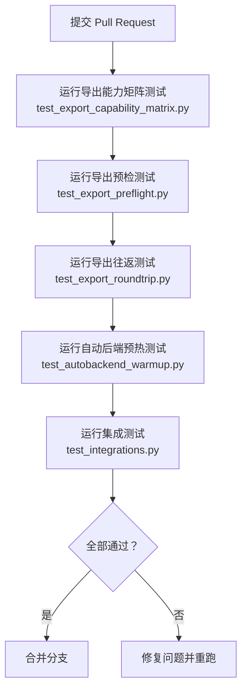

图表来源
- [tests/test_export_capability_matrix.py](file://tests/test_export_capability_matrix.py)
- [tests/test_export_preflight.py](file://tests/test_export_preflight.py)
- [tests/test_export_roundtrip.py](file://tests/test_export_roundtrip.py)
- [tests/test_autobackend_warmup.py](file://tests/test_autobackend_warmup.py)
- [tests/test_integrations.py](file://tests/test_integrations.py)

章节来源
- [tests/test_export_capability_matrix.py](file://tests/test_export_capability_matrix.py)
- [tests/test_export_preflight.py](file://tests/test_export_preflight.py)
- [tests/test_export_roundtrip.py](file://tests/test_export_roundtrip.py)
- [tests/test_autobackend_warmup.py](file://tests/test_autobackend_warmup.py)
- [tests/test_integrations.py](file://tests/test_integrations.py)

## 依赖分析
- 导出器依赖任务模型接口与导出能力矩阵，确保导出流程的一致性与可维护性。
- 示例推理与解决方案层依赖各自后端库（如 ONNX Runtime、OpenVINO、Triton），并通过 requirements.txt 或 Cargo.toml 声明依赖。
- 部署与运维脚本依赖系统工具（如 docker、kubectl），并在文档中给出快速上手指引。

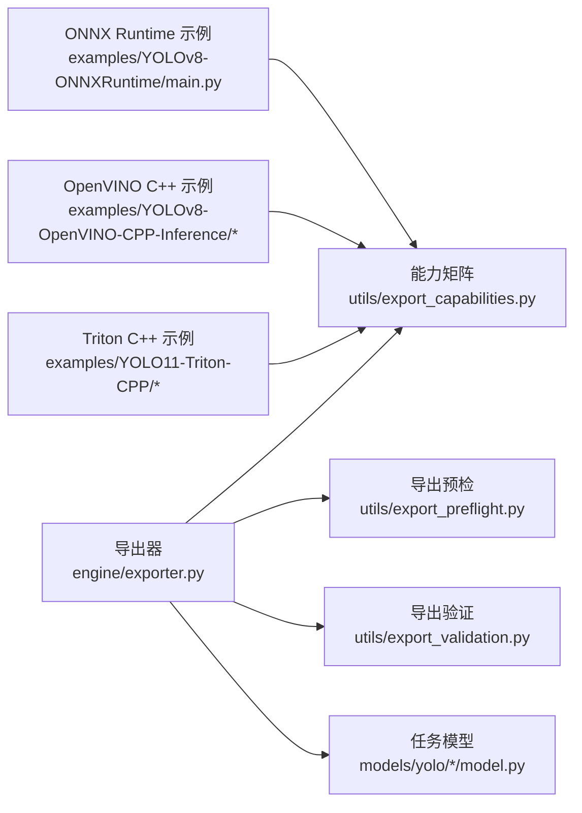

图表来源
- [ultralytics/engine/exporter.py](file://ultralytics/engine/exporter.py)
- [ultralytics/utils/export_capabilities.py](file://ultralytics/utils/export_capabilities.py)
- [ultralytics/utils/export_preflight.py](file://ultralytics/utils/export_preflight.py)
- [ultralytics/utils/export_validation.py](file://ultralytics/utils/export_validation.py)
- [ultralytics/models/yolo/detect/model.py](file://ultralytics/models/yolo/detect/model.py)
- [ultralytics/models/yolo/classify/model.py](file://ultralytics/models/yolo/classify/model.py)
- [ultralytics/models/yolo/segment/model.py](file://ultralytics/models/yolo/segment/model.py)
- [ultralytics/models/yolo/pose/model.py](file://ultralytics/models/yolo/pose/model.py)
- [ultralytics/models/yolo/obb/model.py](file://ultralytics/models/yolo/obb/model.py)
- [examples/YOLOv8-ONNXRuntime/main.py](file://examples/YOLOv8-ONNXRuntime/main.py)
- [examples/YOLOv8-OpenVINO-CPP-Inference/inference.h](file://examples/YOLOv8-OpenVINO-CPP-Inference/inference.h)
- [examples/YOLOv8-OpenVINO-CPP-Inference/inference.cc](file://examples/YOLOv8-OpenVINO-CPP-Inference/inference.cc)
- [examples/YOLOv8-OpenVINO-CPP-Inference/main.cc](file://examples/YOLOv8-OpenVINO-CPP-Inference/main.cc)
- [examples/YOLO11-Triton-CPP/inference.hpp](file://examples/YOLO11-Triton-CPP/inference.hpp)
- [examples/YOLO11-Triton-CPP/inference.cpp](file://examples/YOLO11-Triton-CPP/inference.cpp)
- [examples/YOLO11-Triton-CPP/main.cpp](file://examples/YOLO11-Triton-CPP/main.cpp)

章节来源
- [pyproject.toml](file://pyproject.toml)
- [examples/YOLOv8-ONNXRuntime/requirements.txt](file://examples/YOLOv8-ONNXRuntime/requirements.txt)
- [examples/YOLO-Series-ONNXRuntime-Rust/Cargo.toml](file://examples/YOLO-Series-ONNXRuntime-Rust/Cargo.toml)

## 性能考虑
- 导出阶段
  - 使用能力矩阵与预检减少无效导出，提升迭代效率。
  - 针对不同后端选择合适的优化选项（如图形算子融合、量化等），参考导出验证结果。
- 推理阶段
  - ONNX Runtime：合理设置线程数与执行提供者，利用批处理提升吞吐。
  - OpenVINO：启用硬件加速与缓存模型，降低冷启动时延。
  - Triton：配置实例数与动态批处理，结合 gRPC/HTTP 协议栈优化网络开销。
- 服务化与部署
  - 使用容器化隔离依赖，结合 K8s 的水平扩展与滚动更新提升可用性。
  - 引入队列管理与分析指标，监控 P95/P99 时延与错误率，及时扩容或回滚。

[本节为通用指导，不直接分析具体文件]

## 故障排查指南
- 导出失败
  - 检查导出能力矩阵是否支持目标后端与任务类型。
  - 查看导出预检日志，确认输入形状、数据类型与设备兼容性。
  - 运行导出验证，对比原始模型与导出模型的输出一致性。
- 推理异常
  - 核对后端版本与依赖（requirements.txt/Cargo.toml）。
  - 检查输入预处理与后处理是否与导出配置一致。
  - 对于 Triton，确认服务端模型配置与客户端请求格式匹配。
- 部署问题
  - 验证 Docker 镜像构建产物与环境变量。
  - 检查 K8s 作业日志与资源配额，必要时调整副本数与资源限制。

章节来源
- [ultralytics/utils/export_capabilities.py](file://ultralytics/utils/export_capabilities.py)
- [ultralytics/utils/export_preflight.py](file://ultralytics/utils/export_preflight.py)
- [ultralytics/utils/export_validation.py](file://ultralytics/utils/export_validation.py)
- [examples/YOLOv8-ONNXRuntime/requirements.txt](file://examples/YOLOv8-ONNXRuntime/requirements.txt)
- [examples/YOLO-Series-ONNXRuntime-Rust/Cargo.toml](file://examples/YOLO-Series-ONNXRuntime-Rust/Cargo.toml)
- [docker/Dockerfile](file://docker/Dockerfile)
- [scripts/setup_k8s_env.sh](file://scripts/setup_k8s_env.sh)

## 结论
YOLO-Master 提供了从模型导出到多后端推理与服务化部署的完整生态。借助统一的导出器与能力矩阵，开发者可以高效地对接 TensorFlow、PyTorch、ONNX Runtime、OpenVINO、Triton 等后端；通过 C++ 与 Rust 示例，满足高性能与低延迟需求；结合 Streamlit、队列管理与分析指标，快速搭建 Web 服务；依托 Docker 与 K8s 脚本，完成容器化与编排；并以完善的测试覆盖保障质量。建议在生产环境中遵循导出预检与验证、性能调优与监控告警的最佳实践，持续迭代与优化。

[本节为总结，不直接分析具体文件]

## 附录
- 官方集成文档
  - 集成索引：docs/en/integrations/index.md
  - Docker 快速开始：docs/en/guides/docker-quickstart.md
  - Triton 推理服务器：docs/en/guides/triton-inference-server.md
  - 模型部署选项与实践：docs/en/guides/model-deployment-options.md、docs/en/guides/model-deployment-practices.md
  - 模型监控与维护：docs/en/guides/model-monitoring-and-maintenance.md
  - 平台部署入口：docs/en/platform/deploy/index.md
- 示例与技术报告
  - 跨平台边缘部署技术报告：examples/YOLO-Master-Cross-Platform-Edge-Deployment/TECHNICAL_REPORT.md
  - 示例总览：examples/README.md

章节来源
- [docs/en/integrations/index.md](file://docs/en/integrations/index.md)
- [docs/en/guides/docker-quickstart.md](file://docs/en/guides/docker-quickstart.md)
- [docs/en/guides/triton-inference-server.md](file://docs/en/guides/triton-inference-server.md)
- [docs/en/guides/model-deployment-options.md](file://docs/en/guides/model-deployment-options.md)
- [docs/en/guides/model-deployment-practices.md](file://docs/en/guides/model-deployment-practices.md)
- [docs/en/guides/model-monitoring-and-maintenance.md](file://docs/en/guides/model-monitoring-and-maintenance.md)
- [docs/en/platform/deploy/index.md](file://docs/en/platform/deploy/index.md)
- [examples/YOLO-Master-Cross-Platform-Edge-Deployment/TECHNICAL_REPORT.md](file://examples/YOLO-Master-Cross-Platform-Edge-Deployment/TECHNICAL_REPORT.md)
- [examples/README.md](file://examples/README.md)