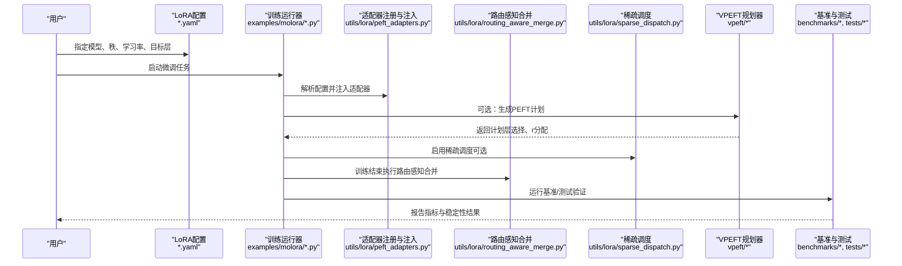
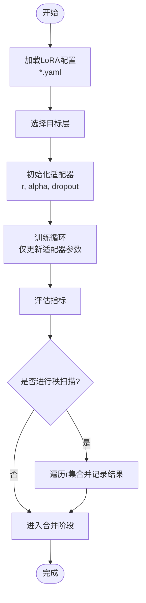
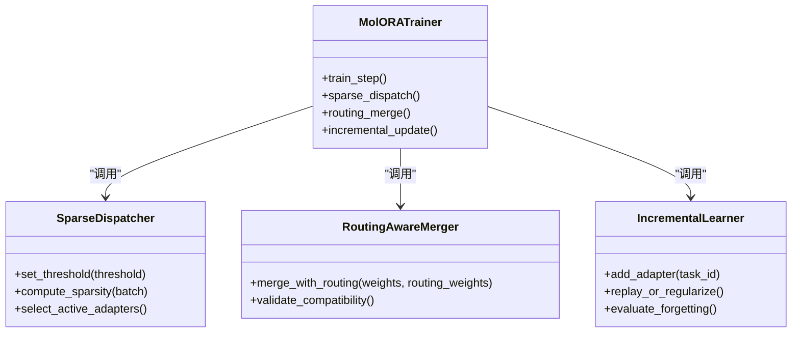
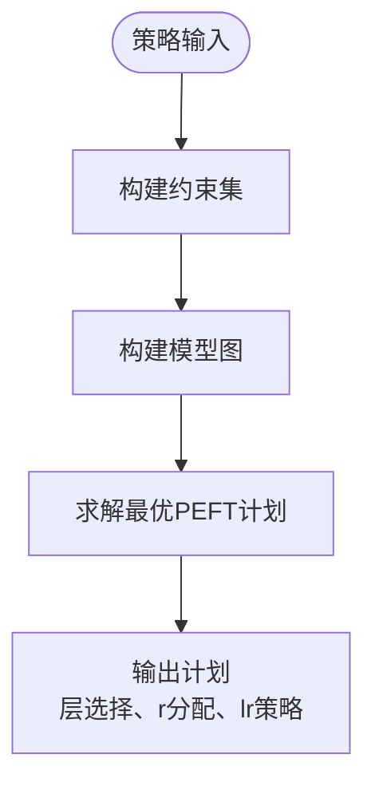
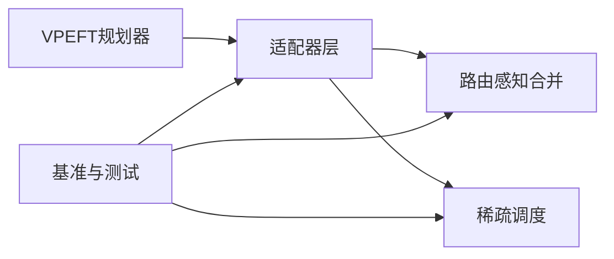

# 参数高效微调示例

<cite>
**本文引用的文件**
- [examples/lora_examples/yolo_master_lora_README.md](file://examples/lora_examples/yolo_master_lora_README.md)
- [examples/lora_examples/yolo11_lora.yaml](file://examples/lora_examples/yolo11_lora.yaml)
- [examples/lora_examples/yolo12_lora.yaml](file://examples/lora_examples/yolo12_lora.yaml)
- [examples/lora_examples/yolov8_lora.yaml](file://examples/lora_examples/yolov8_lora.yaml)
- [examples/lora_examples/yolo_master_visdrone_lora.yaml](file://examples/lora_examples/yolo_master_visdrone_lora.yaml)
- [examples/lora_examples/run_yolo_master_lora_rank_sweep.py](file://examples/lora_examples/run_yolo_master_lora_rank_sweep.py)
- [examples/molora/basic_finetune.py](file://examples/molora/basic_finetune.py)
- [examples/molora/compare_coco128.py](file://examples/molora/compare_coco128.py)
- [examples/molora/compare_lora_molora.py](file://examples/molora/compare_lora_molora.py)
- [examples/molora/continual_learning.py](file://examples/molora/continual_learning.py)
- [ultralytics/utils/lora/__init__.py](file://ultralytics/utils/lora/__init__.py)
- [ultralytics/utils/lora/peft_adapters.py](file://ultralytics/utils/lora/peft_adapters.py)
- [ultralytics/utils/lora/routing_aware_merge.py](file://ultralytics/utils/lora/routing_aware_merge.py)
- [ultralytics/utils/lora/sparse_dispatch.py](file://ultralytics/utils/lora/sparse_dispatch.py)
- [ultralytics/vpeft/policy.py](file://ultralytics/vpeft/policy.py)
- [ultralytics/vpeft/constraints.py](file://ultralytics/vpeft/constraints.py)
- [ultralytics/vpeft/graph.py](file://ultralytics/vpeft/graph.py)
- [ultralytics/vpeft/solver.py](file://ultralytics/vpeft/solver.py)
- [benchmarks/benchmark_molora_dispatch.py](file://benchmarks/benchmark_molora_dispatch.py)
- [scripts/ablation_suite/ablation_peft_coco128.py](file://scripts/ablation_suite/ablation_peft_coco128.py)
- [scripts/ablation_suite/ablation_molora_full.py](file://scripts/ablation_suite/ablation_molora_full.py)
- [tests/test_molora.py](file://tests/test_molora.py)
- [tests/test_molora_routing_aware_merge.py](file://tests/test_molora_routing_aware_merge.py)
- [tests/test_molora_sparse_dispatch.py](file://tests/test_molora_sparse_dispatch.py)
- [tests/test_vpeft.py](file://tests/test_vpeft.py)
</cite>

## 目录
1. [简介](#简介)
2. [项目结构](#项目结构)
3. [核心组件](#核心组件)
4. [架构总览](#架构总览)
5. [详细组件分析](#详细组件分析)
6. [依赖关系分析](#依赖关系分析)
7. [性能与部署优化](#性能与部署优化)
8. [故障排查指南](#故障排查指南)
9. [结论](#结论)
10. [附录](#附录)

## 简介
本文件面向希望在实际视觉任务中落地LoRA、DoRA与MolORA等参数高效微调(PEFT)技术的工程师与研究者。文档围绕以下目标展开：
- LoRA实现原理与配置要点：秩选择、学习率策略、适配器合并策略
- DoRA技术优势与适用场景：权重分解、方向优化
- MolORA完整使用指南：稀疏调度、路由感知合并、增量学习
- 在COCO、VisDrone等基准上的微调实践与调优经验
- 模型压缩、内存优化与推理加速的部署前准备
- 性能对比分析与最佳实践建议

## 项目结构
仓库中与PEFT相关的代码主要分布在以下位置：
- 示例与脚本
  - examples/lora_examples：LoRA配置文件与秩扫描脚本
  - examples/molora：MolORA基础微调、对比实验与持续学习脚本
- 核心实现
  - ultralytics/utils/lora：LoRA/DoRA/MolORA相关适配与工具
  - ultralytics/vpeft：可微PEFT规划器（策略、约束、图构建与求解）
- 基准与测试
  - benchmarks/benchmark_molora_dispatch.py：MolORA稀疏调度基准
  - scripts/ablation_suite：消融与回归验证脚本
  - tests/*：针对MolORA、VPEFT等的单元测试

```mermaid
graph TB
subgraph "示例"
LORAYAML["LoRA配置<br/>yolo11_lora.yaml / yolo12_lora.yaml / yolov8_lora.yaml"]
VISDRONEYAML["VisDrone LoRA配置<br/>yolo_master_visdrone_lora.yaml"]
RANKSWEEP["秩扫描脚本<br/>run_yolo_master_lora_rank_sweep.py"]
MOLORA_BF["MolORA基础微调<br/>basic_finetune.py"]
MOLORA_COMP["对比实验<br/>compare_coco128.py / compare_lora_molora.py"]
MOLORA_CL["持续学习<br/>continual_learning.py"]
end
subgraph "核心实现"
LORA_INIT["LoRA入口<br/>utils/lora/__init__.py"]
ADAPTERS["适配器实现<br/>utils/lora/peft_adapters.py"]
ROUTING_MERGE["路由感知合并<br/>utils/lora/routing_aware_merge.py"]
SPARSE_D["稀疏调度<br/>utils/lora/sparse_dispatch.py"]
VPEFT_POL["策略<br/>vpeft/policy.py"]
VPEFT_CON["约束<br/>vpeft/constraints.py"]
VPEFT_G["图构建<br/>vpeft/graph.py"]
VPEFT_SOL["求解器<br/>vpeft/solver.py"]
end
subgraph "基准与测试"
BM_MOL["MolORA基准<br/>benchmark_molora_dispatch.py"]
ABL_COCO["COCO128消融<br/>ablation_peft_coco128.py"]
ABL_MOL["MolORA消融<br/>ablation_molora_full.py"]
T_MOL["MolORA测试<br/>test_molora.py"]
T_RM["路由感知合并测试<br/>test_molora_routing_aware_merge.py"]
T_SD["稀疏调度测试<br/>test_molora_sparse_dispatch.py"]
T_VP["VPEFT测试<br/>test_vpeft.py"]
end
LORAYAML --> ADAPTERS
VISDRONEYAML --> ADAPTERS
RANKSWEEP --> ADAPTERS
MOLORA_BF --> ADAPTERS
MOLORA_COMP --> ADAPTERS
MOLORA_CL --> ADAPTERS
ADAPTERS --> ROUTING_MERGE
ADAPTERS --> SPARSE_D
ADAPTERS --> LORA_INIT
ROUTING_MERGE --> VPEFT_POL
ROUTING_MERGE --> VPEFT_CON
ROUTING_MERGE --> VPEFT_G
ROUTING_MERGE --> VPEFT_SOL
BM_MOL --> SPARSE_D
ABL_COCO --> ADAPTERS
ABL_MOL --> ROUTING_MERGE
T_MOL --> ADAPTERS
T_RM --> ROUTING_MERGE
T_SD --> SPARSE_D
T_VP --> VPEFT_SOL
```

图表来源
- [examples/lora_examples/yolo11_lora.yaml](file://examples/lora_examples/yolo11_lora.yaml)
- [examples/lora_examples/yolo12_lora.yaml](file://examples/lora_examples/yolo12_lora.yaml)
- [examples/lora_examples/yolov8_lora.yaml](file://examples/lora_examples/yolov8_lora.yaml)
- [examples/lora_examples/yolo_master_visdrone_lora.yaml](file://examples/lora_examples/yolo_master_visdrone_lora.yaml)
- [examples/lora_examples/run_yolo_master_lora_rank_sweep.py](file://examples/lora_examples/run_yolo_master_lora_rank_sweep.py)
- [examples/molora/basic_finetune.py](file://examples/molora/basic_finetune.py)
- [examples/molora/compare_coco128.py](file://examples/molora/compare_coco128.py)
- [examples/molora/compare_lora_molora.py](file://examples/molora/compare_lora_molora.py)
- [examples/molora/continual_learning.py](file://examples/molora/continual_learning.py)
- [ultralytics/utils/lora/__init__.py](file://ultralytics/utils/lora/__init__.py)
- [ultralytics/utils/lora/peft_adapters.py](file://ultralytics/utils/lora/peft_adapters.py)
- [ultralytics/utils/lora/routing_aware_merge.py](file://ultralytics/utils/lora/routing_aware_merge.py)
- [ultralytics/utils/lora/sparse_dispatch.py](file://ultralytics/utils/lora/sparse_dispatch.py)
- [ultralytics/vpeft/policy.py](file://ultralytics/vpeft/policy.py)
- [ultralytics/vpeft/constraints.py](file://ultralytics/vpeft/constraints.py)
- [ultralytics/vpeft/graph.py](file://ultralytics/vpeft/graph.py)
- [ultralytics/vpeft/solver.py](file://ultralytics/vpeft/solver.py)
- [benchmarks/benchmark_molora_dispatch.py](file://benchmarks/benchmark_molora_dispatch.py)
- [scripts/ablation_suite/ablation_peft_coco128.py](file://scripts/ablation_suite/ablation_peft_coco128.py)
- [scripts/ablation_suite/ablation_molora_full.py](file://scripts/ablation_suite/ablation_molora_full.py)
- [tests/test_molora.py](file://tests/test_molora.py)
- [tests/test_molora_routing_aware_merge.py](file://tests/test_molora_routing_aware_merge.py)
- [tests/test_molora_sparse_dispatch.py](file://tests/test_molora_sparse_dispatch.py)
- [tests/test_vpeft.py](file://tests/test_vpeft.py)

章节来源
- [examples/lora_examples/yolo11_lora.yaml](file://examples/lora_examples/yolo11_lora.yaml)
- [examples/lora_examples/yolo12_lora.yaml](file://examples/lora_examples/yolo12_lora.yaml)
- [examples/lora_examples/yolov8_lora.yaml](file://examples/lora_examples/yolov8_lora.yaml)
- [examples/lora_examples/yolo_master_visdrone_lora.yaml](file://examples/lora_examples/yolo_master_visdrone_lora.yaml)
- [examples/lora_examples/run_yolo_master_lora_rank_sweep.py](file://examples/lora_examples/run_yolo_master_lora_rank_sweep.py)
- [examples/molora/basic_finetune.py](file://examples/molora/basic_finetune.py)
- [examples/molora/compare_coco128.py](file://examples/molora/compare_coco128.py)
- [examples/molora/compare_lora_molora.py](file://examples/molora/compare_lora_molora.py)
- [examples/molora/continual_learning.py](file://examples/molora/continual_learning.py)
- [ultralytics/utils/lora/__init__.py](file://ultralytics/utils/lora/__init__.py)
- [ultralytics/utils/lora/peft_adapters.py](file://ultralytics/utils/lora/peft_adapters.py)
- [ultralytics/utils/lora/routing_aware_merge.py](file://ultralytics/utils/lora/routing_aware_merge.py)
- [ultralytics/utils/lora/sparse_dispatch.py](file://ultralytics/utils/lora/sparse_dispatch.py)
- [ultralytics/vpeft/policy.py](file://ultralytics/vpeft/policy.py)
- [ultralytics/vpeft/constraints.py](file://ultralytics/vpeft/constraints.py)
- [ultralytics/vpeft/graph.py](file://ultralytics/vpeft/graph.py)
- [ultralytics/vpeft/solver.py](file://ultralytics/vpeft/solver.py)
- [benchmarks/benchmark_molora_dispatch.py](file://benchmarks/benchmark_molora_dispatch.py)
- [scripts/ablation_suite/ablation_peft_coco128.py](file://scripts/ablation_suite/ablation_peft_coco128.py)
- [scripts/ablation_suite/ablation_molora_full.py](file://scripts/ablation_suite/ablation_molora_full.py)
- [tests/test_molora.py](file://tests/test_molora.py)
- [tests/test_molora_routing_aware_merge.py](file://tests/test_molora_routing_aware_merge.py)
- [tests/test_molora_sparse_dispatch.py](file://tests/test_molora_sparse_dispatch.py)
- [tests/test_vpeft.py](file://tests/test_vpeft.py)

## 核心组件
本节聚焦LoRA、DoRA与MolORA的关键实现模块及其职责边界。

- LoRA/DoRA适配器层
  - 负责将低秩矩阵或方向-幅度分解注入到目标层，支持训练时仅更新少量参数
  - 提供不同秩r的选择、缩放因子alpha、dropout与初始化策略
  - 支持多目标层批量插入与按层开关控制
- 路由感知合并
  - 在MoE/混合专家或多任务场景中，依据路由权重对多个适配器输出进行加权融合
  - 保证合并后权重与原模型兼容，便于导出与推理
- 稀疏调度
  - 动态激活/停用部分适配器或专家，降低显存占用并提升吞吐
  - 结合门控阈值与批内稀疏度控制，实现按需计算
- VPEFT规划器
  - 基于策略、约束与图构建，自动搜索最优的PEFT方案（如哪些层插LoRA、r值分配）
  - 通过求解器输出可执行的微调计划

章节来源
- [ultralytics/utils/lora/peft_adapters.py](file://ultralytics/utils/lora/peft_adapters.py)
- [ultralytics/utils/lora/routing_aware_merge.py](file://ultralytics/utils/lora/routing_aware_merge.py)
- [ultralytics/utils/lora/sparse_dispatch.py](file://ultralytics/utils/lora/sparse_dispatch.py)
- [ultralytics/vpeft/policy.py](file://ultralytics/vpeft/policy.py)
- [ultralytics/vpeft/constraints.py](file://ultralytics/vpeft/constraints.py)
- [ultralytics/vpeft/graph.py](file://ultralytics/vpeft/graph.py)
- [ultralytics/vpeft/solver.py](file://ultralytics/vpeft/solver.py)

## 架构总览
下图展示了从配置到训练、合并与推理的整体流程，以及各模块之间的交互关系。

图表来源
- [examples/lora_examples/yolo11_lora.yaml](file://examples/lora_examples/yolo11_lora.yaml)
- [examples/molora/basic_finetune.py](file://examples/molora/basic_finetune.py)
- [ultralytics/utils/lora/peft_adapters.py](file://ultralytics/utils/lora/peft_adapters.py)
- [ultralytics/utils/lora/routing_aware_merge.py](file://ultralytics/utils/lora/routing_aware_merge.py)
- [ultralytics/utils/lora/sparse_dispatch.py](file://ultralytics/utils/lora/sparse_dispatch.py)
- [ultralytics/vpeft/policy.py](file://ultralytics/vpeft/policy.py)
- [ultralytics/vpeft/constraints.py](file://ultralytics/vpeft/constraints.py)
- [ultralytics/vpeft/graph.py](file://ultralytics/vpeft/graph.py)
- [ultralytics/vpeft/solver.py](file://ultralytics/vpeft/solver.py)
- [benchmarks/benchmark_molora_dispatch.py](file://benchmarks/benchmark_molora_dispatch.py)
- [tests/test_molora.py](file://tests/test_molora.py)

## 详细组件分析

### LoRA实现与配置
- 关键能力
  - 秩r与缩放alpha：影响表达能力与参数量；通常r∈{1,2,4,8,16}，alpha常取r或2r
  - 学习率设置：适配器学习率通常高于主干冻结时的默认学习率，需配合warmup与衰减
  - 目标层选择：卷积/线性/注意力等不同层的插入策略会影响收敛速度与最终精度
  - 初始化与正则：零初始化或高斯初始化、dropout比例对稳定性有显著影响
- 配置示例参考
  - YOLO11/12/v8的LoRA配置模板位于examples/lora_examples下，可直接修改r、alpha、lr、target_layers等字段
  - VisDrone专用配置用于小目标密集场景，建议更小的r与更强的数据增强
- 秩扫描与自动化
  - run_yolo_master_lora_rank_sweep.py提供秩扫描流水线，便于在给定数据集上快速定位最优r

图表来源
- [examples/lora_examples/yolo11_lora.yaml](file://examples/lora_examples/yolo11_lora.yaml)
- [examples/lora_examples/yolo12_lora.yaml](file://examples/lora_examples/yolo12_lora.yaml)
- [examples/lora_examples/yolov8_lora.yaml](file://examples/lora_examples/yolov8_lora.yaml)
- [examples/lora_examples/yolo_master_visdrone_lora.yaml](file://examples/lora_examples/yolo_master_visdrone_lora.yaml)
- [examples/lora_examples/run_yolo_master_lora_rank_sweep.py](file://examples/lora_examples/run_yolo_master_lora_rank_sweep.py)
- [ultralytics/utils/lora/peft_adapters.py](file://ultralytics/utils/lora/peft_adapters.py)

章节来源
- [examples/lora_examples/yolo11_lora.yaml](file://examples/lora_examples/yolo11_lora.yaml)
- [examples/lora_examples/yolo12_lora.yaml](file://examples/lora_examples/yolo12_lora.yaml)
- [examples/lora_examples/yolov8_lora.yaml](file://examples/lora_examples/yolov8_lora.yaml)
- [examples/lora_examples/yolo_master_visdrone_lora.yaml](file://examples/lora_examples/yolo_master_visdrone_lora.yaml)
- [examples/lora_examples/run_yolo_master_lora_rank_sweep.py](file://examples/lora_examples/run_yolo_master_lora_rank_sweep.py)
- [ultralytics/utils/lora/peft_adapters.py](file://ultralytics/utils/lora/peft_adapters.py)

### DoRA：权重分解与方向优化
- 技术要点
  - 将权重分解为“方向向量+幅度标量”，仅在方向上进行低秩更新，有助于稳定梯度与减少过拟合
  - 适用于对数值稳定性敏感的任务（如长尾分布、小目标检测）
- 适用场景
  - 数据规模有限但需要较高泛化能力的场景
  - 与LoRA组合使用时，可在关键层采用DoRA以增强鲁棒性
- 实现参考
  - 适配器层内部提供DoRA分支，可通过配置开关切换LoRA/DoRA模式

章节来源
- [ultralytics/utils/lora/peft_adapters.py](file://ultralytics/utils/lora/peft_adapters.py)

### MolORA：稀疏调度、路由感知合并与增量学习
- 稀疏调度
  - 根据门控阈值与批内稀疏度控制，动态激活部分适配器/专家，降低计算与显存开销
  - 支持动态阈值调整与早停策略，避免过度稀疏导致性能退化
- 路由感知合并
  - 在多任务或混合专家场景，依据路由权重对多个适配器输出进行加权融合，确保合并后的权重与原模型兼容
  - 合并过程考虑路由分布，避免某些专家被长期忽略
- 增量学习
  - 支持在新任务上逐步添加适配器，同时保持旧任务性能
  - 结合回放或正则项抑制灾难性遗忘
- 使用指南
  - basic_finetune.py：最小可用示例，展示如何开启稀疏调度与路由感知合并
  - compare_coco128.py / compare_lora_molora.py：在COCO128上对比LoRA与MolORA的性能差异
  - continual_learning.py：演示增量学习流程与评估方法

图表来源
- [examples/molora/basic_finetune.py](file://examples/molora/basic_finetune.py)
- [examples/molora/compare_coco128.py](file://examples/molora/compare_coco128.py)
- [examples/molora/compare_lora_molora.py](file://examples/molora/compare_lora_molora.py)
- [examples/molora/continual_learning.py](file://examples/molora/continual_learning.py)
- [ultralytics/utils/lora/sparse_dispatch.py](file://ultralytics/utils/lora/sparse_dispatch.py)
- [ultralytics/utils/lora/routing_aware_merge.py](file://ultralytics/utils/lora/routing_aware_merge.py)

章节来源
- [examples/molora/basic_finetune.py](file://examples/molora/basic_finetune.py)
- [examples/molora/compare_coco128.py](file://examples/molora/compare_coco128.py)
- [examples/molora/compare_lora_molora.py](file://examples/molora/compare_lora_molora.py)
- [examples/molora/continual_learning.py](file://examples/molora/continual_learning.py)
- [ultralytics/utils/lora/sparse_dispatch.py](file://ultralytics/utils/lora/sparse_dispatch.py)
- [ultralytics/utils/lora/routing_aware_merge.py](file://ultralytics/utils/lora/routing_aware_merge.py)

### VPEFT规划器：策略、约束、图构建与求解
- 策略(policy)：定义可插层的候选集、r值范围、学习率上限等
- 约束(constraints)：显存预算、参数量上限、层间相关性限制
- 图(graph)：将模型结构与PEFT选项建模为图，便于搜索与剪枝
- 求解器(solver)：基于启发式或优化算法输出最优PEFT计划

图表来源
- [ultralytics/vpeft/policy.py](file://ultralytics/vpeft/policy.py)
- [ultralytics/vpeft/constraints.py](file://ultralytics/vpeft/constraints.py)
- [ultralytics/vpeft/graph.py](file://ultralytics/vpeft/graph.py)
- [ultralytics/vpeft/solver.py](file://ultralytics/vpeft/solver.py)

章节来源
- [ultralytics/vpeft/policy.py](file://ultralytics/vpeft/policy.py)
- [ultralytics/vpeft/constraints.py](file://ultralytics/vpeft/constraints.py)
- [ultralytics/vpeft/graph.py](file://ultralytics/vpeft/graph.py)
- [ultralytics/vpeft/solver.py](file://ultralytics/vpeft/solver.py)

## 依赖关系分析
- 模块耦合
  - 适配器层依赖路由感知合并与稀疏调度，形成“训练时稀疏+合并时融合”的闭环
  - VPEFT规划器独立于具体适配器实现，通过策略与约束驱动通用PEFT计划
- 外部依赖
  - 基准与测试覆盖MolORA、稀疏调度与VPEFT，确保功能正确性与数值稳定性
- 潜在风险
  - 路由权重分布不均可能导致某些专家长期不活跃，需在合并阶段引入公平性约束
  - 稀疏阈值过高会破坏性能，应结合验证集监控与自适应调整

图表来源
- [ultralytics/utils/lora/peft_adapters.py](file://ultralytics/utils/lora/peft_adapters.py)
- [ultralytics/utils/lora/routing_aware_merge.py](file://ultralytics/utils/lora/routing_aware_merge.py)
- [ultralytics/utils/lora/sparse_dispatch.py](file://ultralytics/utils/lora/sparse_dispatch.py)
- [ultralytics/vpeft/policy.py](file://ultralytics/vpeft/policy.py)
- [ultralytics/vpeft/constraints.py](file://ultralytics/vpeft/constraints.py)
- [ultralytics/vpeft/graph.py](file://ultralytics/vpeft/graph.py)
- [ultralytics/vpeft/solver.py](file://ultralytics/vpeft/solver.py)
- [benchmarks/benchmark_molora_dispatch.py](file://benchmarks/benchmark_molora_dispatch.py)
- [tests/test_molora.py](file://tests/test_molora.py)
- [tests/test_molora_routing_aware_merge.py](file://tests/test_molora_routing_aware_merge.py)
- [tests/test_molora_sparse_dispatch.py](file://tests/test_molora_sparse_dispatch.py)
- [tests/test_vpeft.py](file://tests/test_vpeft.py)

章节来源
- [ultralytics/utils/lora/peft_adapters.py](file://ultralytics/utils/lora/peft_adapters.py)
- [ultralytics/utils/lora/routing_aware_merge.py](file://ultralytics/utils/lora/routing_aware_merge.py)
- [ultralytics/utils/lora/sparse_dispatch.py](file://ultralytics/utils/lora/sparse_dispatch.py)
- [ultralytics/vpeft/policy.py](file://ultralytics/vpeft/policy.py)
- [ultralytics/vpeft/constraints.py](file://ultralytics/vpeft/constraints.py)
- [ultralytics/vpeft/graph.py](file://ultralytics/vpeft/graph.py)
- [ultralytics/vpeft/solver.py](file://ultralytics/vpeft/solver.py)
- [benchmarks/benchmark_molora_dispatch.py](file://benchmarks/benchmark_molora_dispatch.py)
- [tests/test_molora.py](file://tests/test_molora.py)
- [tests/test_molora_routing_aware_merge.py](file://tests/test_molora_routing_aware_merge.py)
- [tests/test_molora_sparse_dispatch.py](file://tests/test_molora_sparse_dispatch.py)
- [tests/test_vpeft.py](file://tests/test_vpeft.py)

## 性能与部署优化
- 模型压缩
  - 利用稀疏调度减少激活路径，结合量化与剪枝进一步压缩体积
  - 路由感知合并后可直接导出为单权重模型，避免运行时融合开销
- 内存优化
  - 冻结主干、仅训练适配器；合理设置r与batch size，避免显存峰值过高
  - 使用梯度检查点与混合精度训练降低内存占用
- 推理加速
  - 合并后模型可直接部署至ONNX/TensorRT/OpenVINO等后端
  - 针对边缘设备，优先选择较小r与适度稀疏度，平衡精度与延迟

[本节为通用指导，无需特定文件引用]

## 故障排查指南
- 常见问题
  - 训练不稳定：检查DoRA/LoRA初始化与学习率；适当增大warmup步数
  - 路由权重异常：监控路由分布，必要时引入负载均衡损失或重校准
  - 稀疏度过高：逐步提高阈值，观察验证集指标变化
- 调试建议
  - 使用基准脚本与单元测试复现问题，定位是稀疏调度还是合并逻辑导致
  - 在小型数据集上快速验证配置有效性，再扩展到全量数据

章节来源
- [benchmarks/benchmark_molora_dispatch.py](file://benchmarks/benchmark_molora_dispatch.py)
- [tests/test_molora.py](file://tests/test_molora.py)
- [tests/test_molora_routing_aware_merge.py](file://tests/test_molora_routing_aware_merge.py)
- [tests/test_molora_sparse_dispatch.py](file://tests/test_molora_sparse_dispatch.py)
- [tests/test_vpeft.py](file://tests/test_vpeft.py)

## 结论
- LoRA在多数视觉任务中能以极低参数成本获得良好效果，关键在于合理的r与学习率策略
- DoRA在数值稳定性与泛化方面具备优势，适合小样本与长尾场景
- MolORA通过稀疏调度与路由感知合并，在资源受限环境下实现高效微调与增量学习
- 借助VPEFT规划器，可系统化地搜索最优PEFT方案，提升工程效率与可重复性

[本节为总结性内容，无需特定文件引用]

## 附录
- 数据集与基准
  - COCO/COCO128：标准目标检测基准，适合验证LoRA/MolORA的通用性
  - VisDrone：无人机视角小目标密集场景，适合验证DoRA与稀疏调度的鲁棒性
- 参考脚本与配置
  - LoRA配置模板与秩扫描脚本位于examples/lora_examples
  - MolORA基础微调与对比实验位于examples/molora
  - 消融与回归验证位于scripts/ablation_suite

章节来源
- [examples/lora_examples/yolo_master_lora_README.md](file://examples/lora_examples/yolo_master_lora_README.md)
- [examples/lora_examples/yolo11_lora.yaml](file://examples/lora_examples/yolo11_lora.yaml)
- [examples/lora_examples/yolo12_lora.yaml](file://examples/lora_examples/yolo12_lora.yaml)
- [examples/lora_examples/yolov8_lora.yaml](file://examples/lora_examples/yolov8_lora.yaml)
- [examples/lora_examples/yolo_master_visdrone_lora.yaml](file://examples/lora_examples/yolo_master_visdrone_lora.yaml)
- [examples/lora_examples/run_yolo_master_lora_rank_sweep.py](file://examples/lora_examples/run_yolo_master_lora_rank_sweep.py)
- [examples/molora/basic_finetune.py](file://examples/molora/basic_finetune.py)
- [examples/molora/compare_coco128.py](file://examples/molora/compare_coco128.py)
- [examples/molora/compare_lora_molora.py](file://examples/molora/compare_lora_molora.py)
- [examples/molora/continual_learning.py](file://examples/molora/continual_learning.py)
- [scripts/ablation_suite/ablation_peft_coco128.py](file://scripts/ablation_suite/ablation_peft_coco128.py)
- [scripts/ablation_suite/ablation_molora_full.py](file://scripts/ablation_suite/ablation_molora_full.py)