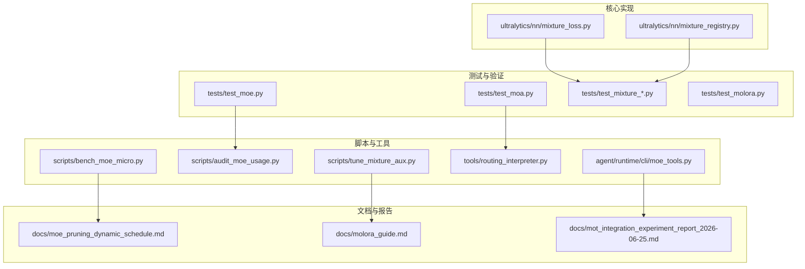
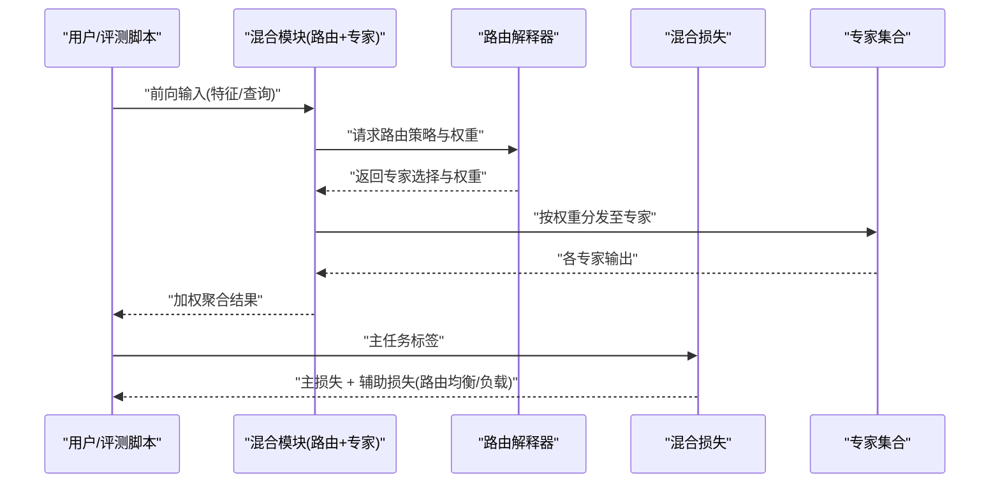
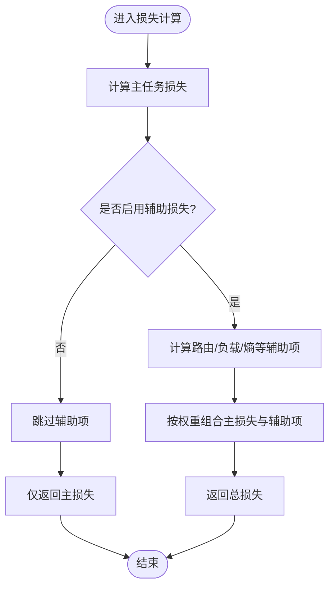
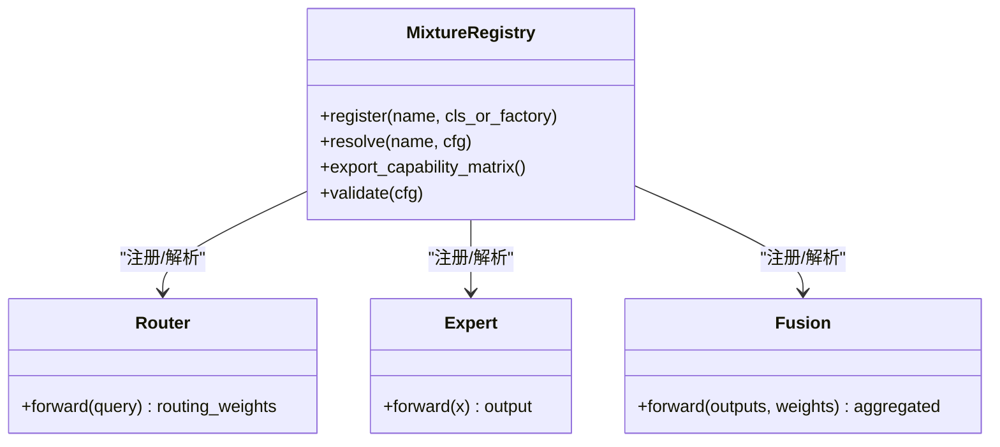
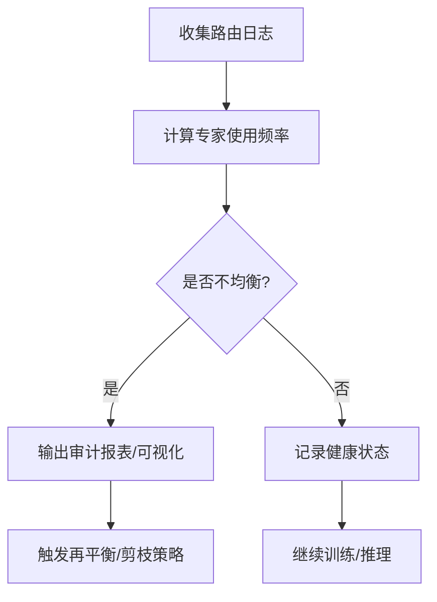
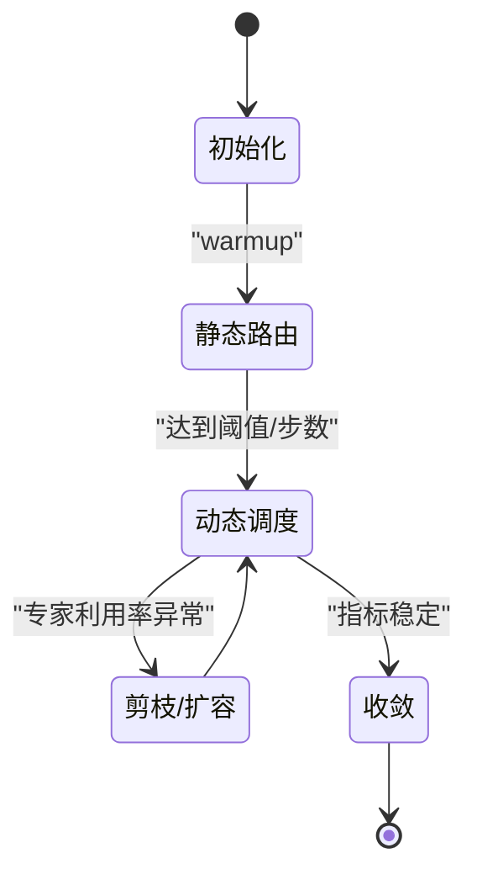
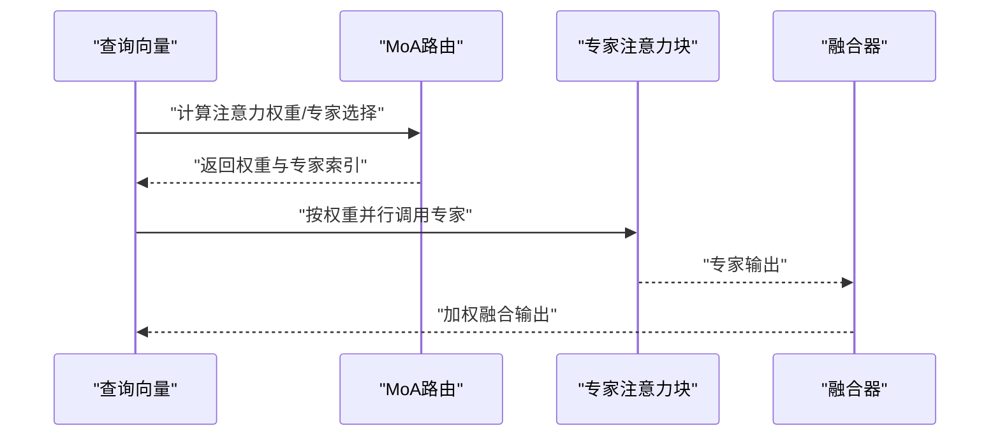
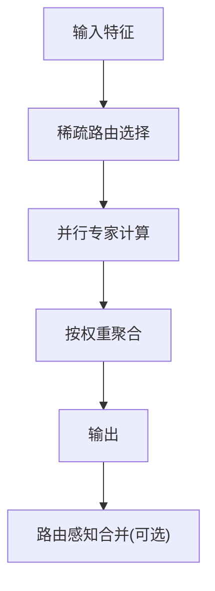
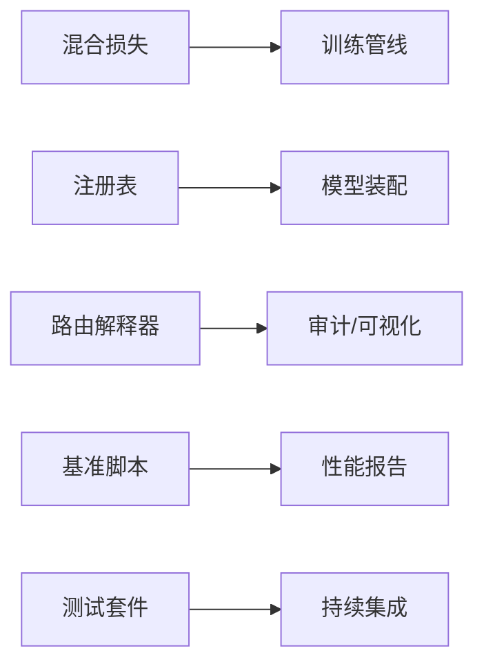

# 多专家混合应用示例

<cite>
**本文引用的文件**
- [mixture_loss.py](file://ultralytics/nn/mixture_loss.py)
- [mixture_registry.py](file://ultralytics/nn/mixture_registry.py)
- [moe_tools.py](file://agent/runtime/cli/moe_tools.py)
- [test_moa.py](file://tests/test_moa.py)
- [test_moe.py](file://tests/test_moe.py)
- [test_mixture_config_resolution.py](file://tests/test_mixture_config_resolution.py)
- [test_mixture_numeric.py](file://tests/test_mixture_numeric.py)
- [test_mixture_export.py](file://tests/test_mixture_export.py)
- [test_mixture_model_registry.py](file://tests/test_mixture_model_registry.py)
- [test_mixture_aux_loss.py](file://tests/test_mixture_aux_loss.py)
- [test_mixture_compile.py](file://tests/test_mixture_compile.py)
- [test_mixture_loss_composition.py](file://tests/test_mixture_loss_composition.py)
- [test_moe_dynamic_scheduler.py](file://tests/test_moe_dynamic_scheduler.py)
- [test_moe_router_boundaries.py](file://tests/test_moe_router_boundaries.py)
- [test_moe_ssot.py](file://tests/test_moe_ssot.py)
- [test_moe_usage_audit.py](file://tests/test_moe_usage_audit.py)
- [test_moe_validation_collectives.py](file://tests/test_moe_validation_collectives.py)
- [test_moe_variant_contract.py](file://tests/test_moe_variant_contract.py)
- [test_molora.py](file://tests/test_molora.py)
- [test_molora_sparse_dispatch.py](file://tests/test_molora_sparse_dispatch.py)
- [test_molora_routing_aware_merge.py](file://tests/test_molora_routing_aware_merge.py)
- [test_molora_dtype.py](file://tests/test_molora_dtype.py)
- [test_molora_merge_semantics.py](file://tests/test_molora_merge_semantics.py)
- [test_molora_supplementary.py](file://tests/test_molora_supplementary.py)
- [test_moa_mot_ddp_math.py](file://tests/test_moa_mot_ddp_math.py)
- [test_moa_mot_ssot.py](file://tests/test_moa_mot_ssot.py)
- [test_moe_amp_index_add.py](file://tests/test_moe_amp_index_add.py)
- [test_moe_ddp_fixes.py](file://tests/test_moe_ddp_fixes.py)
- [test_moe_aware_peft.py](file://tests/test_moe_aware_peft.py)
- [test_moe_dynamic_schedule.py](file://tests/test_moe_dynamic_schedule.py)
- [test_moe_usage_audit.py](file://tests/test_moe_usage_audit.py)
- [bench_moe_micro.py](file://scripts/bench_moe_micro.py)
- [bench_moe_mps.py](file://scripts/bench_moe_mps.py)
- [audit_moe_usage.py](file://scripts/audit_moe_usage.py)
- [check_moe_ssot.py](file://scripts/check_moe_ssot.py)
- [tune_mixture_aux.py](file://scripts/tune_mixture_aux.py)
- [compare_moe_coco128.py](file://scripts/compare_moe_coco128.py)
- [compare_moe_v0_12_voc.py](file://scripts/compare_moe_v0_12_voc.py)
- [compare_moe_v0_13_15_voc.py](file://scripts/compare_moe_v0_13_15_voc.py)
- [plot_moe_pruning_sweep.py](file://scripts/plot_moe_pruning_sweep.py)
- [run_moe_dynamic_schedule_ablation.py](file://scripts/run_moe_dynamic_schedule_ablation.py)
- [analyze_mot_routing.py](file://scripts/analyze_mot_routing.py)
- [diagnose_mot_routing.py](file://scripts/diagnose_mot_routing.py)
- [prepare_mot_routing_scenes.py](file://scripts/prepare_mot_routing_scenes.py)
- [routing_interpreter.py](file://tools/routing_interpreter.py)
- [moe_pruning_dynamic_schedule.md](file://docs/moe_pruning_dynamic_schedule.md)
- [molora_guide.md](file://docs/molora_guide.md)
- [mot_integration_experiment_report_2026-06-25.md](file://docs/mot_integration_experiment_report_2026-06-25.md)
- [YOLO-Master-v260721-MoA-MoE-MoT-PEFT-Planner-深度分析-v4.md](file://YOLO-Master-v260721-MoA-MoE-MoT-PEFT-Planner-深度分析-v4.md)
</cite>

## 目录
1. [简介](#简介)
2. [项目结构](#项目结构)
3. [核心组件](#核心组件)
4. [架构总览](#架构总览)
5. [详细组件分析](#详细组件分析)
6. [依赖关系分析](#依赖关系分析)
7. [性能与调优](#性能与调优)
8. [故障排查指南](#故障排查指南)
9. [结论](#结论)
10. [附录：训练配置与任务场景](#附录训练配置与任务场景)

## 简介
本文件面向希望在视觉任务中落地多专家混合（MoE）与混合注意力（MoA）的工程实践者，提供从架构、配置到训练、评估、部署与调试的完整指南。内容覆盖：
- MoE/MoA 的配置方法：路由策略、负载均衡、专家网络规模与稀疏度等关键参数
- MoA 的实现要点：注意力权重分配、动态路由算法、专家选择策略
- 训练配置示例：损失函数设计、梯度更新策略、监控指标
- 不同任务的调优经验：目标检测、分割、姿态估计等
- 性能分析与调试：专家利用率监控、路由决策可视化、分布式训练注意事项

## 项目结构
仓库围绕“模型定义—路由与混合机制—训练与评估—工具与文档”分层组织。与 MoE/MoA 相关的核心代码集中在 nn 模块与 tests、scripts、tools、docs 等目录中；agent 侧提供 CLI 工具链以支持诊断与实验。

图表来源
- [mixture_loss.py](file://ultralytics/nn/mixture_loss.py)
- [mixture_registry.py](file://ultralytics/nn/mixture_registry.py)
- [test_moe.py](file://tests/test_moe.py)
- [test_moa.py](file://tests/test_moa.py)
- [bench_moe_micro.py](file://scripts/bench_moe_micro.py)
- [audit_moe_usage.py](file://scripts/audit_moe_usage.py)
- [tune_mixture_aux.py](file://scripts/tune_mixture_aux.py)
- [routing_interpreter.py](file://tools/routing_interpreter.py)
- [moe_tools.py](file://agent/runtime/cli/moe_tools.py)
- [moe_pruning_dynamic_schedule.md](file://docs/moe_pruning_dynamic_schedule.md)
- [molora_guide.md](file://docs/molora_guide.md)
- [mot_integration_experiment_report_2026-06-25.md](file://docs/mot_integration_experiment_report_2026-06-25.md)

章节来源
- [mixture_loss.py](file://ultralytics/nn/mixture_loss.py)
- [mixture_registry.py](file://ultralytics/nn/mixture_registry.py)
- [test_moe.py](file://tests/test_moe.py)
- [test_moa.py](file://tests/test_moa.py)
- [bench_moe_micro.py](file://scripts/bench_moe_micro.py)
- [audit_moe_usage.py](file://scripts/audit_moe_usage.py)
- [tune_mixture_aux.py](file://scripts/tune_mixture_aux.py)
- [routing_interpreter.py](file://tools/routing_interpreter.py)
- [moe_tools.py](file://agent/runtime/cli/moe_tools.py)
- [moe_pruning_dynamic_schedule.md](file://docs/moe_pruning_dynamic_schedule.md)
- [molora_guide.md](file://docs/molora_guide.md)
- [mot_integration_experiment_report_2026-06-25.md](file://docs/mot_integration_experiment_report_2026-06-25.md)

## 核心组件
- 混合损失与辅助项
  - 负责计算主任务损失与 MoE/MoA 相关辅助损失（如路由均衡、负载惩罚等），并提供组合接口以便在不同任务中复用。
- 混合模块注册表
  - 统一注册与管理各类混合模块（路由、专家、融合器），提供按名称解析、版本兼容与导出能力矩阵校验。
- 路由解释器与审计工具
  - 对路由决策进行可解释性分析、统计专家使用率、绘制路由热力图，并输出审计报表用于定位不均衡问题。
- 基准与微调脚本
  - 提供微基准（吞吐/延迟）、MPS/CPU 行为一致性检查、辅助损失调参、跨数据集对比与动态调度消融等。

章节来源
- [mixture_loss.py](file://ultralytics/nn/mixture_loss.py)
- [mixture_registry.py](file://ultralytics/nn/mixture_registry.py)
- [routing_interpreter.py](file://tools/routing_interpreter.py)
- [audit_moe_usage.py](file://scripts/audit_moe_usage.py)
- [bench_moe_micro.py](file://scripts/bench_moe_micro.py)
- [tune_mixture_aux.py](file://scripts/tune_mixture_aux.py)

## 架构总览
下图展示了 MoE/MoA 在推理与训练中的端到端流程，包括数据输入、路由决策、专家并行执行、结果聚合与损失回传。

图表来源
- [mixture_loss.py](file://ultralytics/nn/mixture_loss.py)
- [routing_interpreter.py](file://tools/routing_interpreter.py)
- [test_moe.py](file://tests/test_moe.py)
- [test_moa.py](file://tests/test_moa.py)

## 详细组件分析

### 混合损失与辅助项（Loss & Aux）
- 功能要点
  - 主任务损失与 MoE/MoA 辅助损失的组合接口
  - 支持多种辅助项：路由熵正则、专家负载均衡、门控稳定性约束等
  - 提供可插拔的损失权重调度与开关
- 复杂度与性能
  - 辅助项计算通常为 O(N_experts) 或 O(batch*topk)，建议结合稀疏路由控制 topk 与批大小
- 错误处理与数值稳定
  - 对零权重、NaN/Inf 进行保护，避免反向传播异常
- 参考路径
  - [mixture_loss.py](file://ultralytics/nn/mixture_loss.py)
  - [test_mixture_loss_composition.py](file://tests/test_mixture_loss_composition.py)
  - [test_mixture_aux_loss.py](file://tests/test_mixture_aux_loss.py)

图表来源
- [mixture_loss.py](file://ultralytics/nn/mixture_loss.py)
- [test_mixture_loss_composition.py](file://tests/test_mixture_loss_composition.py)
- [test_mixture_aux_loss.py](file://tests/test_mixture_aux_loss.py)

章节来源
- [mixture_loss.py](file://ultralytics/nn/mixture_loss.py)
- [test_mixture_loss_composition.py](file://tests/test_mixture_loss_composition.py)
- [test_mixture_aux_loss.py](file://tests/test_mixture_aux_loss.py)

### 混合模块注册表（Registry）
- 功能要点
  - 集中管理路由、专家、融合器的注册与解析
  - 提供版本兼容、默认参数合并、导出能力矩阵校验
- 扩展方式
  - 通过装饰器或显式注册 API 新增自定义路由/专家
- 参考路径
  - [mixture_registry.py](file://ultralytics/nn/mixture_registry.py)
  - [test_mixture_model_registry.py](file://tests/test_mixture_model_registry.py)
  - [test_mixture_config_resolution.py](file://tests/test_mixture_config_resolution.py)

图表来源
- [mixture_registry.py](file://ultralytics/nn/mixture_registry.py)
- [test_mixture_model_registry.py](file://tests/test_mixture_model_registry.py)
- [test_mixture_config_resolution.py](file://tests/test_mixture_config_resolution.py)

章节来源
- [mixture_registry.py](file://ultralytics/nn/mixture_registry.py)
- [test_mixture_model_registry.py](file://tests/test_mixture_model_registry.py)
- [test_mixture_config_resolution.py](file://tests/test_mixture_config_resolution.py)

### 路由解释器与审计（Routing Interpreter & Audit）
- 功能要点
  - 统计每层/每步的路由分布、专家使用率、Gini 系数等
  - 生成可视化（热力图、时序曲线）与审计报表
  - 辅助定位“热点专家”和“冷专家”，指导剪枝与重平衡
- 参考路径
  - [routing_interpreter.py](file://tools/routing_interpreter.py)
  - [audit_moe_usage.py](file://scripts/audit_moe_usage.py)
  - [test_moe_usage_audit.py](file://tests/test_moe_usage_audit.py)

图表来源
- [routing_interpreter.py](file://tools/routing_interpreter.py)
- [audit_moe_usage.py](file://scripts/audit_moe_usage.py)
- [test_moe_usage_audit.py](file://tests/test_moe_usage_audit.py)

章节来源
- [routing_interpreter.py](file://tools/routing_interpreter.py)
- [audit_moe_usage.py](file://scripts/audit_moe_usage.py)
- [test_moe_usage_audit.py](file://tests/test_moe_usage_audit.py)

### MoE 动态调度与边界（Dynamic Scheduler & Boundaries）
- 功能要点
  - 根据训练阶段动态调整 top-k、路由温度、负载均衡权重等
  - 维护路由边界与容量上限，防止过载
- 参考路径
  - [test_moe_dynamic_scheduler.py](file://tests/test_moe_dynamic_scheduler.py)
  - [test_moe_router_boundaries.py](file://tests/test_moe_router_boundaries.py)
  - [run_moe_dynamic_schedule_ablation.py](file://scripts/run_moe_dynamic_schedule_ablation.py)
  - [moe_pruning_dynamic_schedule.md](file://docs/moe_pruning_dynamic_schedule.md)

图表来源
- [test_moe_dynamic_scheduler.py](file://tests/test_moe_dynamic_scheduler.py)
- [test_moe_router_boundaries.py](file://tests/test_moe_router_boundaries.py)
- [run_moe_dynamic_schedule_ablation.py](file://scripts/run_moe_dynamic_schedule_ablation.py)
- [moe_pruning_dynamic_schedule.md](file://docs/moe_pruning_dynamic_schedule.md)

章节来源
- [test_moe_dynamic_scheduler.py](file://tests/test_moe_dynamic_scheduler.py)
- [test_moe_router_boundaries.py](file://tests/test_moe_router_boundaries.py)
- [run_moe_dynamic_schedule_ablation.py](file://scripts/run_moe_dynamic_schedule_ablation.py)
- [moe_pruning_dynamic_schedule.md](file://docs/moe_pruning_dynamic_schedule.md)

### MoA（混合注意力）与 MOT 集成
- 功能要点
  - 在注意力层引入多专家分支，按查询动态选择专家子集
  - 与多目标跟踪（MOT）场景结合，提升复杂场景下的鲁棒性与精度
- 参考路径
  - [test_moa.py](file://tests/test_moa.py)
  - [test_moa_mot_ddp_math.py](file://tests/test_moa_mot_ddp_math.py)
  - [test_moa_mot_ssot.py](file://tests/test_moa_mot_ssot.py)
  - [analyze_mot_routing.py](file://scripts/analyze_mot_routing.py)
  - [diagnose_mot_routing.py](file://scripts/diagnose_mot_routing.py)
  - [prepare_mot_routing_scenes.py](file://scripts/prepare_mot_routing_scenes.py)
  - [mot_integration_experiment_report_2026-06-25.md](file://docs/mot_integration_experiment_report_2026-06-25.md)

图表来源
- [test_moa.py](file://tests/test_moa.py)
- [test_moa_mot_ddp_math.py](file://tests/test_moa_mot_ddp_math.py)
- [test_moa_mot_ssot.py](file://tests/test_moa_mot_ssot.py)
- [analyze_mot_routing.py](file://scripts/analyze_mot_routing.py)
- [diagnose_mot_routing.py](file://scripts/diagnose_mot_routing.py)
- [prepare_mot_routing_scenes.py](file://scripts/prepare_mot_routing_scenes.py)
- [mot_integration_experiment_report_2026-06-25.md](file://docs/mot_integration_experiment_report_2026-06-25.md)

章节来源
- [test_moa.py](file://tests/test_moa.py)
- [test_moa_mot_ddp_math.py](file://tests/test_moa_mot_ddp_math.py)
- [test_moa_mot_ssot.py](file://tests/test_moa_mot_ssot.py)
- [analyze_mot_routing.py](file://scripts/analyze_mot_routing.py)
- [diagnose_mot_routing.py](file://scripts/diagnose_mot_routing.py)
- [prepare_mot_routing_scenes.py](file://scripts/prepare_mot_routing_scenes.py)
- [mot_integration_experiment_report_2026-06-25.md](file://docs/mot_integration_experiment_report_2026-06-25.md)

### Molora（稀疏路由与路由感知合并）
- 功能要点
  - 稀疏路由：减少激活专家数量，降低计算量
  - 路由感知合并：在 LoRA/PEFT 合并时考虑路由权重，保持性能
- 参考路径
  - [test_molora.py](file://tests/test_molora.py)
  - [test_molora_sparse_dispatch.py](file://tests/test_molora_sparse_dispatch.py)
  - [test_molora_routing_aware_merge.py](file://tests/test_molora_routing_aware_merge.py)
  - [test_molora_dtype.py](file://tests/test_molora_dtype.py)
  - [test_molora_merge_semantics.py](file://tests/test_molora_merge_semantics.py)
  - [test_molora_supplementary.py](file://tests/test_molora_supplementary.py)
  - [molora_guide.md](file://docs/molora_guide.md)

图表来源
- [test_molora.py](file://tests/test_molora.py)
- [test_molora_sparse_dispatch.py](file://tests/test_molora_sparse_dispatch.py)
- [test_molora_routing_aware_merge.py](file://tests/test_molora_routing_aware_merge.py)
- [test_molora_dtype.py](file://tests/test_molora_dtype.py)
- [test_molora_merge_semantics.py](file://tests/test_molora_merge_semantics.py)
- [test_molora_supplementary.py](file://tests/test_molora_supplementary.py)
- [molora_guide.md](file://docs/molora_guide.md)

章节来源
- [test_molora.py](file://tests/test_molora.py)
- [test_molora_sparse_dispatch.py](file://tests/test_molora_sparse_dispatch.py)
- [test_molora_routing_aware_merge.py](file://tests/test_molora_routing_aware_merge.py)
- [test_molora_dtype.py](file://tests/test_molora_dtype.py)
- [test_molora_merge_semantics.py](file://tests/test_molora_merge_semantics.py)
- [test_molora_supplementary.py](file://tests/test_molora_supplementary.py)
- [molora_guide.md](file://docs/molora_guide.md)

## 依赖关系分析
- 组件耦合
  - 混合损失与注册表为上层训练/推理提供稳定接口
  - 路由解释器与审计工具依赖运行时日志与中间张量
  - 基准脚本与测试用例共同保障数值正确性与性能回归
- 外部依赖
  - 分布式通信（DDP）、自动混合精度（AMP）、导出后端（ONNX/TensorRT 等）
- 潜在循环依赖
  - 注册表应单向依赖具体实现，避免反向引用

图表来源
- [mixture_loss.py](file://ultralytics/nn/mixture_loss.py)
- [mixture_registry.py](file://ultralytics/nn/mixture_registry.py)
- [routing_interpreter.py](file://tools/routing_interpreter.py)
- [bench_moe_micro.py](file://scripts/bench_moe_micro.py)
- [test_moe.py](file://tests/test_moe.py)
- [test_moa.py](file://tests/test_moa.py)

章节来源
- [mixture_loss.py](file://ultralytics/nn/mixture_loss.py)
- [mixture_registry.py](file://ultralytics/nn/mixture_registry.py)
- [routing_interpreter.py](file://tools/routing_interpreter.py)
- [bench_moe_micro.py](file://scripts/bench_moe_micro.py)
- [test_moe.py](file://tests/test_moe.py)
- [test_moa.py](file://tests/test_moa.py)

## 性能与调优
- 路由策略与负载均衡
  - 建议开启路由熵正则与负载惩罚，配合动态调度逐步提高 top-k 或降低温度
  - 关注专家使用率的 Gini 系数，目标 < 0.6（视任务而定）
- 专家规模与稀疏度
  - 小模型优先采用稀疏路由（Molora）以降低峰值内存与延迟
  - 大模型可适度增加专家数量，但需配合容量上限与重平衡
- 训练稳定性
  - AMP 下注意 index_add 的数值稳定性（参见相关测试）
  - 对 NaN/Inf 做早期检测与回退策略
- 监控与可视化
  - 使用路由解释器与审计脚本定期生成报告
  - 结合基准脚本观察吞吐/延迟变化
- 参考路径
  - [bench_moe_micro.py](file://scripts/bench_moe_micro.py)
  - [bench_moe_mps.py](file://scripts/bench_moe_mps.py)
  - [audit_moe_usage.py](file://scripts/audit_moe_usage.py)
  - [tune_mixture_aux.py](file://scripts/tune_mixture_aux.py)
  - [test_moe_amp_index_add.py](file://tests/test_moe_amp_index_add.py)
  - [test_moe_ddp_fixes.py](file://tests/test_moe_ddp_fixes.py)
  - [test_moe_ssot.py](file://tests/test_moe_ssot.py)
  - [test_moe_validation_collectives.py](file://tests/test_moe_validation_collectives.py)
  - [test_moe_variant_contract.py](file://tests/test_moe_variant_contract.py)
  - [test_mixture_compile.py](file://tests/test_mixture_compile.py)
  - [test_mixture_export.py](file://tests/test_mixture_export.py)

章节来源
- [bench_moe_micro.py](file://scripts/bench_moe_micro.py)
- [bench_moe_mps.py](file://scripts/bench_moe_mps.py)
- [audit_moe_usage.py](file://scripts/audit_moe_usage.py)
- [tune_mixture_aux.py](file://scripts/tune_mixture_aux.py)
- [test_moe_amp_index_add.py](file://tests/test_moe_amp_index_add.py)
- [test_moe_ddp_fixes.py](file://tests/test_moe_ddp_fixes.py)
- [test_moe_ssot.py](file://tests/test_moe_ssot.py)
- [test_moe_validation_collectives.py](file://tests/test_moe_validation_collectives.py)
- [test_moe_variant_contract.py](file://tests/test_moe_variant_contract.py)
- [test_mixture_compile.py](file://tests/test_mixture_compile.py)
- [test_mixture_export.py](file://tests/test_mixture_export.py)

## 故障排查指南
- 常见问题
  - 路由崩溃/NaN：检查辅助损失权重与数值稳定设置
  - 专家不均衡：查看审计报表，必要时调整路由温度或容量上限
  - 导出失败：确认注册表的导出能力矩阵与配置一致性
- 快速定位
  - 使用路由解释器与审计脚本生成报告
  - 运行微基准与 MPS/CPU 一致性检查
  - 针对 MOT 场景使用专用诊断脚本
- 参考路径
  - [routing_interpreter.py](file://tools/routing_interpreter.py)
  - [audit_moe_usage.py](file://scripts/audit_moe_usage.py)
  - [check_moe_ssot.py](file://scripts/check_moe_ssot.py)
  - [analyze_mot_routing.py](file://scripts/analyze_mot_routing.py)
  - [diagnose_mot_routing.py](file://scripts/diagnose_mot_routing.py)
  - [prepare_mot_routing_scenes.py](file://scripts/prepare_mot_routing_scenes.py)
  - [moe_tools.py](file://agent/runtime/cli/moe_tools.py)

章节来源
- [routing_interpreter.py](file://tools/routing_interpreter.py)
- [audit_moe_usage.py](file://scripts/audit_moe_usage.py)
- [check_moe_ssot.py](file://scripts/check_moe_ssot.py)
- [analyze_mot_routing.py](file://scripts/analyze_mot_routing.py)
- [diagnose_mot_routing.py](file://scripts/diagnose_mot_routing.py)
- [prepare_mot_routing_scenes.py](file://scripts/prepare_mot_routing_scenes.py)
- [moe_tools.py](file://agent/runtime/cli/moe_tools.py)

## 结论
本项目提供了完整的 MoE/MoA 工程化能力：从注册表与损失组合，到路由解释与审计、动态调度与稀疏路由、以及 MOT 场景集成。借助丰富的测试与脚本，可在保证数值稳定性的同时，获得良好的可扩展性与可观测性。建议在真实任务中遵循“先稳后快”的原则：先确保路由均衡与数值稳定，再通过稀疏路由与动态调度优化性能。

## 附录：训练配置与任务场景
- 通用训练配置建议
  - 损失组合：主损失 + 路由熵正则 + 负载惩罚，初始权重较小，随训练逐步提升
  - 路由策略：Top-k 稀疏路由 + 温度缩放，warmup 阶段固定路由，随后动态调整
  - 专家规模：小模型 4–8 个专家，大模型 8–16 个专家，按需裁剪
  - 监控指标：主任务指标、专家使用率、Gini 系数、路由熵、辅助损失占比
- 任务场景与特定配置
  - 目标检测：适当增大 top-k，增强多尺度特征路由；关注小目标专家的使用率
  - 实例分割：引入空间感知的路由先验，提升掩码质量
  - 姿态估计：对关节点密集区域加强专家选择多样性
  - MOT：结合场景感知路由与轨迹一致性，缓解遮挡与长尾场景
- 参考路径
  - [compare_moe_coco128.py](file://scripts/compare_moe_coco128.py)
  - [compare_moe_v0_12_voc.py](file://scripts/compare_moe_v0_12_voc.py)
  - [compare_moe_v0_13_15_voc.py](file://scripts/compare_moe_v0_13_15_voc.py)
  - [plot_moe_pruning_sweep.py](file://scripts/plot_moe_pruning_sweep.py)
  - [molora_guide.md](file://docs/molora_guide.md)
  - [moe_pruning_dynamic_schedule.md](file://docs/moe_pruning_dynamic_schedule.md)
  - [mot_integration_experiment_report_2026-06-25.md](file://docs/mot_integration_experiment_report_2026-06-25.md)
  - [YOLO-Master-v260721-MoA-MoE-MoT-PEFT-Planner-深度分析-v4.md](file://YOLO-Master-v260721-MoA-MoE-MoT-PEFT-Planner-深度分析-v4.md)

章节来源
- [compare_moe_coco128.py](file://scripts/compare_moe_coco128.py)
- [compare_moe_v0_12_voc.py](file://scripts/compare_moe_v0_12_voc.py)
- [compare_moe_v0_13_15_voc.py](file://scripts/compare_moe_v0_13_15_voc.py)
- [plot_moe_pruning_sweep.py](file://scripts/plot_moe_pruning_sweep.py)
- [molora_guide.md](file://docs/molora_guide.md)
- [moe_pruning_dynamic_schedule.md](file://docs/moe_pruning_dynamic_schedule.md)
- [mot_integration_experiment_report_2026-06-25.md](file://docs/mot_integration_experiment_report_2026-06-25.md)
- [YOLO-Master-v260721-MoA-MoE-MoT-PEFT-Planner-深度分析-v4.md](file://YOLO-Master-v260721-MoA-MoE-MoT-PEFT-Planner-深度分析-v4.md)