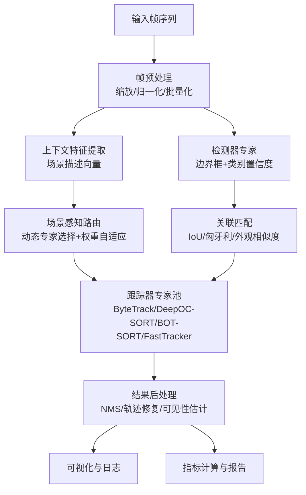
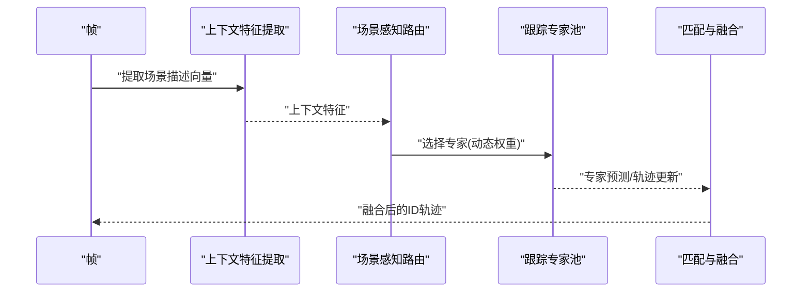
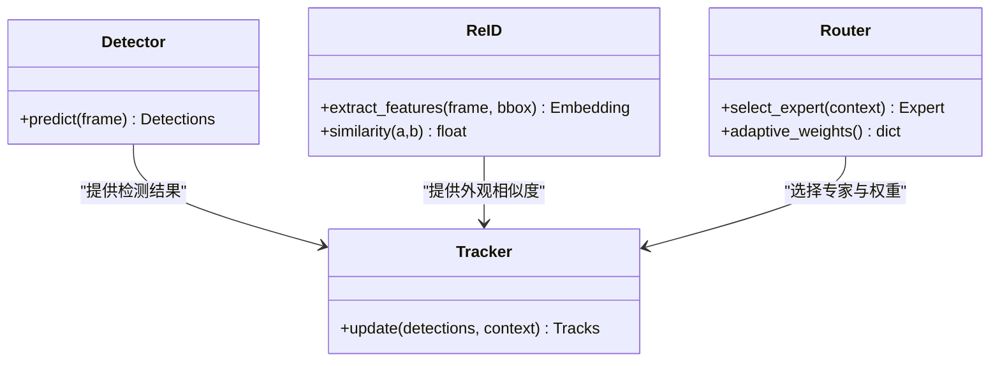
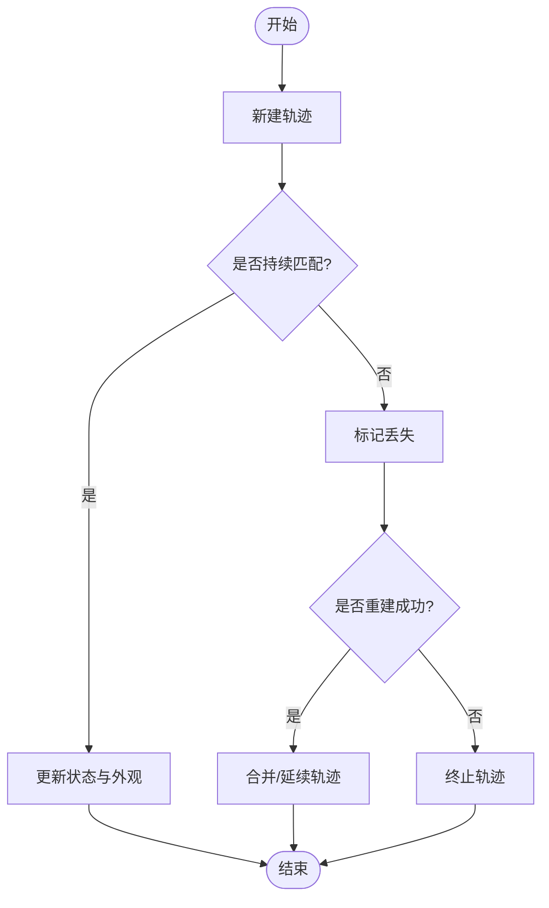
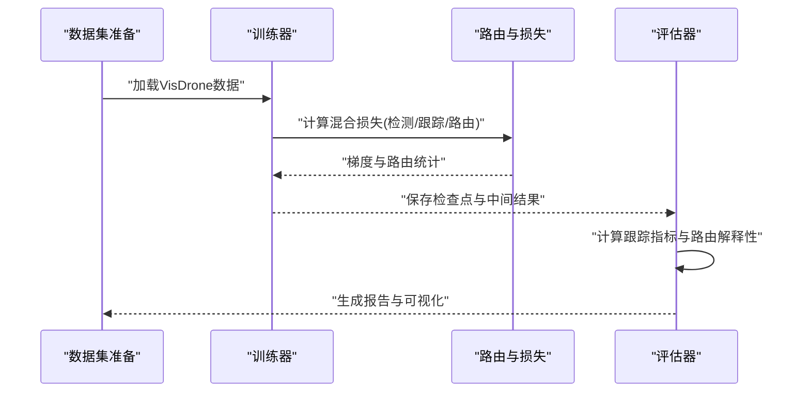
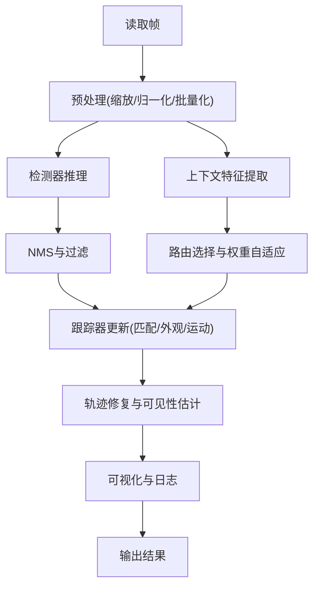
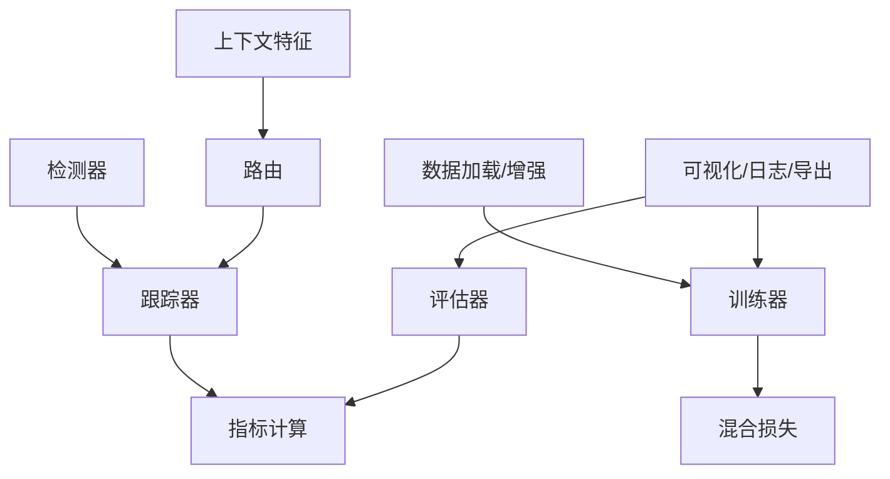

# 多目标跟踪混合架构示例

<cite>
**本文引用的文件**
- [mot-hybrid-architecture.md](file://docs/plans/mot-hybrid-architecture.md)
- [2026-07-17-mot-scene-aware-router.md](file://docs/plans/2026-07-17-mot-scene-aware-router.md)
- [routing-interpreter-toolkit.md](file://docs/plans/routing-interpreter-toolkit.md)
- [mixture-preservation-manifest.yaml](file://docs/governance/mixture-preservation-manifest.yaml)
- [performance-gates.md](file://docs/governance/performance-gates.md)
- [benchmark_mmot_dispatch.py](file://benchmarks/benchmark_mot_dispatch.py)
- [suite.py](file://benchmarks/suite.py)
- [run.py](file://benchmarks/run.py)
- [test_mot_scene_aware_router.py](file://tests/test_mot_scene_aware_router.py)
- [test_mot_routing_diagnostics.py](file://tests/test_mot_routing_diagnostics.py)
- [analyze_mot_routing.py](file://scripts/analyze_mot_routing.py)
- [diagnose_mot_routing.py](file://scripts/diagnose_mot_routing.py)
- [prepare_mot_routing_scenes.py](file://scripts/prepare_mot_routing_scenes.py)
- [download_visdrone_dataset.sh](file://scripts/download_visdrone_dataset.sh)
- [reproduce_visdrone.py](file://scripts/reproduce_visdrone.py)
- [compare_mot_ablation.py](file://scripts/compare_mot_ablation.py)
- [mot_integration_experiment_report_2026-06-25.md](file://docs/mot_integration_experiment_report_2026-06-25.md)
- [yolo_master_mot_moa_visdrone_report_20260702.md](file://reports/yolo_master_mot_moa_visdrone_report_20260702.md)
- [technical_summary.md](file://examples/mot_hybrid_architecture/technical_summary.md)
- [plot_mot_results.py](file://examples/mot_hybrid_architecture/plot_mot_results.py)
- [run_visdrone_mot_ablation.sh](file://examples/mot_hybrid_architecture/run_visdrone_mot_ablation.sh)
- [README.md](file://examples/mot_hybrid_architecture/README.md)
- [track.py](file://ultralytics/trackers/track.py)
- [basetrack.py](file://ultralytics/trackers/basetrack.py)
- [byte_tracker.py](file://ultralytics/trackers/byte_tracker.py)
- [deep_oc_sort.py](file://ultralytics/trackers/deep_oc_sort.py)
- [oc_sort.py](file://ultralytics/trackers/oc_sort.py)
- [bot_sort.py](file://ultralytics/trackers/bot_sort.py)
- [fast_tracker.py](file://ultralytics/trackers/fast_tracker.py)
- [track_tracker.py](file://ultralytics/trackers/track_tracker.py)
- [__init__.py](file://ultralytics/trackers/__init__.py)
- [metrics.py](file://ultralytics/utils/metrics.py)
- [predictor.py](file://ultralytics/engine/predictor.py)
- [results.py](file://ultralytics/engine/results.py)
- [trainer.py](file://ultralytics/engine/trainer.py)
- [validator.py](file://ultralytics/engine/validator.py)
- [exporter.py](file://ultralytics/engine/exporter.py)
- [autobackend.py](file://ultralytics/nn/autobackend.py)
- [mixture_loss.py](file://ultralytics/nn/mixture_loss.py)
- [mixture_registry.py](file://ultralytics/nn/mixture_registry.py)
- [tasks.py](file://ultralytics/nn/tasks.py)
- [utils.py](file://ultralytics/data/utils.py)
- [build.py](file://ultralytics/data/build.py)
- [dataset.py](file://ultralytics/data/dataset.py)
- [loaders.py](file://ultralytics/data/loaders.py)
- [augment.py](file://ultralytics/data/augment.py)
- [callbacks](file://ultralytics/utils/callbacks/)
- [plotting.py](file://ultralytics/utils/plotting.py)
- [events.py](file://ultralytics/utils/events.py)
- [logger.py](file://ultralytics/utils/logger.py)
- [nms.py](file://ultralytics/utils/nms.py)
- [ops.py](file://ultralytics/utils/ops.py)
- [torch_utils.py](file://ultralytics/utils/torch_utils.py)
- [tuner.py](file://ultralytics/utils/tuner.py)
- [export_capabilities.py](file://ultralytics/utils/export_capabilities.py)
- [export_preflight.py](file://ultralytics/utils/export_preflight.py)
- [export_validation.py](file://ultralytics/utils/export_validation.py)
</cite>

## 目录
1. [简介](#简介)
2. [项目结构](#项目结构)
3. [核心组件](#核心组件)
4. [架构总览](#架构总览)
5. [详细组件分析](#详细组件分析)
6. [依赖关系分析](#依赖关系分析)
7. [性能考量](#性能考量)
8. [故障排查指南](#故障排查指南)
9. [结论](#结论)
10. [附录](#附录)

## 简介
本文件面向希望构建“检测器与跟踪器解耦、ID重识别增强、场景感知路由”的多目标跟踪（MoT）混合架构的工程师与研究者。文档从设计理念出发，系统讲解动态专家选择、上下文特征提取与自适应路由权重等关键机制；随后给出完整的训练与评估流程（含VisDrone数据集使用、评价指标计算与对比分析），并展示实时视频处理管道（帧预处理、批量推理、结果后处理）。最后提供精度优化、ID切换抑制、遮挡处理等实用技巧，以及可视化与调试工具链的使用说明。

## 项目结构
仓库围绕YOLO生态扩展了MoA/MoE/MoT能力，并在示例、基准、测试与脚本中提供了端到端的工作流。与MoT混合架构直接相关的目录与文件包括：
- 设计规划与治理：plans与governance下的MoT与路由相关文档
- 基准与评测：benchmarks下针对MoT路由与调度的基准套件
- 测试：tests下对场景感知路由与诊断的单元测试
- 脚本：scripts下数据准备、复现、消融与诊断脚本
- 示例：examples/mot_hybrid_architecture下可运行的示例与报告
- 核心实现：ultralytics下tracker、engine、nn、data、utils等模块

```mermaid
graph TB
subgraph "设计与治理"
P1["plans/mot-hybrid-architecture.md"]
P2["plans/2026-07-17-mot-scene-aware-router.md"]
P3["plans/routing-interpreter-toolkit.md"]
G1["governance/mixture-preservation-manifest.yaml"]
G2["governance/performance-gates.md"]
end
subgraph "基准与评测"
B1["benchmarks/benchmark_mot_dispatch.py"]
B2["benchmarks/suite.py"]
B3["benchmarks/run.py"]
end
subgraph "测试"
T1["tests/test_mot_scene_aware_router.py"]
T2["tests/test_mot_routing_diagnostics.py"]
end
subgraph "脚本"
S1["scripts/analyze_mot_routing.py"]
S2["scripts/diagnose_mot_routing.py"]
S3["scripts/prepare_mot_routing_scenes.py"]
S4["scripts/download_visdrone_dataset.sh"]
S5["scripts/reproduce_visdrone.py"]
S6["scripts/compare_mot_ablation.py"]
end
subgraph "示例"
E1["examples/mot_hybrid_architecture/README.md"]
E2["examples/mot_hybrid_architecture/technical_summary.md"]
E3["examples/mot_hybrid_architecture/plot_mot_results.py"]
E4["examples/mot_hybrid_architecture/run_visdrone_mot_ablation.sh"]
end
subgraph "核心实现"
C1["ultralytics/trackers/*"]
C2["ultralytics/engine/*"]
C3["ultralytics/nn/*"]
C4["ultralytics/data/*"]
C5["ultralytics/utils/*"]
end
P1 --> C1
P2 --> C1
P3 --> C1
G1 --> C3
G2 --> C2
B1 --> C1
B2 --> C1
B3 --> C1
T1 --> C1
T2 --> C1
S1 --> C1
S2 --> C1
S3 --> C1
S4 --> C4
S5 --> C4
S6 --> C2
E1 --> C1
E2 --> C1
E3 --> C2
E4 --> C2
```

图表来源
- [mot-hybrid-architecture.md:1-200](file://docs/plans/mot-hybrid-architecture.md#L1-L200)
- [2026-07-17-mot-scene-aware-router.md:1-200](file://docs/plans/2026-07-17-mot-scene-aware-router.md#L1-L200)
- [routing-interpreter-toolkit.md:1-200](file://docs/plans/routing-interpreter-toolkit.md#L1-L200)
- [mixture-preservation-manifest.yaml:1-200](file://docs/governance/mixture-preservation-manifest.yaml#L1-L200)
- [performance-gates.md:1-200](file://docs/governance/performance-gates.md#L1-L200)
- [benchmark_mmot_dispatch.py:1-200](file://benchmarks/benchmark_mot_dispatch.py#L1-L200)
- [suite.py:1-200](file://benchmarks/suite.py#L1-L200)
- [run.py:1-200](file://benchmarks/run.py#L1-L200)
- [test_mot_scene_aware_router.py:1-200](file://tests/test_mot_scene_aware_router.py#L1-L200)
- [test_mot_routing_diagnostics.py:1-200](file://tests/test_mot_routing_diagnostics.py#L1-L200)
- [analyze_mot_routing.py:1-200](file://scripts/analyze_mot_routing.py#L1-L200)
- [diagnose_mot_routing.py:1-200](file://scripts/diagnose_mot_routing.py#L1-L200)
- [prepare_mot_routing_scenes.py:1-200](file://scripts/prepare_mot_routing_scenes.py#L1-L200)
- [download_visdrone_dataset.sh:1-200](file://scripts/download_visdrone_dataset.sh#L1-L200)
- [reproduce_visdrone.py:1-200](file://scripts/reproduce_visdrone.py#L1-L200)
- [compare_mot_ablation.py:1-200](file://scripts/compare_mot_ablation.py#L1-L200)
- [technical_summary.md:1-200](file://examples/mot_hybrid_architecture/technical_summary.md#L1-L200)
- [plot_mot_results.py:1-200](file://examples/mot_hybrid_architecture/plot_mot_results.py#L1-L200)
- [run_visdrone_mot_ablation.sh:1-200](file://examples/mot_hybrid_architecture/run_visdrone_mot_ablation.sh#L1-L200)
- [README.md:1-200](file://examples/mot_hybrid_architecture/README.md#L1-L200)

章节来源
- [mot-hybrid-architecture.md:1-200](file://docs/plans/mot-hybrid-architecture.md#L1-L200)
- [2026-07-17-mot-scene-aware-router.md:1-200](file://docs/plans/2026-07-17-mot-scene-aware-router.md#L1-L200)
- [routing-interpreter-toolkit.md:1-200](file://docs/plans/routing-interpreter-toolkit.md#L1-L200)
- [mixture-preservation-manifest.yaml:1-200](file://docs/governance/mixture-preservation-manifest.yaml#L1-L200)
- [performance-gates.md:1-200](file://docs/governance/performance-gates.md#L1-L200)
- [benchmark_mmot_dispatch.py:1-200](file://benchmarks/benchmark_mot_dispatch.py#L1-L200)
- [suite.py:1-200](file://benchmarks/suite.py#L1-L200)
- [run.py:1-200](file://benchmarks/run.py#1-L200)
- [test_mot_scene_aware_router.py:1-200](file://tests/test_mot_scene_aware_router.py#L1-L200)
- [test_mot_routing_diagnostics.py:1-200](file://tests/test_mot_routing_diagnostics.py#L1-L200)
- [analyze_mot_routing.py:1-200](file://scripts/analyze_mot_routing.py#L1-L200)
- [diagnose_mot_routing.py:1-200](file://scripts/diagnose_mot_routing.py#L1-L200)
- [prepare_mot_routing_scenes.py:1-200](file://scripts/prepare_mot_routing_scenes.py#L1-L200)
- [download_visdrone_dataset.sh:1-200](file://scripts/download_visdrone_dataset.sh#L1-L200)
- [reproduce_visdrone.py:1-200](file://scripts/reproduce_visdrone.py#L1-L200)
- [compare_mot_ablation.py:1-200](file://scripts/compare_mot_ablation.py#L1-L200)
- [technical_summary.md:1-200](file://examples/mot_hybrid_architecture/technical_summary.md#L1-L200)
- [plot_mot_results.py:1-200](file://examples/mot_hybrid_architecture/plot_mot_results.py#L1-L200)
- [run_visdrone_mot_ablation.sh:1-200](file://examples/mot_hybrid_architecture/run_visdrone_mot_ablation.sh#L1-L200)
- [README.md:1-200](file://examples/mot_hybrid_architecture/README.md#L1-L200)

## 核心组件
- 检测器与跟踪器解耦：通过统一接口将检测结果与轨迹状态分离，便于独立替换与组合不同专家模型。
- ID重识别增强：在匹配阶段引入外观特征相似度，降低长时遮挡与密集场景中的ID切换。
- 轨迹管理策略：维护轨迹生命周期、可见性估计、丢失恢复与跨帧一致性校验。
- 场景感知路由：基于场景上下文特征动态选择专家（如运动主导、外观主导、遮挡鲁棒等），并自适应调整路由权重。
- 训练与评估：支持多任务损失组合、路由辅助损失、校准与门控约束，并提供标准指标与对比基线。
- 实时管道：帧预处理、批量推理、结果后处理、可视化与日志记录一体化。

章节来源
- [mot-hybrid-architecture.md:1-200](file://docs/plans/mot-hybrid-architecture.md#L1-L200)
- [2026-07-17-mot-scene-aware-router.md:1-200](file://docs/plans/2026-07-17-mot-scene-aware-router.md#L1-L200)
- [routing-interpreter-toolkit.md:1-200](file://docs/plans/routing-interpreter-toolkit.md#L1-L200)
- [mixture-preservation-manifest.yaml:1-200](file://docs/governance/mixture-preservation-manifest.yaml#L1-L200)
- [performance-gates.md:1-200](file://docs/governance/performance-gates.md#L1-L200)

## 架构总览
下图展示了MoT混合架构的系统级交互：输入帧经预处理后进入检测器，得到边界框与类别；同时提取上下文特征用于场景感知路由，动态选择跟踪专家；跟踪器结合运动模型与外观相似度完成ID分配与轨迹更新；最终输出带ID的检测结果与可视化。

图表来源
- [2026-07-17-mot-scene-aware-router.md:1-200](file://docs/plans/2026-07-17-mot-scene-aware-router.md#L1-L200)
- [test_mot_scene_aware_router.py:1-200](file://tests/test_mot_scene_aware_router.py#L1-L200)
- [track.py:1-200](file://ultralytics/trackers/track.py#L1-L200)
- [byte_tracker.py:1-200](file://ultralytics/trackers/byte_tracker.py#L1-L200)
- [deep_oc_sort.py:1-200](file://ultralytics/trackers/deep_oc_sort.py#L1-L200)
- [oc_sort.py:1-200](file://ultralytics/trackers/oc_sort.py#L1-L200)
- [bot_sort.py:1-200](file://ultralytics/trackers/bot_sort.py#L1-L200)
- [fast_tracker.py:1-200](file://ultralytics/trackers/fast_tracker.py#L1-L200)
- [predictor.py:1-200](file://ultralytics/engine/predictor.py#L1-L200)
- [results.py:1-200](file://ultralytics/engine/results.py#L1-L200)
- [metrics.py:1-200](file://ultralytics/utils/metrics.py#L1-L200)

## 详细组件分析

### 场景感知路由与动态专家选择
- 设计要点
  - 上下文特征：从当前帧或局部时序窗口提取场景描述向量，表征光照、密度、遮挡程度、运动强度等。
  - 动态选择：根据上下文特征与历史路由统计，选择最合适的跟踪专家（例如高遮挡用DeepOC-SORT，低遮挡且高速用ByteTrack）。
  - 自适应权重：在融合阶段按场景置信度加权各专家输出，避免单一专家在复杂场景失效。
- 实现路径
  - 路由逻辑与诊断：参见测试与脚本中对路由行为与解释性的验证与分析。
  - 基准调度：在基准套件中评估不同路由策略的性能与开销。

图表来源
- [2026-07-17-mot-scene-aware-router.md:1-200](file://docs/plans/2026-07-17-mot-scene-aware-router.md#L1-L200)
- [test_mot_scene_aware_router.py:1-200](file://tests/test_mot_scene_aware_router.py#L1-L200)
- [benchmark_mmot_dispatch.py:1-200](file://benchmarks/benchmark_mot_dispatch.py#L1-L200)
- [suite.py:1-200](file://benchmarks/suite.py#L1-L200)
- [run.py:1-200](file://benchmarks/run.py#L1-L200)

章节来源
- [2026-07-17-mot-scene-aware-router.md:1-200](file://docs/plans/2026-07-17-mot-scene-aware-router.md#L1-L200)
- [test_mot_scene_aware_router.py:1-200](file://tests/test_mot_scene_aware_router.py#L1-L200)
- [benchmark_mmot_dispatch.py:1-200](file://benchmarks/benchmark_mot_dispatch.py#L1-L200)
- [suite.py:1-200](file://benchmarks/suite.py#L1-L200)
- [run.py:1-200](file://benchmarks/run.py#L1-L200)

### 检测器与跟踪器解耦与ID重识别增强
- 解耦接口
  - 检测器输出标准化为边界框、类别与置信度；跟踪器以这些结果为输入进行ID分配与轨迹更新。
  - 通过统一的数据结构与回调机制，允许替换不同的检测器与跟踪器而不影响整体流程。
- ID重识别
  - 在匹配阶段引入外观相似度（Re-ID），结合运动先验（速度/加速度）提升长时遮挡与密集场景的稳定性。
  - 通过路由权重控制外观与运动的相对贡献，适应不同场景。

图表来源
- [track.py:1-200](file://ultralytics/trackers/track.py#L1-L200)
- [basetrack.py:1-200](file://ultralytics/trackers/basetrack.py#L1-L200)
- [byte_tracker.py:1-200](file://ultralytics/trackers/byte_tracker.py#L1-L200)
- [deep_oc_sort.py:1-200](file://ultralytics/trackers/deep_oc_sort.py#L1-L200)
- [oc_sort.py:1-200](file://ultralytics/trackers/oc_sort.py#L1-L200)
- [bot_sort.py:1-200](file://ultralytics/trackers/bot_sort.py#L1-L200)
- [fast_tracker.py:1-200](file://ultralytics/trackers/fast_tracker.py#L1-L200)
- [predictor.py:1-200](file://ultralytics/engine/predictor.py#L1-L200)
- [results.py:1-200](file://ultralytics/engine/results.py#L1-L200)

章节来源
- [track.py:1-200](file://ultralytics/trackers/track.py#L1-L200)
- [basetrack.py:1-200](file://ultralytics/trackers/basetrack.py#L1-L200)
- [byte_tracker.py:1-200](file://ultralytics/trackers/byte_tracker.py#L1-L200)
- [deep_oc_sort.py:1-200](file://ultralytics/trackers/deep_oc_sort.py#L1-L200)
- [oc_sort.py:1-200](file://ultralytics/trackers/oc_sort.py#L1-L200)
- [bot_sort.py:1-200](file://ultralytics/trackers/bot_sort.py#L1-L200)
- [fast_tracker.py:1-200](file://ultralytics/trackers/fast_tracker.py#L1-L200)
- [predictor.py:1-200](file://ultralytics/engine/predictor.py#L1-L200)
- [results.py:1-200](file://ultralytics/engine/results.py#L1-L200)

### 轨迹管理与生命周期
- 轨迹状态：新建、活跃、丢失、重建、终止。
- 可见性估计：基于连续未匹配帧数、遮挡比例与外观一致性判断。
- 丢失恢复：当目标重新出现时，利用Re-ID与运动先验进行跨帧关联。
- 一致性校验：跨帧平滑、异常值剔除与轨迹分段合并。

图表来源
- [basetrack.py:1-200](file://ultralytics/trackers/basetrack.py#L1-L200)
- [track.py:1-200](file://ultralytics/trackers/track.py#L1-L200)
- [deep_oc_sort.py:1-200](file://ultralytics/trackers/deep_oc_sort.py#L1-L200)
- [oc_sort.py:1-200](file://ultralytics/trackers/oc_sort.py#L1-L200)
- [bot_sort.py:1-200](file://ultralytics/trackers/bot_sort.py#L1-L200)
- [fast_tracker.py:1-200](file://ultralytics/trackers/fast_tracker.py#L1-L200)

章节来源
- [basetrack.py:1-200](file://ultralytics/trackers/basetrack.py#L1-L200)
- [track.py:1-200](file://ultralytics/trackers/track.py#L1-L200)
- [deep_oc_sort.py:1-200](file://ultralytics/trackers/deep_oc_sort.py#L1-L200)
- [oc_sort.py:1-200](file://ultralytics/trackers/oc_sort.py#L1-L200)
- [bot_sort.py:1-200](file://ultralytics/trackers/bot_sort.py#L1-L200)
- [fast_tracker.py:1-200](file://ultralytics/trackers/fast_tracker.py#L1-L200)

### 训练与评估流程（含VisDrone）
- 数据准备
  - 使用脚本下载与准备VisDrone数据集，确保标签格式与路径正确。
- 训练配置
  - 启用混合损失（检测+跟踪+路由辅助），设置路由正则与门控约束，保证专家负载均衡与数值稳定。
- 评估指标
  - 采用标准跟踪指标（如MOTA、IDF1、MT/ML/Frag等），并结合路由解释性指标（专家使用分布、权重方差）。
- 对比分析
  - 通过消融实验比较不同路由策略、专家组合与Re-ID权重的影响。

图表来源
- [download_visdrone_dataset.sh:1-200](file://scripts/download_visdrone_dataset.sh#L1-L200)
- [reproduce_visdrone.py:1-200](file://scripts/reproduce_visdrone.py#L1-L200)
- [compare_mot_ablation.py:1-200](file://scripts/compare_mot_ablation.py#L1-L200)
- [trainer.py:1-200](file://ultralytics/engine/trainer.py#L1-L200)
- [validator.py:1-200](file://ultralytics/engine/validator.py#L1-L200)
- [mixture_loss.py:1-200](file://ultralytics/nn/mixture_loss.py#L1-L200)
- [mixture_registry.py:1-200](file://ultralytics/nn/mixture_registry.py#L1-L200)
- [metrics.py:1-200](file://ultralytics/utils/metrics.py#L1-L200)

章节来源
- [download_visdrone_dataset.sh:1-200](file://scripts/download_visdrone_dataset.sh#L1-L200)
- [reproduce_visdrone.py:1-200](file://scripts/reproduce_visdrone.py#L1-L200)
- [compare_mot_ablation.py:1-200](file://scripts/compare_mot_ablation.py#L1-L200)
- [trainer.py:1-200](file://ultralytics/engine/trainer.py#L1-L200)
- [validator.py:1-200](file://ultralytics/engine/validator.py#L1-L200)
- [mixture_loss.py:1-200](file://ultralytics/nn/mixture_loss.py#L1-L200)
- [mixture_registry.py:1-200](file://ultralytics/nn/mixture_registry.py#L1-L200)
- [metrics.py:1-200](file://ultralytics/utils/metrics.py#L1-L200)

### 实时视频处理管道
- 帧预处理：缩放、归一化、批量化，适配GPU/边缘设备。
- 批量推理：检测器与上下文特征并行执行，减少延迟。
- 结果后处理：NMS、轨迹修复、可见性估计、可视化与日志。
- 资源管理：自动后端选择、导出能力检查与预检。

图表来源
- [predictor.py:1-200](file://ultralytics/engine/predictor.py#L1-L200)
- [results.py:1-200](file://ultralytics/engine/results.py#L1-L200)
- [autobackend.py:1-200](file://ultralytics/nn/autobackend.py#L1-L200)
- [export_capabilities.py:1-200](file://ultralytics/utils/export_capabilities.py#L1-L200)
- [export_preflight.py:1-200](file://ultralytics/utils/export_preflight.py#L1-L200)
- [export_validation.py:1-200](file://ultralytics/utils/export_validation.py#L1-L200)
- [plotting.py:1-200](file://ultralytics/utils/plotting.py#L1-L200)
- [events.py:1-200](file://ultralytics/utils/events.py#L1-L200)
- [logger.py:1-200](file://ultralytics/utils/logger.py#L1-L200)

章节来源
- [predictor.py:1-200](file://ultralytics/engine/predictor.py#L1-L200)
- [results.py:1-200](file://ultralytics/engine/results.py#L1-L200)
- [autobackend.py:1-200](file://ultralytics/nn/autobackend.py#L1-L200)
- [export_capabilities.py:1-200](file://ultralytics/utils/export_capabilities.py#L1-L200)
- [export_preflight.py:1-200](file://ultralytics/utils/export_preflight.py#L1-L200)
- [export_validation.py:1-200](file://ultralytics/utils/export_validation.py#L1-L200)
- [plotting.py:1-200](file://ultralytics/utils/plotting.py#L1-L200)
- [events.py:1-200](file://ultralytics/utils/events.py#L1-L200)
- [logger.py:1-200](file://ultralytics/utils/logger.py#L1-L200)

## 依赖关系分析
- 模块耦合
  - 路由与跟踪器强耦合于上下文特征与匹配逻辑；检测器与跟踪器通过统一数据结构解耦。
  - 训练器与评估器依赖混合损失与路由辅助损失，确保路由可学习与稳定。
- 外部依赖
  - 数据加载与增强依赖data模块；可视化与事件日志依赖utils模块；导出与后端依赖nn与utils。
- 潜在循环依赖
  - 通过分层与接口抽象避免循环；路由与跟踪器之间仅通过函数调用与数据结构交互。

图表来源
- [mixture_loss.py:1-200](file://ultralytics/nn/mixture_loss.py#L1-L200)
- [mixture_registry.py:1-200](file://ultralytics/nn/mixture_registry.py#L1-L200)
- [metrics.py:1-200](file://ultralytics/utils/metrics.py#L1-L200)
- [predictor.py:1-200](file://ultralytics/engine/predictor.py#L1-L200)
- [trainer.py:1-200](file://ultralytics/engine/trainer.py#L1-L200)
- [validator.py:1-200](file://ultralytics/engine/validator.py#L1-L200)
- [build.py:1-200](file://ultralytics/data/build.py#L1-L200)
- [dataset.py:1-200](file://ultralytics/data/dataset.py#L1-L200)
- [loaders.py:1-200](file://ultralytics/data/loaders.py#L1-L200)
- [augment.py:1-200](file://ultralytics/data/augment.py#L1-L200)
- [plotting.py:1-200](file://ultralytics/utils/plotting.py#L1-L200)
- [events.py:1-200](file://ultralytics/utils/events.py#L1-L200)
- [logger.py:1-200](file://ultralytics/utils/logger.py#L1-L200)

章节来源
- [mixture_loss.py:1-200](file://ultralytics/nn/mixture_loss.py#L1-L200)
- [mixture_registry.py:1-200](file://ultralytics/nn/mixture_registry.py#L1-L200)
- [metrics.py:1-200](file://ultralytics/utils/metrics.py#L1-L200)
- [predictor.py:1-200](file://ultralytics/engine/predictor.py#L1-L200)
- [trainer.py:1-200](file://ultralytics/engine/trainer.py#L1-L200)
- [validator.py:1-200](file://ultralytics/engine/validator.py#L1-L200)
- [build.py:1-200](file://ultralytics/data/build.py#L1-L200)
- [dataset.py:1-200](file://ultralytics/data/dataset.py#L1-L200)
- [loaders.py:1-200](file://ultralytics/data/loaders.py#L1-L200)
- [augment.py:1-200](file://ultralytics/data/augment.py#L1-L200)
- [plotting.py:1-200](file://ultralytics/utils/plotting.py#L1-L200)
- [events.py:1-200](file://ultralytics/utils/events.py#L1-L200)
- [logger.py:1-200](file://ultralytics/utils/logger.py#L1-L200)

## 性能考量
- 路由开销：上下文特征提取与路由决策应轻量，避免成为瓶颈。
- 专家选择：在高密度与遮挡场景中优先选择鲁棒专家，在简单场景选择高效专家。
- 批处理与流水线：最大化GPU利用率，减少内存拷贝与同步。
- 导出与部署：使用导出能力矩阵与预检工具，确保在不同后端上的性能与兼容性。

[本节为通用指导，不直接分析具体文件]

## 故障排查指南
- 路由不稳定
  - 使用路由解释性工具与诊断脚本分析专家使用分布与权重方差，定位异常场景。
- 指标异常
  - 检查数据加载与标签格式，确认评估指标计算路径与阈值设置。
- 可视化问题
  - 检查绘图与事件日志模块，确认输出路径与格式。
- 导出失败
  - 使用导出预检与验证工具，检查后端兼容性与能力矩阵。

章节来源
- [routing-interpreter-toolkit.md:1-200](file://docs/plans/routing-interpreter-toolkit.md#L1-L200)
- [analyze_mot_routing.py:1-200](file://scripts/analyze_mot_routing.py#L1-L200)
- [diagnose_mot_routing.py:1-200](file://scripts/diagnose_mot_routing.py#L1-L200)
- [metrics.py:1-200](file://ultralytics/utils/metrics.py#L1-L200)
- [plotting.py:1-200](file://ultralytics/utils/plotting.py#L1-L200)
- [events.py:1-200](file://ultralytics/utils/events.py#L1-L200)
- [logger.py:1-200](file://ultralytics/utils/logger.py#L1-L200)
- [export_capabilities.py:1-200](file://ultralytics/utils/export_capabilities.py#L1-L200)
- [export_preflight.py:1-200](file://ultralytics/utils/export_preflight.py#L1-L200)
- [export_validation.py:1-200](file://ultralytics/utils/export_validation.py#L1-L200)

## 结论
本示例文档系统化阐述了MoT混合架构的设计理念与实现路径，涵盖场景感知路由、ID重识别增强、轨迹管理、训练与评估、实时管道与调试工具链。通过基准套件与测试用例，可快速验证与优化路由策略与专家组合，获得更稳健的跟踪性能与更好的可解释性。

[本节为总结，不直接分析具体文件]

## 附录
- 示例运行
  - 参考示例目录的README与技术摘要，了解如何运行消融实验与绘制结果图。
- 报告与基准
  - 集成实验报告与基准套件可用于对比不同配置与专家组合的效果。

章节来源
- [README.md:1-200](file://examples/mot_hybrid_architecture/README.md#L1-L200)
- [technical_summary.md:1-200](file://examples/mot_hybrid_architecture/technical_summary.md#L1-L200)
- [plot_mot_results.py:1-200](file://examples/mot_hybrid_architecture/plot_mot_results.py#L1-L200)
- [run_visdrone_mot_ablation.sh:1-200](file://examples/mot_hybrid_architecture/run_visdrone_mot_ablation.sh#L1-L200)
- [mot_integration_experiment_report_2026-06-25.md:1-200](file://docs/mot_integration_experiment_report_2026-06-25.md#L1-L200)
- [yolo_master_mot_moa_visdrone_report_20260702.md:1-200](file://reports/yolo_master_mot_moa_visdrone_report_20260702.md#L1-L200)