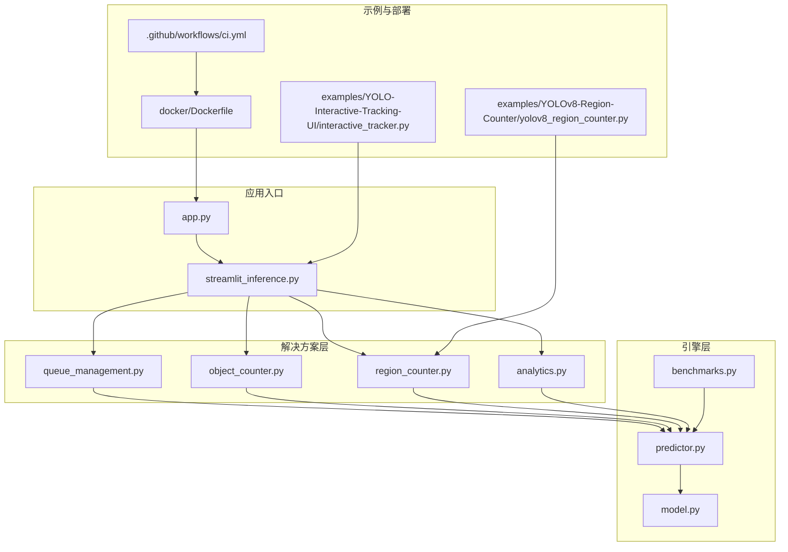
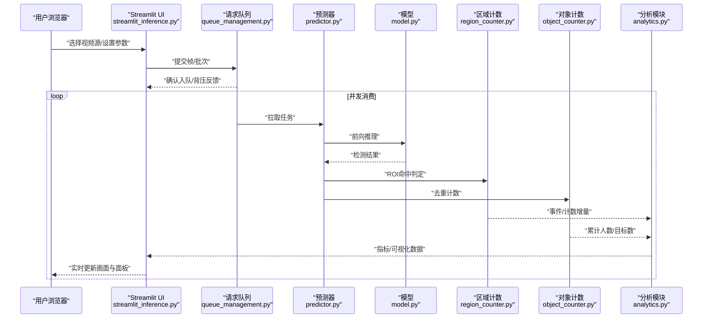
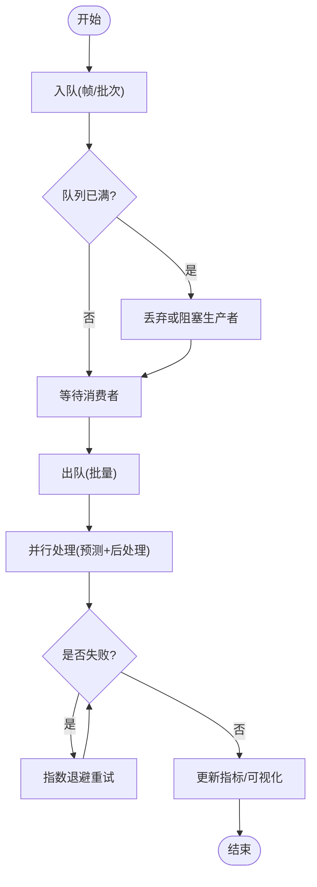
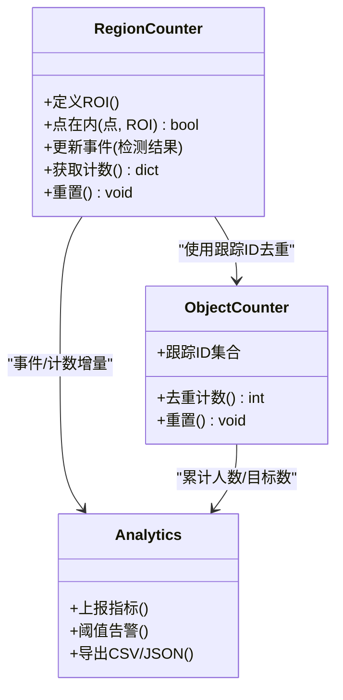
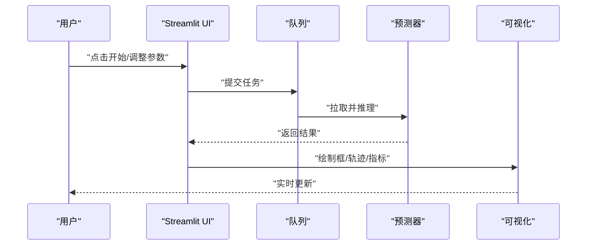
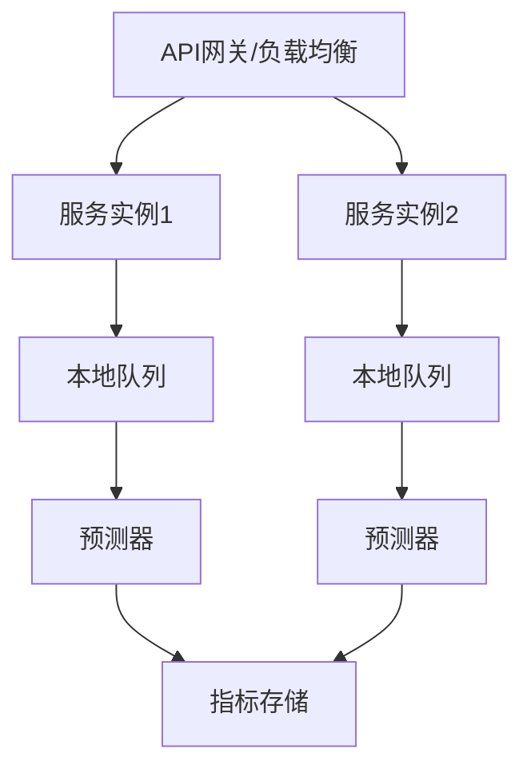
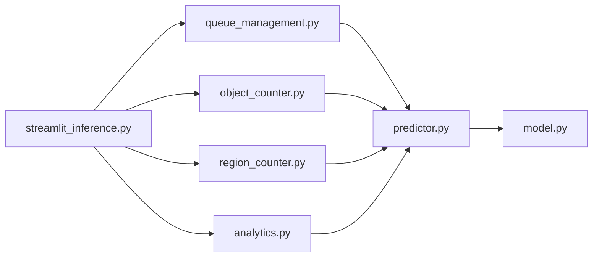

# 工业级应用场景

<cite>
**本文引用的文件**
- [README.md](file://README.md)
- [app.py](file://app.py)
- [ultralytics/solutions/__init__.py](file://ultralytics/solutions/__init__.py)
- [ultralytics/solutions/queue_management.py](file://ultralytics/solutions/queue_management.py)
- [ultralytics/solutions/object_counter.py](file://ultralytics/solutions/object_counter.py)
- [ultralytics/solutions/region_counter.py](file://ultralytics/solutions/region_counter.py)
- [ultralytics/solutions/analytics.py](file://ultralytics/solutions/analytics.py)
- [ultralytics/solutions/streamlit_inference.py](file://ultralytics/solutions/streamlit_inference.py)
- [ultralytics/engine/predictor.py](file://ultralytics/engine/predictor.py)
- [ultralytics/engine/model.py](file://ultralytics/engine/model.py)
- [ultralytics/utils/benchmarks.py](file://ultralytics/utils/benchmarks.py)
- [examples/YOLOv8-Region-Counter/yolov8_region_counter.py](file://examples/YOLOv8-Region-Counter/yolov8_region_counter.py)
- [examples/YOLO-Interactive-Tracking-UI/interactive_tracker.py](file://examples/YOLO-Interactive-Tracking-UI/interactive_tracker.py)
- [docker/Dockerfile](file://docker/Dockerfile)
- [.github/workflows/ci.yml](file://.github/workflows/ci.yml)
</cite>

## 目录
1. [引言](#引言)
2. [项目结构](#项目结构)
3. [核心组件](#核心组件)
4. [架构总览](#架构总览)
5. [详细组件分析](#详细组件分析)
6. [依赖关系分析](#依赖关系分析)
7. [性能考量](#性能考量)
8. [故障排查指南](#故障排查指南)
9. [结论](#结论)
10. [附录](#附录)

## 引言
本文件面向工业级实时视频处理与批量推理服务场景，结合仓库中的解决方案模块、引擎预测器、示例脚本与部署工件，提供从多路并发、内存与GPU资源优化，到请求队列管理、负载均衡、错误重试，再到交互式追踪UI、区域计数、人员统计、行为分析以及高并发与分布式部署、监控告警、性能调优与DevOps实践的系统化指导。文档以“渐进式复杂度”组织，既适合初学者快速上手，也便于资深工程师进行深度定制与扩展。

## 项目结构
本项目围绕“模型推理引擎 + 业务解决方案 + 示例与部署”的三层组织方式构建：
- 引擎层：负责模型加载、设备选择、批处理与结果解析（如 predictor、model）。
- 解决方案层：封装常见业务逻辑（对象计数、区域计数、流式推理、队列管理等），可组合复用。
- 示例与部署：提供端到端示例（区域计数、交互追踪）、容器镜像与CI流水线等工程化能力。

图表来源
- [app.py:1-200](file://app.py#L1-L200)
- [ultralytics/solutions/streamlit_inference.py:1-200](file://ultralytics/solutions/streamlit_inference.py#L1-L200)
- [ultralytics/solutions/queue_management.py:1-200](file://ultralytics/solutions/queue_management.py#L1-L200)
- [ultralytics/solutions/object_counter.py:1-200](file://ultralytics/solutions/object_counter.py#L1-L200)
- [ultralytics/solutions/region_counter.py:1-200](file://ultralytics/solutions/region_counter.py#L1-L200)
- [ultralytics/solutions/analytics.py:1-200](file://ultralytics/solutions/analytics.py#L1-L200)
- [ultralytics/engine/predictor.py:1-200](file://ultralytics/engine/predictor.py#L1-L200)
- [ultralytics/engine/model.py:1-200](file://ultralytics/engine/model.py#L1-L200)
- [ultralytics/utils/benchmarks.py:1-200](file://ultralytics/utils/benchmarks.py#L1-L200)
- [examples/YOLOv8-Region-Counter/yolov8_region_counter.py:1-200](file://examples/YOLOv8-Region-Counter/yolov8_region_counter.py#L1-L200)
- [examples/YOLO-Interactive-Tracking-UI/interactive_tracker.py:1-200](file://examples/YOLO-Interactive-Tracking-UI/interactive_tracker.py#L1-L200)
- [docker/Dockerfile:1-200](file://docker/Dockerfile#L1-L200)
- [.github/workflows/ci.yml:1-200](file://.github/workflows/ci.yml#L1-L200)

章节来源
- [README.md:1-200](file://README.md#L1-L200)

## 核心组件
- 预测器与模型
  - 负责模型加载、设备分配、预处理/后处理、NMS、可视化与结果聚合。
  - 支持动态批大小、异步执行与缓存策略，提升吞吐并降低延迟。
- 解决方案模块
  - 队列管理：缓冲入站帧/请求，削峰填谷，控制并发度与背压。
  - 对象计数：基于跟踪ID的去重计数，跨帧稳定统计。
  - 区域计数：ROI多边形/矩形判定，进出事件与停留时长统计。
  - 分析：指标汇总、阈值告警、时序数据输出。
- 流式推理UI
  - Streamlit驱动的Web界面，支持多路视频源、参数调节、实时结果展示与交互控制。
- 示例与部署
  - 区域计数示例脚本可直接运行验证ROI计数流程。
  - 交互追踪UI示例演示前端交互与后端推理的联动。
  - Dockerfile与CI工作流支撑容器化与自动化测试。

章节来源
- [ultralytics/engine/predictor.py:1-200](file://ultralytics/engine/predictor.py#L1-L200)
- [ultralytics/engine/model.py:1-200](file://ultralytics/engine/model.py#L1-L200)
- [ultralytics/solutions/queue_management.py:1-200](file://ultralytics/solutions/queue_management.py#L1-L200)
- [ultralytics/solutions/object_counter.py:1-200](file://ultralytics/solutions/object_counter.py#L1-L200)
- [ultralytics/solutions/region_counter.py:1-200](file://ultralytics/solutions/region_counter.py#L1-L200)
- [ultralytics/solutions/analytics.py:1-200](file://ultralytics/solutions/analytics.py#L1-L200)
- [ultralytics/solutions/streamlit_inference.py:1-200](file://ultralytics/solutions/streamlit_inference.py#L1-L200)
- [examples/YOLOv8-Region-Counter/yolov8_region_counter.py:1-200](file://examples/YOLOv8-Region-Counter/yolov8_region_counter.py#L1-L200)
- [examples/YOLO-Interactive-Tracking-UI/interactive_tracker.py:1-200](file://examples/YOLO-Interactive-Tracking-UI/interactive_tracker.py#L1-L200)
- [docker/Dockerfile:1-200](file://docker/Dockerfile#L1-L200)
- [.github/workflows/ci.yml:1-200](file://.github/workflows/ci.yml#L1-L200)

## 架构总览
下图展示了从Web入口到推理引擎与解决方案模块的整体调用链，包括队列缓冲、并发调度、结果回写与可视化更新。

图表来源
- [ultralytics/solutions/streamlit_inference.py:1-200](file://ultralytics/solutions/streamlit_inference.py#L1-L200)
- [ultralytics/solutions/queue_management.py:1-200](file://ultralytics/solutions/queue_management.py#L1-L200)
- [ultralytics/engine/predictor.py:1-200](file://ultralytics/engine/predictor.py#L1-L200)
- [ultralytics/engine/model.py:1-200](file://ultralytics/engine/model.py#L1-L200)
- [ultralytics/solutions/region_counter.py:1-200](file://ultralytics/solutions/region_counter.py#L1-L200)
- [ultralytics/solutions/object_counter.py:1-200](file://ultralytics/solutions/object_counter.py#L1-L200)
- [ultralytics/solutions/analytics.py:1-200](file://ultralytics/solutions/analytics.py#L1-L200)

## 详细组件分析

### 队列管理与并发调度
- 职责
  - 维护有界队列，限制最大待处理任务数，实现背压。
  - 提供生产者/消费者接口，支持批量拉取与合并。
  - 集成重试与超时控制，保障稳定性。
- 关键设计
  - 容量上限与丢弃策略：当队列满时可选择丢弃低优先级或阻塞生产者。
  - 批量拉取：按固定大小或时间窗口聚合，提高GPU利用率。
  - 错误隔离：单个任务失败不影响整体队列健康。
- 适用场景
  - 多路视频流并发、峰值流量削峰、跨进程/跨机器扩展。

图表来源
- [ultralytics/solutions/queue_management.py:1-200](file://ultralytics/solutions/queue_management.py#L1-L200)

章节来源
- [ultralytics/solutions/queue_management.py:1-200](file://ultralytics/solutions/queue_management.py#L1-L200)

### 区域计数与人员统计
- 职责
  - 定义ROI（多边形/矩形），计算检测框中心或重心是否在区域内。
  - 记录进入/离开事件，支持停留时长与热力图叠加。
- 关键设计
  - 几何判定算法：点在多边形内判断、边界容差。
  - 去重策略：结合跟踪ID避免重复计数。
  - 状态机：进入→在区内→离开，触发不同事件。
- 典型用法
  - 出入口人流统计、排队长度监测、危险区域入侵告警。

图表来源
- [ultralytics/solutions/region_counter.py:1-200](file://ultralytics/solutions/region_counter.py#L1-L200)
- [ultralytics/solutions/object_counter.py:1-200](file://ultralytics/solutions/object_counter.py#L1-L200)
- [ultralytics/solutions/analytics.py:1-200](file://ultralytics/solutions/analytics.py#L1-L200)

章节来源
- [ultralytics/solutions/region_counter.py:1-200](file://ultralytics/solutions/region_counter.py#L1-L200)
- [ultralytics/solutions/object_counter.py:1-200](file://ultralytics/solutions/object_counter.py#L1-L200)
- [ultralytics/solutions/analytics.py:1-200](file://ultralytics/solutions/analytics.py#L1-L200)
- [examples/YOLOv8-Region-Counter/yolov8_region_counter.py:1-200](file://examples/YOLOv8-Region-Counter/yolov8_region_counter.py#L1-L200)

### 交互式追踪UI开发指南
- 职责
  - 提供Web界面，支持多路视频源选择、参数调节、实时结果展示与交互控制。
- 关键设计
  - 前后端分离：Streamlit作为前端，通过函数调用驱动后端推理。
  - 实时数据更新：使用状态变量与回调刷新画面与指标。
  - 用户交互：按钮、滑块、下拉菜单映射为推理参数。
- 最佳实践
  - 将耗时操作放入后台线程或队列，避免阻塞UI。
  - 对频繁更新的指标做节流与降采样，降低渲染压力。

图表来源
- [ultralytics/solutions/streamlit_inference.py:1-200](file://ultralytics/solutions/streamlit_inference.py#L1-L200)
- [examples/YOLO-Interactive-Tracking-UI/interactive_tracker.py:1-200](file://examples/YOLO-Interactive-Tracking-UI/interactive_tracker.py#L1-L200)

章节来源
- [ultralytics/solutions/streamlit_inference.py:1-200](file://ultralytics/solutions/streamlit_inference.py#L1-L200)
- [examples/YOLO-Interactive-Tracking-UI/interactive_tracker.py:1-200](file://examples/YOLO-Interactive-Tracking-UI/interactive_tracker.py#L1-L200)

### 批量推理服务架构
- 职责
  - 接收外部请求（HTTP/gRPC/消息队列），统一入队，按批调度至预测器。
- 关键设计
  - 负载均衡：多实例部署，基于会话粘性或轮询分发。
  - 错误重试：幂等性设计与指数退避，保证最终一致性。
  - 指标采集：延迟、吞吐、错误率、队列长度等。
- 扩展建议
  - 引入API网关与限流熔断。
  - 使用持久化队列（如Redis/Kafka）实现跨进程/跨节点解耦。

[此图为概念性架构图，不直接映射具体源码文件]

## 依赖关系分析
- 组件耦合
  - UI与解决方案模块松耦合，通过函数接口与共享状态通信。
  - 解决方案模块依赖预测器与模型，但不直接感知底层设备细节。
  - 队列模块独立于业务逻辑，可被多个解决方案复用。
- 外部依赖
  - 推理后端（CUDA/TensorRT/OpenVINO等）由引擎层抽象。
  - 可视化与Web框架（Streamlit）用于交互展示。
- 潜在循环依赖
  - 当前分层清晰，未见明显循环导入；建议在新增模块时保持单向依赖。

图表来源
- [ultralytics/solutions/streamlit_inference.py:1-200](file://ultralytics/solutions/streamlit_inference.py#L1-L200)
- [ultralytics/solutions/queue_management.py:1-200](file://ultralytics/solutions/queue_management.py#L1-L200)
- [ultralytics/solutions/object_counter.py:1-200](file://ultralytics/solutions/object_counter.py#L1-L200)
- [ultralytics/solutions/region_counter.py:1-200](file://ultralytics/solutions/region_counter.py#L1-L200)
- [ultralytics/solutions/analytics.py:1-200](file://ultralytics/solutions/analytics.py#L1-L200)
- [ultralytics/engine/predictor.py:1-200](file://ultralytics/engine/predictor.py#L1-L200)
- [ultralytics/engine/model.py:1-200](file://ultralytics/engine/model.py#L1-L200)

章节来源
- [ultralytics/solutions/__init__.py:1-200](file://ultralytics/solutions/__init__.py#L1-L200)

## 性能考量
- 批大小优化
  - 根据GPU显存与延迟目标动态调整batch size，平衡吞吐与时延。
  - 使用自适应批策略：空闲时增大批，拥塞时减小批。
- 模型缓存
  - 预热与权重常驻显存，减少冷启动开销。
  - 多模型场景下按热点访问顺序驻留。
- 异步处理
  - 解码、预处理与后处理异步化，流水线并行。
  - 使用非阻塞I/O与零拷贝传输，降低CPU-GPU带宽瓶颈。
- 监控与基准
  - 利用基准工具评估不同配置下的吞吐与延迟，建立性能基线。
  - 持续采集运行时指标，定位瓶颈环节。

章节来源
- [ultralytics/utils/benchmarks.py:1-200](file://ultralytics/utils/benchmarks.py#L1-L200)
- [ultralytics/engine/predictor.py:1-200](file://ultralytics/engine/predictor.py#L1-L200)
- [ultralytics/engine/model.py:1-200](file://ultralytics/engine/model.py#L1-L200)

## 故障排查指南
- 常见问题
  - 队列积压：检查消费者并发度与批大小，必要时扩容实例。
  - 推理失败：捕获异常并记录上下文（输入尺寸、置信度阈值、设备状态）。
  - 内存泄漏：定期释放中间张量，避免长生命周期引用。
- 诊断手段
  - 启用详细日志与指标上报，定位慢路径。
  - 使用基准脚本复现实验环境，对比回归。
  - 针对特定场景构造最小可复现用例，隔离问题域。

章节来源
- [ultralytics/solutions/queue_management.py:1-200](file://ultralytics/solutions/queue_management.py#L1-L200)
- [ultralytics/utils/benchmarks.py:1-200](file://ultralytics/utils/benchmarks.py#L1-L200)

## 结论
通过将“队列缓冲 + 并发调度 + 解决方案模块 + 引擎预测器”解耦，本项目能够在工业场景中实现高吞吐、低延迟的实时视频处理与批量推理服务。配合交互式UI、区域计数与人员统计等能力，可快速落地出入口管控、安全告警、运营分析等典型应用。借助容器化与CI/CD，可实现稳定的版本管理与自动化测试，满足企业级交付要求。

## 附录
- 部署与运维
  - 使用Docker打包服务，确保环境一致性与可移植性。
  - 在Kubernetes中按负载水平自动扩缩容，结合HPA与资源配额。
- DevOps实践
  - CI流水线包含静态检查、单元测试与基准回归，保障质量门禁。
  - 发布流程采用语义化版本与变更日志，便于追溯与回滚。

章节来源
- [docker/Dockerfile:1-200](file://docker/Dockerfile#L1-L200)
- [.github/workflows/ci.yml:1-200](file://.github/workflows/ci.yml#L1-L200)