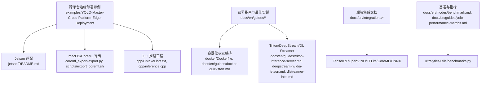
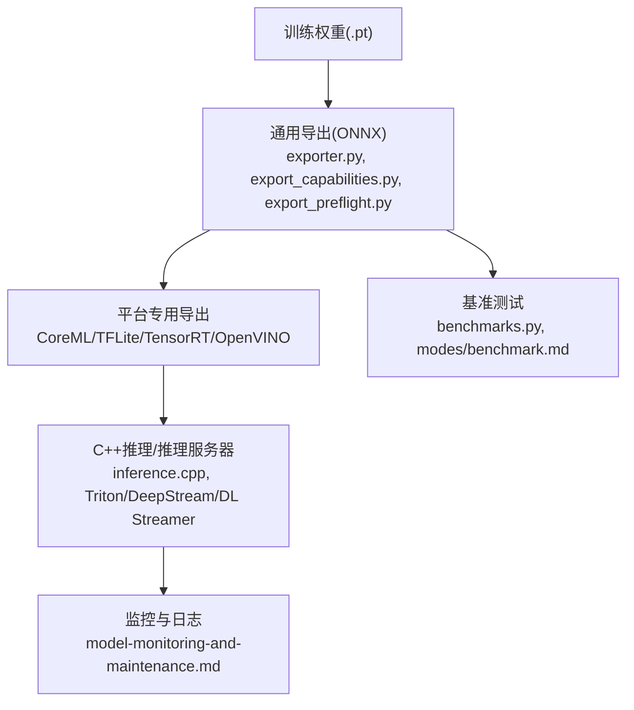
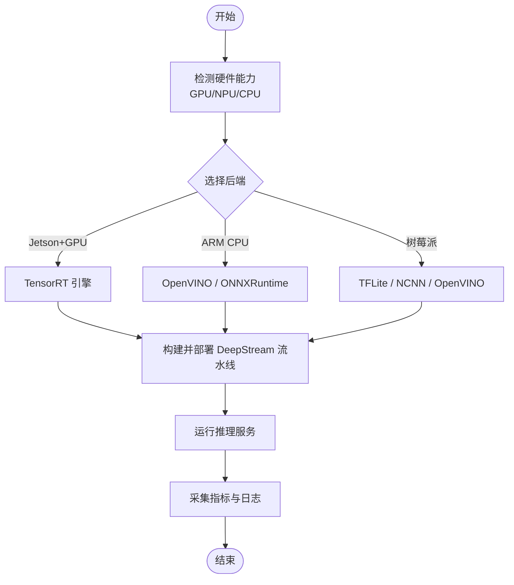
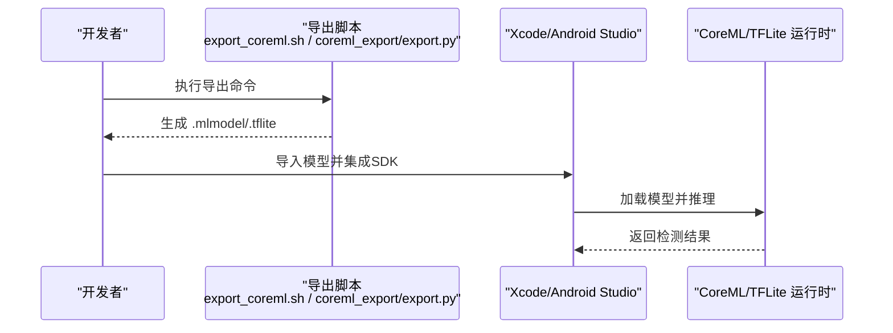
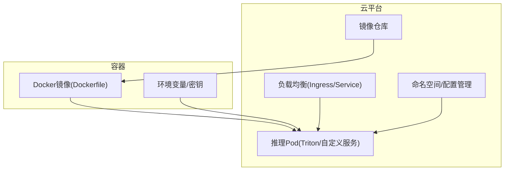
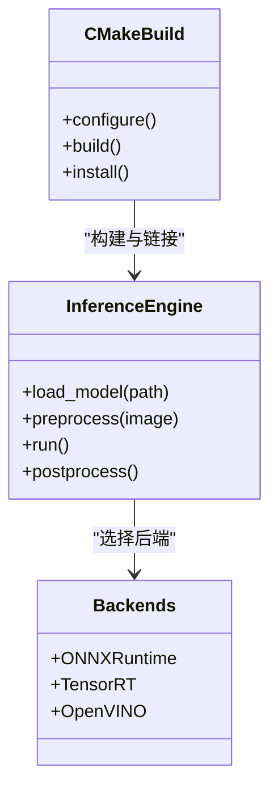
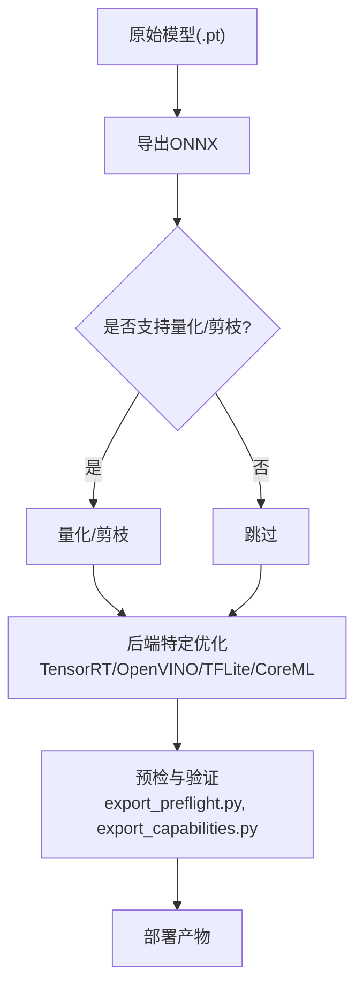
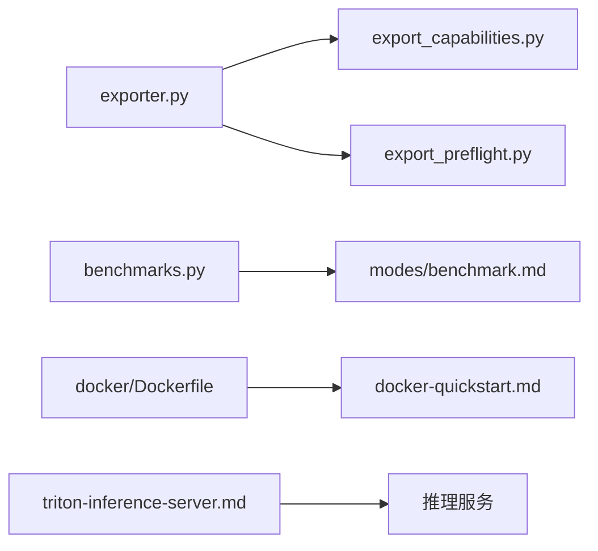
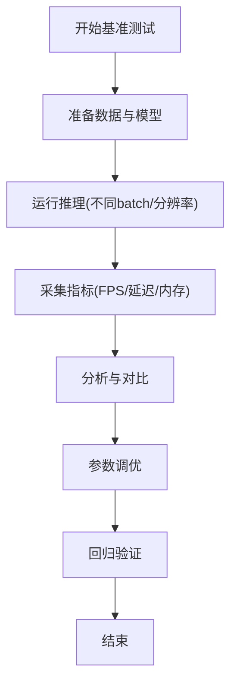
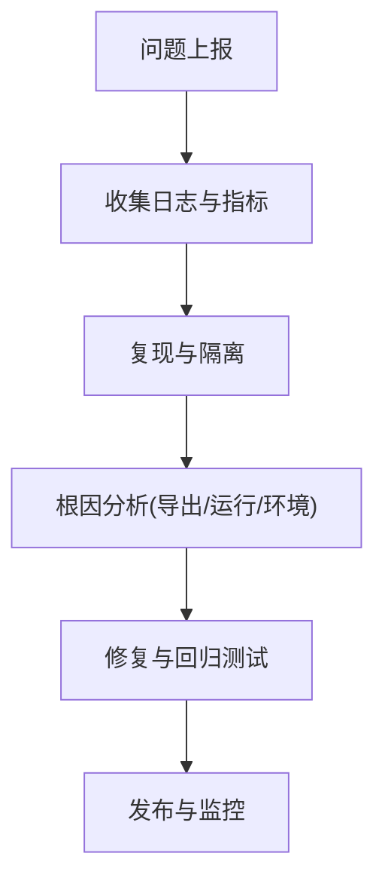

# 跨平台部署示例

<cite>
**本文引用的文件**
- [README.md](file://README.md)
- [examples/YOLO-Master-Cross-Platform-Edge-Deployment/README.md](file://examples/YOLO-Master-Cross-Platform-Edge-Deployment/README.md)
- [examples/YOLO-Master-Cross-Platform-Edge-Deployment/TECHNICAL_REPORT.md](file://examples/YOLO-Master-Cross-Platform-Edge-Deployment/TECHNICAL_REPORT.md)
- [examples/YOLO-Master-Cross-Platform-Edge-Deployment/jetson/README.md](file://examples/YOLO-Master-Cross-Platform-Edge-Deployment/jetson/README.md)
- [examples/YOLO-Master-Cross-Platform-Edge-Deployment/mac/README.md](file://examples/YOLO-Master-Cross-Platform-Edge-Deployment/mac/README.md)
- [examples/YOLO-Master-Cross-Platform-Edge-Deployment/scripts/export_coreml.sh](file://examples/YOLO-Master-Cross-Platform-Edge-Deployment/scripts/export_coreml.sh)
- [examples/YOLO-Master-Cross-Platform-Edge-Deployment/cpp/CMakeLists.txt](file://examples/YOLO-Master-Cross-Platform-Edge-Deployment/cpp/CMakeLists.txt)
- [examples/YOLO-Master-Cross-Platform-Edge-Deployment/cpp/inference.cpp](file://examples/YOLO-Master-Cross-Platform-Edge-Deployment/cpp/inference.cpp)
- [examples/YOLO-Master-Cross-Platform-Edge-Deployment/coreml_export/export.py](file://examples/YOLO-Master-Cross-Platform-Edge-Deployment/coreml_export/export.py)
- [docker/Dockerfile](file://docker/Dockerfile)
- [docs/en/guides/model-deployment-options.md](file://docs/en/guides/model-deployment-options.md)
- [docs/en/guides/model-deployment-practices.md](file://docs/en/guides/model-deployment-practices.md)
- [docs/en/guides/nvidia-jetson.md](file://docs/en/guides/nvidia-jetson.md)
- [docs/en/guides/raspberry-pi.md](file://docs/en/guides/raspberry-pi.md)
- [docs/en/guides/deepstream-nvidia-jetson.md](file://docs/en/guides/deepstream-nvidia-jetson.md)
- [docs/en/guides/dlstreamer-intel.md](file://docs/en/guides/dlstreamer-intel.md)
- [docs/en/guides/triton-inference-server.md](file://docs/en/guides/triton-inference-server.md)
- [docs/en/guides/docker-quickstart.md](file://docs/en/guides/docker-quickstart.md)
- [docs/en/guides/vertex-ai-deployment-with-docker.md](file://docs/en/guides/vertex-ai-deployment-with-docker.md)
- [docs/en/integrations/tensorrt.md](file://docs/en/integrations/tensorrt.md)
- [docs/en/integrations/openvino.md](file://docs/en/integrations/openvino.md)
- [docs/en/integrations/litert.md](file://docs/en/integrations/litert.md)
- [docs/en/integrations/coreml.md](file://docs/en/integrations/coreml.md)
- [docs/en/integrations/onnx.md](file://docs/en/integrations/onnx.md)
- [docs/en/modes/benchmark.md](file://docs/en/modes/benchmark.md)
- [docs/en/guides/yolo-performance-metrics.md](file://docs/en/guides/yolo-performance-metrics.md)
- [docs/en/guides/model-monitoring-and-maintenance.md](file://docs/en/guides/model-monitoring-and-maintenance.md)
- [ultralytics/utils/benchmarks.py](file://ultralytics/utils/benchmarks.py)
- [ultralytics/engine/exporter.py](file://ultralytics/engine/exporter.py)
- [ultralytics/utils/export_capabilities.py](file://ultralytics/utils/export_capabilities.py)
- [ultralytics/utils/export_preflight.py](file://ultralytics/utils/export_preflight.py)
- [scripts/run_moe_dynamic_schedule_ablation.py](file://scripts/run_moe_dynamic_schedule_ablation.py)
</cite>

## 目录
1. [简介](#简介)
2. [项目结构](#项目结构)
3. [核心组件](#核心组件)
4. [架构总览](#架构总览)
5. [详细组件分析](#详细组件分析)
6. [依赖关系分析](#依赖关系分析)
7. [性能与优化](#性能与优化)
8. [故障排查指南](#故障排查指南)
9. [结论](#结论)
10. [附录](#附录)

## 简介
本示例文档面向“跨平台部署”的高级应用实践，围绕边缘设备（Jetson、树莓派、ARM）、移动端（iOS CoreML、Android TFLite）、云服务（Docker、Kubernetes、负载均衡）以及C++高性能推理后端（ONNXRuntime、TensorRT、OpenVINO）提供端到端指导。内容涵盖模型导出与量化剪枝等部署前处理、基准测试与延迟优化、生产环境的监控日志与错误处理，帮助读者在多种目标平台上稳定交付高性能视觉推理服务。

## 项目结构
仓库提供了丰富的部署相关资源：
- 跨平台边缘部署示例：包含Jetson、macOS、CoreML导出脚本与C++推理工程
- 官方指南：覆盖模型部署选项、最佳实践、容器化、Triton、DeepStream、Intel DL Streamer、Raspberry Pi与Jetson适配
- 集成文档：TensorRT、OpenVINO、TFLite、CoreML、ONNX等后端说明
- 基准与指标：统一基准模式与性能指标解读
- 工具链：导出能力矩阵、预检、基准工具等

图表来源
- [examples/YOLO-Master-Cross-Platform-Edge-Deployment/README.md](file://examples/YOLO-Master-Cross-Platform-Edge-Deployment/README.md)
- [examples/YOLO-Master-Cross-Platform-Edge-Deployment/jetson/README.md](file://examples/YOLO-Master-Cross-Platform-Edge-Deployment/jetson/README.md)
- [examples/YOLO-Master-Cross-Platform-Edge-Deployment/coreml_export/export.py](file://examples/YOLO-Master-Cross-Platform-Edge-Deployment/coreml_export/export.py)
- [examples/YOLO-Master-Cross-Platform-Edge-Deployment/scripts/export_coreml.sh](file://examples/YOLO-Master-Cross-Platform-Edge-Deployment/scripts/export_coreml.sh)
- [examples/YOLO-Master-Cross-Platform-Edge-Deployment/cpp/CMakeLists.txt](file://examples/YOLO-Master-Cross-Platform-Edge-Deployment/cpp/CMakeLists.txt)
- [examples/YOLO-Master-Cross-Platform-Edge-Deployment/cpp/inference.cpp](file://examples/YOLO-Master-Cross-Platform-Edge-Deployment/cpp/inference.cpp)
- [docker/Dockerfile](file://docker/Dockerfile)
- [docs/en/guides/model-deployment-options.md](file://docs/en/guides/model-deployment-options.md)
- [docs/en/guides/model-deployment-practices.md](file://docs/en/guides/model-deployment-practices.md)
- [docs/en/guides/triton-inference-server.md](file://docs/en/guides/triton-inference-server.md)
- [docs/en/guides/deepstream-nvidia-jetson.md](file://docs/en/guides/deepstream-nvidia-jetson.md)
- [docs/en/guides/dlstreamer-intel.md](file://docs/en/guides/dlstreamer-intel.md)
- [docs/en/integrations/tensorrt.md](file://docs/en/integrations/tensorrt.md)
- [docs/en/integrations/openvino.md](file://docs/en/integrations/openvino.md)
- [docs/en/integrations/litert.md](file://docs/en/integrations/litert.md)
- [docs/en/integrations/coreml.md](file://docs/en/integrations/coreml.md)
- [docs/en/integrations/onnx.md](file://docs/en/integrations/onnx.md)
- [docs/en/modes/benchmark.md](file://docs/en/modes/benchmark.md)
- [docs/en/guides/yolo-performance-metrics.md](file://docs/en/guides/yolo-performance-metrics.md)
- [ultralytics/utils/benchmarks.py](file://ultralytics/utils/benchmarks.py)

章节来源
- [README.md](file://README.md)
- [examples/YOLO-Master-Cross-Platform-Edge-Deployment/README.md](file://examples/YOLO-Master-Cross-Platform-Edge-Deployment/README.md)
- [examples/YOLO-Master-Cross-Platform-Edge-Deployment/TECHNICAL_REPORT.md](file://examples/YOLO-Master-Cross-Platform-Edge-Deployment/TECHNICAL_REPORT.md)

## 核心组件
- 跨平台边缘部署示例
  - Jetson适配与DeepStream流水线参考
  - macOS/CoreML导出与C++推理工程
  - 统一的导出脚本与构建配置
- 部署指南与最佳实践
  - 模型部署选项与实践建议
  - Docker快速入门与云端部署（Vertex AI）
  - Triton推理服务器、DeepStream、Intel DL Streamer
- 后端集成文档
  - TensorRT、OpenVINO、TFLite、CoreML、ONNX
- 基准与指标
  - 统一基准模式与性能指标解读
  - 基准工具实现

章节来源
- [examples/YOLO-Master-Cross-Platform-Edge-Deployment/README.md](file://examples/YOLO-Master-Cross-Platform-Edge-Deployment/README.md)
- [docs/en/guides/model-deployment-options.md](file://docs/en/guides/model-deployment-options.md)
- [docs/en/guides/model-deployment-practices.md](file://docs/en/guides/model-deployment-practices.md)
- [docs/en/guides/triton-inference-server.md](file://docs/en/guides/triton-inference-server.md)
- [docs/en/guides/deepstream-nvidia-jetson.md](file://docs/en/guides/deepstream-nvidia-jetson.md)
- [docs/en/guides/dlstreamer-intel.md](file://docs/en/guides/dlstreamer-intel.md)
- [docs/en/integrations/tensorrt.md](file://docs/en/integrations/tensorrt.md)
- [docs/en/integrations/openvino.md](file://docs/en/integrations/openvino.md)
- [docs/en/integrations/litert.md](file://docs/en/integrations/litert.md)
- [docs/en/integrations/coreml.md](file://docs/en/integrations/coreml.md)
- [docs/en/integrations/onnx.md](file://docs/en/integrations/onnx.md)
- [docs/en/modes/benchmark.md](file://docs/en/modes/benchmark.md)
- [docs/en/guides/yolo-performance-metrics.md](file://docs/en/guides/yolo-performance-metrics.md)
- [ultralytics/utils/benchmarks.py](file://ultralytics/utils/benchmarks.py)

## 架构总览
下图展示从训练权重到多平台部署的端到端流程：导出为通用格式（ONNX），再根据目标平台转换为专用格式（CoreML、TFLite、TensorRT、OpenVINO），并通过C++或推理服务器进行高性能推理；同时配套基准测试与监控。

图表来源
- [ultralytics/engine/exporter.py](file://ultralytics/engine/exporter.py)
- [ultralytics/utils/export_capabilities.py](file://ultralytics/utils/export_capabilities.py)
- [ultralytics/utils/export_preflight.py](file://ultralytics/utils/export_preflight.py)
- [docs/en/integrations/coreml.md](file://docs/en/integrations/coreml.md)
- [docs/en/integrations/litert.md](file://docs/en/integrations/litert.md)
- [docs/en/integrations/tensorrt.md](file://docs/en/integrations/tensorrt.md)
- [docs/en/integrations/openvino.md](file://docs/en/integrations/openvino.md)
- [examples/YOLO-Master-Cross-Platform-Edge-Deployment/cpp/inference.cpp](file://examples/YOLO-Master-Cross-Platform-Edge-Deployment/cpp/inference.cpp)
- [docs/en/guides/triton-inference-server.md](file://docs/en/guides/triton-inference-server.md)
- [docs/en/guides/deepstream-nvidia-jetson.md](file://docs/en/guides/deepstream-nvidia-jetson.md)
- [docs/en/guides/dlstreamer-intel.md](file://docs/en/guides/dlstreamer-intel.md)
- [docs/en/modes/benchmark.md](file://docs/en/modes/benchmark.md)
- [ultralytics/utils/benchmarks.py](file://ultralytics/utils/benchmarks.py)
- [docs/en/guides/model-monitoring-and-maintenance.md](file://docs/en/guides/model-monitoring-and-maintenance.md)

## 详细组件分析

### 边缘设备部署（Jetson、树莓派、ARM）
- Jetson与DeepStream
  - 使用DeepStream加速视频流推理，结合TensorRT引擎提升吞吐与降低延迟
  - 参考Jetson适配指南与DeepStream集成文档
- 树莓派与ARM
  - 针对ARM CPU/GPU/NPU的优化策略，包括INT8量化、算子融合与内存对齐
  - 参考树莓派部署指南
- 编译与运行环境
  - 通过Docker镜像固化依赖，确保跨设备一致性
  - 参考Docker快速入门与云端部署文档

图表来源
- [docs/en/guides/nvidia-jetson.md](file://docs/en/guides/nvidia-jetson.md)
- [docs/en/guides/deepstream-nvidia-jetson.md](file://docs/en/guides/deepstream-nvidia-jetson.md)
- [docs/en/guides/raspberry-pi.md](file://docs/en/guides/raspberry-pi.md)
- [docs/en/integrations/tensorrt.md](file://docs/en/integrations/tensorrt.md)
- [docs/en/integrations/openvino.md](file://docs/en/integrations/openvino.md)
- [docs/en/integrations/litert.md](file://docs/en/integrations/litert.md)
- [docs/en/guides/docker-quickstart.md](file://docs/en/guides/docker-quickstart.md)

章节来源
- [examples/YOLO-Master-Cross-Platform-Edge-Deployment/jetson/README.md](file://examples/YOLO-Master-Cross-Platform-Edge-Deployment/jetson/README.md)
- [docs/en/guides/nvidia-jetson.md](file://docs/en/guides/nvidia-jetson.md)
- [docs/en/guides/deepstream-nvidia-jetson.md](file://docs/en/guides/deepstream-nvidia-jetson.md)
- [docs/en/guides/raspberry-pi.md](file://docs/en/guides/raspberry-pi.md)
- [docs/en/guides/docker-quickstart.md](file://docs/en/guides/docker-quickstart.md)

### 移动端部署（iOS CoreML、Android TFLite）
- iOS CoreML
  - 使用CoreML导出脚本生成.mlmodel，并在Xcode工程中集成
  - 参考CoreML导出脚本与集成文档
- Android TFLite
  - 将模型导出为.tflite，配合Android NNAPI或GPU Delegate优化
  - 参考TFLite集成文档

图表来源
- [examples/YOLO-Master-Cross-Platform-Edge-Deployment/scripts/export_coreml.sh](file://examples/YOLO-Master-Cross-Platform-Edge-Deployment/scripts/export_coreml.sh)
- [examples/YOLO-Master-Cross-Platform-Edge-Deployment/coreml_export/export.py](file://examples/YOLO-Master-Cross-Platform-Edge-Deployment/coreml_export/export.py)
- [docs/en/integrations/coreml.md](file://docs/en/integrations/coreml.md)
- [docs/en/integrations/litert.md](file://docs/en/integrations/litert.md)

章节来源
- [examples/YOLO-Master-Cross-Platform-Edge-Deployment/mac/README.md](file://examples/YOLO-Master-Cross-Platform-Edge-Deployment/mac/README.md)
- [examples/YOLO-Master-Cross-Platform-Edge-Deployment/scripts/export_coreml.sh](file://examples/YOLO-Master-Cross-Platform-Edge-Deployment/scripts/export_coreml.sh)
- [examples/YOLO-Master-Cross-Platform-Edge-Deployment/coreml_export/export.py](file://examples/YOLO-Master-Cross-Platform-Edge-Deployment/coreml_export/export.py)
- [docs/en/integrations/coreml.md](file://docs/en/integrations/coreml.md)
- [docs/en/integrations/litert.md](file://docs/en/integrations/litert.md)

### 云服务部署（Docker、Kubernetes、负载均衡）
- Docker容器化
  - 使用Dockerfile打包推理环境与依赖，保证可移植性
  - 参考Docker快速入门与云端部署文档
- Kubernetes编排
  - 将容器作为Pod部署，配置副本数、资源限制与健康检查
  - 结合Triton推理服务器实现高并发与弹性伸缩
- 负载均衡
  - 使用Ingress或Service暴露HTTP/gRPC接口，结合HPA自动扩缩容

图表来源
- [docker/Dockerfile](file://docker/Dockerfile)
- [docs/en/guides/docker-quickstart.md](file://docs/en/guides/docker-quickstart.md)
- [docs/en/guides/vertex-ai-deployment-with-docker.md](file://docs/en/guides/vertex-ai-deployment-with-docker.md)
- [docs/en/guides/triton-inference-server.md](file://docs/en/guides/triton-inference-server.md)

章节来源
- [docker/Dockerfile](file://docker/Dockerfile)
- [docs/en/guides/docker-quickstart.md](file://docs/en/guides/docker-quickstart.md)
- [docs/en/guides/vertex-ai-deployment-with-docker.md](file://docs/en/guides/vertex-ai-deployment-with-docker.md)
- [docs/en/guides/triton-inference-server.md](file://docs/en/guides/triton-inference-server.md)

### C++高性能推理（ONNXRuntime、TensorRT、OpenVINO）
- 工程结构
  - CMakeLists.txt定义构建规则与依赖
  - inference.cpp封装推理逻辑（加载模型、预处理、推理、后处理）
- 后端选择
  - ONNXRuntime：跨平台通用后端
  - TensorRT：NVIDIA GPU极致性能
  - OpenVINO：Intel CPU/NPU优化
- 构建与运行
  - 交叉编译至ARM/Jetson/树莓派等平台
  - 结合DeepStream/DL Streamer实现视频流处理

图表来源
- [examples/YOLO-Master-Cross-Platform-Edge-Deployment/cpp/CMakeLists.txt](file://examples/YOLO-Master-Cross-Platform-Edge-Deployment/cpp/CMakeLists.txt)
- [examples/YOLO-Master-Cross-Platform-Edge-Deployment/cpp/inference.cpp](file://examples/YOLO-Master-Cross-Platform-Edge-Deployment/cpp/inference.cpp)
- [docs/en/integrations/onnx.md](file://docs/en/integrations/onnx.md)
- [docs/en/integrations/tensorrt.md](file://docs/en/integrations/tensorrt.md)
- [docs/en/integrations/openvino.md](file://docs/en/integrations/openvino.md)

章节来源
- [examples/YOLO-Master-Cross-Platform-Edge-Deployment/cpp/CMakeLists.txt](file://examples/YOLO-Master-Cross-Platform-Edge-Deployment/cpp/CMakeLists.txt)
- [examples/YOLO-Master-Cross-Platform-Edge-Deployment/cpp/inference.cpp](file://examples/YOLO-Master-Cross-Platform-Edge-Deployment/cpp/inference.cpp)
- [docs/en/integrations/onnx.md](file://docs/en/integrations/onnx.md)
- [docs/en/integrations/tensorrt.md](file://docs/en/integrations/tensorrt.md)
- [docs/en/integrations/openvino.md](file://docs/en/integrations/openvino.md)

### 部署前处理（量化、剪枝、编译优化）
- 量化
  - INT8/FP16量化，结合校准数据集与后端特定优化
- 剪枝
  - 结构化/非结构化剪枝，减少计算量与内存占用
- 编译优化
  - 图级优化、算子融合、常量折叠
- 预检与能力矩阵
  - 导出前检查模型兼容性，避免运行时错误

图表来源
- [ultralytics/engine/exporter.py](file://ultralytics/engine/exporter.py)
- [ultralytics/utils/export_capabilities.py](file://ultralytics/utils/export_capabilities.py)
- [ultralytics/utils/export_preflight.py](file://ultralytics/utils/export_preflight.py)
- [docs/en/integrations/tensorrt.md](file://docs/en/integrations/tensorrt.md)
- [docs/en/integrations/openvino.md](file://docs/en/integrations/openvino.md)
- [docs/en/integrations/litert.md](file://docs/en/integrations/litert.md)
- [docs/en/integrations/coreml.md](file://docs/en/integrations/coreml.md)

章节来源
- [ultralytics/engine/exporter.py](file://ultralytics/engine/exporter.py)
- [ultralytics/utils/export_capabilities.py](file://ultralytics/utils/export_capabilities.py)
- [ultralytics/utils/export_preflight.py](file://ultralytics/utils/export_preflight.py)

## 依赖关系分析
- 导出链路
  - exporter.py负责统一导出入口，export_capabilities.py描述各后端能力，export_preflight.py进行预检
- 基准链路
  - benchmarks.py提供基准测试工具，modes/benchmark.md定义基准模式
- 部署链路
  - Dockerfile与guides/docker-quickstart.md提供容器化方案，triton-inference-server.md提供推理服务器方案

图表来源
- [ultralytics/engine/exporter.py](file://ultralytics/engine/exporter.py)
- [ultralytics/utils/export_capabilities.py](file://ultralytics/utils/export_capabilities.py)
- [ultralytics/utils/export_preflight.py](file://ultralytics/utils/export_preflight.py)
- [ultralytics/utils/benchmarks.py](file://ultralytics/utils/benchmarks.py)
- [docs/en/modes/benchmark.md](file://docs/en/modes/benchmark.md)
- [docker/Dockerfile](file://docker/Dockerfile)
- [docs/en/guides/docker-quickstart.md](file://docs/en/guides/docker-quickstart.md)
- [docs/en/guides/triton-inference-server.md](file://docs/en/guides/triton-inference-server.md)

章节来源
- [ultralytics/engine/exporter.py](file://ultralytics/engine/exporter.py)
- [ultralytics/utils/export_capabilities.py](file://ultralytics/utils/export_capabilities.py)
- [ultralytics/utils/export_preflight.py](file://ultralytics/utils/export_preflight.py)
- [ultralytics/utils/benchmarks.py](file://ultralytics/utils/benchmarks.py)
- [docs/en/modes/benchmark.md](file://docs/en/modes/benchmark.md)
- [docker/Dockerfile](file://docker/Dockerfile)
- [docs/en/guides/docker-quickstart.md](file://docs/en/guides/docker-quickstart.md)
- [docs/en/guides/triton-inference-server.md](file://docs/en/guides/triton-inference-server.md)

## 性能与优化
- 基准测试
  - 使用统一基准模式评估吞吐与延迟，记录关键指标
- 指标解读
  - 关注FPS、P50/P95延迟、内存占用与能耗
- 调优技巧
  - 批量大小调整、输入分辨率裁剪、动态形状优化、算子融合、内存池复用
  - 针对后端特性启用相应优化开关（如TensorRT精度、OpenVINO线程数）

图表来源
- [docs/en/modes/benchmark.md](file://docs/en/modes/benchmark.md)
- [docs/en/guides/yolo-performance-metrics.md](file://docs/en/guides/yolo-performance-metrics.md)
- [ultralytics/utils/benchmarks.py](file://ultralytics/utils/benchmarks.py)

章节来源
- [docs/en/modes/benchmark.md](file://docs/en/modes/benchmark.md)
- [docs/en/guides/yolo-performance-metrics.md](file://docs/en/guides/yolo-performance-metrics.md)
- [ultralytics/utils/benchmarks.py](file://ultralytics/utils/benchmarks.py)

## 故障排查指南
- 常见问题定位
  - 导出失败：检查模型兼容性与预检报告
  - 运行时崩溃：核对后端版本与依赖，确认输入形状与数据类型
  - 性能不达标：分析瓶颈（I/O、预处理、推理、后处理）
- 监控与日志
  - 启用服务日志与指标收集，建立告警阈值
  - 结合模型监控与维护指南进行持续观测

图表来源
- [docs/en/guides/model-monitoring-and-maintenance.md](file://docs/en/guides/model-monitoring-and-maintenance.md)
- [ultralytics/utils/export_preflight.py](file://ultralytics/utils/export_preflight.py)

章节来源
- [docs/en/guides/model-monitoring-and-maintenance.md](file://docs/en/guides/model-monitoring-and-maintenance.md)
- [ultralytics/utils/export_preflight.py](file://ultralytics/utils/export_preflight.py)

## 结论
通过本示例文档，读者可以掌握从模型导出、量化剪枝、后端集成到容器化与编排的全链路部署方法。结合基准测试与监控维护，能够在边缘设备、移动端与云环境中稳定交付高性能推理服务。建议在实际项目中优先完成导出预检与能力匹配，再按平台特性选择最优后端与优化策略，并以基准与监控闭环保障质量与稳定性。

## 附录
- 技术报告与示例说明
  - 跨平台边缘部署技术报告与示例说明
- 脚本与实验
  - 动态调度消融实验脚本（用于性能与路由策略评估）

章节来源
- [examples/YOLO-Master-Cross-Platform-Edge-Deployment/TECHNICAL_REPORT.md](file://examples/YOLO-Master-Cross-Platform-Edge-Deployment/TECHNICAL_REPORT.md)
- [scripts/run_moe_dynamic_schedule_ablation.py](file://scripts/run_moe_dynamic_schedule_ablation.py)