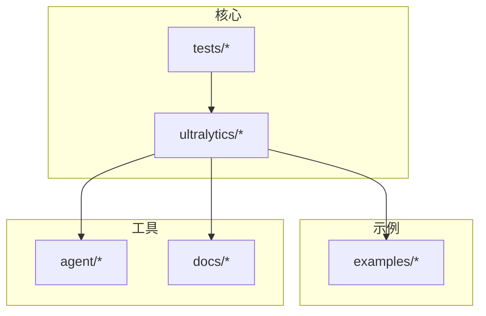
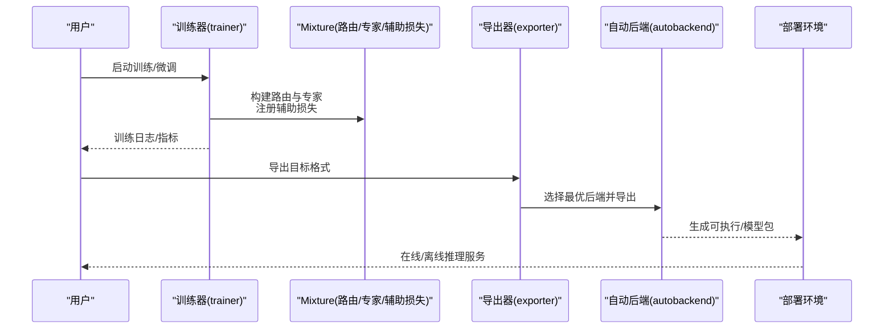
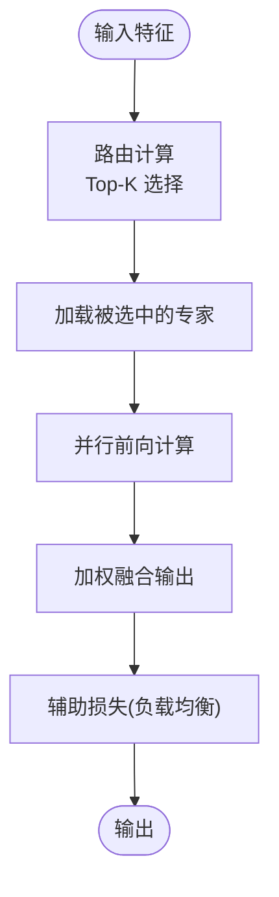
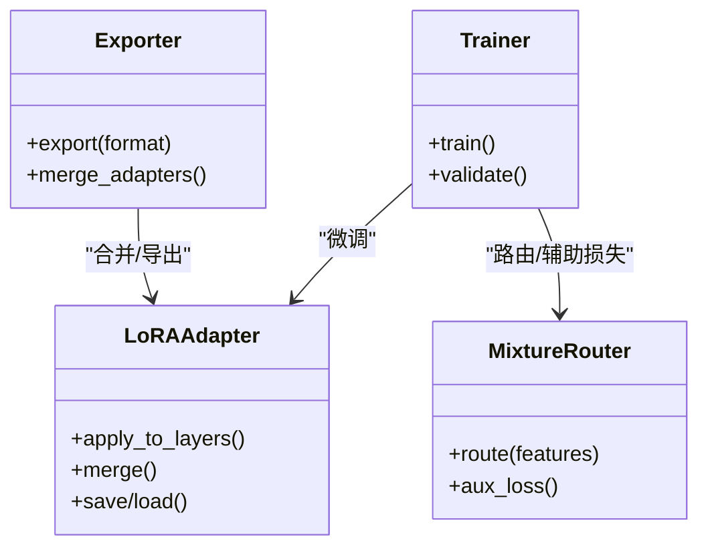
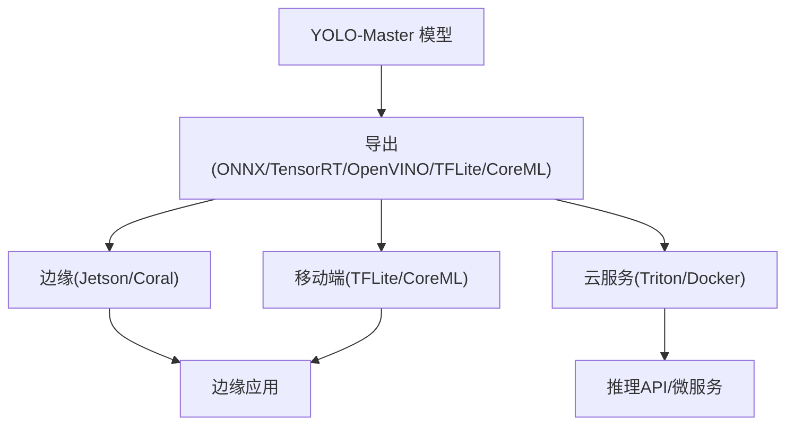
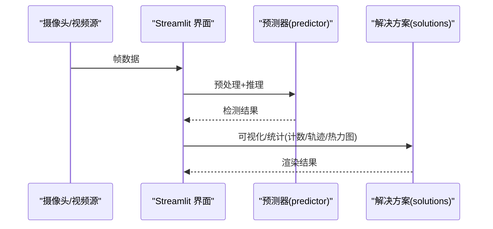
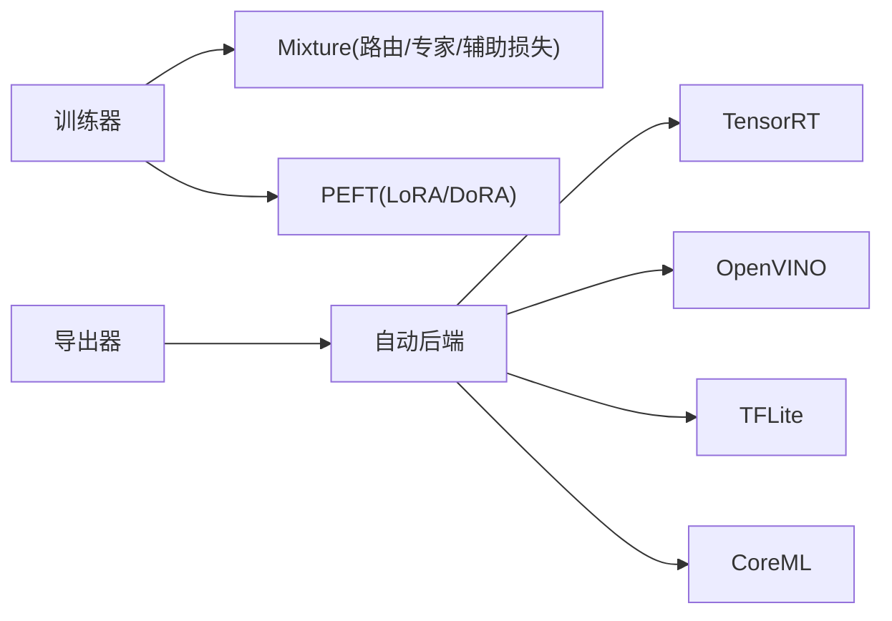

# 高级应用示例

<cite>
**本文引用的文件**
- [README.md](file://README.md)
- [molora_guide.md](file://docs/molora_guide.md)
- [LoRA_Quickstart.md](file://docs/LoRA_Quickstart.md)
- [yolo26-mixture-compatibility.md](file://docs/en/guides/yolo26-mixture-compatibility.md)
- [model-deployment-options.md](file://docs/en/guides/model-deployment-options.md)
- [triton-inference-server.md](file://docs/en/guides/triton-inference-server.md)
- [nvidia-jetson.md](file://docs/en/guides/nvidia-jetson.md)
- [coral-edge-tpu-on-raspberry-pi.md](file://docs/en/guides/coral-edge-tpu-on-raspberry-pi.md)
- [streamlit-live-inference.md](file://docs/en/guides/streamlit-live-inference.md)
- [solutions.py](file://ultralytics/solutions/solutions.py)
- [streamlit_inference.py](file://ultralytics/solutions/streamlit_inference.py)
- [exporter.py](file://ultralytics/engine/exporter.py)
- [trainer.py](file://ultralytics/engine/trainer.py)
- [predictor.py](file://ultralytics/engine/predictor.py)
- [autobackend.py](file://ultralytics/nn/autobackend.py)
- [mixture_loss.py](file://ultralytics/nn/mixture_loss.py)
- [mixture_registry.py](file://ultralytics/nn/mixture_registry.py)
- [lora_tools.py](file://agent/runtime/cli/lora_tools.py)
- [moe_tools.py](file://agent/runtime/cli/moe_tools.py)
- [test_moe.py](file://tests/test_moe.py)
- [test_moa.py](file://tests/test_moa.py)
- [test_molora.py](file://tests/test_molora.py)
- [test_lora_moe_ddp_control_paths.py](file://tests/test_lora_moe_ddp_control_paths.py)
- [run_yolo_master_lora_rank_sweep.py](file://examples/lora_examples/run_yolo_master_lora_rank_sweep.py)
- [basic_finetune.py](file://examples/molora/basic_finetune.py)
- [compare_coco128_fast.py](file://examples/molora/compare_coco128_fast.py)
- [YOLO-Master-Cross-Platform-Edge-Deployment/TECHNICAL_REPORT.md](file://examples/YOLO-Master-Cross-Platform-Edge-Deployment/TECHNICAL_REPORT.md)
- [YOLOv10-Master-MoA/README.md](file://examples/YOLOv10-Master-MoA/README.md)
</cite>

## 目录
1. [简介](#简介)
2. [项目结构](#项目结构)
3. [核心组件](#核心组件)
4. [架构总览](#架构总览)
5. [详细组件分析](#详细组件分析)
6. [依赖关系分析](#依赖关系分析)
7. [性能与部署优化](#性能与部署优化)
8. [故障排查指南](#故障排查指南)
9. [结论](#结论)
10. [附录](#附录)

## 简介
本文件面向希望将 YOLO-Master 应用于工业级场景的工程师与研究者，聚焦以下主题：
- 多专家混合（MoE/MoA）的配置、训练与路由策略、负载均衡与专家选择
- 参数高效微调（PEFT），包括 LoRA 与 DoRA 的实现与应用
- 跨平台部署：边缘设备、移动端、云服务的完整案例
- 实时视频处理、批量推理服务、模型优化等实战场景
- 自定义模块开发、插件集成与二次开发指导
- 性能优化、内存管理与并发处理的实战经验

## 项目结构
仓库采用“功能域 + 工具链”的组织方式：
- ultralytics：核心框架（引擎、模型、导出、解决方案、PEFT、Mixture 等）
- examples：端到端示例（LoRA、MoA、跨平台部署、ONNX/TensorRT/OpenVINO 等）
- agent：运行时 CLI 与工具（LoRA/MoE 工具、评测脚本等）
- tests：覆盖 MoE/MoA/LoRA/MoLaRa 等关键路径的测试
- docs：文档与指南（部署、训练、MoE 兼容性、LoRA 快速开始等）

图表来源
- [README.md:1-200](file://README.md#L1-L200)

章节来源
- [README.md:1-200](file://README.md#L1-L200)

## 核心组件
- 训练与验证引擎：负责数据加载、优化器、损失计算、分布式训练与评估
- 预测与导出：统一推理接口与多后端导出（ONNX/TensorRT/OpenVINO/TFLite/CoreML 等）
- Mixture（MoE/MoA）：路由与专家网络、辅助损失、动态调度与稀疏分发
- PEFT（LoRA/DoRA）：低秩适配、权重合并、路由感知合并与对比评测
- 解决方案与可视化：流式推理、计数、热力图、跟踪等工业级能力
- 工具链：LoRA/MoE 诊断、路由解释器、基准套件与回归测试

章节来源
- [trainer.py:1-200](file://ultralytics/engine/trainer.py#L1-L200)
- [predictor.py:1-200](file://ultralytics/engine/predictor.py#L1-L200)
- [exporter.py:1-200](file://ultralytics/engine/exporter.py#L1-L200)
- [mixture_loss.py:1-200](file://ultralytics/nn/mixture_loss.py#L1-L200)
- [mixture_registry.py:1-200](file://ultralytics/nn/mixture_registry.py#L1-L200)
- [lora_tools.py:1-200](file://agent/runtime/cli/lora_tools.py#L1-L200)
- [moe_tools.py:1-200](file://agent/runtime/cli/moe_tools.py#L1-L200)

## 架构总览
下图展示了从配置到训练、导出、部署的关键路径。

图表来源
- [trainer.py:1-200](file://ultralytics/engine/trainer.py#L1-L200)
- [exporter.py:1-200](file://ultralytics/engine/exporter.py#L1-L200)
- [autobackend.py:1-200](file://ultralytics/nn/autobackend.py#L1-L200)
- [mixture_loss.py:1-200](file://ultralytics/nn/mixture_loss.py#L1-L200)
- [mixture_registry.py:1-200](file://ultralytics/nn/mixture_registry.py#L1-L200)

## 详细组件分析

### 多专家混合（MoE/MoA）
- 路由策略与负载均衡
  - 通过路由模块对输入特征进行门控，选择 Top-K 专家参与计算
  - 辅助损失用于均衡专家使用率，避免“专家坍塌”
  - 动态调度支持按层或按阶段调整激活专家数量
- 专家选择与稀疏分发
  - 基于路由权重排序与阈值筛选，实现稀疏激活
  - 在训练与推理时均可保持稳定的稀疏度
- 配置与训练要点
  - 在模型配置中启用 mixture 相关字段，指定专家数、Top-K、路由类型与辅助损失系数
  - 结合 LoRA 时，需确保路由与适配器权重兼容导出与合并流程

图表来源
- [mixture_loss.py:1-200](file://ultralytics/nn/mixture_loss.py#L1-L200)
- [mixture_registry.py:1-200](file://ultralytics/nn/mixture_registry.py#L1-L200)
- [test_moe.py:1-200](file://tests/test_moe.py#L1-L200)
- [test_moa.py:1-200](file://tests/test_moa.py#L1-L200)

章节来源
- [yolo26-mixture-compatibility.md:1-200](file://docs/en/guides/yolo26-mixture-compatibility.md#L1-L200)
- [moe_tools.py:1-200](file://agent/runtime/cli/moe_tools.py#L1-L200)
- [test_moe.py:1-200](file://tests/test_moe.py#L1-L200)
- [test_moa.py:1-200](file://tests/test_moa.py#L1-L200)

### 参数高效微调（PEFT）：LoRA 与 DoRA
- LoRA 应用
  - 在特定层注入低秩矩阵，冻结主干权重，显著降低显存与存储开销
  - 支持 rank 扫描与任务自适应选择，便于在不同数据集上快速调参
- DoRA 与路由感知合并
  - 在 MoE 场景下，考虑路由权重对合并的影响，保证导出后行为一致
  - 提供对比评测脚本，量化不同 PEFT 方案的性能差异
- 训练与导出
  - 训练阶段仅更新适配器权重；导出时可按需合并或保留分离结构
  - 与 Mixture 组合时，注意路由与适配器的顺序与形状一致性

图表来源
- [lora_tools.py:1-200](file://agent/runtime/cli/lora_tools.py#L1-L200)
- [run_yolo_master_lora_rank_sweep.py:1-200](file://examples/lora_examples/run_yolo_master_lora_rank_sweep.py#L1-L200)
- [test_lora_moe_ddp_control_paths.py:1-200](file://tests/test_lora_moe_ddp_control_paths.py#L1-L200)

章节来源
- [LoRA_Quickstart.md:1-200](file://docs/LoRA_Quickstart.md#L1-L200)
- [molora_guide.md:1-200](file://docs/molora_guide.md#L1-L200)
- [basic_finetune.py:1-200](file://examples/molora/basic_finetune.py#L1-L200)
- [compare_coco128_fast.py:1-200](file://examples/molora/compare_coco128_fast.py#L1-L200)
- [lora_tools.py:1-200](file://agent/runtime/cli/lora_tools.py#L1-L200)
- [test_lora_moe_ddp_control_paths.py:1-200](file://tests/test_lora_moe_ddp_control_paths.py#L1-L200)

### 跨平台部署案例
- 边缘设备
  - Jetson：利用 TensorRT/DeepStream 加速，结合导出脚本与运行脚本完成端到端部署
  - Coral Edge TPU：针对低功耗场景优化，提供转换与推理示例
- 移动端与桌面
  - CoreML（macOS/iOS）、TFLite（Android/iOS）、OpenVINO（Intel CPU/NPU）
- 云服务与容器
  - Triton Inference Server：批处理与并发推理，GPU/CPU 多后端统一入口
  - Docker 镜像打包，配合 Kubernetes 弹性扩缩容

图表来源
- [model-deployment-options.md:1-200](file://docs/en/guides/model-deployment-options.md#L1-L200)
- [triton-inference-server.md:1-200](file://docs/en/guides/triton-inference-server.md#L1-L200)
- [nvidia-jetson.md:1-200](file://docs/en/guides/nvidia-jetson.md#L1-L200)
- [coral-edge-tpu-on-raspberry-pi.md:1-200](file://docs/en/guides/coral-edge-tpu-on-raspberry-pi.md#L1-L200)
- [YOLO-Master-Cross-Platform-Edge-Deployment/TECHNICAL_REPORT.md:1-200](file://examples/YOLO-Master-Cross-Platform-Edge-Deployment/TECHNICAL_REPORT.md#L1-L200)

章节来源
- [model-deployment-options.md:1-200](file://docs/en/guides/model-deployment-options.md#L1-L200)
- [triton-inference-server.md:1-200](file://docs/en/guides/triton-inference-server.md#L1-L200)
- [nvidia-jetson.md:1-200](file://docs/en/guides/nvidia-jetson.md#L1-L200)
- [coral-edge-tpu-on-raspberry-pi.md:1-200](file://docs/en/guides/coral-edge-tpu-on-raspberry-pi.md#L1-L200)
- [YOLO-Master-Cross-Platform-Edge-Deployment/TECHNICAL_REPORT.md:1-200](file://examples/YOLO-Master-Cross-Platform-Edge-Deployment/TECHNICAL_REPORT.md#L1-L200)

### 实时视频处理与批量推理服务
- 实时视频
  - 使用 Streamlit 可视化推理管线，支持摄像头/视频流读取、预处理、推理与结果绘制
  - 可结合 SAHI 切片推理提升小目标检测效果
- 批量推理服务
  - 基于 Triton 的批处理与并发控制，适合高吞吐云端部署
  - 结合队列管理、监控与告警，保障生产稳定性

图表来源
- [streamlit_live_inference.md:1-200](file://docs/en/guides/streamlit-live-inference.md#L1-L200)
- [streamlit_inference.py:1-200](file://ultralytics/solutions/streamlit_inference.py#L1-L200)
- [solutions.py:1-200](file://ultralytics/solutions/solutions.py#L1-L200)
- [predictor.py:1-200](file://ultralytics/engine/predictor.py#L1-L200)

章节来源
- [streamlit_live_inference.md:1-200](file://docs/en/guides/streamlit-live-inference.md#L1-L200)
- [streamlit_inference.py:1-200](file://ultralytics/solutions/streamlit_inference.py#L1-L200)
- [solutions.py:1-200](file://ultralytics/solutions/solutions.py#L1-L200)
- [predictor.py:1-200](file://ultralytics/engine/predictor.py#L1-L200)

### 自定义模块开发与插件集成
- 扩展点
  - 在模型定义处插入自定义模块（如注意力变体、路由策略、损失函数）
  - 通过 registry 机制注册新模块，并在配置中引用
- 二次开发建议
  - 遵循现有接口契约，确保与训练/导出/推理链路兼容
  - 为新增模块编写单元测试与回归用例，纳入 CI

章节来源
- [mixture_registry.py:1-200](file://ultralytics/nn/mixture_registry.py#L1-L200)
- [mixture_loss.py:1-200](file://ultralytics/nn/mixture_loss.py#L1-L200)
- [test_moe.py:1-200](file://tests/test_moe.py#L1-L200)

### MoA 专项说明
- 多注意力混合（MoA）在视觉任务中的适用性与实验报告
- 与 MoE 的差异：MoA 更关注注意力头的多样化与互补性

章节来源
- [YOLOv10-Master-MoA/README.md:1-200](file://examples/YOLOv10-Master-MoA/README.md#L1-L200)

## 依赖关系分析
- 组件耦合
  - 训练器依赖 Mixture 与 PEFT 模块；导出器依赖自动后端选择
  - 路由与专家模块通过注册表解耦，便于替换与扩展
- 外部依赖
  - 导出后端（TensorRT/OpenVINO/TFLite/CoreML/ONNXRuntime）
  - 部署服务（Triton/Docker/Kubernetes）

图表来源
- [trainer.py:1-200](file://ultralytics/engine/trainer.py#L1-L200)
- [exporter.py:1-200](file://ultralytics/engine/exporter.py#L1-L200)
- [autobackend.py:1-200](file://ultralytics/nn/autobackend.py#L1-L200)

章节来源
- [trainer.py:1-200](file://ultralytics/engine/trainer.py#L1-L200)
- [exporter.py:1-200](file://ultralytics/engine/exporter.py#L1-L200)
- [autobackend.py:1-200](file://ultralytics/nn/autobackend.py#L1-L200)

## 性能与部署优化
- 模型优化
  - 选择合适的导出格式与精度（FP16/INT8），结合 TensorRT/OpenVINO 算子优化
  - 使用自动化后端选择，根据硬件特性自动匹配最优后端
- 内存与并发
  - 合理设置 batch size 与线程池大小，避免 OOM
  - 在云端使用 Triton 的批处理与并发队列，提高吞吐
- 路由与稀疏
  - 调整 Top-K 与路由阈值，平衡精度与延迟
  - 监控专家使用分布，必要时引入重平衡策略

章节来源
- [model-deployment-options.md:1-200](file://docs/en/guides/model-deployment-options.md#L1-L200)
- [triton-inference-server.md:1-200](file://docs/en/guides/triton-inference-server.md#L1-L200)
- [autobackend.py:1-200](file://ultralytics/nn/autobackend.py#L1-L200)

## 故障排查指南
- 常见问题定位
  - 路由 NaN/爆炸：检查路由初始化与数值稳定策略
  - 专家坍塌：调整辅助损失系数与负载均衡策略
  - 导出失败：确认后端依赖与模型结构兼容性
- 诊断工具
  - 使用 MoE/LoRA 工具进行路由与适配器状态检查
  - 参考测试用例复现问题路径，逐步缩小范围

章节来源
- [moe_tools.py:1-200](file://agent/runtime/cli/moe_tools.py#L1-L200)
- [lora_tools.py:1-200](file://agent/runtime/cli/lora_tools.py#L1-L200)
- [test_moe.py:1-200](file://tests/test_moe.py#L1-L200)
- [test_molora.py:1-200](file://tests/test_molora.py#L1-L200)

## 结论
YOLO-Master 提供了从训练、微调、导出到部署的一体化能力。通过 MoE/MoA 的路由与稀疏机制、LoRA/DoRA 的参数高效微调，以及完善的跨平台部署方案，可在边缘、移动端与云服务等多种场景中实现高性能与低成本的生产落地。建议在工程中结合测试与诊断工具，持续监控路由与专家使用情况，并根据业务需求迭代优化。

## 附录
- 快速开始与示例
  - LoRA 快速开始与 rank 扫描示例
  - MoLaRa 基础微调与对比脚本
  - 跨平台部署技术报告与示例工程

章节来源
- [LoRA_Quickstart.md:1-200](file://docs/LoRA_Quickstart.md#L1-L200)
- [molora_guide.md:1-200](file://docs/molora_guide.md#L1-L200)
- [run_yolo_master_lora_rank_sweep.py:1-200](file://examples/lora_examples/run_yolo_master_lora_rank_sweep.py#L1-L200)
- [basic_finetune.py:1-200](file://examples/molora/basic_finetune.py#L1-L200)
- [compare_coco128_fast.py:1-200](file://examples/molora/compare_coco128_fast.py#L1-L200)
- [YOLO-Master-Cross-Platform-Edge-Deployment/TECHNICAL_REPORT.md:1-200](file://examples/YOLO-Master-Cross-Platform-Edge-Deployment/TECHNICAL_REPORT.md#L1-L200)