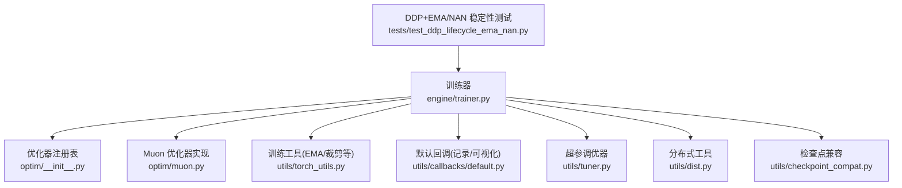
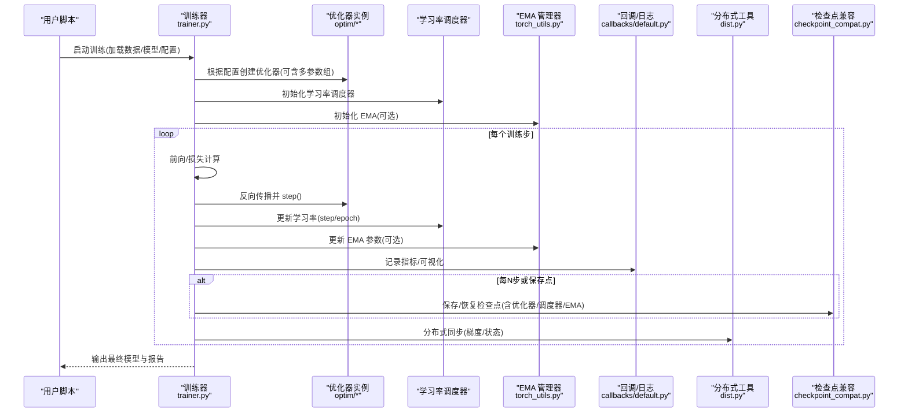
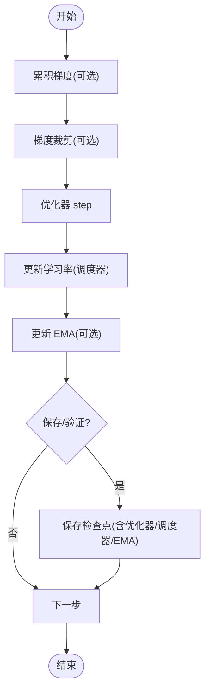
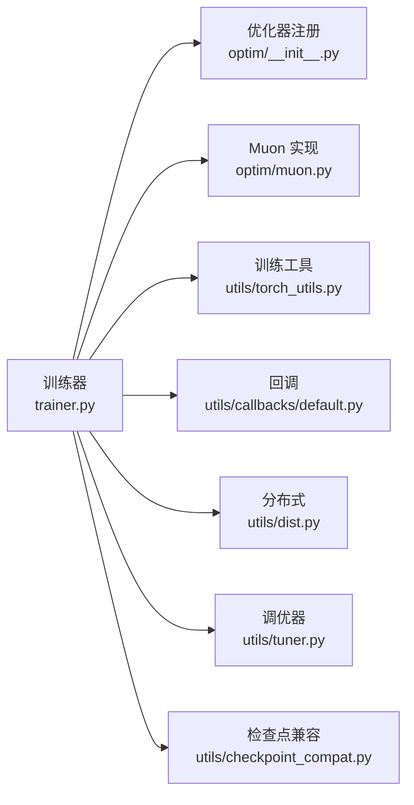

# 优化策略与调度

<cite>
**本文引用的文件**
- [ultralytics/engine/trainer.py](file://ultralytics/engine/trainer.py)
- [ultralytics/optim/__init__.py](file://ultralytics/optim/__init__.py)
- [ultralytics/optim/muon.py](file://ultralytics/optim/muon.py)
- [ultralytics/utils/torch_utils.py](file://ultralytics/utils/torch_utils.py)
- [ultralytics/utils/callbacks/default.py](file://ultralytics/utils/callbacks/default.py)
- [ultralytics/utils/tuner.py](file://ultralytics/utils/tuner.py)
- [ultralytics/utils/dist.py](file://ultralytics/utils/dist.py)
- [ultralytics/utils/checkpoint_compat.py](file://ultralytics/utils/checkpoint_compat.py)
- [tests/test_ddp_lifecycle_ema_nan.py](file://tests/test_ddp_lifecycle_ema_nan.py)
</cite>

## 目录
1. [简介](#简介)
2. [项目结构](#项目结构)
3. [核心组件](#核心组件)
4. [架构总览](#架构总览)
5. [详细组件分析](#详细组件分析)
6. [依赖关系分析](#依赖关系分析)
7. [性能考量](#性能考量)
8. [故障排查指南](#故障排查指南)
9. [结论](#结论)
10. [附录](#附录)

## 简介
本技术文档聚焦于 YOLO-Master 的优化策略与学习率调度系统，覆盖以下主题：
- 支持的优化器类型（SGD、AdamW、Muon 等）及其适用场景
- 学习率调度策略（余弦退火、多项式衰减、步进衰减等）的实现与配置
- 训练稳定化技术：梯度累积、梯度裁剪、EMA（指数移动平均）
- 超参数自动调优系统的集成与使用方法
- 分布式训练中的优化差异与注意事项
- 收敛性分析与调优最佳实践

## 项目结构
围绕优化与调度相关的关键代码主要分布在以下模块：
- 优化器注册与选择：ultralytics/optim
- 训练主循环与优化器/调度器装配：ultralytics/engine/trainer.py
- 训练工具与辅助函数（含 EMA、梯度裁剪等）：ultralytics/utils/torch_utils.py
- 回调体系（记录日志、可视化等）：ultralytics/utils/callbacks/default.py
- 超参搜索与调优：ultralytics/utils/tuner.py
- 分布式通信与一致性保障：ultralytics/utils/dist.py
- 检查点兼容性与恢复：ultralytics/utils/checkpoint_compat.py
- DDP 生命周期与 EMA/NAN 稳定性测试：tests/test_ddp_lifecycle_ema_nan.py

图表来源
- [ultralytics/engine/trainer.py](file://ultralytics/engine/trainer.py)
- [ultralytics/optim/__init__.py](file://ultralytics/optim/__init__.py)
- [ultralytics/optim/muon.py](file://ultralytics/optim/muon.py)
- [ultralytics/utils/torch_utils.py](file://ultralytics/utils/torch_utils.py)
- [ultralytics/utils/callbacks/default.py](file://ultralytics/utils/callbacks/default.py)
- [ultralytics/utils/tuner.py](file://ultralytics/utils/tuner.py)
- [ultralytics/utils/dist.py](file://ultralytics/utils/dist.py)
- [ultralytics/utils/checkpoint_compat.py](file://ultralytics/utils/checkpoint_compat.py)
- [tests/test_ddp_lifecycle_ema_nan.py](file://tests/test_ddp_lifecycle_ema_nan.py)

章节来源
- [ultralytics/engine/trainer.py](file://ultralytics/engine/trainer.py)
- [ultralytics/optim/__init__.py](file://ultralytics/optim/__init__.py)
- [ultralytics/optim/muon.py](file://ultralytics/optim/muon.py)
- [ultralytics/utils/torch_utils.py](file://ultralytics/utils/torch_utils.py)
- [ultralytics/utils/callbacks/default.py](file://ultralytics/utils/callbacks/default.py)
- [ultralytics/utils/tuner.py](file://ultralytics/utils/tuner.py)
- [ultralytics/utils/dist.py](file://ultralytics/utils/dist.py)
- [ultralytics/utils/checkpoint_compat.py](file://ultralytics/utils/checkpoint_compat.py)
- [tests/test_ddp_lifecycle_ema_nan.py](file://tests/test_ddp_lifecycle_ema_nan.py)

## 核心组件
- 优化器注册与选择
  - 通过统一的注册机制暴露 SGD、AdamW、Muon 等优化器，供训练器按配置创建。
  - 支持为不同参数组设置不同的学习率与权重衰减，便于对主干/检测头进行差异化更新。
- 学习率调度器
  - 提供多种内置调度策略（如余弦退火、多项式衰减、步进衰减），在训练主循环中按步或按轮次更新学习率。
- 训练稳定化
  - EMA：维护模型参数的指数移动平均，常用于验证与导出以获得更稳定的泛化性能。
  - 梯度裁剪：防止梯度爆炸，提升大模型训练的数值稳定性。
  - 梯度累积：在显存受限情况下模拟更大批大小，改善收敛平滑度。
- 超参自动调优
  - 基于 Ray Tune 或其他后端，对关键超参（学习率、权重衰减、调度器参数等）进行搜索与评估。
- 分布式训练适配
  - 在 DDP 环境下确保优化器状态、调度器状态与 EMA 的一致性；处理跨进程同步与容错。

章节来源
- [ultralytics/optim/__init__.py](file://ultralytics/optim/__init__.py)
- [ultralytics/optim/muon.py](file://ultralytics/optim/muon.py)
- [ultralytics/engine/trainer.py](file://ultralytics/engine/trainer.py)
- [ultralytics/utils/torch_utils.py](file://ultralytics/utils/torch_utils.py)
- [ultralytics/utils/tuner.py](file://ultralytics/utils/tuner.py)
- [ultralytics/utils/dist.py](file://ultralytics/utils/dist.py)

## 架构总览
下图展示了训练过程中优化器、调度器、EMA 与分布式组件之间的交互关系。

图表来源
- [ultralytics/engine/trainer.py](file://ultralytics/engine/trainer.py)
- [ultralytics/optim/__init__.py](file://ultralytics/optim/__init__.py)
- [ultralytics/optim/muon.py](file://ultralytics/optim/muon.py)
- [ultralytics/utils/torch_utils.py](file://ultralytics/utils/torch_utils.py)
- [ultralytics/utils/callbacks/default.py](file://ultralytics/utils/callbacks/default.py)
- [ultralytics/utils/dist.py](file://ultralytics/utils/dist.py)
- [ultralytics/utils/checkpoint_compat.py](file://ultralytics/utils/checkpoint_compat.py)

## 详细组件分析

### 优化器类型与适用场景
- SGD
  - 特点：简单、内存占用低、在某些任务上具备良好泛化能力。
  - 适用：小数据集、需要强正则化的场景、资源受限环境。
  - 建议：配合动量与权重衰减使用；学习率需精细调节。
- AdamW
  - 特点：自适应学习率、对初始学习率相对鲁棒、收敛较快。
  - 适用：通用目标检测/分割任务、大规模数据、预训练微调。
  - 建议：合理设置权重衰减与 beta 参数；结合余弦退火或线性预热。
- Muon
  - 特点：新型优化器，针对特定网络结构或任务可能具有更好的收敛特性。
  - 适用：实验性探索、特定任务/架构下的性能对比。
  - 建议：作为基线之外的补充方案，关注其数值稳定性与显存开销。

章节来源
- [ultralytics/optim/__init__.py](file://ultralytics/optim/__init__.py)
- [ultralytics/optim/muon.py](file://ultralytics/optim/muon.py)

### 学习率调度策略
- 余弦退火
  - 行为：学习率随训练进度按余弦曲线平滑下降，利于后期精细收敛。
  - 配置要点：最大步数/轮数、最小学习率、是否包含预热阶段。
- 多项式衰减
  - 行为：按幂函数形式逐步降低学习率，适合长周期训练。
  - 配置要点：幂次、起止学习率、总步数。
- 步进衰减
  - 行为：在指定步数点按比例降低学习率，易于理解与调试。
  - 配置要点：衰减因子、衰减步点列表。
- 组合策略
  - 常见做法：先线性预热再进入余弦退火或多项式衰减，兼顾前期稳定与后期收敛。

章节来源
- [ultralytics/engine/trainer.py](file://ultralytics/engine/trainer.py)

### 训练稳定化技术
- 梯度累积
  - 目的：在单卡显存不足时模拟更大批大小，提升收敛稳定性。
  - 用法：累计若干步后再执行一次优化器 step 与清零梯度。
- 梯度裁剪
  - 目的：限制梯度范数上限，避免梯度爆炸导致训练崩溃。
  - 用法：在反向传播后、优化器 step 前对梯度进行裁剪。
- EMA（指数移动平均）
  - 目的：维护模型参数的滑动平均，提高验证与导出模型的稳定性与泛化。
  - 用法：按固定频率更新 EMA 参数；验证/导出时使用 EMA 权重。

图表来源
- [ultralytics/engine/trainer.py](file://ultralytics/engine/trainer.py)
- [ultralytics/utils/torch_utils.py](file://ultralytics/utils/torch_utils.py)

章节来源
- [ultralytics/engine/trainer.py](file://ultralytics/engine/trainer.py)
- [ultralytics/utils/torch_utils.py](file://ultralytics/utils/torch_utils.py)

### 超参数自动调优系统
- 集成方式
  - 通过统一接口定义搜索空间（学习率、权重衰减、调度器参数、批大小等）。
  - 训练器与调优器协作：每次采样一组超参，运行训练并返回评估指标。
- 常用后端
  - Ray Tune：支持并行搜索、早停、结果聚合。
- 使用流程
  - 定义搜索空间与评估指标
  - 启动调优任务
  - 监控运行、查看最优配置与报告

章节来源
- [ultralytics/utils/tuner.py](file://ultralytics/utils/tuner.py)
- [ultralytics/utils/callbacks/default.py](file://ultralytics/utils/callbacks/default.py)

### 分布式训练中的优化差异与注意事项
- 优化器状态同步
  - 在多进程环境下，确保优化器内部状态（如动量、二阶矩估计）一致。
- 学习率与批大小缩放
  - 当全局批大小变化时，按线性规则调整学习率；注意调度器的总步数换算。
- EMA 与检查点
  - 在分布式环境中保存/恢复 EMA 与优化器/调度器状态，保证断点续训一致性。
- 数值稳定性
  - 在 AMP 与混合精度下，关注 NaN/Inf 的检测与回退策略。

章节来源
- [ultralytics/utils/dist.py](file://ultralytics/utils/dist.py)
- [ultralytics/utils/checkpoint_compat.py](file://ultralytics/utils/checkpoint_compat.py)
- [tests/test_ddp_lifecycle_ema_nan.py](file://tests/test_ddp_lifecycle_ema_nan.py)

## 依赖关系分析
- 耦合与内聚
  - 训练器集中编排优化器、调度器、EMA 与回调，内聚度高。
  - 优化器与调度器解耦，便于替换与扩展。
- 外部依赖
  - PyTorch 优化器与调度器接口
  - Ray Tune（可选）用于超参搜索
  - 分布式通信库（NCCL/ gloo 等）由 dist 模块封装
- 潜在循环依赖
  - 当前结构未见明显循环导入；训练器依赖工具模块，工具模块不反向依赖训练器。

图表来源
- [ultralytics/engine/trainer.py](file://ultralytics/engine/trainer.py)
- [ultralytics/optim/__init__.py](file://ultralytics/optim/__init__.py)
- [ultralytics/optim/muon.py](file://ultralytics/optim/muon.py)
- [ultralytics/utils/torch_utils.py](file://ultralytics/utils/torch_utils.py)
- [ultralytics/utils/callbacks/default.py](file://ultralytics/utils/callbacks/default.py)
- [ultralytics/utils/tuner.py](file://ultralytics/utils/tuner.py)
- [ultralytics/utils/dist.py](file://ultralytics/utils/dist.py)
- [ultralytics/utils/checkpoint_compat.py](file://ultralytics/utils/checkpoint_compat.py)

章节来源
- [ultralytics/engine/trainer.py](file://ultralytics/engine/trainer.py)
- [ultralytics/optim/__init__.py](file://ultralytics/optim/__init__.py)
- [ultralytics/optim/muon.py](file://ultralytics/optim/muon.py)
- [ultralytics/utils/torch_utils.py](file://ultralytics/utils/torch_utils.py)
- [ultralytics/utils/callbacks/default.py](file://ultralytics/utils/callbacks/default.py)
- [ultralytics/utils/tuner.py](file://ultralytics/utils/tuner.py)
- [ultralytics/utils/dist.py](file://ultralytics/utils/dist.py)
- [ultralytics/utils/checkpoint_compat.py](file://ultralytics/utils/checkpoint_compat.py)

## 性能考量
- 批大小与学习率
  - 增大批大小通常允许更高学习率；遵循线性缩放规则并结合预热与退火。
- 优化器选择
  - AdamW 在大多数视觉任务中表现稳健；SGD 在特定场景下泛化更好；Muon 可作为实验选项。
- 数值稳定性
  - 启用梯度裁剪与 EMA；在 AMP 下监控梯度范数与损失值，必要时回退到 FP32。
- I/O 与缓存
  - 合理设置数据加载线程与缓存，减少训练瓶颈；避免在 GPU 上进行 CPU 密集操作。
- 分布式效率
  - 控制通信频率，合并保存/日志操作；确保各进程负载均衡。

[本节为通用指导，无需具体文件引用]

## 故障排查指南
- 训练发散或 NaN
  - 检查学习率是否过大、是否启用预热；确认梯度裁剪阈值；观察 AMP 下的数值溢出。
  - 参考分布式与 EMA/NAN 稳定性测试用例以定位问题路径。
- 收敛缓慢
  - 尝试更换优化器（如从 SGD 切换到 AdamW）；调整调度器（余弦退火/多项式衰减）；增加预热步数。
- 显存不足
  - 启用梯度累积；减小批大小；关闭不必要的日志与可视化；使用更高效的优化器。
- 断点续训不一致
  - 确认检查点中包含优化器、调度器与 EMA 状态；使用检查点兼容模块进行版本迁移。

章节来源
- [tests/test_ddp_lifecycle_ema_nan.py](file://tests/test_ddp_lifecycle_ema_nan.py)
- [ultralytics/utils/checkpoint_compat.py](file://ultralytics/utils/checkpoint_compat.py)
- [ultralytics/utils/torch_utils.py](file://ultralytics/utils/torch_utils.py)
- [ultralytics/engine/trainer.py](file://ultralytics/engine/trainer.py)

## 结论
YOLO-Master 的优化与调度系统提供了灵活的优化器选择、丰富的学习率调度策略以及完善的训练稳定化手段。通过合理的超参搜索与分布式适配，可在不同规模与硬件条件下获得稳定且高效的训练效果。实践中建议以 AdamW + 余弦退火为基线，辅以梯度裁剪与 EMA，并在资源受限时采用梯度累积与批量缩放策略。

[本节为总结性内容，无需具体文件引用]

## 附录
- 快速上手建议
  - 基线配置：AdamW、余弦退火、预热 5%-10%、梯度裁剪 1.0、EMA 0.9999。
  - 分布式：按全局批大小线性缩放学习率；确保检查点包含完整状态。
  - 调优：优先搜索学习率、权重衰减与调度器参数；其次考虑优化器与批大小。

[本节为补充信息，无需具体文件引用]