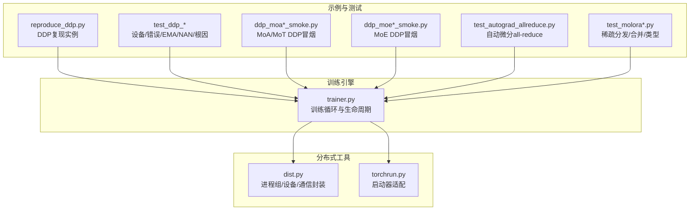
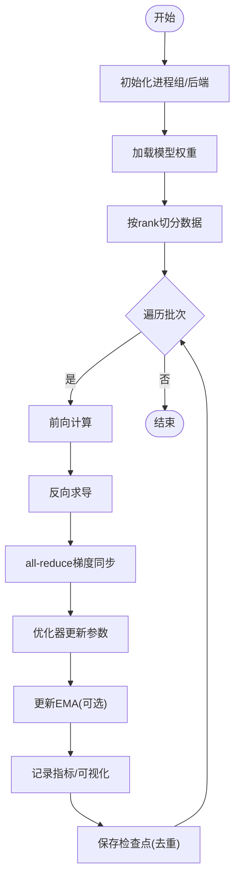
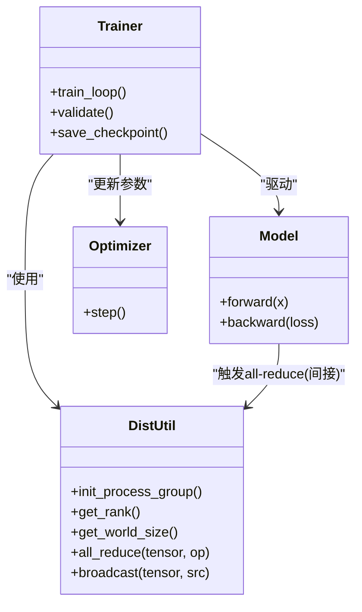
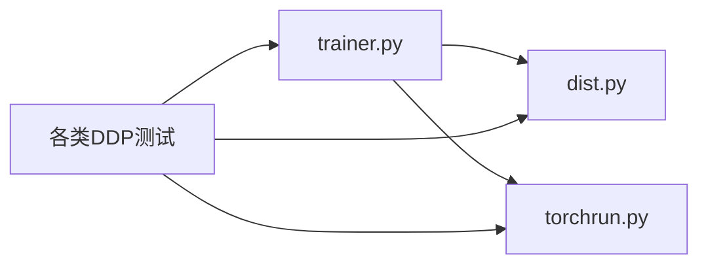

# 分布式训练

<cite>
**本文引用的文件**
- [ultralytics/engine/trainer.py](file://ultralytics/engine/trainer.py)
- [ultralytics/utils/dist.py](file://ultralytics/utils/dist.py)
- [ultralytics/utils/torchrun.py](file://ultralytics/utils/torchrun.py)
- [scripts/reproduce/reproduce_ddp.py](file://scripts/reproduce/reproduce_ddp.py)
- [tests/test_ddp_device_hardening.py](file://tests/test_ddp_device_hardening.py)
- [tests/test_ddp_error_propagation_e2e.py](file://tests/test_ddp_error_propagation_e2e.py)
- [tests/test_ddp_lifecycle_ema_nan.py](file://tests/test_ddp_lifecycle_ema_nan.py)
- [tests/test_ddp_root_cause_reporting.py](file://tests/test_ddp_root_cause_reporting.py)
- [tests/ddp_moa_mot_smoke.py](file://tests/ddp_moa_mot_smoke.py)
- [tests/ddp_moe_smoke.py](file://tests/ddp_moe_smoke.py)
- [tests/ddp_moe_validation_smoke.py](file://tests/ddp_moe_validation_smoke.py)
- [tests/test_autograd_allreduce.py](file://tests/test_autograd_allreduce.py)
- [tests/test_moe_validation_collectives.py](file://tests/test_moe_validation_collectives.py)
- [tests/test_molora_sparse_dispatch.py](file://tests/test_molora_sparse_dispatch.py)
- [tests/test_molora.py](file://tests/test_molora.py)
- [tests/test_molora_dtype.py](file://tests/test_molora_dtype.py)
- [tests/test_molora_merge_semantics.py](file://tests/test_molora_merge_semantics.py)
- [tests/test_molora_routing_aware_merge.py](file://tests/test_molora_routing_aware_merge.py)
- [tests/test_molora_supplementary.py](file://tests/test_molora_supplementary.py)
- [tests/test_windows_torchrun.py](file://tests/test_windows_torchrun.py)
- [tests/test_engine.py](file://tests/test_engine.py)
- [tests/test_integrations.py](file://tests/test_integrations.py)
</cite>

## 目录
1. [简介](#简介)
2. [项目结构](#项目结构)
3. [核心组件](#核心组件)
4. [架构总览](#架构总览)
5. [详细组件分析](#详细组件分析)
6. [依赖关系分析](#依赖关系分析)
7. [性能考虑](#性能考虑)
8. [故障排除指南](#故障排除指南)
9. [结论](#结论)
10. [附录](#附录)

## 简介
本技术文档面向YOLO-Master的分布式训练系统，聚焦于Distributed Data Parallel（DDP）的训练流程与通信机制、多GPU配置与优化、DeepSpeed集成支持、跨节点分布式设置与排障、梯度同步/参数广播/all-reduce实现细节、内存管理与负载均衡策略，以及监控与性能分析方法。文档以代码级事实为依据，结合测试用例与工具模块进行系统化说明，帮助读者在单节点多卡与多机多卡环境下高效稳定地训练YOLO系列模型。

## 项目结构
围绕分布式训练，仓库中与DDP、torchrun、collective通信、MoE/MoA稀疏分发等相关的核心位置如下：
- 训练引擎入口与生命周期管理位于引擎层
- 分布式初始化、进程组与设备绑定等能力集中在utils/dist与utils/torchrun
- 复现脚本提供DDP运行示例
- 大量测试覆盖DDP设备硬化、错误传播、EMA/NAN处理、根因报告、MoE/MoA in DDP、autograd all-reduce、Molora稀疏分发与合并语义等



图表来源
- [ultralytics/engine/trainer.py](file://ultralytics/engine/trainer.py)
- [ultralytics/utils/dist.py](file://ultralytics/utils/dist.py)
- [ultralytics/utils/torchrun.py](file://ultralytics/utils/torchrun.py)
- [scripts/reproduce/reproduce_ddp.py](file://scripts/reproduce/reproduce_ddp.py)
- [tests/test_ddp_device_hardening.py](file://tests/test_ddp_device_hardening.py)
- [tests/test_ddp_error_propagation_e2e.py](file://tests/test_ddp_error_propagation_e2e.py)
- [tests/test_ddp_lifecycle_ema_nan.py](file://tests/test_ddp_lifecycle_ema_nan.py)
- [tests/test_ddp_root_cause_reporting.py](file://tests/test_ddp_root_cause_reporting.py)
- [tests/ddp_moa_mot_smoke.py](file://tests/ddp_moa_mot_smoke.py)
- [tests/ddp_moe_smoke.py](file://tests/ddp_moe_smoke.py)
- [tests/ddp_moe_validation_smoke.py](file://tests/ddp_moe_validation_smoke.py)
- [tests/test_autograd_allreduce.py](file://tests/test_autograd_allreduce.py)
- [tests/test_molora_sparse_dispatch.py](file://tests/test_molora_sparse_dispatch.py)
- [tests/test_molora.py](file://tests/test_molora.py)
- [tests/test_molora_dtype.py](file://tests/test_molora_dtype.py)
- [tests/test_molora_merge_semantics.py](file://tests/test_molora_merge_semantics.py)
- [tests/test_molora_routing_aware_merge.py](file://tests/test_molora_routing_aware_merge.py)
- [tests/test_molora_supplementary.py](file://tests/test_molora_supplementary.py)

章节来源
- [ultralytics/engine/trainer.py](file://ultralytics/engine/trainer.py)
- [ultralytics/utils/dist.py](file://ultralytics/utils/dist.py)
- [ultralytics/utils/torchrun.py](file://ultralytics/utils/torchrun.py)
- [scripts/reproduce/reproduce_ddp.py](file://scripts/reproduce/reproduce_ddp.py)
- [tests/test_ddp_device_hardening.py](file://tests/test_ddp_device_hardening.py)
- [tests/test_ddp_error_propagation_e2e.py](file://tests/test_ddp_error_propagation_e2e.py)
- [tests/test_ddp_lifecycle_ema_nan.py](file://tests/test_ddp_lifecycle_ema_nan.py)
- [tests/test_ddp_root_cause_reporting.py](file://tests/test_ddp_root_cause_reporting.py)
- [tests/ddp_moa_mot_smoke.py](file://tests/ddp_moa_mot_smoke.py)
- [tests/ddp_moe_smoke.py](file://tests/ddp_moe_smoke.py)
- [tests/ddp_moe_validation_smoke.py](file://tests/ddp_moe_validation_smoke.py)
- [tests/test_autograd_allreduce.py](file://tests/test_autograd_allreduce.py)
- [tests/test_molora_sparse_dispatch.py](file://tests/test_molora_sparse_dispatch.py)
- [tests/test_molora.py](file://tests/test_molora.py)
- [tests/test_molora_dtype.py](file://tests/test_molora_dtype.py)
- [tests/test_molora_merge_semantics.py](file://tests/test_molora_merge_semantics.py)
- [tests/test_molora_routing_aware_merge.py](file://tests/test_molora_routing_aware_merge.py)
- [tests/test_molora_supplementary.py](file://tests/test_molora_supplementary.py)

## 核心组件
- 训练引擎（trainer）
  - 负责训练循环、验证、日志、检查点保存、EMA维护、损失计算与优化器步进等。在分布式模式下，需确保各进程独立持有模型副本并正确同步梯度。
- 分布式工具（dist）
  - 封装进程组创建、设备分配、通信后端选择、all-reduce/gather/scatter等集合操作，为上层训练提供一致的分布式接口。
- torchrun适配（torchrun）
  - 统一通过torch.distributed.launch或torchrun启动，屏蔽不同平台差异（含Windows），并提供必要的初始化与参数解析。
- 复现脚本（reproduce_ddp）
  - 提供最小可运行的DDP训练入口，便于快速验证环境、数据加载与模型训练链路。
- 测试套件
  - 覆盖设备绑定、错误传播、EMA/NAN鲁棒性、根因定位、MoE/MoA在DDP下的行为、autograd all-reduce路径、Molora稀疏分发与合并语义等关键场景。

章节来源
- [ultralytics/engine/trainer.py](file://ultralytics/engine/trainer.py)
- [ultralytics/utils/dist.py](file://ultralytics/utils/dist.py)
- [ultralytics/utils/torchrun.py](file://ultralytics/utils/torchrun.py)
- [scripts/reproduce/reproduce_ddp.py](file://scripts/reproduce/reproduce_ddp.py)
- [tests/test_ddp_device_hardening.py](file://tests/test_ddp_device_hardening.py)
- [tests/test_ddp_error_propagation_e2e.py](file://tests/test_ddp_error_propagation_e2e.py)
- [tests/test_ddp_lifecycle_ema_nan.py](file://tests/test_ddp_lifecycle_ema_nan.py)
- [tests/test_ddp_root_cause_reporting.py](file://tests/test_ddp_root_root_cause_reporting.py)
- [tests/ddp_moa_mot_smoke.py](file://tests/ddp_moa_mot_smoke.py)
- [tests/ddp_moe_smoke.py](file://tests/ddp_moe_smoke.py)
- [tests/ddp_moe_validation_smoke.py](file://tests/ddp_moe_validation_smoke.py)
- [tests/test_autograd_allreduce.py](file://tests/test_autograd_allreduce.py)
- [tests/test_molora_sparse_dispatch.py](file://tests/test_molora_sparse_dispatch.py)
- [tests/test_molora.py](file://tests/test_molora.py)
- [tests/test_molora_dtype.py](file://tests/test_molora_dtype.py)
- [tests/test_molora_merge_semantics.py](file://tests/test_molora_merge_semantics.py)
- [tests/test_molora_routing_aware_merge.py](file://tests/test_molora_routing_aware_merge.py)
- [tests/test_molora_supplementary.py](file://tests/test_molora_supplementary.py)

## 架构总览
下图展示从进程启动到训练主循环的关键交互，包括分布式初始化、模型与优化器准备、前向/反向、梯度同步与更新。

```mermaid
sequenceDiagram
participant User as "用户"
participant TorchRun as "torchrun适配"
participant Dist as "分布式工具(dist)"
participant Trainer as "训练引擎(trainer)"
participant Model as "模型(含MoE/MoA)"
participant Opt as "优化器"
participant Comm as "Collective通信"
User->>TorchRun : "启动多进程任务"
TorchRun->>Dist : "初始化进程组/后端"
Dist-->>TorchRun : "返回rank/world_size/device"
TorchRun->>Trainer : "构建并进入训练循环"
loop 每个批次
Trainer->>Model : "前向计算"
Model-->>Trainer : "损失/中间状态"
Trainer->>Opt : "反向求导"
Opt->>Comm : "触发梯度同步(all-reduce)"
Comm-->>Opt : "聚合后的全局梯度"
Opt->>Model : "参数更新"
Trainer->>Trainer : "EMA/日志/检查点"
end
```

图表来源
- [ultralytics/utils/torchrun.py](file://ultralytics/utils/torchrun.py)
- [ultralytics/utils/dist.py](file://ultralytics/utils/dist.py)
- [ultralytics/engine/trainer.py](file://ultralytics/engine/trainer.py)

## 详细组件分析

### DDP训练流程与通信机制
- 进程启动与初始化
  - 通过torchrun适配统一拉起多进程；分布式工具完成进程组创建、后端选择与设备绑定。
- 模型与优化器准备
  - 各进程加载相同权重，按rank划分数据；优化器在各进程本地维护参数副本。
- 前向/反向与梯度同步
  - 反向结束后，由autograd或显式调用触发all-reduce，将各进程梯度聚合成全局梯度，再执行参数更新。
- 验证与检查点
  - 验证阶段通常仅root进程记录结果；检查点保存需避免重复写入或竞态。



章节来源
- [ultralytics/utils/torchrun.py](file://ultralytics/utils/torchrun.py)
- [ultralytics/utils/dist.py](file://ultralytics/utils/dist.py)
- [ultralytics/engine/trainer.py](file://ultralytics/engine/trainer.py)
- [scripts/reproduce/reproduce_ddp.py](file://scripts/reproduce/reproduce_ddp.py)

### 多GPU训练配置与性能优化
- 基本配置
  - 使用torchrun启动，指定进程数等于GPU数量；确保环境变量（如端口、后端）一致。
- 数据并行与批大小
  - 全局批大小=每卡批大小×进程数；合理调整每卡批大小以平衡吞吐与显存。
- I/O与预处理
  - 启用数据预取与多线程加载，减少CPU瓶颈；对图像增强进行批内向量化。
- 混合精度与算子优化
  - 开启AMP以提升吞吐；优先使用内核友好的算子与张量布局。
- 通信与带宽
  - 选择合适的NCCL后端与拓扑；在多机场景下关注网络延迟与带宽。

章节来源
- [ultralytics/utils/torchrun.py](file://ultralytics/utils/torchrun.py)
- [ultralytics/utils/dist.py](file://ultralytics/utils/dist.py)
- [tests/test_engine.py](file://tests/test_engine.py)

### DeepSpeed集成支持与配置选项
- 现状说明
  - 当前仓库未直接包含DeepSpeed专用训练入口或配置解析逻辑；如需使用DeepSpeed，建议在其生态中对接YOLO-Master模型定义与数据管线，或通过外部包装器注入DeepSpeed ZeRO/Offload等特性。
- 建议接入方式
  - 保持模型与数据加载不变，使用DeepSpeed提供的启动器替换torchrun；确保模型可被DeepSpeed序列化/反序列化，且自定义模块遵循其要求。
- 注意事项
  - 混合精度、梯度累积、ZeRO阶段与offload策略需与现有EMA/检查点/日志逻辑协调，避免状态不一致。

章节来源
- [ultralytics/engine/trainer.py](file://ultralytics/engine/trainer.py)
- [ultralytics/utils/torchrun.py](file://ultralytics/utils/torchrun.py)

### 跨节点分布式训练设置与故障排除
- 设置要点
  - 多机多卡需统一后端（如NCCL）、端口、世界规模与主机列表；确保防火墙放行相应端口。
  - 使用torchrun的multi-node模式，或在作业调度系统中按节点分发进程。
- 常见故障
  - 进程间无法建立连接、端口冲突、NCCL初始化失败、时间同步问题、磁盘权限导致检查点写入失败。
- 排查步骤
  - 校验rank/world_size一致性；打印各进程设备与后端信息；缩小规模逐步定位；查看NCCL调试输出。

章节来源
- [ultralytics/utils/torchrun.py](file://ultralytics/utils/torchrun.py)
- [ultralytics/utils/dist.py](file://ultralytics/utils/dist.py)
- [tests/test_windows_torchrun.py](file://tests/test_windows_torchrun.py)

### 梯度同步、参数广播与all-reduce实现细节
- 梯度同步
  - 反向结束后触发all-reduce，将各进程梯度聚合为全局梯度；确保所有参与进程均到达同步点。
- 参数广播
  - 训练开始前由root进程广播初始参数至其他进程，保证初始一致性。
- autograd all-reduce路径
  - 测试覆盖了autograd触发的all-reduce路径，确保自定义算子与模块在DDP下正常工作。
- MoE/MoA特殊路径
  - 针对稀疏路由与专家权重，测试覆盖collective调用与数值稳定性，确保在DDP下正确同步。



图表来源
- [ultralytics/utils/dist.py](file://ultralytics/utils/dist.py)
- [ultralytics/engine/trainer.py](file://ultralytics/engine/trainer.py)
- [tests/test_autograd_allreduce.py](file://tests/test_autograd_allreduce.py)
- [tests/test_moe_validation_collectives.py](file://tests/test_moe_validation_collectives.py)

章节来源
- [ultralytics/utils/dist.py](file://ultralytics/utils/dist.py)
- [ultralytics/engine/trainer.py](file://ultralytics/engine/trainer.py)
- [tests/test_autograd_allreduce.py](file://tests/test_autograd_allreduce.py)
- [tests/test_moe_validation_collectives.py](file://tests/test_moe_validation_collectives.py)

### 内存管理与负载均衡策略
- 显存管理
  - 控制每卡批大小、启用混合精度、释放中间变量；对大对象及时清理。
- 负载均衡
  - 数据采样尽量均匀；对于MoE/MoA，注意专家负载不均衡导致的straggler现象，可通过路由校准或动态调度缓解。
- Molora稀疏分发
  - 测试覆盖稀疏分发与合并语义，确保在DDP下按路由聚合时不会引入额外通信热点。

章节来源
- [tests/test_molora_sparse_dispatch.py](file://tests/test_molora_sparse_dispatch.py)
- [tests/test_molora.py](file://tests/test_molora.py)
- [tests/test_molora_dtype.py](file://tests/test_molora_dtype.py)
- [tests/test_molora_merge_semantics.py](file://tests/test_molora_merge_semantics.py)
- [tests/test_molora_routing_aware_merge.py](file://tests/test_molora_routing_aware_merge.py)
- [tests/test_molora_supplementary.py](file://tests/test_molora_supplementary.py)

### 监控工具与性能分析指南
- 指标采集
  - 在训练循环中记录loss、吞吐、显存占用、通信耗时；定期汇总并可视化。
- 性能剖析
  - 使用框架内置profiler或第三方工具分析算子耗时与通信瓶颈；定位长尾批次与热点all-reduce。
- 日志与事件
  - 利用事件回调记录关键阶段耗时，辅助定位慢点与异常。

章节来源
- [ultralytics/engine/trainer.py](file://ultralytics/engine/trainer.py)
- [tests/test_engine.py](file://tests/test_engine.py)

## 依赖关系分析
- 耦合与内聚
  - trainer强依赖dist与torchrun提供的分布式能力；测试广泛覆盖DDP相关路径，形成良好的回归保障。
- 外部依赖
  - 主要依赖PyTorch分布式后端（如NCCL）；在Windows环境下有专门适配测试。
- 潜在环依赖
  - 未见明显循环导入；训练引擎与分布式工具解耦清晰。



图表来源
- [ultralytics/engine/trainer.py](file://ultralytics/engine/trainer.py)
- [ultralytics/utils/dist.py](file://ultralytics/utils/dist.py)
- [ultralytics/utils/torchrun.py](file://ultralytics/utils/torchrun.py)
- [tests/test_ddp_device_hardening.py](file://tests/test_ddp_device_hardening.py)
- [tests/test_ddp_error_propagation_e2e.py](file://tests/test_ddp_error_propagation_e2e.py)
- [tests/test_ddp_lifecycle_ema_nan.py](file://tests/test_ddp_lifecycle_ema_nan.py)
- [tests/test_ddp_root_cause_reporting.py](file://tests/test_ddp_root_cause_reporting.py)
- [tests/ddp_moa_mot_smoke.py](file://tests/ddp_moa_mot_smoke.py)
- [tests/ddp_moe_smoke.py](file://tests/ddp_moe_smoke.py)
- [tests/ddp_moe_validation_smoke.py](file://tests/ddp_moe_validation_smoke.py)
- [tests/test_autograd_allreduce.py](file://tests/test_autograd_allreduce.py)
- [tests/test_molora_sparse_dispatch.py](file://tests/test_molora_sparse_dispatch.py)
- [tests/test_molora.py](file://tests/test_molora.py)
- [tests/test_molora_dtype.py](file://tests/test_molora_dtype.py)
- [tests/test_molora_merge_semantics.py](file://tests/test_molora_merge_semantics.py)
- [tests/test_molora_routing_aware_merge.py](file://tests/test_molora_routing_aware_merge.py)
- [tests/test_molora_supplementary.py](file://tests/test_molora_supplementary.py)

章节来源
- [ultralytics/engine/trainer.py](file://ultralytics/engine/trainer.py)
- [ultralytics/utils/dist.py](file://ultralytics/utils/dist.py)
- [ultralytics/utils/torchrun.py](file://ultralytics/utils/torchrun.py)
- [tests/test_ddp_device_hardening.py](file://tests/test_ddp_device_hardening.py)
- [tests/test_ddp_error_propagation_e2e.py](file://tests/test_ddp_error_propagation_e2e.py)
- [tests/test_ddp_lifecycle_ema_nan.py](file://tests/test_ddp_lifecycle_ema_nan.py)
- [tests/test_ddp_root_cause_reporting.py](file://tests/test_ddp_root_cause_reporting.py)
- [tests/ddp_moa_mot_smoke.py](file://tests/ddp_moa_mot_smoke.py)
- [tests/ddp_moe_smoke.py](file://tests/ddp_moe_smoke.py)
- [tests/ddp_moe_validation_smoke.py](file://tests/ddp_moe_validation_smoke.py)
- [tests/test_autograd_allreduce.py](file://tests/test_autograd_allreduce.py)
- [tests/test_molora_sparse_dispatch.py](file://tests/test_molora_sparse_dispatch.py)
- [tests/test_molora.py](file://tests/test_molora.py)
- [tests/test_molora_dtype.py](file://tests/test_molora_dtype.py)
- [tests/test_molora_merge_semantics.py](file://tests/test_molora_merge_semantics.py)
- [tests/test_molora_routing_aware_merge.py](file://tests/test_molora_routing_aware_merge.py)
- [tests/test_molora_supplementary.py](file://tests/test_molora_supplementary.py)

## 性能考虑
- 通信瓶颈
  - all-reduce频率与粒度直接影响吞吐；适当增大批大小、减少同步次数或使用梯度累积可降低通信开销。
- 算子效率
  - 优先使用高效内核；避免频繁跨设备拷贝与格式转换。
- I/O与预处理
  - 数据管道应尽可能流水线化，避免阻塞GPU。
- 多机网络
  - 优化NCCL拓扑与端口规划，必要时使用RDMA或InfiniBand以获得更高带宽。

[本节为通用指导，无需特定文件引用]

## 故障排除指南
- 设备与后端
  - 确认各进程设备绑定正确、后端可用；参考设备硬化测试用例中的断言与边界条件。
- 错误传播与根因定位
  - 分布式环境中错误可能在不同进程异步出现；参考端到端错误传播与根因报告测试，确保异常能准确上报并附带上下文。
- EMA与NAN鲁棒性
  - 训练中出现NaN时应具备回退与恢复机制；参考生命周期与EMA/NAN测试，确保检查点与EMA状态一致。
- Windows兼容
  - 使用专门的Windows torchrun测试验证启动流程与进程通信。

章节来源
- [tests/test_ddp_device_hardening.py](file://tests/test_ddp_device_hardening.py)
- [tests/test_ddp_error_propagation_e2e.py](file://tests/test_ddp_error_propagation_e2e.py)
- [tests/test_ddp_lifecycle_ema_nan.py](file://tests/test_ddp_lifecycle_ema_nan.py)
- [tests/test_ddp_root_cause_reporting.py](file://tests/test_ddp_root_cause_reporting.py)
- [tests/test_windows_torchrun.py](file://tests/test_windows_torchrun.py)

## 结论
YOLO-Master的分布式训练体系以trainer为核心，借助dist与torchrun提供稳定的多进程与通信能力，并通过丰富的测试覆盖设备、错误、EMA/NAN、MoE/MoA与Molora稀疏分发等关键路径。在多GPU与多机环境下，合理配置数据并行、通信后端与I/O流水线，可获得稳定高效的训练体验。DeepSpeed尚未原生集成，但可通过外部包装器对接。建议在大规模训练中强化监控与性能剖析，持续优化通信与算子路径。

[本节为总结性内容，无需特定文件引用]

## 附录
- 快速复现
  - 使用复现脚本作为DDP最小示例，验证环境与链路。
- 扩展阅读
  - 参考测试套件中的具体用例，了解DDP在不同模块与场景下的行为与约束。

章节来源
- [scripts/reproduce/reproduce_ddp.py](file://scripts/reproduce/reproduce_ddp.py)
- [tests/test_integrations.py](file://tests/test_integrations.py)