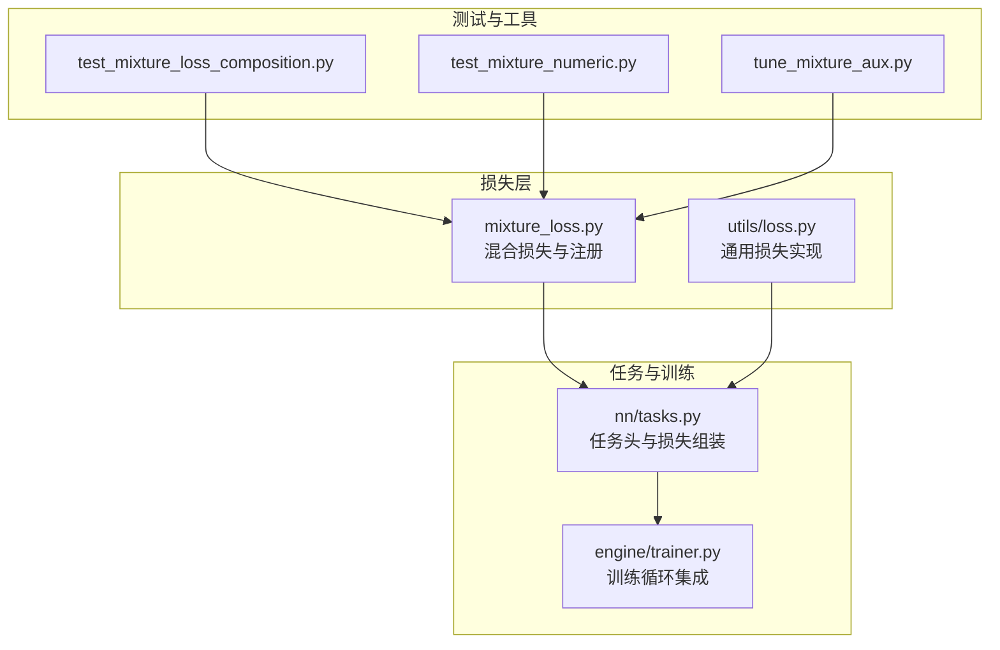
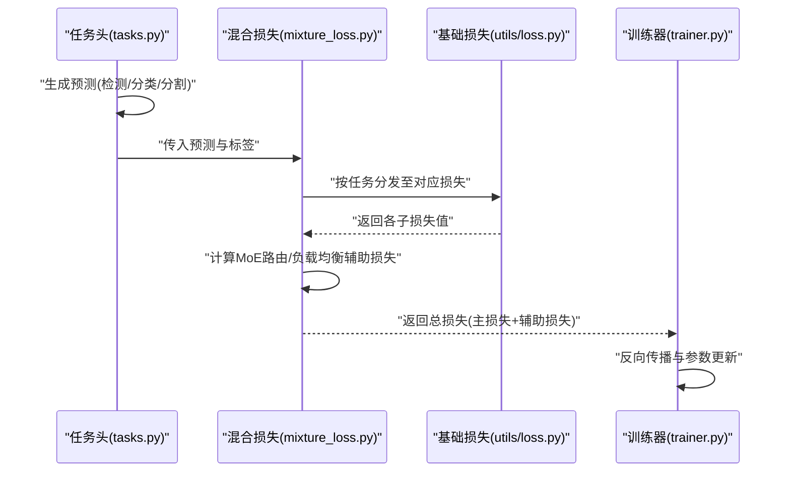
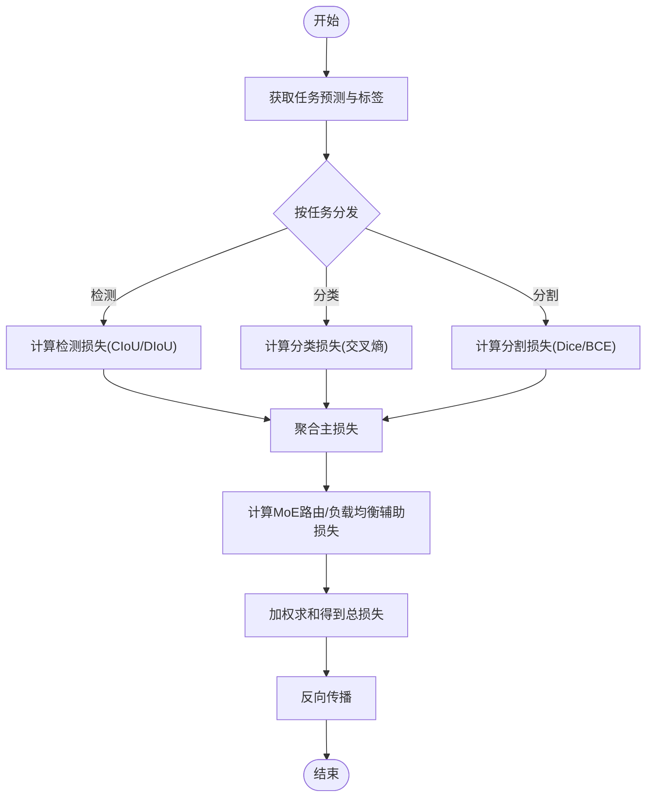
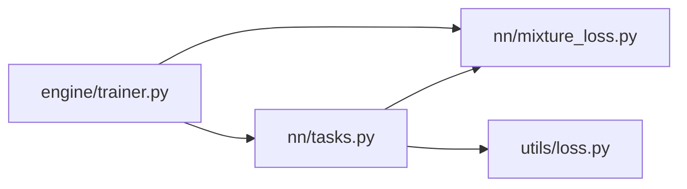

# 损失函数体系

<cite>
**本文引用的文件**
- [ultralytics/nn/mixture_loss.py](file://ultralytics/nn/mixture_loss.py)
- [ultralytics/utils/loss.py](file://ultralytics/utils/loss.py)
- [ultralytics/nn/tasks.py](file://ultralytics/nn/tasks.py)
- [ultralytics/engine/trainer.py](file://ultralytics/engine/trainer.py)
- [tests/test_mixture_loss_composition.py](file://tests/test_mixture_loss_composition.py)
- [tests/test_mixture_numeric.py](file://tests/test_mixture_numeric.py)
- [scripts/tune_mixture_aux.py](file://scripts/tune_mixture_aux.py)
</cite>

## 目录
1. [简介](#简介)
2. [项目结构](#项目结构)
3. [核心组件](#核心组件)
4. [架构总览](#架构总览)
5. [详细组件分析](#详细组件分析)
6. [依赖分析](#依赖分析)
7. [性能考虑](#性能考虑)
8. [故障排查指南](#故障排查指南)
9. [结论](#结论)
10. [附录](#附录)

## 简介
本技术文档聚焦于 YOLO-Master 的损失函数体系，覆盖目标检测、分类、分割等任务的损失实现，以及混合任务（Mixture）与 MoE（专家路由）相关的辅助损失。文档重点包括：
- 各类基础损失的职责与组合方式（如 CIoU/DIoU、交叉熵、Dice 等）
- 混合损失函数的设计原理与权重配置
- MoE 架构中的专家路由损失与负载均衡损失
- 自定义损失函数的开发方法与数值稳定性建议
- 调试与可视化工具使用指南
- 不同损失对模型性能的影响分析与选择建议

## 项目结构
YOLO-Master 中与损失函数相关的关键代码主要分布在以下位置：
- 混合损失与注册表：ultralytics/nn/mixture_loss.py
- 通用损失实现与工具：ultralytics/utils/loss.py
- 任务头与损失组装入口：ultralytics/nn/tasks.py
- 训练流程集成：ultralytics/engine/trainer.py
- 测试与验证：tests/test_mixture_loss_composition.py、tests/test_mixture_numeric.py
- 超参调优脚本：scripts/tune_mixture_aux.py

图表来源
- [ultralytics/nn/mixture_loss.py](file://ultralytics/nn/mixture_loss.py)
- [ultralytics/utils/loss.py](file://ultralytics/utils/loss.py)
- [ultralytics/nn/tasks.py](file://ultralytics/nn/tasks.py)
- [ultralytics/engine/trainer.py](file://ultralytics/engine/trainer.py)
- [tests/test_mixture_loss_composition.py](file://tests/test_mixture_loss_composition.py)
- [tests/test_mixture_numeric.py](file://tests/test_mixture_numeric.py)
- [scripts/tune_mixture_aux.py](file://scripts/tune_mixture_aux.py)

章节来源
- [ultralytics/nn/mixture_loss.py](file://ultralytics/nn/mixture_loss.py)
- [ultralytics/utils/loss.py](file://ultralytics/utils/loss.py)
- [ultralytics/nn/tasks.py](file://ultralytics/nn/tasks.py)
- [ultralytics/engine/trainer.py](file://ultralytics/engine/trainer.py)
- [tests/test_mixture_loss_composition.py](file://tests/test_mixture_loss_composition.py)
- [tests/test_mixture_numeric.py](file://tests/test_mixture_numeric.py)
- [scripts/tune_mixture_aux.py](file://scripts/tune_mixture_aux.py)

## 核心组件
- 混合损失与注册表（mixture_loss.py）
  - 提供多任务/多分支的混合损失组合能力，支持按任务维度聚合各子损失，并注入 MoE 相关的辅助损失项（如路由损失、负载均衡损失）。
  - 通过注册机制管理不同任务类型的损失函数，便于在训练时动态装配。
- 通用损失实现（utils/loss.py）
  - 包含目标检测常用边界框回归损失（如 CIoU/DIoU）、分类交叉熵损失、分割 Dice 损失等基础实现。
  - 提供数值稳定化技巧（如对数域计算、裁剪、平滑标签等），保障梯度稳定。
- 任务头与损失组装（nn/tasks.py）
  - 将模型输出与标签对齐，调用相应损失函数进行计算，并按任务类型汇总为总损失。
  - 负责将混合损失与任务头输出对接，形成端到端的可微分图。
- 训练集成（engine/trainer.py）
  - 在训练循环中计算并记录各项损失，支持日志、回调与可视化接口。
  - 负责将 MoE 辅助损失纳入优化目标，并在需要时进行归一化或加权。

章节来源
- [ultralytics/nn/mixture_loss.py](file://ultralytics/nn/mixture_loss.py)
- [ultralytics/utils/loss.py](file://ultralytics/utils/loss.py)
- [ultralytics/nn/tasks.py](file://ultralytics/nn/tasks.py)
- [ultralytics/engine/trainer.py](file://ultralytics/engine/trainer.py)

## 架构总览
下图展示了从任务头到损失计算的端到端数据流，以及 MoE 辅助损失的注入点。

图表来源
- [ultralytics/nn/tasks.py](file://ultralytics/nn/tasks.py)
- [ultralytics/nn/mixture_loss.py](file://ultralytics/nn/mixture_loss.py)
- [ultralytics/utils/loss.py](file://ultralytics/utils/loss.py)
- [ultralytics/engine/trainer.py](file://ultralytics/engine/trainer.py)

## 详细组件分析

### 基础损失组件（检测/分类/分割）
- 目标检测边界框回归损失
  - 常见实现包括 CIoU/DIoU 等，强调 IoU 度量与形状/中心偏移惩罚，提升定位精度与收敛稳定性。
  - 数值稳定策略通常包含对尺度敏感项的裁剪与平滑处理。
- 分类交叉熵损失
  - 针对多类别分类任务，常采用带标签平滑的交叉熵以提升泛化能力。
- 分割 Dice 损失
  - 面向像素级分割，Dice 损失对类别不平衡具有鲁棒性，常与 BCE 联合使用以兼顾边界与区域一致性。

章节来源
- [ultralytics/utils/loss.py](file://ultralytics/utils/loss.py)

### 混合损失与任务装配
- 混合损失（mixture_loss.py）
  - 负责将多个任务损失（检测、分类、分割等）组合为统一目标，支持按任务权重聚合。
  - 在混合场景下，可对不同任务进行归一化（如按样本数或复杂度）以避免主导效应。
- 任务装配（tasks.py）
  - 根据任务类型选择对应的损失函数，并将模型输出与标签对齐后送入损失模块。
  - 负责将 MoE 辅助损失与主损失合并，形成最终优化目标。

章节来源
- [ultralytics/nn/mixture_loss.py](file://ultralytics/nn/mixture_loss.py)
- [ultralytics/nn/tasks.py](file://ultralytics/nn/tasks.py)

### MoE 辅助损失（路由与负载均衡）
- 专家路由损失
  - 用于引导门控网络将样本合理分配至专家，避免所有样本集中于少数专家。
- 负载均衡损失
  - 通过对专家利用率进行正则化，鼓励负载均衡，防止“专家坍塌”。
- 注入时机与权重
  - 通常在每个前向过程中计算，并以固定或动态权重加入总损失；权重过大可能抑制主任务学习，过小则无法起到平衡作用。

章节来源
- [ultralytics/nn/mixture_loss.py](file://ultralytics/nn/mixture_loss.py)

### 训练集成与日志
- 训练器（trainer.py）
  - 在训练循环中收集并记录主损失与各辅助损失，支持 TensorBoard/W&B 等可视化后端。
  - 负责将 MoE 辅助损失纳入优化目标，并在需要时进行归一化或加权。

章节来源
- [ultralytics/engine/trainer.py](file://ultralytics/engine/trainer.py)

### 关键流程图：混合损失组装

图表来源
- [ultralytics/nn/mixture_loss.py](file://ultralytics/nn/mixture_loss.py)
- [ultralytics/utils/loss.py](file://ultralytics/utils/loss.py)
- [ultralytics/nn/tasks.py](file://ultralytics/nn/tasks.py)
- [ultralytics/engine/trainer.py](file://ultralytics/engine/trainer.py)

## 依赖分析
- 组件耦合关系
  - tasks.py 依赖 mixture_loss.py 与 utils/loss.py，完成任务到损失的映射与组合。
  - trainer.py 依赖 tasks.py 与 mixture_loss.py，负责训练循环与日志记录。
- 外部依赖
  - PyTorch 自动微分与张量运算库，确保损失可微且高效。
- 潜在风险
  - 若任务头输出与损失输入维度不匹配，会导致计算错误或梯度异常。
  - MoE 辅助损失权重不当可能导致训练不稳定或主任务退化。

图表来源
- [ultralytics/nn/tasks.py](file://ultralytics/nn/tasks.py)
- [ultralytics/nn/mixture_loss.py](file://ultralytics/nn/mixture_loss.py)
- [ultralytics/utils/loss.py](file://ultralytics/utils/loss.py)
- [ultralytics/engine/trainer.py](file://ultralytics/engine/trainer.py)

章节来源
- [ultralytics/nn/tasks.py](file://ultralytics/nn/tasks.py)
- [ultralytics/nn/mixture_loss.py](file://ultralytics/nn/mixture_loss.py)
- [ultralytics/utils/loss.py](file://ultralytics/utils/loss.py)
- [ultralytics/engine/trainer.py](file://ultralytics/engine/trainer.py)

## 性能考虑
- 数值稳定性
  - 在交叉熵与 Dice 计算中使用对数域与裁剪，避免溢出与 NaN。
  - 对边界框回归中的尺度敏感项进行平滑与裁剪，减少极端值影响。
- 计算效率
  - 批量维度下的向量化实现，减少 Python 循环开销。
  - 按需启用半精度训练（AMP），注意损失缩放因子与梯度裁剪。
- 内存占用
  - 大分割任务中，建议分块计算或使用更高效的掩码表示。
  - MoE 辅助损失的计算应尽量轻量，避免频繁的全局规约操作。

[本节为通用指导，无需特定文件引用]

## 故障排查指南
- 常见问题
  - 训练发散或出现 NaN：检查损失数值稳定性设置、学习率与梯度裁剪。
  - MoE 专家坍塌：调整路由/负载均衡损失权重，观察专家利用率分布。
  - 任务主导：降低主导任务损失权重或引入归一化策略。
- 诊断与可视化
  - 使用训练器日志查看各子损失与辅助损失曲线，定位问题阶段。
  - 借助测试用例验证损失实现的数值稳定性与组合正确性。
- 参考测试与脚本
  - 混合损失组合与数值稳定性测试：tests/test_mixture_loss_composition.py、tests/test_mixture_numeric.py
  - 辅助损失权重调优脚本：scripts/tune_mixture_aux.py

章节来源
- [tests/test_mixture_loss_composition.py](file://tests/test_mixture_loss_composition.py)
- [tests/test_mixture_numeric.py](file://tests/test_mixture_numeric.py)
- [scripts/tune_mixture_aux.py](file://scripts/tune_mixture_aux.py)

## 结论
YOLO-Master 的损失体系以模块化与可扩展为核心，通过混合损失将多任务主损失与 MoE 辅助损失有机融合。合理的权重配置与数值稳定策略是保证训练稳定与性能提升的关键。建议在具体任务中结合数据集特性与模型规模，系统性地调优主损失与辅助损失的权重，并利用测试与可视化工具持续监控训练状态。

[本节为总结性内容，无需特定文件引用]

## 附录
- 自定义损失函数开发方法
  - 明确输入输出形状与数据类型，确保与任务头输出一致。
  - 优先使用 PyTorch 原生算子以保证可微性与性能。
  - 增加数值稳定化处理（如 log-sum-exp、epsilon 平滑、裁剪）。
  - 编写单元测试验证梯度方向与数值范围，必要时添加断言。
- 损失权重配置与动态调整
  - 初始权重可通过网格搜索或贝叶斯优化确定。
  - 动态策略可基于验证集指标或损失方差进行自适应调整。
- 调试与可视化
  - 在训练器中记录各子损失与辅助损失，绘制随时间变化曲线。
  - 对 MoE 专家利用率进行统计与可视化，评估负载均衡效果。

[本节为通用指导，无需特定文件引用]